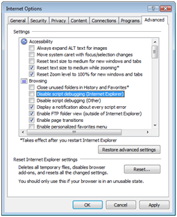
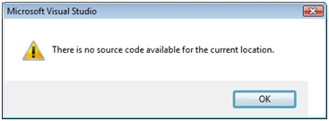
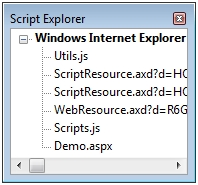
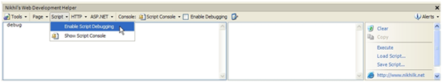
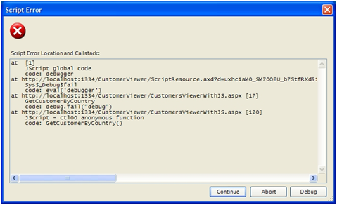
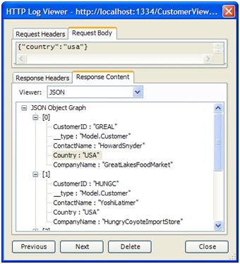
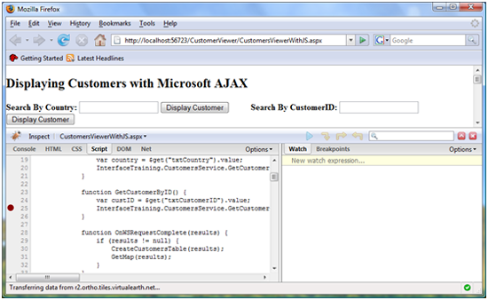

Understanding ASP.NET AJAX Debugging Capabilities
====================
by [Scott Cate](https://github.com/scottcate)

[Download PDF](http://download.microsoft.com/download/C/1/9/C19A3451-1D14-477C-B703-54EF22E197EE/AJAX_tutorial06_Debugging_MS_Ajax_Applications_cs.pdf)

> The ability to debug code is a skill that every developer should have in their arsenal regardless of the technology they're using. While many developers are accustomed to using Visual Studio .NET or Web Developer Express to debug ASP.NET applications that use VB.NET or C# code, some aren't aware that it's also extremely useful for debugging client-side code such as JavaScript. The same type of techniques used to debug .NET applications can also be applied to AJAX-enabled applications and more specifically ASP.NET AJAX applications.

## Debugging ASP.NET AJAX Applications

Dan Wahlin

The ability to debug code is a skill that every developer should have in their arsenal regardless of the technology they're using. It goes without saying that understanding the different debugging options that are available can save a tremendous amount of time on a project and perhaps even a few headaches. While many developers are accustomed to using Visual Studio .NET or Web Developer Express to debug ASP.NET applications that use VB.NET or C# code, some aren't aware that it's also extremely useful for debugging client-side code such as JavaScript. The same type of techniques used to debug .NET applications can also be applied to AJAX-enabled applications and more specifically ASP.NET AJAX applications.

In this article you'll see how Visual Studio 2008 and several other tools can be used to debug ASP.NET AJAX applications to quickly locate bugs and other issues. This discussion will include information about enabling Internet Explorer 6 or higher for debugging, using Visual Studio 2008 and the Script Explorer to step through code as well as using other free tools such as Web Development Helper. You'll also learn how to debug ASP.NET AJAX applications in Firefox using an extension named Firebug which lets you step through JavaScript code directly in the browser without any other tools. Finally, you'll be introduced to classes in the ASP.NET AJAX Library that can help with various debugging tasks such as tracing and code assertion statements.

Before you try to debug pages viewed in Internet Explorer there are a few basic steps you'll need to perform to enable it for debugging. Let's take a look at some basic setup requirements that need to be performed to get started.

## Configuring Internet Explorer for Debugging

Most people aren't interested in seeing JavaScript issues encountered on a Website viewed with Internet Explorer. In fact, the average user wouldn't even know what to do if they saw an error message. As a result, debugging options are turned off by default in the browser. However, it's very straightforward to turn debugging on and put it to use as you develop new AJAX applications.

To enable debugging functionality, go to Tools Internet Options on the Internet Explorer menu and select the Advanced tab. Within the Browsing section ensure that the following items are unchecked:

- Disable script debugging (Internet Explorer)
- Disable script debugging (Other)

Although not required, if you're trying to debug an application you'll probably want any JavaScript errors in the page to be immediately visible and obvious. You can force all errors to be shown with a message box by checking the "Display a notification about every script error" checkbox. While this is a great option to turn on while you're developing an application, it can quickly become annoying if you're just perusing other Websites since your chances of encountering JavaScript errors are pretty good.

Figure 1 shows what the Internet Explorer advanced dialog should look after it has been properly configured for debugging.

**Figure 1**: Configuring Internet Explorer for debugging.  ([Click to view full-size image](understanding-asp-net-ajax-debugging-capabilities/_static/image3.png))

Once debugging has been turned on, you'll see a new menu item appear in the View menu named Script Debugger. It has two options available including Open and Break at Next Statement. When Open is selected you'll be prompted to debug the page in Visual Studio 2008 (note that Visual Web Developer Express can also be used for debugging). If Visual Studio .NET is currently running you can choose to use that instance or to create a new instance. When Break at Next Statement is selected you'll be prompted to debug the page when JavaScript code is executed. If JavaScript code executes in the onLoad event of the page you can refresh the page to trigger a debug session. If JavaScript code is run after a button is clicked then the debugger will run immediately after the button is clicked.

> *> [!NOTE]
> if you are running on Windows Vista with User Access Control (UAC) enabled, and you have Visual Studio 2008 set to run as an administrator, Visual Studio will fail to attach to the process when you are prompted to attach. To work around this issue, start Visual Studio first, and use that instance to debug.*

Although the next section will demonstrate how to debug an ASP.NET AJAX page directly from within Visual Studio 2008, using the Internet Explorer Script Debugger option is useful when a page is already open and you'd like to more fully inspect it.

## Debugging with Visual Studio 2008

Visual Studio 2008 provides debugging functionality that developers around the world rely on everyday to debug .NET applications. The built-in debugger allows you to step through code, view object data, watch for specific variables, monitor the call stack plus much more. In addition to debugging VB.NET or C# code, the debugger is also helpful for debugging ASP.NET AJAX applications and will allow you to step through JavaScript code line by line. The details that follow focus on techniques that can be used to debug client-side script files rather than providing a discourse on the overall process of debugging applications using Visual Studio 2008.

The process of debugging a page in Visual Studio 2008 can be started in several different ways. First, you can use the Internet Explorer Script Debugger option mentioned in the previous section. This works well when a page is already loaded in the browser and you'd like to start debugging it. Alternatively, you can right-click on an .aspx page in the Solution Explorer and select Set As Start Page from the menu. If you're accustomed to debugging ASP.NET pages then you've probably done this before. Once F5 is pressed the page can be debugged. However, while you can generally set a breakpoint anywhere you'd like in VB.NET or C# code, that's not always the case with JavaScript as you'll see next.

*Embedded Versus External Scripts*

The Visual Studio 2008 debugger treats JavaScript embedded in a page different than external JavaScript files. With external script files, you can open the file and set a breakpoint on any line you choose. Breakpoints can be set by clicking in the grey tray area to the left of the code editor window. When JavaScript is embedded directly into a page using the `<script>` tag, setting a breakpoint by clicking in the grey tray area isn't an option. Attempts to set a breakpoint on a line of embedded script will result in a warning that states "This is not a valid location for a breakpoint".

You can get around this issue by moving the code into an external .js file and referencing it using the src attribute of the &lt;script&gt; tag:

[!code-html[Main](understanding-asp-net-ajax-debugging-capabilities/samples/sample1.html)]

What if moving the code into an external file isn't an option or requires more work than it's worth? While you can't set a breakpoint using the editor, you can add the debugger statement directly into the code where you'd like to start debugging. You can also use the Sys.Debug class available in the ASP.NET AJAX library to force debugging to start. You'll learn more about the Sys.Debug class later in this article.

An example of using the `debugger` keyword is shown in Listing 1. This example forces the debugger to break right before a call to an update function is made.

**Listing 1. Using the debugger keyword to force the Visual Studio .NET debugger to break.**

[!code-javascript[Main](understanding-asp-net-ajax-debugging-capabilities/samples/sample2.js)]

Once the debugger statement is hit you will be prompted to debug the page using Visual Studio .NET and can begin stepping through the code. While doing this you may encounter an issue with accessing ASP.NET AJAX library script files used in the page so let's take a look at using Visual Studio .NET's Script Explorer.

## Using Visual Studio .NET Windows to Debug

Once a debug session is started and you begin walking through code using the default F11 key, you may encounter the error dialog shown in see Figure 2 unless all script files used in the page are open and available for debugging.

**Figure 2**: Error dialog shown when no source code is available for debugging.  ([Click to view full-size image](understanding-asp-net-ajax-debugging-capabilities/_static/image6.png))

This dialog is shown because Visual Studio .NET isn't sure how to get to the source code of some of the scripts referenced by the page. While this can be quite frustrating at first, there's a simple fix. Once you have started a debug session and hit a breakpoint, go to the Debug Windows Script Explorer window on the Visual Studio 2008 menu or use the Ctrl+Alt+N hotkey.

> *> [!NOTE]
> If you can't see the Script Explorer menu listed, go to Tools* *Customize* *Commands on the Visual Studio .NET menu. Locate the Debug entry in the Categories section and click it to show all available menu entries. In the Commands list, scroll down to Script Explorer and then drag it up onto the Debug* *Windows menu in mentioned earlier. Doing this will make the Script Explorer menu entry available each time you run Visual Studio .NET.*

The Script Explorer can be used to view all scripts used in a page and open them in the code editor. Once the Script Explorer is open, double-click on the .aspx page currently being debugged to open it in the code editor window. Perform the same action for all of the other scripts shown in the Script Explorer. Once all of the scripts are open in the code window you can press F11 (and use the other debug hotkeys) to step through your code. Figure 3 shows an example of the Script Explorer. It lists the current file being debugged (Demo.aspx) as well as two custom scripts and two scripts dynamically injected into the page by the ASP.NET AJAX ScriptManager.

**Figure 3**. The Script Explorer provides easy access to scripts used in a page.  ([Click to view full-size image](understanding-asp-net-ajax-debugging-capabilities/_static/image9.png))

Several others windows can also be used to provide useful information as you step through code in a page. For example, you can use the Locals window to see the values of different variables used in the page, the Immediate window to evaluate specific variables or conditions and view the output. You can also use the Output window to view trace statements written out using the Sys.Debug.trace function (which will be covered later in this article) or Internet Explorer's Debug.writeln function.

As you step through code using the debugger you can mouse over variables in the code to view the value that they are assigned. However, the script debugger occasionally won't show anything as you mouse over a given JavaScript variable. To see the value, highlight the statement or variable you're trying to see in the code editor window and then mouse over it. Although this technique doesn't work in every situation, many times you will be able to see the value without having to look in a different debug window such as the Locals window.

A video tutorial demonstrating some of the features discussed here can be viewed at [http://www.xmlforasp.net](http://www.xmlforasp.net).

## Debugging With Web Development Helper

Although Visual Studio 2008 (and Visual Web Developer Express 2008) are very capable debugging tools, there are additional options that can be used as well which are more light-weight. One of the latest tools to be released is the Web Development Helper. Microsoft's Nikhil Kothari (one of the key ASP.NET AJAX architects at Microsoft) wrote this excellent tool which can perform many different tasks from simple debugging to viewing HTTP request and response messages. Web Development Helper can be downloaded at [http://projects.nikhilk.net/Projects/WebDevHelper.aspx](http://projects.nikhilk.net/Projects/WebDevHelper.aspx).

Web Development helper can be used directly inside of Internet Explorer which makes it convenient to use. It's started by selecting Tools Web Development Helper from the Internet Explorer menu. This will open the tool in the bottom portion of the browser which is nice since you don't have to leave the browser to perform several tasks such as HTTP request and response message logging. Figure 4 shows what Web Development Helper looks like in action.

**Figure 4**: Web Development Helper  ([Click to view full-size image](understanding-asp-net-ajax-debugging-capabilities/_static/image12.png))

Web Development helper isn't a tool you'll use to step through code line by line as with Visual Studio 2008. However, it can be used to view trace output, easily evaluate variables in a script or explore data is inside of a JSON object. It's also very useful for viewing data that is passed to and from an ASP.NET AJAX page and a server.

Once Web Development Helper is open in Internet Explorer, script debugging must be enabled by selecting Script Enable Script Debugging from the Web Development helper menu as shown earlier in Figure 4. This enables the tool to intercept errors that occur as a page is run. It also allows easy access to trace messages that are output in the page. To view trace information or execute script commands to test different functions within a page, select Script Show Script Console from the Web Development Helper menu. This provides access to a command window and a simple immediate window.

*Viewing Trace Messages and JSON Object Data*

The immediate window can be used to execute script commands or even load or save scripts that are used to test different functions in a page. The command window displays trace or debug messages written out by the page being viewed. Listing 2 shows how to write a trace message using Internet Explorer's Debug.writeln function.

**Listing 2. Writing out a client-side trace message using the Debug class.**

[!code-javascript[Main](understanding-asp-net-ajax-debugging-capabilities/samples/sample3.js)]

If the LastName property contains a value of Doe, Web Development Helper will display the message "Person name: Doe" in the script console's command window (assuming that debugging has been enabled). Web Development Helper also adds a top-level debugService object into pages that can be used to write out trace information or view the content of JSON objects. Listing 3 shows an example of using the debugService class's trace function.

**Listing 3. Using Web Development Helper's debugService class to write a trace message.**

[!code-javascript[Main](understanding-asp-net-ajax-debugging-capabilities/samples/sample4.js)]

A nice feature of the debugService class is that it will work even if debugging isn't enabled in Internet Explorer making it easy to always access trace data when Web Development Helper is running. When the tool isn't being used to debug a page, trace statements will be ignored since the call to window.debugService will return false.

The debugService class also allows JSON object data to be viewed using Web Development Helper's inspector window. Listing 4 creates a simple JSON object containing person data. Once the object is created, a call is made to the debugService class's inspect function to allow the JSON object to be visually inspected.

**Listing 4. Using the debugService.inspect function to view JSON object data.**

[!code-javascript[Main](understanding-asp-net-ajax-debugging-capabilities/samples/sample5.js)]

Calling the GetPerson() function in the page or through the immediate window will result in the Object Inspector dialog window appearing as shown in Figure 5. Properties within the object can be changed dynamically by highlighting them, changing the value shown in the Value text box and then clicking the Update link. Using the Object Inspector makes it straightforward to view JSON object data and experiment with applying different values to properties.

*Debugging Errors*

In addition to allowing trace data and JSON objects to be displayed, Web Development helper can also aid in debugging errors in a page. If an error is encountered, you will be prompted to continue to the next line of code or debug the script (see Figure 6). The Script Error dialog window shows the complete call stack as well as line numbers so you can easily identify where issues are within a script.

**Figure 5**: Using the Object Inspector window to view a JSON object.  ([Click to view full-size image](understanding-asp-net-ajax-debugging-capabilities/_static/image15.png))

Selecting the debug option allows you to execute script statements directly in Web Development Helper's immediate window to view the value of variables, write out JSON objects, plus more. If the same action that triggered the error is performed again and Visual Studio 2008 is available on the machine, you will be prompted to start a debug session so that you can step through the code line by line as discussed in the previous section.

**Figure 6**: Web Development Helper's Script Error Dialog  ([Click to view full-size image](understanding-asp-net-ajax-debugging-capabilities/_static/image18.png))

*Inspecting Request and Response Messages*

While debugging ASP.NET AJAX pages it is often useful to see request and response messages sent between a page and server. Viewing the content within messages allows you to see if the proper data is being passed as well as the size of the messages. Web Development Helper provides an excellent HTTP message logger feature that makes it easy to view data as raw text or in a more readable format.

To view ASP.NET AJAX request and response messages, the HTTP logger must be enabled by selecting HTTP Enable HTTP Logging from the Web Development Helper menu. Once enabled, all messages sent from the current page can be viewed in the HTTP log viewer which can be accessed by selecting HTTP Show HTTP Logs.

Although viewing the raw text sent in each request/response message is certainly useful (and an option in Web Development Helper), it is often easier to view message data in a more graphical format. Once HTTP logging has been enabled and messages have been logged, message data can be viewed by double-clicking on the message in the HTTP log viewer. Doing this allows you to view all headers associated with a message as well as the actual message content. Figure 7 shows an example of a request message and response message viewed in the HTTP Log Viewer window.

**Figure 7**: Using the HTTP Log Viewer to view request and response message data.  ([Click to view full-size image](understanding-asp-net-ajax-debugging-capabilities/_static/image21.png))

The HTTP Log Viewer automatically parses JSON objects and displays them using a tree view making it quick and easy to view the object's property data. When an UpdatePanel is being used in an ASP.NET AJAX page, the viewer breaks out each portion of the message into individual parts as shown in Figure 8. This is a great feature that makes it much easier to see and understand what is in the message as compared to viewing the raw message data.

**Figure 8**: An UpdatePanel response message viewed using the HTTP Log Viewer.  ([Click to view full-size image](understanding-asp-net-ajax-debugging-capabilities/_static/image24.png))

There are several other tools that can be used to view request and response messages in addition to Web Development Helper. Another good option is Fiddler which is available for free at [http://www.fiddlertool.com](http://www.fiddlertool.com). Although Fiddler will not be discussed here, it is also a good option when you need to thoroughly inspect message headers and data.

## Debugging with Firefox and Firebug

While Internet Explorer is still the most widely used browser, other browsers such as Firefox have become quite popular and are being used more and more. As a result, you'll want to view and debug your ASP.NET AJAX pages in Firefox as well as Internet Explorer to ensure that your applications work properly. Although Firefox can't tie directly into Visual Studio 2008 for debugging, it has an extension called Firebug that can be used to debug pages. Firebug can be downloaded for free by going to [http://www.getfirebug.com](http://www.getfirebug.com).

Firebug provides a full-featured debugging environment that can be used to step through code line by line, access all scripts used within a page, view DOM structures, display CSS styles and even track events that occur in a page. Once installed, Firebug can be accessed by selecting Tools Firebug Open Firebug from the Firefox menu. Like Web Development Helper, Firebug is used directly in the browser although it can also be used as a stand-alone application.

Once Firebug is running, breakpoints can be set on any line of a JavaScript file whether the script is embedded in a page or not. To set a breakpoint, first load the appropriate page you'd like to debug in Firefox. Once the page is loaded, select the script to debug from Firebug's Scripts drop-down list. All scripts used by the page will be shown. A breakpoint is set by clicking in Firebug's grey tray area on the line where the breakpoint should go must like you would do in Visual Studio 2008.

Once a breakpoint has been set in Firebug you can perform the action required to execute the script that needs to be debugged such as clicking a button or refreshing the browser to trigger the onLoad event. Execution will automatically stop on the line containing the breakpoint. Figure 9 shows an example of a breakpoint that has been triggered in Firebug.

**Figure 9**: Handling breakpoints in Firebug.  ([Click to view full-size image](understanding-asp-net-ajax-debugging-capabilities/_static/image27.png))

Once a breakpoint is hit you can step into, step over or step out of code using the arrow buttons. As you step through code, script variables are displayed in the right-hand portion of the debugger allowing you to see values and drill-down into objects. Firebug also includes a Call Stack drop-down list to view the script's execution steps that led up to the current line being debugged.

Firebug also includes a console window that can be used to test different script statements, evaluate variables and view trace output. It is accessed by clicking on the Console tab at the top of the Firebug window. The page being debugged can also be "inspected" to see its DOM structure and contents by clicking on the Inspect tab. As you mouse over the different DOM elements shown in the inspector window the appropriate portion of the page will be highlighted making it easy to see where the element is used in the page. Attribute values associated with a given element can be changed "live" to experiment with applying different widths, styles, etc. to an element. This is a nice feature that saves you from having to constantly switch between the source code editor and the Firefox browser to view how simple changes affect a page.

Figure 10 shows an example of using the DOM inspector to locate a textbox named txtCountry in the page. The Firebug inspector can also be used to view CSS styles used in a page as well as events that occur such as tracking mouse movements, button clicks, plus more.

**Figure 10**: Using Firebug's DOM inspector.  ([Click to view full-size image](understanding-asp-net-ajax-debugging-capabilities/_static/image30.png))

Firebug provides a light-weight way to quickly debug a page directly in Firefox as well as an excellent tool for inspecting different elements within the page.

## Debugging Support in ASP.NET AJAX

The ASP.NET AJAX library includes many different classes that can be used to simplify the process of adding AJAX capabilities into a Webpage. You can use these classes to locate elements within a page and manipulate them, add new controls, call Web Services and even handle events. The ASP.NET AJAX library also contains classes that can be used to enhance the process of debugging pages. In this section you'll be introduced to the Sys.Debug class and see how it can be used in applications.

*Using the Sys.Debug class*

The Sys.Debug class (a JavaScript class located in the Sys namespace) can be used to perform several different functions including writing trace output, performing code assertions and forcing code to fail so that it can be debugged. It is used extensively in the ASP.NET AJAX library's debug files (installed at C:\Program Files\Microsoft ASP.NET\ASP.NET 2.0 AJAX Extensions\v1.0.61025\MicrosoftAjaxLibrary\System.Web.Extensions\1.0.61025.0 by default) to perform conditional tests (called assertions) that ensure parameters are passed properly to functions, that objects contain the expected data and to write trace statements.

The Sys.Debug class exposes several different functions that can be used to handle tracing, code assertions or failures as shown in Table 1.

**Table 1. Sys.Debug class functions.**

| **Function Name** | **Description** |
| --- | --- |
| assert(condition, message, displayCaller) | Asserts that the condition parameter is true. If the condition being tested is false, a message box will be used to display the message parameter value. If the displayCaller parameter is true, the method also displays information about the caller. |
| clearTrace() | Erases statements output from tracing operations. |
| fail(message) | Causes the program to stop execution and break into the debugger. The message parameter can be used to provide a reason for the failure. |
| trace(message) | Writes the message parameter to the trace output. |
| traceDump(object, name) | Outputs an object's data in a readable format. The name parameter can be used to provide a label for the trace dump. Any sub-objects within the object being dumped will be written out by default. |

Client-side tracing can be used in much the same way as the tracing functionality available in ASP.NET. It allows different messages to easily be seen without interrupting the flow of the application. Listing 5 shows an example of using the Sys.Debug.trace function to write to the trace log. This function simply takes the message that should be written out as a parameter.

**Listing 5. Using the Sys.Debug.trace function.**

[!code-javascript[Main](understanding-asp-net-ajax-debugging-capabilities/samples/sample6.js)]

If you execute the code shown in Listing 5 you won't see any trace output in the page. The only way to see it is to use a console window available in Visual Studio .NET, Web Development Helper or Firebug. If you do want to see the trace output in the page then you'll need to add a TextArea tag and give it an id of TraceConsole as shown next:

[!code-html[Main](understanding-asp-net-ajax-debugging-capabilities/samples/sample7.html)]

Any Sys.Debug.trace statements in the page will be written to the TraceConsole TextArea.

In cases where you want to see the data contained within a JSON object you can use the Sys.Debug class's traceDump function. This function takes two parameters including the object that should be dumped to the trace console and a name that can be used to identify the object in the trace output. Listing 6 shows an example of using the traceDump function.

**Listing 6. Using the Sys.Debug.traceDump function.**

[!code-javascript[Main](understanding-asp-net-ajax-debugging-capabilities/samples/sample8.js)]

Figure 11 shows the output from calling the Sys.Debug.traceDump function. Notice that in addition to writing out the Person object's data, it also writes out the Address sub-object's data.

In addition to tracing, the Sys.Debug class can also be used to perform code assertions. Assertions are used to test that specific conditions are met while an application is running. The debug version of the ASP.NET AJAX library scripts contain several assert statements to test a variety of conditions.

Listing 7 shows an example of using the Sys.Debug.assert function to test a condition. The code tests whether or not the Address object is null before updating a Person object.

**Figure 11**: Output of the Sys.Debug.traceDump function.  ([Click to view full-size image](understanding-asp-net-ajax-debugging-capabilities/_static/image33.png))

**Listing 7. Using the debug.assert function.**

[!code-javascript[Main](understanding-asp-net-ajax-debugging-capabilities/samples/sample9.js)]

Three parameters are passed including the condition to evaluate, the message to display if the assertion returns false and whether or not information about the caller should be displayed. In cases where an assertion fails, the message will be displayed as well as caller information if the third parameter was true. Figure 12 shows an example of the failure dialog that appears if the assertion shown in Listing 7 fails.

The final function to cover is Sys.Debug.fail. When you want to force code to fail on a particular line in a script you can add a Sys.Debug.fail call rather than the debugger statement typically used in JavaScript applications. The Sys.Debug.fail function accepts a single string parameter that represents the reason for the failure as shown next:

[!code-css[Main](understanding-asp-net-ajax-debugging-capabilities/samples/sample10.css)]

**Figure 12**: A Sys.Debug.assert failure message.  ([Click to view full-size image](understanding-asp-net-ajax-debugging-capabilities/_static/image36.png))

When a Sys.Debug.fail statement is encountered while a script is executing, the value of the message parameter will be displayed in the console of a debug application such as Visual Studio 2008 and you'll be prompted to debug the application. One case where this can be quite useful is when you can't set a breakpoint with Visual Studio 2008 on an inline script but would like the code to stop on particular line so you can inspect the value of variables.

*Understanding the ScriptManager Control's ScriptMode Property*

The ASP.NET AJAX library includes debug and release script versions that are installed at C:\Program Files\Microsoft ASP.NET\ASP.NET 2.0 AJAX Extensions\v1.0.61025\MicrosoftAjaxLibrary\System.Web.Extensions\1.0.61025.0 by default. The debug scripts are nicely formatted, easy to read and have several Sys.Debug.assert calls scattered throughout them while the release scripts have whitespace stripped out and use the Sys.Debug class sparingly to minimize their overall size.

The ScriptManager control added to ASP.NET AJAX pages reads the compilation element's debug attribute in web.config to determine which versions of library scripts to load. However, you can control if debug or release scripts are loaded (library scripts or your own custom scripts) by changing the ScriptMode property. ScriptMode accepts a ScriptMode enumeration whose members include Auto, Debug, Release and Inherit.

ScriptMode defaults to a value of Auto which means that the ScriptManager will check the debug attribute in web.config. When debug is false the ScriptManager will load the release version of ASP.NET AJAX library scripts. When debug is true the debug version of the scripts will be loaded. Changing the ScriptMode property to Release or Debug will force the ScriptManager to load the appropriate scripts regardless of what value the debug attribute has in web.config. Listing 8 shows an example of using the ScriptManager control to load debug scripts from the ASP.NET AJAX library.

**Listing 8. Loading debug scripts using the ScriptManager**.

[!code-aspx[Main](understanding-asp-net-ajax-debugging-capabilities/samples/sample11.aspx)]

You can also load different versions (debug or release) of your own custom scripts by using the ScriptManager's Scripts property along with the ScriptReference component as shown in Listing 9.

**Listing 9. Loading custom scripts using the ScriptManager.**

[!code-aspx[Main](understanding-asp-net-ajax-debugging-capabilities/samples/sample12.aspx)]

> [!NOTE]
> If you're loading custom scripts using the ScriptReference component you must notify the ScriptManager when the script has finished loading by adding the following code at the bottom of the script:

[!code-csharp[Main](understanding-asp-net-ajax-debugging-capabilities/samples/sample13.cs)]

The code shown in Listing 9 tells the ScriptManager to look for a debug version of the Person script so it will automatically look for Person.debug.js instead of Person.js. If the Person.debug.js file is not found an error will be raised.

In cases where you want a debug or release version of a custom script to be loaded based upon the value of the ScriptMode property set on the ScriptManager control, you can set the ScriptReference control's ScriptMode property to Inherit. This will cause the proper version of the custom script to be loaded based upon the ScriptManager's ScriptMode property as shown in Listing 10. Because the ScriptMode property of the ScriptManager control is set to Debug, the Person.debug.js script will be loaded and used in the page.

**Listing 10. Inheriting the ScriptMode from the ScriptManager for custom scripts.**

[!code-aspx[Main](understanding-asp-net-ajax-debugging-capabilities/samples/sample14.aspx)]

By using the ScriptMode property appropriately you can more easily debug applications and simplify the overall process. The ASP.NET AJAX library's release scripts are rather difficult to step through and read since code formatting has been removed while the debug scripts are formatted specifically for debugging purposes.

## Conclusion

Microsoft's ASP.NET AJAX technology provides a solid foundation for building AJAX-enabled applications that can enhance the end user's overall experience. However, as with any programming technology, bugs and other application issues will certainly arise. Knowing about the different debugging options available can save a lot of time and result in a more stable product.

In this article you've been introduced to several different techniques for debugging ASP.NET AJAX pages including Internet Explorer with Visual Studio 2008, Web Development Helper and Firebug. These tools can simplify the overall debugging process since you can access variable data, walk through code line by line and view trace statements. In addition to the different debugging tools discussed, you also saw how the ASP.NET AJAX library's Sys.Debug class can be used in an application and how the ScriptManager class can be used to load debug or release versions of scripts.

## Bio

Dan Wahlin (Microsoft Most Valuable Professional for ASP.NET and XML Web Services) is a .NET development instructor and architecture consultant at Interface Technical Training ([www.interfacett.com)](http://www.interfacett.com). Dan founded the XML for ASP.NET Developers Web site ([www.XMLforASP.NET](http://www.XMLforASP.NET)), is on the INETA Speaker's Bureau and speaks at several conferences. Dan co-authored Professional Windows DNA (Wrox), ASP.NET: Tips, Tutorials and Code (Sams), ASP.NET 1.1 Insider Solutions, Professional ASP.NET 2.0 AJAX (Wrox), ASP.NET 2.0 MVP Hacks and authored XML for ASP.NET Developers (Sams). When he's not writing code, articles or books, Dan enjoys writing and recording music and playing golf and basketball with his wife and kids.

Scott Cate has been working with Microsoft Web technologies since 1997 and is the President of myKB.com ([www.myKB.com](http://www.myKB.com)) where he specializes in writing ASP.NET based applications focused on Knowledge Base Software solutions. Scott can be contacted via email at [scott.cate@myKB.com](mailto:scott.cate@myKB.com) or his blog at [ScottCate.com](http://ScottCate.com)

>[!div class="step-by-step"]
[Previous](understanding-asp-net-ajax-web-services.md)