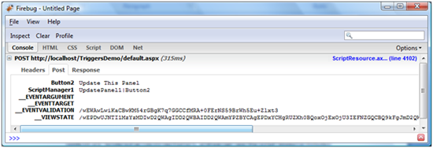
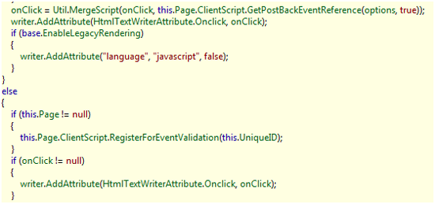

Understanding ASP.NET AJAX UpdatePanel Triggers
====================
by [Scott Cate](https://github.com/scottcate)

[Download PDF](http://download.microsoft.com/download/C/1/9/C19A3451-1D14-477C-B703-54EF22E197EE/AJAX_tutorial02_Triggers_cs.pdf)

> When working in the markup editor in Visual Studio, you may notice (from IntelliSense) that there are two child elements of an UpdatePanel control. One of which is the Triggers element, which specifies the controls on the page (or the user control, if you are using one) that will trigger a partial render of the UpdatePanel control in which the element resides.

## Introduction

Microsoft's ASP.NET technology brings an object-oriented and event-driven programming model and unites it with the benefits of compiled code. However, its server-side processing model has several drawbacks inherent in the technology, many of which can be addressed by the new features included in the Microsoft ASP.NET 3.5 AJAX Extensions. These extensions enable many new rich client features, including partial rendering of pages without requiring a full page refresh, the ability to access Web Services via client script (including the ASP.NET profiling API), and an extensive client-side API designed to mirror many of the control schemes seen in the ASP.NET server-side control set.

This whitepaper examines the XML Triggers functionality of the ASP.NET AJAX `UpdatePanel` component. XML Triggers give granular control over the components that can cause partial rendering for specific UpdatePanel controls.

This whitepaper is based on the Beta 2 release of the .NET Framework 3.5 and Visual Studio 2008. The ASP.NET AJAX Extensions, previously an add-on assembly targeted at ASP.NET 2.0, are now integrated into the .NET Framework Base Class Library. This whitepaper also assumes that you will be working with Visual Studio 2008, not Visual Web Developer Express, and will provide walkthroughs according to the user interface of Visual Studio (although code listings will be entirely compatible regardless of development environment).

## *Triggers*

Triggers for a given UpdatePanel, by default, automatically include any child controls that invoke a postback, including (for example) TextBox controls that have their `AutoPostBack` property set to **true**. However, triggers can also be included declaratively using markup; this is done within the `<triggers>` section of the UpdatePanel control declaration. Although triggers can be accessed via the `Triggers` collection property, it is recommended that you register any partial render triggers at run-time (for instance, if a control is not available at design time) by using the `RegisterAsyncPostBackControl(Control)` method of the ScriptManager object for your page, within the `Page_Load` event. Remember that Pages are stateless, and so you should re-register these controls every time they are created.

Automatic child trigger inclusion can also be disabled (so that child controls that create postbacks do not automatically trigger partial renders) by setting the `ChildrenAsTriggers` property to **false**. This allows you the greatest flexibility in assigning which specific controls may invoke a page render, and is recommended, so that a developer will opt-in to respond to an event, rather than handling any events that may arise.

Note that when UpdatePanel controls are nested, when the UpdateMode is set to **Conditional**, if the child UpdatePanel is triggered, but the parent is not, then only the child UpdatePanel will refresh. However, if the parent UpdatePanel is refreshed, then the child UpdatePanel will also be refreshed.

## *The &lt;Triggers&gt; Element*

When working in the markup editor in Visual Studio, you may notice (from IntelliSense) that there are two child elements of an `UpdatePanel` control. The most-frequently seen element is the `<ContentTemplate>` element, which essentially encapsulates the content that will be held by the update panel (the content for which we are enabling partial rendering). The other element is the `<Triggers>` element, which specifies the controls on the page (or the user control, if you are using one) that will trigger a partial render of the UpdatePanel control in which the &lt;Triggers&gt; element resides.

The `<Triggers>` element can contain any number each of two child nodes: `<asp:AsyncPostBackTrigger>` and `<asp:PostBackTrigger>`. They both accept two attributes, `ControlID` and `EventName`, and can specify any Control within the current unit of encapsulation (for instance, if your UpdatePanel control resides within a Web User Control, you should not attempt to reference a Control on the Page on which the User Control will reside).

The `<asp:AsyncPostBackTrigger>` element is particularly useful in that it can target any event from a Control that exists as a child of *any* UpdatePanel control in the unit of encapsulation, not just the UpdatePanel under which this trigger is a child. Thus, any control can be made to trigger a partial page update.

Similarly, the `<asp:PostBackTrigger>` element can be used to trigger a partial page render, but one that requires a full round-trip to the server. This trigger element can also be used to force a full page render when a control would otherwise normally trigger a partial page render (for instance, when a `Button` control exists in the `<ContentTemplate>` element of an UpdatePanel control). Again, the PostBackTrigger element can specify any control that is a child of any UpdatePanel control in the current unit of encapsulation.

## *&lt;Triggers&gt; Element Reference*

*Markup Descendants:*

| **Tag** | **Description** |
| --- | --- |
| &lt;asp:AsyncPostBackTrigger&gt; | Specifies a control and event that will cause a partial page update for the UpdatePanel that contains this trigger reference. |
| &lt;asp:PostBackTrigger&gt; | Specifies a control and event that will cause a full page update (a full page refresh). This tag can be used to force a full refresh when a control would otherwise trigger partial rendering. |

## *Walkthrough: Cross-UpdatePanel Triggers*

1. Create a new ASP.NET page with a ScriptManager object set to enable partial rendering. Add two UpdatePanels to this page - in the first, include a Label control ( Label1 ) and two Button controls ( Button1 and Button2 ). Button1 should say Click to Update Both and Button2 should say Click to Update This, or something along those lines. In the second UpdatePanel, include only a Label control ( Label2 ), but set its ForeColor property to something other than the default to differentiate it.
2. Set the UpdateMode property of both UpdatePanel tags to **Conditional**.

**Listing 1: Markup for default.aspx:** 

[!code-aspx[Main](understanding-asp-net-ajax-updatepanel-triggers/samples/sample1.aspx)]

1. In the Click event handler for Button1, set Label1.Text and Label2.Text to something time-dependent (such as DateTime.Now.ToLongTimeString()). For the Click event handler for Button2, set only Label1.Text to the time-dependent value.

**Listing 2: Codebehind (trimmed) in default.aspx.cs:** 

[!code-csharp[Main](understanding-asp-net-ajax-updatepanel-triggers/samples/sample2.cs)]

1. Press F5 to build and run the project. Note that, when you click Update Both Panels, both labels change text; however, when you click Update This Panel, only Label1 updates.

([Click to view full-size image](understanding-asp-net-ajax-updatepanel-triggers/_static/image3.png))

## *Under the Hood*

Utilizing the example we just constructed, we can take a look at what ASP.NET AJAX is doing and how our UpdatePanel cross-panel triggers work. To do so, we will work with the generated page source HTML, as well as the Mozilla Firefox extension called FireBug - with it, we can easily examine the AJAX postbacks. We will also use the .NET Reflector tool by Lutz Roeder. Both of these tools are freely available online, and can be found with an internet search.

An examination of the page source code shows almost nothing out of the ordinary; the UpdatePanel controls are rendered as `
` containers, and we can see the script resource includes provided by the `<asp:ScriptManager>`. There are also some new AJAX-specific calls to the PageRequestManager that are internal to the AJAX client script library. Finally, we see the two UpdatePanel containers - one with the rendered `<input>` buttons with the two `<asp:Label>` controls rendered as `` containers. (If you inspect the DOM tree in FireBug, you will notice that the labels are dimmed to indicate that they are not producing visible content).

Click the Update This Panel button, and notice the top UpdatePanel will be updated with the current server time. In FireBug, choose the Console tab so that you can examine the request. Examine the POST request parameters first:

([Click to view full-size image](understanding-asp-net-ajax-updatepanel-triggers/_static/image6.png))

Note that the UpdatePanel has indicated to the server-side AJAX code precisely which control tree was fired via the ScriptManager1 parameter: `Button1` of the `UpdatePanel1` control. Now, click on the Update Both Panels button. Then, examining the response, we see a pipe-delimited series of variables set in a string; specifically, we see the top UpdatePanel, `UpdatePanel1`, has the entirety of its HTML sent to the browser. The AJAX client script library substitutes the UpdatePanel's original HTML content with the new content via the `.innerHTML` property, and so the server sends the changed content from the server as HTML.

Now, click on the Update Both Panels button and examine the results from the server. The results are very similar - both UpdatePanels receive new HTML from the server. As with the previous callback, additional page state is sent.

As we can see, because no special code is utilized to perform an AJAX postback, the AJAX client script library is able to intercept form postbacks without any additional code. Server controls automatically utilize JavaScript so that they do not automatically submit the form - ASP.NET automatically injects code for form validation and state already, primarily achieved by automatic script resource inclusion, the PostBackOptions class, and the ClientScriptManager class.

For instance, consider a CheckBox control; examine the class disassembly in .NET Reflector. To do so, ensure that your System.Web assembly is open, and navigate to the `System.Web.UI.WebControls.CheckBox` class, opening the `RenderInputTag` method. Look for a conditional that checks the `AutoPostBack` property:

([Click to view full-size image](understanding-asp-net-ajax-updatepanel-triggers/_static/image9.png))

When automatic postback is enabled on a `CheckBox` control (via the AutoPostBack property being true), the resultant `<input>` tag is therefore rendered with an ASP.NET event handling script in its `onclick` attribute. The interception of the form's submission, then, allows ASP.NET AJAX to be injected into the page nonintrusively, helping to avoid any potential breaking changes that might occur by utilizing a possibly-imprecise string replacement. Furthermore, this enables *any* custom ASP.NET control to utilize the power of ASP.NET AJAX without any additional code to support its use within an UpdatePanel container.

The `<triggers>` functionality corresponds to the values initialized in the PageRequestManager call to \_updateControls (note that the ASP.NET AJAX client script library utilizes the convention that methods, events, and field names that begin with an underscore are marked as internal, and are not meant for use outside of the library itself). With it, we can observe which controls are intended to cause AJAX postbacks.

For example, let's add two additional controls to the page, leaving one control outside of the UpdatePanels entirely, and leaving one within an UpdatePanel. We will add a CheckBox control within the upper UpdatePanel, and drop a DropDownList with a number of colors defined within the list. Here is the new markup:

**Listing 3: New Markup**

[!code-aspx[Main](understanding-asp-net-ajax-updatepanel-triggers/samples/sample3.aspx)]

And here is the new code-behind:

**Listing 4: Codebehind**

[!code-csharp[Main](understanding-asp-net-ajax-updatepanel-triggers/samples/sample4.cs)]

The idea behind this page is that the drop-down list selects one of three colors to show the second label, that the check box determines both whether it is bold, and whether the labels display the date as well as the time. The check box should not cause an AJAX update, but the drop-down list should, even though it is not housed within an UpdatePanel.

([Click to view full-size image](understanding-asp-net-ajax-updatepanel-triggers/_static/image12.png))

As is apparent in the above screen shot, the most-recent button to be clicked was the right button Update This Panel, which updated the top time independent of the bottom time. The date was also switched off between clicks, as the date is visible in the bottom label. Finally of interest is the bottom label's color: it was updated more recently than the label's text, which demonstrates that control state is important, and users expect it to be preserved through AJAX postbacks. *However*, the time was not updated. The time was automatically repopulated through the persistence of the \_\_VIEWSTATE field of the page being interpreted by the ASP.NET runtime when the control was being re-rendered on the server. The ASP.NET AJAX server code does not recognize in which methods the controls are changing state; it simply repopulates from view state and then runs the events that are appropriate.

It should be pointed out, however, that had I initialized the time within the Page\_Load event, the time would have been incremented correctly. Consequently, developers should be wary that the appropriate code is being run during the appropriate event handlers, and avoid use of Page\_Load when a control event handler would be appropriate.

## Summary

The ASP.NET AJAX Extensions UpdatePanel control is versatile, and can utilize a number of methods for identifying control events that should cause it to be updated. It supports being updated automatically by its child controls, but can also respond to control events elsewhere on the page.

To reduce potential for server processing load, it is recommended that the `ChildrenAsTriggers` property of an UpdatePanel be set to `false`, and that events be opted-into rather than included by default. This also prevents any unneeded events from causing potentially-unwanted effects, including validation, and changes to input fields. These types of bugs may be difficult to isolate, because the page updates transparently to the user, and the cause may therefore not be immediately obvious.

By examining the inner workings of the ASP.NET AJAX form post interception model, we were able to determine that it utilizes the framework already provided by ASP.NET. In doing so, it preserves maximum compatibility with controls designed using the same framework, and intrudes minimally on any additional JavaScript written for the page.

## Bio

Rob Paveza is a senior .NET application developer at Terralever ([www.terralever.com](http://www.terralever.com)), a leading interactive marketing firm in Tempe, AZ. He can be reached at [robpaveza@gmail.com](mailto:robpaveza@gmail.com), and his blog is located at [http://geekswithblogs.net/robp/](http://geekswithblogs.net/robp/).

Scott Cate has been working with Microsoft Web technologies since 1997 and is the President of myKB.com ([www.myKB.com](http://www.myKB.com)) where he specializes in writing ASP.NET based applications focused on Knowledge Base Software solutions. Scott can be contacted via email at [scott.cate@myKB.com](mailto:scott.cate@myKB.com) or his blog at [ScottCate.com](http://ScottCate.com)

>[!div class="step-by-step"]
[Previous](understanding-partial-page-updates-with-asp-net-ajax.md)
[Next](understanding-asp-net-ajax-authentication-and-profile-application-services.md)