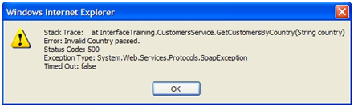
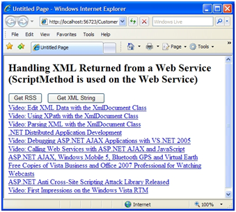

Understanding ASP.NET AJAX Web Services
====================
by [Scott Cate](https://github.com/scottcate)

[Download PDF](http://download.microsoft.com/download/C/1/9/C19A3451-1D14-477C-B703-54EF22E197EE/AJAX_tutorial05_Web_Services_with_MS_Ajax_cs.pdf)

> Web Services are an integral part of the .NET framework that provide a cross-platform solution for exchanging data between distributed systems. Although Web Services are normally used to allow different operating systems, object models and programming languages to send and receive data, they can also be used to dynamically inject data into an ASP.NET AJAX page or send data from a page to a back-end system. All of this can be done without resorting to postback operations.

## Calling Web Services with ASP.NET AJAX

Dan Wahlin

Web Services are an integral part of the .NET framework that provide a cross-platform solution for exchanging data between distributed systems. Although Web Services are normally used to allow different operating systems, object models and programming languages to send and receive data, they can also be used to dynamically inject data into an ASP.NET AJAX page or send data from a page to a back-end system. All of this can be done without resorting to postback operations.

While the ASP.NET AJAX UpdatePanel control provides a simple way to AJAX enable any ASP.NET page, there may be times when you need to dynamically access data on the server without using an UpdatePanel. In this article you'll see how to accomplish this by creating and consuming Web Services within ASP.NET AJAX pages.

This article will focus on functionality available in the core ASP.NET AJAX Extensions as well as a Web Service enabled control in the ASP.NET AJAX Toolkit called the AutoCompleteExtender. Topics covered include defining AJAX-enabled Web Services, creating client proxies and calling Web Services with JavaScript. You'll also see how Web Service calls can be made directly to ASP.NET page methods.

## Web Services Configuration

When a new Web Site project is created with Visual Studio 2008, the web.config file has a number of new additions that may be unfamiliar to users of previous versions of Visual Studio. Some of these modifications map the "asp" prefix to ASP.NET AJAX controls so they can be used in pages while others define required HttpHandlers and HttpModules. Listing 1 shows modifications made to the `<httpHandlers>` element in web.config that affects Web Service calls. The default HttpHandler used to process .asmx calls is removed and replaced with a ScriptHandlerFactory class located in the System.Web.Extensions.dll assembly. System.Web.Extensions.dll contains all of the core functionality used by ASP.NET AJAX.

**Listing 1. ASP.NET AJAX Web Service Handler Configuration**

[!code-xml[Main](understanding-asp-net-ajax-web-services/samples/sample1.xml)]

This HttpHandler replacement is made in order to allow JavaScript Object Notation (JSON) calls to be made from ASP.NET AJAX pages to .NET Web Services using a JavaScript Web Service proxy. ASP.NET AJAX sends JSON messages to Web Services as opposed to the standard Simple Object Access Protocol (SOAP) calls typically associated with Web Services. This results in smaller request and response messages overall. It also allows for more efficient client-side processing of data since the ASP.NET AJAX JavaScript library is optimized to work with JSON objects. Listing 2 and Listing 3 show examples of Web Service request and response messages serialized to JSON format. The request message shown in Listing 2 passes a country parameter with a value of "Belgium" while the response message in Listing 3 passes an array of Customer objects and their associated properties.

**Listing 2. Web Service Request Message Serialized to JSON**

[!code-json[Main](understanding-asp-net-ajax-web-services/samples/sample2.json)]

> *> [!NOTE]
> the operation name is defined as part of the URL to the web service; additionally, request messages are not always submitted via JSON. Web Services can utilize the ScriptMethod attribute with the UseHttpGet parameter set to true, which causes parameters to be passed via a the query string parameters.*

**Listing 3. Web Service Response Message Serialized to JSON**

[!code-json[Main](understanding-asp-net-ajax-web-services/samples/sample3.json)]

In the next section you'll see how to create Web Services capable of handling JSON request messages and responding with both simple and complex types.

## Creating AJAX-Enabled Web Services

The ASP.NET AJAX framework provides several different ways to call Web Services. You can use the AutoCompleteExtender control (available in the ASP.NET AJAX Toolkit) or JavaScript. However, before calling a service you have to AJAX-enable it so that it can be called by client-script code.

Whether or not you're new to ASP.NET Web Services, you'll find it straightforward to create and AJAX-enable services. The .NET framework has supported the creation of ASP.NET Web Services since its initial release in 2002 and the ASP.NET AJAX Extensions provide additional AJAX functionality that builds upon the .NET framework's default set of features. Visual Studio .NET 2008 Beta 2 has built-in support for creating .asmx Web Service files and automatically derives associated code beside classes from the System.Web.Services.WebService class. As you add methods into the class you must apply the WebMethod attribute in order for them to be called by Web Service consumers.

Listing 4 shows an example of applying the WebMethod attribute to a method named GetCustomersByCountry().

**Listing 4. Using the WebMethod Attribute in a Web Service**

[!code-csharp[Main](understanding-asp-net-ajax-web-services/samples/sample4.cs)]

The GetCustomersByCountry() method accepts a country parameter and returns a Customer object array. The country value passed into the method is forwarded to a business layer class which in turn calls a data layer class to retrieve the data from the database, fill the Customer object properties with data and return the array.

## Using the ScriptService Attribute

While adding the WebMethod attribute allows the GetCustomersByCountry() method to be called by clients that send standard SOAP messages to the Web Service, it doesn't allow JSON calls to be made from ASP.NET AJAX applications out of the box. To allow JSON calls to be made you have to apply the ASP.NET AJAX Extension's `ScriptService` attribute to the Web Service class. This enables a Web Service to send response messages formatted using JSON and allows client-side script to call a service by sending JSON messages.

Listing 5 shows an example of applying the ScriptService attribute to a Web Service class named CustomersService.

**Listing 5. Using the ScriptService Attribute to AJAX-enable a Web Service**

[!code-csharp[Main](understanding-asp-net-ajax-web-services/samples/sample5.cs)]

The ScriptService attribute acts as a marker that indicates it can be called from AJAX script code. It doesn't actually handle any of the JSON serialization or deserialization tasks that occur behind the scenes. The ScriptHandlerFactory (configured in web.config) and other related classes do the bulk of JSON processing.

## Using the ScriptMethod Attribute

The ScriptService attribute is the only ASP.NET AJAX attribute that has to be defined in a .NET Web Service in order for it to be used by ASP.NET AJAX pages. However, another attribute named ScriptMethod can also be applied directly to Web Methods in a service. ScriptMethod defines three properties including `UseHttpGet`, `ResponseFormat` and `XmlSerializeString`. Changing the values of these properties can be useful in cases where the type of request accepted by a Web Method needs to be changed to GET, when a Web Method needs to return raw XML data in the form of an `XmlDocument` or `XmlElement` object or when data returned from a service should always be serialized as XML instead of JSON.

The UseHttpGet property can be used when a Web Method should accept GET requests as opposed to POST requests. Requests are sent using a URL with Web Method input parameters converted to QueryString parameters. The UseHttpGet property defaults to false and should only be set to `true` when operations are known to be safe and when sensitive data is not passed to a Web Service. Listing 6 shows an example of using the ScriptMethod attribute with the UseHttpGet property.

**Listing 6. Using the ScriptMethod attribute with the UseHttpGet property.**

[!code-csharp[Main](understanding-asp-net-ajax-web-services/samples/sample6.cs)]

An example of the headers sent when the HttpGetEcho Web Method shown in Listing 6 is called are shown next:

`GET /CustomerViewer/DemoService.asmx/HttpGetEcho?input=%22Input Value%22 HTTP/1.1`

In addition to allowing Web Methods to accept HTTP GET requests, the ScriptMethod attribute can also be used when XML responses need to be returned from a service rather than JSON. For example, a Web Service may retrieve an RSS feed from a remote site and return it as an XmlDocument or XmlElement object. Processing of the XML data can then occur on the client.

Listing 7 shows an example of using the ResponseFormat property to specify that XML data should be returned from a Web Method.

**Listing 7. Using the ScriptMethod attribute with the ResponseFormat property.**

[!code-csharp[Main](understanding-asp-net-ajax-web-services/samples/sample7.cs)]

The ResponseFormat property can also be used along with the XmlSerializeString property. The XmlSerializeString property has a default value of false which means that all return types except strings returned from a Web Method are serialized as XML when the `ResponseFormat` property is set to `ResponseFormat.Xml`. When `XmlSerializeString` is set to `true`, all types returned from a Web Method are serialized as XML including string types. If the ResponseFormat property has a value of `ResponseFormat.Json` the XmlSerializeString property is ignored.

Listing 8 shows an example of using the XmlSerializeString property to force strings to be serialized as XML.

**Listing 8. Using the ScriptMethod attribute with the XmlSerializeString property**

[!code-csharp[Main](understanding-asp-net-ajax-web-services/samples/sample8.cs)]

The value returned from calling the GetXmlString Web Method shown in Listing 8 is shown next:

[!code-csharp[Main](understanding-asp-net-ajax-web-services/samples/sample9.cs)]

Although the default JSON format minimizes the overall size of request and response messages and is more readily consumed by ASP.NET AJAX clients in a cross-browser manner, the ResponseFormat and XmlSerializeString properties can be utilized when client applications such as Internet Explorer 5 or higher expect XML data to be returned from a Web Method.

## Working with Complex Types

Listing 5 showed an example of returning a complex type named Customer from a Web Service. The Customer class defines several different simple types internally as properties such as FirstName and LastName. Complex types used as an input parameter or return type on an AJAX-enabled Web Method are automatically serialized into JSON before being sent to the client-side. However, nested complex types (those defined internally within another type) are not made available to the client as standalone objects by default.

In cases where a nested complex type used by a Web Service must also be used in a client page, the ASP.NET AJAX GenerateScriptType attribute can be added to the Web Service. For example, the CustomerDetails class shown in Listing 9 contains Address and Gender properties which ***represent nested complex types.***

**Listing 9. The CustomerDetails class shown here contains two nested complex types.**

[!code-csharp[Main](understanding-asp-net-ajax-web-services/samples/sample10.cs)]

The Address and Gender objects defined within the CustomerDetails class shown in Listing 9 won't automatically be made available for use on the client-side via JavaScript since they are nested types (Address is a class and Gender is an enumeration). In situations where a nested type used within a Web Service must be available on the client-side, the GenerateScriptType attribute mentioned earlier can be used (see Listing 10). This attribute can be added multiple times in cases where different nested complex types are returned from a service. It can be applied directly to the Web Service class or above specific Web Methods.

**Listing 10. Using the GenerateScriptService attribute to define nested types that should be available to the client.**

[!code-csharp[Main](understanding-asp-net-ajax-web-services/samples/sample11.cs)]

By applying the `GenerateScriptType` attribute to the Web Service, the Address and Gender types will automatically be made available for use by client-side ASP.NET AJAX JavaScript code. An example of the JavaScript that is automatically generated and sent to the client by adding the GenerateScriptType attribute on a Web Service is shown in Listing 11. You'll see how to use nested complex types later in the article.

**Listing 11. Nested complex types made available to an ASP.NET AJAX page.**

[!code-csharp[Main](understanding-asp-net-ajax-web-services/samples/sample12.cs)]

Now that you've seen how to create Web Services and make them accessible to ASP.NET AJAX pages, let's take a look at how to create and use JavaScript proxies so that data can be retrieved or sent to Web Services.

## Creating JavaScript Proxies

Calling a standard Web Service (.NET or another platform) typically involves creating a proxy object that shields you from the complexities of sending SOAP request and response messages. With ASP.NET AJAX Web Service calls, JavaScript proxies can be created and used to easily call services without worrying about serializing and deserializing JSON messages. JavaScript proxies can be automatically generated by using the ASP.NET AJAX ScriptManager control.

Creating a JavaScript proxy that can call Web Services is accomplished by using the ScriptManager's Services property. This property allows you to define one or more services that an ASP.NET AJAX page can call asynchronously to send or receive data without requiring postback operations. You define a service by using the ASP.NET AJAX `ServiceReference` control and assigning the Web Service URL to the control's `Path` property. Listing 12 shows an example of referencing a service named CustomersService.asmx.

[!code-aspx[Main](understanding-asp-net-ajax-web-services/samples/sample13.aspx)]

**Listing 12. Defining a Web Service used in an ASP.NET AJAX page.**

Adding a reference to the CustomersService.asmx through the ScriptManager control causes a JavaScript proxy to be dynamically generated and referenced by the page. The proxy is embedded by using the &lt;script&gt; tag and dynamically loaded by calling the CustomersService.asmx file and appending /js to the end of it. The following example shows how the JavaScript proxy is embedded in the page when debugging is disabled in web.config:

[!code-html[Main](understanding-asp-net-ajax-web-services/samples/sample14.html)]

> *> [!NOTE]
> If you'd like to see the actual JavaScript proxy code that is generated you can type the URL to the desired .NET Web Service into Internet Explorer's address box and append /js to the end of it.*

If debugging is enabled in web.config a debug version of the JavaScript proxy will be embedded in the page as shown next:

[!code-html[Main](understanding-asp-net-ajax-web-services/samples/sample15.html)]

The JavaScript proxy created by the ScriptManager can also be embedded directly into the page rather than referenced using the &lt;script&gt; tag's src attribute. This can be done by setting the ServiceReference control's InlineScript property to true (the default is false). This can be useful when a proxy isn't shared across multiple pages and when you'd like to reduce the number of network calls made to the server. When InlineScript is set to true the proxy script won't be cached by the browser so the default value of false is recommended in cases where the proxy is used by multiple pages in an ASP.NET AJAX application. An example of using the InlineScript property is shown next:

[!code-aspx[Main](understanding-asp-net-ajax-web-services/samples/sample16.aspx)]

## Using JavaScript Proxies

Once a Web Service is referenced by an ASP.NET AJAX page using the ScriptManager control, a call can be made to the Web Service and the returned data can be handled using callback functions. A Web Service is called by referencing its namespace (if one exists), class name and Web Method name. Any parameters passed to the Web Service can be defined along with a callback function that handles the returned data.

An example of using a JavaScript proxy to call a Web Method named GetCustomersByCountry() is shown in Listing 13. The GetCustomersByCountry() function is called when an end user clicks a button on the page.

**Listing 13. Calling a Web Service with a JavaScript proxy.**

[!code-javascript[Main](understanding-asp-net-ajax-web-services/samples/sample17.js)]

This call references the InterfaceTraining namespace, CustomersService class and GetCustomersByCountry Web Method defined in the service. It passes a country value obtained from a textbox as well as a callback function named OnWSRequestComplete that should be invoked when the asynchronous Web Service call returns. OnWSRequestComplete handles the array of Customer objects returned from the service and converts them into a table that is displayed in the page. The output generated from the call is shown in Figure 1.

**Figure 1**: Binding data obtained by making an asynchronous AJAX call to a Web Service.  ([Click to view full-size image](understanding-asp-net-ajax-web-services/_static/image3.png))

JavaScript proxies can also make one-way calls to Web Services in cases where a Web Method should be called but the proxy shouldn't wait for a response. For example, you may want to call a Web Service to start a process such as a work-flow but not wait for a return value from the service. In cases where a one-way call needs to be made to a service, the callback function shown in Listing 13 can simply be omitted. Since no callback function is defined the proxy object will not wait for the Web Service to return data.

## Handling Errors

Asynchronous callbacks to Web Services can encounter different types of errors such as the network being down, the Web Service being unavailable or an exception being returned. Fortunately, JavaScript proxy objects generated by the ScriptManager allow multiple callbacks to be defined to handle errors and failures in addition to the success callback shown earlier. An error callback function can be defined immediately after the standard callback function in the call to the Web Method as shown in Listing 14.

**Listing 14. Defining an error callback function and displaying errors.**

[!code-javascript[Main](understanding-asp-net-ajax-web-services/samples/sample18.js)]

Any errors that occur when the Web Service is called will trigger the OnWSRequestFailed() callback function to be called which accepts an object representing the error as a parameter. The error object exposes several different functions to determine the cause of the error as well as whether or not the call timed out. Listing 14 shows an example of using the different error functions and Figure 2 shows an example of the output generated by the functions.

**Figure 2**: Output generated by calling ASP.NET AJAX error functions.  ([Click to view full-size image](understanding-asp-net-ajax-web-services/_static/image6.png))

## Handling XML Data Returned from a Web Service

Earlier you saw how a Web Method could return raw XML data by using the ScriptMethod attribute along with its ResponseFormat property. When ResponseFormat is set to ResponseFormat.Xml, data returned from the Web Service is serialized as XML rather than JSON. This can be useful when XML data needs to be passed directly to the client for processing using JavaScript or XSLT. At the current time, Internet Explorer 5 or higher provides the best client-side object model for parsing and filtering XML data due to its built-in support for MSXML.

Retrieving XML data from a Web Service is no different than retrieving other data types. Start by invoking the JavaScript proxy to call the appropriate function and define a callback function. Once the call returns you can then process the data in the callback function.

Listing 15 shows an example of calling a Web Method named GetRssFeed() that returns an XmlElement object. GetRssFeed() accepts a single parameter representing the URL for the RSS feed to retrieve.

**Listing 15. Working with XML data returned from a Web Service.**

[!code-html[Main](understanding-asp-net-ajax-web-services/samples/sample19.html)]

This example passes a URL to an RSS feed and processes the returned XML data in the OnWSRequestComplete() function. OnWSRequestComplete() first checks to see if the browser is Internet Explorer to know whether or not the MSXML parser is available. If it is, an XPath statement is used to locate all &lt;item&gt; tags within the RSS feed. Each item is then iterated through and the associated &lt;title&gt; and &lt;link&gt; tags are located and processed to display each item's data. Figure 3 shows an example of the output generated from making an ASP.NET AJAX call through a JavaScript proxy to the GetRssFeed() Web Method.

## Handling Complex Types

Complex types accepted or returned by a Web Service are automatically exposed through a JavaScript proxy. However, nested complex types are not directly accessible on the client-side unless the GenerateScriptType attribute is applied to the service as discussed earlier. Why would you want to use a nested complex type on the client-side?

To answer this question, assume that an ASP.NET AJAX page displays customer data and allows end users to update a customer's address. If the Web Service specifies that the Address type (a complex type defined within a CustomerDetails class) can be sent to the client then the update process can be divided into separate functions for better code re-use.

**Figure 3**: Output creating from calling a Web Service that returns RSS data.  ([Click to view full-size image](understanding-asp-net-ajax-web-services/_static/image9.png))

Listing 16 shows an example of client-side code that invokes an Address object defined in a Model namespace, fills it with updated data and assigns it to a CustomerDetails object's Address property. The CustomerDetails object is then passed to the Web Service for processing.

**Listing 16. Using nested complex types**

[!code-javascript[Main](understanding-asp-net-ajax-web-services/samples/sample20.js)]

## Creating and Using Page Methods

Web Services provide an excellent way to expose re-useable services to a variety of clients including ASP.NET AJAX pages. However, there may be cases where a page needs to retrieve data that won't ever be used or shared by other pages. In this case, making an .asmx file to allow the page to access the data may seem like overkill since the service is only used by a single page.

ASP.NET AJAX provides another mechanism for making Web Service-like calls without creating standalone .asmx files. This is done by using a technique referred to as "page methods". Page methods are static (shared in VB.NET) methods embedded directly in a page or code-beside file that have the WebMethod attribute applied to them. By applying the WebMethod attribute they can be called using a special JavaScript object named PageMethods that gets dynamically created at runtime. The PageMethods object acts as a proxy that shields you from the JSON serialization/deserialization process. Note that in order to use the PageMethods object you must set the ScriptManager's EnablePageMethods property to true.

[!code-aspx[Main](understanding-asp-net-ajax-web-services/samples/sample21.aspx)]

Listing 17 shows an example of defining two page methods in an ASP.NET code-beside class. These methods retrieve data from a business layer class located in the App\_Code folder of the Website.

**Listing 17. Defining page methods.**

[!code-csharp[Main](understanding-asp-net-ajax-web-services/samples/sample22.cs)]

When ScriptManager detects the presence of Web Methods in the page it generates a dynamic reference to the PageMethods object mentioned earlier. Calling a Web Method is accomplished by referencing the PageMethods class followed by the name of the method and any necessary parameter data that should be passed. Listing 18 shows examples of calling the two page methods shown earlier.

**Listing 18. Calling page methods with the PageMethods JavaScript object.**

[!code-javascript[Main](understanding-asp-net-ajax-web-services/samples/sample23.js)]

Using the PageMethods object is very similar to using a JavaScript proxy object. You first specify all of the parameter data that should be passed to the page method and then define the callback function that should be called when the asynchronous call returns. A failure callback can also be specified (refer to Listing 14 for an example of handling failures).

## The AutoCompleteExtender and the ASP.NET AJAX Toolkit

The ASP.NET AJAX Toolkit (available from [http://ajax.asp.net](http://ajax.asp.net)) offers several controls that can be used to access Web Services. Specifically, the toolkit contains a useful control named `AutoCompleteExtender` that can be used to call Web Services and show data in pages without writing any JavaScript code at all.

The AutoCompleteExtender control can be used to extend existing functionality of a textbox and help users more easily locate data they're looking for. As they type into a textbox the control can be used to query a Web Service and shows results below the textbox dynamically. Figure 4 shows an example of using the AutoCompleteExtender control to display customer ids for a support application. As the user types different characters into the textbox, different items will be shown below it based upon their input. Users can then select the desired customer id.

Using the AutoCompleteExtender within an ASP.NET AJAX page requires that the AjaxControlToolkit.dll assembly be added to the Website's bin folder. Once the toolkit assembly has been added, you'll want to reference it in web.config so that the controls it contains are available to all pages in an application. This can be done by adding the following tag within web.config's &lt;controls&gt; tag:

[!code-xml[Main](understanding-asp-net-ajax-web-services/samples/sample24.xml)]

In cases where you only need to use the control in a specific page you can reference it by adding the Reference directive to the top of a page as shown next rather than updating web.config:

[!code-aspx[Main](understanding-asp-net-ajax-web-services/samples/sample25.aspx)]

**Figure 4**: Using the AutoCompleteExtender control.  ([Click to view full-size image](understanding-asp-net-ajax-web-services/_static/image12.png))

Once the Website has been configured to use the ASP.NET AJAX Toolkit, an AutoCompleteExtender control can be added into the page much like you'd add a regular ASP.NET server control. Listing 19 shows an example of using the control to call a Web Service.

**Listing 19. Using the ASP.NET AJAX Toolkit AutoCompleteExtender control.**

[!code-aspx[Main](understanding-asp-net-ajax-web-services/samples/sample26.aspx)]

The AutoCompleteExtender has several different properties including the standard ID and runat properties found on server controls. In addition to these, it allows you to define how many characters an end user types before the Web Service is queried for data. The MinimumPrefixLength property shown in Listing 19 causes the service to be called each time a character is typed into the textbox. You'll want to be careful setting this value since each time the user types a character the Web Service will be called to search for values that match the characters in the textbox. The Web Service to call as well as the target Web Method are defined using the ServicePath and ServiceMethod properties respectively. Finally, the TargetControlID property identifies which textbox to hook the AutoCompleteExtender control to.

The Web Service being called must have the ScriptService attribute applied as discussed earlier and the target Web Method must accept two parameters named prefixText and count. The prefixText parameter represents the characters typed by the end user and the count parameter represents how many items to return (the default is 10). Listing 20 shows an example of the GetCustomerIDs Web Method called by the AutoCompleteExtender control shown earlier in Listing 19. The Web Method calls a business layer method that in turn calls a data layer method that handles filtering the data and returning the matching results. The code for the data layer method is shown in Listing 21.

**Listing 20. Filtering data sent from the AutoCompleteExtender control.**

[!code-csharp[Main](understanding-asp-net-ajax-web-services/samples/sample27.cs)]

**Listing 21. Filtering results based upon end user input.**

[!code-csharp[Main](understanding-asp-net-ajax-web-services/samples/sample28.cs)]

## Conclusion

ASP.NET AJAX provides excellent support for calling Web Services without writing a lot of custom JavaScript code to handle the request and response messages. In this article you've seen how to AJAX-enable .NET Web Services to enable them to process JSON messages and how to define JavaScript proxies using the ScriptManager control. You've also seen how JavaScript proxies can be used to call Web Services, handle simple and complex types and deal with failures. Finally, you've seen how page methods can be used to simplify the process of creating and making Web Service calls and how the AutoCompleteExtender control can provide help to end users as they type. Although the UpdatePanel available in ASP.NET AJAX will certainly be the control of choice for many AJAX programmers due to its simplicity, knowing how to call Web Services through JavaScript proxies can be useful in many applications.

## Bio

Dan Wahlin (Microsoft Most Valuable Professional for ASP.NET and XML Web Services) is a .NET development instructor and architecture consultant at Interface Technical Training ([http://www.interfacett.com](http://www.interfacett.com)). Dan founded the XML for ASP.NET Developers Web site ([www.XMLforASP.NET](http://www.XMLforASP.NET)), is on the INETA Speaker's Bureau and speaks at several conferences. Dan co-authored Professional Windows DNA (Wrox), ASP.NET: Tips, Tutorials and Code (Sams), ASP.NET 1.1 Insider Solutions, Professional ASP.NET 2.0 AJAX (Wrox), ASP.NET 2.0 MVP Hacks and authored XML for ASP.NET Developers (Sams). When he's not writing code, articles or books, Dan enjoys writing and recording music and playing golf and basketball with his wife and kids.

Scott Cate has been working with Microsoft Web technologies since 1997 and is the President of myKB.com ([www.myKB.com](http://www.myKB.com)) where he specializes in writing ASP.NET based applications focused on Knowledge Base Software solutions. Scott can be contacted via email at [scott.cate@myKB.com](mailto:scott.cate@myKB.com) or his blog at [ScottCate.com](http://ScottCate.com)

>[!div class="step-by-step"]
[Previous](understanding-asp-net-ajax-localization.md)
[Next](understanding-asp-net-ajax-debugging-capabilities.md)