Handling Concurrency with the Entity Framework 4.0 in an ASP.NET 4 Web Application
====================
by [Tom Dykstra](https://github.com/tdykstra)

> This tutorial series builds on the Contoso University web application that is created by the [Getting Started with the Entity Framework 4.0](https://asp.net/entity-framework/tutorials#Getting%20Started) tutorial series. If you didn't complete the earlier tutorials, as a starting point for this tutorial you can [download the application](https://code.msdn.microsoft.com/ASPNET-Web-Forms-97f8ee9a) that you would have created. You can also [download the application](https://code.msdn.microsoft.com/ASPNET-Web-Forms-6c7197aa) that is created by the complete tutorial series. If you have questions about the tutorials, you can post them to the [ASP.NET Entity Framework forum](https://forums.asp.net/1227.aspx).

In the previous tutorial you learned how to sort and filter data using the `ObjectDataSource` control and the Entity Framework. This tutorial shows options for handling concurrency in an ASP.NET web application that uses the Entity Framework. You will create a new web page that's dedicated to updating instructor office assignments. You'll handle concurrency issues in that page and in the Departments page that you created earlier.

[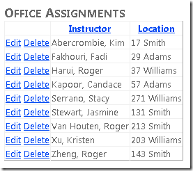](handling-concurrency-with-the-entity-framework-in-an-asp-net-web-application/_static/image1.png)

## Concurrency Conflicts

A concurrency conflict occurs when one user edits a record and another user edits the same record before the first user's change is written to the database. If you don't set up the Entity Framework to detect such conflicts, whoever updates the database last overwrites the other user's changes. In many applications, this risk is acceptable, and you don't have to configure the application to handle possible concurrency conflicts. (If there are few users, or few updates, or if isn't really critical if some changes are overwritten, the cost of programming for concurrency might outweigh the benefit.) If you don't need to worry about concurrency conflicts, you can skip this tutorial; the remaining two tutorials in the series don't depend on anything you build in this one.

### Pessimistic Concurrency (Locking)

If your application does need to prevent accidental data loss in concurrency scenarios, one way to do that is to use database locks. This is called *pessimistic concurrency*. For example, before you read a row from a database, you request a lock for read-only or for update access. If you lock a row for update access, no other users are allowed to lock the row either for read-only or update access, because they would get a copy of data that's in the process of being changed. If you lock a row for read-only access, others can also lock it for read-only access but not for update.

Managing locks has some disadvantages. It can be complex to program. It requires significant database management resources, and it can cause performance problems as the number of users of an application increases (that is, it doesn't scale well). For these reasons, not all database management systems support pessimistic concurrency. The Entity Framework provides no built-in support for it, and this tutorial doesn't show you how to implement it.

### Optimistic Concurrency

The alternative to pessimistic concurrency is *optimistic concurrency*. Optimistic concurrency means allowing concurrency conflicts to happen, and then reacting appropriately if they do. For example, John runs the *Department.aspx* page, clicks the **Edit** link for the History department, and reduces the **Budget** amount from $1,000,000.00 to $125,000.00. (John administers a competing department and wants to free up money for his own department.)

[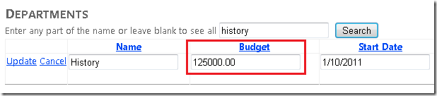](handling-concurrency-with-the-entity-framework-in-an-asp-net-web-application/_static/image5.png)

Before John clicks **Update**, Jane runs the same page, clicks the **Edit** link for the History department, and then changes the **Start Date** field from 1/10/2011 to 1/1/1999. (Jane administers the History department and wants to give it more seniority.)

[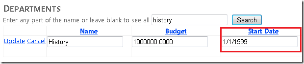](handling-concurrency-with-the-entity-framework-in-an-asp-net-web-application/_static/image7.png)

John clicks **Update** first, then Jane clicks **Update**. Jane's browser now lists the **Budget** amount as $1,000,000.00, but this is incorrect because the amount has been changed by John to $125,000.00.

Some of the actions you can take in this scenario include the following:

- You can keep track of which property a user has modified and update only the corresponding columns in the database. In the example scenario, no data would be lost, because different properties were updated by the two users. The next time someone browses the History department, they will see 1/1/1999 and $125,000.00. 

    This is the default behavior in the Entity Framework, and it can substantially reduce the number of conflicts that could result in data loss. However, this behavior doesn't avoid data loss if competing changes are made to the same property of an entity. In addition, this behavior isn't always possible; when you map stored procedures to an entity type, all of an entity's properties are updated when any changes to the entity are made in the database.
- You can let Jane's change overwrite John's change. After Jane clicks **Update**, the **Budget** amount goes back to $1,000,000.00. This is called a *Client Wins* or *Last in Wins* scenario. (The client's values take precedence over what's in the data store.)
- You can prevent Jane's change from being updated in the database. Typically, you would display an error message, show her the current state of the data, and allow her to reenter her changes if she still wants to make them. You could further automate the process by saving her input and giving her an opportunity to reapply it without having to reenter it. This is called a *Store Wins* scenario. (The data-store values take precedence over the values submitted by the client.)

### Detecting Concurrency Conflicts

In the Entity Framework, you can resolve conflicts by handling `OptimisticConcurrencyException` exceptions that the Entity Framework throws. In order to know when to throw these exceptions, the Entity Framework must be able to detect conflicts. Therefore, you must configure the database and the data model appropriately. Some options for enabling conflict detection include the following:

- In the database, include a table column that can be used to determine when a row has been changed. You can then configure the Entity Framework to include that column in the `Where` clause of SQL `Update` or `Delete` commands.

    That's the purpose of the `Timestamp` column in the `OfficeAssignment` table.

    [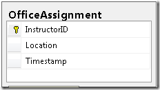](handling-concurrency-with-the-entity-framework-in-an-asp-net-web-application/_static/image9.png)

    The data type of the `Timestamp` column is also called `Timestamp`. However, the column doesn't actually contain a date or time value. Instead, the value is a sequential number that's incremented each time the row is updated. In an `Update` or `Delete` command, the `Where` clause includes the original `Timestamp` value. If the row being updated has been changed by another user, the value in `Timestamp` is different than the original value, so the `Where` clause returns no row to update. When the Entity Framework finds that no rows have been updated by the current `Update` or `Delete` command (that is, when the number of affected rows is zero), it interprets that as a concurrency conflict.
- Configure the Entity Framework to include the original values of every column in the table in the `Where` clause of `Update` and `Delete` commands.

    As in the first option, if anything in the row has changed since the row was first read, the `Where` clause won't return a row to update, which the Entity Framework interprets as a concurrency conflict. This method is as effective as using a `Timestamp` field, but can be inefficient. For database tables that have many columns, it can result in very large `Where` clauses, and in a web application it can require that you maintain large amounts of state. Maintaining large amounts of state can affect application performance because it either requires server resources (for example, session state) or must be included in the web page itself (for example, view state).

In this tutorial you will add error handling for optimistic concurrency conflicts for an entity that doesn't have a tracking property (the `Department` entity) and for an entity that does have a tracking property (the `OfficeAssignment` entity).

## Handling Optimistic Concurrency Without a Tracking Property

To implement optimistic concurrency for the `Department` entity, which doesn't have a tracking (`Timestamp`) property, you will complete the following tasks:

- Change the data model to enable concurrency tracking for `Department` entities.
- In the `SchoolRepository` class, handle concurrency exceptions in the `SaveChanges` method.
- In the *Departments.aspx* page, handle concurrency exceptions by displaying a message to the user warning that the attempted changes were unsuccessful. The user can then see the current values and retry the changes if they are still needed.

### Enabling Concurrency Tracking in the Data Model

In Visual Studio, open the Contoso University web application that you were working with in the previous tutorial in this series.

Open *SchoolModel.edmx*, and in the data model designer, right-click the `Name` property in the `Department` entity and then click **Properties**. In the **Properties** window, change the `ConcurrencyMode` property to `Fixed`.

[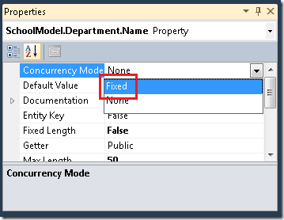](handling-concurrency-with-the-entity-framework-in-an-asp-net-web-application/_static/image11.png)

Do the same for the other non-primary-key scalar properties (`Budget`, `StartDate`, and `Administrator`.) (You can't do this for navigation properties.) This specifies that whenever the Entity Framework generates a `Update` or `Delete` SQL command to update the `Department` entity in the database, these columns (with original values) must be included in the `Where` clause. If no row is found when the `Update` or `Delete` command executes, the Entity Framework will throw an optimistic-concurrency exception.

Save and close the data model.

### Handling Concurrency Exceptions in the DAL

Open *SchoolRepository.cs* and add the following `using` statement for the `System.Data` namespace:

[!code-csharp[Main](handling-concurrency-with-the-entity-framework-in-an-asp-net-web-application/samples/sample1.cs)]

Add the following new `SaveChanges` method, which handles optimistic concurrency exceptions:

[!code-csharp[Main](handling-concurrency-with-the-entity-framework-in-an-asp-net-web-application/samples/sample2.cs)]

If a concurrency error occurs when this method is called, the property values of the entity in memory are replaced with the values currently in the database. The concurrency exception is rethrown so that the web page can handle it.

In the `DeleteDepartment` and `UpdateDepartment` methods, replace the existing call to `context.SaveChanges()` with a call to `SaveChanges()` in order to invoke the new method.

### Handling Concurrency Exceptions in the Presentation Layer

Open *Departments.aspx* and add an `OnDeleted="DepartmentsObjectDataSource_Deleted"` attribute to the `DepartmentsObjectDataSource` control. The opening tag for the control will now resemble the following example.

[!code-aspx[Main](handling-concurrency-with-the-entity-framework-in-an-asp-net-web-application/samples/sample3.aspx)]

In the `DepartmentsGridView` control, specify all of the table columns in the `DataKeyNames` attribute, as shown in the following example. Note that this will create very large view state fields, which is one reason why using a tracking field is generally the preferred way to track concurrency conflicts.

[!code-aspx[Main](handling-concurrency-with-the-entity-framework-in-an-asp-net-web-application/samples/sample4.aspx)]

Open *Departments.aspx.cs* and add the following `using` statement for the `System.Data` namespace:

[!code-csharp[Main](handling-concurrency-with-the-entity-framework-in-an-asp-net-web-application/samples/sample5.cs)]

Add the following new method, which you will call from the data source control's `Updated` and `Deleted` event handlers for handling concurrency exceptions:

[!code-csharp[Main](handling-concurrency-with-the-entity-framework-in-an-asp-net-web-application/samples/sample6.cs)]

This code checks the exception type, and if it's a concurrency exception, the code dynamically creates a `CustomValidator` control that in turn displays a message in the `ValidationSummary` control.

Call the new method from the `Updated` event handler that you added earlier. In addition, create a new `Deleted` event handler that calls the same method (but doesn't do anything else):

[!code-csharp[Main](handling-concurrency-with-the-entity-framework-in-an-asp-net-web-application/samples/sample7.cs)]

### Testing Optimistic Concurrency in the Departments Page

Run the *Departments.aspx* page.

Click **Edit** in a row and change the value in the **Budget** column. (Remember that you can only edit records that you've created for this tutorial, because the existing `School` database records contain some invalid data. The record for the Economics department is a safe one to experiment with.)

[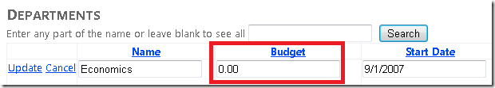](handling-concurrency-with-the-entity-framework-in-an-asp-net-web-application/_static/image15.png)

Open a new browser window and run the page again (copy the URL from the first browser window's address box to the second browser window).

[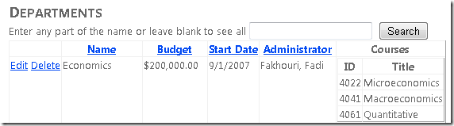](handling-concurrency-with-the-entity-framework-in-an-asp-net-web-application/_static/image17.png)

Click **Edit** in the same row you edited earlier and change the **Budget** value to something different.

In the second browser window, click **Update**. The **Budget** amount is successfully changed to this new value.

[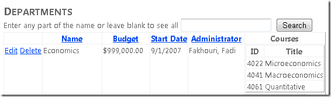](handling-concurrency-with-the-entity-framework-in-an-asp-net-web-application/_static/image21.png)

In the first browser window, click **Update**. The update fails. The **Budget** amount is redisplayed using the value you set in the second browser window, and you see an error message.

[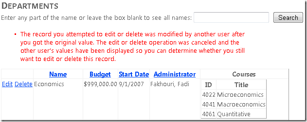](handling-concurrency-with-the-entity-framework-in-an-asp-net-web-application/_static/image23.png)

## Handling Optimistic Concurrency Using a Tracking Property

To handle optimistic concurrency for an entity that has a tracking property, you will complete the following tasks:

- Add stored procedures to the data model to manage `OfficeAssignment` entities. (Tracking properties and stored procedures don't have to be used together; they're just grouped together here for illustration.)
- Add CRUD methods to the DAL and the BLL for `OfficeAssignment` entities, including code to handle optimistic concurrency exceptions in the DAL.
- Create an office-assignments web page.
- Test optimistic concurrency in the new web page.

### Adding OfficeAssignment Stored Procedures to the Data Model

Open the *SchoolModel.edmx* file in the model designer, right-click the design surface, and click **Update Model from Database**. In the **Add** tab of the **Choose Your Database Objects** dialog box, expand **Stored Procedures** and select the three `OfficeAssignment` stored procedures (see the following screenshot), and then click **Finish**. (These stored procedures were already in the database when you downloaded or created it using a script.)

[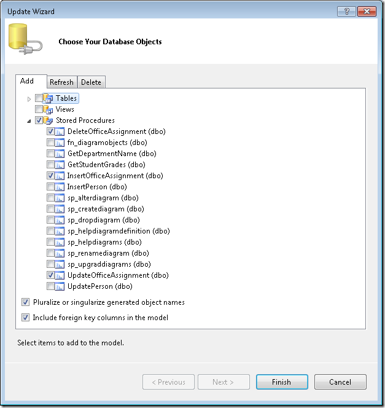](handling-concurrency-with-the-entity-framework-in-an-asp-net-web-application/_static/image25.png)

Right-click the `OfficeAssignment` entity and select **Stored Procedure Mapping**.

[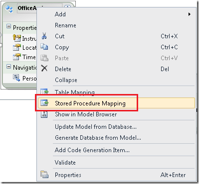](handling-concurrency-with-the-entity-framework-in-an-asp-net-web-application/_static/image27.png)

Set the **Insert**, **Update**, and **Delete** functions to use their corresponding stored procedures. For the `OrigTimestamp` parameter of the `Update` function, set the **Property** to `Timestamp` and select the **Use Original Value** option.

[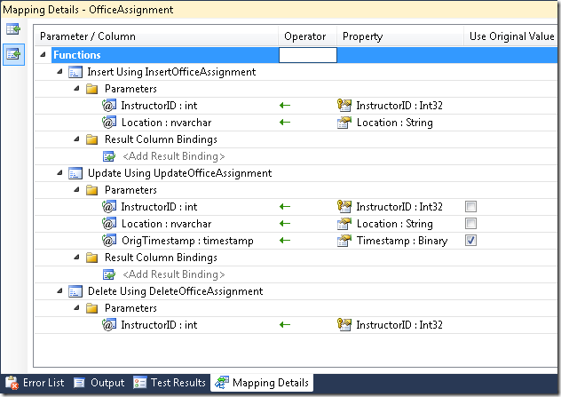](handling-concurrency-with-the-entity-framework-in-an-asp-net-web-application/_static/image29.png)

When the Entity Framework calls the `UpdateOfficeAssignment` stored procedure, it will pass the original value of the `Timestamp` column in the `OrigTimestamp` parameter. The stored procedure uses this parameter in its `Where` clause:

[!code-sql[Main](handling-concurrency-with-the-entity-framework-in-an-asp-net-web-application/samples/sample8.sql)]

The stored procedure also selects the new value of the `Timestamp` column after the update so that the Entity Framework can keep the `OfficeAssignment` entity that's in memory in sync with the corresponding database row.

(Note that the stored procedure for deleting an office assignment doesn't have an `OrigTimestamp` parameter. Because of this, the Entity Framework can't verify that an entity is unchanged before deleting it.)

Save and close the data model.

### Adding OfficeAssignment Methods to the DAL

Open *ISchoolRepository.cs* and add the following CRUD methods for the `OfficeAssignment` entity set:

[!code-csharp[Main](handling-concurrency-with-the-entity-framework-in-an-asp-net-web-application/samples/sample9.cs)]

Add the following new methods to *SchoolRepository.cs*. In the `UpdateOfficeAssignment` method, you call the local `SaveChanges` method instead of `context.SaveChanges`.

[!code-csharp[Main](handling-concurrency-with-the-entity-framework-in-an-asp-net-web-application/samples/sample10.cs)]

In the test project, open *MockSchoolRepository.cs* and add the following `OfficeAssignment` collection and CRUD methods to it. (The mock repository must implement the repository interface, or the solution won't compile.)

[!code-csharp[Main](handling-concurrency-with-the-entity-framework-in-an-asp-net-web-application/samples/sample11.cs)]

### Adding OfficeAssignment Methods to the BLL

In the main project, open *SchoolBL.cs* and add the following CRUD methods for the `OfficeAssignment` entity set to it:

[!code-csharp[Main](handling-concurrency-with-the-entity-framework-in-an-asp-net-web-application/samples/sample12.cs)]

## Creating an OfficeAssignments Web Page

Create a new web page that uses the *Site.Master* master page and name it *OfficeAssignments.aspx*. Add the following markup to the `Content` control named `Content2`:

[!code-aspx[Main](handling-concurrency-with-the-entity-framework-in-an-asp-net-web-application/samples/sample13.aspx)]

Notice that in the `DataKeyNames` attribute, the markup specifies the `Timestamp` property as well as the record key (`InstructorID`). Specifying properties in the `DataKeyNames` attribute causes the control to save them in control state (which is similar to view state) so that the original values are available during postback processing.

If you didn't save the `Timestamp` value, the Entity Framework would not have it for the `Where` clause of the SQL `Update` command. Consequently nothing would be found to update. As a result, the Entity Framework would throw an optimistic concurrency exception every time an `OfficeAssignment` entity is updated.

Open *OfficeAssignments.aspx.cs* and add the following `using` statement for the data access layer:

[!code-csharp[Main](handling-concurrency-with-the-entity-framework-in-an-asp-net-web-application/samples/sample14.cs)]

Add the following `Page_Init` method, which enables Dynamic Data functionality. Also add the following handler for the `ObjectDataSource` control's `Updated` event in order to check for concurrency errors:

[!code-csharp[Main](handling-concurrency-with-the-entity-framework-in-an-asp-net-web-application/samples/sample15.cs)]

### Testing Optimistic Concurrency in the OfficeAssignments Page

Run the *OfficeAssignments.aspx* page.

Click **Edit** in a row and change the value in the **Location** column.

[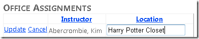](handling-concurrency-with-the-entity-framework-in-an-asp-net-web-application/_static/image33.png)

Open a new browser window and run the page again (copy the URL from the first browser window to the second browser window).

[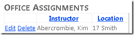](handling-concurrency-with-the-entity-framework-in-an-asp-net-web-application/_static/image35.png)

Click **Edit** in the same row you edited earlier and change the **Location** value to something different.

[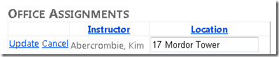](handling-concurrency-with-the-entity-framework-in-an-asp-net-web-application/_static/image37.png)

In the second browser window, click **Update**.

[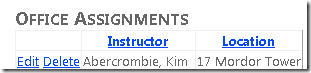](handling-concurrency-with-the-entity-framework-in-an-asp-net-web-application/_static/image39.png)

Switch to the first browser window and click **Update**.

[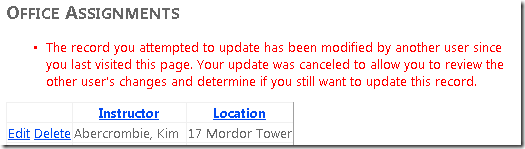](handling-concurrency-with-the-entity-framework-in-an-asp-net-web-application/_static/image41.png)

You see an error message and the **Location** value has been updated to show the value you changed it to in the second browser window.

## Handling Concurrency with the EntityDataSource Control

The `EntityDataSource` control includes built-in logic that recognizes the concurrency settings in the data model and handles update and delete operations accordingly. However, as with all exceptions, you must handle `OptimisticConcurrencyException` exceptions yourself in order to provide a user-friendly error message.

Next, you will configure the *Courses.aspx* page (which uses an `EntityDataSource` control) to allow update and delete operations and to display an error message if a concurrency conflict occurs. The `Course` entity doesn't have a concurrency tracking column, so you will use the same method that you did with the `Department` entity: track the values of all non-key properties.

Open the *SchoolModel.edmx* file. For the non-key properties of the `Course` entity (`Title`, `Credits`, and `DepartmentID`), set the **Concurrency Mode** property to `Fixed`. Then save and close the data model.

Open the *Courses.aspx* page and make the following changes:

- In the `CoursesEntityDataSource` control, add `EnableUpdate="true"` and `EnableDelete="true"` attributes. The opening tag for that control now resembles the following example:

    [!code-aspx[Main](handling-concurrency-with-the-entity-framework-in-an-asp-net-web-application/samples/sample16.aspx)]
- In the `CoursesGridView` control, change the `DataKeyNames` attribute value to `"CourseID,Title,Credits,DepartmentID"`. Then add a `CommandField` element to the `Columns` element that shows **Edit** and **Delete** buttons (`<asp:CommandField ShowEditButton="True" ShowDeleteButton="True" />`). The `GridView` control now resembles the following example:

    [!code-aspx[Main](handling-concurrency-with-the-entity-framework-in-an-asp-net-web-application/samples/sample17.aspx)]

Run the page and create a conflict situation as you did before in the Departments page. Run the page in two browser windows, click **Edit** in the same line in each window, and make a different change in each one. Click **Update** in one window and then click **Update** in the other window. When you click **Update** the second time, you see the error page that results from an unhandled concurrency exception.

[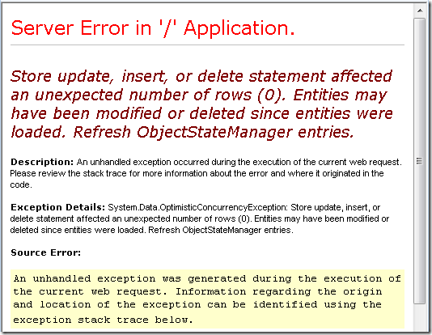](handling-concurrency-with-the-entity-framework-in-an-asp-net-web-application/_static/image43.png)

You handle this error in a manner very similar to how you handled it for the `ObjectDataSource` control. Open the *Courses.aspx* page, and in the `CoursesEntityDataSource` control, specify handlers for the `Deleted` and `Updated` events. The opening tag of the control now resembles the following example:

[!code-aspx[Main](handling-concurrency-with-the-entity-framework-in-an-asp-net-web-application/samples/sample18.aspx)]

Before the `CoursesGridView` control, add the following `ValidationSummary` control:

[!code-aspx[Main](handling-concurrency-with-the-entity-framework-in-an-asp-net-web-application/samples/sample19.aspx)]

In *Courses.aspx.cs*, add a `using` statement for the `System.Data` namespace, add a method that checks for concurrency exceptions, and add handlers for the `EntityDataSource` control's `Updated` and `Deleted` handlers. The code will look like the following:

[!code-csharp[Main](handling-concurrency-with-the-entity-framework-in-an-asp-net-web-application/samples/sample20.cs)]

[!code-csharp[Main](handling-concurrency-with-the-entity-framework-in-an-asp-net-web-application/samples/sample21.cs)]

The only difference between this code and what you did for the `ObjectDataSource` control is that in this case the concurrency exception is in the `Exception` property of the event arguments object rather than in that exception's `InnerException` property.

Run the page and create a concurrency conflict again. This time you see an error message:

[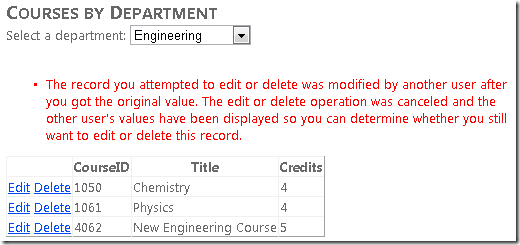](handling-concurrency-with-the-entity-framework-in-an-asp-net-web-application/_static/image45.png)

This completes the introduction to handling concurrency conflicts. The next tutorial will provide guidance on how to improve performance in a web application that uses the Entity Framework.

>[!div class="step-by-step"]
[Previous](using-the-entity-framework-and-the-objectdatasource-control-part-3-sorting-and-filtering.md)
[Next](maximizing-performance-with-the-entity-framework-in-an-asp-net-web-application.md)
