Maximizing Performance with the Entity Framework 4.0 in an ASP.NET 4 Web Application
====================
by [Tom Dykstra](https://github.com/tdykstra)

> This tutorial series builds on the Contoso University web application that is created by the [Getting Started with the Entity Framework 4.0](https://asp.net/entity-framework/tutorials#Getting%20Started) tutorial series. If you didn't complete the earlier tutorials, as a starting point for this tutorial you can [download the application](https://code.msdn.microsoft.com/ASPNET-Web-Forms-97f8ee9a) that you would have created. You can also [download the application](https://code.msdn.microsoft.com/ASPNET-Web-Forms-6c7197aa) that is created by the complete tutorial series. If you have questions about the tutorials, you can post them to the [ASP.NET Entity Framework forum](https://forums.asp.net/1227.aspx).

In the previous tutorial, you saw how to handle concurrency conflicts. This tutorial shows options for improving the performance of an ASP.NET web application that uses the Entity Framework. You'll learn several methods for maximizing performance or for diagnosing performance problems.

Information presented in the following sections is likely to be useful in a broad variety of scenarios:

- Efficiently load related data.
- Manage view state.

Information presented in the following sections might be useful if you have individual queries that present performance problems:

- Use the `NoTracking` merge option.
- Pre-compile LINQ queries.
- Examine query commands sent to the database.

Information presented in the following section is potentially useful for applications that have extremely large data models:

- Pre-generate views.

> [!NOTE]
> Web application performance is affected by many factors, including things like the size of request and response data, the speed of database queries, how many requests the server can queue and how quickly it can service them, and even the efficiency of any client-script libraries you might be using. If performance is critical in your application, or if testing or experience shows that application performance isn't satisfactory, you should follow normal protocol for performance tuning. Measure to determine where performance bottlenecks are occurring, and then address the areas that will have the greatest impact on overall application performance.
> 
> This topic focuses mainly on ways in which you can potentially improve the performance specifically of the Entity Framework in ASP.NET. The suggestions here are useful if you determine that data access is one of the performance bottlenecks in your application. Except as noted, the methods explained here shouldn't be considered &quot;best practices&quot; in general — many of them are appropriate only in exceptional situations or to address very specific kinds of performance bottlenecks.

To start the tutorial, start Visual Studio and open the Contoso University web application that you were working with in the previous tutorial.

## Efficiently Loading Related Data

There are several ways that the Entity Framework can load related data into the navigation properties of an entity:

- *Lazy loading*. When the entity is first read, related data isn't retrieved. However, the first time you attempt to access a navigation property, the data required for that navigation property is automatically retrieved. This results in multiple queries sent to the database — one for the entity itself and one each time that related data for the entity must be retrieved. 

    [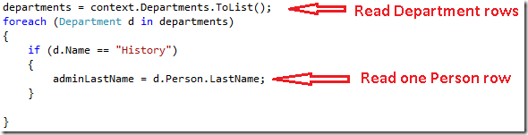](maximizing-performance-with-the-entity-framework-in-an-asp-net-web-application/_static/image1.png)

*Eager loading*. When the entity is read, related data is retrieved along with it. This typically results in a single join query that retrieves all of the data that's needed. You specify eager loading by using the `Include` method, as you've seen already in these tutorials.

[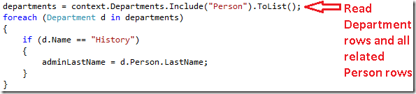](maximizing-performance-with-the-entity-framework-in-an-asp-net-web-application/_static/image3.png)

- *Explicit loading*. This is similar to lazy loading, except that you explicitly retrieve the related data in code; it doesn't happen automatically when you access a navigation property. You load related data manually using the `Load` method of the navigation property for collections, or you use the `Load` method of the reference property for properties that hold a single object. (For example, you call the `PersonReference.Load` method to load the `Person` navigation property of a `Department` entity.)

    [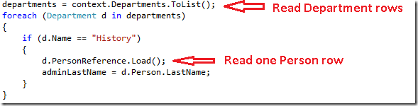](maximizing-performance-with-the-entity-framework-in-an-asp-net-web-application/_static/image5.png)

Because they don't immediately retrieve the property values, lazy loading and explicit loading are also both known as *deferred loading*.

Lazy loading is the default behavior for an object context that has been generated by the designer. If you open the *SchoolModel.Designer.cs* file that defines the object context class, you'll find three constructor methods, and each of them includes the following statement:

[!code-csharp[Main](maximizing-performance-with-the-entity-framework-in-an-asp-net-web-application/samples/sample1.cs)]

In general, if you know you need related data for every entity retrieved, eager loading offers the best performance, because a single query sent to the database is typically more efficient than separate queries for each entity retrieved. On the other hand, if you need to access an entity's navigation properties only infrequently or only for a small set of the entities, lazy loading or explicit loading may be more efficient, because eager loading would retrieve more data than you need.

In a web application, lazy loading may be of relatively little value anyway, because user actions that affect the need for related data take place in the browser, which has no connection to the object context that rendered the page. On the other hand, when you databind a control, you typically know what data you need, and so it's generally best to choose eager loading or deferred loading based on what's appropriate in each scenario.

In addition, a databound control might use an entity object after the object context is disposed. In that case, an attempt to lazy-load a navigation property would fail. The error message you receive is clear: &quot;`The ObjectContext instance has been disposed and can no longer be used for operations that require a connection.`&quot;

The `EntityDataSource` control disables lazy loading by default. For the `ObjectDataSource` control that you're using for the current tutorial (or if you access the object context from page code), there are several ways you can make lazy loading disabled by default. You can disable it when you instantiate an object context. For example, you can add the following line to the constructor method of the `SchoolRepository` class:

[!code-csharp[Main](maximizing-performance-with-the-entity-framework-in-an-asp-net-web-application/samples/sample2.cs)]

For the Contoso University application, you'll make the object context automatically disable lazy loading so that this property doesn't have to be set whenever a context is instantiated.

Open the *SchoolModel.edmx* data model, click the design surface, and then in the properties pane set the **Lazy Loading Enabled** property to `False`. Save and close the data model.

[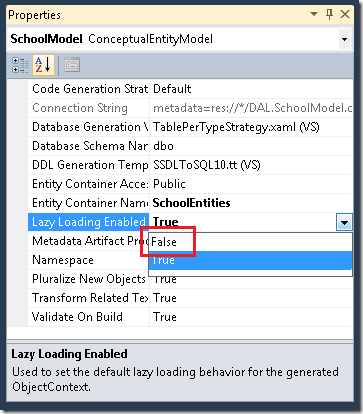](maximizing-performance-with-the-entity-framework-in-an-asp-net-web-application/_static/image7.png)

## Managing View State

In order to provide update functionality, an ASP.NET web page must store the original property values of an entity when a page is rendered. During postback processing the control can re-create the original state of the entity and call the entity's `Attach` method before applying changes and calling the `SaveChanges` method. By default, ASP.NET Web Forms data controls use view state to store the original values. However, view state can affect performance, because it's stored in hidden fields that can substantially increase the size of the page that's sent to and from the browser.

Techniques for managing view state, or alternatives such as session state, aren't unique to the Entity Framework, so this tutorial doesn't go into this topic in detail. For more information see the links at the end of the tutorial.

However, version 4 of ASP.NET provides a new way of working with view state that every ASP.NET developer of Web Forms applications should be aware of: the `ViewStateMode` property. This new property can be set at the page or control level, and it enables you to disable view state by default for a page and enable it only for controls that need it.

For applications where performance is critical, a good practice is to always disable view state at the page level and enable it only for controls that require it. The size of view state in the Contoso University pages wouldn't be substantially decreased by this method, but to see how it works, you'll do it for the *Instructors.aspx* page. That page contains many controls, including a `Label` control that has view state disabled. None of the controls on this page actually need to have view state enabled. (The `DataKeyNames` property of the `GridView` control specifies state that must be maintained between postbacks, but these values are kept in control state, which isn't affected by the `ViewStateMode` property.)

The `Page` directive and `Label` control markup currently resembles the following example:

[!code-aspx[Main](maximizing-performance-with-the-entity-framework-in-an-asp-net-web-application/samples/sample3.aspx)]

Make the following changes:

- Add `ViewStateMode="Disabled"` to the `Page` directive.
- Remove `ViewStateMode="Disabled"` from the `Label` control.

The markup now resembles the following example:

[!code-aspx[Main](maximizing-performance-with-the-entity-framework-in-an-asp-net-web-application/samples/sample4.aspx)]

View state is now disabled for all controls. If you later add a control that does need to use view state, all you need to do is include the `ViewStateMode="Enabled"` attribute for that control.

## Using The NoTracking Merge Option

When an object context retrieves database rows and creates entity objects that represent them, by default it also tracks those entity objects using its object state manager. This tracking data acts as a cache and is used when you update an entity. Because a web application typically has short-lived object context instances, queries often return data that doesn't need to be tracked, because the object context that reads them will be disposed before any of the entities it reads are used again or updated.

In the Entity Framework, you can specify whether the object context tracks entity objects by setting a *merge option*. You can set the merge option for individual queries or for entity sets. If you set it for an entity set, that means that you're setting the default merge option for all queries that are created for that entity set.

For the Contoso University application, tracking isn't needed for any of the entity sets that you access from the repository, so you can set the merge option to `NoTracking` for those entity sets when you instantiate the object context in the repository class. (Note that in this tutorial, setting the merge option won't have a noticeable effect on the application's performance. The `NoTracking` option is likely to make an observable performance improvement only in certain high-data-volume scenarios.)

In the DAL folder, open the *SchoolRepository.cs* file and add a constructor method that sets the merge option for the entity sets that the repository accesses:

[!code-csharp[Main](maximizing-performance-with-the-entity-framework-in-an-asp-net-web-application/samples/sample5.cs)]

## Pre-Compiling LINQ Queries

The first time that the Entity Framework executes an Entity SQL query within the life of a given `ObjectContext` instance, it takes some time to compile the query. The result of compilation is cached, which means that subsequent executions of the query are much quicker. LINQ queries follow a similar pattern, except that some of the work required to compile the query is done every time the query is executed. In other words, for LINQ queries, by default not all of the results of compilation are cached.

If you have a LINQ query that you expect to run repeatedly in the life of an object context, you can write code that causes all of the results of compilation to be cached the first time the LINQ query is run.

As an illustration, you'll do this for two `Get` methods in the `SchoolRepository` class, one of which doesn't take any parameters (the `GetInstructorNames` method), and one that does require a parameter (the `GetDepartmentsByAdministrator` method). These methods as they stand now actually don't need to be compiled because they aren't LINQ queries:

[!code-csharp[Main](maximizing-performance-with-the-entity-framework-in-an-asp-net-web-application/samples/sample6.cs)]

[!code-csharp[Main](maximizing-performance-with-the-entity-framework-in-an-asp-net-web-application/samples/sample7.cs)]

However, so that you can try out compiled queries, you'll proceed as if these had been written as the following LINQ queries:

[!code-csharp[Main](maximizing-performance-with-the-entity-framework-in-an-asp-net-web-application/samples/sample8.cs)]

[!code-csharp[Main](maximizing-performance-with-the-entity-framework-in-an-asp-net-web-application/samples/sample9.cs)]

You could change the code in these methods to what's shown above and run the application to verify that it works before continuing. But the following instructions jump right into creating pre-compiled versions of them.

Create a class file in the *DAL* folder, name it *SchoolEntities.cs*, and replace the existing code with the following code:

[!code-csharp[Main](maximizing-performance-with-the-entity-framework-in-an-asp-net-web-application/samples/sample10.cs)]

This code creates a partial class that extends the automatically generated object context class. The partial class includes two compiled LINQ queries using the `Compile` method of the `CompiledQuery` class. It also creates methods that you can use to call the queries. Save and close this file.

Next, in *SchoolRepository.cs*, change the existing `GetInstructorNames` and `GetDepartmentsByAdministrator` methods in the repository class so that they call the compiled queries:

[!code-csharp[Main](maximizing-performance-with-the-entity-framework-in-an-asp-net-web-application/samples/sample11.cs)]

[!code-csharp[Main](maximizing-performance-with-the-entity-framework-in-an-asp-net-web-application/samples/sample12.cs)]

Run the *Departments.aspx* page to verify that it works as it did before. The `GetInstructorNames` method is called in order to populate the administrator drop-down list, and the `GetDepartmentsByAdministrator` method is called when you click **Update** in order to verify that no instructor is an administrator of more than one department.

[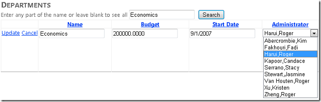](maximizing-performance-with-the-entity-framework-in-an-asp-net-web-application/_static/image9.png)

You've pre-compiled queries in the Contoso University application only to see how to do it, not because it would measurably improve performance. Pre-compiling LINQ queries does add a level of complexity to your code, so make sure you do it only for queries that actually represent performance bottlenecks in your application.

## Examining Queries Sent to the Database

When you're investigating performance issues, sometimes it's helpful to know the exact SQL commands that the Entity Framework is sending to the database. If you're working with an `IQueryable` object, one way to do this is to use the `ToTraceString` method.

In *SchoolRepository.cs*, change the code in the `GetDepartmentsByName` method to match the following example:

[!code-csharp[Main](maximizing-performance-with-the-entity-framework-in-an-asp-net-web-application/samples/sample13.cs)]

The `departments` variable must be cast to an `ObjectQuery` type only because the `Where` method at the end of the preceding line creates an `IQueryable` object; without the `Where` method, the cast would not be necessary.

Set a breakpoint on the `return` line, and then run the *Departments.aspx* page in the debugger. When you hit the breakpoint, examine the `commandText` variable in the **Locals** window and use the text visualizer (the magnifying glass in the **Value** column) to display its value in the **Text Visualizer** window. You can see the entire SQL command that results from this code:

[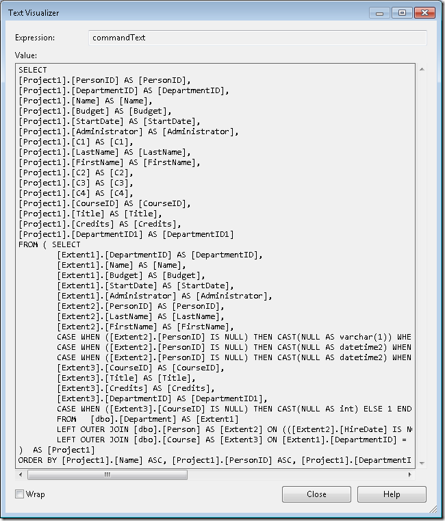](maximizing-performance-with-the-entity-framework-in-an-asp-net-web-application/_static/image11.png)

As an alternative, the IntelliTrace feature in Visual Studio Ultimate provides a way to view SQL commands generated by the Entity Framework that doesn't require you to change your code or even set a breakpoint.

> [!NOTE]
> You can perform the following procedures only if you have Visual Studio Ultimate.

Restore the original code in the `GetDepartmentsByName` method, and then run the *Departments.aspx* page in the debugger.

In Visual Studio, select the **Debug** menu, then **IntelliTrace**, and then **IntelliTrace Events**.

[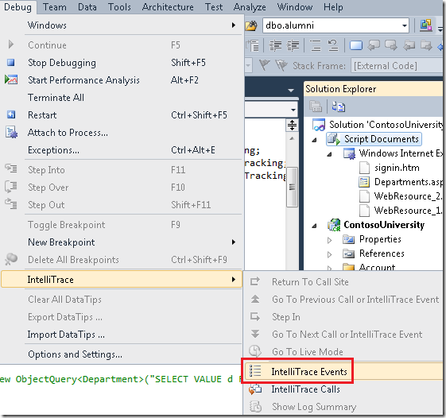](maximizing-performance-with-the-entity-framework-in-an-asp-net-web-application/_static/image13.png)

In the **IntelliTrace** window, click **Break All**.

[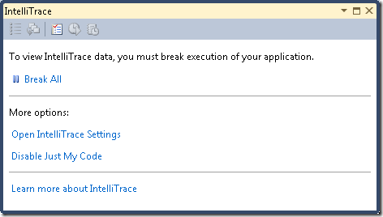](maximizing-performance-with-the-entity-framework-in-an-asp-net-web-application/_static/image15.png)

The **IntelliTrace** window displays a list of recent events:

[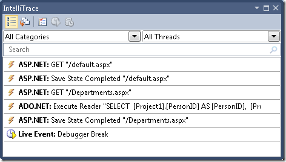](maximizing-performance-with-the-entity-framework-in-an-asp-net-web-application/_static/image17.png)

Click the **ADO.NET** line. It expands to show you the command text:

[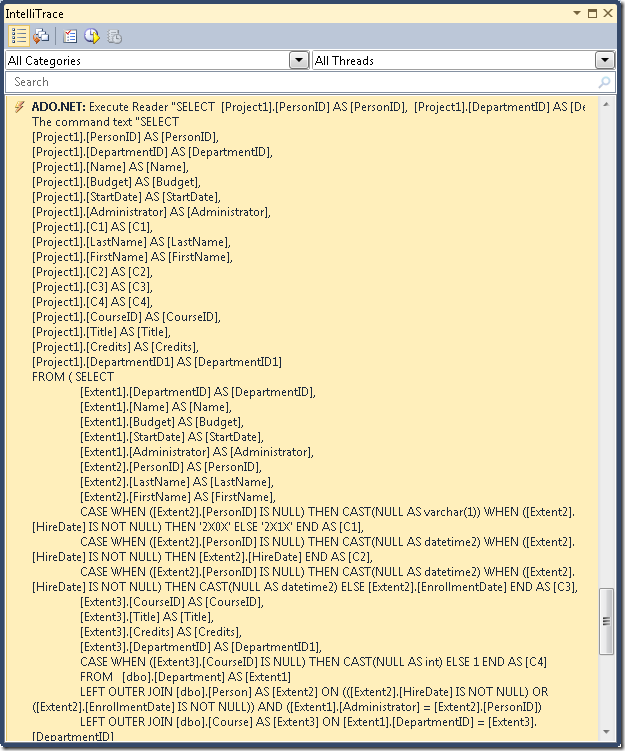](maximizing-performance-with-the-entity-framework-in-an-asp-net-web-application/_static/image19.png)

You can copy the entire command text string to the clipboard from the **Locals** window.

Suppose you were working with a database with more tables, relationships, and columns than the simple `School` database. You might find that a query that gathers all the information you need in a single `Select` statement containing multiple `Join` clauses becomes too complex to work efficiently. In that case you can switch from eager loading to explicit loading to simplify the query.

For example, try changing the code in the `GetDepartmentsByName` method in *SchoolRepository.cs*. Currently in that method you have an object query that has `Include` methods for the `Person` and `Courses` navigation properties. Replace the `return` statement with code that performs explicit loading, as shown in the following example:

[!code-csharp[Main](maximizing-performance-with-the-entity-framework-in-an-asp-net-web-application/samples/sample14.cs)]

Run the *Departments.aspx* page in the debugger and check the **IntelliTrace** window again as you did before. Now, where there was a single query before, you see a long sequence of them.

[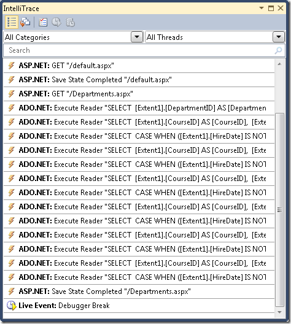](maximizing-performance-with-the-entity-framework-in-an-asp-net-web-application/_static/image21.png)

Click the first **ADO.NET** line to see what has happened to the complex query you viewed earlier.

[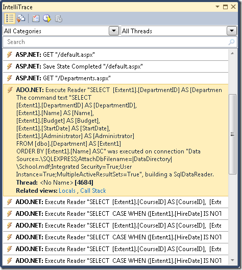](maximizing-performance-with-the-entity-framework-in-an-asp-net-web-application/_static/image23.png)

The query from Departments has become a simple `Select` query with no `Join` clause, but it's followed by separate queries that retrieve related courses and an administrator, using a set of two queries for each department returned by the original query.

> [!NOTE]
> If you leave lazy loading enabled, the pattern you see here, with the same query repeated many times, might result from lazy loading. A pattern that you typically want to avoid is lazy-loading related data for every row of the primary table. Unless you've verified that a single join query is too complex to be efficient, you'd typically be able to improve performance in such cases by changing the primary query to use eager loading.

## Pre-Generating Views

When an `ObjectContext` object is first created in a new application domain, the Entity Framework generates a set of classes that it uses to access the database. These classes are called *views*, and if you have a very large data model, generating these views can delay the web site's response to the first request for a page after a new application domain is initialized. You can reduce this first-request delay by creating the views at compile time rather than at run time.

> [!NOTE]
> If your application doesn't have an extremely large data model, or if it does have a large data model but you aren't concerned about a performance problem that affects only the very first page request after IIS is recycled, you can skip this section. View creation doesn't happen every time you instantiate an `ObjectContext` object, because the views are cached in the application domain. Therefore, unless you're frequently recycling your application in IIS, very few page requests would benefit from pre-generated views.

You can pre-generate views using the *EdmGen.exe* command-line tool or by using a *Text Template Transformation Toolkit* (T4) template. In this tutorial you'll use a T4 template.

In the *DAL* folder, add a file using the **Text Template** template (it's under the **General** node in the **Installed Templates** list), and name it *SchoolModel.Views.tt*. Replace the existing code in the file with the following code:

[!code-csharp[Main](maximizing-performance-with-the-entity-framework-in-an-asp-net-web-application/samples/sample15.cs)]

This code generates views for an *.edmx* file that's located in the same folder as the template and that has the same name as the template file. For example, if your template file is named *SchoolModel.Views.tt*, it will look for a data model file named *SchoolModel.edmx*.

Save the file, then right-click the file in **Solution Explorer** and select **Run Custom Tool**.

[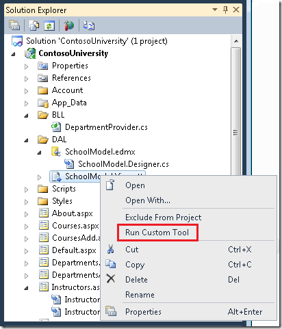](maximizing-performance-with-the-entity-framework-in-an-asp-net-web-application/_static/image25.png)

Visual Studio generates a code file that creates the views, which is named *SchoolModel.Views.cs* based on the template. (You might have noticed that the code file is generated even before you select **Run Custom Tool**, as soon as you save the template file.)

[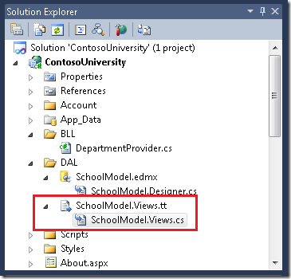](maximizing-performance-with-the-entity-framework-in-an-asp-net-web-application/_static/image27.png)

You can now run the application and verify that it works as it did before.

For more information about pre-generated views, see the following resources:

- [How to: Pre-Generate Views to Improve Query Performance](https://msdn.microsoft.com/en-us/library/bb896240.aspx) on the MSDN web site. Explains how to use the `EdmGen.exe` command-line tool to pre-generate views.
- [Isolating Performance with Precompiled/Pre-generated Views in the Entity Framework 4](https://blogs.msdn.com/b/appfabriccat/archive/2010/08/06/isolating-performance-with-precompiled-pre-generated-views-in-the-entity-framework-4.aspx) on the Windows Server AppFabric Customer Advisory Team blog.

This completes the introduction to improving performance in an ASP.NET web application that uses the Entity Framework. For more information, see the following resources:

- [Performance Considerations (Entity Framework)](https://msdn.microsoft.com/en-us/library/cc853327.aspx) on the MSDN web site.
- [Performance-related posts on the Entity Framework Team blog](https://blogs.msdn.com/b/adonet/archive/tags/performance/).
- [EF Merge Options and Compiled Queries](https://blogs.msdn.com/b/dsimmons/archive/2010/01/12/ef-merge-options-and-compiled-queries.aspx). Blog post that explains unexpected behaviors of compiled queries and merge options such as `NoTracking`. If you plan to use compiled queries or manipulate merge option settings in your application, read this first.
- [Entity Framework-related posts in the Data and Modeling Customer Advisory Team blog](https://blogs.msdn.com/b/dmcat/archive/tags/entity+framework/). Includes posts on compiled queries and using the Visual Studio 2010 Profiler to discover performance issues.
- [Entity Framework forum thread with advice on improving performance of highly complex queries](https://social.msdn.microsoft.com/Forums/en-US/adodotnetentityframework/thread/ffe8b2ab-c5b5-4331-8988-33a872d0b5f6).
- [ASP.NET State Management Recommendations](https://msdn.microsoft.com/en-us/library/z1hkazw7.aspx).
- [Using the Entity Framework and the ObjectDataSource: Custom Paging](http://geekswithblogs.net/Frez/articles/using-the-entity-framework-and-the-objectdatasource-custom-paging.aspx). Blog post that builds on the ContosoUniversity application created in these tutorials to explain how to implement paging in the *Departments.aspx* page.

The next tutorial reviews some of the important enhancements to the Entity Framework that are new in version 4.

>[!div class="step-by-step"]
[Previous](handling-concurrency-with-the-entity-framework-in-an-asp-net-web-application.md)
[Next](what-s-new-in-the-entity-framework-4.md)