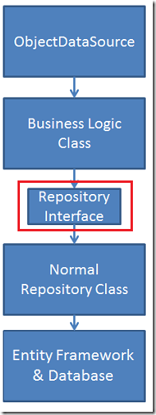
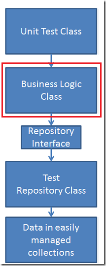
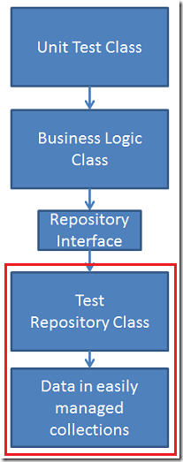
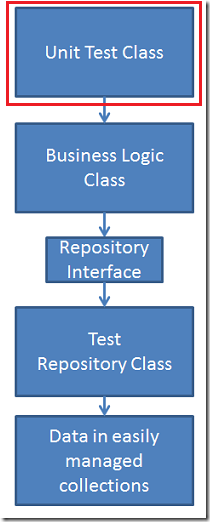
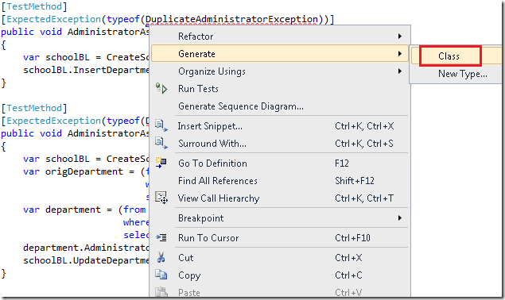
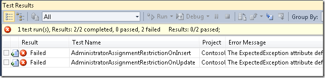
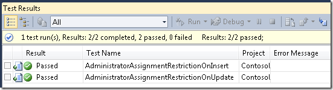
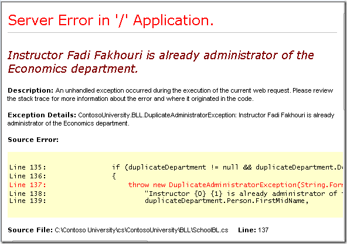
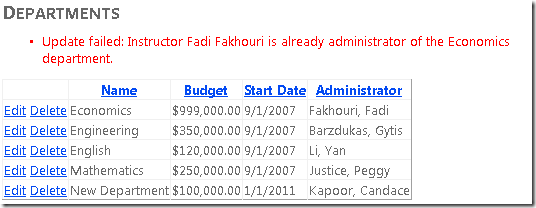

Using the Entity Framework 4.0 and the ObjectDataSource Control, Part 2: Adding a Business Logic Layer and Unit Tests
====================
by [Tom Dykstra](https://github.com/tdykstra)

> This tutorial series builds on the Contoso University web application that is created by the [Getting Started with the Entity Framework 4.0](https://asp.net/entity-framework/tutorials#Getting%20Started) tutorial series. If you didn't complete the earlier tutorials, as a starting point for this tutorial you can [download the application](https://code.msdn.microsoft.com/ASPNET-Web-Forms-97f8ee9a) that you would have created. You can also [download the application](https://code.msdn.microsoft.com/ASPNET-Web-Forms-6c7197aa) that is created by the complete tutorial series. If you have questions about the tutorials, you can post them to the [ASP.NET Entity Framework forum](https://forums.asp.net/1227.aspx).

In the previous tutorial you created an n-tier web application using the Entity Framework and the `ObjectDataSource` control. This tutorial shows how to add business logic while keeping the business-logic layer (BLL) and the data-access layer (DAL) separate, and it shows how to create automated unit tests for the BLL.

In this tutorial you'll complete the following tasks:

- Create a repository interface that declares the data-access methods you need.
- Implement the repository interface in the repository class.
- Create a business-logic class that calls the repository class to perform data-access functions.
- Connect the `ObjectDataSource` control to the business-logic class instead of to the repository class.
- Create a unit-test project and a repository class that uses in-memory collections for its data store.
- Create a unit test for business logic that you want to add to the business-logic class, then run the test and see it fail.
- Implement the business logic in the business-logic class, then re-run the unit test and see it pass.

You'll work with the *Departments.aspx* and *DepartmentsAdd.aspx* pages that you created in the previous tutorial.

## Creating a Repository Interface

You'll begin by creating the repository interface.

In the *DAL* folder, create a new class file, name it *ISchoolRepository.cs*, and replace the existing code with the following code:

[!code-csharp[Main](using-the-entity-framework-and-the-objectdatasource-control-part-2-adding-a-business-logic-layer-and-unit-tests/samples/sample1.cs)]

The interface defines one method for each of the CRUD (create, read, update, delete) methods that you created in the repository class.

In the `SchoolRepository` class in *SchoolRepository.cs*, indicate that this class implements the `ISchoolRepository` interface:

[!code-csharp[Main](using-the-entity-framework-and-the-objectdatasource-control-part-2-adding-a-business-logic-layer-and-unit-tests/samples/sample2.cs)]

## Creating a Business-Logic Class

Next, you'll create the business-logic class. You do this so that you can add business logic that will be executed by the `ObjectDataSource` control, although you will not do that yet. For now, the new business-logic class will only perform the same CRUD operations that the repository does.

Create a new folder and name it *BLL*. (In a real-world application, the business-logic layer would typically be implemented as a class library — a separate project — but to keep this tutorial simple, BLL classes will be kept in a project folder.)

In the *BLL* folder, create a new class file, name it *SchoolBL.cs*, and replace the existing code with the following code:

[!code-csharp[Main](using-the-entity-framework-and-the-objectdatasource-control-part-2-adding-a-business-logic-layer-and-unit-tests/samples/sample3.cs)]

This code creates the same CRUD methods you saw earlier in the repository class, but instead of accessing the Entity Framework methods directly, it calls the repository class methods.

The class variable that holds a reference to the repository class is defined as an interface type, and the code that instantiates the repository class is contained in two constructors. The parameterless constructor will be used by the `ObjectDataSource` control. It creates an instance of the `SchoolRepository` class that you created earlier. The other constructor allows whatever code that instantiates the business-logic class to pass in any object that implements the repository interface.

The CRUD methods that call the repository class and the two constructors make it possible to use the business-logic class with whatever back-end data store you choose. The business-logic class does not need to be aware of how the class that it's calling persists the data. (This is often called *persistence ignorance*.) This facilitates unit testing, because you can connect the business-logic class to a repository implementation that uses something as simple as in-memory `List` collections to store data.

> [!NOTE]
> Technically, the entity objects are still not persistence-ignorant, because they're instantiated from classes that inherit from the Entity Framework's `EntityObject` class. For complete persistence ignorance, you can use *plain old CLR objects*, or *POCOs*, in place of objects that inherit from the `EntityObject` class. Using POCOs is beyond the scope of this tutorial. For more information, see [Testability and Entity Framework 4.0](https://msdn.microsoft.com/en-us/library/ff714955.aspx) on the MSDN website.)

Now you can connect the `ObjectDataSource` controls to the business-logic class instead of to the repository and verify that everything works as it did before.

In *Departments.aspx* and *DepartmentsAdd.aspx*, change each occurrence of `TypeName="ContosoUniversity.DAL.SchoolRepository"` to `TypeName="ContosoUniversity.BLL.SchoolBL`". (There are four instances in all.)

Run the *Departments.aspx* and *DepartmentsAdd.aspx* pages to verify that they still work as they did before.

## Creating a Unit-Test Project and Repository Implementation

Add a new project to the solution using the **Test Project** template, and name it `ContosoUniversity.Tests`.

In the test project, add a reference to `System.Data.Entity` and add a project reference to the `ContosoUniversity` project.

You can now create the repository class that you'll use with unit tests. The data store for this repository will be within the class.

In the test project, create a new class file, name it *MockSchoolRepository.cs*, and replace the existing code with the following code:

[!code-csharp[Main](using-the-entity-framework-and-the-objectdatasource-control-part-2-adding-a-business-logic-layer-and-unit-tests/samples/sample4.cs)]

This repository class has the same CRUD methods as the one that accesses the Entity Framework directly, but they work with `List` collections in memory instead of with a database. This makes it easier for a test class to set up and validate unit tests for the business-logic class.

## Creating Unit Tests

The **Test** project template created a stub unit test class for you, and your next task is to modify this class by adding unit test methods to it for business logic that you want to add to the business-logic class.

At Contoso University, any individual instructor can only be the administrator of a single department, and you need to add business logic to enforce this rule. You will start by adding tests and running the tests to see them fail. You'll then add the code and rerun the tests, expecting to see them pass.

Open the *UnitTest1.cs* file and add `using` statements for the business logic and data-access layers that you created in the ContosoUniversity project:

[!code-csharp[Main](using-the-entity-framework-and-the-objectdatasource-control-part-2-adding-a-business-logic-layer-and-unit-tests/samples/sample5.cs)]

Replace the `TestMethod1` method with the following methods:

[!code-csharp[Main](using-the-entity-framework-and-the-objectdatasource-control-part-2-adding-a-business-logic-layer-and-unit-tests/samples/sample6.cs)]

The `CreateSchoolBL` method creates an instance of the repository class that you created for the unit test project, which it then passes to a new instance of the business-logic class. The method then uses the business-logic class to insert three departments that you can use in test methods.

The test methods verify that the business-logic class throws an exception if someone tries to insert a new department with the same administrator as an existing department, or if someone tries to update a department's administrator by setting it to the ID of a person who is already the administrator of another department.

You haven't created the exception class yet, so this code will not compile. To get it to compile, right-click `DuplicateAdministratorException` and select **Generate**, and then **Class**.

This creates a class in the test project which you can delete after you've created the exception class in the main project. and implemented the business logic.

Run the test project. As expected, the tests fail.

## Adding Business Logic to Make a Test Pass

Next, you'll implement the business logic that makes it impossible to set as the administrator of a department someone who is already administrator of another department. You'll throw an exception from the business-logic layer, and then catch it in the presentation layer if a user edits a department and clicks **Update** after selecting someone who is already an administrator. (You could also remove instructors from the drop-down list who are already administrators before you render the page, but the purpose here is to work with the business-logic layer.)

Start by creating the exception class that you'll throw when a user tries to make an instructor the administrator of more than one department. In the main project, create a new class file in the *BLL* folder, name it *DuplicateAdministratorException.cs*, and replace the existing code with the following code:

[!code-csharp[Main](using-the-entity-framework-and-the-objectdatasource-control-part-2-adding-a-business-logic-layer-and-unit-tests/samples/sample7.cs)]

Now delete the temporary *DuplicateAdministratorException.cs* file that you created in the test project earlier in order to be able to compile.

In the main project, open the *SchoolBL.cs* file and add the following method that contains the validation logic. (The code refers to a method that you'll create later.)

[!code-csharp[Main](using-the-entity-framework-and-the-objectdatasource-control-part-2-adding-a-business-logic-layer-and-unit-tests/samples/sample8.cs)]

You'll call this method when you're inserting or updating `Department` entities in order to check whether another department already has the same administrator.

The code calls a method to search the database for a `Department` entity that has the same `Administrator` property value as the entity being inserted or updated. If one is found, the code throws an exception. No validation check is required if the entity being inserted or updated has no `Administrator` value, and no exception is thrown if the method is called during an update and the `Department` entity found matches the `Department` entity being updated.

Call the new method from the `Insert` and `Update` methods:

[!code-csharp[Main](using-the-entity-framework-and-the-objectdatasource-control-part-2-adding-a-business-logic-layer-and-unit-tests/samples/sample9.cs)]

In *ISchoolRepository.cs*, add the following declaration for the new data-access method:

[!code-csharp[Main](using-the-entity-framework-and-the-objectdatasource-control-part-2-adding-a-business-logic-layer-and-unit-tests/samples/sample10.cs)]

In *SchoolRepository.cs*, add the following `using` statement:

[!code-csharp[Main](using-the-entity-framework-and-the-objectdatasource-control-part-2-adding-a-business-logic-layer-and-unit-tests/samples/sample11.cs)]

In *SchoolRepository.cs*, add the following new data-access method:

[!code-csharp[Main](using-the-entity-framework-and-the-objectdatasource-control-part-2-adding-a-business-logic-layer-and-unit-tests/samples/sample12.cs)]

This code retrieves `Department` entities that have a specified administrator. Only one department should be found (if any). However, because no constraint is built into the database, the return type is a collection in case multiple departments are found.

By default, when the object context retrieves entities from the database, it keeps track of them in its object state manager. The `MergeOption.NoTracking` parameter specifies that this tracking will not be done for this query. This is necessary because the query might return the exact entity that you're trying to update, and then you would not be able to attach that entity. For example, if you edit the History department in the *Departments.aspx* page and leave the administrator unchanged, this query will return the History department. If `NoTracking` is not set, the object context would already have the History department entity in its object state manager. Then when you attach the History department entity that's re-created from view state, the object context would throw an exception that says `"An object with the same key already exists in the ObjectStateManager. The ObjectStateManager cannot track multiple objects with the same key"`.

(As an alternative to specifying `MergeOption.NoTracking`, you could create a new object context just for this query. Because the new object context would have its own object state manager, there would be no conflict when you call the `Attach` method. The new object context would share metadata and database connection with the original object context, so the performance penalty of this alternate approach would be minimal. The approach shown here, however, introduces the `NoTracking` option, which you'll find useful in other contexts. The `NoTracking` option is discussed further in a later tutorial in this series.)

In the test project, add the new data-access method to *MockSchoolRepository.cs*:

[!code-csharp[Main](using-the-entity-framework-and-the-objectdatasource-control-part-2-adding-a-business-logic-layer-and-unit-tests/samples/sample13.cs)]

This code uses LINQ to perform the same data selection that the `ContosoUniversity` project repository uses LINQ to Entities for.

Run the test project again. This time the tests pass.

## Handling ObjectDataSource Exceptions

In the `ContosoUniversity` project, run the *Departments.aspx* page and try to change the administrator for a department to someone who is already administrator for another department. (Remember that you can only edit departments that you added during this tutorial, because the database comes preloaded with invalid data.) You get the following server error page:

You don't want users to see this kind of error page, so you need to add error-handling code. Open *Departments.aspx* and specify a handler for the `OnUpdated` event of the `DepartmentsObjectDataSource`. The `ObjectDataSource` opening tag now resembles the following example.

[!code-aspx[Main](using-the-entity-framework-and-the-objectdatasource-control-part-2-adding-a-business-logic-layer-and-unit-tests/samples/sample14.aspx)]

In *Departments.aspx.cs*, add the following `using` statement:

[!code-csharp[Main](using-the-entity-framework-and-the-objectdatasource-control-part-2-adding-a-business-logic-layer-and-unit-tests/samples/sample15.cs)]

Add the following handler for the `Updated` event:

[!code-csharp[Main](using-the-entity-framework-and-the-objectdatasource-control-part-2-adding-a-business-logic-layer-and-unit-tests/samples/sample16.cs)]

If the `ObjectDataSource` control catches an exception when it tries to perform the update, it passes the exception in the event argument (`e`) to this handler. The code in the handler checks to see if the exception is the duplicate administrator exception. If it is, the code creates a validator control that contains an error message for the `ValidationSummary` control to display.

Run the page and attempt to make someone the administrator of two departments again. This time the `ValidationSummary` control displays an error message.

Make similar changes to the *DepartmentsAdd.aspx* page. In *DepartmentsAdd.aspx*, specify a handler for the `OnInserted` event of the `DepartmentsObjectDataSource`. The resulting markup will resemble the following example.

[!code-aspx[Main](using-the-entity-framework-and-the-objectdatasource-control-part-2-adding-a-business-logic-layer-and-unit-tests/samples/sample17.aspx)]

In *DepartmentsAdd.aspx.cs*, add the same `using` statement:

[!code-csharp[Main](using-the-entity-framework-and-the-objectdatasource-control-part-2-adding-a-business-logic-layer-and-unit-tests/samples/sample18.cs)]

Add the following event handler:

[!code-csharp[Main](using-the-entity-framework-and-the-objectdatasource-control-part-2-adding-a-business-logic-layer-and-unit-tests/samples/sample19.cs)]

You can now test the *DepartmentsAdd.aspx.cs* page to verify that it also correctly handles attempts to make one person the administrator of more than one department.

This completes the introduction to implementing the repository pattern for using the `ObjectDataSource` control with the Entity Framework. For more information about the repository pattern and testability, see the MSDN whitepaper [Testability and Entity Framework 4.0](https://msdn.microsoft.com/en-us/library/ff714955.aspx).

In the following tutorial you'll see how to add sorting and filtering functionality to the application.

>[!div class="step-by-step"]
[Previous](using-the-entity-framework-and-the-objectdatasource-control-part-1-getting-started.md)
[Next](using-the-entity-framework-and-the-objectdatasource-control-part-3-sorting-and-filtering.md)