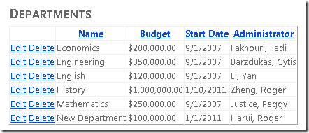
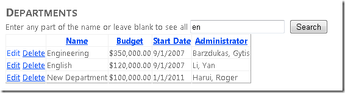

Using the Entity Framework 4.0 and the ObjectDataSource Control, Part 3: Sorting and Filtering
====================
by [Tom Dykstra](https://github.com/tdykstra)

> This tutorial series builds on the Contoso University web application that is created by the [Getting Started with the Entity Framework 4.0](https://asp.net/entity-framework/tutorials#Getting%20Started) tutorial series. If you didn't complete the earlier tutorials, as a starting point for this tutorial you can [download the application](https://code.msdn.microsoft.com/ASPNET-Web-Forms-97f8ee9a) that you would have created. You can also [download the application](https://code.msdn.microsoft.com/ASPNET-Web-Forms-6c7197aa) that is created by the complete tutorial series. If you have questions about the tutorials, you can post them to the [ASP.NET Entity Framework forum](https://forums.asp.net/1227.aspx).

In the previous tutorial you implemented the repository pattern in an n-tier web application that uses the Entity Framework and the `ObjectDataSource` control. This tutorial shows how to do sorting and filtering and handle master-detail scenarios. You'll add the following enhancements to the *Departments.aspx* page:

- A text box to allow users to select departments by name.
- A list of courses for each department that's shown in the grid.
- The ability to sort by clicking column headings.

## Adding the Ability to Sort GridView Columns

Open the *Departments.aspx* page and add a `SortParameterName="sortExpression"` attribute to the `ObjectDataSource` control named `DepartmentsObjectDataSource`. (Later you'll create a `GetDepartments` method that takes a parameter named `sortExpression`.) The markup for the opening tag of the control now resembles the following example.

[!code-aspx[Main](using-the-entity-framework-and-the-objectdatasource-control-part-3-sorting-and-filtering/samples/sample1.aspx)]

Add the `AllowSorting="true"` attribute to the opening tag of the `GridView` control. The markup for the opening tag of the control now resembles the following example.

[!code-aspx[Main](using-the-entity-framework-and-the-objectdatasource-control-part-3-sorting-and-filtering/samples/sample2.aspx)]

In *Departments.aspx.cs*, set the default sort order by calling the `GridView` control's `Sort` method from the `Page_Load` method:

[!code-csharp[Main](using-the-entity-framework-and-the-objectdatasource-control-part-3-sorting-and-filtering/samples/sample3.cs)]

You can add code that sorts or filters in either the business logic class or the repository class. If you do it in the business logic class, the sorting or filtering work will be done after the data is retrieved from the database, because the business logic class is working with an `IEnumerable` object returned by the repository. If you add sorting and filtering code in the repository class and you do it before a LINQ expression or object query has been converted to an `IEnumerable` object, your commands will be passed through to the database for processing, which is typically more efficient. In this tutorial you'll implement sorting and filtering in a way that causes the processing to be done by the database — that is, in the repository.

To add sorting capability, you must add a new method to the repository interface and repository classes as well as to the business logic class. In the *ISchoolRepository.cs* file, add a new `GetDepartments` method that takes a `sortExpression` parameter that will be used to sort the list of departments that's returned:

[!code-csharp[Main](using-the-entity-framework-and-the-objectdatasource-control-part-3-sorting-and-filtering/samples/sample4.cs)]

The `sortExpression` parameter will specify the column to sort on and the sort direction.

Add code for the new method to the *SchoolRepository.cs* file:

[!code-csharp[Main](using-the-entity-framework-and-the-objectdatasource-control-part-3-sorting-and-filtering/samples/sample5.cs)]

Change the existing parameterless `GetDepartments` method to call the new method:

[!code-csharp[Main](using-the-entity-framework-and-the-objectdatasource-control-part-3-sorting-and-filtering/samples/sample6.cs)]

In the test project, add the following new method to *MockSchoolRepository.cs*:

[!code-csharp[Main](using-the-entity-framework-and-the-objectdatasource-control-part-3-sorting-and-filtering/samples/sample7.cs)]

If you were going to create any unit tests that depended on this method returning a sorted list, you would need to sort the list before returning it. You won't be creating tests like that in this tutorial, so the method can just return the unsorted list of departments.

In the *SchoolBL.cs* file, add the following new method to the business logic class:

[!code-csharp[Main](using-the-entity-framework-and-the-objectdatasource-control-part-3-sorting-and-filtering/samples/sample8.cs)]

This code passes the sort parameter to the repository method.

Run the *Departments.aspx* page.

You can now click any column heading to sort by that column. If the column is already sorted, clicking the heading reverses the sort direction.

## Adding a Search Box

In this section you'll add a search text box, link it to the `ObjectDataSource` control using a control parameter, and add a method to the business logic class to support filtering.

Open the *Departments.aspx* page and add the following markup between the heading and the first `ObjectDataSource` control:

[!code-aspx[Main](using-the-entity-framework-and-the-objectdatasource-control-part-3-sorting-and-filtering/samples/sample9.aspx)]

In the `ObjectDataSource` control named `DepartmentsObjectDataSource`, do the following:

- Add a `SelectParameters` element for a parameter named `nameSearchString` that gets the value entered in the `SearchTextBox` control.
- Change the `SelectMethod` attribute value to `GetDepartmentsByName`. (You'll create this method later.)

The markup for the `ObjectDataSource` control now resembles the following example:

[!code-aspx[Main](using-the-entity-framework-and-the-objectdatasource-control-part-3-sorting-and-filtering/samples/sample10.aspx)]

In *ISchoolRepository.cs*, add a `GetDepartmentsByName` method that takes both `sortExpression` and `nameSearchString` parameters:

[!code-csharp[Main](using-the-entity-framework-and-the-objectdatasource-control-part-3-sorting-and-filtering/samples/sample11.cs)]

In *SchoolRepository.cs*, add the following new method:

[!code-csharp[Main](using-the-entity-framework-and-the-objectdatasource-control-part-3-sorting-and-filtering/samples/sample12.cs)]

This code uses a `Where` method to select items that contain the search string. If the search string is empty, all records will be selected. Note that when you specify method calls together in one statement like this (`Include`, then `OrderBy`, then `Where`), the `Where` method must always be last.

Change the existing `GetDepartments` method that takes a `sortExpression` parameter to call the new method:

[!code-csharp[Main](using-the-entity-framework-and-the-objectdatasource-control-part-3-sorting-and-filtering/samples/sample13.cs)]

In *MockSchoolRepository.cs* in the test project, add the following new method:

[!code-csharp[Main](using-the-entity-framework-and-the-objectdatasource-control-part-3-sorting-and-filtering/samples/sample14.cs)]

In *SchoolBL.cs*, add the following new method:

[!code-csharp[Main](using-the-entity-framework-and-the-objectdatasource-control-part-3-sorting-and-filtering/samples/sample15.cs)]

Run the *Departments.aspx* page and enter a search string to make sure that the selection logic works. Leave the text box empty and try a search to make sure that all records are returned.

## Adding a Details Column for Each Grid Row

Next, you want to see all of the courses for each department displayed in the right-hand cell of the grid. To do this, you'll use a nested `GridView` control and databind it to data from the `Courses` navigation property of the `Department` entity.

Open *Departments.aspx* and in the markup for the `GridView` control, specify a handler for the `RowDataBound` event. The markup for the opening tag of the control now resembles the following example.

[!code-aspx[Main](using-the-entity-framework-and-the-objectdatasource-control-part-3-sorting-and-filtering/samples/sample16.aspx)]

Add a new `TemplateField` element after the `Administrator` template field:

[!code-aspx[Main](using-the-entity-framework-and-the-objectdatasource-control-part-3-sorting-and-filtering/samples/sample17.aspx)]

This markup creates a nested `GridView` control that shows the course number and title of a list of courses. It does not specify a data source because you'll databind it in code in the `RowDataBound` handler.

Open *Departments.aspx.cs* and add the following handler for the `RowDataBound` event:

[!code-csharp[Main](using-the-entity-framework-and-the-objectdatasource-control-part-3-sorting-and-filtering/samples/sample18.cs)]

This code gets the `Department` entity from the event arguments, converts the `Courses` navigation property to a `List` collection, and databinds the nested `GridView` to the collection.

Open the *SchoolRepository.cs* file and specify eager loading for the `Courses` navigation property by calling the `Include` method in the object query that you create in the `GetDepartmentsByName` method. The `return` statement in the `GetDepartmentsByName` method now resembles the following example.

[!code-csharp[Main](using-the-entity-framework-and-the-objectdatasource-control-part-3-sorting-and-filtering/samples/sample19.cs)]

Run the page. In addition to the sorting and filtering capability that you added earlier, the GridView control now shows nested course details for each department.

This completes the introduction to sorting, filtering, and master-detail scenarios. In the next tutorial, you'll see how to handle concurrency.

>[!div class="step-by-step"]
[Previous](using-the-entity-framework-and-the-objectdatasource-control-part-2-adding-a-business-logic-layer-and-unit-tests.md)
[Next](handling-concurrency-with-the-entity-framework-in-an-asp-net-web-application.md)