What's New in the Entity Framework 4.0
====================
by [Tom Dykstra](https://github.com/tdykstra)

> This tutorial series builds on the Contoso University web application that is created by the [Getting Started with the Entity Framework](../getting-started-with-ef/the-entity-framework-and-aspnet-getting-started-part-1.md) tutorial series. If you didn't complete the earlier tutorials, as a starting point for this tutorial you can [download the application](https://code.msdn.microsoft.com/ASPNET-Web-Forms-97f8ee9a) that you would have created. You can also [download the application](https://code.msdn.microsoft.com/ASPNET-Web-Forms-6c7197aa) that is created by the complete tutorial series. If you have questions about the tutorials, you can post them to the [ASP.NET Entity Framework forum](https://forums.asp.net/1227.aspx).

In the previous tutorial you saw some methods for maximizing the performance of a web application that uses the Entity Framework. This tutorial reviews some of the most important new features in version 4 of the Entity Framework, and it links to resources that provide a more complete introduction to all of the new features. The features highlighted in this tutorial include the following:

- Foreign-key associations.
- Executing user-defined SQL commands.
- Model-first development.
- POCO support.

In addition, the tutorial will briefly introduce *code-first development*, a feature that's coming in the next release of the Entity Framework.

To start the tutorial, start Visual Studio and open the Contoso University web application that you were working with in the previous tutorial.

## Foreign-Key Associations

Version 3.5 of the Entity Framework included navigation properties, but it didn't include foreign-key properties in the data model. For example, the `CourseID` and `StudentID` columns of the `StudentGrade` table would be omitted from the `StudentGrade` entity.

[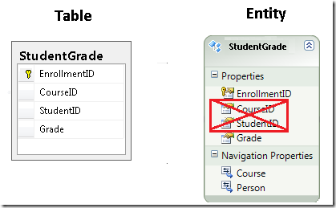](what-s-new-in-the-entity-framework-4/_static/image1.png)

The reason for this approach was that, strictly speaking, foreign keys are a physical implementation detail and don't belong in a conceptual data model. However, as a practical matter, it's often easier to work with entities in code when you have direct access to the foreign keys.

For an example of how foreign keys in the data model can simplify your code, consider how you would have had to code the *DepartmentsAdd.aspx* page without them. In the `Department` entity, the `Administrator` property is a foreign key that corresponds to `PersonID` in the `Person` entity. In order to establish the association between a new department and its administrator, all you had to do was set the value for the `Administrator` property in the `ItemInserting` event handler of the databound control:

[!code-csharp[Main](what-s-new-in-the-entity-framework-4/samples/sample1.cs)]

Without foreign keys in the data model, you'd handle the `Inserting` event of the data source control instead of the `ItemInserting` event of the databound control, in order to get a reference to the entity itself before the entity is added to the entity set. When you have that reference, you establish the association using code like that in the following examples:

[!code-csharp[Main](what-s-new-in-the-entity-framework-4/samples/sample2.cs)]

[!code-csharp[Main](what-s-new-in-the-entity-framework-4/samples/sample3.cs)]

As you can see in the Entity Framework team's [blog post on Foreign Key associations](https://blogs.msdn.com/b/efdesign/archive/2009/03/16/foreign-keys-in-the-entity-framework.aspx), there are other cases where the difference in code complexity is much greater. To meet the needs of those who prefer to live with implementation details in the conceptual data model for the sake of simpler code, the Entity Framework now gives you the option of including foreign keys in the data model.

In Entity Framework terminology, if you include foreign keys in the data model you're using *foreign key associations*, and if you exclude foreign keys you're using *independent associations*.

## Executing User-Defined SQL Commands

In earlier versions of the Entity Framework, there was no easy way to create your own SQL commands on the fly and run them. Either the Entity Framework dynamically generated SQL commands for you, or you had to create a stored procedure and import it as a function. Version 4 adds `ExecuteStoreQuery` and `ExecuteStoreCommand` methods the `ObjectContext` class that make it easier for you to pass any query directly to the database.

Suppose Contoso University administrators want to be able to perform bulk changes in the database without having to go through the process of creating a stored procedure and importing it into the data model. Their first request is for a page that lets them change the number of credits for all courses in the database. On the web page, they want to be able to enter a number to use to multiply the value of every `Course` row's `Credits` column.

Create a new page that uses the *Site.Master* master page and name it *UpdateCredits.aspx*. Then add the following markup to the `Content` control named `Content2`:

[!code-aspx[Main](what-s-new-in-the-entity-framework-4/samples/sample4.aspx)]

This markup creates a `TextBox` control in which the user can enter the multiplier value, a `Button` control to click in order to execute the command, and a `Label` control for indicating the number of rows affected.

Open *UpdateCredits.aspx.cs*, and add the following `using` statement and a handler for the button's `Click` event:

[!code-csharp[Main](what-s-new-in-the-entity-framework-4/samples/sample5.cs)]

[!code-csharp[Main](what-s-new-in-the-entity-framework-4/samples/sample6.cs)]

This code executes the SQL `Update` command using the value in the text box and uses the label to display the number of rows affected. Before you run the page, run the *Courses.aspx* page to get a "before" picture of some data.

Run *UpdateCredits.aspx*, enter "10" as the multiplier, and then click **Execute**.

[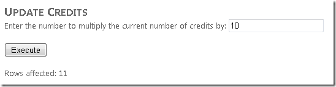](what-s-new-in-the-entity-framework-4/_static/image5.png)

Run the *Courses.aspx* page again to see the changed data.

[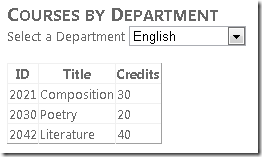](what-s-new-in-the-entity-framework-4/_static/image7.png)

(If you want to set the number of credits back to their original values, in *UpdateCredits.aspx.cs* change `Credits * {0}` to `Credits / {0}` and re-run the page, entering 10 as the divisor.)

For more information about executing queries that you define in code, see [How to: Directly Execute Commands Against the Data Source](https://msdn.microsoft.com/en-us/library/ee358769.aspx).

## Model-First Development

In these walkthroughs you created the database first and then generated the data model based on the database structure. In the Entity Framework 4 you can start with the data model instead and generate the database based on the data model structure. If you're creating an application for which the database doesn't already exist, the model-first approach enables you to create entities and relationships that make sense conceptually for the application, while not worrying about physical implementation details. (This remains true only through the initial stages of development, however. Eventually the database will be created and will have production data in it, and recreating it from the model will no longer be practical; at that point you'll be back to the database-first approach.)

In this section of the tutorial, you'll create a simple data model and generate the database from it.

In **Solution Explorer**, right-click the *DAL* folder and select **Add New Item**. In the **Add New Item** dialog box, under **Installed Templates** select **Data** and then select the **ADO.NET Entity Data Model** template. Name the new file *AlumniAssociationModel.edmx* and click **Add**.

[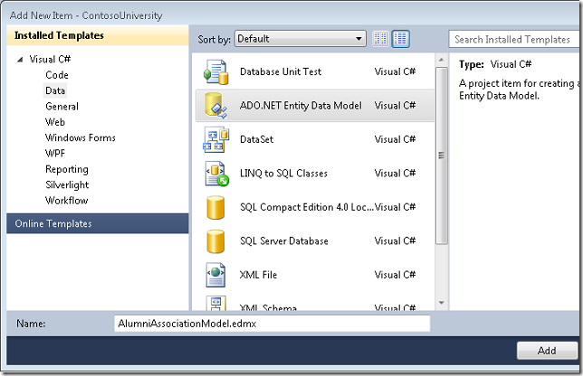](what-s-new-in-the-entity-framework-4/_static/image9.png)

This launches the Entity Data Model Wizard. In the **Choose Model Contents** step, select **Empty Model** and then click **Finish**.

[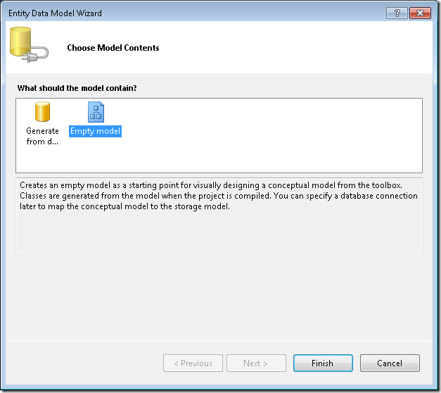](what-s-new-in-the-entity-framework-4/_static/image11.png)

The **Entity Data Model Designer** opens with a blank design surface. Drag an **Entity** item from the **Toolbox** onto the design surface.

Change the entity name from `Entity1` to `Alumnus`, change the `Id` property name to `AlumnusId`, and add a new scalar property named `Name`. To add new properties you can press Enter after changing the name of the `Id` column, or right-click the entity and select **Add Scalar Property**. The default type for new properties is `String`, which is fine for this simple demonstration, but of course you can change things like data type in the **Properties** window.

Create another entity the same way and name it `Donation`. Change the `Id` property to `DonationId` and add a scalar property named `DateAndAmount`.

[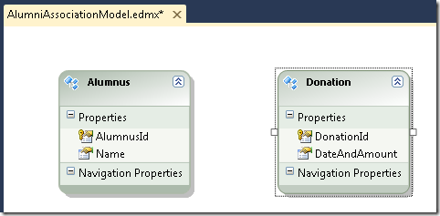](what-s-new-in-the-entity-framework-4/_static/image15.png)

To add an association between these two entities, right-click the `Alumnus` entity, select **Add**, and then select **Association**.

[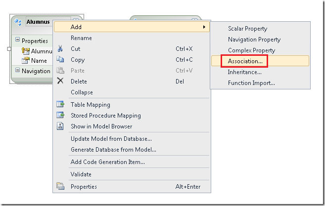](what-s-new-in-the-entity-framework-4/_static/image17.png)

The default values in the **Add Association** dialog box are what you want (one-to-many, include navigation properties, include foreign keys), so just click **OK**.

[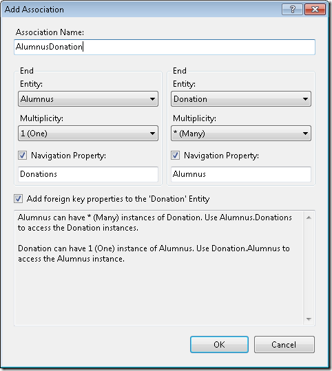](what-s-new-in-the-entity-framework-4/_static/image19.png)

The designer adds an association line and a foreign-key property.

[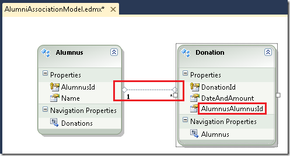](what-s-new-in-the-entity-framework-4/_static/image21.png)

Now you're ready to create the database. Right-click the design surface and select **Generate Database from Model**.

[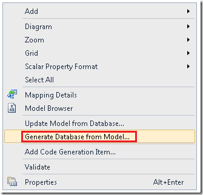](what-s-new-in-the-entity-framework-4/_static/image23.png)

This launches the Generate Database Wizard. (If you see warnings that indicate that the entities aren't mapped, you can ignore those for the time being.)

In the **Choose Your Data Connection** step, click **New Connection**.

[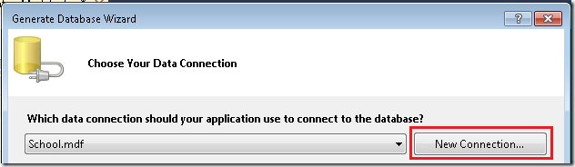](what-s-new-in-the-entity-framework-4/_static/image25.png)

In the **Connection Properties** dialog box, select the local SQL Server Express instance and name the database `AlumniAsssociation`.

[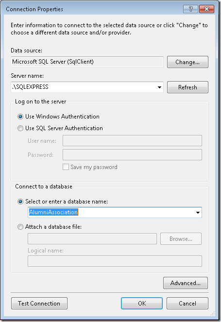](what-s-new-in-the-entity-framework-4/_static/image27.png)

Click **Yes** when you're asked if you want to create the database. When the **Choose Your Data Connection** step is displayed again, click **Next**.

In the **Summary and Settings** step, click **Finish**.

[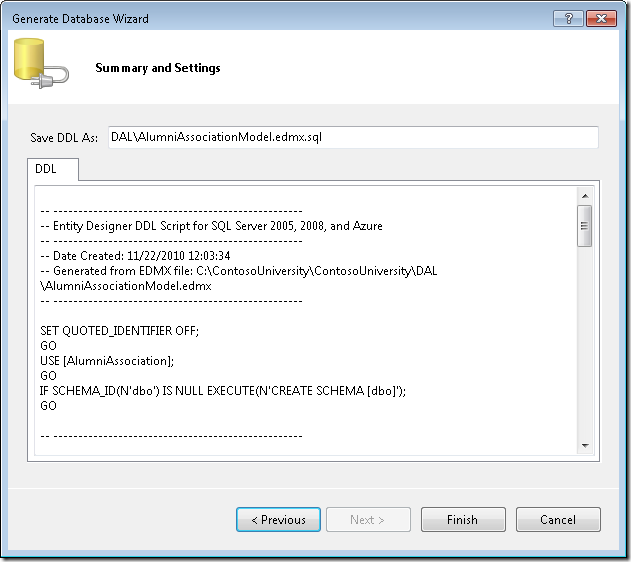](what-s-new-in-the-entity-framework-4/_static/image29.png)

A *.sql* file with the data definition language (DDL) commands is created, but the commands haven't been run yet.

[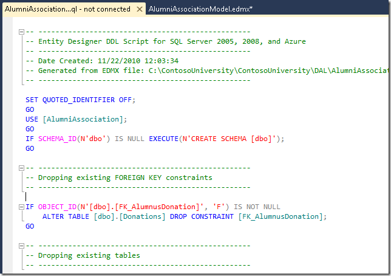](what-s-new-in-the-entity-framework-4/_static/image31.png)

Use a tool such as **SQL Server Management Studio** to run the script and create the tables, as you might have done when you created the `School` database for [the first tutorial in the Getting Started tutorial series](../getting-started-with-ef/the-entity-framework-and-aspnet-getting-started-part-1.md). (Unless you downloaded the database.)

You can now use the `AlumniAssociation` data model in your web pages the same way you've been using the `School` model. To try this out, add some data to the tables and create a web page that displays the data.

Using **Server Explorer**, add the following rows to the `Alumnus` and `Donation` tables.

[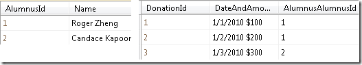](what-s-new-in-the-entity-framework-4/_static/image33.png)

Create a new web page named *Alumni.aspx* that uses the *Site.Master* master page. Add the following markup to the `Content` control named `Content2`:

[!code-aspx[Main](what-s-new-in-the-entity-framework-4/samples/sample7.aspx)]

This markup creates nested `GridView` controls, the outer one to display alumni names and the inner one to display donation dates and amounts.

Open *Alumni.aspx.cs*. Add a `using` statement for the data access layer and a handler for the outer `GridView` control's `RowDataBound` event:

[!code-csharp[Main](what-s-new-in-the-entity-framework-4/samples/sample8.cs)]

This code databinds the inner `GridView` control using the `Donations` navigation property of the current row's `Alumnus` entity.

Run the page.

[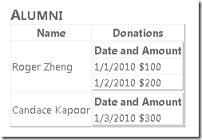](what-s-new-in-the-entity-framework-4/_static/image35.png)

(Note: This page is included in the downloadable project, but to make it work you must create the database in your local SQL Server Express instance; the database isn't included as an *.mdf* file in the *App\_Data* folder.)

For more information about using the model-first feature of the Entity Framework, see [Model-First in the Entity Framework 4](https://msdn.microsoft.com/en-us/data/ff830362.aspx).

## POCO Support

When you use domain-driven design methodology, you design data classes that represent data and behavior that's relevant to the business domain. These classes should be independent of any specific technology used to store (persist) the data; in other words, they should be *persistence ignorant*. Persistence ignorance can also make a class easier to unit test because the unit test project can use whatever persistence technology is most convenient for testing. Earlier versions of the Entity Framework offered limited support for persistence ignorance because entity classes had to inherit from the `EntityObject` class and thus included a great deal of Entity Framework-specific functionality.

The Entity Framework 4 introduces the ability to use entity classes that don't inherit from the `EntityObject` class and therefore are persistence ignorant. In the context of the Entity Framework, classes like this are typically called *plain-old CLR objects* (POCO, or POCOs). You can write POCO classes manually, or you can automatically generate them based on an existing data model using Text Template Transformation Toolkit (T4) templates provided by the Entity Framework.

For more information about using POCOs in the Entity Framework, see the following resources:

- [Working with POCO Entities](https://msdn.microsoft.com/en-us/library/dd456853.aspx). This is an MSDN document that's an overview of POCOs, with links to other documents that have more detailed information.
- [Walkthrough: POCO Template for the Entity Framework](https://blogs.msdn.com/b/adonet/archive/2010/01/25/walkthrough-poco-template-for-the-entity-framework.aspx) This is a blog post from the Entity Framework development team, with links to other blog posts about POCOs.

## Code-First Development

POCO support in the Entity Framework 4 still requires that you create a data model and link your entity classes to the data model. The next release of the Entity Framework will include a feature called *code-first development*. This feature enables you to use the Entity Framework with your own POCO classes without needing to use either the data model designer or a data model XML file. (Therefore, this option has also been called *code-only*; *code-first* and *code-only* both refer to the same Entity Framework feature.)

For more information about using the code-first approach to development, see the following resources:

- [Code-First Development with Entity Framework 4](https://weblogs.asp.net/scottgu/archive/2010/07/16/code-first-development-with-entity-framework-4.aspx). This is a blog post by Scott Guthrie introducing code-first development.
- [Entity Framework Development Team Blog - posts tagged CodeOnly](https://blogs.msdn.com/b/efdesign/archive/tags/codeonly/)
- [Entity Framework Development Team Blog - posts tagged Code First](https://blogs.msdn.com/b/efdesign/archive/tags/code+first/)
- [MVC Music Store tutorial - Part 4: Models and Data Access](../../../../mvc/overview/older-versions/mvc-music-store/mvc-music-store-part-4.md)
- [Getting Started with MVC 3 - Part 4: Entity Framework Code-First Development](../../../../mvc/overview/older-versions/getting-started-with-aspnet-mvc3/cs/adding-a-model.md)

In addition, a new MVC Code-First tutorial that builds an application similar to the Contoso University application is projected to be published in the spring of 2011 at [https://asp.net/entity-framework/tutorials](../../../../entity-framework.md)

## More Information

This completes the overview to what's new in the Entity Framework and this Continuing with the Entity Framework tutorial series. For more information about new features in the Entity Framework 4 that aren't covered here, see the following resources:

- [What's New in ADO.NET](https://msdn.microsoft.com/en-us/library/ex6y04yf.aspx) MSDN topic on new features in version 4 of the Entity Framework.
- [Announcing the release of Entity Framework 4](https://blogs.msdn.com/b/efdesign/archive/2010/04/12/announcing-the-release-of-entity-framework-4.aspx) The Entity Framework development team's blog post about new features in version 4.

>[!div class="step-by-step"]
[Previous](maximizing-performance-with-the-entity-framework-in-an-asp-net-web-application.md)