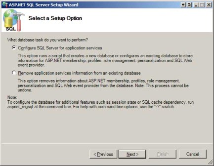
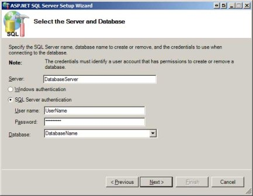
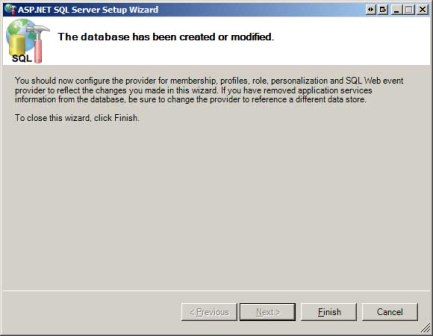
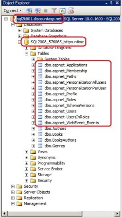
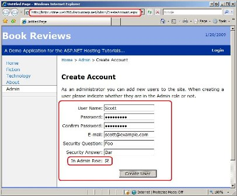

Configuring a Website that Uses Application Services (C#)
====================
by [Scott Mitchell](https://twitter.com/ScottOnWriting)

[Download Code](http://download.microsoft.com/download/E/6/F/E6FE3A1F-EE3A-4119-989A-33D1A9F6F6DD/ASPNET_Hosting_Tutorial_09_CS.zip) or [Download PDF](http://download.microsoft.com/download/C/3/9/C391A649-B357-4A7B-BAA4-48C96871FEA6/aspnet_tutorial09_AppServicesConfig_cs.pdf)

> ASP.NET version 2.0 introduced a series of application services, which are part of the .NET Framework and serve as a suite of building block services that you can use to add rich functionality to your web application. This tutorial explores how to configure a website in the production environment to use application services and addresses common issues with managing user accounts and roles on the production environment.

## Introduction

ASP.NET version 2.0 introduced a series of *application services*, which are part of the .NET Framework and serve as a suite of building block services that you can use to add rich functionality to your web application. The application services include:

- **Membership** - an API for creating and managing user accounts.
- **Roles** - an API for categorizing users into groups.
- **Profile** - an API for storing custom, user-specific content.
- **Site Map** - an API for defining a site s logical structure in the form of a hierarchy, which can then be displayed via navigation controls, such as menus and breadcrumbs.
- **Personalization** - an API for maintaining customization preferences, most often used with [*WebParts*](https://msdn.microsoft.com/en-us/library/e0s9t4ck.aspx).
- **Health Monitoring** - an API for monitoring performance, security, errors, and other system health metrics for a running web application.
  

The application services APIs are not tied to a specific implementation. Instead, you instruct the application services to use a particular *provider*, and that provider implements the service using a particular technology. The most commonly used providers for Internet-based web applications hosted at a web hosting company are those providers that use a SQL Server database implementation. For example, the `SqlMembershipProvider` is a provider for the Membership API that stores user account information in a Microsoft SQL Server database.

Using the application services and SQL Server providers adds some challenges when deploying the application. For starters, the application services database objects must be properly created on both the development and production databases and appropriately initialized. There are also important configuration settings that need to be made.

> [!NOTE]
> The application services APIs were designed using the [*provider model*](http://aspnet.4guysfromrolla.com/articles/101905-1.aspx), a design pattern that allows for an API s implementation details to be provided at runtime. The .NET Framework ships with a number of application service providers that can be used, such as the `SqlMembershipProvider` and `SqlRoleProvider`, which are providers for the Membership and Roles APIs that use a SQL Server database implementation. You can also create and plug-in a custom provider. In fact, the Book Reviews web application already contains a custom provider for the Site Map API (`ReviewSiteMapProvider`), which constructs the site map from the data in the `Genres` and `Books` tables in the database.

This tutorial starts with a look at how I extended the Book Reviews web application to use the Membership and Roles APIs. It then walks through deploying a web application that uses application services with a SQL Server database implementation, and concludes by addressing common issues with managing user accounts and roles on the production environment.

## Updates to the Book Reviews Application

Over the past couple tutorials the Book Reviews web application was updated from a static website to a dynamic, data-driven web application complete with a set of administration pages for managing genres and reviews. However, this administration section is currently not protected - any user who knows (or guesses) the administration page URL can waltz in and create, edit, or delete reviews on our site. A common way to protect certain portions of a website is to implement user accounts and then use URL authorization rules to restrict access to certain users or roles. The Book Reviews web application available for download with this tutorial supports user accounts and roles. It has a single role defined named Admin and only users in this role can access the administration pages.

> [!NOTE]
> I ve created three user accounts in the Book Reviews web application: Scott, Jisun, and Alice. All three users have the same password: **password!** Scott and Jisun are in the Admin role, Alice is not. The site s non-administration pages are still accessible to anonymous users. That is, you do not need to sign in to visit the site, unless you want to administer it, in which case you must sign in as a user in the Admin role.

The Book Reviews application s master page has been updated to include a different user interface for authenticated and anonymous users. If an anonymous user visits the site she sees a Login link in the upper right corner. An authenticated user sees the message, "Welcome back, *username*!" and a link to log out. There s also a login page (`~/Login.aspx`), which contains a Login Web control that provides the user interface and logic for authenticating a visitor. Only administrators can create new accounts. (There are pages for creating and managing user accounts in the `~/Admin` folder.)

### Configuring the Membership and Roles APIs

The Book Reviews web application uses the Membership and Roles APIs to support user accounts and to group those users into roles (namely, the Admin role). The `SqlMembershipProvider` and `SqlRoleProvider` provider classes are used because we want to store account and role information in a SQL Server database.

> [!NOTE]
> This tutorial is not intended to be a detailed examination at configuring a web application to support the Membership and Roles APIs. For a thorough look at these APIs and the steps you need to take to configure a website to use them, please read my [*Website Security Tutorials*](../../older-versions-security/introduction/security-basics-and-asp-net-support-cs.md).

To use the application services with a SQL Server database you must first add the database objects used by these providers to the database where you want the user account and role information stored. These requisite database objects include a variety of tables, views, and stored procedures. Unless specified otherwise, the `SqlMembershipProvider` and `SqlRoleProvider` provider classes use a SQL Server Express Edition database named `ASPNETDB` located in the application s `App_Data` folder; if such a database does not exist, it is automatically created with the necessary database objects by these providers at runtime.

It is possible, and usually ideal, to create the application services database objects in the same database where the website s application-specific data is stored. The .NET Framework ships with a tool named `aspnet_regsql.exe` that installs the database objects on a specified database. I have gone ahead and used this tool to add these objects to the `Reviews.mdf` database in the `App_Data` folder (the development database). We'll see how to use this tool later in this tutorial when we add these objects to the production database.

If you add the application services database objects to a database other than `ASPNETDB` you will need to customize the `SqlMembershipProvider` and `SqlRoleProvider` provider classes configurations so that they use the appropriate database. To customize the Membership provider add a [*&lt;membership&gt; element*](https://msdn.microsoft.com/en-us/library/1b9hw62f.aspx) within the `<system.web>` section in `Web.config`; use the [*&lt;roleManager&gt; element*](https://msdn.microsoft.com/en-us/library/ms164660.aspx) to configure the Roles provider. The following snippet is taken from the Book Reviews application s `Web.config` and shows the configure settings for the Membership and Roles APIs. Note that both register a new provider - `ReviewMembership` and `ReviewRole` - that use the `SqlMembershipProvider` and `SqlRoleProvider` providers, respectively.

[!code-xml[Main](configuring-a-website-that-uses-application-services-cs/samples/sample1.xml)]

The `Web.config` file s `<authentication>` element has also been configured to support forms-based authentication.
  

[!code-xml[Main](configuring-a-website-that-uses-application-services-cs/samples/sample2.xml)]

### Limiting Access to the Administration Pages

ASP.NET makes it easy to grant or deny access to a particular file or folder by user or by role via its *URL authorization* feature. (We briefly discussed URL authorization in the *Core Differences Between IIS and the ASP.NET Development Server* tutorial and showed how IIS and the ASP.NET Development Server apply URL authorization rules differently for static versus dynamic content.) Because we want to prohibit access to the `~/Admin` folder except for those users in the Admin role, we need to add URL authorization rules to this folder. Specifically, the URL authorization rules need to allow users in the Admin role and deny all other users. This is accomplished by adding a `Web.config` file to the `~/Admin` folder with the following contents:

[!code-xml[Main](configuring-a-website-that-uses-application-services-cs/samples/sample3.xml)]

For more information on ASP.NET s URL authorization feature and how to use it to spell out authorization rules for users and for roles, be sure to read the [*User-Based Authorization*](../../older-versions-security/membership/user-based-authorization-cs.md) and [*Role-Based Authorization*](../../older-versions-security/roles/role-based-authorization-cs.md) tutorials from my [*Website Security Tutorials*](../../older-versions-security/introduction/security-basics-and-asp-net-support-cs.md).

## Deploying a Web Application That Uses Application Services

When deploying a website that uses application services and a provider that stores the application services information in a database, it is imperative that the database objects needed by the application services be created on the production database. Initially the production database does not contain these objects, so when the application is first deployed (or when it is deployed for the first time after application services have been added), you must take extra steps to get these requisite database objects on the production database.

Another challenge can arise when deploying a website that uses application services if you intend to replicate the user accounts created in the development environment to the production environment. Depending on the Membership and Roles configuration, it is possible that even if you successfully copy the user accounts that were created in the development environment to the production database, these users cannot sign into the web application in production. We'll look at the cause of this issue and discuss how to prevent it from happening.

ASP.NET ships with a nice [*Web Site Administration Tool (WSAT)*](https://msdn.microsoft.com/en-us/library/yy40ytx0.aspx) that can be launched from Visual Studio and allows the user account, roles, and authorization rules to be managed through a web-based interface. Unfortunately, the WSAT only works for local websites, meaning that it cannot be used to remotely manage user accounts, roles, and authorization rules for the web application in the production environment. We'll look at different ways to implement WSAT-like behavior from your production website.

### Adding the Database Objects Using aspnet\_regsql.exe

The *Deploying a Database* tutorial showed how to copy the tables and data from the development database to the production database, and these techniques can certainly be used to copy the application services database objects to the production database. Another option is the `aspnet_regsql.exe` tool, which adds or removes the application services database objects from a database.

> [!NOTE]
> The `aspnet_regsql.exe` tool creates the database objects on a specified database. It does not migrate data in those database objects from the development database to the production database. If you mean to copy the user account and role information in the development database to the production database use the techniques covered in the *Deploying a Database* tutorial.

Let s look at how to add the database objects to the production database using the `aspnet_regsql.exe` tool. Start by opening Windows Explorer and navigating to the .NET Framework version 2.0 directory on your computer, %WINDIR%\ Microsoft.NET\Framework\v2.0.50727. There you should find the `aspnet_regsql.exe` tool. This tool can be used from the command-line, but it also includes a graphical user interface; double-click the `aspnet_regsql.exe` file to launch its graphical component.

The tool starts by displaying a splash screen explaining its purpose. Click Next to advance to the "Select a Setup Option" screen, which is shown in Figure 1. From here you can choose to add the application services database objects or remove them from a database. Because we want to add these objects to the production database, select the "Configure SQL Server for application services" option and click Next.

**Figure 1**: Choose to Configure SQL Server for Application Services ([Click to view full-size image](configuring-a-website-that-uses-application-services-cs/_static/image3.jpg))

In "Select the Server and Database" screen prompts for information to connect to the database. Enter the database server, the security credentials, and the database name supplied to you by your web hosting company and click Next.

> [!NOTE]
> After entering your database server and credentials you may get an error when expanding the database drop-down list. The `aspnet_regsql.exe` tool queries the `sysdatabases` system table to retrieve a list of databases on the server, but some web hosting companies lock down their database servers so that this information is not publicly available. If you get this error you can type the database name directly into the drop-down list.

**Figure 2**: Supply the Tool With Your Database s Connection Information ([Click to view full-size image](configuring-a-website-that-uses-application-services-cs/_static/image6.jpg))

The subsequent screen summarizes the actions that are about to take place, namely that the application services database objects are going to be added to the specified database. Click Next to complete this action. After a few moments, the final screen is displayed, noting that the database objects have been added (see Figure 3).

**Figure 3**: Success! The Application Services Database Objects Were Added to the Production Database ([Click to view full-size image](configuring-a-website-that-uses-application-services-cs/_static/image9.jpg))

To verify that the application services database objects were successfully added to the production database, open SQL Server Management Studio and connect to your production database. As Figure 4 shows, you should now see the application services database tables in your database, `aspnet_Applications`, `aspnet_Membership`, `aspnet_Users`, and so forth.

**Figure 4**: Confirm That the Database Objects Were Added to the Production Database ([Click to view full-size image](configuring-a-website-that-uses-application-services-cs/_static/image12.jpg))

You will only need to use the `aspnet_regsql.exe` tool when deploying your web application for the first time or for the first time after you have started using the application services. Once these database objects are on the production database they won t need to be re-added or modified.

### Copying User Accounts from Development to Production

When using the `SqlMembershipProvider` and `SqlRoleProvider` provider classes to store the application services information in a SQL Server database, the user account and role information is stored in a variety of database tables, including `aspnet_Users`, `aspnet_Membership`, `aspnet_Roles`, and `aspnet_UsersInRoles`, among others. If during development you create user accounts in the development environment you can replicate those user accounts in production by copying the corresponding records from the applicable database tables. If you used the Database Publishing Wizard to deploy the application services database objects you may have also elected to copy the records, which would result in the user accounts created in development to also be on production. But, depending on your configuration settings, you may find that those users whose accounts were created in development and copied to production are unable to login from the production website. What gives?

The `SqlMembershipProvider` and `SqlRoleProvider` provider classes were designed such that a single database could serve as a user store for multiple applications, where each application could, in theory, have users with overlapping usernames and roles with the same name. To allow for this flexibility, the database maintains a list of applications in the `aspnet_Applications` table, and each user is associated with one of these applications. Specifically, the `aspnet_Users` table has an `ApplicationId` column that ties each user to a record in the `aspnet_Applications` table.

In addition to the `ApplicationId` column, the `aspnet_Applications` table also includes an `ApplicationName` column, which provides a more human-friendly name for the application. When a website attempts to work with a user account, such as validating a user s credentials from the login page, it must tell the `SqlMembershipProvider` class what application to work with. It usually does this by supplying the application name, and the this value comes from the provider s configuration in `Web.config` - specifically via the `applicationName` attribute.

But what happens if the `applicationName` attribute is not specified in `Web.config`? In such a case the Membership system uses the application root path as the `applicationName` value. If the `applicationName` attribute is not explicitly set in `Web.config`, then, there is the possibility that the development environment and production environment use a different application root and therefore will be associated with different application names in the application services. If such a mismatch occurs then those users created in the development environment will have an `ApplicationId` value that does not match with the `ApplicationId` value for the production environment. The net result is that those users won t be able to login.

> [!NOTE]
> If you find yourself in this situation - with user accounts copied to production with a mismatched `ApplicationId` value - you could write a query to update these incorrect `ApplicationId` values to the `ApplicationId` used on production. Once updated, the users whose accounts were created on the development environment would now be able to sign into the web application on production.

The good news is that there is a simple step you can take to ensure that the two environments use the same `ApplicationId` - explicitly set the `applicationName` attribute in `Web.config` for all of your application services providers. I explicitly set the `applicationName` attribute to "BookReviews" in the `<membership>` and `<roleManager>` elements as this snippet from `Web.config` shows.

[!code-xml[Main](configuring-a-website-that-uses-application-services-cs/samples/sample4.xml)]

For more discussion on setting the `applicationName` attribute and the rationale behind it, refer to [*Scott Guthrie*](https://weblogs.asp.net/scottgu/) s blog post, [*Always set the applicationName property when configuring ASP.NET Membership and other Providers*](https://weblogs.asp.net/scottgu/443634).

### Managing User Accounts in the Production Environment

The ASP.NET Web Site Administration Tool (WSAT) makes it easy to create and manage user accounts, define and apply roles, and spell out user- and role-based authorization rules. You can launch the WSAT from Visual Studio by going to the Solution Explorer and clicking the ASP.NET Configuration icon or by going to the Website or Project menus and selecting the ASP.NET Configuration menu item. Unfortunately, the WSAT can only work with local websites. Therefore, you cannot use the WSAT from your workstation to manage the website in the production environment.

The good news is that all of the functionality exposed provided by the WSAT is available programmatically through the Membership and Roles APIs; furthermore, many of the WSAT screens use the standard ASP.NET Login-related controls. In short, you can add ASP.NET pages to your website that offer the necessary management capabilities.

Recall that an earlier tutorial updated the Book Reviews web application to include an `~/Admin` folder, and this folder has been configured to only allow users in the Admin role. I added a page to that folder named `CreateAccount.aspx` from which an administrator can create a new user account. This page uses the CreateUserWizard control to display the user interface and backend logic for creating a new user account. What s more, I customized the control to include a CheckBox that prompts whether the new user should also be added to the Admin role (see Figure 5). With a little bit of work you can build a custom set of pages that implements the user and role management-related tasks that would otherwise be provided by the WSAT.

> [!NOTE]
> For more information on using the Membership and Roles APIs along with the Login-related ASP.NET Web controls, be sure to read my [*Website Security Tutorials*](../../older-versions-security/introduction/security-basics-and-asp-net-support-cs.md). For more on customizing the CreateUserWizard control refer to the [*Creating User Accounts*](../../older-versions-security/membership/creating-user-accounts-cs.md) and [*Storing Additional User Information*](../../older-versions-security/membership/storing-additional-user-information-cs.md) tutorials, or check out [*Erich Peterson*](http://www.erichpeterson.com/) s article, [*Customizing the CreateUserWizard Control*](http://aspnet.4guysfromrolla.com/articles/070506-1.aspx).

**Figure 5**: Administrators Can Create New User Accounts ([Click to view full-size image](configuring-a-website-that-uses-application-services-cs/_static/image15.jpg))

If you need the full functionality of the WSAT check out [*Rolling Your Own Web Site Administration Tool*](http://aspnet.4guysfromrolla.com/articles/052307-1.aspx), in which author Dan Clem walks through the process of building a custom WSAT-like tool. Dan shares his application s source code (in C#) and provides step-by-step instructions for adding it to your hosted website.

## Summary

When deploying a web application that uses the application services database implementation you must first ensure that the production database has the requisite database objects. These objects can be added using the techniques discussed in the *Deploying a Database* tutorial; alternatively, you can use the `aspnet_regsql.exe` tool, as we saw in this tutorial. Other challenges we touched on center around synchronizing the application name used in the development and production environments (which is important if you want users and roles created in the development environment to be valid on production) and techniques for managing the users and roles in the production environment.

Happy Programming!

### Further Reading

For more information on the topics discussed in this tutorial, refer to the following resources:

- [*ASP.NET SQL Server Registration Tool (aspnet_regsql.exe)*](https://msdn.microsoft.com/en-us/library/ms229862.aspx)
- [*Creating the Application Services Database for SQL Server*](https://msdn.microsoft.com/en-us/library/x28wfk74.aspx)
- [*Creating the Membership Schema in SQL Server*](../../older-versions-security/membership/creating-the-membership-schema-in-sql-server-cs.md)
- [*Examining ASP.NET s Membership, Roles, and Profile*](http://aspnet.4guysfromrolla.com/articles/120705-1.aspx)
- [*Rolling Your Own Web Site Administration Tool*](http://aspnet.4guysfromrolla.com/articles/052307-1.aspx)
- [*Website Security Tutorials*](../../older-versions-security/introduction/security-basics-and-asp-net-support-cs.md)
- [*Web Site Administration Tool Overview*](https://msdn.microsoft.com/en-us/library/yy40ytx0.aspx)

>[!div class="step-by-step"]
[Previous](configuring-the-production-web-application-to-use-the-production-database-cs.md)
[Next](strategies-for-database-development-and-deployment-cs.md)