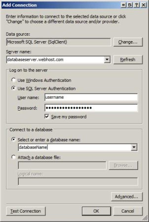
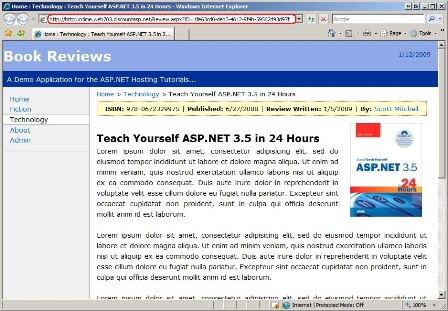

Configuring the Production Web Application to Use the Production Database (C#)
====================
by [Scott Mitchell](https://twitter.com/ScottOnWriting)

[Download Code](http://download.microsoft.com/download/E/6/F/E6FE3A1F-EE3A-4119-989A-33D1A9F6F6DD/ASPNET_Hosting_Tutorial_08_CS.zip) or [Download PDF](http://download.microsoft.com/download/C/3/9/C391A649-B357-4A7B-BAA4-48C96871FEA6/aspnet_tutorial08_DBConfig_cs.pdf)

> As discussed in earlier tutorials, it is not uncommon for configuration information to differ between the development and production environments. This is especially true for data-driven web applications, as the database connection strings differ between the development and production environments. This tutorial explores ways to configure the production environment to include the appropriate connection string in more detail.

## Introduction

Data-driven web applications usually use a different database when in development than when in production. For applications hosted by a web host provider and developed locally, the development database typically resides on the developer s computer while the production database is hosted on a database server at the web hosting company s facility. Deploying a data-driven web application entails copying the development database to the production database server. In the previous tutorial we looked at ways to accomplish this step.

The web application uses the information in a *connection string* to establish a connection with the database. The connection string, which is typically stored in `Web.config`, specifies the database server name, the name of the database, the security context, and other information. Because the database used by the web application depends on whether the web application is running in the development or production environments, the connection strings must differ between the two environments.

It is not uncommon for configuration information to differ between the development and production environments. The *Common Configuration Differences Between Development and Production* tutorial discussed techniques for maintaining separate configuration information between these two environments, as well as a brief discussion on database connection strings. This tutorial explores ways to configure the production environment to include the appropriate connection string in more detail.

## Examining the Connection String Information

The connection string used by the Book Reviews web application is stored in the application s configuration file, `Web.config`. `Web.config` includes a special section for storing connection strings, aptly named [&lt;connectionStrings&gt;](https://msdn.microsoft.com/en-us/library/bf7sd233.aspx). The `Web.config` file for the Book Reviews website has one connection string defined in this section named `ReviewsConnectionString`:

[!code-xml[Main](configuring-the-production-web-application-to-use-the-production-database-cs/samples/sample1.xml)]

The connection string - Data Source=.\SQLEXPRESS;AttachDbFilename=|DataDirectory|\Reviews.mdf;Integrated Security=True;User Instance=True - is composed of a number of options and values, with option/value pairs delimited by a semicolon and each option and value delimited by an equals sign. The four options used in this connection string are:

- `Data Source` - specifies the location of the database server and the database server instance name (if any). The value, `.\SQLEXPRESS`, is an example where there is a database server and an instance name. The period specifies that the database server is on the same computer as the application; the instance name is `SQLEXPRESS`.
- `AttachDbFilename` - specifies the location of the database file. The value contains the placeholder `|DataDirectory|`, which is resolved to the full path of the application s `App_Data` folder at runtime.
- `Integrated Security` - a Boolean value that indicates whether to use a specified username/password when connecting to the database (false) or the current Windows account credentials (true).
- `User Instance` - a configuration option specific to the SQL Server Express Editions that indicates whether to allow non-Administrative users on the local computer attach and connect to a SQL Server Express Edition database. See [SQL Server Express User Instances](https://msdn.microsoft.com/en-us/library/ms254504.aspx) for more information on this setting.
  

The allowable connection string options depend on the database you are connecting to and the ADO.NET database provider being used. For example, the connection string for connecting to a Microsoft SQL Server database differs from that used to connect to an Oracle database. Likewise, connecting to a Microsoft SQL Server database using the SqlClient provider uses a different connection string than when using the OLE-DB provider.

You can build the database connection string by hand using a site like [ConnectionStrings.com](http://www.connectionstrings.com/) as a resource for what options are available. However, an easier approach is to add the database to the Server Explorer in Visual Studio and then to grab the connection string from the Properties window. Let s use this latter technique for constructing the connection string to the production database server.

Open Visual Studio and then navigate to the Server Explorer window (in Visual Web Developer, this window is called Database Explorer). Right-click on the Data Connections option and choose the Add Connection option from the context menu. This brings up the wizard shown in Figure 1. Choose the appropriate data source and click Continue.

 

**Figure 1**: Choose to Add a New Database to the Server Explorer ([Click to view full-size image](configuring-the-production-web-application-to-use-the-production-database-cs/_static/image3.jpg))

Next, specify the various database connection information (see Figure 2). When you signed up with your web hosting company they should have provided information on how to connect to the database - the database server name, the database name, the username and password to use to connect to the database, and so on. After entering this information click OK to complete this wizard and to add the database to the Server Explorer.

 

**Figure 2**: Specify the Database Connection Information ([Click to view full-size image](configuring-the-production-web-application-to-use-the-production-database-cs/_static/image6.jpg))

The production environment database should now be listed in the Server Explorer. Select the database from the Server Explorer and go to the Properties window. There you will find a property named Connection String with the database s connection string. Assuming you are using a Microsoft SQL Server database on production and the SqlClient provider your connection string should look similar to the following:

**Data Source=*serverName*; Initial Catalog=*databaseName*; Persist Security Info=True; User ID=*username*; Password=*password***

Where *serverName*, *databaseName*, *username*, and *password* are with the values for the database server name, the database name, and the username and password supplied to you by your web host company.

## Deploying the Book Reviews Web Application

The preceding tutorial stepped through copying the development database to the production environment, but did not explore deploying the data-driven application. At this point the production environment contains the database but is using the version of the Book Reviews application with static reviews. We need to deploy the new, data-driven application to the production server along with the updated configuration information.

Take a moment to deploy the data-driven application from the development environment to production. This process was covered in detail in previous tutorials. If you need a refresher, see the *Deploying Your Website Using an FTP Client* or the *Deploying Your Website Using Visual Studio* tutorials. You will need to ensure that the production database connection string is the one used in the production environment, which means that an alternate `Web.config` file must be deployed. Specifically, this modified `Web.config` file s `<connectionStrings>` element needs to contain the production database connection string and should look similar to the following:

[!code-xml[Main](configuring-the-production-web-application-to-use-the-production-database-cs/samples/sample2.xml)]

Note that the connection string in the `<connectionStrings>` element is named the same (`ReviewsConnectionString`), but now contains the production database connection string instead of the development database connection string.

Unless you have a more formalized deployment workflow, either manually modify the `Web.config` file to use the production database connection string before deploying (remembering to revert it back to using the development database connection string afterwards) or maintain a separate `Web.config` file with the production environment configuration information that gets uploaded to the production environment as part of the deployment process.

> [!NOTE]
> If you accidentally deploy a `Web.config` file that contains the development database connection string then there will be an error when the application on production attempts to connect to the database. This error manifests as a `SqlException` with a message reporting that the server was not found or was not accessible.

Once the site has been deployed to production, visit the production site through your browser. You should see and enjoy the same user experience as when running the data-driven application locally. Of course when you visit the website on production the site is powered by the production database server, whereas visiting the website in the development environment uses the database in development. Figure 3 shows the *Teach Yourself ASP.NET 3.5 in 24 Hours* review page from the website in the production environment (note the URL in the browser s Address bar).

 

**Figure 3**: The Data-Driven Application is Now Available On Production! ([Click to view full-size image](configuring-the-production-web-application-to-use-the-production-database-cs/_static/image9.jpg))

### Storing Connection Strings in a Separate Configuration File

A common technique for maintaining separate configuration information on the development and production environments is to have two versions of the `Web.config`: one for the development environment and one for production. At deploy-time the appropriate `Web.config` version can be copied to the production environment. Ideally, this process would be automated as part of the deployment workflow.

Instead of maintaining two separate `Web.config` files you can, optionally, provide more granular differences. The elements that make up the `Web.config` file can be defined in an external configuration files that are then referenced in the `Web.config` file. In a nutshell you can have one `Web.config` file for both environments that references a databaseConnectionStrings.config file, which would contain the connection strings used by the application and would be unique for each environment. I find that separating the differing configuration information into separate files provides a tidier and simpler `Web.config` file and more clearly outlines the configuration differences between the development and production environments.

To use this technique, start by creating a new folder in the web application named `ConfigSections`. Next, add two files to this new folder named databaseConnectionStrings.dev.config and databaseConnectionStrings.production.config. Next, copy the `<connectionStrings>` element from `Web.config` into the databaseConnectionStrings.dev.config and databaseConnectionStrings.production.config files, and then modify the connection string in the databaseConnectionStrings.production.config file so that it specifies the production database connection string. For example, the databaseConnectionStrings.dev.config file should contain just the `<connectionStrings>` element with a connection string that references the development database:

[!code-xml[Main](configuring-the-production-web-application-to-use-the-production-database-cs/samples/sample3.xml)]

Similarly, the databaseConnectionStrings.production.config file should contain just a `<connectionStrings>` element, but one that has the production database connection string.

Make a copy of the databaseConnectionStrings.dev.config file and name it databaseConnectionStrings.config.

> [!NOTE]
> You can name the configuration file something other than databaseConnectionStrings.config, if you d like, such as `connectionStrings.config` or `dbInfo.config`. However, be sure to name the file with a `.config` extension as `.config` files are, by default, not served by the ASP.NET engine. If you name the file something else, like `connectionStrings.txt`, a user could point their browser to [www.yoursite.com/ConfigSettings/connectionStrings.txt](http://www.yoursite.com/ConfigSettings/connectionStrings.txt) and view the contents of the file!

At this point the `ConfigSections` folder should contain three files (see Figure 4). The databaseConnectionStrings.dev.config and databaseConnectionStrings.production.config files contain the connection strings for the development and production environments, respectively. The databaseConnectionStrings.config file contains the connection string information that will be used by the web application at runtime. Consequently, the databaseConnectionStrings.config file should be identical to the databaseConnectionStrings.dev.config file in the development environment, whereas on production the databaseConnectionStrings.config file should be identical to databaseConnectionStrings.production.config.

 

**Figure 4**: ConfigSections ([Click to view full-size image](configuring-the-production-web-application-to-use-the-production-database-cs/_static/image12.jpg))

We now need to instruct `Web.config` to use the databaseConnectionStrings.config file for its connection string store. Open `Web.config` and replace the existing `<connectionStrings>` element with the following:

[!code-xml[Main](configuring-the-production-web-application-to-use-the-production-database-cs/samples/sample4.xml)]

The `configSource` attribute specifies a physical path relative to the `Web.config` file. If the external `.config` file is in the same directory as `Web.config` then set this attribute to the file name of the `.config` file. If it s in a subdirectory, as is the case with databaseConnectionStrings.config, specify the subfolder using a backslash to delimit the folder and file names, like ConfigSections\databaseConnectionStrings.config.

With this modification, the development and production environments contain the same `Web.config` file. Now the only difference is the databaseConnectionStrings.config file. Copy the databaseConnectionStrings.production.config file to production and rename it to databaseConnectionStrings.config. If, in the future, there are changes to the production database connection string you will need to make them to the databaseConnectionStrings.production.config file and then upload that file to production, renaming it databaseConnectionStrings.config.

> [!NOTE]
> You may specify the information for any `Web.config` element in a separate file and use the `configSource` attribute to reference that file from within `Web.config`.

## Summary

Data-driven applications usually use different databases in the development and production environments. Consequently, the database connection strings stored in the web application s configuration must be unique per environment. In this tutorial we looked at how to determine the production database connection string and ways to maintain unique connection string information in the two environments.

Happy Programming!

#### Further Reading

For more information on the topics discussed in this tutorial, refer to the following resources:

- [Connection Strings and Configuration Files](https://msdn.microsoft.com/en-us/library/ms254494.aspx)
- [Database Configuration Strings Information @ ConnectionStrings.com](http://www.connectionstrings.com/)
- [Move Settings Out of the Web.config File](http://www.asp101.com/tips/index.asp?id=154)
- [Technical Documentation for the &lt;connectionStrings&gt; Element](https://msdn.microsoft.com/en-us/library/bf7sd233.aspx)

>[!div class="step-by-step"]
[Previous](deploying-a-database-cs.md)
[Next](configuring-a-website-that-uses-application-services-cs.md)