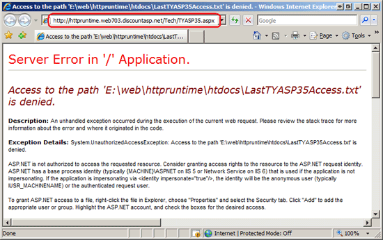
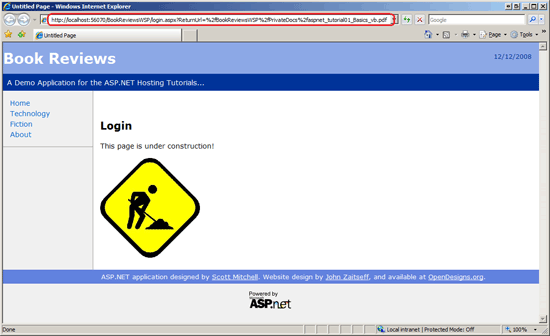
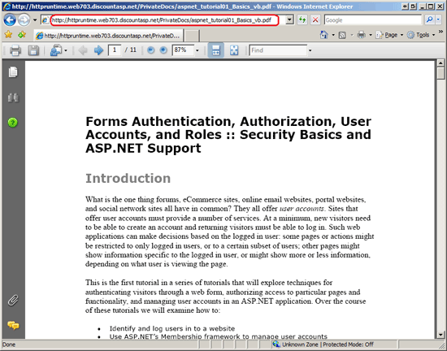

Core Differences Between IIS and the ASP.NET Development Server (VB)
====================
by [Scott Mitchell](https://twitter.com/ScottOnWriting)

[Download Code](http://download.microsoft.com/download/4/5/F/45F815EC-8B0E-46D3-9FB8-2DC015CCA306/ASPNET_Hosting_Tutorial_06_VB.zip) or [Download PDF](http://download.microsoft.com/download/E/8/9/E8920AE6-D441-41A7-8A77-9EF8FF970D8B/aspnet_tutorial06_WebServerDiff_vb.pdf)

> When testing an ASP.NET application locally, chances are you are using the ASP.NET Development Web Server. However, the production website is most likely powered IIS. There are some differences between how these web servers handle requests, and these differences can have important consequences. This tutorial explores some of the more germane differences.

## Introduction

Whenever a user visits an ASP.NET application his browser sends a request to the website. That request is picked up by the web server software, which coordinates with the ASP.NET runtime to generate and return the content for the requested resource. The[**I** nternet **I** nformation **S** ervices (IIS)](http://en.wikipedia.org/wiki/Internet_Information_Services) are a suite of services that provide common Internet-based functionality for Windows servers. IIS is the most commonly used web server for ASP.NET applications in production environments; it's most likely the web server software being used by your web host provider to serve your ASP.NET application. IIS can also be used as the web server software in the development environment, although this entails installing IIS and properly configuring it.

The ASP.NET Development Server is an alternative web server option for the development environment; it ships with and is integrated into Visual Studio. Unless the web application has been configured to use IIS, the ASP.NET Development Server is automatically started and used as the web server the first time you visit a web page from within Visual Studio. The demo web applications we created back in the [*Determining What Files Need to Be Deployed*](determining-what-files-need-to-be-deployed-vb.md) tutorial were both file system-based web applications that were not configured to use IIS. Therefore, when visiting either of these websites from within Visual Studio the ASP.NET Development Server is used.

In a perfect world the development and production environments would be identical. However, as we discussed in the preceding tutorial it is not uncommon for the environments to have differing configuration settings. Using different web server software in the environments adds another variable that must be taken into consideration when deploying an application. This tutorial covers the key differences between IIS and the ASP.NET Development Server. Because of these differences there are scenarios where code that runs flawlessly in the development environment throws an exception or behaves differently when executed in production.

## Security Context Differences

Whenever the web server software handles an incoming request it associates that request with a particular security context. This security context information is used by the operating system to determine what actions are permissible by the request. For example, an ASP.NET page might include code that logs some message to a file on disk. In order for this ASP.NET page to execute without error, the security context must have the appropriate file system-level permissions, namely write permissions on that file.

The ASP.NET Development Server associates incoming requests with the security context of the currently logged on user. If you are logged on to your desktop as an administrator, then the ASP.NET pages served by the ASP.NET Development Server will have the same access rights as an administrator. However, ASP.NET requests handled by IIS are associated with a specific machine account. By default, the Network Service machine account is used by IIS versions 6 and 7, although your web host provider may have configured a unique account for each customer. What's more, your web host provider has likely given limited permissions to this machine account. The net result is that you may have web pages that execute without error in the development environment, but generate authorization-related exceptions when hosted in the production environment.

To show this type of error in action I've created a page in the Book Reviews website that creates a file on disk that stores the most recent date and time someone viewed the *Teach Yourself ASP.NET 3.5 in 24 Hours* review. To follow along, open the `~/Tech/TYASP35.aspx` page and add the following code to the `Page_Load` event handler:

[!code-vb[Main](core-differences-between-iis-and-the-asp-net-development-server-vb/samples/sample1.vb)]

> [!NOTE]
> The [`File.WriteAllText` method](https://msdn.microsoft.com/en-us/library/system.io.file.writealltext.aspx) creates a new file if it does not exist and then writes the specified contents to it. If the file already exists, it's existing content is overwritten.

Next, visit the *Teach Yourself ASP.NET 3.5 in 24 Hours* book review page in the development environment using the ASP.NET Development Server. Assuming that you are logged on to your computer with an account that has adequate permissions to create and modify a text file in the web application's root directory the book review appears the same as before, but each time the page is visited the date and time and user's IP address is stored in the `LastTYASP35Access.txt` file. Point your browser to this file; you should see a message similar to the one shown in Figure 1.

**Figure 1**: The Text File Contains the Last Date and Time the Book Review was Visited([Click to view full-size image](core-differences-between-iis-and-the-asp-net-development-server-vb/_static/image3.png))

Deploy the web application to production and then visit the hosted *Teach Yourself ASP.NET 3.5 in 24 Hours* book review page. At this point you should either see the book review page as normal or the error message shown in Figure 2. Some web host providers grant write permissions to the anonymous ASP.NET machine account, in which case the page will work without error. If, however, your web host provider prohibits write access for the anonymous account then an [`UnauthorizedAccessException` exception](https://msdn.microsoft.com/en-us/library/system.unauthorizedaccessexception.aspx) is raised when the `TYASP35.aspx` page attempts to write the current date and time to the `LastTYASP35Access.txt` file.

**Figure 2**: The Default Machine Account Used by IIS Does Not Have Permissions to Write to the File System ([Click to view full-size image](core-differences-between-iis-and-the-asp-net-development-server-vb/_static/image6.png))

The good news is that most web host providers have some sort of permissions tool that allows you to specify file system permissions in your website. Grant the anonymous ASP.NET account write access to the root directory and then revisit the book review page. (If needed, contact your web host provider for assistance on how to grant write permissions to the default ASP.NET account.) This time the page should load without error and the `LastTYASP35Access.txt` file should be created successfully.

The take away here is that because the ASP.NET Development Server operates under a different security context than IIS, it is possible that your ASP.NET pages that read or write to the file system, read from or write to the Windows Event Log, or read or write to the Windows registry will work as expected on development but generate exceptions when on production. When building a web application that will be deployed to a shared web hosting environment, do not read or write to the Event Log or the Windows registry. Also take note of any ASP.NET pages that read from or write to the file system as you may need to grant read and write privileges on the appropriate folders in the production environment.

## Differences On Serving Static Content

Another core difference between IIS and the ASP.NET Development Server is how they handle requests for static content. Every request that comes into the ASP.NET Development Server, whether for an ASP.NET page, an image, or a JavaScript file, is processed by the ASP.NET runtime. By default, IIS only invokes the ASP.NET runtime when a request comes in for an ASP.NET resource, such as an ASP.NET web page, a Web Service, and so forth. Requests for static content - images, CSS files, JavaScript files, PDF files, ZIP files, and the like - are retrieved by IIS without the involvement of the ASP.NET runtime. (It is possible to instruct IIS to work with the ASP.NET runtime when serving static content; consult the "Performing Forms-Based Authentication and URL Authentication on Static Files with IIS 7" section in this tutorial for more information.)

The ASP.NET runtime performs a number of steps to generate the requested content, including authentication (identifying the requestor) and authorization (determining if the requestor has permission to view the requested content). A popular form of authentication is *forms-based authentication*, in which a user is identified by entering their credentials - usually a username and password - into textboxes on a web page. Upon validating their credentials, the website stores an *authentication ticket* cookie on the user's browser, which is sent with every subsequent request to the website and is what is used to authenticate the user. Moreover, it is possible to specify *URL authorization* rules that dictate what users can or cannot access a particular folder. Many ASP.NET websites use forms-based authentication and URL authorization to support user accounts and to define portions of the site that are only accessible to authenticated users or users that belong to a certain role.

> [!NOTE]
> For a thorough examination of ASP.NET's forms-based authentication, URL authorization, and other user account-related features, be sure to check out my [Website Security Tutorials](../../older-versions-security/introduction/security-basics-and-asp-net-support-cs.md).

Consider a website that supports user accounts using forms-based authorization and has a folder that, using URL authorization, is configured to only allow authenticated users. Imagine that this folder contains ASP.NET pages and PDF files and that the intent is that only authenticated users can view these PDF files.

What happens if a visitor attempts to view one of these PDF files by entering the URL directly in his browser's Address bar? To find out, let's create a new folder in the Book Reviews site, add some PDF files, and configure the site to use URL authorization to prohibit anonymous users from visiting this folder. If you download the demo application you'll see that I created a folder called `PrivateDocs` and added a PDF from my [Website Security Tutorials](../../older-versions-security/introduction/security-basics-and-asp-net-support-cs.md) (how fitting!). The `PrivateDocs` folder also contains a `Web.config` file that specifies the URL authorization rules to deny anonymous users:

[!code-xml[Main](core-differences-between-iis-and-the-asp-net-development-server-vb/samples/sample2.xml)]

Finally, I configured the web application to use forms-based authentication by updating the Web.config file in the root directory, replacing:

[!code-xml[Main](core-differences-between-iis-and-the-asp-net-development-server-vb/samples/sample3.xml)]

With:

[!code-xml[Main](core-differences-between-iis-and-the-asp-net-development-server-vb/samples/sample4.xml)]

Using the ASP.NET Development Server, visit the site and enter the direct URL to one of the PDF files in your browser's Address bar. If you downloaded the website associated with this tutorial the URL should look something like: `http://localhost:portNumber/PrivateDocs/aspnet_tutorial01_Basics_vb.pdf`

Entering this URL into the Address bar causes the browser to send a request to the ASP.NET Development Server for the file. The ASP.NET Development Server hands off the request to the ASP.NET runtime for processing. Because we have not yet logged in, and because the `Web.config` in the `PrivateDocs` folder is configured to deny anonymous access, the ASP.NET runtime automatically redirects us to the login page, `Login.aspx` (see Figure 3). When redirecting the user to the log in page, ASP.NET includes a `ReturnUrl` querystring parameter that indicates the page the user was attempting to view. After successfully logging in the user can be returned to this page.

**Figure 3**: Unauthorized Users are Automatically Redirected to the Login Page ([Click to view full-size image](core-differences-between-iis-and-the-asp-net-development-server-vb/_static/image9.png))

Now let's see how this behaves on production. Deploy your application and enter the direct URL to one of the PDFs in the `PrivateDocs` folder in production. This prompts your browser to send a request IIS for the file. Because a static file is requested, IIS retrieves and returns the file without invoking the ASP.NET runtime. As a result, there was no URL authorization check performed; the contents of the supposedly private PDF are accessible to anyone who knows the direct URL to the file.

**Figure 4**: Anonymous Users Can Download the Private PDF Files By Entering the Direct URL to the File ([Click to view full-size image](core-differences-between-iis-and-the-asp-net-development-server-vb/_static/image12.png))

### Performing Forms-Based Authentication and URL Authentication on Static Files with IIS 7

There are a couple of techniques you can use to protect static content from unauthorized users. IIS 7 introduced the *integrated pipeline*, which marries IIS's workflow with the ASP.NET runtime's workflow. In a nutshell, you can instruct IIS to invoke the ASP.NET runtime's authentication and authorization modules all incoming requests (including static content like PDF files). Contact your web host provider to find out how to configure your website to use the integrated pipeline.

Once IIS has been configured to use the integrated pipeline add the following markup to the `Web.config` file in the root directory:

[!code-xml[Main](core-differences-between-iis-and-the-asp-net-development-server-vb/samples/sample5.xml)]

This markup instructs IIS 7 to use the ASP.NET-based authentication and authorization modules. Re-deploy your application and then re-visit the PDF file. This time when IIS handles the request it gives the ASP.NET runtime's authentication and authorization logic an opportunity to inspect the request. Because only authenticated users are authorized to view the contents in the `PrivateDocs` folder, the anonymous visitor is automatically redirected to the login page (refer back to Figure 3).

> [!NOTE]
> If your web host provider is still using IIS 6 then you cannot use the integrated pipeline feature. One workaround is to put your private documents in a folder that prohibits HTTP access (such as `App_Data`) and then create a page to serve these documents. This page might be called `GetPDF.aspx`, and is passed the name of the PDF through a querystring parameter. The `GetPDF.aspx` page would first verify that the user has permission to view the file and, if so, would use the [`Response.WriteFile(filePath)`](https://msdn.microsoft.com/en-us/library/system.web.httpresponse.writefile.aspx) method to send the contents of the requested PDF file back to the requesting client. This technique would also work for IIS 7 if you did not wish to enable the integrated pipeline.

## Summary

Web applications in a production environment are hosted using Microsoft's IIS web server software. In the development environment, however, the application may be hosted using IIS or the ASP.NET Development Server. Ideally, the same web server software should be used in both environments because using different software adds another variable in the mix. However, the ease of use of the ASP.NET Development Server makes it an attractive choice in the development environment. The good news is that there are only a few fundamental differences between IIS and the ASP.NET Development Server, and if you are aware of these differences you can take steps to help ensure that the application works and functions the same way regardless of the environment.

Happy Programming!

### Further Reading

For more information on the topics discussed in this tutorial, refer to the following resources:

- [ASP.NET Integration with IIS 7.0](https://www.iis.net/learn/application-frameworks/building-and-running-aspnet-applications/aspnet-integration-with-iis)
- [Using ASP.NET Forums Authentication With All Types of Content on IIS 7](https://blogs.iis.net/bills/archive/2007/05/19/using-asp-net-forms-authentication-with-all-types-of-content-with-iis7-video.aspx) (Video)
- [Web Servers in Visual Web Developer](https://msdn.microsoft.com/en-us/library/58wxa9w5.aspx)

>[!div class="step-by-step"]
[Previous](common-configuration-differences-between-development-and-production-vb.md)
[Next](deploying-a-database-vb.md)