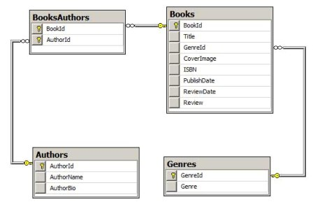
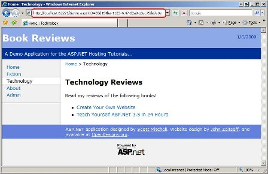
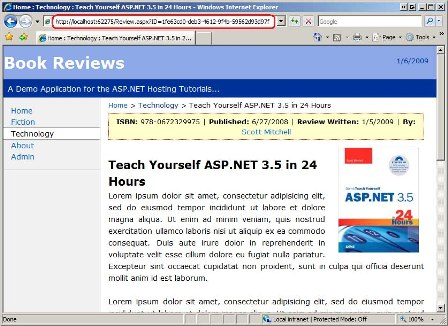
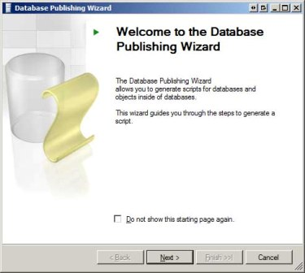
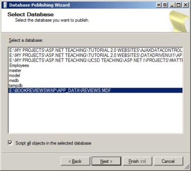
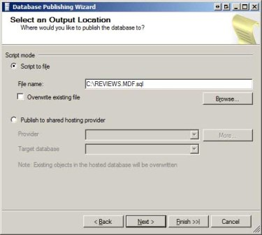
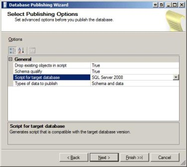
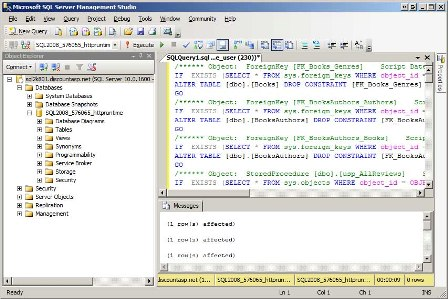
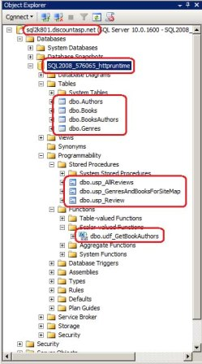
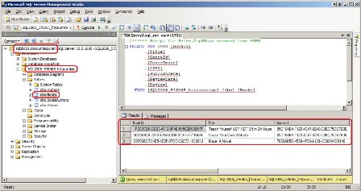

Deploying a Database (VB)
====================
by [Scott Mitchell](https://twitter.com/ScottOnWriting)

[Download Code](http://download.microsoft.com/download/E/6/F/E6FE3A1F-EE3A-4119-989A-33D1A9F6F6DD/ASPNET_Hosting_Tutorial_07_VB.zip) or [Download PDF](http://download.microsoft.com/download/C/3/9/C391A649-B357-4A7B-BAA4-48C96871FEA6/aspnet_tutorial07_DeployDB_vb.pdf)

> Deploying an ASP.NET web application entails getting the necessary files and resources from the development environment to the production environment. For data-driven web applications this includes the database schema and data. This tutorial is the first in a series that explores the steps needed to successfully deploy the database from the development environment to production.

### Introduction

Deploying an ASP.NET web application entails getting the necessary files and resources from the development environment to the production environment. Over the course of the past six tutorials we looked at deploying a simple Book Reviews web application. This demo site was comprised of a number of server-side resources - ASP.NET pages, configuration files, a `Web.sitemap` file, and so forth - along with client-side resources, like images and CSS files. But what about data-driven web applications? What extra steps must be taken to deploy a web application that uses a database?

Over the next several tutorials we will address the steps needed to deploy a data-driven web application. This tutorial starts by examining how to get a database s schema and contents from the development environment to the production environment, while the subsequent tutorial looks at the needed configuration changes. Following that we'll explore challenges of deploying a database that uses the Application Services (Membership, Roles, Profile, and so on).

## Examining the Updated Book Reviews Web Application

In order to demonstrate deploying a data-driven web application, I ve updated the Book Reviews web application from a simple, static website to a data-driven one. As before, there are two versions of the application in this tutorial s download: one that uses the Web Application Project model and one that uses the Web Site Project model.

The updated Book Reviews web application uses a [SQL Server 2008 Express Edition](https://www.microsoft.com/express/sql/default.aspx) database, which is stored in the site s `App_Data` folder (`~/App_Data/Reviews.mdf`). If you have SQL Server 2008 installed on your computer then the demo should run without error. If you have an older version of SQL Server you can either install the free SQL Server 2008 Express Edition or you can use the database scripts available in this tutorial s download to create the database yourself.

The `Reviews.mdf` database contains four tables:

- `Genres` - includes a record for each genre, such as Technology, Fiction, and Business.
- `Books` - includes a record for each review, with columns like `Title`, `GenreId`, `ReviewDate`, and `Review`, among others.
- `Authors` - includes information about each author who has contributed to a reviewed book.
- `BooksAuthors` - a many-to-many join table that specifies what authors have written what books.
  

Figure 1 shows an ER diagram of these four tables.

 

**Figure 1**: The Book Reviews Web Application s Database is Comprised of Four Tables ([Click to view full-size image](deploying-a-database-vb/_static/image3.jpg))

The previous version of the Book Reviews website had a separate ASP.NET page for each book. For example, there was a page named `~/Tech/TYASP35.aspx` that contained the review for *Teach Yourself ASP.NET 3.5 in 24 Hours*. This new data-driven version of the website has the reviews stored in the database and a single ASP.NET page, Review.aspx?ID=*bookId*, which displays the review for the specified book. Likewise, there is a Genre.aspx?ID=*genreId* page that lists the reviewed books in the specified genre.

Figures 2 and 3 show the `Genre.aspx` and `Review.aspx` pages in action. Note the URL in the Address bar for each page. In Figure 2 it s Genre.aspx?ID=85d164ba-1123-4c47-82a0-c8ec75de7e0e. Because 85d164ba-1123-4c47-82a0-c8ec75de7e0e is the `GenreId` value for the Technology genre, the page s heading reads "Technology Reviews" and the bulleted list enumerates those reviews on the site that fall under this genre.

 

**Figure 2**: The Technology Genre Page ([Click to view full-size image](deploying-a-database-vb/_static/image6.jpg))

 

**Figure 3**: The Review for *Teach Yourself ASP.NET 3.5 in 24 Hours* ([Click to view full-size image](deploying-a-database-vb/_static/image9.jpg))

The Book Reviews web application also includes an administration section where administrators can add, edit, and delete genres, reviews, and author information. Currently, any visitor can access the administration section. In a future tutorial we'll add support for user accounts and only permit authorized users into the administration pages.

If you download the Book Reviews application please keep in mind that its purpose is to demonstrate deploying a data-driven application. It does not exhibit best practices as far as application design. For example, there is no separate Data Access Layer (DAL); the ASP.NET pages communicate directly with the database through the SqlDataSource control or ADO.NET code in their code-behind classes. For a more in-depth look at creating data-driven applications using a tiered architecture, refer to my [*Working with Data* tutorials](../../data-access/index.md).

## Databases on Development Versus Production

When you start development on a data-driven web application you must specify a database connection string, which provides the application details on how to connect to the database. This connection string specifies, among other things, the database server, the database name, and security information. Most often, the database used by the application during development is different than the database used when it s in production. There are many benefits of using different databases for development versus production. Having a different database in development means you don t have to worry about accidentally modifying or deleting live data. It also lets you put in dummy test data or make breaking changes to the data model without having to worry about the effects on the application in production. The downside of having a different database in the development and production environments is that when the application is deployed the database and any pertinent changes to the database s schema or data must also be deployed.

Prior to the first deployment, there is only one instance of the database, and that instance is in the development environment. When deploying the application to production for the first time we must not only copy up the necessary server-side and client-side files, but also copy the database from the development environment to the production environment. This is where we stand right now with the Book Reviews web application - the database resides in the `App_Data` folder in our development environment but has not yet been pushed up to the production environment.

Once the application has been deployed there are two copies of the database. As the application matures, new features may be added, necessitating a change to the data model (such as adding new columns to existing tables, making changes to existing columns, adding new tables, and so on). When the web application is next deployed, the changes applied to the database in the development environment since the last deployment must be applied to the production database. Some strategies for managing this process are discussed in a future tutorial. This tutorial focuses on deploying the entire database from the development environment to production.

## Deploying the Database to the Production Environment

The remainder of this tutorial looks at how to deploy the database from the development environment to the production environment. If you are following along you need to make sure that your account with your web host provider includes Microsoft SQL Server database support. You'll also need to have some information at hand, namely the database server name, the database name, and the username and password used to connect to the database.

As noted earlier in this tutorial, the Book Reviews website s database is a SQL Server 2008 Express Edition database stored in the `App_Data` folder. It would stand to reason that deploying such a database would be as simple as copying the `App_Data` folder from the development environment to the production environment. However, most web host providers do not support hosting databases in the `App_Data` folder because of security reasons. Instead, web hosts provide an account on a SQL Server database server within their environment. Deploying the database from your development environment to the production environment requires getting your database registered on your web host s database server.

So how do you get your database from the development environment to the production environment? There are a couple ways to accomplish this depending on what services your web host offers. With some hosts, such as DiscountASP.NET, you can FTP a backup of the database or the actual `.mdf` file to your website and then, from the Control Panel, restore the backup file or attach the `.mdf` file to the SQL Server database server. With such tools deploying the database is as simple as copying the `App_Data` folder to the production environment and then attaching it via the Control Panel. This is perhaps the easiest and quickest way to publish your database for the first time.

Another approach is to use the Database Publishing Wizard. The Database Publishing Wizard is a Windows desktop application that will generate the SQL commands to create your database s schema - the tables, stored procedures, views, user-defined functions, and so forth - and, optionally, the data in its tables. You can then connect to your web host provider s database server through SQL Server Management Studio and then execute this script to duplicate the database on production. Even better, if your web host provider supports Microsoft s [Database Publishing Services](http://www.codeplex.com/sqlhost/Wiki/View.aspx?title=Database%20Publishing%20Services&amp;referringTitle=Home) you can have the script generated by the Database Publishing Wizard automatically executed on the database server on your behalf. Because the Database Publishing Wizard generates a script that creates the database s schema and data, it will work regardless of whether your web host provider offers features like attaching an uploaded `.mdf` file.

### Generating the SQL Commands to Create the Database Schema and Data Using the Database Publishing Wizard

Let s walk through using the Database Publishing Wizard to deploy the Book Reviews database to production. If you are using Visual Studio 2008 or beyond, the Database Publishing Wizard is already installed. If you are using Visual Studio 2005 then you will need to first [download and install](https://www.microsoft.com/downloads/details.aspx?familyid=56E5B1C5-BF17-42E0-A410-371A838E570A&amp;displaylang=en) the wizard.

Open Visual Studio and navigate to the `Reviews.mdf` database. If you are using Visual Web Developer, go to the Database Explorer; if you are using Visual Studio, use the Server Explorer. Figure 4 shows the `Reviews.mdf` database in the Database Explorer in Visual Web Developer. As Figure 4 shows, the `Reviews.mdf` database is composed of four tables, three stored procedures, and a user-defined function.

 

**Figure 4**: Locate the Database in the Database Explorer or Server Explorer ([Click to view full-size image](deploying-a-database-vb/_static/image12.jpg))

Right-click on the database name and choose the "Publish to provider" option from the context menu. This launches the Database Publishing Wizard (see Figure 5). Click Next to advance past the splash screen.

 

**Figure 5**: The Database Publishing Wizard Splash Screen ([Click to view full-size image](deploying-a-database-vb/_static/image15.jpg))

The second screen in the wizard lists the databases accessible to the Database Publishing Wizard and lets you choose whether to script all objects in the selected database or to pick which objects to script. Select the appropriate database and leave the "Script all objects in the selected database" option checked.

> [!NOTE]
> If you get the error "There are no objects in database *databaseName* of the types scriptable by this wizard" when clicking Next in the screen shown in Figure 6, make sure that the path to your database file is not overly long. As noted in [this discussion item](http://www.codeplex.com/sqlhost/Thread/View.aspx?ThreadId=11014) on the Database Publishing Wizard project page, this error can arise if the path to the database file is too long.

 

**Figure 6**: The Database Publishing Wizard Splash Screen ([Click to view full-size image](deploying-a-database-vb/_static/image18.jpg))

From the next screen you can generate a script file or, if your web host supports it, publish the database directly to your web host provider s database server. As Figure 7 shows, I am having the script written to the file `C:\REVIEWS.MDF.sql`.

 

**Figure 7**: Script the Database to a File or Publish it Directly to Your Web Host Provider ([Click to view full-size image](deploying-a-database-vb/_static/image21.jpg))

The subsequent screen prompts you for a variety of scripting options. You can specify whether the script should include drop statements to remove these existing objects. This defaults to True, which is fine when deploying a database for the first time. You can also specify whether the target database is SQL Server 2000, SQL Server 2005, or SQL Server 2008. Finally, you can indicate whether to script the schema and data, just the data, or just the schema. The schema is the collection of database objects, the tables, stored procedures, views, and so on. The data is the information residing in the tables.

As Figure 8 illustrates, I ve got the wizard configured to drop existing database objects, to generate script for a SQL Server 2008 database, and to publish both the schema and data.

 

**Figure 8**: Specify the Publishing Options ([Click to view full-size image](deploying-a-database-vb/_static/image24.jpg))

The final two screens summarize the actions that are about to be taken and then display the status of the scripting. The net result of running the wizard is that we have a script file that contains the SQL commands needed to create the database on production and populate it with the same data as on development.

### Executing the SQL Commands On the Production Environment Database

Now that we have the script that contains the SQL commands to create the database and its data all that remains is to execute the script on the production database. Some web host providers offer a textbox in their Control Panel where you can enter SQL commands to execute on your database. If you have a very large script file then this option might not work (the `REVIEWS.MDF.sql` script file is over 425 KB in size, for instance).

A better approach is to connect directly to the production database server using SQL Server Management Studio (SSMS). If you have a non-Express Edition of SQL Server installed on your computer then you likely already have SSMS installed. Otherwise, you can [download and install](https://www.microsoft.com/downloads/details.aspx?FamilyId=C243A5AE-4BD1-4E3D-94B8-5A0F62BF7796&amp;displaylang=en) a free copy of SQL Server Management Studio Express Edition.

Launch SSMS and connect to your web host s database server using the information provided by your web host provider.

 

**Figure 9**: Connect to Your Web Host Provider s Database Server ([Click to view full-size image](deploying-a-database-vb/_static/image27.jpg))

Expand the Databases tab and locate your database. Click the New Query button in the upper left corner of the Toolbar, paste in the SQL commands from the script file created by the Database Publishing Wizard, and click the Execute button to run these commands on the production database server. If your script file is especially large it may take several minutes to execute the commands.

 

**Figure 10**: Connect to Your Web Host Provider s Database Server ([Click to view full-size image](deploying-a-database-vb/_static/image30.jpg))

That s all there is to it! At this point the development database has been duplicated to production. If you Refresh the database in SSMS you should see the new database objects. Figure 11 shows the production database s tables, stored procedures, and user-defined functions, which mirror those on the development database. And because we instructed the Database Publishing Wizard to publish the data, the production database s tables have the same data as the development database s tables at the time the wizard was executed. Figure 12 shows the data in the `Books` table on the production database.

 

**Figure 11**: The Database Objects Have Been Duplicated on the Production Database ([Click to view full-size image](deploying-a-database-vb/_static/image33.jpg))

 

**Figure 12**: The Production Database Contains the Same Data as on the Development Database ([Click to view full-size image](deploying-a-database-vb/_static/image36.jpg))

At this point we have only deployed the development database to production. We have not yet looked at deploying the web application itself or examined what configuration changes are needed to have the application on production use the production database. We'll cover these issues in the next tutorial!

## Summary

Deploying a data-driven web application requires copying the database used during development to the production environment. Many web host providers offer tools to simplify the process of deploying a database. For example, with DiscountASP.NET you can FTP your database `.mdf` file (or a backup) and then attach the database to the database server from the Control Panel. Another option that works regardless of what features your web host provider offers is Microsoft s Database Publishing Wizard tool, which generates a script of SQL commands to create the development database s schema and data. Once this script has been generated you can execute it on the production database.

Now that the Book Reviews web application s database is on production we can deploy the application. However, the web application s configuration information specifies the connection string to the database, and that connection string references the development database. We need to update this connection string information when deploying the site to production. The next tutorial looks at these configuration differences and walks through the steps needed to publish the data-driven Book Reviews site to production.

Happy Programming!

### Further Reading

For more information on the topics discussed in this tutorial, refer to the following resources:

- [Download the Microsoft SQL Server Database Publishing Wizard 1.1](https://www.microsoft.com/downloads/details.aspx?familyid=56E5B1C5-BF17-42E0-A410-371A838E570A&amp;displaylang=en)
- [Download the Microsoft SQL Server Management Studio Express Edition](https://www.microsoft.com/downloads/details.aspx?FamilyId=C243A5AE-4BD1-4E3D-94B8-5A0F62BF7796&amp;displaylang=en)
- [The SQL Server Hosting Toolkit Home](http://www.codeplex.com/sqlhost/Thread/View.aspx?ThreadId=11014) (The project home for the Database Publishing Wizard and the Database Publishing Services.)

>[!div class="step-by-step"]
[Previous](core-differences-between-iis-and-the-asp-net-development-server-vb.md)
[Next](configuring-the-production-web-application-to-use-the-production-database-vb.md)