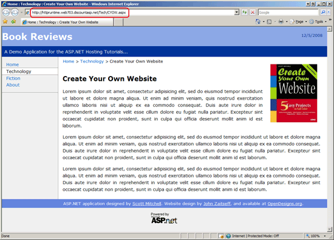
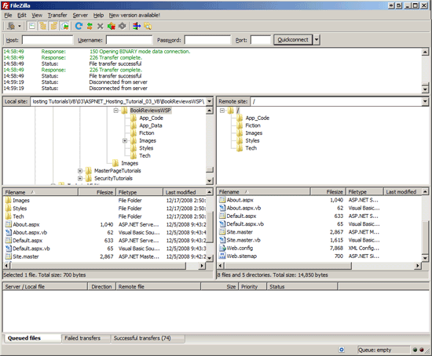

Deploying Your Site Using an FTP Client (VB)
====================
by [Scott Mitchell](https://twitter.com/ScottOnWriting)

[Download Code](http://download.microsoft.com/download/4/5/F/45F815EC-8B0E-46D3-9FB8-2DC015CCA306/ASPNET_Hosting_Tutorial_03_VB.zip) or [Download PDF](http://download.microsoft.com/download/E/8/9/E8920AE6-D441-41A7-8A77-9EF8FF970D8B/aspnet_tutorial03_DeployingViaFTP_vb.pdf)

> The simplest way to deploy an ASP.NET application is to manually copy the necessary files from the development environment to the production environment. This tutorial shows how to use an FTP client to get the files from your desktop to the web host provider.

## Introduction

The previous tutorial introduced a simple Book Review ASP.NET web application, which is comprised of a handful of ASP.NET pages, a master page, a custom base `Page` class, a number of images, and three CSS style sheets. We are now ready to deploy this application to a web host provider, at which point the application will be accessible to anyone with a connection to the Internet!

From our discussions in the [*Determining What Files Need to Be Deployed*](determining-what-files-need-to-be-deployed-vb.md) tutorial, we know what files need to be copied to the web host provider. (Recall that what files are copied depends on whether your application is explicitly or automatically compiled.) But how do we get the files from the development environment (our desktop) up to the production environment (the web server managed by the web host provider)? The [**F** ile **T** ransfer **P** rotocol (FTP)](http://en.wikipedia.org/wiki/File_Transfer_Protocol) is a commonly used protocol for copying files from one machine to another over a network. Another option is FrontPage Server Extensions (FPSE). This tutorial focuses on using stand-alone FTP client software to deploy the necessary files from the development environment to the production environment.

> [!NOTE]
> Visual Studio includes tools for publishing websites via FTP; these tools, as well as a look at tools that use FPSE, are covered in the next tutorial.

To copy the files using FTP we need an *FTP client* on the development environment. An FTP client is an application that is designed to copy files from the computer it's installed to a computer that is running an *FTP server*. (If your web host provider supports file transfers via FTP, as most do, then there is an FTP server running on their web servers.) There are a number of FTP client applications available. Your web browser can even double as an FTP client. My favorite FTP client, and the one I will be using for this tutorial, is [FileZilla](http://filezilla-project.org/), a free, open-source FTP client that is available for Windows, Linux, and Macs. Any FTP client will work, though, so feel free to use whatever client you are most comfortable with.

If you are following along you will need to create an account with a web host provider before you can complete this tutorial or subsequent ones. As noted in the previous tutorial, there are a gaggle of web host provider companies with a wide spectrum of prices, features, and quality of service. For this tutorial series I will be using [Discount ASP.NET](http://discountasp.net) as my web host provider, but you can follow along with any web host provider as long as they support the ASP.NET version your site is developed in. (These tutorials were created using ASP.NET 3.5.) Also, because we will be copying the files to the web host provider using FTP in this tutorial and in future ones it is imperative that your web host provider supports FTP access to their web servers. Virtually all web host providers offer this feature, but you should double-check before signing up.

## Deploying the Book Review Web Application Project

Recall that there are two versions of the Book Review web application: one implemented using the Web Application Project model (BookReviewsWAP) and the other using the Web Site Project model (BookReviewsWSP). The project type influences whether the site is compiled automatically or explicitly, and that compilation model dictates what files need to be deployed. Consequently, we will examine deploying the BookReviewsWAP and BookReviewsWSP projects separately, starting with the BookReviewsWAP. Take a moment to download these two ASP.NET applications if you have not done so already.

Launch the BookReviewsWAP project by navigating to the `BookReviewsWAP` folder and double-clicking the `BookReviewsWAP.sln` file. Before deploying the project it is important to build it to ensure that any changes to the source code are included in the compiled assembly. To build the project go to the Build menu and choose the Build BookReviewsWAP menu option. This compiles the source code in the project into a single assembly, `BookReviewsWAP.dll`, which is placed in the `Bin` folder.

We are now ready to deploy the necessary files! Launch your FTP client and connect to the web server at your web host provider. (When you sign up with a web hosting company they will e-mail you information on how to connect to the FTP server; this includes the address for the FTP server as well as a username and password.)

Copy the following files from your desktop to the root website folder at your web host provider. When you FTP into the web server at the web host provider you are likely at the root website directory. However, some web host providers have a subfolder named `www` or `wwwroot` that serves as the root folder for your website files. Finally, when FTPing the files you may need to create the corresponding folder structure on the production environment - the `Bin` folder, the `Fiction` folder, the `Images` folder, and so on.

- `~/Default.aspx`
- `~/About.aspx`
- `~/Site.master`
- `~/Web.config`
- `~/Web.sitemap`
- The complete contents of the `Styles` folder
- The complete contents of the `Images` folder (and its subfolder, `BookCovers`)
- `~/Fiction/Default.aspx`
- `~/Fiction/Blaze.aspx`
- `~/Tech/Default.aspx`
- `~/Tech/CYOW.aspx`
- `~/Tech/TYASP35.aspx`
- `~/Bin/BookReviewsWAP.dll`

Figure 1 shows FileZilla after the necessary files have been copied. FileZilla displays the files on the local computer on the left and the files on the remote computer on the right. As Figure 1 shows, the ASP.NET source code files, such as `About.aspx.vb`, are on the local computer (the development environment) but were not copied to the web host provider (the production environment) because code files do not need to be deployed when using explicit compilation.

> [!NOTE]
> There is no harm in having the source code files on the production server, as they are ignored. ASP.NET forbids HTTP requests to source code files by default so that even if the source code files are present on the production server they are inaccessible to visitors to your website. (That is, if a user tries to visit `http://www.yoursite.com/Default.aspx.vb` they will get an error page that explains that these types of files - `.vb` files - are forbidden.)

**Figure 1**: Use an FTP Client to Copy the Necessary Files from Your Desktop to the Web Server at the Web Host Provider ([Click to view full-size image](deploying-your-site-using-an-ftp-client-vb/_static/image3.png))

After deploying your site take a moment to test the site. If you have purchased a domain name and configured the DNS settings properly, you can visit your site by entering your domain name. Alternatively, your web host provider should have supplied you with a URL to your site, which will look something like *accountname*.*webhostprovider*.com or *webhostprovider*.com/*accountname*. For example, the URL for my account on Discount ASP.NET is: `http://httpruntime.web703.discountasp.net`.

Figure 2 shows the deployed Book Reviews site. Note that I am viewing it on Discount ASP.NET's servers, at `http://httpruntime.web703.discountasp.net`. At this point in time anyone with a connection to the Internet could view my website! As we'd expect, the site looks and behaves just as it did when testing it in the development environment.

> [!NOTE]
> If you get an error when viewing your application take a moment to ensure that you deployed the correct set of files. Next, check the error message to see if it reveals any clues as to the problem. Following that, you can turn to your web host company's helpdesk or post your question to the appropriate forum at the [ASP.NET Forums](https://forums.asp.net/).

**Figure 2**: The Book Reviews Site is Now Accessible to Anyone with an Internet Connection ([Click to view full-size image](deploying-your-site-using-an-ftp-client-vb/_static/image6.png))

## Deploying the Book Review Web Site Project

When deploying an ASP.NET application that uses automatic compilation, such as the BookReviewsWSP Web Site Project, there is no compiled assembly in the `Bin` folder. As a result, the web application's source code files must be deployed to the production environment. Let's walk through this process.

As with the Web Application Project it's wise to first Build the application before deploying it. While building a Web Site Project does not create an assembly, it does check for any compile-time errors in the page. Better to find these errors now rather than having a visitor to your site discover them for you!

Once you've successfully built the project, use your FTP client to copy the following files to the root website folder at your web host provider. You may need to create the corresponding folder structure on the production environment.

> [!NOTE]
> If you already deployed the BookReviewsWAP project but still want to try deploying the BookReviewsWSP project, first delete all of the files on the web server that were uploaded when deploying BookReviewsWAP and then deploy the files for BookReviewsWSP.

- `~/Default.aspx`
- `~/Default.aspx.vb`
- `~/About.aspx`
- `~/About.aspx.vb`
- `~/Site.master`
- `~/Site.master.vb`
- `~/Web.config`
- `~/Web.sitemap`
- The complete contents of the `Styles` folder
- The complete contents of the `Images` folder (and its subfolder, `BookCovers`)
- `~/App_Code/BasePage.vb`
- `~/Fiction/Default.aspx`
- `~/Fiction/Default.aspx.vb`
- `~/Fiction/Blaze.aspx`
- `~/Fiction/Blaze.aspx.vb`
- `~/Tech/Default.aspx`
- `~/Tech/Default.aspx.vb`
- `~/Tech/CYOW.aspx`
- `~/Tech/CYOW.aspx.vb`
- `~/Tech/TYASP35.aspx`
- `~/Tech/TYASP35.aspx.vb`

Figure 3 shows FileZilla after copying up the necessary files. As you can see, the ASP.NET source code files, such as `About.aspx.vb`, are present on both the local computer (the development environment) and the web host provider (the production environment) because code files need to be deployed when using automatic compilation.

**Figure 3**: Use an FTP Client to Copy the Necessary Files from Your Desktop to the Web Server at the Web Host Provider ([Click to view full-size image](deploying-your-site-using-an-ftp-client-vb/_static/image9.png))

The user experience is not affected by the application's compilation model. The same ASP.NET pages are accessible and they look and behave the same whether the website was created using the Web Application Project model or the Web Site Project model.

## Updating a Web Application on Production

Web application development and deployment are not a one-time process. For example, when creating the Book Review website I built the various pages and wrote the accompanying code on my personal computer (the development environment). After reaching a certain stable state, I deployed my application so that others could visit the site and read my reviews. But deployment does not mark the end of my development on this site. I may add more book reviews or implement new features, such as allowing my visitors to rate books or leave their own comments. Such enhancements would be developed on the development environment and, when completed, would need to be deployed. Development and deployment, therefore, are cyclical. You develop an application and then deploy it. While the site is live and in production, new features are added and bugs are fixed over time, which necessitates re-deploying the application. And so on and so on.

As you might expect, when re-deploying a web application you only need to copy new and changed files. There's no need to re-deploy unchanged pages or server- or client-side support files (although there's no harm in doing so).

> [!NOTE]
> One thing to keep in mind when using explicit compilation is that anytime you add a new ASP.NET page to the project or make any code-related changes, you need to rebuild your project, which updates the assembly in the `Bin` folder. Consequently, you'll need to copy this updated assembly to production when updating a web application on production (along with the other new and updated content).

Also understand that any changes to the `Web.config` or the files in the `Bin` directory stops and restarts the website's Application Pool. If your session state is stored using the `InProc` mode (the default) then your site's visitors will lose their session state whenever these key files are modified. To avoid this pitfall, consider storing session using the `StateServer` or `SQLServer` modes. For more information on this topic read [Session-State Modes](https://msdn.microsoft.com/en-us/library/ms178586.aspx).

Finally, keep in mind that re-deploying an application can take anywhere from a few seconds to several minutes, depending on the number and size of files that need to be copied to the production environment. During this time users visiting your site may experience errors or odd behavior. You can "turn off" your entire application by adding a page named `App_Offline.htm` to your application's root directory that explains to your users that the site is down for maintenance (or whatever) and will be back up shortly. When the `App_Offline.htm` file is present, the ASP.NET runtime redirects all incoming requests to that page.

## Summary

Deploying a web application entails copying the necessary files from the development environment to the production environment. The most common means by which files are transferred over a network is the File Transfer Protocol (FTP), and most web host providers support FTP access to their web servers. In this tutorial we saw how to use an FTP client to deploy the needed files to the web server. Once deployed, the website can be visited by anyone with a connection to the Internet!

Happy Programming!

### Further Reading

For more information on the topics discussed in this tutorial, refer to the following resources:

- [App\_Offline.htm and Working Around the "IE Friendly Errors" Feature](https://weblogs.asp.net/scottgu/App_5F00_Offline.htm-and-working-around-the-_2200_IE-Friendly-Errors_2200_-feature)
- [Session-State Modes](https://msdn.microsoft.com/en-us/library/ms178586.aspx)

>[!div class="step-by-step"]
[Previous](determining-what-files-need-to-be-deployed-vb.md)
[Next](deploying-your-site-using-visual-studio-vb.md)