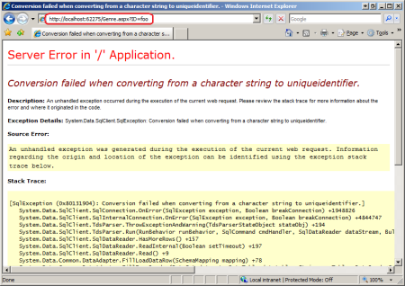
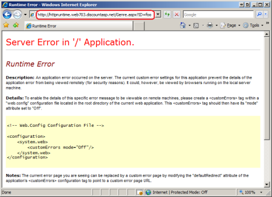
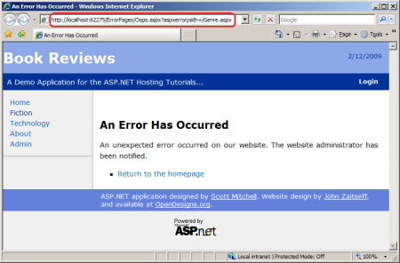
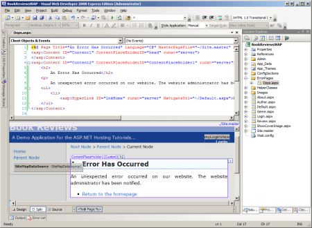
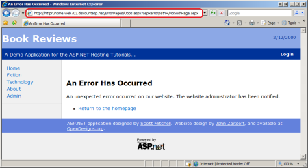
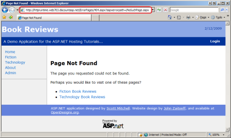

Displaying a Custom Error Page (C#)
====================
by [Scott Mitchell](https://twitter.com/ScottOnWriting)

[Download Code](http://download.microsoft.com/download/1/0/C/10CC829F-A808-4302-97D3-59989B8F9C01/ASPNET_Hosting_Tutorial_11_CS.zip) or [Download PDF](http://download.microsoft.com/download/5/C/5/5C57DB8C-5DEA-4B3A-92CA-4405544D313B/aspnet_tutorial11_CustomErrors_cs.pdf)

> What does the user see when a runtime error occurs in an ASP.NET web application? The answer depends on how the website's &lt;customErrors&gt; configuration. By default, users are shown an unsightly yellow screen proclaiming that a runtime error has occurred. This tutorial shows how to customize these settings to display an aesthetically-pleasing custom error page that matches your site's look and feel.

## Introduction

In a perfect world there would be no run-time errors. Programmers would write code with nary a bug and with robust user input validation, and external resources like database servers and e-mail servers would never go offline. Of course, in reality errors are inevitable. The classes in the .NET Framework signal an error by throwing an exception. For example, calling a SqlConnection object's Open method establishes a connection to the database specified by a connection string. However, if the database is down or if the credentials in the connection string are invalid then the Open method throws a `SqlException`. Exceptions can be handled by the use of `try/catch/finally` blocks. If code within a `try` block throws an exception, control is transferred to the appropriate catch block where the developer can attempt to recover from the error. If there is no matching catch block, or if the code that threw the exception is not in a try block, the exception percolates up the call stack in search of `try/catch/finally` blocks.

If the exception bubbles all the way up to the ASP.NET runtime without being handled, the [`HttpApplication` class](https://msdn.microsoft.com/en-us/library/system.web.httpapplication.aspx)'s [`Error` event](https://msdn.microsoft.com/en-us/library/system.web.httpapplication.error.aspx) is raised and the configured *error page* is displayed. By default, ASP.NET displays an error page that is affectionately referred to as the [Yellow Screen of Death](http://en.wikipedia.org/wiki/Yellow_Screen_of_Death#Yellow) (YSOD). There are two versions of the YSOD: one shows the exception details, a stack trace, and other information helpful to developers debugging the application (see **Figure 1**); the other simply states that there was a run-time error (see **Figure 2**).

The exception details YSOD is quite helpful for developers debugging the application, but showing a YSOD to end users is tacky and unprofessional. Instead, end users should be taken to an error page that maintains the site's look and feel with more user-friendly prose describing the situation. The good news is that creating such a custom error page is quite easy. This tutorial starts with a look at ASP.NET's different error pages. It then shows how to configure the web application to show users a custom error page in the face of an error.

### Examining the Three Types of Error Pages

When an unhandled exception arises in an ASP.NET application one of three types of error pages is displayed:

- The Exception Details Yellow Screen of Death error page,
- The Runtime Error Yellow Screen of Death error page, or
- A custom error page

The error page developers are most familiar with is the Exception Details YSOD. By default, this page is displayed to users who are visiting locally and therefore is the page that you see when an error occurs when testing the site in the development environment. As its name implies, the Exception Details YSOD provides details about the exception - the type, the message, and the stack trace. What's more, if the exception was raised by code in your ASP.NET page's code-behind class and if the application is configured for debugging then the Exception Details YSOD will also show this line of code (and a few lines of code above and below it).

**Figure 1** shows the Exception Details YSOD page. Note the URL in the browser's address window: `http://localhost:62275/Genre.aspx?ID=foo`. Recall that the `Genre.aspx` page lists the book reviews in a particular genre. It requires that `GenreId` value (a `uniqueidentifier`) be passed through the querystring; for example, the appropriate URL to view the fiction reviews is `Genre.aspx?ID=7683ab5d-4589-4f03-a139-1c26044d0146`. If a non-`uniqueidentifier` value is passed in through the querystring (such as "foo") an exception is thrown.

> [!NOTE]
> To reproduce this error in the demo web application available for download you can either visit `Genre.aspx?ID=foo` directly or click the "Generate a Runtime Error" link in `Default.aspx`.

Note the exception information presented in **Figure 1**. The exception message, "Conversion failed when converting from a character string to uniqueidentifier" is present at the top of the page. The type of the exception, `System.Data.SqlClient.SqlException`, is listed, as well. There's also the stack trace.

**Figure 1**: The Exception Details YSOD Includes Information About the Exception  
 ([Click to view full-size image](displaying-a-custom-error-page-cs/_static/image3.png))

The other type of YSOD is the Runtime Error YSOD, and is shown in **Figure 2**. The Runtime Error YSOD informs the visitor that a run-time error has occurred, but it does not include any information about the exception that was thrown. (It does, however, provide instructions on how to make the error details viewable by modifying the `Web.config` file, which is part of what makes such a YSOD look unprofessional.)

By default, the Runtime Error YSOD is shown to users visiting remotely (through http://www.yoursite.com), as evidenced by the URL in the browser's Address bar in **Figure 2**: `http://httpruntime.web703.discountasp.net/Genre.aspx?ID=foo`. The two different YSOD screens exist because developers are interested in knowing the error details, but such information should not be shown on a live site as it may reveal potential security vulnerabilities or other sensitive information to anyone who visits your site.

> [!NOTE]
> If you are following along and are using DiscountASP.NET as your web host, you may notice that the Runtime Error YSOD does not display when visiting the live site. This is because DiscountASP.NET has their servers configured to show the Exception Details YSOD by default. The good news is that you can override this default behavior by adding a `<customErrors>` section to your `Web.config` file. The "Configuring Which Error Page is Displayed" section examines the `<customErrors>` section in detail.

**Figure 2**: The Runtime Error YSOD Does Not Include Any Error Details  
 ([Click to view full-size image](displaying-a-custom-error-page-cs/_static/image6.png))

The third type of error page is the custom error page, which is a web page that you create. The benefit of a custom error page is that you have complete control over the information that is displayed to the user along with the page's look and feel; the custom error page can use the same master page and styles as your other pages. The "Using a Custom Error Page" section walks through creating a custom error page and configuring it to display in the event of an unhandled exception. **Figure 3** offers a sneak peak of this custom error page. As you can see, the look and feel of the error page is much more professional-looking than either of the Yellow Screens of Death shown in Figures 1 and 2.

**Figure 3**: A Custom Error Page Offers a More Tailored Look and Feel  
 ([Click to view full-size image](displaying-a-custom-error-page-cs/_static/image9.png))

Take a moment to inspect the browser's Address bar in **Figure 3**. Note that the Address bar shows the URL of the custom error page (`/ErrorPages/Oops.aspx`). In Figures 1 and 2 the Yellow Screens of Death are shown in the same page that the error originated from (`Genre.aspx`). The custom error page is passed the URL of the page where the error occurred via the `aspxerrorpath` querystring parameter.

## Configuring Which Error Page is Displayed

Which of the three possible error pages is displayed is based on two variables:

- The configuration information in the `<customErrors>` section, and
- Whether the user is visiting the site locally or remotely.

The [`<customErrors>` section](https://msdn.microsoft.com/en-us/library/h0hfz6fc.aspx) in `Web.config` has two attributes that affect what error page is shown: `defaultRedirect` and `mode`. The `defaultRedirect` attribute is optional. If provided, it specifies the URL of the custom error page and indicates that the custom error page should be shown instead of the Runtime Error YSOD. The `mode` attribute is required and accepts one of three values: `On`, `Off`, or `RemoteOnly`. These values have the following behavior:

- `On` - indicates that the custom error page or the Runtime Error YSOD is shown to all visitors, regardless of whether they are local or remote.
- `Off` - specifies that the Exception Details YSOD is displayed to all visitors, regardless of whether they are local or remote.
- `RemoteOnly` - indicates that the custom error page or the Runtime Error YSOD is shown to remote visitors, while the Exception Details YSOD is shown to local visitors.

Unless you specify otherwise, ASP.NET acts as if you had set the mode attribute to `RemoteOnly` and had not specified a `defaultRedirect` value. In other words, the default behavior is that the Exception Details YSOD is displayed to local visitors while the Runtime Error YSOD is shown to remote visitors. You can override this default behavior by adding a `<customErrors>` section to your web application's `Web.config file.`

## Using a Custom Error Page

Every web application should have a custom error page. It provides a more professional-looking alternative to the Runtime Error YSOD, it is easy to create, and configuring the application to use the custom error page takes only a few moments. The first step is creating the custom error page. I've added a new folder to the Book Reviews application named `ErrorPages` and added to that a new ASP.NET page named `Oops.aspx`. Have the page use the same master page as the rest of the pages on your site so that it automatically inherits the same look and feel.

**Figure 4**: Create a Custom Error Page

Next, spend a few minutes creating the content for the error page. I've created a rather simple custom error page with a message indicating that there was an unexpected error and a link back to the site's homepage.

**Figure 5**: Design Your Custom Error Page  
 ([Click to view full-size image](displaying-a-custom-error-page-cs/_static/image14.png))

With the error page completed, configure the web application to use the custom error page in lieu of the Runtime Error YSOD. This is accomplished by specifying the URL of the error page in the `<customErrors>` section's `defaultRedirect` attribute. Add the following markup to your application's `Web.config` file:

[!code-xml[Main](displaying-a-custom-error-page-cs/samples/sample1.xml)]

The above markup configures the application to show the Exception Details YSOD to users visiting locally, while using the custom error page Oops.aspx for those users visiting remotely. To see this in action, deploy your website to the production environment and then visit the Genre.aspx page on the live site with an invalid querystring value. You should see the custom error page (refer back to **Figure 3**).

To verify that the custom error page is only shown to remote users, visit the `Genre.aspx` page with an invalid querystring from the development environment. You should still see the Exception Details YSOD (refer back to **Figure 1**). The `RemoteOnly` setting ensures that users visiting the site on the production environment see the custom error page while developers working locally continue to see the details of the exception.

## Notifying Developers and Logging Error Details

Errors that occur in the development environment were caused by the developer sitting at her computer. She is shown the exception's information in the Exception Details YSOD, and she knows what steps she was performing when the error occurred. But when an error occurs on production, the developer has no knowledge that an error occurred unless the end user visiting the site takes the time to report the error. And even if the user goes out of his way to alert the development team that an error occurred, without knowing the exception type, message, and stack trace it can be difficult to diagnose the cause of the error, let alone fix it.

For these reasons it is paramount that any error in the production environment is logged to some persistent store (such as a database) and that the developers are alerted of this error. The custom error page may seem like a good place to do this logging and notification. Unfortunately, the custom error page does not have access to the error details and therefore cannot be used to log this information. The good news is that there are a number of ways to intercept the error details and to log them, and the next three tutorials explore this topic in more detail.

## Using Different Custom Error Pages for Different HTTP Error Statuses

When an exception is thrown by an ASP.NET page and is not handled, the exception percolates up to the ASP.NET runtime, which displays the configured error page. If a request comes into the ASP.NET engine but cannot be processed for some reason - perhaps the requested file is not found or Read permissions have been disabled for the file - then the ASP.NET engine raises an `HttpException`. This exception, like exceptions raised from ASP.NET pages, bubbles up to the runtime, causing the appropriate error page to be displayed.

What this means for the web application in production is that if a user requests a page that is not found then they will see the custom error page. **Figure 6** shows such an example. Because the request is for a non-existent page (`NoSuchPage.aspx`), an `HttpException` is thrown and the custom error page is displayed (note the reference to `NoSuchPage.aspx` in the `aspxerrorpath` querystring parameter).

**Figure 6**: The ASP.NET Runtime Displays the Configured Error Page In Response to an Invalid Request ([Click to view full-size image](displaying-a-custom-error-page-cs/_static/image17.png))

By default, all types of errors cause the same custom error page to be displayed. However, you can specify a different custom error page for a specific HTTP status code using `<error>` children elements within the `<customErrors>` section. For example, to have a different error page displayed in the event of a page not found error, which has an HTTP status code of 404, update the `<customErrors>` section to include the following markup:

[!code-xml[Main](displaying-a-custom-error-page-cs/samples/sample2.xml)]

With this change in place, whenever a user visiting remotely requests an ASP.NET resource that does not exist, they will be redirected to the `404.aspx` custom error page instead of `Oops.aspx`. As **Figure 7** illustrates, the `404.aspx` page can include a more specific message than the general custom error page.

> [!NOTE]
> Check out [404 Error Pages, One More Time](http://www.smashingmagazine.com/2009/01/29/404-error-pages-one-more-time/) for guidance on creating effective 404 error pages.

**Figure 7**: The Custom 404 Error Page Displays a More Targeted Message Than `Oops.aspx`  
 ([Click to view full-size image](displaying-a-custom-error-page-cs/_static/image20.png)) 

Because you know that the `404.aspx` page is only reached when the user makes a request for a page that was not found, you can enhance this custom error page to include functionality to help the user address this specific type of error. For example, you could build a database table that maps known bad URLs to good URLs, and then have the `404.aspx` custom error page run a query against that table and suggest pages the user may be trying to reach.

> [!NOTE]
> The custom error page is only displayed when a request is made to a resource handled by the ASP.NET engine. As we discussed in the [Core Differences Between IIS and the ASP.NET Development Server](core-differences-between-iis-and-the-asp-net-development-server-cs.md) tutorial, the web server may handle certain requests itself. By default, the IIS web server processes requests for static content like images and HTML files without invoking the ASP.NET engine. Consequently, if the user requests a non-existent image file they will get back IIS's default 404 error message rather than ASP.NET's configured error page.

## Summary

When an unhandled exception occurs in an ASP.NET application, the user is shown one of three error pages: the Exception Details Yellow Screen of Death; the Runtime Error Yellow Screen of Death; or a custom error page. Which error page is displayed depends on the application's `<customErrors>` configuration and whether the user is visiting locally or remotely. The default behavior is to show the Exception Details YSOD to local visitors and the Runtime Error YSOD to remote visitors.

While the Runtime Error YSOD hides potentially sensitive error information from the user visiting the site, it breaks from your site's look and feel and makes your application look buggy. A better approach is to use a custom error page, which entails creating and designing the custom error page and specifying its URL in the `<customErrors>` section's `defaultRedirect` attribute. You can even have multiple custom error pages for different HTTP error statuses.

The custom error page is the first step in a comprehensive error handling strategy for a website in production. Alerting the developer of the error and logging its details are also important steps. The next three tutorials explore techniques for error notification and logging.

Happy Programming!

### Further Reading

For more information on the topics discussed in this tutorial, refer to the following resources:

- [Error Pages, One More Time](http://www.smashingmagazine.com/2009/01/29/404-error-pages-one-more-time/)
- [Design Guidelines for Exceptions](https://msdn.microsoft.com/en-us/library/ms229014.aspx)
- [User-Friendly Error Pages](http://aspnet.4guysfromrolla.com/articles/090606-1.aspx)
- [Handling and Throwing Exceptions](https://msdn.microsoft.com/en-us/library/5b2yeyab.aspx)
- [Properly Using Custom Error Pages in ASP.NET](http://professionalaspnet.com/archive/2007/09/30/Properly-Using-Custom-Error-Pages-in-ASP.NET.aspx)

>[!div class="step-by-step"]
[Previous](strategies-for-database-development-and-deployment-cs.md)
[Next](processing-unhandled-exceptions-cs.md)