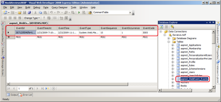
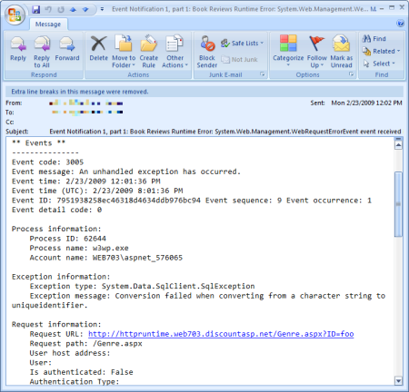

Logging Error Details with ASP.NET Health Monitoring (VB)
====================
by [Scott Mitchell](https://twitter.com/ScottOnWriting)

[Download Code](http://download.microsoft.com/download/1/0/C/10CC829F-A808-4302-97D3-59989B8F9C01/ASPNET_Hosting_Tutorial_13_VB.zip) or [Download PDF](http://download.microsoft.com/download/5/C/5/5C57DB8C-5DEA-4B3A-92CA-4405544D313B/aspnet_tutorial13_HealthMonitoring_vb.pdf)

> Microsoft's health monitoring system provides an easy and customizable way to log various web events, including unhandled exceptions. This tutorial walks through setting up the health monitoring system to log unhandled exceptions to a database and to notify developers via an e-mail message.

## Introduction

Logging is a useful tool for monitoring the health of a deployed application and for diagnosing any problems that may arise. It is especially important to log errors that occur in a deployed application so that they can be remedied. The `Error` event is raised whenever an unhandled exception occurs in an ASP.NET application; the [preceding tutorial](processing-unhandled-exceptions-vb.md) showed how to notify a developer of an error and log its details by creating an event handler for the `Error` event. However, creating an `Error` event handler to log the error's details and notify a developer is unnecessary, as this task can be performed by ASP.NET's *health monitoring system*.

The health monitoring system was introduced in ASP.NET 2.0 and is designed to monitor the health of a deployed ASP.NET application by logging events that occur during the application or request's lifetime. The events logged by the health monitoring system are referred to as *health monitoring events* or *Web events*, and include:

- Application lifetime events, such as when an application starts or stops
- Security events, including failed login attempts and failed URL authorization requests
- Application errors, including unhandled exceptions, view state parsing exceptions, request validation exceptions, and compilation errors, among other types of errors.

When a health monitoring event is raised it can be logged to any number of specified *log sources*. The health monitoring system ships with log sources that log Web events to a Microsoft SQL Server database, to the Windows Event Log, or via an e-mail message, among others. You can also create your own log sources.

The events the health monitoring system logs, along with the log sources used, are defined in `Web.config`. With a few lines of configuration markup you can use health monitoring to log all unhandled exceptions to a database and to notify you of the exception via e-mail.

## Exploring the Health Monitoring System's Configuration

The health monitoring system's behavior is defined by its configuration information, which is located in the [`<healthMonitoring>` element](https://msdn.microsoft.com/en-us/library/2fwh2ss9.aspx) in `Web.config`. This configuration section defines, among other things, the following three important pieces of information:

1. The health monitoring events that, when raised, should be logged,
2. The log sources, and
3. How each health monitoring event defined in (1) is mapped to the log sources defined in (2).

This information is specified through three children configuration elements: [`<eventMappings>`](https://msdn.microsoft.com/en-us/library/yc5yk01w.aspx), [`<providers>`](https://msdn.microsoft.com/en-us/library/zaa41kz1.aspx), and [`<rules>`](https://msdn.microsoft.com/en-us/library/fe5wyxa0.aspx), respectively.

The default health monitoring system configuration information can be found in the `Web.config` file in `%WINDIR%\Microsoft.NET\Framework\version\CONFIG` folder. This default configuration information, with some markup removed for brevity, is shown below:

[!code-xml[Main](logging-error-details-with-asp-net-health-monitoring-vb/samples/sample1.xml)]

The health monitoring events of interest are defined in the `<eventMappings>` element, which gives a human-friendly name to a class of health monitoring events. In the markup above, the `<eventMappings>` element assigns the human-friendly name "All Errors" to the health monitoring events of type `WebBaseErrorEvent` and the name "Failure Audits" to health monitoring events of type `WebFailureAuditEvent`.

The `<providers>` element defines the log sources, giving them a human-friendly name and specifying any log source-specific configuration information. The first `<add>` element defines the "EventLogProvider" provider, which logs the specified health monitoring events using the `EventLogWebEventProvider` class. The `EventLogWebEventProvider` class logs the event to the Windows Event Log. The second `<add>` element defines the "SqlWebEventProvider" provider, which logs events to a Microsoft SQL Server database via the `SqlWebEventProvider` class. The "SqlWebEventProvider" configuration specifies the database's connection string (`connectionStringName`) among other configuration options.

The `<rules>` element maps the events specified in the `<eventMappings>` element to log sources in the `<providers>` element. By default, ASP.NET web applications log all unhandled exceptions and audit failures to the Windows Event Log.

## Logging Events to a Database

The health monitoring system's default configuration can be customized on a web application-by-web application basis by adding a `<healthMonitoring>` section to the application's `Web.config` file. You can include additional elements in the `<eventMappings>`, `<providers>`, and `<rules>` sections by using the `<add>` element. To remove a setting from the default configuration use the `<remove>` element, or use `<clear />` to remove all default values from one of these sections. Let's configure the Book Reviews web application to log all unhandled exceptions to a Microsoft SQL Server database using the `SqlWebEventProvider` class.

The `SqlWebEventProvider` class is part of the health monitoring system and logs a health monitoring event to a specified SQL Server database. The `SqlWebEventProvider` class expects that the specified database includes a stored procedure named `aspnet_WebEvent_LogEvent`. This stored procedure is passed the details of the event and is tasked with storing the event details. The good news is that you do not need to create this stored procedure nor the table to store the event details. You can add these objects to your database using the `aspnet_regsql.exe` tool.

> [!NOTE]
> The `aspnet_regsql.exe` tool was discussed back in the [*Configuring a Website That Uses Application Services* tutorial](configuring-a-website-that-uses-application-services-vb.md) when we added support for ASP.NET's application services. Consequently, the Book Reviews website's database already contains the `aspnet_WebEvent_LogEvent` stored procedure, which stores the event information into a table named `aspnet_WebEvent_Events`.

Once you have the necessary stored procedure and table added to your database, all that remains is to instruct health monitoring to log all unhandled exceptions to the database. Accomplish this by adding the following markup to your website's `Web.config` file:

[!code-xml[Main](logging-error-details-with-asp-net-health-monitoring-vb/samples/sample2.xml)]

The health monitoring configuration markup above uses `<clear />` elements to wipe the pre-defined health monitoring configuration information from the `<eventMappings>`, `<providers>`, and `<rules>` sections. It then adds a single entry to each of these sections.

- The `<eventMappings>` element defines a single health monitoring event of interest named "All Errors", which is raised whenever an unhandled exception occurs.
- The `<providers>` element defines a single log source named "SqlWebEventProvider" that uses the `SqlWebEventProvider` class. The `connectionStringName` attribute has been set to "ReviewsConnectionString", which is the name of our connection string defined in the `<connectionStrings>` section.
- Finally, the &lt;rules&gt; element indicates that when an "All Errors" event transpires that it should be logged using the "SqlWebEventProvider" provider.

This configuration information instructs the health monitoring system to log all unhandled exceptions to the Book Reviews database.

> [!NOTE]
> The `WebBaseErrorEvent` event is only raised for server errors; it is not raised for HTTP errors, such as a request for an ASP.NET resource that is not found. This differs from the behavior of the `HttpApplication` class's `Error` event, which is raised for both server and HTTP errors.

To see the health monitoring system in action, visit the website and generate a runtime error by visiting `Genre.aspx?ID=foo`. You should see the appropriate error page - either the Exception Details Yellow Screen of Death (when visiting locally) or the custom error page (when visiting the site in production). Behind the scenes, the health monitoring system logged the error information to the database. There should be one record in the `aspnet_WebEvent_Events` table (see **Figure 1**); this record contains information about the runtime error that just occurred.

**Figure 1**: The Error Details Were Logged to the `aspnet_WebEvent_Events` Table  
([Click to view full-size image](logging-error-details-with-asp-net-health-monitoring-vb/_static/image3.png))

### Displaying the Error Log In a Web Page

With the website's current configuration, the health monitoring system logs all unhandled exceptions to the database. However, health monitoring does not provide any mechanism to view the error log through a web page. However, you could build an ASP.NET page that displays this information from the database. (As we'll see momentarily, you can opt to have the error details sent to you in an e-mail message.)

If you create such a page, make sure you take steps to allow only authorized users to view the error details. If your site already employs user accounts then you can use URL authorization rules to restrict access to the page to certain users or roles. For more information on how to grant or restrict access to web pages based on the logged in user, refer to my [Website Security Tutorials](../../older-versions-security/introduction/security-basics-and-asp-net-support-cs.md).

> [!NOTE]
> The subsequent tutorial explores an alternative error logging and notification system named ELMAH. ELMAH includes a built-in mechanism to view the error log from both a web page and as an RSS feed.

## Logging Events to E-Mail

The health monitoring system includes a log source provider that "logs" an event to an e-mail message. The log source includes the same information that is logged to the database in the e-mail message body. You can use this log source to notify a developer when a certain health monitoring event occurs.

Let's update the Book Reviews website's configuration so that we receive an e-mail whenever an exception occurs. To accomplish this we need to perform three tasks:

1. Configure the ASP.NET web application to send e-mail. This is accomplished by specifying how e-mail messages are sent via the `<system.net>` configuration element. For more information on sending e-mail messages in an ASP.NET application refer to [Sending Email in ASP.NET](http://aspnet.4guysfromrolla.com/articles/072606-1.aspx) and the [System.Net.Mail FAQ](http://systemnetmail.com/).
2. Register the e-mail log source provider in the `<providers>` element, and
3. Add an entry to the `<rules>` element that maps the "All Errors" event to the log source provider added in step (2).

The health monitoring system includes two e-mail log source provider classes: `SimpleMailWebEventProvider` and `TemplatedMailWebEventProvider`. The [`SimpleMailWebEventProvider` class](https://msdn.microsoft.com/en-us/library/system.web.management.simplemailwebeventprovider.aspx) sends a plain-text e-mail message that includes the event details and provides little customization of the e-mail body. With the [`TemplatedMailWebEventProvider` class](https://msdn.microsoft.com/en-us/library/system.web.management.templatedmailwebeventprovider.aspx) you specify an ASP.NET page whose rendered markup is used as the body for the e-mail message. The [`TemplatedMailWebEventProvider` class](https://msdn.microsoft.com/en-us/library/system.web.management.templatedmailwebeventprovider.aspx) gives you much greater control over the contents and format of the e-mail message, but requires a bit more upfront work as you have to create the ASP.NET page that generates the e-mail message's body. This tutorial focuses on using the `SimpleMailWebEventProvider` class.

Update the health monitoring system's `<providers>` element in the `Web.config` file to include a log source for the `SimpleMailWebEventProvider` class:

[!code-xml[Main](logging-error-details-with-asp-net-health-monitoring-vb/samples/sample3.xml)]

The above markup uses the `SimpleMailWebEventProvider` class as the log source provider, and assigns it the friendly name "EmailWebEventProvider". Moreover, the `<add>` attribute includes additional configuration options, such as the To and From addresses of the e-mail message.

With the e-mail log source defined, all that remains is to instruct the health monitoring system to use this source to "log" unhandled exceptions. This is accomplished by adding a new rule in the `<rules>` section:

[!code-xml[Main](logging-error-details-with-asp-net-health-monitoring-vb/samples/sample4.xml)]

The `<rules>` section now includes two rules. The first one, named "All Errors To E-Mail", sends all unhandled exceptions to the "EmailWebEventProvider" log source. This rule has the effect of sending details about errors on the website to the specified To address. The "All Errors To Database" rule logs the error details to the site's database. Consequently, whenever an unhandled exception occurs on the site its details are both logged to the database and sent to specified e-mail address.

**Figure 2** shows the e-mail generated by the `SimpleMailWebEventProvider` class when visiting `Genre.aspx?ID=foo`.

**Figure 2**: The Error Details are Sent in an E-Mail Message  
([Click to view full-size image](logging-error-details-with-asp-net-health-monitoring-vb/_static/image6.png))

## Summary

The ASP.NET health monitoring system is designed to allow administrators to monitor the health of a deployed web application. Health monitoring events are raised when certain actions unfold, such as when the application stops, when a user successfully logs onto the site, or when an unhandled exception occurs. These events can be logged to any number of log sources. This tutorial showed how to log the details of unhandled exceptions to a database and through an e-mail message.

This tutorial focused on using health monitoring to log unhandled exceptions, but keep in mind that health monitoring is designed to measure the overall health of a deployed ASP.NET application and includes a wealth of health monitoring events and log sources not explored here. What's more, you can create your own health monitoring events and log sources, should the need arise. If you are interested in learning more about health monitoring, a good first step is to read through [Erik Reitan](https://blogs.msdn.com/erikreitan/archive/2006/05/22/603586.aspx)'s [health monitoring FAQ](https://blogs.msdn.com/erikreitan/archive/2006/05/22/603586.aspx). Following that, consult [How To: Use Health Monitoring in ASP.NET 2.0](https://msdn.microsoft.com/en-us/library/ms998306.aspx).

Happy Programming!

### Further Reading

For more information on the topics discussed in this tutorial, refer to the following resources:

- [ASP.NET Health Monitoring Overview](https://msdn.microsoft.com/en-us/library/bb398933.aspx)
- [Configuring and Customizing the Health Monitoring System of ASP.NET](http://dotnetslackers.com/articles/aspnet/ConfiguringAndCustomizingTheHealthMonitoringSystemOfASPNET.aspx)
- [FAQ - Health Monitoring in ASP.NET 2.0](https://blogs.msdn.com/erikreitan/archive/2006/05/22/603586.aspx)
- [How To: Send E-Mail for Health Monitoring Notifications](https://msdn.microsoft.com/en-us/library/ms227553.aspx)
- [How To: Use Health Monitoring in ASP.NET](https://msdn.microsoft.com/en-us/library/ms998306.aspx)
- [Health Monitoring in ASP.NET](http://aspnet.4guysfromrolla.com/articles/031407-1.aspx)

>[!div class="step-by-step"]
[Previous](processing-unhandled-exceptions-vb.md)
[Next](logging-error-details-with-elmah-vb.md)