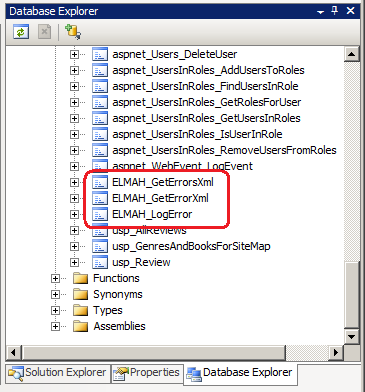
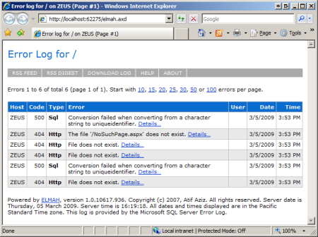
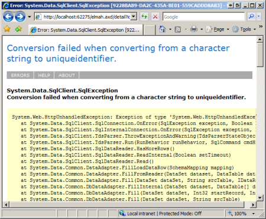
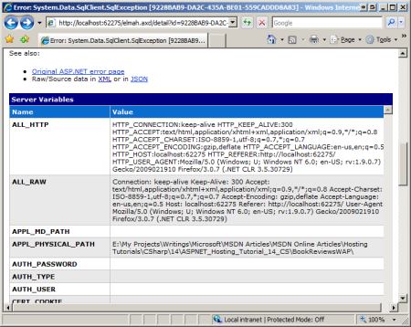
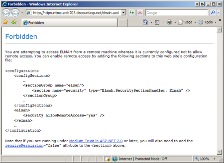
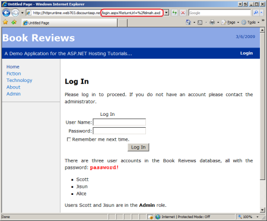
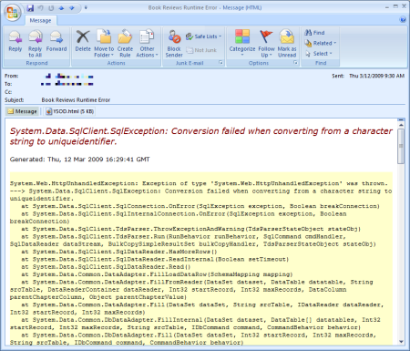

Logging Error Details with ELMAH (VB)
====================
by [Scott Mitchell](https://twitter.com/ScottOnWriting)

[Download Code](http://download.microsoft.com/download/1/0/C/10CC829F-A808-4302-97D3-59989B8F9C01/ASPNET_Hosting_Tutorial_14_VB.zip) or [Download PDF](http://download.microsoft.com/download/5/C/5/5C57DB8C-5DEA-4B3A-92CA-4405544D313B/aspnet_tutorial14_ELMAH_vb.pdf)

> Error Logging Modules And Handlers (ELMAH) offers another approach to logging runtime errors in a production environment. ELMAH is a free, open source error logging library that includes features like error filtering and the ability to view the error log from a web page, as an RSS feed, or to download it as a comma-delimited file. This tutorial walks through downloading and configuring ELMAH.

## Introduction

The [preceding tutorial](logging-error-details-with-asp-net-health-monitoring-vb.md) examined ASP.NET's health monitoring system, which offers an out of the box library for recording a wide array of Web events. Many developers use health monitoring to log and e-mail the details of unhandled exceptions. However, there are a few pain points with this system. First and foremost is the lack any sort of user interface for viewing information about the logged events. If you want to see a summary of the 10 last errors, or view the details of an error that happened last week, you must either poke through the database, scan through your e-mail Inbox, or build a web page that displays information from the `aspnet_WebEvent_Events` table.

Another pain point centers around health monitoring's complexity. Because health monitoring can be used to record a plethora of different events, and because there are a variety of options for instructing how and when events are logged, correctly configuring the health monitoring system can be an onerous task. Finally, there are compatibility issues. Because health monitoring was first added to the .NET Framework in version 2.0, it is not available for older web applications built using ASP.NET version 1.x. Moreover, the `SqlWebEventProvider` class, which we used in the preceding tutorial to logs error details to a database, only works with Microsoft SQL Server databases. You will need to create a custom log provider class should you need to log errors to an alternate data store, such as an XML file or Oracle database.

An alternative to the health monitoring system is Error Logging Modules And Handlers (ELMAH), a free, open-source error logging system created by [Atif Aziz](http://www.raboof.com/). The most notable difference between the two systems is ELAMH's ability to display a list of errors and the details of a specific error from a web page and as an RSS feed. ELMAH is easier to configure than health monitoring because it only logs errors. Furthermore, ELMAH includes support for ASP.NET 1.x, ASP.NET 2.0, and ASP.NET 3.5 applications, and ships with a variety of log source providers.

This tutorial walks through the steps involved in adding ELMAH to an ASP.NET application. Let's get started!

> [!NOTE]
> The health monitoring system and ELMAH both have their own sets of pros and cons. I encourage you to try both systems and decide what one best suits your needs.

## Adding ELMAH to an ASP.NET Web Application

Integrating ELMAH into a new or existing ASP.NET application is an easy and straightforward process that takes under five minutes. In a nutshell, it involves four simple steps:

1. Download ELMAH and add the `Elmah.dll` assembly to your web application,
2. Register ELMAH's HTTP Modules and Handler in `Web.config`,
3. Specify ELMAH's configuration options, and
4. Create the error log source infrastructure, if needed.

Let's walk through each of these four steps, one at a time.

### Step 1: Downloading the ELMAH Project Files and Adding`Elmah.dll`To Your Web Application

ELMAH 1.0 BETA 3 (Build 10617), the most recent version at the time of writing, is included in the download available with this tutorial. Alternatively, you may visit the [ELMAH website](https://code.google.com/p/elmah/) to get the most recent version or to download the source code. Extract the ELMAH download to a folder on your desktop and locate the ELMAH assembly file (`Elmah.dll`).

> [!NOTE]
> The `Elmah.dll` file is located in the download's `Bin` folder, which has subfolders for different .NET Framework versions and for Release and Debug builds. Use the Release build for the appropriate framework version. For instance, if you are building an ASP.NET 3.5 web application, copy the `Elmah.dll` file from the `Bin\net-3.5\Release` folder.

Next, open Visual Studio and add the assembly to your project by right-clicking on the website name in the Solution Explorer and choosing Add Reference from the context menu. This brings up the Add Reference dialog box. Navigate to the Browse tab and choose the `Elmah.dll` file. This action adds the `Elmah.dll` file to the web application's `Bin` folder.

> [!NOTE]
> The Web Application Project (WAP) type does not show the `Bin` folder in the Solution Explorer. Instead, it lists these items under the References folder.

The `Elmah.dll` assembly includes the classes used by the ELMAH system. These classes fall into one of three categories:

- **HTTP Modules** - an HTTP Module is a class that defines event handlers for `HttpApplication` events, such as the `Error` event. ELMAH includes multiple HTTP Modules, the three most germane ones being: 

    - `ErrorLogModule` - logs unhandled exceptions to a log source.
    - `ErrorMailModule` - sends the details of an unhandled exception in an e-mail message.
    - `ErrorFilterModule` - applies developer-specified filters to determine what exceptions are logged and what ones are ignored.
- **HTTP Handlers** - an HTTP Handler is a class that is responsible for generating the markup for a particular type of request. ELMAH includes HTTP Handlers that render error details as a web page, as an RSS feed, or as a comma-delimited file (CSV).
- **Error Log Sources** - out of the box ELMAH can log errors to memory, to a Microsoft SQL Server database, to a Microsoft Access database, to an Oracle database, to an XML file, to a SQLite database, or to a Vista DB database. Like the health monitoring system, ELMAH's architecture was built using the provider model, meaning that you can create and seamlessly integrate your own custom log source providers, if needed.

### Step 2: Registering ELMAH's HTTP Module and Handler

While the `Elmah.dll` file contains the HTTP Modules and Handler needed to automatically log unhandled exceptions and to display error details from a web page, these must be explicitly registered in the web application's configuration. The `ErrorLogModule` HTTP Module, once registered, subscribes to the `HttpApplication`'s `Error` event. Whenever this event is raised the `ErrorLogModule` logs the details of the exception to a specified log source. We'll see how to define the log source provider in the next section, "Configuring ELMAH." The `ErrorLogPageFactory` HTTP Handler factory is responsible for generating the markup when viewing the error log from a web page.

The specific syntax for registering HTTP Modules and Handlers depends upon the web server that is powering the site. For the ASP.NET Development Server and Microsoft's IIS version 6.0 and earlier, HTTP Modules and Handlers are registered in the `<httpModules>` and `<httpHandlers>` sections, which appear within the `<system.web>` element. If you are using IIS 7.0 then they need to be registered in the `<system.webServer>` element's `<modules>` and `<handlers>` sections. Fortunately, you can define the HTTP Modules and Handlers in *both* places regardless of the web server being used. This option is the most portable one as it allows the same configuration to be used in the development and production environments regardless of the web server being used.

Start by registering the `ErrorLogModule` HTTP Module and the `ErrorLogPageFactory` HTTP Handler in the `<httpModules>` and `<httpHandlers>` section in `<system.web>`. If your configuration already defines these two elements then simply include the `<add>` element for ELMAH's HTTP Module and Handler.

[!code-xml[Main](logging-error-details-with-elmah-vb/samples/sample1.xml)]

Next, register ELMAH's HTTP Module and Handler in the `<system.webServer>` element. As before, if this element is not already present in your configuration then add it.

[!code-xml[Main](logging-error-details-with-elmah-vb/samples/sample2.xml)]

By default, IIS 7 complains if HTTP Modules and Handlers are registered in the `<system.web>` section. The `validateIntegratedModeConfiguration` attribute in the `<validation>` element instructs IIS 7 to suppress such error messages.

Note that the syntax for registering the `ErrorLogPageFactory` HTTP Handler includes a `path` attribute, which is set to `elmah.axd`. This attribute informs the web application that if a request arrives for a page named `elmah.axd` then the request should be processed by the `ErrorLogPageFactory` HTTP Handler. We'll see the `ErrorLogPageFactory` HTTP Handler in action later in this tutorial.

### Step 3: Configuring ELMAH

ELMAH looks for its configuration options in the website's `Web.config` file in a custom configuration section named `<elmah>`. In order to use a custom section in `Web.config` it must first be defined in the `<configSections>` element. Open the `Web.config` file and add the following markup to the `<configSections>`:

[!code-xml[Main](logging-error-details-with-elmah-vb/samples/sample3.xml)]

> [!NOTE]
> If you are configuring ELMAH for an ASP.NET 1.x application then remove the `requirePermission="false"` attribute from the `<section>` elements above.

The above syntax registers the custom `<elmah>` section and its subsections: `<security>`, `<errorLog>`, `<errorMail>`, and `<errorFilter>`.

Next, add the `<elmah>` section to `Web.config`. This section should appear at the same level as the `<system.web>` element. Inside the `<elmah>` section add the `<security>` and `<errorLog>` sections like so:

[!code-xml[Main](logging-error-details-with-elmah-vb/samples/sample4.xml)]

The `<security>` section's `allowRemoteAccess` attribute indicates whether remote access is allowed. If this value is set to 0, then the error log web page can only be viewed locally. If this attribute is set to 1 then the error log web page is enabled for both remote and local visitors. For now, let's disable the error log web page for remote visitors. We'll allow remote access later after we have an opportunity to discuss the security concerns of doing so.

The `<errorLog>` section defines the error log source, which dictates where the error details are recorded; it is similar to the `<providers>` section in the health monitoring system. The above syntax specifies the `SqlErrorLog` class as the error log source, which logs the errors to a Microsoft SQL Server database specified by the `connectionStringName` attribute value.

> [!NOTE]
> ELMAH ships with additional error log providers that can be used to log errors to an XML file, a Microsoft Access database, an Oracle database, and other data stores. Refer to the sample `Web.config` file that is included with the ELMAH download for information on how to use these alternate error log providers.

### Step 4: Creating the Error Log Source Infrastructure

ELMAH's `SqlErrorLog` provider logs error details to a specified Microsoft SQL Server database. The `SqlErrorLog` provider expects this database to have a table named `ELMAH_Error` and three stored procedures: `ELMAH_GetErrorsXml`, `ELMAH_GetErrorXml`, and `ELMAH_LogError`. The ELMAH download includes a file named `SQLServer.sql` in the `db` folder that contains the T-SQL for creating this table and these stored procedures. You'll need to run these statements on your database to use the `SqlErrorLog` provider.

**Figures 1** and **2** show the Database Explorer in Visual Studio after the database objects needed by the `SqlErrorLog` provider have been added.

**Figure 1**: The `SqlErrorLog` Provider Logs Errors to the `ELMAH_Error` Table

**Figure 2**: The `SqlErrorLog` Provider Uses Three Stored Procedures

## ELMAH In Action

At this point we have added ELMAH to the web application, registered the `ErrorLogModule` HTTP Module and the `ErrorLogPageFactory` HTTP Handler, specified ELMAH's configuration options in `Web.config`, and added the needed database objects for the `SqlErrorLog` error log provider. We are now ready to see ELMAH in action! Visit the Book Reviews website and visit a page that generates a runtime error, such as `Genre.aspx?ID=foo`, or a non-existent page, such as `NoSuchPage.aspx`. What you see when visiting these pages depends on the `<customErrors>` configuration and whether you're visiting locally or remotely. (Refer back to the [*Displaying a Custom Error Page* tutorial](displaying-a-custom-error-page-vb.md) for a refresher on this topic.)

ELMAH doesn't affect what content is shown to the user when an unhandled exception occurs; it just logs its details. This error log is accessible from the web page `elmah.axd` from the root of your website, such as `http://localhost/BookReviews/elmah.axd`. (This file does not physically exist in your project, but when a request comes in for `elmah.axd` the runtime dispatches it to the `ErrorLogPageFactory` HTTP Handler, which generates the markup sent back to the browser.)

> [!NOTE]
> You can also use the `elmah.axd` page to instruct ELMAH to generate a test error. Visiting `elmah.axd/test` (as in, `http://localhost/BookReviews/elmah.axd/test`) causes ELMAH to throw an exception of type `Elmah.TestException`, which has the error message: " This is a test exception that can be safely ignored."

**Figure 3** shows the error log when visiting `elmah.axd` from the development environment.

**Figure 3**: `Elmah.axd` Displays the Error Log from a Web Page  
([Click to view full-size image](logging-error-details-with-elmah-vb/_static/image7.png))

The error log in **Figure 3** contains six error entries. Each entry includes the HTTP status code (404 or 500, for these errors), the type, the description, the name of the logged on user when the error occurred, and the date and time. Clicking the Details link displays a page that includes the same error message shown in the Error Details Yellow Screen of Death (see **Figure 4**) along with the values of the server variables at the time of the error (see **Figure 5**). You can also view the raw XML in which the error details are saved, which includes additional information such as the values in the HTTP POST header.

**Figure 4**: View the Error Details YSOD  
([Click to view full-size image](logging-error-details-with-elmah-vb/_static/image10.png))

**Figure 5**: Explore the Values of the Server Variables Collection at the Time of the Error  
([Click to view full-size image](logging-error-details-with-elmah-vb/_static/image13.png))

Deploying ELMAH to the production website entails:

- Copying the `Elmah.dll` file to the `Bin` folder on production,
- Copying the ELMAH-specific configuration settings to the `Web.config` file used on production, and
- Adding the error log source infrastructure to the production database.

We've explored techniques for copying files from development to production in previous tutorials. Perhaps the easiest way to get the error log source infrastructure on the production database is to use SQL Server Management Studio to connect to the production database and then execute the `SqlServer.sql` script file, which will create the needed table and stored procedures.

### Viewing the Error Details Page on Production

After deploying your site to production, visit the production website and generate an unhandled exception. As in the development environment, ELMAH has no affect on the error page displayed when an unhandled exception occurs; instead, it merely logs the error. If you attempt to visit the error log page (`elmah.axd`) from the production environment, you will be greeted with the Forbidden page shown in **Figure 6**.

**Figure 6**: By Default, Remote Visitors Cannot View the Error Log Web Page  
([Click to view full-size image](logging-error-details-with-elmah-vb/_static/image16.png))

Recall that in the ELMAH configuration's `<security>` section we set the `allowRemoteAccess` attribute to 0, which prohibits remote users from viewing the error log. It's important to prohibit anonymous visitors from viewing the error log, as the error details might reveal security vulnerabilities or other sensitive information. If you decide to set this attribute to 1 and enable remote access to the error log then it is important to lock down the `elmah.axd` path so that only authorized visitors can access it. This can be achieved by adding a `<location>` element to the `Web.config` file.

The following configuration permits only users in the Admin role to access the error log web page:

[!code-xml[Main](logging-error-details-with-elmah-vb/samples/sample5.xml)]

> [!NOTE]
> The Admin role and the three users in the system - Scott, Jisun, and Alice - were added in the [*Configuring a Website That Uses Application Services* tutorial](configuring-a-website-that-uses-application-services-vb.md). Users Scott and Jisun are members of the Admin role. For more information on authentication and authorization, refer to my [Website Security Tutorials](../../older-versions-security/introduction/security-basics-and-asp-net-support-cs.md).

The error log on the production environment can now be viewed by remote users; refer back to **Figures 3**, **4**, and **5** for screen shots of the error log web page. However, if an anonymous or non-Admin user attempts to view the error log page they are automatically redirected to the login page (`Login.aspx`), as **Figure 7** shows.

**Figure 7**: Unauthorized Users are Automatically Redirected to the Login Page  
([Click to view full-size image](logging-error-details-with-elmah-vb/_static/image19.png))

### Programmatically Logging Errors

ELMAH's `ErrorLogModule` HTTP Module automatically logs unhandled exceptions to the specified log source. Alternatively, you can log an error without having to raise an unhandled exception by using the `ErrorSignal` class and its `Raise` method. The `Raise` method is passed an `Exception` object and logs it as if that exception had been thrown and had reached the ASP.NET runtime without being handled. The difference, however, is that the request continues executing normally after the `Raise` method has been called, whereas a thrown, unhandled exception interrupts the request's normal execution and causes the ASP.NET runtime to display the configured error page.

The `ErrorSignal` class is useful in situations where there is some action that may fail, but its failure is not catastrophic to the overall operation being performed. For instance, a website may contain a form that takes the user's input, stores it in a database, and then sends the user an e-mail informing them that they information was processed. What should happen if the information is saved to the database successfully, but there is an error when sending the e-mail message? One option would be to throw an exception and send the user to the error page. However, this might confuse the user into thinking that the information they entered was not saved. Another approach would be to log the e-mail-related error, but not alter the user's experience in any way. This is where the `ErrorSignal` class is useful.

[!code-vb[Main](logging-error-details-with-elmah-vb/samples/sample6.vb)]

## Error Notification Via E-Mail

Along with logging errors to a database, ELMAH can also be configured to e-mail error details to a specified recipient. This functionality is provided by the `ErrorMailModule` HTTP Module; therefore, you must register this HTTP Module in `Web.config` in order to send error details via e-mail.

[!code-xml[Main](logging-error-details-with-elmah-vb/samples/sample7.xml)]

Next, specify information about the error e-mail in the `<elmah>` element's `<errorMail>` section, indicating the e-mail's sender and recipient, the subject, and whether the e-mail is sent asynchronously.

[!code-xml[Main](logging-error-details-with-elmah-vb/samples/sample8.xml)]

With the above settings in place, whenever a runtime error occurs ELMAH sends an e-mail to support@example.com with the error details. ELMAH's error e-mail includes the same information shown in the error details web page, namely the error message, the stack trace, and the server variables (refer back to **Figures 4** and **5**). The error e-mail also includes the Exception Details Yellow Screen of Death content as an attachment (`YSOD.html`).

**Figure 8** shows ELMAH's error e-mail generated by visiting `Genre.aspx?ID=foo`. While **Figure 8** shows only the error message and stack trace, the server variables are included further down in the e-mail's body.

**Figure 8**: You Can Configure ELMAH To Send Error Details Via E-Mail  
([Click to view full-size image](logging-error-details-with-elmah-vb/_static/image22.png))

## Only Logging Errors Of Interest

By default, ELMAH logs the details of every unhandled exception, including 404 and other HTTP errors. You can instruct ELMAH to ignore these or other types of errors using error filtering. The filtering logic is performed by ELMAH's `ErrorFilterModule` HTTP Module, which you'll need to register in `Web.config` in order to use the filtering logic. The rules for filtering are specified in the `<errorFilter>` section.

The following markup instructs ELMAH to not log 404 errors.

[!code-xml[Main](logging-error-details-with-elmah-vb/samples/sample9.xml)]

> [!NOTE]
> Don't forget, in order to use error filtering you must register the `ErrorFilterModule` HTTP Module.

The `<equal>` element inside the `<test>` section is referred to as an assertion. If the assertion evaluates to true then the error is filtered from ELMAH's log. There are other assertions available, including: `<greater>`, `<greater-or-equal>`, `<not-equal>`, `<lesser>`, `<lesser-or-equal>`, and so on. You can also combine assertions using the `<and>` and `<or>` Boolean operators. What's more, you can even include a simple JavaScript expression as an assertion, or write your own assertions in C# or Visual Basic.

For more information on ELMAH's error filtering capabilities, refer to the [Error Filtering section](https://code.google.com/p/elmah/wiki/ErrorFiltering) in the [ELMAH wiki](https://code.google.com/p/elmah/w/list).

## Summary

ELMAH provides a simple, yet powerful mechanism for logging errors in an ASP.NET web application. Like Microsoft's health monitoring system, ELMAH can log errors to a database and can send the error details to a developer via e-mail. Unlike the health monitoring system, ELMAH includes out of the box support for a wider range of error log data stores, including: Microsoft SQL Server, Microsoft Access, Oracle, XML files, and several others. Moreover, ELMAH offers a built-in mechanism for viewing the error log and details about a specific error from a web page, `elmah.axd`. The `elmah.axd` page can also render error information as an RSS feed or as a comma-separated value file (CSV), which you can read using Microsoft Excel. You can also instruct ELMAH to filter errors from the log using declarative or programmatic assertions. And ELMAH can be used with ASP.NET version 1.x applications.

Every deployed application should have some mechanism for automatically logging unhandled exceptions and sending notification to the development team. Whether this is accomplished using health monitoring or ELMAH is secondary. In other words, it doesn't really matter much whether you use health monitoring or ELMAH; evaluate both systems and then choose the one that best fits your needs. What is fundamentally important is that some mechanism be put in place to log unhandled exceptions in the production environment.

Happy Programming!

### Further Reading

For more information on the topics discussed in this tutorial, refer to the following resources:

- [ELMAH - Error Logging Modules and Handlers](http://dotnetslackers.com/articles/aspnet/ErrorLoggingModulesAndHandlers.aspx)
- [ELMAH Project Page](https://code.google.com/p/elmah/) (source code, samples, wiki)
- [Plugging ELMAH Into a Web Application to Catch Unhandled Exceptions](http://screencastaday.com/ScreenCasts/43_Plugging_Elmah_into_Web_Application_to_Catch_Unhandled_Exceptions.aspx) (video)
- [Security Error Log Pages](https://code.google.com/p/elmah/wiki/SecuringErrorLogPages)
- [Using HTTP Modules and Handlers to Create Pluggable ASP.NET Components](https://msdn.microsoft.com/en-us/library/aa479332.aspx)
- [Website Security Tutorials](../../older-versions-security/introduction/security-basics-and-asp-net-support-cs.md)

>[!div class="step-by-step"]
[Previous](logging-error-details-with-asp-net-health-monitoring-vb.md)
[Next](precompiling-your-website-vb.md)