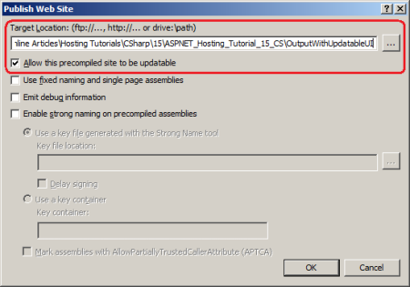
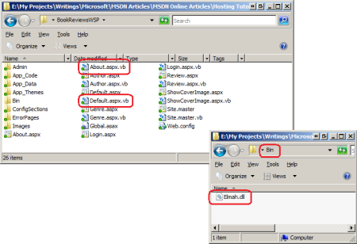
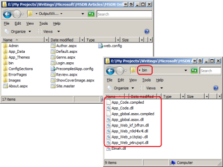
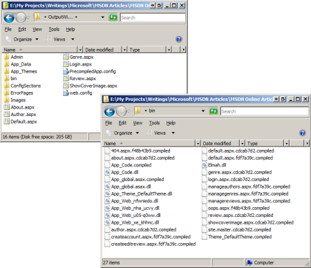

Precompiling Your Website (VB)
====================
by [Scott Mitchell](https://twitter.com/ScottOnWriting)

[Download Code](http://download.microsoft.com/download/1/0/C/10CC829F-A808-4302-97D3-59989B8F9C01/ASPNET_Hosting_Tutorial_15_VB.zip) or [Download PDF](http://download.microsoft.com/download/5/C/5/5C57DB8C-5DEA-4B3A-92CA-4405544D313B/aspnet_tutorial15_Precompiling_vb.pdf)

> Visual Studio offers ASP.NET developers two types of projects: Web Application Projects (WAPs) and Web Site Projects (WSPs). One of the key differences between the two project types is that WAPs must have the code explicitly compiled prior to deployment whereas the code in a WSP can be automatically compiled on the web server. However, it is possible to precompile a WSP prior to deployment. This tutorial explores the benefits of precompilation and shows how to precompile a website from within Visual Studio and from the command line.

## Introduction

Visual Studio offers ASP.NET developers two different project types: Web Application Projects (WAP) and Web Site Projects (WSP). One of the key differences between these project types is that WAPs require *explicit compilation* whereas WSPs use *automatic compilation*, by default. With WAPs, you compile the web application's code into a single assembly, which is created in the website's `Bin` folder. Deployment entails copying the markup content (the `.aspx.ascx`, and `.master` files) in the project, along with the assembly in the `Bin` folder; the code-behind class files themselves do not need to be deployed. On the other hand, you deploy WSPs by copying both the markup pages and their corresponding code-behind classes to the production environment. The code-behind classes are compiled on demand on the web server.

> [!NOTE]
> Refer back to the "Explicit Compilation Versus Automatic Compilation" section in the [*Determining What Files Need to Be Deployed* tutorial](determining-what-files-need-to-be-deployed-vb.md) for more background on the differences between the project models, explicit and automatic compilation, and how the compilation model affects deployment.

The automatic compilation option is simple to use. There's no explicit compilation step and only the files that have been modified need to be deployed, whereas explicit compilation necessitates deploying the changed markup pages and the just-compiled assembly. However, automatic deployment has two potential drawbacks:

- Because the pages must be automatically compiled when they are first visited, there can be a short but noticeable delay when an ASP.NET page is requested for the first time after being deployed.
- Automatic compilation requires that both the declarative markup and source code be present on the web server. This can be an unattractive option if you plan on selling the web application to customers who will install it on their web servers.

If either of the two above shortcomings are deal breakers, you can either switch to the WAP model or *precompile* the WSP prior to deployment. This tutorial examines the precompilation options best suited for a hosted website and walks through the precompilation process and deployment of a precompiled website.

## An Overview of ASP.NET Code Generation and Compilation

Before we look at the available precompilation options, let's first talk about the code generation and compilation that occurs when an ASP.NET page is requested for the first time since it's been created or last updated. As you know, ASP.NET pages are composed of two portions: declarative markup in the `.aspx` file; and a source code portion, typically in a separate code-behind class file (`.aspx.vb`). The steps performed by the runtime when an ASP.NET page is requested depends on the application's compilation model.

With WAPs, the pages' source code must be explicitly compiled into a single assembly before being deployed. During deployment, this assembly and the various markup pages are copied to the production environment. When a request arrives to the web server for an ASP.NET page, the runtime creates an instance of the page's code-behind class and invokes its `ProcessRequest` method, which starts the page lifecycle and, ultimately, generates the page's content, which is returned to the requestor. The runtime can work with the ASP.NET page's code-behind class because the code-behind class was already compiled into an assembly prior to deployment.

With WSPs and automatic compilation, there is no explicit compilation step prior to deployment. Instead, deployment involves copying both the declarative and the source code content to the production environment. When a request arrives to the web server for an ASP.NET page for the first time since the page has been created or last updated, the runtime must first compile the code-behind class into an assembly. This compiled assembly is saved in the folder `%WINDIR%\Microsoft.NET\Framework\v2.0.50727\Temporary ASP.NET Files`, although the location of this folder can be customized via the `<pages>` element in `Web.config`. Because the assembly is saved to disk, it does not need to be recompiled on subsequent requests to the same page.

> [!NOTE]
> As you would expect, there is a slight delay when requesting a page for the first time (or for the first time since it's been changed) in a site that uses automatic compilation as it takes a moment for the server to compile the page's code and save the resulting assembly to disk.

In short, with explicit compilation you are required to compile the website's source code before deployment, saving the runtime from having to perform that step. With automatic compilation the runtime handles the compilation of the pages' source code, but with a slight initialization cost for the first visit to the page since it was created or last updated.

But what about the declarative part of ASP.NET pages (the `.aspx` file)? It's obvious that there's a relationship between the `.aspx` files and the code in their code-behind classes, as the Web controls defined in the declarative markup are accessible in the code. It's also obvious that the content in the `.aspx` files greatly influences the rendered markup generated by the page. So how does the runtime work with the text, HTML, and Web control syntax defined in the `.aspx` file to generate the requested page's rendered content?

I don't want to get too sidetracked on the low-level implementation details, which vary between WAPs and WSPs, but in a nutshell the runtime automatically generates a class file that contains the various Web controls as protected members and methods. This generated file is implemented as a *partial class* to the corresponding code-behind class. ([Partial classes](http://www.dotnet-guide.com/partialclasses.html) allow for the contents of a single class to be spread across multiple files.) Therefore, the code-behind class is defined in two places: in the `.aspx.vb` file that you create, and in this auto-generated class created by the runtime. This auto-generated class is stored in the `%WINDIR%\Microsoft.NET\Framework\v2.0.50727\Temporary ASP.NET Files` folder.

The important take away here is that for an ASP.NET page to be rendered by the runtime both its declarative and source code portions must be compiled into an assembly. With WAPs, the source code is explicitly compiled into an assembly prior to deployment, but the declarative markup must still be converted into code and compiled by the runtime on the web server. With WSPs using automatic compilation, both the source code and the declarative markup need to be compiled by the web server.

It is possible to use explicit compilation with the WSP model. You can explicitly compile the source code portion, like with the WAP model. What's more, you can also compile the declarative markup.

## Precompilation Options

The .NET Framework ships with an [ASP.NET compilation tool (`aspnet_compiler.exe`)](https://msdn.microsoft.com/en-us/library/ms229863.aspx) that enables you to compile the source code (and even the content) of an ASP.NET application built using the WSP model. This tool was released with the .NET Framework version 2.0 and is located in the `%WINDIR%\Microsoft.NET\Framework\v2.0.50727` folder; it can be used from the command line or launched from within Visual Studio via the Build menu's Publish Web Site option.

The compilation tool provides two general forms of compilation: in-place precompilation and precompilation for deployment. With in-place precompilation you run the `aspnet_compiler.exe` tool from the command-line and specify the path to the virtual directory or physical path of a website that resides on your computer. The compilation tool then compiles each ASP.NET page in the project, storing the compiled version in the `%WINDIR%\Microsoft.NET\Framework\v2.0.50727\Temporary ASP.NET Files` folder just like if the pages had each been visited for the first time from a browser. In-place precompilation can speed up the first request made to newly deployed ASP.NET pages on your site because it alleviates the runtime from needing to perform this step. However, in-place precompilation is not useful for the majority of hosted websites because it requires that you are able to run programs from the web server's command-line. In shared hosting environments this level of access is not permitted.

> [!NOTE]
> For more information on in-place precompilation, check out [How To: Precompile ASP.NET Web Sites](https://msdn.microsoft.com/en-us/library/ms227972.aspx) and [Precompilation in ASP.NET 2.0](http://www.odetocode.com/Articles/417.aspx).

Instead of compiling the pages in the website to the `Temporary ASP.NET Files` folder, precompilation for deployment compiles the pages to a directory of your choosing and in a format that can be deployed to the production environment.

There are two flavors of precompilation for deployment that we explore in this tutorial: precompilation with an updatable user interface, and precompilation with a non-updatable user interface. Precompilation with an updatable user interface leaves the declarative markup in the `.aspx`, `.ascx`, and `.master` files, thereby allowing a developer to view and, if desired, modify the declarative markup on the production server. Precompilation with a non-updatable user interface generates `.aspx` pages that are void of any content and removes `.ascx` and `.master` files, thereby hiding the declarative markup and prohibiting a developer from changing it from the production environment.

### Precompiling for Deployment With an Updatable User Interface

The best way to understand precompilation for deployment is to see an example in action. Let's precompile the Book Reviews WSP for deployment using an updatable user interface. The ASP.NET compilation tool can be invoked from Visual Studio's Build menu or from the command-line. This section examines using the tool from within Visual Studio; the "Precompiling from the Command Line" section looks at running the compiler tool from the command line.

Open the Book Review WSP in Visual Studio, go to the Build menu, and select the Publish Web Site menu option. This launches the Publish Web Site dialog box (see **Figure 1**), where you can specify the target location, whether or not the precompiled site's user interface is updatable, and other compiler tool options. The target location can be a remote web server or FTP server, but for now choose a folder on your computer's hard drive. Because we want to precompile the site with an updatable user interface, leave the "Allow this precompiled site to be updatable" checkbox checked and click OK.

**Figure 1**: The ASP.NET Compilation Tool Will Precompile Your Website to the Specified Target Location  
 ([Click to view full-size image](precompiling-your-website-vb/_static/image3.png))

> [!NOTE]
> The Publish Web Site option in the Build menu is not available in Visual Web Developer. If you are using Visual Web Developer you will need to use the command-line version of the ASP.NET compilation tool, which is covered in the "Precompiling from the Command Line" section.

After precompiling the website, navigate to the target location you entered in the Publish Web Site dialog box. Take a moment to compare the contents of this folder with the contents of your website. **Figure 2** shows the Book Reviews website folder. Note that it contains both `.aspx` and `.aspx.cs` files. Also, note that the `Bin` directory includes only one file, `Elmah.dll`, which we added in the [preceding tutorial](logging-error-details-with-elmah-vb.md)

**Figure 2**: The Project Directory Contains `.aspx` and `.aspx.cs` Files; the `Bin` Folder Includes Just `Elmah.dll`  
 ([Click to view full-size image](precompiling-your-website-vb/_static/image6.png))

**Figure 3** shows the target location folder whose contents were created by the ASP.NET compilation tool. This folder does not contain any code-behind files. Moreover, this folder's `Bin` directory includes several assemblies and two `.compiled` files in addition to the `Elmah.dll` assembly.

**Figure 3**: The Target Location Folder Includes the Files for Deployment  
 ([Click to view full-size image](precompiling-your-website-vb/_static/image9.png))

Unlike explicit compilation in WAPs, the precompilation for deployment process does not create one assembly for the entire site. Instead, it batches together several pages into each assembly. It also compiles the `Global.asax` file (if present) into its own assembly, as well as any classes in the `App_Code` folder. The files that hold the declarative markup for ASP.NET web pages, User Controls, and master pages (`.aspx`, `.ascx`, and `.master` files, respectively) are copied as-is to the target location directory. Likewise, the `Web.config` file is copied straight over, along with any static files, such as images, CSS classes, and PDF files. For a more formal description of how the compilation tool handles various file types, refer to [File Handling During ASP.NET Precompilation](https://msdn.microsoft.com/en-us/library/e22s60h9.aspx).

> [!NOTE]
> You can instruct the compilation tool to create one assembly per ASP.NET page, User Control, or master page by checking the "Used fixed naming and single page assemblies" checkbox from the Publish Web Site dialog box. Having each ASP.NET page compiled into its own assembly allows for more fine-grained control over deployment. For example, if you updated a single ASP.NET web page and needed to deploy that change, you need only deploy that page's `.aspx` file and associated assembly to the production environment. Consult [How To: Generate Fixed Names with the ASP.NET Compilation Tool](https://msdn.microsoft.com/en-us/library/ms228040.aspx) for more information.

The target location directory also contains a file that was not part of the precompiled web project, namely `PrecompiledApp.config`. This file informs the ASP.NET runtime that the application was precompiled and whether it was precompiled with an updatable or noon-updatable UI.

Finally, take a moment to open one of the `.aspx` files in the target location using Visual Studio or your text editor of choice. When precompiling for deployment with an updatable user interface, the ASP.NET pages in the target location directory contain the exact same markup as the corresponding files in the website.

### Precompiling for Deployment With a Non-Updatable User Interface

The ASP.NET compiler tool can also be used to precompile a site for deployment with a non-updatable UI. Precompiling the site with a non-updatable UI works much like precompiling with an updatable UI, the key difference being that the ASP.NET pages, User Controls, and master pages in the target directory are stripped of their markup. To precompile a website for deployment with a non-updatable UI, choose the Publish Web Site option from the Build menu, but uncheck the "Allow this precompiled site to be updatable" option (see **Figure 4**).

**Figure 4**: Uncheck the "Allow this precompiled site to be updatable" Option To Precompile With a Non-Updatable UI  
 ([Click to view full-size image](precompiling-your-website-vb/_static/image12.png))

**Figure 5** shows the target location folder after precompiling with a non-updatable user interface.

**Figure 5**: The Target Location Folder for Deployment With a Non-Updatable UI  
 ([Click to view full-size image](precompiling-your-website-vb/_static/image15.png))

Compare **Figure 3** to **Figure 5**. While the two folders may look identical, note that the non-updatable UI folder lacks the master page, `Site.master`. And while **Figure 5** includes the various ASP.NET pages, if you view the contents of these files you'll see that they've been stripped of their declarative markup and replaced with the placeholder text: "This is a marker file generated by the precompilation tool, and should not be deleted!"

**Figure 5**: The Declarative Markup Has Been Removed from the ASP.NET Pages

The `Bin` folders in **Figures 3** and **5** differ more substantially. In addition to the assemblies, the `Bin` folder in **Figure 5** includes a `.compiled` file for each ASP.NET page, User Control, and master page.

Precompiling a site with a non-updatable UI is useful in situations where you do not want the ASP.NET pages' contents to be modified by the person or company who installs or manages the website in the production environment. If you build an ASP.NET web application that you sell to customers to install on their own web servers, you may want to ensure that they do not modify the look and feel of your site by directly editing the `.aspx` pages you ship them. By precompiling your website with a non-updatable UI, you ship the placeholder `.aspx` pages as part of the installation, thereby preventing your customers from examining or modifying their content.

### Precompiling from the Command Line

Behind the scenes, Visual Studio's Publish Web Site dialog box invokes the ASP.NET compilation tool (`aspnet_compiler.exe`) to precompile the website. Alternatively, you can invoke this tool from the command line. In fact, if you use Visual Web Developer then you will need to run the compiler tool from the command line, as Visual Web Developer's Build menu does not include the Publish Web Site option.

To use the compiler tool from the command line, start by dropping to the command line and navigating to the framework directory, `%WINDIR%\Microsoft.NET\Framework\v2.0.50727`. Next, enter the following statement into the command line:

`aspnet_compiler -p "physical_path_to_app" -v / -f -u "target_location_folder"`

The above command launches the ASP.NET compiler tool (`aspnet_compiler.exe`) and, via the `-p` switch, instructs it to precompile the website rooted at *physical\_path\_to\_app*; this value will be something like `C:\MySites\BookReviews`, and should be delimited by quotation marks.

The `-v` switch specifies the virtual directory of the site. If your site is registered as the default website in the IIS metabase then you can omit the `-p` switch and just specify the virtual directory of the application. If you use the `-p` switch, the value proceeding the `-v` switch indicates the root of the website, and is used to resolve application-root references. For instance, if you specify a value of `-v /MySite` then references in the application to `~/path/file` will be resolved as `~/MySite/path/file`. Because the Book Reviews site is located at the root directory at my web hosting company I have used the switch `-v /`.

The `-f` switch, if present, instructs the compilation tool to overwrite the *target\_location\_folder* directory if it already exists. If you omit the `-f` switch and the target location folder already exists, the compilation tool will quit with the error: "error ASPRUNTIME: The target directory is not empty. Please delete it manually or choose a different target."

The `-u` switch, if present, informs the tool to create an updatable user interface. Omit this switch to precompile the site with a non-updatable user interface.

Lastly, the *target\_location\_folder* is the physical path to the target location directory; this value will be something like `C:\MySites\Output\BookReviews`, and should be delimited by quotation marks.

## Deploying the Precompiled Website

At this point we have seen how to use the ASP.NET compilation tool to precompile a website using both the updatable and non-updatable user interface options. However, our examples thus far have precompiled the website to a local folder, and not to the production environment. The good news is that deploying the precompiled website is a breeze and can be done through Visual Studio or through some other file copy mechanism, such as from a stand-alone FTP client.

The Publish Web Site dialog box (first shown in **Figure 1**) has a target location option, which indicates where the precompiled website files are copied to. This location can be a remote web server or FTP server. Entering a remote server into this textbox precompiles and deploys the website to the specified server in one step. Alternatively, you can precompile the website to a local folder and then manually copy the contents of that folder to the production environment via FTP or some other approach.

Having the precompiled website automatically deployed via Visual Studio's Publish Web Site dialog box is helpful for simple sites where there are no configuration differences between the development and production environments. However, as noted in the [*Common Configuration Differences Between Development and Production* tutorial](common-configuration-differences-between-development-and-production-vb.md) it is not uncommon for such differences to exist. For example, the Book Reviews web application uses a different database in the production environment than in the development environment. When Visual Studio publishes the website to a remote server it blindly copies up the configuration file information in the development environment.

For sites with configuration differences between the development and production environments it may be best to precompile the site to a local directory, copy over the production-specific configuration files, and then copy the contents of the precompiled output to production.

For a refresher on copying files from the development environment to the production environment refer to the [*Deploying Your Website Using an FTP Client*](deploying-your-site-using-an-ftp-client-vb.md) and [*Deploying Your Website Using Visual Studio*](determining-what-files-need-to-be-deployed-vb.md) tutorials.

## Summary

ASP.NET supports two modes of compilation: automatic and explicit. As discussed in previous tutorials, Web Application Projects (WAPs) use explicit compilation whereas Web Site Projects (WSPs) use automatic compilation, by default. However, it is possible to explicitly compile a WSP prior to deployment by using the ASP.NET compilation tool.

This tutorial focused on the compilation tool's Precompilation for Deployment support. When precompiling for deployment, the compilation tool creates a target location folder, compiles the specified web application's source code, and copies these compiled assemblies and the content files into the target location folder. The compilation tool can be configured to create an updatable or non-updatable user interface. When precompiling with a non-updatable user interface option, the declarative markup in the content files is removed. In a nutshell, precompilation permits you to deploy your Web Site Project-based application without including any source code files and with the declarative markup removed, if desired.

Happy Programming!

### Further Reading

For more information on the topics discussed in this tutorial, refer to the following resources:

- [ASP.NET Web Site Precompilation](https://msdn.microsoft.com/en-us/library/ms228015.aspx)
- [Codebehind and Compilation in ASP.NET 2.0](https://msdn.microsoft.com/en-us/magazine/cc163675.aspx)
- [Precompilation in ASP.NET](http://www.odetocode.com/Articles/417.aspx)
- [Precompiled Site Options in ASP.NET](http://www.dotnetperls.com/precompiled)

>[!div class="step-by-step"]
[Previous](logging-error-details-with-elmah-vb.md)
[Next](users-and-roles-on-the-production-website-vb.md)