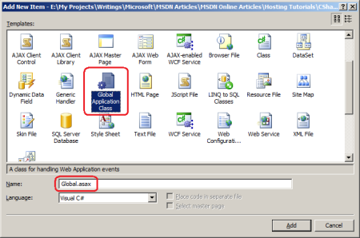
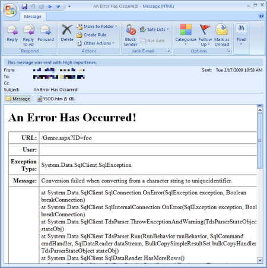
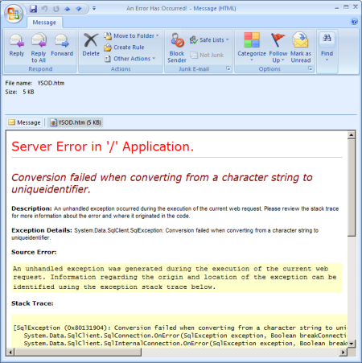

Processing Unhandled Exceptions (C#)
====================
by [Scott Mitchell](https://twitter.com/ScottOnWriting)

[Download Code](http://download.microsoft.com/download/1/0/C/10CC829F-A808-4302-97D3-59989B8F9C01/ASPNET_Hosting_Tutorial_12_CS.zip) or [Download PDF](http://download.microsoft.com/download/5/C/5/5C57DB8C-5DEA-4B3A-92CA-4405544D313B/aspnet_tutorial12_ErrorHandling_cs.pdf)

> When a runtime error occurs on a web application in production it is important to notify a developer and to log the error so that it may be diagnosed at a later point in time. This tutorial provides an overview of how ASP.NET processes runtime errors and looks at one way to have custom code execute whenever an unhandled exception bubbles up to the ASP.NET runtime.

## Introduction

When an unhandled exception occurs in an ASP.NET application, it bubbles up to the ASP.NET runtime, which raises the `Error` event and displays the appropriate error page. There are three different types of error pages: the Runtime Error Yellow Screen of Death (YSOD); the Exception Details YSOD; and custom error pages. In the [preceding tutorial](displaying-a-custom-error-page-cs.md) we configured the application to use a custom error page for remote users and the Exception Details YSOD for users visiting locally.

Using a human-friendly custom error page that matches the look and feel of the site is preferred to the default Runtime Error YSOD, but displaying a custom error page is only one part of a comprehensive error handling solution. When an error occurs in an application in production, it is important that the developers are notified of the error so that they can unearth the cause of the exception and address it. Furthermore, the error's details should be logged so that the error can be examined and diagnosed at a later point in time.

This tutorial shows how to access the details of an unhandled exception so that they can be logged and a developer notified. The two tutorials following this one explore error logging libraries that, after a bit of configuration, will automatically notify developers of runtime errors and log their details.

> [!NOTE]
> The information examined in this tutorial is most useful if you need to process unhandled exceptions in some unique or customized manner. In cases where you only need to log the exception and notify a developer, using an error logging library is the way to go. The next two tutorials provide an overview of two such libraries.

## Executing Code When The`Error`Event Is Raised

Events provide an object a mechanism for signaling that something interesting has occurred, and for another object to execute code in response. As an ASP.NET developer you are accustomed to thinking in terms of events. If you want to run some code when the visitor clicks a particular Button, you create an event handler for that Button's `Click` event and put your code there. Given that the ASP.NET runtime raises its [`Error` event](https://msdn.microsoft.com/en-us/library/system.web.httpapplication.error.aspx) whenever an unhandled exception occurs, it follows that the code for logging the error's details would go in an event handler. But how do you create an event handler for the `Error` event?

The `Error` event is one of many events in the [`HttpApplication` class](https://msdn.microsoft.com/en-us/library/system.web.httpapplication.aspx) that are raised at certain stages in the HTTP pipeline during the lifetime of a request. For example, the `HttpApplication` class's [`BeginRequest` event](https://msdn.microsoft.com/en-us/library/system.web.httpapplication.beginrequest.aspx) is raised at the start of every request; its [`AuthenticateRequest` event](https://msdn.microsoft.com/en-us/library/system.web.httpapplication.authenticaterequest.aspx) is raised when a security module has identified the requestor. These `HttpApplication` events give the page developer a means to execute custom logic at the various points in the lifetime of a request.

Event handlers for the `HttpApplication` events can be placed in a special file named `Global.asax`. To create this file in your website, add a new item to the root of your website using the Global Application Class template with the name `Global.asax`.

**Figure 1**: Add `Global.asax` To Your Web Application  
([Click to view full-size image](processing-unhandled-exceptions-cs/_static/image3.png))

The contents and structure of the `Global.asax` file created by Visual Studio differ slightly based on whether you are using a Web Application Project (WAP) or Web Site Project (WSP). With a WAP, the `Global.asax` is implemented as two separate files - `Global.asax` and `Global.asax.cs`. The `Global.asax` file contains nothing but an `@Application` directive that references the `.cs` file; the event handlers of interest are defined in the `Global.asax.cs` file. For WSPs, only a single file is created, `Global.asax`, and the event handlers are defined in a `<script runat="server">` block.

The `Global.asax` file created in a WAP by Visual Studio's Global Application Class template includes event handlers named `Application_BeginRequest`, `Application_AuthenticateRequest`, and `Application_Error`, which are event handlers for the `HttpApplication` events `BeginRequest`, `AuthenticateRequest`, and `Error`, respectively. There are also event handlers named `Application_Start`, `Session_Start`, `Application_End`, and `Session_End`, which are event handlers that fire when the web application starts, when a new session starts, when the application ends, and when a session ends, respectively. The `Global.asax` file created in a WSP by Visual Studio contains just the `Application_Error`, `Application_Start`, `Session_Start`, `Application_End`, and `Session_End` event handlers.

> [!NOTE]
> When deploying the ASP.NET application you need to copy the `Global.asax` file to the production environment. The `Global.asax.cs` file, which is created in the WAP, does not need to be copied to production because this code is compiled into the project's assembly.

The event handlers created by Visual Studio's Global Application Class template are not exhaustive. You can add an event handler for any `HttpApplication` event by naming the event handler `Application_EventName`. For example, you could add the following code to the `Global.asax` file to create an event handler for the [`AuthorizeRequest` event](https://msdn.microsoft.com/en-us/library/system.web.httpapplication.authorizerequest.aspx):

[!code-vb[Main](processing-unhandled-exceptions-cs/samples/sample1.vb)]

Likewise, you can remove any event handlers created by the Global Application Class template that are not needed. For this tutorial we only require an event handler for the `Error` event; feel free to remove the other event handlers from the `Global.asax` file.

> [!NOTE]
> *HTTP Modules* offer another way to define event handlers for `HttpApplication` events. HTTP Modules are created as a class file that can be placed directly within the web application project or separated out into a separate class library. Because they can be separated out into a class library, HTTP Modules offer a more flexible and reusable model for creating `HttpApplication` event handlers. Whereas the `Global.asax` file is specific to the web application where it resides, HTTP Modules can be compiled into assemblies, at which point adding the HTTP Module to a website is as simple as dropping the assembly in the `Bin` folder and registering the Module in `Web.config`. This tutorial does not look at creating and using HTTP Modules, but the two error logging libraries used in the following two tutorials are implemented as HTTP Modules. For more background on the benefits of HTTP Modules refer to [Using HTTP Modules and Handlers to Create Pluggable ASP.NET Components](https://msdn.microsoft.com/en-us/library/aa479332.aspx).

## Retrieving Information About the Unhandled Exception

At this point we have a Global.asax file with an `Application_Error` event handler. When this event handler executes we need to notify a developer of the error and log its details. To accomplish these tasks we first need to determine the details of the exception that was raised. Use the Server object's [`GetLastError` method](https://msdn.microsoft.com/en-us/library/system.web.httpserverutility.getlasterror.aspx) to retrieve details of the unhandled exception that caused the `Error` event to fire.

[!code-csharp[Main](processing-unhandled-exceptions-cs/samples/sample2.cs)]

The `GetLastError` method returns an object of type `Exception`, which is the base type for all exceptions in the .NET Framework. However, in the code above I am casting the Exception object returned by `GetLastError` into an `HttpException` object. If the `Error` event is being fired because an exception was thrown during the processing of an ASP.NET resource then the exception that was thrown is wrapped within an `HttpException`. To get the actual exception that precipitated the Error event use the `InnerException` property. If the `Error` event was raised because of an HTTP-based exception, such as a request for a non-existent page, an `HttpException` is thrown, but it does not have an inner exception.

The following code uses the `GetLastErrormessage` to retrieve information about the exception that triggered the `Error` event, storing the `HttpException` in a variable named `lastErrorWrapper`. It then stores the type, message, and stack trace of the originating exception in three string variables, checking to see if the `lastErrorWrapper` is the actual exception that triggered the `Error` event (in the case of HTTP-based exceptions) or if it's merely a wrapper for an exception that was thrown while processing the request.

[!code-csharp[Main](processing-unhandled-exceptions-cs/samples/sample3.cs)]

At this point you have all the information you need to write code that will log the exception's details to a database table. You could create a database table with columns for each of the error details of interest - the type, the message, the stack trace, and so on - along with other useful pieces of information, such as the URL of the requested page and the name of the currently logged on user. In the `Application_Error` event handler you would then connect to the database and insert a record into the table. Likewise, you could add code to alert a developer of the error via e-mail.

The error logging libraries examined in the next two tutorials provide such functionality out of the box, so there's no need to build this error logging and notification yourself. However, to illustrate that the `Error` event is being raised and that the `Application_Error` event handler can be used to log error details and notify a developer, let's add code that notifies a developer when an error occurs.

## Notifying a Developer When an Unhandled Exception Occurs

When an unhandled exception occurs in the production environment it is important to alert the development team so that they can assess the error and determine what actions need to be taken. For example, if there is an error in connecting to the database then you'll need to double check your connection string and, perhaps, open a support ticket with your web hosting company. If the exception occurred because of a programming error, additional code or validation logic may need to be added to prevent such errors in the future.

The .NET Framework classes in the [`System.Net.Mail` namespace](https://msdn.microsoft.com/en-us/library/system.net.mail.aspx) make it easy to send an email. The [`MailMessage` class](https://msdn.microsoft.com/en-us/library/system.net.mail.mailmessage.aspx) represents an e-mail message and has properties like `To`, `From`, `Subject`, `Body`, and `Attachments`. The `SmtpClass` is used to send a `MailMessage` object using a specified SMTP server; the SMTP server settings can be specified programmatically or declaratively in the [`<system.net>` element](https://msdn.microsoft.com/en-us/library/6484zdc1.aspx) in the `Web.config file`. For more information on sending e-mail messages in an ASP.NET application check out my article, [Sending Email in ASP.NET](http://aspnet.4guysfromrolla.com/articles/072606-1.aspx), and the [System.Net.Mail FAQ](http://systemnetmail.com/).

> [!NOTE]
> The `<system.net>` element contains the SMTP server settings used by the `SmtpClient` class when sending an e-mail. Your web hosting company likely has an SMTP server that you can use to send e-mail from your application. Consult your web host's support section for information on the SMTP server settings you should use in your web application.

Add the following code to the `Application_Error` event handler to send a developer an e-mail when an error occurs:

[!code-csharp[Main](processing-unhandled-exceptions-cs/samples/sample4.cs)]

While the above code is quite lengthy, the bulk of it creates the HTML that appears in the e-mail sent to the developer. The code starts by referencing the `HttpException` returned by the `GetLastError` method (`lastErrorWrapper`). The actual exception that was raised by the request is retrieved via `lastErrorWrapper.InnerException` and is assigned to the variable `lastError`. The type, message, and stack trace information is retrieved from `lastError` and stored in three string variables.

Next, a `MailMessage` object named `mm` is created. The e-mail body is HTML formatted and displays the URL of the requested page, the name of the currently logged on user, and information about the exception (the type, message, and stack trace). One of the cool things about the `HttpException` class is that you can generate the HTML used to create the Exception Details Yellow Screen of Death (YSOD) by calling the [GetHtmlErrorMessage method](https://msdn.microsoft.com/en-us/library/system.web.httpexception.gethtmlerrormessage.aspx). This method is used here to retrieve the Exception Details YSOD markup and add it to the email as an attachment. One word of caution: if the exception that triggered the `Error` event was an HTTP-based exception (such as a request for a non-existent page) then the `GetHtmlErrorMessage` method will return `null`.

The final step is to send the `MailMessage`. This is done by creating a new `SmtpClient` method and calling its `Send` method.

> [!NOTE]
> Before using this code in your web application you'll want to change the values in the `ToAddress` and `FromAddress` constants from support@example.com to whatever e-mail address the error notification e-mail should be sent to and originate from. You'll also need to specify SMTP server settings in the `<system.net>` section in `Web.config`. Consult your web host provider to determine the SMTP server settings to use.

With this code in place anytime there's an error the developer is sent an e-mail message that summarizes the error and includes the YSOD. In the preceding tutorial we demonstrated a runtime error by visiting Genre.aspx and passing in an invalid `ID` value through the querystring, like `Genre.aspx?ID=foo`. Visiting the page with the `Global.asax` file in place produces the same user experience as in the preceding tutorial - in the development environment you'll continue to see the Exception Details Yellow Screen of Death, while in the production environment you'll see the custom error page. In addition to this existing behavior, the developer is sent an e-mail.

**Figure 2** shows the e-mail received when visiting `Genre.aspx?ID=foo`. The e-mail body summarizes the exception information, while the `YSOD.htm` attachment displays the content that is shown in the Exception Details YSOD (see **Figure 3**).

**Figure 2**: The Developer Is Sent An E-Mail Notification Whenever There's An Unhandled Exception  
([Click to view full-size image](processing-unhandled-exceptions-cs/_static/image6.png))

**Figure 3**: The E-Mail Notification Includes the Exception Details YSOD As An Attachment  
([Click to view full-size image](processing-unhandled-exceptions-cs/_static/image9.png))

## What About Using the Custom Error Page?

This tutorial showed how to use `Global.asax` and the `Application_Error` event handler to execute code when an unhandled exception occurs. Specifically, we used this event handler to notify a developer of an error; we could extend it to also log the error details in a database. The presence of the `Application_Error` event handler does not affect the end user's experience. They still see the configured error page, be it the Error Details YSOD, the Runtime Error YSOD, or the custom error page.

It's natural to wonder whether the `Global.asax` file and `Application_Error` event is necessary when using a custom error page. When an error occurs the user is shown the custom error page so why can't we put the code to notify the developer and log the error details into the code-behind class of the custom error page? While you can certainly add code to the custom error page's code-behind class you do not have access to the details of the exception that triggered the `Error` event when using the technique we explored in the preceding tutorial. Calling the `GetLastError` method from the custom error page returns `Nothing`.

The reason for this behavior is because the custom error page is reached via a redirect. When an unhandled exception reaches the ASP.NET runtime the ASP.NET engine raises its `Error` event (which executes the `Application_Error` event handler) and then *redirects* the user to the custom error page by issuing a `Response.Redirect(customErrorPageUrl)`. The `Response.Redirect` method sends a response to the client with an HTTP 302 status code, instructing the browser to request a new URL, namely the custom error page. The browser then automatically requests this new page. You can tell that the custom error page was requested separately from the page where the error originated because the browser's Address bar changes to the custom error page URL (see **Figure 4**).

**Figure 4**: When an Error Occurs the Browser Gets Redirected to the Custom Error Page URL  
([Click to view full-size image](processing-unhandled-exceptions-cs/_static/image12.png))

The net effect is that the request where the unhandled exception occurred ends when the server responds with the HTTP 302 redirect. The subsequent request to the custom error page is a brand new request; by this point the ASP.NET engine has discarded the error information and, moreover, has no way to associate the unhandled exception in the previous request with the new request for the custom error page. This is why `GetLastError` returns `null` when called from the custom error page.

However, it is possible to have the custom error page executed during the same request that caused the error. The [`Server.Transfer(url)`](https://msdn.microsoft.com/en-us/library/system.web.httpserverutility.transfer.aspx) method transfers execution to the specified URL and processes it within the same request. You could move the code in the `Application_Error` event handler to the custom error page's code-behind class, replacing it in `Global.asax` with the following code:

[!code-csharp[Main](processing-unhandled-exceptions-cs/samples/sample5.cs)]

Now when an unhandled exception occurs the `Application_Error` event handler transfers control to the appropriate custom error page based on the HTTP status code. Because control was transferred, the custom error page has access to the unhandled exception information via `Server.GetLastError` and can notify a developer of the error and log its details. The `Server.Transfer` call stops the ASP.NET engine from redirecting the user to the custom error page. Instead, the custom error page's content is returned as the response to the page that generated the error.

## Summary

When an unhandled exception occurs in an ASP.NET web application the ASP.NET runtime raises the `Error` event and displays the configured error page. We can notify the developer of the error, log its details, or process it in some other fashion, by creating an event handler for the Error event. There are two ways to create an event handler for `HttpApplication` events like `Error`: in the `Global.asax` file or from an HTTP Module. This tutorial showed how to create an `Error` event handler in the `Global.asax` file that notifies developers of an error by means of an e-mail message.

Creating an `Error` event handler is useful if you need to process unhandled exceptions in some unique or customized manner. However, creating your own `Error` event handler to log the exception or to notify a developer is not the most efficient use of your time as there already exist free and easy to use error logging libraries that can be setup in a matter of minutes. The next two tutorials examine two such libraries.

Happy Programming!

### Further Reading

For more information on the topics discussed in this tutorial, refer to the following resources:

- [ASP.NET HTTP Modules and HTTP Handlers Overview](https://support.microsoft.com/kb/307985)
- [Gracefully Responding to Unhandled Exceptions - Processing Unhandled Exceptions](http://aspnet.4guysfromrolla.com/articles/091306-1.aspx)
- [`HttpApplication` Class and the ASP.NET Application Object](http://www.eggheadcafe.com/articles/20030211.asp)
- [HTTP Handlers and HTTP Modules in ASP.NET](http://www.15seconds.com/Issue/020417.htm)
- [Sending Email in ASP.NET](http://aspnet.4guysfromrolla.com/articles/072606-1.aspx)
- [Understanding the `Global.asax` File](http://aspalliance.com/1114_Understanding_the_Globalasax_file.all)
- [Using HTTP Modules and Handlers to Create Pluggable ASP.NET Components](https://msdn.microsoft.com/en-us/library/aa479332.aspx)
- [Working with the ASP.NET `Global.asax` File](http://articles.techrepublic.com.com/5100-10878_11-5771721.html)
- [Working with `HttpApplication` Instances](https://msdn.microsoft.com/en-us/library/a0xez8f2.aspx)

>[!div class="step-by-step"]
[Previous](displaying-a-custom-error-page-cs.md)
[Next](logging-error-details-with-asp-net-health-monitoring-cs.md)