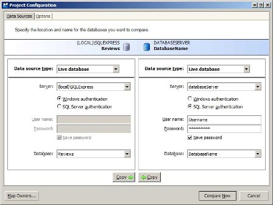
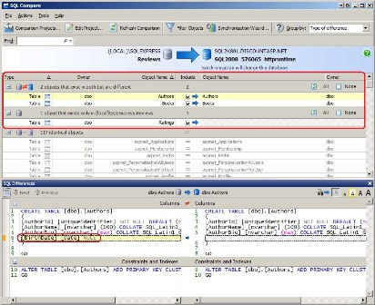
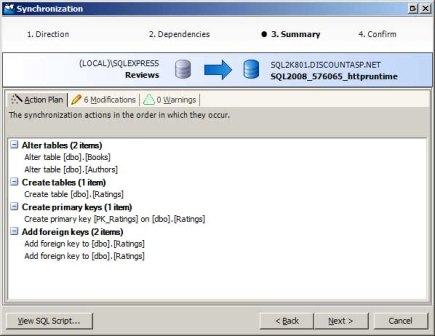

Strategies for Database Development and Deployment (C#)
====================
by [Scott Mitchell](https://twitter.com/ScottOnWriting)

[Download PDF](http://download.microsoft.com/download/C/3/9/C391A649-B357-4A7B-BAA4-48C96871FEA6/aspnet_tutorial10_DBDevel_cs.pdf)

> When deploying a data-driven application for the first time you can blindly copy the database in the development environment to the production environment. But performing a blind copy in subsequent deployments will overwrite any data entered into the production database. Instead, deploying a database involves applying the changes made to the development database since the last deployment onto the production database. This tutorial examines these challenges and offers various strategies to assist with chronicling and applying the changes made to the database since the last deployment.

## Introduction

As discussed in previous tutorials, deploying an ASP.NET application entails copying the pertinent content from the development environment to the production environment. Deployment is not a one-time event, but rather something that happens every time a new version of the software is released or when bugs or security concerns have been identified and addressed. When copying ASP.NET pages, images, JavaScript files, and other such files to the production environment you do not need to concern yourself with how these file have been changed since the last deployment. You can blindly copy the file to production, overwriting the existing content. Unfortunately, this simplicity does not extend to deploying the database.

When deploying a data-driven application for the first time you can blindly copy the database in the development environment to the production environment. But performing a blind copy in subsequent deployments will overwrite any data entered into the production database. Instead, deploying a database involves applying the *changes* made to the development database since the last deployment onto the production database. This tutorial examines these challenges and offers various strategies to assist with chronicling and applying the changes made to the database since the last deployment.

## The Challenges of Deploying a Database

Before a data-driven application has been deployed for the first time, there is only one database, namely the database in the development environment, which is why when deploying a data-driven application for the first time you can blindly copy the database in the development environment to the production environment. But once the application has been deployed there are two copies of the database: one in development and one in production.

Between deployments the development and production databases can become out of sync. While the production database s schema remains unchanged, the development database s schema may change as new features are added. You might add or remove columns, tables, views, or stored procedures. There may also be important data that gets added to the development database. Many data-driven applications include lookup tables populated with hard-coded, application-specific data that are not user-editable. For example, an auction website might have a drop-down list with choices that describe the condition of the item being auctioned: New, Like New, Good, and Fair. Rather than hard-coding these options directly in the drop-down list it is usually better to place them in a database table. If, during development, a new condition named Poor is added to the table then when deploying the application this same record needs to be added to the lookup table in the production database.

Ideally, deploying the database would involve copying the database from development to production. But keep in mind that after you have deployed the application and resumed development, the production database is being populated with real data from real users. Therefore, if you were to simply copy the database from development to production at the next deployment you would overwrite the production database and lose its existing data. The net result is that deploying the database boils down to applying the changes made to the development database since the last deployment.

Because deploying a database involves applying the changes in the schema and, possibly, the data since the last deployment, a history of changes must be maintained (or determined at deploy-time) so that those changes can be applied on production. There are a variety of techniques for managing and applying changes to the data model.

### Defining the Baseline

To maintain the changes to your application s database you need to have some starting state, a baseline to which the changes are applied to. At one extreme the starting state could be an empty database with no tables, views, or stored procedures. Such a baseline results in a large change log because it must include the creation of all of the database s tables, views, and stored procedures along with any changes made after the initial deployment. At the other end of the spectrum you could set the baseline as the version of the database that is initially deployed to the production environment. This choice results in a much smaller change log because it only includes the changes made to the database following the first deployment. This is the approach I prefer. And of course you can choose a more middle of the road approach, defining the baseline as some point between the initial creation of the database and when the database is first deployed.

Once you have chosen a baseline consider generating a SQL script that can be executed to recreate the baseline version. Such a script makes it possible to quickly recreate the baseline version of the database. This functionality is especially useful in larger projects, where there may be multiple developers working on the project or additional environments, such as testing or staging, that each need their own copy of the database.

There are a variety of tools at your disposal to generate a SQL script of the baseline version. From SQL Server Management Studio (SSMS) you can right-click on the database, go to the Tasks submenu, and choose the Generate Scripts option. This launches the Script Wizard, which you can instruct to generate a file that contains the SQL commands to create your database s objects. Another option is the Database Publishing Wizard, which can generate the SQL commands to not only create the database schema, but also the data in the database tables. The Database Publishing Wizard was examined in detail back in the *Deploying a Database* tutorial. Regardless of what tool you use, in the end you should have a script file that you can use to recreate the baseline version of your database, should the need arise.

## Documenting the Database Changes in Prose

The simplest way to maintain a log of changes to the data model during the development phase is to record the changes in prose. For example, if during development of an already-deployed application you add a new column to the `Employees` table, remove a column from the `Orders` table, and add a new table (`ProductCategories`), you would maintain a text file or Microsoft Word document with the following history:

| **Change Date** | **Change Details** |
| --- | --- |
| 2009-02-03: | Added column `DepartmentID` (`int`, NOT NULL) to the `Employees` table. Added a foreign key constraint from `Departments.DepartmentID` to `Employees.DepartmentID`. |
| 2009-02-05: | Removed column `TotalWeight` from the `Orders` table. Data already captured in associated `OrderDetails` records. |
| 2009-02-12: | Created the `ProductCategories` table. There are three columns: `ProductCategoryID` (`int`, `IDENTITY`, `NOT NULL`), `CategoryName` (`nvarchar(50)`, `NOT NULL`), and `Active` (`bit`, `NOT NULL`). Added a primary key constraint to `ProductCategoryID`, and a default value of 1 to `Active`. |

There are a number of drawbacks to this approach. For starters, there is no hope for automation. Anytime these changes need to be applied to a database - such as when the application is deployed - a developer must manually implement each change, one at a time. Moreover, if you need to reconstruct a particular version of the database from the baseline using the change log, doing so will take more and more time as the size of the log grows. Another drawback to this method is that the clarity and level of detail of each change log entry is left to the person recording the change. In a team with multiple developers some may make more detailed, more readable, or more precise entries than others. Also, typos and other human-related data entry errors are possible.

The primary benefit of documenting the database changes in prose is simplicity. You don t need familiarity with the SQL syntax for creating and altering database objects. Instead, you can record the changes in prose and implement them through SQL Server Management Studio s graphical user interface.

Maintaining your change log in prose is, admittedly, not very sophisticated and won t work well with certain projects, such as ones that are large in scope, have frequent changes to the data model, or involve multiple developers. But I have seen this approach work quite well in small, one-man projects that have only occasional changes to the data model and where the solo developer does not have a strong background in the SQL syntax for creating and altering database objects.

> [!NOTE]
> While the information in the change log is, technically, only needed until deploy-time, I recommend keeping a history of changes. But rather than maintaining a single, ever growing change log file, consider having a different change log file for each database version. Typically you will want to version the database each time it is deployed. By maintaining a log of change logs you can, starting from the baseline, recreate any database version by executing the change log scripts starting from version 1 and continuing until you reach the version you need to recreate.

## Recording the SQL Change Statements

The primary drawback of maintaining the change log in prose is the lack of automation. Ideally, implementing the database changes to the production database at deploy-time would be as easy as clicking a button to execute a script rather than having to manually perform a list of instructions. Such automation is possible by maintaining a change log that contains those SQL commands used to alter the data model.

The SQL syntax includes a number of statements for creating and modifying various database objects. For example, the [*CREATE TABLE statement*](https://msdn.microsoft.com/en-us/library/ms174979.aspx), when executed, creates a new table with the specified columns and constraints. The [*ALTER TABLE statement*](https://msdn.microsoft.com/en-us/library/ms190273.aspx) modifies an existing table, adding, removing, or modifying its columns or constraints. There are also statements to create, modify, and drop indexes, views, user-defined functions, stored procedures, triggers, and other database objects.

Returning to our earlier example, image that during development of an already-deployed application you add a new column to the `Employees` table, remove a column from the `Orders` table, and add a new table (`ProductCategories`). Such actions would result in a change log file with the following SQL commands:

[!code-sql[Main](strategies-for-database-development-and-deployment-cs/samples/sample1.sql)]

Pushing these changes to the production database at deploy-time is a one-click operation: open SQL Server Management Studio, connect to your production database, open a New Query window, paste the contents of the change log, and click Execute to run the script.

## Using a Comparison Tool to Synchronize the Data Models

Documenting database changes in prose is easy, but implementing the changes requires a developer to make each change on the production database one at a time; documenting the change SQL commands makes implementing those changes on the production database as easy and quick as clicking a button, but requires learning and mastering the SQL statements and syntax for creating and altering database objects. Database comparison tools take the best from both approaches and discard the worst.

A database comparison tool compares the schema or data of two databases and displays a summary report showing you how the databases differ. Then, with the click of a button, you can generate the SQL commands for synchronizing one or more database objects. In a nutshell, you can use a database comparison tool to compare the development and production databases at deploy-time, generating a file that contains the SQL commands that, when executed, will apply the changes to the production database s schema so that it mirrors the development database s schema.

There are a variety of third-party database comparison tools offered by many different vendors. One such example is [*SQL Compare*](http://www.red-gate.com/products/SQL_Compare/), by [*Red Gate Software*](http://www.red-gate.com/). Let s walk through the process of using SQL Compare to compare and synchronize the development and production databases schemas.

> [!NOTE]
> At the time of this writing the current version of SQL Compare was version 7.1, with the Standard Edition costing $395. You can follow along by downloading a free 14-day trial.

When SQL Compare starts the Comparison Projects dialog box opens, showing the saved SQL Compare projects. Create a new project. This launches the Project Configuration wizard, which prompts for information about the databases to compare (see Figure 1). Enter the information for the development and production environment databases.

**Figure 1**: Compare the Development and Production Databases ([Click to view full-size image](strategies-for-database-development-and-deployment-cs/_static/image3.jpg))

> [!NOTE]
> If your development environment database is a SQL Express Edition database file in the `App_Data` folder of your website you will need to register the database in the SQL Server Express database server in order to select it from the dialog box shown in Figure 1. The easiest way to accomplish this is to open SQL Server Management Studio (SSMS), connect to the SQL Server Express database server, and attach the database. If you do not have SSMS installed on your computer you can download and install the free [*SQL Server 2008 Management Studio Basic version*](https://www.microsoft.com/downloads/details.aspx?FamilyId=7522A683-4CB2-454E-B908-E805E9BD4E28&amp;displaylang=en).

In addition to selecting the databases to compare, you can also specify a variety of comparison settings from the Options tab. One option you may want to turn on is the "Ignore constraint and index names." Recall that in the preceding tutorial we added the application services database objects to the development and production databases. If you used the `aspnet_regsql.exe` tool to create these objects on the production database then you will find that the primary key and unique constraint names differ between the development and production databases. Consequently, SQL Compare will flag all of the application services tables as differing. You can either leave the "Ignore constraint and index names" unchecked and synchronize the constraint names, or instruct SQL Compare to ignore these differences.

After selecting the databases to compare (and reviewing the comparison options), click the Compare Now button to begin the comparison. Over the next several seconds, SQL Compare examines the schemas of the two databases and generates a report of how they differ. I ve purposefully made some modifications to the development database to show how such discrepancies are noted in the SQL Compare interface. As Figure 2 shows, I ve added a `BirthDate` column to the `Authors` table, removed the `ISBN` column from the `Books` table, and added a new table, `Ratings`, which is meant to let users visiting the site rate the reviewed books.

> [!NOTE]
> The data model changes made in this tutorial were done to illustrate using a database comparison tool. You will not find these changes in the database in future tutorials.

**Figure 2**: SQL Compare Lists the Differences Between the Development and Production Databases ([Click to view full-size image](strategies-for-database-development-and-deployment-cs/_static/image6.jpg))

SQL Compare breaks down the database objects into groups, quickly showing you what objects exist in both databases but are different, which objects exist in one database but not the other, and which objects are identical. As you can see, there are two objects that exist in both databases but are different: the `Authors` table, which had a column added, and the `Books` table, which had one removed. There is one object that exists only in the development database, namely the newly created `Ratings` table. And there are 117 objects that are identical in both databases.

Selecting a database object displays the SQL Differences window, which shows how these objects differ. The SQL Differences window, displayed at the bottom in Figure 2, highlights that the `Authors` table in the development database has the `BirthDate` column, which is not found in the `Authors` table on the production database.

After reviewing the differences and selecting which objects you want to synchronize, the next step is to generate the SQL commands needed to update the production database s schema to match the development database. This is accomplished through the Synchronization Wizard. The Synchronization Wizard confirms what objects to synchronize and summarizes the action plan (see Figure 3). You can synchronize the databases immediately or generate a script with the SQL commands that can be run at your leisure.

**Figure 3**: Use the Synchronization Wizard to Synchronize Your Databases Schemas ([Click to view full-size image](strategies-for-database-development-and-deployment-cs/_static/image9.jpg))

Database comparison tools like Red Gate Software s SQL Compare make applying the changes to the development database schema to the production database as easy as point and click.

> [!NOTE]
> SQL Compare compares and synchronizes two databases *schemas*. Unfortunately, it does not compare and synchronize the data within two databases tables. Red Gate Software does offer a product named [*SQL Data Compare*](http://www.red-gate.com/products/SQL_Data_Compare/) that compares and synchronizes the data between two databases, but it is a separate product from SQL Compare and costs another $395.

## Taking the Application Offline During Deployment

As we ve seen throughout these tutorials, deployment is a process that involves multiple steps: copying the ASP.NET pages, master pages, CSS files, JavaScript files, images, and other necessary content from the development environment to the production environment; copying up the production environment-specific configuration information, if needed; and applying the changes to the data model since the last deployment. Depending on the number of files and the complexity of your database changes, these steps can take anywhere from a few seconds to several minutes to complete. During this window the web application is in flux and users visiting the site may experience errors or unexpected behavior.

When deploying a website it is best to take the web application "offline" until deployment has completed. Taking the application offline (and bringing it back up once the deployment process has finished) is as easy as uploading a file and then deleting it. Starting with ASP.NET 2.0, the mere presence of a file named `app_offline.htm` in the application s root directory takes the entire website "offline." Any request to an ASP.NET page on that site is automatically responded with the contents of the `app_offline.htm` file. Once that file is removed, the application comes back online.

Taking an application offline during deployment, then, is as simple as uploading an `app_offline.htm` file to the production environment s root directory prior to beginning the deployment process and then deleting it (or renaming it to something else) once deployment is complete. For more information on this technique refer to John Peterson s article, Taking an [*ASP.NET Application Offline*](http://www.15seconds.com/issue/061207.htm).

## Summary

The main challenge in deploying a data-driven application centers around deploying the database. Because there are two versions of the database - one in the development environment and one in the production environment - these two databases schemas can become out of sync as new features are added in development. What s more, because the production database as being populated with real data from real users, you cannot overwrite the production database with the modified development database like you can when deploying the files that make up the application (the ASP.NET pages, image files, and so forth). Instead, deploying a database entails implementing the precise set of changes made to the development database on the production database since the last deployment.

This tutorial looked at three techniques for maintaining and applying a log of database changes. The simplest approach is to record the changes in prose. While this tactic makes implementing these changes on the production database a manual process, it does not require knowledge of the SQL commands for creating and altering database objects. A more sophisticated approach, and one that is much more palatable in larger projects or projects with multiple developers, is to record the changes as a series of SQL commands. This greatly hastens rolling out these changes to the target database. The best of both approaches can be achieved by using a database comparison tool, such as Red Gate Software s SQL Compare.

This tutorial concludes our focus on deploying a data-driven application. The next set of tutorials looks at how to respond to errors in the production environment. We'll look at how to display a friendly error page rather instead of the Yellow Screen of Death. And we'll see how to log the error s details and how to alert you when such errors occur.

Happy Programming!

>[!div class="step-by-step"]
[Previous](configuring-a-website-that-uses-application-services-cs.md)
[Next](displaying-a-custom-error-page-cs.md)