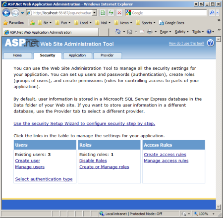
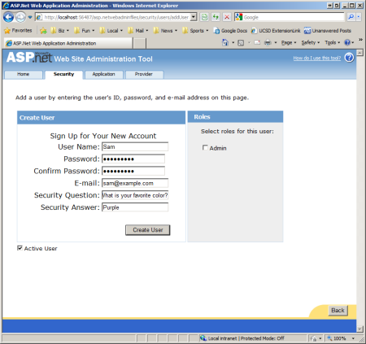
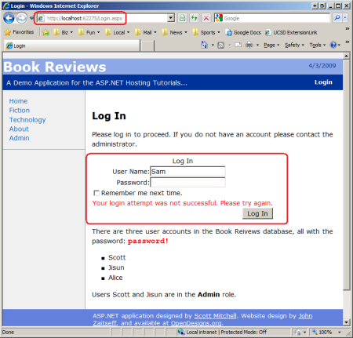
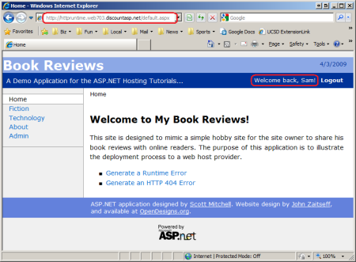
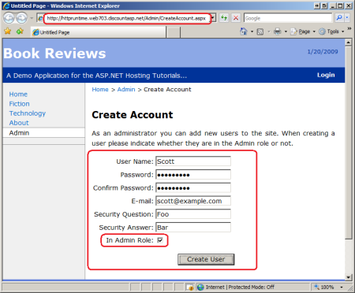

Users and Roles On The Production Website (C#)
====================
by [Scott Mitchell](https://twitter.com/ScottOnWriting)

[Download PDF](http://download.microsoft.com/download/5/C/5/5C57DB8C-5DEA-4B3A-92CA-4405544D313B/aspnet_tutorial16_CustomAWAT_cs.pdf)

> The ASP.NET Website Administration Tool (WSAT) provides a web-based user interface for configuring Membership and Roles settings and for creating, editing, and deleting users and roles. Unfortunately, the WSAT only works when visited from localhost, meaning that you cannot reach the production website's Administration Tool through your browser. The good news is that there are workarounds that make it possible to manage users and roles on production. This tutorial looks at these workarounds and others.

## Introduction

ASP.NET 2.0 introduced a number of *application services*, which are a suite of building block services that you can add to your web application. We added the Membership and Roles services to the Book Reviews website back in the [*Configuring a Website That Uses Application Services* tutorial](configuring-a-website-that-uses-application-services-cs.md). The Membership service facilitates creating and managing user accounts; the Roles service offers an API for categorizing users into groups. The Book Reviews site has three user accounts - Scott, Jisun, and Alice - and a single role, Admin, with Scott and Jisun in the Admin role.

ASP.NET's application services are not tied to a specific implementation. Instead, you instruct the application services to use a particular *provider*, and that provider implements the service using a particular technology. We configured the Book Reviews web application to use the `SqlMembershipProvider` and `SqlRoleProvider` providers for the Membership and Roles services. These two providers store user account and role information in a SQL Server database and are the most commonly used providers for Internet-based web applications hosted at a web hosting company.

A common challenge for developers using the Membership and Roles services is managing the users and roles on the production environment. How do you delete a user account from the production website, add a new role, or add an existing user to an existing role? This tutorial explores different techniques for managing users and roles on the production website.

## Using the ASP.NET Web Site Administration Tool

ASP.NET includes a [Web Site Administration Tool](https://msdn.microsoft.com/en-us/library/yy40ytx0.aspx) (WSAT) that makes it easy to create and manage user accounts and roles and to specify user- and role-based authorization rules. To use the WSAT, click the ASP.NET Configuration icon in the Solution Explorer, or go to the Website or Project menu and choose the ASP.NET Configuration option. Either approach launches a web browser and points it to the WSAT at an address like: `http://localhost:portNumber/asp.netwebadminfiles/default.aspx?applicationPhysicalPath=pathToApplication`

The WSAT is divided into three sections:

- **Security** - manage users, roles, and authorization rules.
- **ApplicationConfiguration** - manage the &lt;appSettings&gt; and SMTP settings from here. You can also take the application offline and manage debugging and tracing settings from here, as well as specify the default custom error page.
- **ProviderConfiguration** - configure the providers used by the application services.

The Security section (shown in **Figure 1**) includes links for creating new users, managing users, creating and managing roles, and creating and managing access rules. From here you can add a new role to the system, delete an existing user, or add or remove roles from a particular user account.

**Figure 1**: The WSAT Security Section Includes Options for Managing Users and Roles  
([Click to view full-size image](users-and-roles-on-the-production-website-cs/_static/image3.png))

Unfortunately, the WSAT is only accessible locally. You cannot visit the WSAT on your remote production website; if you visit `www.yoursite.com/asp.netwebadminfiles/default.aspx` you get a 404 Not Found response. The code that powers the WSAT uses the `Membership` and `Roles` classes in the .NET Framework to create, edit, and delete users and roles. These classes consult the web application's configuration information to determine what provider to use; back in the [*Configuring a Website That Uses Application Services* tutorial](configuring-a-website-that-uses-application-services-cs.md) we setup the Book Reviews website to use the `SqlMembershipProvider` and `SqlRoleProvider` providers. This entailed adding `<membership>` and `<roleManager>` sections to `Web.config`.

[!code-xml[Main](users-and-roles-on-the-production-website-cs/samples/sample1.xml)]

Note that the `<membership>` and `<roleManager>` sections reference the `SqlMembershipProvider` and `SqlRoleProvider` providers in their `type` attribute, respectively. These providers store the user and role information in a specified SQL Server database. The database used by these providers is specified by the `connectionStringName` attribute, `ReviewsConnectionString`, which is defined in the `~/ConfigSections/databaseConnectionStrings.config` file. Recall that the `databaseConnectionStrings.config` file in the development environment contains the connection string to the development database whereas the `databaseConnectionStrings.config` file on production contains the connection string to the production database.

In a nutshell, the WSAT must be accessed locally through the development environment, and it works with the user and role information in the database specified in the `databaseConnectionStrings.config` file. Consequently, if we change the connection string information in the `databaseConnectionStrings.config` file on the development environment we can use the WSAT locally to manage users and roles in the production environment.

To illustrate this functionality, open the `databaseConnectionStrings.config` file in Visual Studio on the development environment and replace the development database connection string with the production database connection string. Then launch the WSAT, go the Security tab, and add a new user named Sam with password "password!" (less the quotation marks). **Figure 2** shows the WSAT screen when creating this account.

**Figure 2**: Create a New User Named Sam In the Production Environment  
([Click to view full-size image](users-and-roles-on-the-production-website-cs/_static/image6.png))

Because we changed the connection string in `databaseConnectionStrings.config` to point to the production database server, Sam was added as a user in the production environment. To verify this, change the connection string in the `databaseConnectionStrings.config` file back to the development database and then visit the `Login.aspx` page in the development environment. Try to sign in as Sam (see **Figure 3**).

**Figure 3**: You Cannot Sign In As Sam in the Development Environment  
([Click to view full-size image](users-and-roles-on-the-production-website-cs/_static/image9.png))

You cannot sign in as Sam in the development environment because the user account information does not exist in the local database. Rather, is was added to the production database. To verify this, view the contents of the `aspnet_Users` table in both the development and production databases. In the development environment there should be only three records for users Scott, Jisun, and Alice. However, the `aspnet_Users` table in the production database has four records: Scott, Jisun, Alice, and Sam. Consequently, Sam can sign in through the website in production, but not through the development environment.

**Figure 4**: Sam Can Sign In On the Production Website  
([Click to view full-size image](users-and-roles-on-the-production-website-cs/_static/image12.png))

> [!NOTE]
> Don't forget to change the connection string in the `databaseConnectionStrings.config` file back to the development database's connect string when you're done working with the WSAT otherwise you will be working with production data when testing the site through the development environment. Also keep in mind that while the technique we just discussed allows us to use the WSAT to remotely manage users and roles, changes to any of the other WSAT configuration options (access rules, SMTP settings, debugging and tracing settings, and so on) modify the `Web.config` file. Consequently, any changes made to the settings apply to the development environment and not to the production environment.

## Creating Custom User and Role Management Web Pages

The WSAT provides an out of the box system for managing users and roles, but can only be launched locally and requires making changes to the connection string information in order to manage the users and roles on production. Most websites that support user accounts also include a number of user and role administration web pages that enable administrators to manage users and roles from pages within the site. Such web-based administration pages make it much easier to manage users and roles and are essential for sites where there may be many administrators or administrators that do not have access to or the technical background to use Visual Studio to launch the WSAT.

ASP.NET includes a number of built-in Login-related Web controls that make implementing many of these administrative web pages as easy as drag and drop. For example, you can create a page for administrators to create a new user account by dragging the CreateUserWizard control onto the page and setting a few properties. In fact, the page for creating users in the WSAT shown in **Figure 2** uses the same CreateUserWizard control that you can add to your pages. Furthermore, the Membership and Roles services' functionalities are available programmatically through the `Membership` and `Roles` classes in the .NET Framework. With these classes you can write code to create, edit, and delete users and roles, as well as to add or remove users to roles, to determine what users are in what roles, and to perform other user- and role-related tasks.

In the [*Configuring a Website That Uses Application Services* tutorial](configuring-a-website-that-uses-application-services-cs.md) I added a page to the `Admin` folder named `CreateAccount.aspx`. This page allows an administrator to add a new user account to the site and to specify whether or not the newly created user is in the Admin role (see **Figure 5**).

**Figure 5**: Administrators Can Create New User Accounts  
([Click to view full-size image](users-and-roles-on-the-production-website-cs/_static/image15.png))

For a more detailed look at building user and role administration pages, along with step-by-step instructions on using the `Membership` and `Roles` classes and the Login-related ASP.NET Web controls, be sure to read my [Website Security Tutorials](../../older-versions-security/introduction/security-basics-and-asp-net-support-cs.md). There you'll find guidance on how to build web pages for creating new accounts, creating and managing roles, assigning users to roles, and other common administrative tasks.

To implement WSAT-like functionality on the production website you can always build your own series of web pages that implement the WSAT's features. To help get started, check out the WSAT source code, which is located in the folder `%WINDIR%\Microsoft.NET\Framework\v2.0.50727\ASP.NETWebAdminFiles`. Another option is to use Dan Clem's WSAT alternative, which he shares in his article, [Rolling Your Own Web Site Administration Tool](http://aspnet.4guysfromrolla.com/articles/052307-1.aspx). Dan walks readers through the process of building a custom WSAT-like tool, includes his application's source code for download (in C#), and gives step-by-step instructions for adding his custom WSAT to a hosted website.

## Summary

The ASP.NET Web Site Administration Tool (WSAT) can be used in tandem with the Membership and Roles application services to manage user and role information for your website. Unfortunately, the WSAT is only accessible locally and cannot be visited from your production website. However, by changing the connection string in the development environment to point to the production database you can use the WSAT to manage the users and roles on the production website.

While the WSAT approach affords a quick and easy way to manage users and roles, it necessitates launching the WSAT from Visual Studio as well as temporary changes to the connection string information. The WSAT offers a quick way to manage users and roles on production, but is cumbersome and does not work well for websites with multiple administrators or with administrators who do not have or are not familiar with Visual Studio and the WSAT. For these reasons, most websites that support user accounts include a set of administrative web pages. Such a set of web pages eliminates the need for the WSAT and used by various administrative users from any computer.

Happy Programming!

### Further Reading

For more information on the topics discussed in this tutorial, refer to the following resources:

- [Examining ASP.NET's Membership, Roles, and Profile](http://aspnet.4guysfromrolla.com/articles/120705-1.aspx)
- [Rolling Your Own Web Site Administration Tool](http://aspnet.4guysfromrolla.com/articles/052307-1.aspx)
- [Web Site Administration Tool Overview](https://msdn.microsoft.com/en-us/library/yy40ytx0.aspx)
- [Website Security Tutorials](../../older-versions-security/introduction/security-basics-and-asp-net-support-cs.md)

>[!div class="step-by-step"]
[Previous](precompiling-your-website-cs.md)
[Next](asp-net-hosting-options-vb.md)