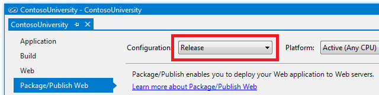

Deploying an ASP.NET Web Application with SQL Server Compact using Visual Studio or Visual Web Developer: Configuring Project Properties - 4 of 12
====================
by [Tom Dykstra](https://github.com/tdykstra)

[Download Starter Project](http://code.msdn.microsoft.com/Deploying-an-ASPNET-Web-4e31366b)

> This series of tutorials shows you how to deploy (publish) an ASP.NET web application project that includes a SQL Server Compact database by using Visual Studio 2012 RC or Visual Studio Express 2012 RC for Web. You can also use Visual Studio 2010 if you install the Web Publish Update. For an introduction to the series, see [the first tutorial in the series](deployment-to-a-hosting-provider-introduction-1-of-12.md).
> 
> For a tutorial that shows deployment features introduced after the RC release of Visual Studio 2012, shows how to deploy SQL Server editions other than SQL Server Compact, and shows how to deploy to Azure App Service Web Apps, see [ASP.NET Web Deployment using Visual Studio](../../deployment/visual-studio-web-deployment/introduction.md).

## Overview

Some deployment options are configured in project properties that are stored in the project file (the *.csproj* or *.vbproj* file). In most cases, the default values of these settings are what you want, but you can use the **Project Properties** UI built into Visual Studio to work with these settings if you have to change them. In this tutorial you review the deployment settings in **Project Properties**. You also create a placeholder file that causes an empty folder to be deployed.

## Configuring Deployment Settings in the Project Properties Window

Most settings that affect what happens during deployment are included in the publish profile, as you'll see in the following tutorials. A few settings that you should be aware of are located in the **Package/Publish** tabs of the **Project Properties** window. These settings are specified for each build configuration — that is, you can have different settings for a Release build than you have for a Debug build.

In **Solution Explorer**, right-click the **ContosoUniversity** project, select **Properties**, and then select the **Package/Publish Web** tab.

When the window is displayed, it defaults to showing settings for whichever build configuration is currently active for the solution. If the **Configuration** box does not indicate **Active (Release)**, select **Release** in order to display settings for the Release build configuration. You'll deploy Release builds to both your test and production environments.

With **Active (Release)** or **Release** selected, you see the values that are effective when you deploy using the Release build configuration:

- In the **Items to deploy** box, **Only files needed to run the application** is selected. Other options are **All files in this project** or **All files in this project folder**. By leaving the default selection unchanged you avoid deploying source code files, for example. This setting is the reason why the folders that contain the SQL Server Compact binary files had to be included in the project. For more information about this setting, see **Why don't all of the files in my project folder get deployed?** in [ASP.NET Web Application Project Deployment FAQ](https://msdn.microsoft.com/en-us/library/ee942158.aspx).
- **Exclude generated debug symbols** is selected. You won't be debugging when you use this build configuration.
- **Exclude files from the App\_Data folder** is not selected. Your SQL Server Compact file for the membership database is in that folder and you have to deploy it. When you deploy updates that do not include database changes, you'll select this checkbox.
- **Precompile this application before publishing** is not selected. In most scenarios, there's no need to precompile web application projects. For more information about this option, see [Package/Publish Web Tab, Project Properties](https://msdn.microsoft.com/en-us/library/dd410108(v=vs.110).aspx) and [Advanced Precompile Settings Dialog](https://msdn.microsoft.com/en-us/library/hh475319(v=vs.110).aspx).
- **Include all databases configured in Package/Publish SQL tab** is selected, but this option has no effect now because you aren't configuring the **Package/Publish SQL** tab. That tab is for a legacy database deployment method that used to be the only option for deploying SQL Server databases. You'll use the **Package/Publish SQL** tab in the [Migrating to SQL Server](deployment-to-a-hosting-provider-migrating-to-sql-server-10-of-12.md) tutorial.
- The **Web Deployment Package Settings** section does not apply because you're using one-click publish in these tutorials.

Change the **Configuration** drop-down box to Debug to see the default settings for Debug builds. The values are the same, except **Exclude generated debug symbols** is cleared so that you can debug when you deploy a Debug build.

## Making Sure that the Elmah Folder gets Deployed

As you saw in the previous tutorial, the [Elmah NuGet package](http://www.hanselman.com/blog/NuGetPackageOfTheWeek7ELMAHErrorLoggingModulesAndHandlersWithSQLServerCompact.aspx) provides functionality for error logging and reporting. In the Contoso University application Elmah has been configured to store error details in a folder named *Elmah*:

Excluding specific files or folders from deployment is a common requirement; another example would be a folder that users can upload files to. You don't want log files or uploaded files that were created in your development environment to be deployed to production. And if you are deploying an update to production you don't want the deployment process to delete files that exist in production. (Depending on how you set a deployment option, if a file exists in the destination site but not the source site when you deploy, Web Deploy deletes it from the destination.)

As you saw earlier in this tutorial, the **Items to deploy** option in the **Package/Publish Web** tab is set to **Only Files Needed to run this application**. As a result, log files that are created by Elmah in development will not be deployed, which is what you want to happen. (To be deployed, they would have to be included in the project and their **Build Action** property would have to be set to **Content**. For more information, see **Why don't all of the files in my project folder get deployed?** in [ASP.NET Web Application Project Deployment FAQ](https://msdn.microsoft.com/en-us/library/ee942158.aspx)). However, Web Deploy will not create a folder in the destination site unless there's at least one file to copy to it. Therefore, you'll add a *.txt* file to the folder to act as a placeholder so that the folder will be copied.

In **Solution Explorer**, right-click the *Elmah* folder, select **Add New Item**, and create a file named *Placeholder.txt*. Put the following text in it: "This is a placeholder file to ensure that the folder gets deployed." and save the file. That's all you have to do in order to make sure that Visual Studio deploys this file and the folder it's in, because the **Build Action** property of *.txt* files is set to **Content** by default.

You have now completed all of the deployment set-up tasks. In the next tutorial, you'll deploy the Contoso University site to the test environment and test it there.

>[!div class="step-by-step"]
[Previous](deployment-to-a-hosting-provider-web-config-file-transformations-3-of-12.md)
[Next](deployment-to-a-hosting-provider-deploying-to-iis-as-a-test-environment-5-of-12.md)