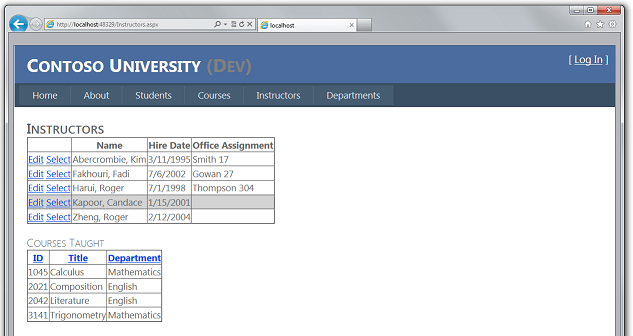
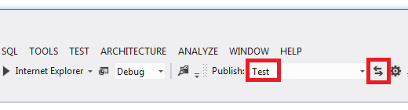
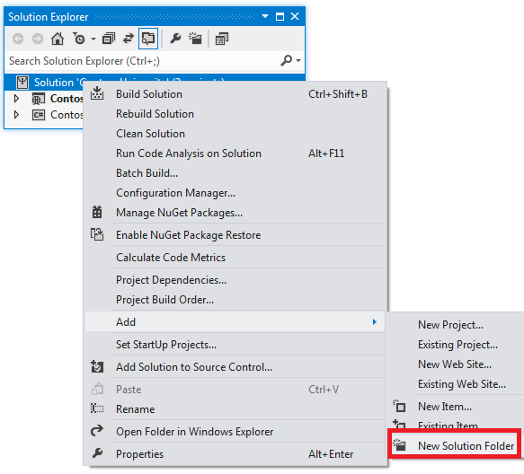
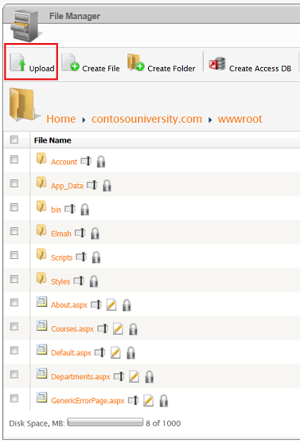
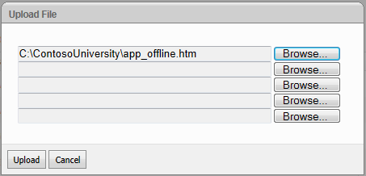
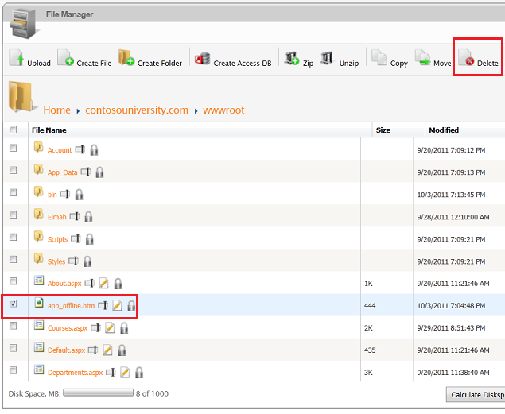
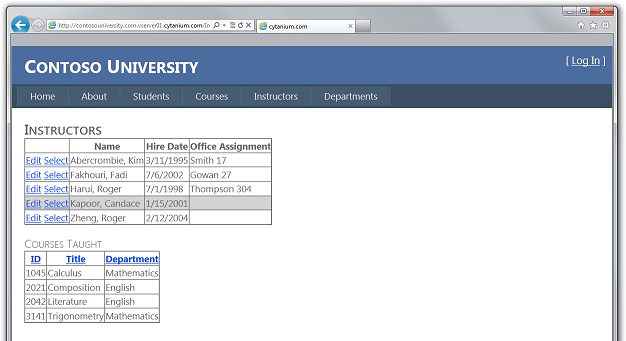

Deploying an ASP.NET Web Application with SQL Server Compact using Visual Studio or Visual Web Developer: Deploying a Code-Only Update - 8 of 12
====================
by [Tom Dykstra](https://github.com/tdykstra)

[Download Starter Project](http://code.msdn.microsoft.com/Deploying-an-ASPNET-Web-4e31366b)

> This series of tutorials shows you how to deploy (publish) an ASP.NET web application project that includes a SQL Server Compact database by using Visual Studio 2012 RC or Visual Studio Express 2012 RC for Web. You can also use Visual Studio 2010 if you install the Web Publish Update. For an introduction to the series, see [the first tutorial in the series](deployment-to-a-hosting-provider-introduction-1-of-12.md).
> 
> For a tutorial that shows deployment features introduced after the RC release of Visual Studio 2012, shows how to deploy SQL Server editions other than SQL Server Compact, and shows how to deploy to Azure App Service Web Apps, see [ASP.NET Web Deployment using Visual Studio](../../deployment/visual-studio-web-deployment/introduction.md).

## Overview

After the initial deployment, your work of maintaining and developing your web site continues, and before long you will want to deploy an update. This tutorial takes you through the process of deploying an update to your application code. This update does not involve a database change; you'll see what's different about deploying a database change in the next tutorial.

Reminder: If you get an error message or something doesn't work as you go through the tutorial, be sure to check the [troubleshooting page](deployment-to-a-hosting-provider-creating-and-installing-deployment-packages-12-of-12.md).

## Making a Code Change

As a simple example of an update to your application, you'll add to the **Instructors** page a list of courses taught by the selected instructor.

If you run the **Instructors** page, you'll notice that there are **Select** links in the grid, but they don't do anything other than make the row background turn gray.

Now you'll add code that runs when the **Select** link is clicked and displays a list of courses taught by the selected instructor .

In *Instructors.aspx*, add the following markup immediately after the **ErrorMessageLabel** `Label` control:

[!code-aspx[Main](deployment-to-a-hosting-provider-deploying-a-code-only-update-8-of-12/samples/sample1.aspx)]

Run the page and select an instructor. You see a list of courses taught by that instructor.

## Deploying the Code Update to the Test Environment

Deploying to the test environment is a simple matter of running one-click publish again. To make this process quicker, you can use the **Web One Click Publish** toolbar.

In the **View** menu, choose **Toolbars** and then select **Web One Click Publish**.

In **Solution Explorer**, select the ContosoUniversity project.

the **Web One Click Publish** toolbar, choose the **Test** publish profile and then click **Publish Web** (the icon with arrows pointing left and right).

Visual Studio deploys the updated application, and the browser automatically opens to the home page. Run the Instructors page and select an instructor to verify that the update was successfully deployed.

You would normally also do regression testing (that is, test the rest of the site to make sure that the new change didn't break any existing functionality). But for this tutorial you'll skip that step and proceed to deploy the update to production.

## Preventing Redeployment of the Initial Database State to Production

In a real application, users interact with your production site after your initial deployment, and the databases are populated with live data. Therefore, you don't want to redeploy the membership database in its initial state, which would wipe out all of the live data. Since SQL Server Compact databases are files in the *App\_Data* folder, you have to prevent this by changing deployment settings so that files in the *App\_Data* folder aren't deployed.

Open the **Project Properties** window for the ContosoUniversity project, and select the **Package/Publish Web** tab. Make sure that the **Configuration** drop-down box has either **Active (Release)** or **Release** selected, select **Exclude files from the App\_Data folder**.

In case you decide to deploy a debug build in the future, it's a good idea to make the same change for the Debug build configuration: change **Configuration** to **Debug** and then select **Exclude files from the App\_Data folder**.

Save and close the **Package/Publish Web** tab.

> [!NOTE] 
> 
> [!IMPORTANT]
> Make sure that you don't have **Remove additional files at destination** selected in your publish profiles. If you select that option, the deployment process will delete the databases that you have in App\_Data in the deployed site, and it will delete the App\_Data folder itself.

## Preventing User Access to the Production Site During Update

The change you're deploying now is a simple change to a single page. But sometimes you deploy larger changes, and in that case the site can behave strangely if a user requests a page before deployment is finished. To prevent this, you can use an *app\_offline.htm* file. When you put a file named *app\_offline.htm* in the root folder of your application, IIS automatically displays that file instead of running your application. So to prevent access during deployment, you put *app\_offline.htm* in the root folder, run the deployment process, and then remove *app\_offline.htm*.

In **Solution Explorer**, right-click the solution (not one of the projects) and select **New Solution Folder**.

Name the folder *SolutionFiles*.

In the new folder create an HTML page named *app\_offline.htm*. Replace the existing contents with the following markup:

[!code-html[Main](deployment-to-a-hosting-provider-deploying-a-code-only-update-8-of-12/samples/sample2.html)]

You can copy the *app\_offline.htm* file to the site by using an FTP connection or the **File Manager** utility in the hosting provider's control panel. For this tutorial, you'll use the **File Manager**.

Open the control panel and select **File Manager** as you did in the [Deploying to the Production Environment](deployment-to-a-hosting-provider-deploying-to-the-production-environment-7-of-12.md) tutorial. Select **contosouniversity.com** and then **wwwroot** to get to your application's root folder, and then click **Upload**.

In the **Upload File** dialog box, select the *app\_offline.htm* file and then click **Upload**.

Browse to your site's URL. You see that the *app\_offline.htm* page is now displayed instead of your home page.

You are now ready to deploy to production.

## Deploying the Code Update to the Production Environment

In the **Web One Click Publish** toolbar, choose the **Production** publish profile and then click **Publish Web**.

Visual Studio deploys the updated application and opens the browser to the site's home page. The *app\_offline.htm* file is displayed. Before you can test to verify successful deployment, you must remove the *app\_offline.htm* file.

Return to the **File Manager** application in the control panel. Select **contosouniversity.com** and **wwwroot**, select **app\_offline.htm**, and then click **Delete**.

In the browser, open the Instructors page in the public site, and select an instructor to verify that the update was successfully deployed.

You've now deployed an application update that did not involve a database change. The next tutorial shows you how to deploy a database change.

>[!div class="step-by-step"]
[Previous](deployment-to-a-hosting-provider-deploying-to-the-production-environment-7-of-12.md)
[Next](deployment-to-a-hosting-provider-deploying-a-database-update-9-of-12.md)