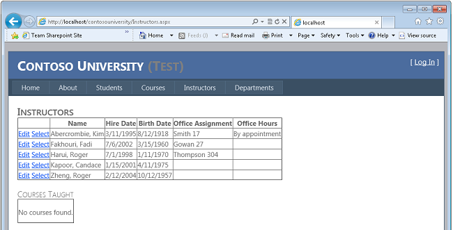
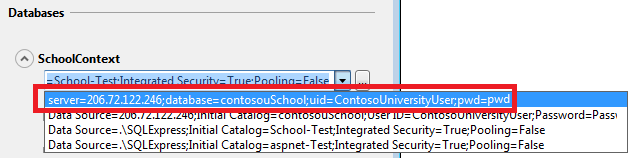
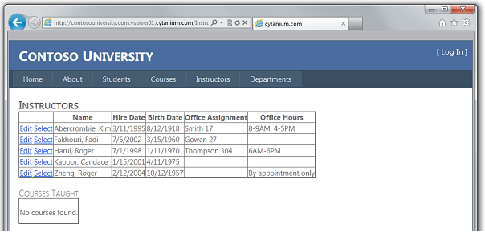

Deploying an ASP.NET Web Application with SQL Server Compact using Visual Studio or Visual Web Developer: Deploying a SQL Server Database Update - 11 of 12
====================
by [Tom Dykstra](https://github.com/tdykstra)

[Download Starter Project](http://code.msdn.microsoft.com/Deploying-an-ASPNET-Web-4e31366b)

> This series of tutorials shows you how to deploy (publish) an ASP.NET web application project that includes a SQL Server Compact database by using Visual Studio 2012 RC or Visual Studio Express 2012 RC for Web. You can also use Visual Studio 2010 if you install the Web Publish Update. For an introduction to the series, see [the first tutorial in the series](deployment-to-a-hosting-provider-introduction-1-of-12.md).
> 
> For a tutorial that shows deployment features introduced after the RC release of Visual Studio 2012, shows how to deploy SQL Server editions other than SQL Server Compact, and shows how to deploy to Windows Azure Web Sites, see [ASP.NET Web Deployment using Visual Studio](../../deployment/visual-studio-web-deployment/introduction.md).

## Overview

This tutorial shows you how to deploy a database update to a full SQL Server database. Because Code First Migrations does all the work of updating the database, the process is almost identical to what you did for SQL Server Compact in the [Deploying a Database Update](deployment-to-a-hosting-provider-deploying-a-database-update-9-of-12.md) tutorial.

Reminder: If you get an error message or something doesn't work as you go through the tutorial, be sure to check the [troubleshooting page](deployment-to-a-hosting-provider-creating-and-installing-deployment-packages-12-of-12.md).

## Adding a New Column to a Table

In this section of the tutorial you'll make a database change and corresponding code changes, then test them in Visual Studio in preparation for deploying them to the test and production environments. The change involves adding an `OfficeHours` column to the `Instructor` entity and displaying the new information in the **Instructors** web page.

In the ContosoUniversity.DAL project, open *Instructor.cs* and add the following property between the `HireDate` and `Courses` properties:

[!code-csharp[Main](deployment-to-a-hosting-provider-deploying-a-sql-server-database-update-11-of-12/samples/sample1.cs)]

Update the initializer class so that it seeds the new column with test data. Open *Migrations\Configuration.cs* and replace the code block that begins `var instructors = new List<Instructor>` with the following code block which includes the new column:

[!code-csharp[Main](deployment-to-a-hosting-provider-deploying-a-sql-server-database-update-11-of-12/samples/sample2.cs)]

In the ContosoUniversity project, open *Instructors.aspx* and add a new template field for office hours just before the closing `</Columns>` tag in the first `GridView` control:

[!code-aspx[Main](deployment-to-a-hosting-provider-deploying-a-sql-server-database-update-11-of-12/samples/sample3.aspx)]

Build the solution.

Open the **Package Manager Console** window, and select ContosoUniversity.DAL as the **Default project**.

Enter the following commands:

[!code-powershell[Main](deployment-to-a-hosting-provider-deploying-a-sql-server-database-update-11-of-12/samples/sample4.ps1)]

Run the application and select the **Instructors** page. The page takes a little longer than usual to load, because the Entity Framework re-creates the database and seeds it with test data.

## Deploying the Database Update to the Test Environment

When you use Code First Migrations, the method for deploying a database change to SQL Server is the same as for SQL Server Compact. However, you have to change the Test publish profile because it is still set up to migrate from SQL Server Compact to SQL Server.

The first step is to remove the connection string transformations that you created in the previous tutorial. These are no longer needed because you'll specify connection string transformations in the publish profile, as you did before you configured the **Package/Publish SQL** tab for migration to SQL Server.

Open the *Web.Test.config* file and remove the `connectionStrings` element. The only remaining transformation in the *Web.Test.config* file is for the `Environment` value in the `appSettings` element.

Now you can update the publish profile and publish to the test environment.

Open the **Publish Web** wizard, and then switch to the **Profile** tab.

Select the **Test** publish profile.

Select the **Settings** tab.

Click **enable the new database publishing improvements**.

In the connection string box for **SchoolContext**, enter the same value that you used in the *Web.Test.config* transformation file in the previous tutorial:

[!code-console[Main](deployment-to-a-hosting-provider-deploying-a-sql-server-database-update-11-of-12/samples/sample5.cmd)]

Select **Execute Code First Migrations (runs on application start)**. (In your version of Visual Studio, the check box might be labeled **Apply Code First Migrations**.)

In the connection string box for **DefaultConnection**, enter the same value that you used in the *Web.Test.config* transformation file in the previous tutorial:

[!code-console[Main](deployment-to-a-hosting-provider-deploying-a-sql-server-database-update-11-of-12/samples/sample6.cmd)]

Leave **Update database** cleared.

Click **Publish**.

Visual Studio deploys the code changes to the test environment and opens the browser to the Contoso University home page.

Select the Instructors page.

When the application runs this page, it tries to access the database. Code First Migrations checks if the database is current, and finds that the latest migration has not been applied yet. Code First Migrations applies the latest migration, runs the `Seed` method, and then the page runs normally. You see the new Office Hours column with the seeded data.

## Deploying the Database Update to the Production Environment

You have to change the publish profile for the production environment also. In this case you'll remove the existing profile and create a new one by importing an updated .publishsettings file. The updated file will include the connection string for the SQL Server database at Cytanium.

As you saw when you deployed to the test environment, you no longer need connection string transforms in the *Web.Production.config* transformation file. Open that file and remove the `connectionStrings` element. The remaining transformations are for the `Environment` value in the `appSettings` element and the `location` element that restricts access to Elmah error reports.

Before you create a new publish profile for production, download an updated .publishsettings file the same way you did earlier in the [Deploying to the Production Environment](deployment-to-a-hosting-provider-deploying-to-the-production-environment-7-of-12.md) tutorial. (In the Cytanium control panel, click **Web Sites**, and then click the **contosouniversity.com** website. Select the **Web Publishing** tab, and then click **Download Publishing Profile for this web site**.) The reason you are doing this is to pick up the database connection string in the .publishsettings file. The connection string wasn't available the first time you downloaded the file, because you were still using SQL Server Compact and hadn't created the SQL Server database at Cytanium yet.

Now you can update the publish profile and publish to the production environment.

Open the **Publish Web** wizard, and then switch to the **Profile** tab.

Click **Manage Profiles**, and then delete the Production profile.

Close the **Publish Web** wizard to save this change.

Open the **Publish Web** wizard again, and then click **Import**.

On the **Connection** tab, change **Destination URL** to the appropriate value if you are using a temporary URL.

Click **Next**.

On the **Settings** tab, click **enable the new database publishing improvements**.

In the connection string drop-down list for **SchoolContext**, select the Cytanium connection string.

Select **Execute Code First migrations (runs on application start)**.

In the connection string drop-down list for **DefaultConnection**, select the Cytanium connection string.

Select the **Profile** tab, click **Manage Profiles**, and rename the profile from "contosouniversity.com - Web Deploy" to "Production".

Close the publish profile to save the change, then open it again.

Click **Publish**. (For a real production website, you would copy *app\_offline.htm* to production and put it in your project folder before publishing, then remove it when deployment is complete.)

Visual Studio deploys the code changes to the test environment and opens the browser to the Contoso University home page.

Select the Instructors page.

Code First Migrations updates the database the same way it did in the Test environment. You see the new Office Hours column with the seeded data.

You have now successfully deployed an application update that included a database change, using a SQL Server database.

## More Information

This completes this series of tutorials on deploying an ASP.NET web application to a third-party hosting provider. For more information about any of the topics covered in these tutorials, see the [ASP.NET Deployment Content Map](https://msdn.microsoft.com/en-us/library/bb386521(v=vs.110).aspx) on the MSDN web site.

## Acknowledgements

I would like to thank the following people who made significant contributions to the content of this tutorial series:

- [Alberto Poblacion, MVP &amp; MCT, Spain](https://mvp.support.microsoft.com/profile/Alberto)
- Jarod Ferguson, Data Platform Development MVP, United States
- Harsh Mittal, Microsoft
- [Kristina Olson, Microsoft](https://blogs.iis.net/krolson/default.aspx)
- [Mike Pope, Microsoft](http://www.mikepope.com/blog/DisplayBlog.aspx)
- Mohit Srivastava, Microsoft
- [Raffaele Rialdi, Italy](http://www.iamraf.net/)
- [Rick Anderson, Microsoft](https://blogs.msdn.com/b/rickandy/)
- [Sayed Hashimi, Microsoft](http://sedodream.com/default.aspx)(twitter: [@sayedihashimi](http://twitter.com/sayedihashimi))
- [Scott Hanselman](http://www.hanselman.com/blog/) (twitter: [@shanselman](http://twitter.com/shanselman))
- [Scott Hunter, Microsoft](https://blogs.msdn.com/b/scothu/) (twitter: [@coolcsh](http://twitter.com/coolcsh))
- [Srđan Božović, Serbia](http://msforge.net/blogs/zmajcek/)
- [Vishal Joshi, Microsoft](http://vishaljoshi.blogspot.com/) (twitter: [@vishalrjoshi](http://twitter.com/vishalrjoshi))

>[!div class="step-by-step"]
[Previous](deployment-to-a-hosting-provider-migrating-to-sql-server-10-of-12.md)
[Next](deployment-to-a-hosting-provider-creating-and-installing-deployment-packages-12-of-12.md)