Deploying an ASP.NET Web Application with SQL Server Compact using Visual Studio or Visual Web Developer: Deploying SQL Server Compact Databases - 2 of 12
====================
by [Tom Dykstra](https://github.com/tdykstra)

[Download Starter Project](http://code.msdn.microsoft.com/Deploying-an-ASPNET-Web-4e31366b)

> This series of tutorials shows you how to deploy (publish) an ASP.NET web application project that includes a SQL Server Compact database by using Visual Studio 2012 RC or Visual Studio Express 2012 RC for Web. You can also use Visual Studio 2010 if you install the Web Publish Update. For an introduction to the series, see [the first tutorial in the series](deployment-to-a-hosting-provider-introduction-1-of-12.md).
> 
> For a tutorial that shows deployment features introduced after the RC release of Visual Studio 2012, shows how to deploy SQL Server editions other than SQL Server Compact, and shows how to deploy to Azure App Service Web Apps, see [ASP.NET Web Deployment using Visual Studio](../../deployment/visual-studio-web-deployment/introduction.md).

## Overview

This tutorial shows how to set up two SQL Server Compact databases and the database engine for deployment.

For database access, the Contoso University application requires the following software that must be deployed with the application because it is not included in the .NET Framework:

- [SQL Server Compact](https://www.microsoft.com/sqlserver/en/us/editions/compact.aspx) (the database engine).
- [ASP.NET Universal Providers](http://www.hanselman.com/blog/IntroducingSystemWebProvidersASPNETUniversalProvidersForSessionMembershipRolesAndUserProfileOnSQLCompactAndSQLAzure.aspx) (which enable the ASP.NET membership system to use SQL Server Compact)
- [Entity Framework 5.0](https://msdn.microsoft.com/en-us/library/gg696172(d=lightweight,v=vs.103).aspx)(Code First with Migrations).

The database structure and some (not all) of the data in the application's two databases must also be deployed. Typically, as you develop an application, you enter test data into a database that you don't want to deploy to a live site. However, you might also enter some production data that you do want to deploy. In this tutorial you'll configure the Contoso University project so that the required software and the correct data are included when you deploy.

Reminder: If you get an error message or something doesn't work as you go through the tutorial, be sure to check the [troubleshooting page](deployment-to-a-hosting-provider-creating-and-installing-deployment-packages-12-of-12.md).

## SQL Server Compact versus SQL Server Express

The sample application uses SQL Server Compact 4.0. This database engine is a relatively new option for websites; earlier versions of SQL Server Compact do not work in a web hosting environment. SQL Server Compact offers a few benefits compared to the more common scenario of developing with SQL Server Express and deploying to full SQL Server. Depending on the hosting provider you choose, SQL Server Compact might be cheaper to deploy, because some providers charge extra to support a full SQL Server database. There is no extra charge for SQL Server Compact because you can deploy the database engine itself as part of your web application.

However, you should also be aware of its limitations. SQL Server Compact does not support stored procedures, triggers, views, or replication. (For a complete list of SQL Server features that are not supported by SQL Server Compact, see [Differences Between SQL Server Compact and SQL Server](https://msdn.microsoft.com/en-us/library/bb896140.aspx).) Also, some of the tools that you can use to manipulate schemas and data in SQL Server Express and SQL Server databases do not work with SQL Server Compact. For example, you cannot use SQL Server Management Studio or SQL Server Data Tools in Visual Studio with SQL Server Compact databases. You do have other options for working with SQL Server Compact databases:

- You can use Server Explorer in Visual Studio, which offers limited database manipulation functionality for SQL Server Compact.
- You can use the database manipulation feature of [WebMatrix](https://www.microsoft.com/web/webmatrix/), which has more features than Server Explorer.
- You can use relatively full-featured third-party or open source tools, such as the [SQL Server Compact Toolbox](http://sqlcetoolbox.codeplex.com/) and [SQL Compact data and schema script utility](http://exportsqlce.codeplex.com/).
- You can write and run your own DDL (data definition language) scripts to manipulate the database schema.

You can start with SQL Server Compact and then upgrade later as your needs evolve. Later tutorials in this series show you how to migrate from SQL Server Compact to SQL Server Express and to SQL Server. However, if you're creating a new application and expect to need SQL Server in the near future, it's probably best to start with SQL Server or SQL Server Express.

## Configuring the SQL Server Compact Database Engine for Deployment

The software required for data access in the Contoso University application was added by installing the following NuGet packages:

- [SqlServerCompact](http://nuget.org/List/Packages/SqlServerCompact)
- [System.Web.Providers](http://nuget.org/List/Packages/System.Web.Providers) (ASP.NET universal providers)
- [EntityFramework](http://nuget.org/List/Packages/EntityFramework)
- [EntityFramework.SqlServerCompact](http://nuget.org/List/Packages/EntityFramework.sqlservercompact)

The links point to the current versions of these packages, which might be newer than what is installed in the starter project that you downloaded for this tutorial. For deployment to a hosting provider, make sure that you use Entity Framework 5.0 or later. Earlier versions of Code First Migrations require Full Trust, and at many hosting providers your application will run in Medium Trust. For more information about Medium Trust, see the [Deploying to IIS as a Test Environment](deployment-to-a-hosting-provider-deploying-to-iis-as-a-test-environment-5-of-12.md) tutorial.

NuGet package installation generally takes care of everything that you need in order to deploy this software with the application. In some cases, this involves tasks such as changing the Web.config file and adding PowerShell scripts that run whenever you build the solution. **If you want to add support for any of these features (such as SQL Server Compact and Entity Framework) without using NuGet, make sure that you know what NuGet package installation does so that you can do the same work manually.**

There is one exception where NuGet doesn't take care of everything you have to do in order to ensure successful deployment. The SqlServerCompact NuGet package adds a post-build script to your project that copies the native assemblies to *x86* and *amd64* subfolders under the project *bin* folder, but the script does not include those folders in the project. As a result, Web Deploy will not copy them to the destination web site unless you manually include them in the project. (This behavior results from the default deployment configuration; another option, which you won't use in these tutorials, is to change the setting that controls this behavior. The setting that you can change is **Only files needed to run the application** under **Items to deploy** on the **Package/Publish Web** tab of the **Project Properties** window. Changing this setting is not generally recommended because it can result in the deployment of many more files to the production environment than are needed there. For more information about the alternatives, see the [Configuring Project Properties](deployment-to-a-hosting-provider-configuring-project-properties-4-of-12.md) tutorial.)

Build the project, and then in **Solution Explorer** click **Show all Files** if you have not already done so. You might also have to click **Refresh**.

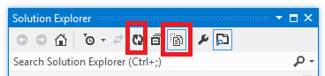

Expand the **bin** folder to see the **amd64** and **x86** folders, and then select those folders, right-click, and select **Include in Project**.

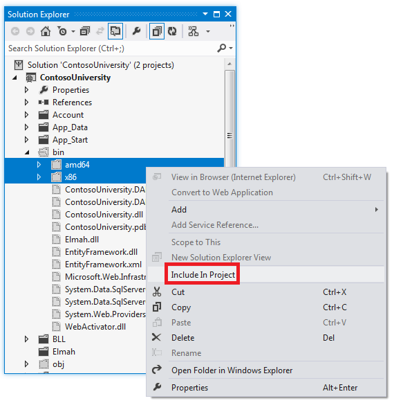

The folder icons change to show that the folder has been included in the project.

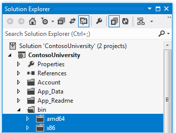

## Configuring Code First Migrations for Application Database Deployment

When you deploy an application database, typically you don't simply deploy your development database with all of the data in it to production, because much of the data in it is probably there only for testing purposes. For example, the student names in a test database are fictional. On the other hand, you often can't deploy just the database structure with no data in it at all. Some of the data in your test database might be real data and must be there when users begin to use the application. For example, your database might have a table that contains valid grade values or real department names.

To simulate this common scenario, you'll configure a Code First Migrations Seed method that inserts into the database only the data that you want to be there in production. This Seed method won't insert test data because it will run in production after Code First creates the database in production.

In earlier versions of Code First before Migrations was released, it was common for Seed methods to insert test data also, because with every model change during development the database had to be completely deleted and re-created from scratch. With Code First Migrations, test data is retained after database changes, so including test data in the Seed method is not necessary. The project you downloaded uses the pre-Migrations method of including all data in the Seed method of an initializer class. In this tutorial you'll disable the initializer class and enable Migrations. Then you'll update the Seed method in the Migrations configuration class so that it inserts only data that you want to be inserted in production.

The following diagram illustrates the schema of the application database:

[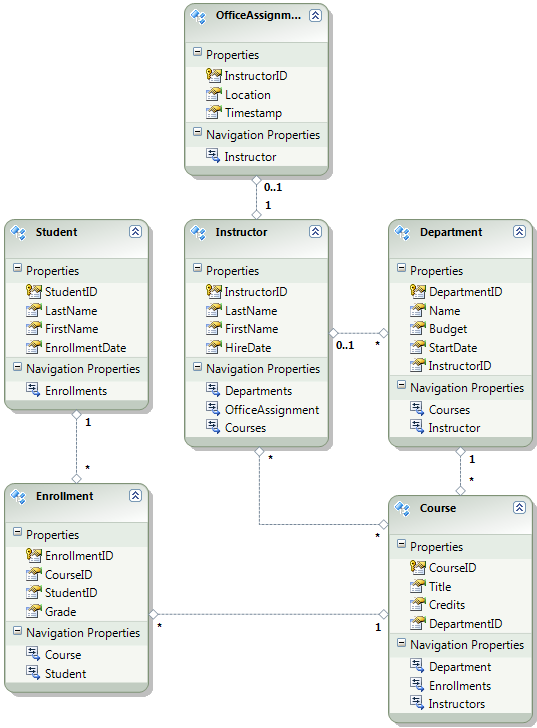](deployment-to-a-hosting-provider-deploying-sql-server-compact-databases-2-of-12/_static/image4.png)

For these tutorials, you'll assume that the `Student` and `Enrollment` tables should be empty when the site is first deployed. The other tables contain data that has to be preloaded when the application goes live.

Since you will be using Code First Migrations, you no longer have to use the **DropCreateDatabaseIfModelChanges** Code First initializer. The code for this initializer is in the SchoolInitializer.cs file in the ContosoUniversity.DAL project. A setting in the **appSettings** element of the Web.config file causes this initializer to run whenever the application tries to access the database for the first time:

[!code-xml[Main](deployment-to-a-hosting-provider-deploying-sql-server-compact-databases-2-of-12/samples/sample1.xml?highlight=3)]

Open the application Web.config file and remove the element that specifies the Code First initializer class from the appSettings element. The appSettings element now looks like this:

[!code-xml[Main](deployment-to-a-hosting-provider-deploying-sql-server-compact-databases-2-of-12/samples/sample2.xml)]

> [!NOTE]
> Another way to specify an initializer class is do it by calling `Database.SetInitializer` in the `Application_Start` method in the *Global.asax* file. If you are enabling Migrations in a project that uses that method to specify the initializer, remove that line of code.

Next, enable Code First Migrations.

The first step is to make sure that the ContosoUniversity project is set as the startup project. In **Solution Explorer**, right-click the ContosoUniversity project and select **Set as Startup Project**. Code First Migrations will look in the startup project to find the database connection string.

From the **Tools** menu, click **Library Package Manager** and then **Package Manager Console**.

At the top of the **Package Manager Console** window select ContosoUniversity.DAL as the default project and then at the `PM>` prompt enter "enable-migrations".

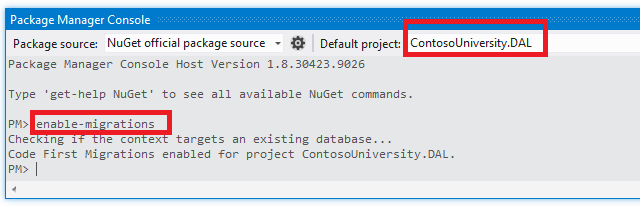

This command creates a *Configuration.cs* file in a new *Migrations* folder in the ContosoUniversity.DAL project.

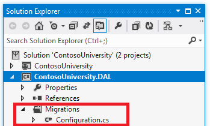

You selected the DAL project because the "enable-migrations" command must be executed in the project that contains the Code First context class. When that class is in a class library project, Code First Migrations looks for the database connection string in the startup project for the solution. In the ContosoUniversity solution, the web project has been set as the startup project. (If you did not want to designate the project that has the connection string as the startup project in Visual Studio, you can specify the startup project in the PowerShell command. To see the command syntax for the enable-migrations command, you can enter the command "get-help enable-migrations".)

Open the Configuration.cs file and replace the comments in the `Seed` method with the following code:

[!code-csharp[Main](deployment-to-a-hosting-provider-deploying-sql-server-compact-databases-2-of-12/samples/sample3.cs)]

The references to `List` have red squiggly lines under them because you don't have a `using` statement for its namespace yet. Right-click one of the instances of `List` and click **Resolve**, and then click **using System.Collections.Generic**.

This menu selection adds the following code to the `using` statements near the top of the file.

[!code-csharp[Main](deployment-to-a-hosting-provider-deploying-sql-server-compact-databases-2-of-12/samples/sample4.cs)]

> [!NOTE]
> Adding code to the `Seed` method is one of many ways that you can insert fixed data into the database. An alternative is to add code to the `Up` and `Down` methods of each migration class. The `Up` and `Down` methods contain code that implements database changes. You'll see examples of them in the [Deploying a Database Update](deployment-to-a-hosting-provider-deploying-a-database-update-9-of-12.md) tutorial.
> 
> You can also write code that executes SQL statements by using the `Sql` method. For example, if you were adding a Budget column to the Department table and wanted to initialize all department budgets to $1,000.00 as part of a migration, you could add the folllowing line of code to the `Up` method for that migration:
> 
> `Sql("UPDATE Department SET Budget = 1000");`
> 
> This example shown for this tutorial uses the `AddOrUpdate` method in the `Seed` method of the Code First Migrations `Configuration` class. Code First Migrations calls the `Seed` method after every migration, and this method updates rows that have already been inserted, or inserts them if they don't exist yet. The `AddOrUpdate` method might not be the best choice for your scenario. For more information, see [Take care with EF 4.3 AddOrUpdate Method](http://thedatafarm.com/blog/data-access/take-care-with-ef-4-3-addorupdate-method/) on Julie Lerman's blog.

Press CTRL-SHIFT-B to build the project.

The next step is to create a `DbMigration` class for the initial migration. You want this migration to create a new database, so you have to delete the database that already exists. SQL Server Compact databases are contained in *.sdf* files in the *App\_Data* folder. In **Solution Explorer**, expand *App\_Data* in the ContosoUniversity project to see the two SQL Server Compact databases, which are represented by *.sdf* files.

Right-click the *School.sdf* file and click **Delete**.

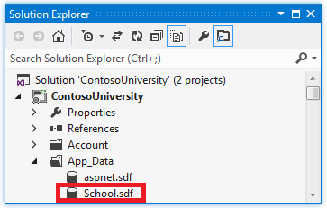

In the **Package Manager Console** window, enter the command "add-migration Initial" to create the initial migration and name it "Initial".

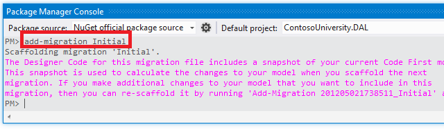

Code First Migrations creates another class file in the *Migrations* folder, and this class contains code that creates the database schema.

In the **Package Manager Console**, enter the command "update-database" to create the database and run the **Seed** method.

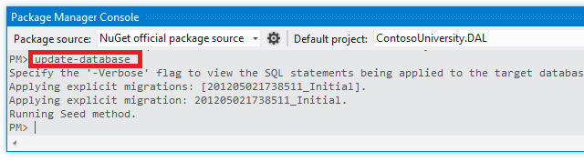

(If you get an error that indicates a table already exists and can't be created, it is probably because you ran the application after you deleted the database and before you executed `update-database`. In that case, delete the *School.sdf* file again and retry the `update-database` command.)

Run the application. Now the Students page is empty but the Instructors page contains instructors. This is what you will get in production after you deploy the application.

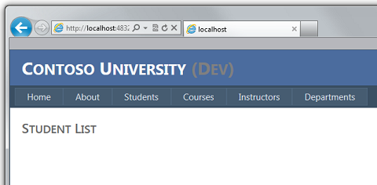

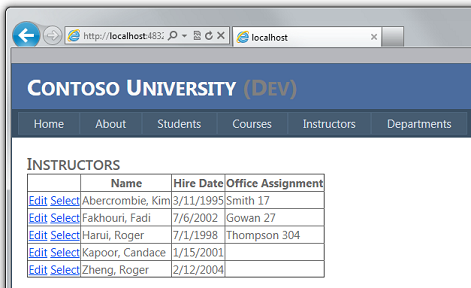

The project is now ready to deploy the *School* database.

## Creating a Membership Database for Deployment

The Contoso University application uses the ASP.NET membership system and forms authentication to authenticate and authorize users. One of its pages is accessible only to administrators. To see this page, run the application and select **Update Credits** from the flyout menu under **Courses**. The application displays the **Log In** page, because only administrators are authorized to use the **Update Credits** page.

Log in as "admin" using the password "Pas$w0rd" (notice the number zero in place of the letter "o" in "w0rd"). After you log in, the **Update Credits** page is displayed.

[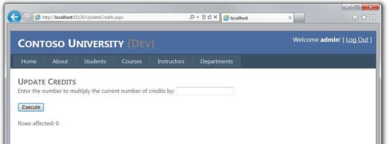](deployment-to-a-hosting-provider-deploying-sql-server-compact-databases-2-of-12/_static/image17.png)

When you deploy a site for the first time, it is common to exclude most or all of the user accounts you create for testing. In this case, you'll deploy an administrator account and no user accounts. Rather than manually deleting test accounts, you'll create a new membership database that has only the one administrator user account that you need in production.

> [!NOTE]
> The membership database stores a hash of account passwords. In order to deploy accounts from one machine to another, you must make sure that hashing routines don't generate different hashes on the destination server than they do on the source computer. They will generate the same hashes when you use the ASP.NET Universal Providers, as long as you don't change the default algorithm. The default algorithm is HMACSHA256 and is specified in the **validation** attribute of the **[machineKey](https://msdn.microsoft.com/en-us/library/w8h3skw9.aspx)** element in the Web.config file.

The membership database is not maintained by Code First Migrations, and there is no automatic initializer that seeds the database with test accounts (as there is for the School database). Therefore, to keep test data available you'll make a copy of the test database before you create a new one.

In **Solution Explorer**, rename the *aspnet.sdf* file in the *App\_Data* folder to *aspnet-Dev.sdf*. (Don't make a copy, just rename it — you'll create a new database in a moment.)

In **Solution Explorer**, make sure that the web project (ContosoUniversity, not ContosoUniversity.DAL) is selected. Then in the **Project** menu, select **ASP.NET Configuration** to run the **Web Site Administration Tool**(WAT).

Select the **Security** tab.

Click **Create or Manage Roles** and add an **Administrator** role.

Navigate back to the **Security** tab, click **Create User**, and add user "admin" as an administrator. Before you click the **Create User** button on the **Create User** page, make sure that you select the **Administrator** check box. The password used in this tutorial is "Pas$w0rd", and you can enter any email address.

Close the browser. In **Solution Explorer**, click the refresh button to see the new *aspnet.sdf* file.

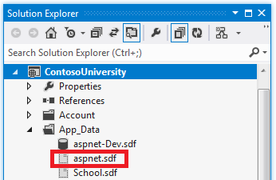

Right-click **aspnet.sdf** and select **Include in Project**.

## Distinguishing Development from Production Databases

In this section, you'll rename the databases so that the development versions are School-Dev.sdf and aspnet-Dev.sdf and the production versions are School-Prod.sdf and aspnet-Prod.sdf. This isn't necessary, but doing so will help keep you from getting test and production versions of the databases confused.

In **Solution Explorer**, click **Refresh** and expand the App\_Data folder to see the School database that you created earlier; right-click it and select **Include in project**.

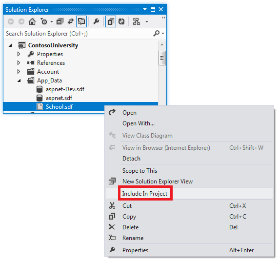

Rename *aspnet.sdf* to *aspnet-Prod.sdf*.

Rename *School.sdf* to *School-Dev.sdf*.

When you run the application in Visual Studio you don't want to use the *-Prod* versions of the database files, you want to use *-Dev* versions. Therefore you have to change the connection strings in the Web.config file so that they point to the *-Dev* versions of the databases. (You haven't created a School-Prod.sdf file, but that's OK because Code First will create that database in production the first time you run your app there.)

Open the application Web.config file, and locate the connection strings:

[!code-xml[Main](deployment-to-a-hosting-provider-deploying-sql-server-compact-databases-2-of-12/samples/sample5.xml)]

Change "aspnet.sdf" to "aspnet-Dev.sdf", and change "School.sdf" to "School-Dev.sdf":

[!code-xml[Main](deployment-to-a-hosting-provider-deploying-sql-server-compact-databases-2-of-12/samples/sample6.xml?highlight=4-5)]

The SQL Server Compact database engine and both databases are now ready to be deployed. In the following tutorial you set up automatic *Web.config* file transformations for settings that must be different in the development, test, and production environments. (Among the settings that must be changed are the connection strings, but you'll set up those changes later when you create a publish profile.)

## More Information

For more information on NuGet, see [Manage Project Libraries with NuGet](https://msdn.microsoft.com/en-us/magazine/hh547106.aspx) and [NuGet Documentation](http://docs.nuget.org/docs/start-here/overview). If you don't want to use NuGet, you'll need to learn how to analyze a NuGet package to determine what it does when it is installed. (For example, it might configure *Web.config* transformations, configure PowerShell scripts to run at build time, etc.) To learn more about how NuGet works, see especially [Creating and Publishing a Package](http://docs.nuget.org/docs/creating-packages/creating-and-publishing-a-package) and [Configuration File and Source Code Transformations](http://docs.nuget.org/docs/creating-packages/configuration-file-and-source-code-transformations).

>[!div class="step-by-step"]
[Previous](deployment-to-a-hosting-provider-introduction-1-of-12.md)
[Next](deployment-to-a-hosting-provider-web-config-file-transformations-3-of-12.md)