Deploying an ASP.NET Web Application with SQL Server Compact using Visual Studio or Visual Web Developer: Deploying to IIS as a Test Environment - 5 of 12
====================
by [Tom Dykstra](https://github.com/tdykstra)

[Download Starter Project](http://code.msdn.microsoft.com/Deploying-an-ASPNET-Web-4e31366b)

> This series of tutorials shows you how to deploy (publish) an ASP.NET web application project that includes a SQL Server Compact database by using Visual Studio 2012 RC or Visual Studio Express 2012 RC for Web. You can also use Visual Studio 2010 if you install the Web Publish Update. For an introduction to the series, see [the first tutorial in the series](deployment-to-a-hosting-provider-introduction-1-of-12.md).
> 
> For a tutorial that shows deployment features introduced after the RC release of Visual Studio 2012, shows how to deploy SQL Server editions other than SQL Server Compact, and shows how to deploy to Azure App Service Web Apps, see [ASP.NET Web Deployment using Visual Studio](../../deployment/visual-studio-web-deployment/introduction.md).

## Overview

This tutorial shows how to deploy an ASP.NET web application to IIS on the local computer.

When you develop an application, you generally test by running it in Visual Studio. By default, this means you're using the Visual Studio Development Server (also known as Cassini). The Visual Studio Development Server makes it easy to test during development in Visual Studio, but it doesn't work exactly like IIS. As a result, it's possible that an application will run correctly when you test it in Visual Studio, but fail when it's deployed to IIS in a hosting environment.

You can test your application more reliably in these ways:

1. Use IIS Express or full IIS instead of the Visual Studio Development Server when you test in Visual Studio during development. This method generally emulates more accurately how your site will run under IIS. However, this method does not test your deployment process or validate that the result of the deployment process will run correctly.
2. Deploy the application to IIS on your development computer by using the same process that you'll use later to deploy it to your production environment. This method validates your deployment process in addition to validating that your application will run correctly under IIS.
3. Deploy the application to a test environment that is as close as possible to your production environment. Since the production environment for these tutorials is a third-party hosting provider, the ideal test environment would be a second account with the hosting provider. You would use this second account only for testing, but it would be set up the same way as the production account.

This tutorial shows the steps for option 2. Guidance for option 3 is provided at the end of the [Deploying to the Production Environment](deployment-to-a-hosting-provider-deploying-to-the-production-environment-7-of-12.md) tutorial, and at the end of this tutorial there are links to resources for option 1.

Reminder: If you get an error message or something doesn't work as you go through the tutorial, be sure to check the [troubleshooting page](deployment-to-a-hosting-provider-creating-and-installing-deployment-packages-12-of-12.md).

## Configuring the Application to Run in Medium Trust

Before installing IIS and deploying to it, you'll change a Web.config file setting in order to make the site run more like it will in a typical shared hosting environment.

Hosting providers typically run your web site in *medium trust*, which means there are some things it is not allowed to do. For example, application code can't access the Windows registry and can't read or write files that are outside of your application's folder hierarchy. By default your application runs in *high trust* on your local computer, which means that the application might be able to do things that would fail when you deploy it to production. Therefore, to make the test environment more accurately reflect the production environment, you'll configure the application to run in medium trust.

In the application Web.config file, add a **trust** element in the **system.web** element, as shown in this example.

[!code-xml[Main](deployment-to-a-hosting-provider-deploying-to-iis-as-a-test-environment-5-of-12/samples/sample1.xml?highlight=4)]

The application will now run in medium trust in IIS even on your local computer. This setting enables you to catch as early as possible any attempts by application code to do something that would fail in production.

> [!NOTE]
> If you are using Entity Framework Code First Migrations, make sure that you have version 5.0 or later installed. In Entity Framework version 4.3, Migrations requires full trust in order to update the database schema.

## Installing IIS and Web Deploy

To deploy to IIS on your development computer, you must have IIS and Web Deploy installed. These are not included in the default Windows 7 configuration. If you have already installed both IIS and Web Deploy, skip to the next section.

Using the [Web Platform Installer](https://www.microsoft.com/web/downloads/platform.aspx) is the preferred way to install IIS and Web Deploy, because the Web Platform Installer installs a recommended configuration for IIS and it automatically installs the prerequisites for IIS and Web Deploy if necessary.

To run Web Platform Installer to install IIS and Web Deploy, use the following link. If you already have installed IIS, Web Deploy or any of their required components, the Web Platform Installer installs only what is missing.

- [Install IIS and Web Deploy using WebPI](https://www.microsoft.com/web/gallery/install.aspx?appsxml=&amp;appid=IIS7;ASPNET;NETFramework4;WDeploy)

## Setting the Default Application Pool to .NET 4

After installing IIS, run **IIS Manager** to make sure that the .NET Framework version 4 is assigned to the default application pool.

From the Windows **Start** menu, select **Run**, enter "inetmgr", and then click **OK**. (If the **Run** command is not in your **Start** menu, you can press the Windows Key and R to open it. Or right-click the taskbar, click **Properties**, select the **Start Menu** tab, click **Customize**, and select **Run command**.)

In the **Connections** pane, expand the server node and select **Application Pools**. In the **Application Pools** pane, if **DefaultAppPool** is assigned to the .NET framework version 4 as in the following illustration, skip to the next section.

If you see only two application pools and both of them are set to the .NET Framework 2.0, you have to install ASP.NET 4 in IIS:

- Open a command prompt window by right-clicking **Command Prompt** in the Windows **Start** menu and selecting **Run as Administrator**. Then run [aspnet\_regiis.exe](https://msdn.microsoft.com/en-us/library/k6h9cz8h.aspx) to install ASP.NET 4 in IIS, using the following commands. (In 64-bit systems, replace "Framework" with "Framework64".)

    [!code-console[Main](deployment-to-a-hosting-provider-deploying-to-iis-as-a-test-environment-5-of-12/samples/sample2.cmd)]

    

    This command creates new application pools for the .NET Framework 4, but the default application pool will still be set to 2.0. You'll be deploying an application that targets .NET 4 to that application pool, so you have to change the application pool to .NET 4.

If you closed **IIS Manager**, run it again, expand the server node, and click **Application Pools** to display the **Application Pools** pane again.

In the **Application Pools** pane, click **DefaultAppPool**, and then in the **Actions** pane click **Basic Settings**.

In the **Edit Application Pool** dialog box, change **.NET Framework version** to **.NET Framework v4.0.30319** and click **OK**.

[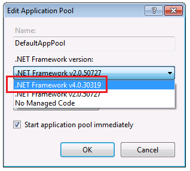](deployment-to-a-hosting-provider-deploying-to-iis-as-a-test-environment-5-of-12/_static/image7.png)

You are now ready to publish to IIS.

## Publishing to IIS

There are several ways you can deploy using Visual Studio 2010 and Web Deploy:

- Use Visual Studio one-click publish.
- Create a *deployment package* and install it using the IIS Manager UI. The deployment package consists of a *.zip* file that contains all the files and metadata needed to install a site in IIS.
- Create a deployment package and install it using the command line.

The process you went through in the previous tutorials to set up Visual Studio to automate deployment tasks applies to all of these three methods. In these tutorials you'll use the first of these methods. For information about using deployment packages, see [ASP.NET Deployment Content Map](https://msdn.microsoft.com/en-us/library/bb386521.aspx).

Before publishing, make sure that you are running Visual Studio in administrator mode. (In the Windows 7 **Start** menu, right-click the icon for the version of Visual Studio you're using and select **Run as Administrator**.) Administrator mode is required for publishing only when you are publishing to IIS on the local computer.

In **Solution Explorer**, right-click the ContosoUniversity project (not the ContosoUniversity.DAL project) and select **Publish**.

The **Publish Web** wizard appears.

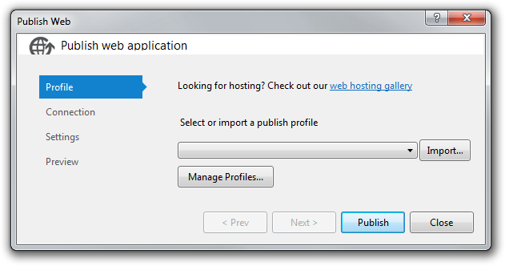

In the drop-down list, select **&lt;New...&gt;**.

In the **New Profile** dialog box, enter "Test", and then click **OK**.

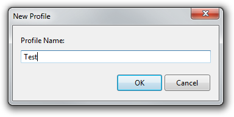

This name is the same as the middle node of the Web.Test.config transform file that you created earlier. This correspondence is what causes the Web.Test.config transformations to be applied when you publish by using this profile.

The wizard automatically advances to the **Connection** tab.

In the **Service URL** box, enter *localhost*.

In the **Site/application** box, enter *Default Web Site/ContosoUniversity*.

In the **Destination URL** box, enter `http://localhost/ContosoUniversity`.

The **Destination URL** setting isn't required. When Visual Studio finishes deploying the application, it automatically opens your default browser to this URL. If you don't want the browser to open automatically after deployment, leave this box blank.

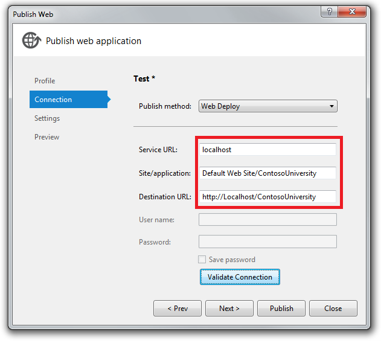

Click **Validate Connection** to verify that the settings are correct and you can connect to IIS on the local computer.

A green check mark verifies that the connection is successful.

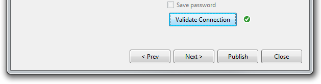

Click **Next** to advance to the **Settings** tab.

The **Configuration** drop-down box specifies the build configuration to deploy. The default value is Release, which is what you want.

Leave the **Remove additional files at destination** check box cleared. Since this is your first deployment, there won't be any files in the destination folder yet.

In the **Databases** section, enter the following value in the connection string box for **SchoolContext**:

[!code-console[Main](deployment-to-a-hosting-provider-deploying-to-iis-as-a-test-environment-5-of-12/samples/sample3.cmd)]

The deployment process will put this connection string in the deployed Web.config file because **Use this connection string at runtime** is selected.

Also under **SchoolContext**, select **Apply Code First Migrations**. This option causes the deployment process to configure the deployed Web.config file to specify the `MigrateDatabaseToLatestVersion` initializer. This initializer automatically updates the database to the latest version when the application accesses the database for the first time after deployment.

In the connection string box for **DefaultConnection**, enter the following value:

[!code-console[Main](deployment-to-a-hosting-provider-deploying-to-iis-as-a-test-environment-5-of-12/samples/sample4.cmd)]

Leave **Update database** cleared. The membership database will be deployed by copying the .sdf file in App\_Data, and you don't want the deployment process to do anything else with this database.

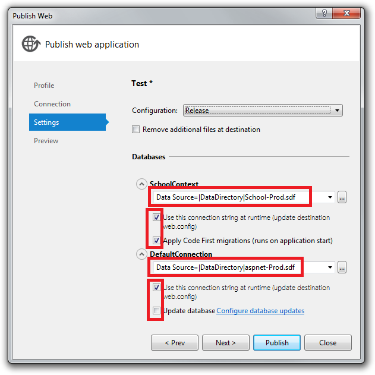

Click **Next** to advance to the **Preview** tab.

In the **Preview** tab, click **Start Preview** to see a list of the files that will be copied.

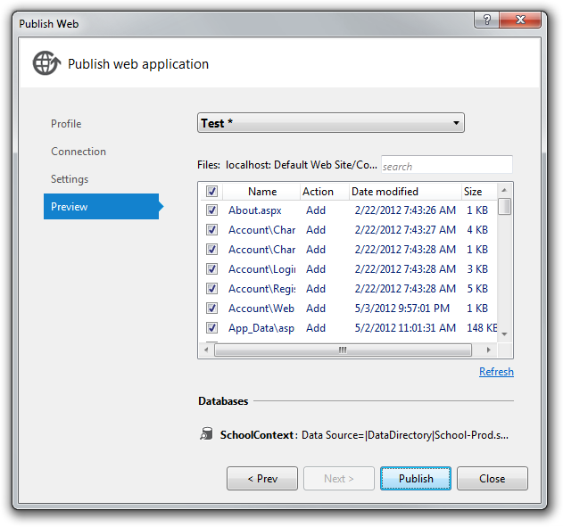

Click **Publish**.

If Visual Studio is not in administrator mode, you might get an error message that indicates a permissions error. In that case, close Visual Studio, open it in administrator mode, and try to publish again.

If Visual Studio is in administrator mode, the **Output** window reports successful build and publish.

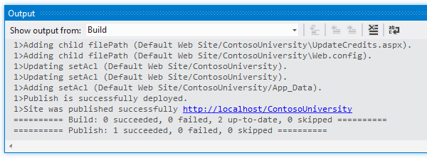

The browser automatically opens to the Contoso University Home page running in IIS on the local computer.

## Testing in the Test Environment

Notice that the environment indicator shows "(Test)" instead of "(Dev)", which shows that the *Web.config* transformation for the environment indicator was successful.

Run the **Students** page to verify that the deployed database has no students. When you select this page it may take a few minutes to load because Code First creates the database and then runs the `Seed` method. (It didn't do that when you were on the home page because the application didn't try to access the database yet.)

[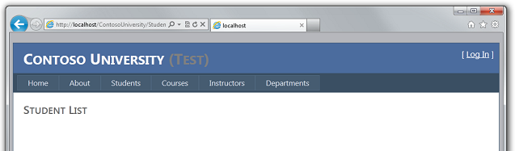](deployment-to-a-hosting-provider-deploying-to-iis-as-a-test-environment-5-of-12/_static/image21.png)

Run the **Instructors** page to verify that Code First seeded the database with instructor data:

Select **Add Students** from the **Students** menu, add a student, and then view the new student in the **Students** page to verify that you can successfully write to the database:

[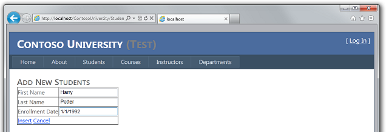](deployment-to-a-hosting-provider-deploying-to-iis-as-a-test-environment-5-of-12/_static/image25.png)

[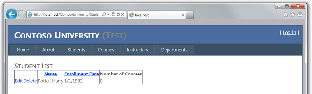](deployment-to-a-hosting-provider-deploying-to-iis-as-a-test-environment-5-of-12/_static/image27.png)

From the **Courses** menu, select **Update Credits**. The **Update Credits** page requires administrator permissions, so the **Log In** page is displayed. Enter the administrator account credentials that you created earlier ("admin" and "Pas$w0rd"). The **Update Credits** page is displayed, which verifies that the administrator account that you created in the previous tutorial was correctly deployed to the test environment.

Verify that an *Elmah* folder exists with only the placeholder file in it.

## Reviewing the Automatic Web.config Changes for Code First Migrations

Open the *Web.config* file in the deployed application at *C:\inetpub\wwwroot\ContosoUniversity* and you can see where the deployment process configured Code First Migrations to automatically update the database to the latest version.

The deployment process also created a new connection string for Code First Migrations to use exclusively for updating the database schema:

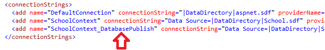

This additional connection string enables you to specify one user account for database schema updates, and a different user account for application data access. For example, you could assign the db\_owner role to Code First Migrations, and db\_datareader and db\_datawriter roles to the application. This is a common defense-in-depth pattern that prevents potentially malicious code in the application from changing the database schema. (For example, this might happen in a successful SQL injection attack.) This pattern is not used by these tutorials. It does not apply to SQL Server Compact, and it does not apply when you migrate to SQL Server in a later tutorial in this series. The Cytanium site offers just one user account for accessing the SQL Server database that you create at Cytanium. If you are able to implement this pattern in your scenario, you can do it by performing the following steps:

1. In the **Settings** tab of the **Publish Web** wizard, enter the connection string that specifies a user with full database schema update permissions, and clear the **Use this connection string at runtime** check box. In the deployed Web.config file, this becomes the `DatabasePublish` connection string.
2. Create a Web.config file transformation for the connection string that you want the application to use at run time.

You have now deployed your application to IIS on your development computer and tested it there. This verifies that the deployment process copied the application's content to the right location (excluding the files that you did not want to deploy), and also that Web Deploy configured IIS correctly during deployment. In the next tutorial, you'll run one more test that finds a deployment task that has not yet been done: setting folder permissions on the *Elmah* folder.

## More Information

For information about running IIS or IIS Express in Visual Studio, see the following resources:

- [IIS Express Overview](https://www.iis.net/learn/extensions/introduction-to-iis-express/iis-express-overview) on the IIS.net site.
- [Introducing IIS Express](https://weblogs.asp.net/scottgu/archive/2010/06/28/introducing-iis-express.aspx) on Scott Guthrie's blog.
- [How to: Specify the Web Server for Web Projects in Visual Studio](https://msdn.microsoft.com/en-us/library/ms178108.aspx).
- [Core Differences Between IIS and the ASP.NET Development Server](../deploying-web-site-projects/core-differences-between-iis-and-the-asp-net-development-server-cs.md) on the ASP.NET site.
- [Test your ASP.NET MVC or Web Forms Application on IIS 7 in 30 seconds](https://blogs.msdn.com/b/rickandy/archive/2011/04/22/test-you-asp-net-mvc-or-webforms-application-on-iis-7-in-30-seconds.aspx) on Rick Anderson's blog. This entry provides examples of why testing with the Visual Studio Development Server (Cassini) is not as reliable as testing in IIS Express, and why testing in IIS Express is not as reliable as testing in IIS.

For information about what issues might arise when your application runs in medium trust, see [Hosting ASP.NET Applications in Medium Trust](http://www.4guysfromrolla.com/articles/100307-1.aspx) on the 4 Guys from Rolla site.

>[!div class="step-by-step"]
[Previous](deployment-to-a-hosting-provider-configuring-project-properties-4-of-12.md)
[Next](deployment-to-a-hosting-provider-setting-folder-permissions-6-of-12.md)