Deploying an ASP.NET Web Application with SQL Server Compact using Visual Studio or Visual Web Developer: Deploying to the Production Environment - 7 of 12
====================
by [Tom Dykstra](https://github.com/tdykstra)

[Download Starter Project](http://code.msdn.microsoft.com/Deploying-an-ASPNET-Web-4e31366b)

> This series of tutorials shows you how to deploy (publish) an ASP.NET web application project that includes a SQL Server Compact database by using Visual Studio 2012 RC or Visual Studio Express 2012 RC for Web. You can also use Visual Studio 2010 if you install the Web Publish Update. For an introduction to the series, see [the first tutorial in the series](deployment-to-a-hosting-provider-introduction-1-of-12.md).
> 
> For a tutorial that shows deployment features introduced after the RC release of Visual Studio 2012, shows how to deploy SQL Server editions other than SQL Server Compact, and shows how to deploy to Azure App Service Web Apps, see [ASP.NET Web Deployment using Visual Studio](../../deployment/visual-studio-web-deployment/introduction.md).

## Overview

In this tutorial, you set up an account with a hosting provider and deploy your ASP.NET web application to the production environment by using the Visual Studio one-click publish feature.

Reminder: If you get an error message or something doesn't work as you go through the tutorial, be sure to check the [troubleshooting page](deployment-to-a-hosting-provider-creating-and-installing-deployment-packages-12-of-12.md).

## Selecting a Hosting Provider

For the Contoso University application and this tutorial series, you need a provider that supports ASP.NET 4 and Web Deploy. A specific hosting company was chosen so that the tutorials could illustrate the complete experience of deploying to a live website. Each hosting company provides different features, and the experience of deploying to their servers varies somewhat. However, the process described in this tutorial is typical for the overall process. The hosting provider used for this tutorial, Cytanium.com, is one of many that are available, and its use in this tutorial does not constitute an endorsement or recommendation.

When you are ready to select your own hosting provider, you can compare features and prices in the [gallery of providers](https://www.microsoft.com/web/hosting) on the Microsoft.com/web site.

## Creating an Account

Create an account at your selected provider. If support for a full SQL Server database is an added extra, you do not need to select it for this tutorial, but you'll need it for the [Migrating to SQL Server](deployment-to-a-hosting-provider-migrating-to-sql-server-10-of-12.md) tutorial later in this series.

For these tutorials, you don't have to register a new domain name. You can test to verify successful deployment by using the temporary URL assigned to the site by the provider.

After the account has been created, you typically receive a welcome email that contains all the information you need in order to deploy and manage your site. The information that your hosting provider sends you will be similar to what is shown here. The Cytanium welcome email that's sent to new account owners includes the following information:

- The URL to the provider's control panel site, where you can manage settings for your site. The ID and password you specified are included in this part of the welcome email for easy reference. (Both have been changed to a demo value for this illustration.)

    [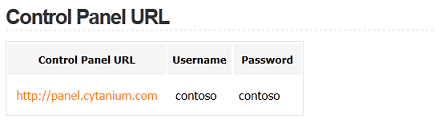](deployment-to-a-hosting-provider-deploying-to-the-production-environment-7-of-12/_static/image1.png)
- The default .NET Framework version and information about how to change it. Many hosting sites default to 2.0, which works with ASP.NET applications that target the .NET Framework 2.0, 3.0, or 3.5. However Contoso University is a .NET Framework 4 application, so you have to change this setting. (For an ASP.NET 4.5 application you would use the .NET 4.0 setting.)

    [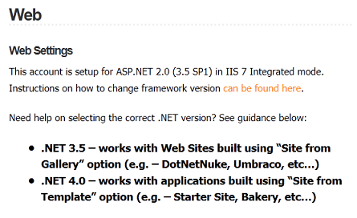](deployment-to-a-hosting-provider-deploying-to-the-production-environment-7-of-12/_static/image3.png)
- The temporary URL that you can use to access your web site. When this account was created, "contosouniversity.com" was entered as the existing domain name. Therefore the temporary URL is `http://contosouniversity.com.vserver01.cytanium.com`.

    [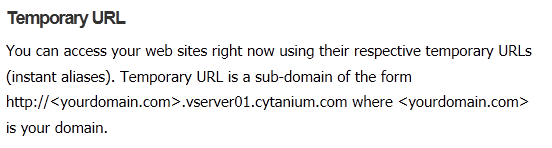](deployment-to-a-hosting-provider-deploying-to-the-production-environment-7-of-12/_static/image5.png)
- Information about how to set up databases, and the connection strings that you need in order to access them:

    [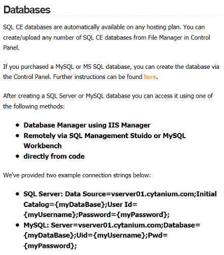](deployment-to-a-hosting-provider-deploying-to-the-production-environment-7-of-12/_static/image7.png)
- Information about tools and settings for deploying your site. (The email from Cytanium also mentions WebMatrix, which is omitted here.)

    [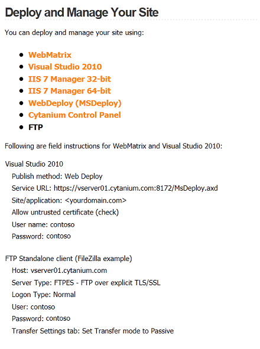](deployment-to-a-hosting-provider-deploying-to-the-production-environment-7-of-12/_static/image9.png)

## Setting the .NET Framework Version

The Cytanium welcome email includes a link to instructions on how to change the version of the .NET Framework. These instructions explain that this can be done through the Cytanium control panel. Other providers have control panel sites that look different, or they may instruct you to do this in a different way.

Go to the control panel URL. After logging in with your user name and password, you see the control panel.

In the **Hosting Spaces** box, hold the pointer over the Web icon and select **Web Sites** from the menu.

[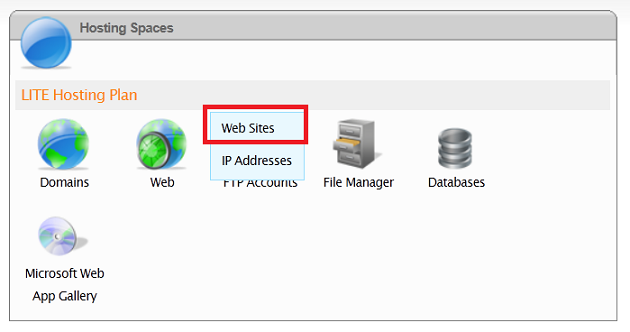](deployment-to-a-hosting-provider-deploying-to-the-production-environment-7-of-12/_static/image13.png)

In the **Web Sites** box, click **contosouniversity.com** (the name of the site that you used when you created the account).

[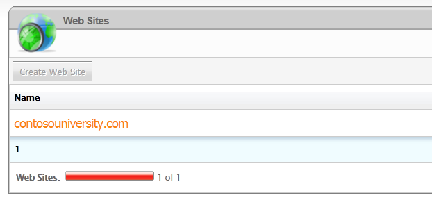](deployment-to-a-hosting-provider-deploying-to-the-production-environment-7-of-12/_static/image15.png)

In the **Web Site Properties** box, select the **Extensions** tab.

[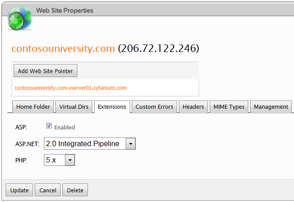](deployment-to-a-hosting-provider-deploying-to-the-production-environment-7-of-12/_static/image17.png)

Change ASP.NET from **2.0 Integrated Pipeline** to **4.0 (Integrated Pipeline)**, and then click **Update**.

## Publishing to the Hosting Provider

The welcome email from the hosting provider includes all of the settings you need in order to publish the project, and you can enter that information manually into a publish profile. But you'll use an easier and less error-prone method to configure deployment to the provider: you'll download a *.publishsettings* file and import it into a publish profile.

In your browser, go to the Cytanium control panel and select **Web** and then select **Web Sites.**

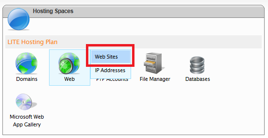

Select the **contosouniversity.com** web site.

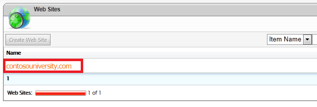

Select the **Web Publishing** tab.

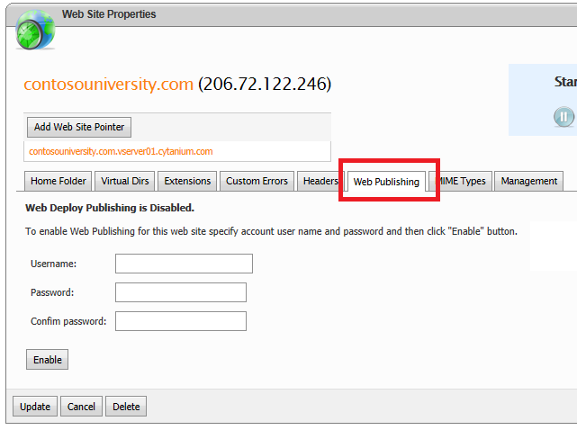

Create credentials to use for web publishing by entering a user name and password. You can enter the same credentials that you use to log on to the control panel. Then click **Enable**.

Click **Download Publishing Profile for this web site**.

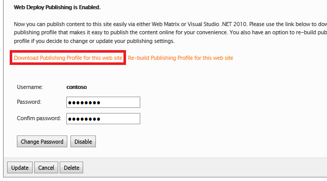

When you are prompted to open or save the file, save it.

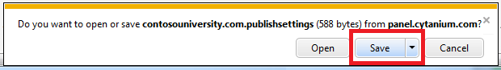

In **Solution Explorer** in Visual Studio, right-click the ContosoUniversity project and select **Publish**. The **Publish Web** dialog box opens on the **Preview** tab with the **Test** profile selected because that is the last profile you used.

Select the **Profile** tab and then Click **Import**.

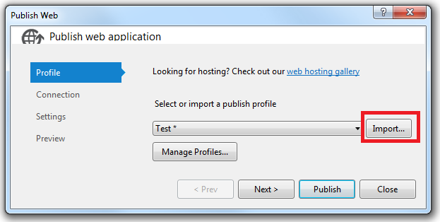

In the **Import Publish Settings** dialog box, select the *.publishsettings* file that you downloaded, and click **Open**. The wizard advances to the Connection tab with all of the fields filled in.

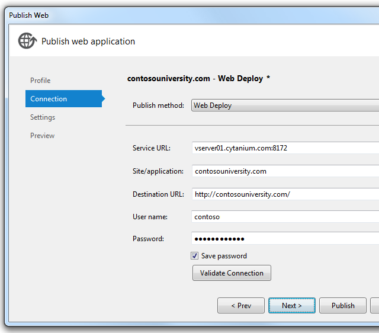

The .publishsettings file puts the planned permanent URL for the site in the Destination URL box, but if you haven't purchased that domain yet, replace the value with the temporary URL. For this example, the URL is *[http://contosouniversity.com.vserver01.cytanium.com](http://contosouniversity.com.vserver01.cytanium.com).* The only purpose of this box is to specify what URL the browser will open to automatically after successfully after deployment. If you leave it blank, the only consequence is that the browser won't start automatically after deployment.

Click **Validate Connection** to verify that the settings are correct and you can connect to the server. As you saw earlier, a green check mark verifies that the connection is successful.

When you click Validate Connection, you might see a **Certificate Error** dialog box. If you do, verify that the server name is what you expect. If it is, select **Save this certificate for future sessions of Visual Studio** and click **Accept**. (This error means that the hosting provider has chosen to avoid the expense of purchasing an SSL certificate for the URL that you are deploying to. If you prefer to establish a secure connection by using a valid certificate, contact your hosting provider.)

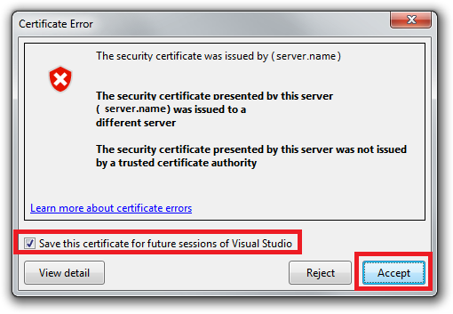

Click **Next**.

In the **Databases** section of the **Settings** tab, enter the same values that you entered for the Test publish profile. You'll find the connection strings you need in the drop-down lists.

- In the connection string box for **SchoolContext,** select `Data Source=|DataDirectory|School-Prod.sdf`
- Under **SchoolContext**, select **Apply Code First Migrations**.
- In the connection string box for **DefaultConnection**, select `Data Source=|DataDirectory|aspnet-Prod.sdf`
- Under **DefaultConnection**, leave **Update database** cleared.

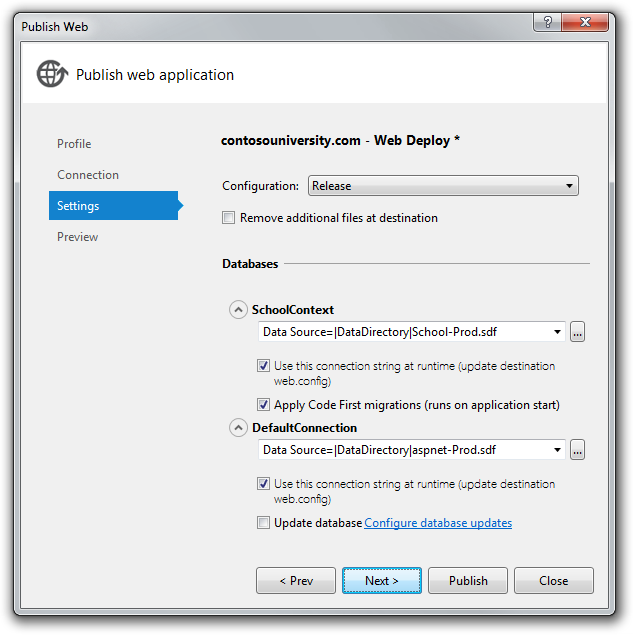

Click **Next**.

In the **Preview** tab, click **Start Preview** to see a list of the files that will be copied. You see the same list that you saw earlier when you deployed to IIS on the local computer.

Before you publish, change the name of the profile so that your Web.Production.config transformation file will be applied. Select the **Profile** tab and click **Manage Profiles**.

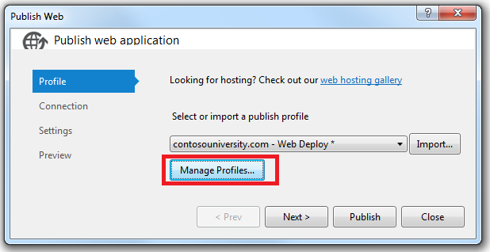

In the **Edit Web Publish Profiles** dialog box, select the production profile, click **Rename**, and change the profile name to Production. Then click **Close**.

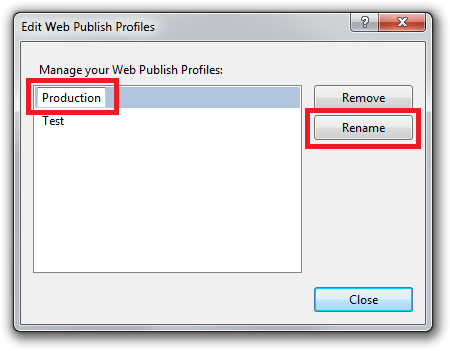

Click **Publish**.

The application is published to the hosting provider. The result shows in the **Output** window.

The browser automatically opens to the URL that you entered in **Destination URL** box on the **Connection** tab of the **Publish Web** wizard. You see the same home page as when you run the site in Visual Studio, except now there is no "(Test)" or "(Dev)" environment indicator in the title bar. This indicates that the environment indicator *Web.config* transformation worked correctly.

> [!NOTE]
> If you still see "(Test)" in the heading, delete the *obj* folder from the ContosoUniversity project and redeploy. In pre-release versions of the software, the previously applied transformation file (Web.Test.config) might get applied again although you are using the Production profile.

Before you run a page that causes database access, make sure that Elmah will be able to log any errors that occur.

## Setting Folder Permissions for Elmah

As you remember from the previous tutorial in this series, you must make sure that the application has Write permissions for the folder in your application where Elmah stores error log files. When you deployed to IIS locally on your computer, you set those permissions manually. In this section, you'll see how to set permissions at Cytanium. (Some hosting providers may not enable you to do this; they may offer one or more predefined folders with Write permissions. In that case you would have to modify your application to use the specified folders.)

You can set folder permissions in the Cytanium control panel. Go to the control panel URL and select **File Manager**.

In the **File Manager** box, select **contosouniversity.com** and then **wwwrooot** to see the application's root folder. Click the padlock icon next to **Elmah**.

In the **File**/**Folder Permissions** window, select the **Read** and **Write** checkboxes for **contosouniversity.com** and click **Set Permissions**.

Make sure that Elmah has write access to the *Elmah* folder by causing an error and then displaying the Elmah error report. Request an invalid URL like *Studentsxxx.aspx*. As before, you see the *GenericErrorPage.aspx* page. Click the **Log Out** link, and then run *Elmah.axd*. You get the **Log In** page first, which validates that the *Web.config* transform successfully added Elmah authorization. After you log in, you see the report that shows the error you just caused.

## Testing in the Production Environment

Run the **Students** page. The application tries to access the School database for the first time, which triggers Code First Migrations to create the database. When the page displays after a moment's delay, it shows that there are no students.

[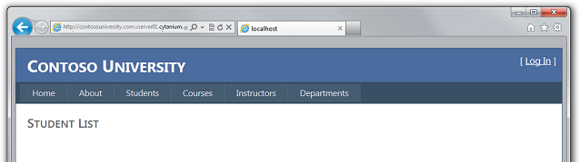](deployment-to-a-hosting-provider-deploying-to-the-production-environment-7-of-12/_static/image42.png)

Run the **Instructors** page to verify that the Seed data successfully inserted instructor data in the database.

As you did in the test environment, you want to verify that database updates work in the production environment, but you typically do not want to enter test data into your production database. For this tutorial, you'll use the same method you did in test. But in a real application you might want to find a method that validates that database updates are successful without introducing test data into the production database. In some applications, it might be practical to add something and then delete it.

Add a student and then view the data you entered in the **Students** page to verify that you can update data in the database.

[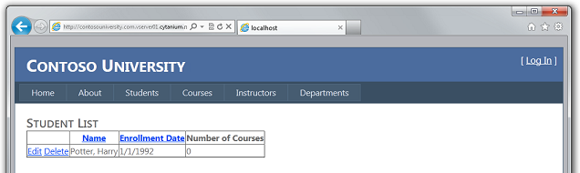](deployment-to-a-hosting-provider-deploying-to-the-production-environment-7-of-12/_static/image48.png)

Validate that authorization rules are working correctly by selecting **Update Credits** from the **Courses** menu. The **Log In** page is displayed. Enter your administrator account credentials, click **Log In**, and the **Update Credits** page is displayed.

[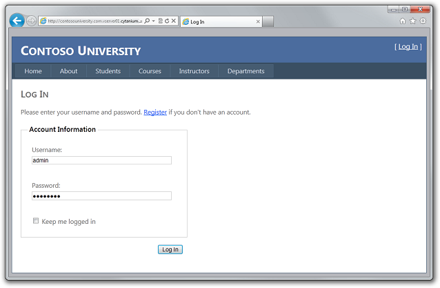](deployment-to-a-hosting-provider-deploying-to-the-production-environment-7-of-12/_static/image50.png)

If login is successful, the **Update Credits** page is displayed. This indicates that the ASP.NET membership database (with the single administrator account) was successfully deployed.

You have now successfully deployed and tested your site and it is available publicly over the Internet.

## Creating a More Reliable Test Environment

As explained in the [Deploying to the Test Environment](deployment-to-a-hosting-provider-deploying-to-iis-as-a-test-environment-5-of-12.md) tutorial, the most reliable test environment would be a second account at the hosting provider that's just like the production account. This would be more expensive than using local IIS as your test environment, since you would have to sign up for a second hosting account. But if it prevents production site errors or outages, you might decide that it's worth the cost.

Most of the process for creating and deploying to a test account is similar to what you've already done to deploy to production:

- Create a *Web.config* transformation file.
- Create an account at the hosting provider.
- Create a new publish profile and deploy to the test account.

### Preventing Public Access to the Test Site

An important consideration for the test account is that it will be live on the Internet, but you don't want the public to use it. To keep the site private you can use one or more of the following methods:

- Contact the hosting provider to set firewall rules that allow access to the testing site only from IP addresses that you use for testing.
- Disguise the URL so that it is not similar to the public site's URL.
- Use a *robots.txt* file to ensure that search engines will not crawl the test site and report links to it in search results.

The first of these methods is obviously the most secure, but the procedure for that is specific to each hosting provider and will not be covered in this tutorial. If you do arrange with your hosting provider to allow only your IP address to browse to the test account URL, you theoretically don't have to worry about search engines crawling it. But even in that case, deploying a *robots.txt* file is a good idea as a backup in case that firewall rule is ever accidentally turned off.

The *robots.txt* file goes in your project folder and should have the following text in it:

[!code-console[Main](deployment-to-a-hosting-provider-deploying-to-the-production-environment-7-of-12/samples/sample1.cmd)]

The `User-agent` line tells search engines that the rules in the file apply to all search engine web crawlers (robots), and the `Disallow` line specifies that no pages on the site should be crawled.

You probably do want search engines to catalog your production site, so you need to exclude this file from production deployment. To do that, see **Can I exclude specific files or folders from deployment?** in [ASP.NET Web Application Project Deployment FAQ](https://msdn.microsoft.com/en-us/library/ee942158.aspx#can_i_exclude_specific_files_or_folders_from_deployment). Make sure that you specify the exclusion only for the Production publish profile.

Creating a second hosting account is an approach to working with a test environment that is not required but might be worth the added expense. In the following tutorials, you'll continue to use IIS as your test environment.

In the next tutorial, you'll update application code and deploy your change to the test and production environments.

>[!div class="step-by-step"]
[Previous](deployment-to-a-hosting-provider-setting-folder-permissions-6-of-12.md)
[Next](deployment-to-a-hosting-provider-deploying-a-code-only-update-8-of-12.md)