Deploying an ASP.NET Web Application with SQL Server Compact using Visual Studio or Visual Web Developer: Migrating to SQL Server - 10 of 12
====================
by [Tom Dykstra](https://github.com/tdykstra)

[Download Starter Project](http://code.msdn.microsoft.com/Deploying-an-ASPNET-Web-4e31366b)

> This series of tutorials shows you how to deploy (publish) an ASP.NET web application project that includes a SQL Server Compact database by using Visual Studio 2012 RC or Visual Studio Express 2012 RC for Web. You can also use Visual Studio 2010 if you install the Web Publish Update. For an introduction to the series, see [the first tutorial in the series](deployment-to-a-hosting-provider-introduction-1-of-12.md).
> 
> For a tutorial that shows deployment features introduced after the RC release of Visual Studio 2012, shows how to deploy SQL Server editions other than SQL Server Compact, and shows how to deploy to Azure App Service Web Apps, see [ASP.NET Web Deployment using Visual Studio](../../deployment/visual-studio-web-deployment/introduction.md).

## Overview

This tutorial shows you how to migrate from SQL Server Compact to SQL Server. One reason you might want to do that is to take advantage of SQL Server features that SQL Server Compact does not support, such as stored procedures, triggers, views, or replication. For more information about the differences between SQL Server Compact and SQL Server, see the [Deploying SQL Server Compact](deployment-to-a-hosting-provider-deploying-sql-server-compact-databases-2-of-12.md) tutorial.

### SQL Server Express versus full SQL Server for Development

Once you've decided to upgrade to SQL Server, you might want to use SQL Server or SQL Server Express in your development and test environments. In addition to the differences in tool support and in database engine features, there are differences in provider implementations between SQL Server Compact and other versions of SQL Server. These differences can cause the same code to generate different results. Therefore, if you decide to keep SQL Server Compact as your development database, you should thoroughly test your site in SQL Server or SQL Server Express in a test environment before each deployment to production.

Unlike SQL Server Compact, SQL Server Express is essentially the same database engine and uses the same .NET provider as full SQL Server. When you test with SQL Server Express, you can be confident of getting the same results as you will with SQL Server. You can use most of the same database tools with SQL Server Express that you can use with SQL Server (a notable exception being [SQL Server Profiler](https://msdn.microsoft.com/en-us/library/ms181091.aspx)), and it supports other features of SQL Server like stored procedures, views, triggers, and replication. (You typically have to use full SQL Server in a production website, however. SQL Server Express can run in a shared hosting environment, but it was not designed for that, and many hosting providers do not support it.)

If you are using Visual Studio 2012, you typically choose SQL Server Express LocalDB for your development environment because that is what is installed by default with Visual Studio. However, LocalDB does not work in IIS, so for your test environment you have to use either SQL Server or SQL Server Express.

### Combining Databases versus Keeping Them Separate

The Contoso University application has two SQL Server Compact databases: the membership database (*aspnet.sdf*) and the application database (*School.sdf*). When you migrate, you can migrate these databases to two separate databases or to a single database. You might want to combine them in order to facilitate database joins between your application database and your membership database. Your hosting plan might also provide a reason to combine them. For example, the hosting provider might charge more for multiple databases or might not even allow more than one database. That's the case with the Cytanium Lite hosting account that's used for this tutorial, which allows only a single SQL Server database.

In this tutorial, you'll migrate your two databases this way:

- Migrate to two LocalDB databases in the development environment.
- Migrate to two SQL Server Express databases in the test environment.
- Migrate to one combined full SQL Server database in the production environment.

Reminder: If you get an error message or something doesn't work as you go through the tutorial, be sure to check the [troubleshooting page](deployment-to-a-hosting-provider-creating-and-installing-deployment-packages-12-of-12.md).

## Installing SQL Server Express

SQL Server Express is automatically installed by default with Visual Studio 2010, but by default it is not installed with Visual Studio 2012. To install SQL Server 2012 Express, click the following link

- [SQL Server Express 2012](https://www.microsoft.com/en-us/download/details.aspx?id=29062)

Choose *ENU/x64/SQLEXPR\_x64\_ENU.exe* or *ENU/x86/SQLEXPR\_x86\_ENU.exe*, and in the installation wizard accept the default settings. For more information about installation options, see [Install SQL Server 2012 from the Installation Wizard (Setup)](https://msdn.microsoft.com/en-us/library/ms143219.aspx).

## Creating SQL Server Express Databases for the Test Environment

The next step is to create the ASP.NET membership and School databases.

From the **View** menu select **Server Explorer** (**Database Explorer** in Visual Web Developer), and then right-click **Data Connections** and select **Create New SQL Server Database**.

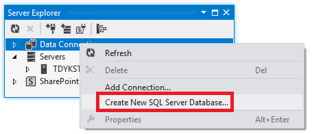

In the **Create New SQL Server Database** dialog box, enter ".\SQLExpress" in the **Server name** box and "aspnet-Test" in the **New database name** box, then click **OK**.

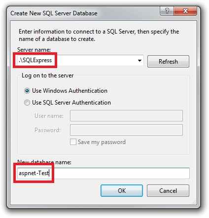

Follow the same procedure to create a new SQL Server Express School database named "School-Test".

(You're appending "Test" to these database names because later you'll create an additional instance of each database for the development environment, and you need to be able to differentiate the two sets of databases.)

**Server Explorer** now shows the two new databases.

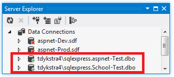

## Creating a Grant Script for the New Databases

When the application runs in IIS on your development computer, the application accesses the database by using the default application pool's credentials. However, by default, the application pool identity does not have permission to open the databases. So you have to run a script to grant that permission. In this section you create the script that you'll run later to make sure that the application can open the databases when it runs in IIS.

In the solution's *SolutionFiles* folder that you created in the [Deploying to the Production Environment](deployment-to-a-hosting-provider-deploying-to-the-production-environment-7-of-12.md) tutorial, create a new SQL file named *Grant.sql*. Copy the following SQL commands into the file, and then save and close the file:

[!code-sql[Main](deployment-to-a-hosting-provider-migrating-to-sql-server-10-of-12/samples/sample1.sql)]

> [!NOTE]
> This script is designed to work with SQL Server 2008 and with the IIS settings in Windows 7 as they are specified in this tutorial. If you're using a different version of SQL Server or of Windows, or if you set up IIS on your computer differently, changes to this script might be required. For more information about SQL Server scripts, see [SQL Server Books Online](https://go.microsoft.com/fwlink/?LinkId=132511).

> [!NOTE] 
> 
> **Security Note** This script gives db\_owner permissions to the user that accesses the database at run time, which is what you'll have in the production environment. In some scenarios you might want to specify a user that has full database schema update permissions only for deployment, and specify for run time a different user that has permissions only to read and write data. For more information, see **Reviewing the Automatic Web.config Changes for Code First Migrations** in [Deploying to IIS as a Test Environment](deployment-to-a-hosting-provider-deploying-to-iis-as-a-test-environment-5-of-12.md).

## Configuring Database Deployment for the Test Environment

Next, you'll configure Visual Studio so that it will do the following tasks for each database:

- Generate a SQL script that creates the source database's structure (tables, columns, constraints, etc.) in the destination database.
- Generate a SQL script that inserts the source database's data into the tables in the destination database.
- Run the generated scripts, and the Grant script that you created, in the destination database.

Open the **Project Properties** window and select the **Package/Publish SQL** tab.

Make sure that **Active (Release)** or **Release** is selected in the **Configuration** drop-down list.

Click **Enable this Page**.

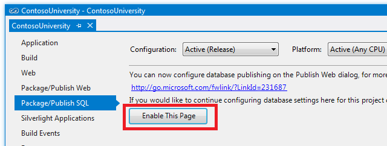

The **Package/Publish SQL** tab is normally disabled because it specifies a legacy deployment method. For most scenarios, you should configure database deployment in the **Publish Web** wizard. Migrating from SQL Server Compact to SQL Server or SQL Server Express is a special case for which this method is a good choice.

Click **Import from Web.config**.

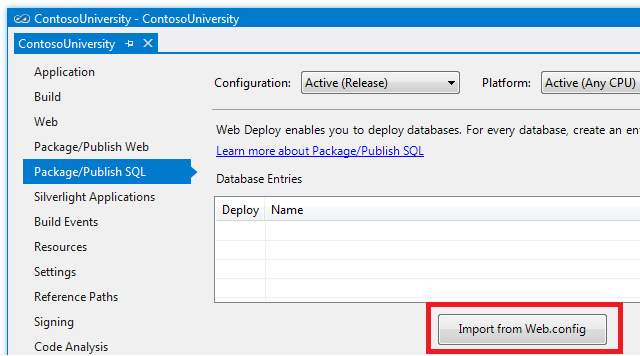

Visual Studio looks for connection strings in the *Web.config* file, finds one for the membership database and one for the School database, and adds a row corresponding to each connection string in the **Database Entries** table. The connection strings it finds are for the existing SQL Server Compact databases, and your next step will be to configure how and where to deploy these databases.

You enter database deployment settings in the **Database Entry Details** section below the **Database Entries** table. The settings shown in the **Database Entry Details** section pertain to whichever row in the **Database Entries** table is selected, as shown in the following illustration.

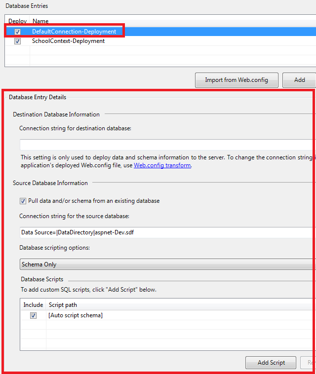

### Configuring Deployment Settings for the Membership Database

Select the **DefaultConnection-Deployment** row in the **Database Entries** table in order to configure settings that apply to the membership database.

In **Connection string for destination database**, enter a connection string that points to the new SQL Server Express membership database. You can get the connection string you need from **Server Explorer**. In **Server Explorer**, expand **Data Connections** and select the **aspnetTest** database, then from the **Properties** window copy the **Connection String** value.

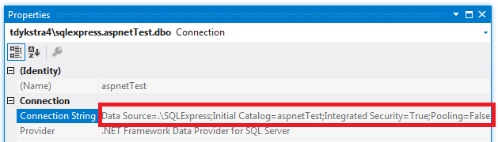

The same connection string is reproduced here:

[!code-console[Main](deployment-to-a-hosting-provider-migrating-to-sql-server-10-of-12/samples/sample2.cmd)]

Copy and paste this connection string into **Connection string for destination database** in the **Package/Publish SQL** tab.

Make sure that **Pull data and/or schema from an existing database** is selected. This is what causes SQL scripts to be automatically generated and run in the destination database.

The **Connection string for the source database** value is extracted from the *Web.config* file and points to the development SQL Server Compact database. This is the source database that will be used to generate the scripts that will run later in the destination database. Since you want to deploy the production version of the database, change "aspnet-Dev.sdf" to "aspnet-Prod.sdf".

Change **Database scripting options** from **Schema Only** to **Schema and data**, since you want to copy your data (user accounts and roles) as well as the database structure.

To configure deployment to run the grant scripts that you created earlier, you have to add them to the **Database Scripts** section. Click **Add Script**, and in the **Add SQL Scripts** dialog box, navigate to the folder where you stored the grant script (this is the folder that contains your solution file). Select the file named *Grant.sql*, and click **Open**.

The settings for the **DefaultConnection-Deployment** row in **Database Entries** now look like the following illustration:

### Configuring Deployment Settings for the School Database

Next, select the **SchoolContext-Deployment** row in the **Database Entries** table in order to configure deployment settings for the School database.

You can use the same method you used earlier to get the connection string for the new SQL Server Express database. Copy this connection string into **Connection string for destination database** in the **Package/Publish SQL** tab.

[!code-console[Main](deployment-to-a-hosting-provider-migrating-to-sql-server-10-of-12/samples/sample3.cmd)]

Make sure that **Pull data and/or schema from an existing database** is selected.

The **Connection string for the source database** value is extracted from the *Web.config* file and points to the development SQL Server Compact database. Change "School-Dev.sdf" to "School-Prod.sdf" to deploy the production version of the database. (You never created a School-Prod.sdf file in the App\_Data folder, so you'll copy that file from the test environment to the App\_Data folder in the ContosoUniversity project folder later.)

Change **Database scripting options** to **Schema and data**.

You also want to run the script to grant read and write permission for this database to the application pool identity, so add the *Grant.sql* script file as you did for the membership database.

When you're done, the settings for the **SchoolContext-Deployment** row in **Database Entries** look like the following illustration:

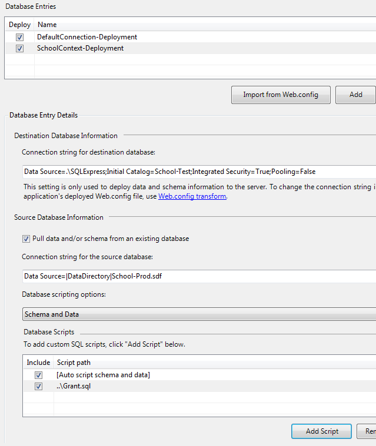

Save the changes to the **Package/Publish SQL** tab.

Copy the *School-Prod.sdf* file from the *c:\inetpub\wwwroot\ContosoUniversity\App\_Data* folder to the *App\_Data* folder in the ContosoUniversity project.

### Specifying Transacted Mode for the Grant Script

The deployment process generates scripts that deploy the database schema and data. By default, these scripts run in a transaction. However, custom scripts (like the grant scripts) by default do not run in a transaction. If the deployment process mixes transaction modes, you might get a timeout error when the scripts run during deployment. In this section, you edit the project file in order to configure the custom scripts to run in a transaction.

In **Solution Explorer**, right-click the **ContosoUniversity** project and select **Unload Project**.

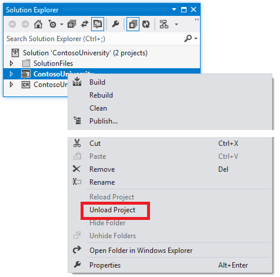

Then right-click the project again and select **Edit ContosoUniversity.csproj**.

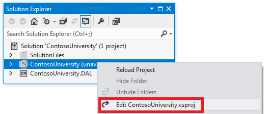

The Visual Studio editor shows you the XML content of the project file. Notice that there are several `PropertyGroup` elements. (In the image, the contents of the `PropertyGroup` elements have been omitted.)

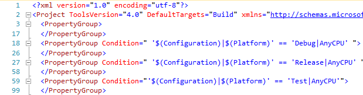

The first one, which has no `Condition` attribute, is for settings that apply regardless of build configuration. One `PropertyGroup` element applies only to the Debug build configuration (note the `Condition` attribute), one applies only to the Release build configuration, and one applies only to the Test build configuration. Within the `PropertyGroup` element for the Release build configuration, you'll see a `PublishDatabaseSettings` element that contains the settings you entered on the **Package/Publish SQL** tab. There is an `Object` element that corresponds to each of the grant scripts you specified (notice the two instances of "Grant.sql"). By default, the `Transacted` attribute of the `Source` element for each grant script is `False`.

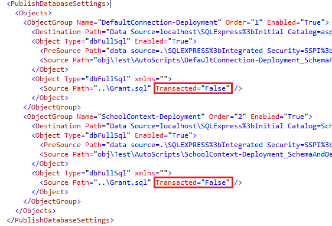

Change the value of the `Transacted` attribute of the `Source` element to `True`.

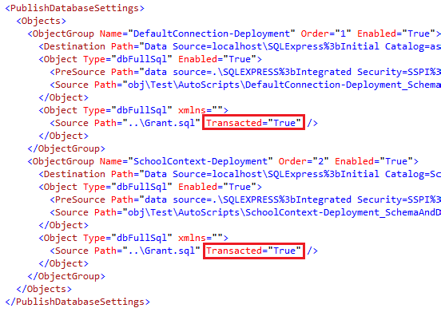

Save and close the project file, and then right-click the project in **Solution Explorer** and select **Reload Project**.

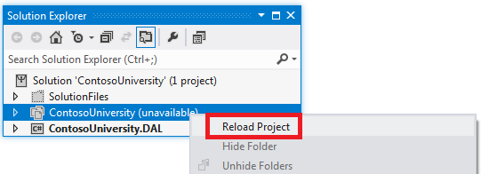

## Setting up Web.Config Transformations for the Connection Strings

The connection strings for the new SQL Express databases that you entered on the **Package/Publish SQL** tab are used by Web Deploy only for updating the destination database during deployment. You still have to set up *Web.config* transformations so that the connection strings in the deployed *Web.config* file point to the new SQL Server Express databases. (When you use the **Package/Publish SQL** tab, you can't configure connection strings in the publish profile.)

Open *Web.Test.config* and replace the `connectionStrings` element with the `connectionStrings` element in the following example. (Make sure you only copy the connectionStrings element, not the surrounding code that is shown here to provide context.)

[!code-xml[Main](deployment-to-a-hosting-provider-migrating-to-sql-server-10-of-12/samples/sample4.xml?highlight=2-11)]

This code causes the `connectionString` and `providerName` attributes of each `add` element to be replaced in the deployed *Web.config* file. These connection strings are not identical to the ones you entered in the **Package/Publish SQL** tab. The setting "MultipleActiveResultSets=True" has been added to them because it's required for the Entity Framework and the Universal Providers.

## Installing SQL Server Compact

The SqlServerCompact NuGet package provides the SQL Server Compact database engine assemblies for the Contoso University application. But now it is not the application but Web Deploy that must be able to read the SQL Server Compact databases, in order to create scripts to run in the SQL Server databases. To enable Web Deploy to read SQL Server Compact databases, install SQL Server Compact on the development computer by using the following link: [Microsoft SQL Server Compact 4.0](https://www.microsoft.com/downloads/details.aspx?FamilyID=15F7C9B3-A150-4AD2-823E-E4E0DCF85DF6).

## Deploying to the Test Environment

In order to publish to the Test environment, you have to create a publish profile that is configured to use the **Package/Publish SQL** tab for database publishing instead of the publish profile database settings.

First, delete the existing Test profile.

In **Solution Explorer**, right-click the ContosoUniversity project, and click **Publish**.

Select the **Profile** tab.

Click **Manage Profiles**.

Select **Test**, click **Remove**, and then click **Close**.

Close the **Publish Web** wizard to save this change.

Next, create a new Test profile and use it to publish the project.

In **Solution Explorer**, right-click the ContosoUniversity project, and click **Publish**.

Select the **Profile** tab.

Select **&lt;New...&gt;** from the drop-down list, and enter "Test" as the profile name.

In the **Service URL** box, enter *localhost*.

In the **Site/application** box, enter *Default Web Site/ContosoUniversity*.

In the **Destination URL** box, enter `http://localhost/ContosoUniversity/`.

Click **Next**.

The **Settings** tab warns you that the **Package/Publish SQL** tab has been configured, and it gives you an opportunity to override them by clicking enable the new database publishing improvements. For this deployment you don't want to override the **Package/Publish SQL** tab settings, so just click **Next**.

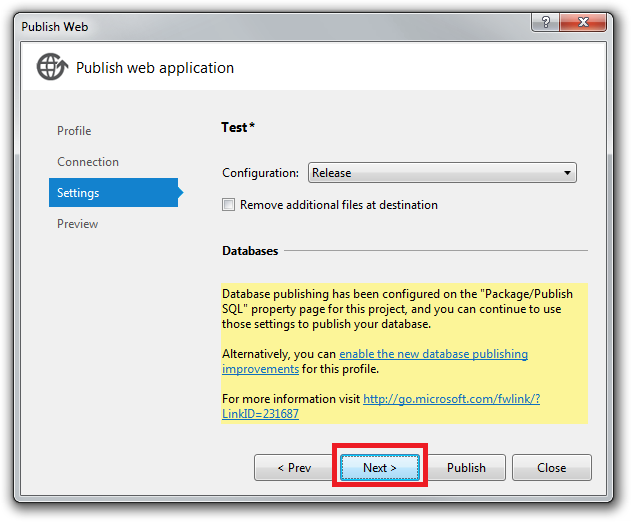

A message on the **Preview** tab indicates that **No databases are selected to publish**, but this only means that database publishing is not configured in the publish profile.

Click **Publish**.

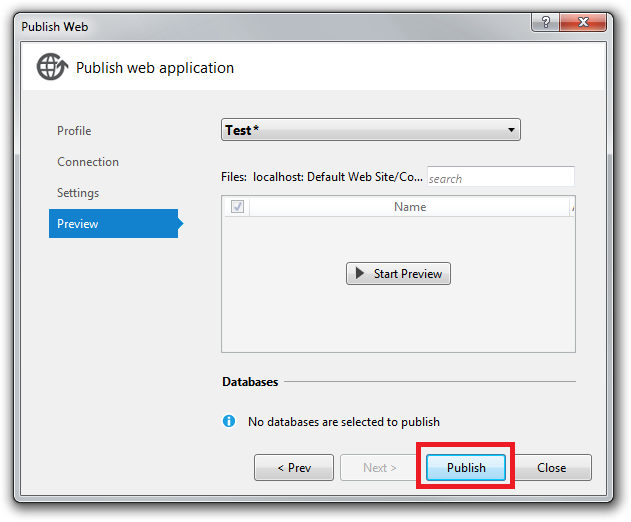

Visual Studio deploys the application and opens the browser to the home page of the site in the test environment. Run the Instructors page to see that it displays the same data that you saw earlier. Run the **Add Students** page, add a new student, and then view the new student in the **Students** page. This verifies that the you can update the database. Select the **Update Credits** page (you'll need to log in) to verify that the membership database was deployed and you have access to it.

## Creating a SQL Server Database for the Production Environment

Now that you've deployed to the test environment, you're ready to set up deployment to production. You begin as you did for the test environment, by creating a database to deploy to. As you recall from the Overview, the Cytanium Lite hosting plan only allows a single SQL Server database, so you will set up only one database, not two. All of the tables and data from the membership and School SQL Server Compact databases will be deployed into one SQL Server database in production.

Go to the Cytanium control panel at [http://panel.cytanium.com](http://panel.cytanium.com). Hold the mouse over **Databases** and then click **SQL Server 2008**.

In the **SQL Server 2008** page, click **Create Database**.

Name the database "School" and click **Save**. (The page automatically adds the prefix "contosou", so the effective name will be "contosouSchool".)

[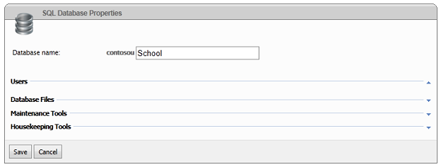](deployment-to-a-hosting-provider-migrating-to-sql-server-10-of-12/_static/image25.png)

On the same page, click **Create User**. On Cytanium's servers, rather than using integrated Windows security and letting the application pool identity open your database, you'll create a user that has authority to open your database. You'll add the user's credentials to the connection strings that go in the production *Web.config* file. In this step you create those credentials.

Fill in the required fields in the **SQL User Properties** page:

- Enter "ContosoUniversityUser" as the name.
- Enter a password.
- Select **contosouSchool** as the default database.
- Select the **contosouSchool** check box.

[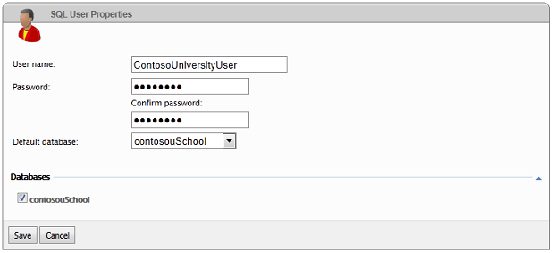](deployment-to-a-hosting-provider-migrating-to-sql-server-10-of-12/_static/image29.png)

## Configuring Database Deployment for the Production Environment

Now you're ready to set up database deployment settings in the **Package/Publish SQL** tab, as you did earlier for the test environment.

Open the **Project Properties** window, select the **Package/Publish SQL** tab, and make sure that **Active (Release)** or **Release** is selected in the **Configuration** drop-down list.

When you configure deployment settings for each database, the key difference between what you do for production and test environments is in how you configure connection strings. For the test environment you entered different destination database connection strings, but for the production environment the destination connection string will be the same for both databases. This is because you are deploying both databases to one database in production.

### Configuring Deployment Settings for the Membership Database

To configure settings that apply to the membership database, select the **DefaultConnection-Deployment** row in the **Database Entries** table.

In **Connection string for destination database**, enter a connection string that points to the new production SQL Server database that you just created. You can get the connection string from your welcome email. The relevant part of the email contains the following sample connection string:

[!code-console[Main](deployment-to-a-hosting-provider-migrating-to-sql-server-10-of-12/samples/sample5.cmd)]

After you replace the three variables, the connection string you need looks like this example:

[!code-console[Main](deployment-to-a-hosting-provider-migrating-to-sql-server-10-of-12/samples/sample6.cmd)]

Copy and paste this connection string into **Connection string for destination database** in the **Package/Publish SQL** tab.

Make sure that **Pull data and/or schema from an existing database** is still selected, and that **Database scripting options** is still **Schema and Data**.

In the **Database Scripts** box, clear the check box next to the Grant.sql script.

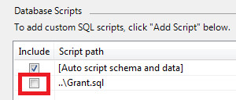

### Configuring Deployment Settings for the School Database

Next, select the **SchoolContext-Deployment** row in the **Database Entries** table in order to configure the School database settings.

Copy the same connection string into **Connection string for destination database** that you copied into that field for the membership database.

Make sure that **Pull data and/or schema from an existing database** is still selected, and that **Database scripting options** is still **Schema and Data**.

In the **Database Scripts** box, clear the check box next to the Grant.sql script.

Save the changes to the **Package/Publish SQL** tab.

## Setting Up Web.Config Transforms for the Connection Strings to Production Databases

Next, you'll set up *Web.config* transformations so that the connection strings in the deployed *Web.config* file to point to the new production database. The connection string that you entered on the **Package/Publish SQL** tab for Web Deploy to use is the same as the one the application needs to use, except for the addition of the `MultipleResultSets` option.

Open *Web.Production.config* and replace the `connectionStrings` element with a `connectionStrings` element that looks like the following example. (Only copy the `connectionStrings` element, not the surrounding tags that are provided to show the context.)

[!code-xml[Main](deployment-to-a-hosting-provider-migrating-to-sql-server-10-of-12/samples/sample7.xml?highlight=2-11)]

You sometimes see advice that tells you to always encrypt connection strings in the *Web.config* file. This might be appropriate if you were deploying to servers on your own company's network. When you are deploying to a shared hosting environment, though, you're trusting the security practices of the hosting provider, and it's not necessary or practical to encrypt the connection strings.

## Deploying to the Production Environment

Now you're ready to deploy to production. Web Deploy will read the SQL Server Compact databases in your project's *App\_Data* folder and re-create all of their tables and data in the production SQL Server database. In order to publish by using the **Package/Publish Web** tab settings, you have to create a new publish profile for production.

First, delete the existing Production profile as you did the Test profile earlier.

In **Solution Explorer**, right-click the ContosoUniversity project, and click **Publish**.

Select the **Profile** tab.

Click **Manage Profiles**.

Select **Production**, click **Remove**, and then click **Close**.

Close the **Publish Web** wizard to save this change.

Next, create a new Production profile and use it to publish the project.

In **Solution Explorer**, right-click the ContosoUniversity project, and click **Publish**.

Select the **Profile** tab.

Click **Import**, and select the .publishsettings file that you downloaded earlier.

On the **Connection** tab, change the **Destination URL** to the correct temporary URL, which in this example is http://contosouniversity.com.vserver01.cytanium.com.

Rename the profile to Production. (Select the **Profile** tab and click **Manage Profiles** to do that).

Close the **Publish Web** wizard to save your changes.

In a real application in which the database was being updated in production, you would do two additional steps now before you publish:

1. Upload *app\_offline.htm*, as shown in the [Deploying to the Production Environment](deployment-to-a-hosting-provider-deploying-to-the-production-environment-7-of-12.md) tutorial.
2. Use the **File Manager** feature of the Cytanium control panel to copy the *aspnet-Prod.sdf* and *School-Prod.sdf* files from the production site to the *App\_Data* folder of the ContosoUniversity project. This ensures that the data you're deploying to the new SQL Server database includes the latest updates made by your production website.

In the **Web One Click Publish** toolbar, make sure that the **Production** profile is selected, and then click **Publish**.

If you uploaded *app\_offline.htm* before publishing, you have to use the **File Manager** utility in the Cytanium control panel to delete *app\_offline.*htm before you test. You can also at the same time delete the *.sdf* files from the *App\_Data* folder.

You can now open a browser and go to the URL of your public site to test the application the same way you did after deploying to the test environment.

## Switching to SQL Server Express LocalDB in Development

As was explained in the Overview, it's generally best to use the same database engine in development that you use in test and production. (Remember that the advantage to using SQL Server Express in development is that the database will work the same in your development, test, and production environments.) In this section you'll set up the ContosoUniversity project to use SQL Server Express LocalDB when you run the application from Visual Studio.

The simplest way to perform this migration is to let Code First and the membership system create both new development databases for you. Using this method to migrate requires three steps:

1. Change the connection strings to specify new SQL Express LocalDB databases.
2. Run the Web Site Administration Tool to create an administrator user. This creates the membership database.
3. Use the Code First Migrations update-database command to create and seed the application database.

### Updating Connection Strings in the Web.config file

Open the *Web.config* file and replace the `connectionStrings` element with the following code:

[!code-xml[Main](deployment-to-a-hosting-provider-migrating-to-sql-server-10-of-12/samples/sample8.xml)]

### Creating the Membership Database

In **Solution Explorer**, select the ContosoUniversity project, and then click **ASP.NET Configuration** in the **Project** menu.

Select the Security tab.

Click **Create or Manage Roles**, and then create an **Administrator** role.

Return to the Security tab.

Click **Create user**, and then select the **Administrator** check box and create a user named admin.

Close the **Web Site Administration Tool**.

### Creating the School Database

Open the Package Manager Console window.

In the **Default project** drop-down list, select the ContosoUniversity.DAL project.

Enter the following command:

[!code-powershell[Main](deployment-to-a-hosting-provider-migrating-to-sql-server-10-of-12/samples/sample9.ps1)]

Code First Migrations applies the Initial migration that creates the database and then applies the AddBirthDate migration, then it runs the Seed method.

Run the site by pressing Control-F5. As you did for the test and production environments, run the **Add Students** page, add a new student, and then view the new student in the **Students** page. This verifies that the School database was created and initialized and that you have read and write access to it.

Select the **Update Credits** page and log in to verify that the membership database was deployed and that you have access to it. If you did not migrate your user accounts, create an administrator account and then select the **Update Credits** page to verify that it works.

## Cleaning Up SQL Server Compact Files

You no longer need files and NuGet packages that were included to support SQL Server Compact. If you want (this step is not required), you can clean up unneeded files and references.

In **Solution Explorer**, delete the *.sdf* files from the *App\_Data* folder and the *amd64* and *x86* folders from the *bin* folder.

In **Solution Explorer**, right-click the solution (not one of the projects), and then click **Manage NuGet Packages for Solution**.

In the left pane of the **Manage NuGet Packages** dialog box, select **Installed packages**.

Select the **EntityFramework.SqlServerCompact** package and click **Manage**.

In the **Select Projects** dialog box, both projects are selected. To uninstall the package in both projects, clear both check boxes, then click **OK**.

In the dialog box that asks if you want to uninstall the dependent packages also, click No. One of these is the Entity Framework package that you have to keep.

Follow the same procedure to uninstall the **SqlServerCompact** package. (The packages must be uninstalled in this order because the **EntityFramework.SqlServerCompact** package depends on the **SqlServerCompact** package.)

You have now successfully migrated to SQL Server Express and full SQL Server. In the next tutorial you'll make another database change, and you'll see how to deploy database changes when your test and production databases use SQL Server Express and full SQL Server.

>[!div class="step-by-step"]
[Previous](deployment-to-a-hosting-provider-deploying-a-database-update-9-of-12.md)
[Next](deployment-to-a-hosting-provider-deploying-a-sql-server-database-update-11-of-12.md)