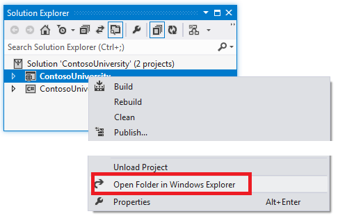
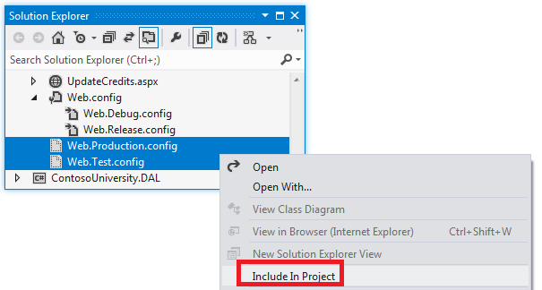

Deploying an ASP.NET Web Application with SQL Server Compact using Visual Studio or Visual Web Developer: Web.Config File Transformations - 3 of 12
====================
by [Tom Dykstra](https://github.com/tdykstra)

[Download Starter Project](http://code.msdn.microsoft.com/Deploying-an-ASPNET-Web-4e31366b)

> This series of tutorials shows you how to deploy (publish) an ASP.NET web application project that includes a SQL Server Compact database by using Visual Studio 2012 RC or Visual Studio Express 2012 RC for Web. You can also use Visual Studio 2010 if you install the Web Publish Update. For an introduction to the series, see [the first tutorial in the series](deployment-to-a-hosting-provider-introduction-1-of-12.md).
> 
> For a tutorial that shows deployment features introduced after the RC release of Visual Studio 2012, shows how to deploy SQL Server editions other than SQL Server Compact, and shows how to deploy to Azure App Service Web Apps, see [ASP.NET Web Deployment using Visual Studio](../../deployment/visual-studio-web-deployment/introduction.md).

## Overview

This tutorial shows you how to automate the process of changing the *Web.config* file when you deploy it to different destination environments. Most applications have settings in the *Web.config* file that must be different when the application is deployed. Automating the process of making these changes keeps you from having to do them manually every time you deploy, which would be tedious and error prone.

Reminder: If you get an error message or something doesn't work as you go through the tutorial, be sure to check the [troubleshooting page](deployment-to-a-hosting-provider-creating-and-installing-deployment-packages-12-of-12.md).

## Web.config Transformations versus Web Deploy Parameters

There are two ways to automate the process of changing *Web.config* file settings: [Web.config transformations](https://msdn.microsoft.com/en-us/library/dd465326.aspx) and [Web Deploy parameters](https://msdn.microsoft.com/en-us/library/ff398068.aspx). A *Web.config* transformation file contains XML markup that specifies how to change the *Web.config* file when it is deployed. You can specify different changes for specific build configurations and for specific publish profiles. The default build configurations are Debug and Release, and you can create custom build configurations. A publish profile typically corresponds to a destination environment. (You'll learn more about publish profiles in the [Deploying to IIS as a Test Environment](deployment-to-a-hosting-provider-deploying-to-iis-as-a-test-environment-5-of-12.md) tutorial.)

Web Deploy parameters can be used to specify many different kinds of settings that must be configured during deployment, including settings that are found in *Web.config* files. When used to specify *Web.config* file changes, Web Deploy parameters are more complex to set up, but they are useful when you do not know the value to be set until you deploy. For example, in an enterprise environment, you might create a *deployment package* and give it to a person in the IT department to install in production, and that person has to be able to enter connection strings or passwords that you do not know.

For the scenario that this tutorial covers, you know everything that has to be done to the *Web.config* file, so you do not need to use Web Deploy parameters. You'll configure some transformations that differ depending on the build configuration used, and some that differ depending on the publish profile used.

## Creating Transformation Files for Publish Profiles

In **Solution Explorer**, expand *Web.config* to see the *Web.Debug.config* and *Web.Release.config* transformation files that are created by default for the two default build configurations.

You can create transformation files for custom build configurations by right-clicking the Web.config file and choosing **Add Config Transforms** from the context menu, but for this tutorial you don't need to do that.

You do need two more transformation files, for configuring changes that are related to the deployment destination rather than to the build configuration. A typical example of this kind of setting is a WCF endpoint that is different for test versus production. In later tutorials you'll create publish profiles named Test and Production, so you need a *Web.Test.config* file and a *Web.Production.config* file.

Transformation files that are tied to publish profiles must be created manually. In **Solution Explorer**, right-click the ContosoUniversity project and select **Open Folder in Windows Explorer**.

In **Windows Explorer**, select the *Web.Release.config* file, copy the file, and then paste two copies of it. Rename these copies *Web.Production.config* and *Web.Test.config*, then close **Windows Explorer**.

In **Solution Explorer**, click **Refresh** to see the new files.

Select the new files, right-click, and then click **Include in Project** in the context menu.

To prevent these files from being deployed, select them in **Solution Explorer**, and then in the **Properties** window change the **Build Action** property from **Content** to **None**. (The transformation files that are based on build configurations are automatically prevented from deploying.)

You are now ready to enter *Web.config* transformations into the *Web.config* transformation files.

## Limiting Error Log Access to Administrators

If there's an error while the application runs, the application displays a generic error page in place of the system-generated error page, and it uses [Elmah NuGet package](http://www.hanselman.com/blog/NuGetPackageOfTheWeek7ELMAHErrorLoggingModulesAndHandlersWithSQLServerCompact.aspx) for error logging and reporting. The `customErrors` element in the *Web.config* file specifies the error page:

[!code-xml[Main](deployment-to-a-hosting-provider-web-config-file-transformations-3-of-12/samples/sample1.xml)]

To see the error page, temporarily change the `mode` attribute of the `customErrors` element from "RemoteOnly" to "On" and run the application from Visual Studio. Cause an error by requesting an invalid URL, such as *Studentsxxx.aspx*. Instead of an IIS-generated "page not found" error page, you see the *GenericErrorPage.aspx* page.

To see the error log, replace everything in the URL after the port number with *elmah.axd* (for the example in the screen shot, `http://localhost:51130/elmah.axd`) and press Enter:

Don't forget to set the `customErrors` element back to "RemoteOnly" mode when you're done.

On your development computer it's convenient to allow free access to the error log page, but in production that would be a security risk. For the production site, you can add an authorization rule that restricts error log access just to administrators by configuring a transform in the *Web.Production.config* file.

Open *Web.Production.config* and add a new `location` element immediately after the opening `configuration` tag, as shown here. (Make sure that you add only the `location` element and not the surrounding markup which is shown here only to provide some context.)

[!code-xml[Main](deployment-to-a-hosting-provider-web-config-file-transformations-3-of-12/samples/sample2.xml?highlight=2-9)]

The `Transform` attribute value of "Insert" causes this `location` element to be added as a sibling to any existing `location` elements in the *Web.config* file. (There is already one `location` element that specifies authorization rules for the **Update Credits** page.) When you test the production site after deployment, you'll test to verify that this authorization rule is effective.

You don't have to restrict error log access in the test environment, so you don't have to add this code to the *Web.Test.config* file.

> [!NOTE] 
> 
> **Security Note** Never display error details to the public in a production application, or store that information in a public location. Attackers can use error information to discover vulnerabilities in a site. If you use ELMAH in your own application, be sure to investigate ways in which ELMAH can be configured to minimize security risks. The ELMAH example in this tutorial should not be considered a recommended configuration. It is an example that was chosen in order to illustrate how to handle a folder that the application must be able to create files in.

## Setting an Environment Indicator

A common scenario is to have *Web.config* file settings that must be different in each environment that you deploy to. For example, an application that calls a WCF service might need a different endpoint in test and production environments. The Contoso University application includes a setting of this kind also. This setting controls a visible indicator on a site's pages that tells you which environment you are in, such as development, test, or production. The setting value determines whether the application will append "(Dev)" or "(Test)" to the main heading in the *Site.Master* master page:

The environment indicator is omitted when the application is running in production.

The Contoso University web pages read a value that is set in `appSettings` in the *Web.config* file in order to determine what environment the application is running in:

[!code-xml[Main](deployment-to-a-hosting-provider-web-config-file-transformations-3-of-12/samples/sample3.xml)]

The value should be "Test" in the test environment, and "Prod" in the production environment.

Open *Web.Production.config* and add an `appSettings` element immediately before the opening tag of the `location` element you added earlier:

[!code-xml[Main](deployment-to-a-hosting-provider-web-config-file-transformations-3-of-12/samples/sample4.xml)]

The `xdt:Transform` attribute value "SetAttributes" indicates that the purpose of this transform is to change attribute values of an existing element in the *Web.config* file. The `xdt:Locator` attribute value "Match(key)" indicates that the element to be modified is the one whose `key` attribute matches the `key` attribute specified here. The only other attribute of the `add` element is `value`, and that is what will be changed in the deployed *Web.config* file. This code causes the `value` attribute of the `Environment` `appSettings` element to be set to "Prod" in the *Web.config* file that is deployed to production.

Next, apply the same change to *Web.Test.config* file, except set the `value` to "Test" instead of "Prod". When you are done, the `appSettings` section in *Web.Test.config* will look like the following example:

[!code-xml[Main](deployment-to-a-hosting-provider-web-config-file-transformations-3-of-12/samples/sample5.xml)]

## Disabling Debug Mode

For a Release build, you do not want debugging enabled regardless of which environment you are deploying to. By default the *Web.Release.config* transform file is automatically created with code that removes the `debug` attribute from the `compilation` element:

[!code-xml[Main](deployment-to-a-hosting-provider-web-config-file-transformations-3-of-12/samples/sample6.xml)]

The `Transform` attribute causes the `debug` attribute to be omitted from the deployed *Web.config* file whenever you deploy a Release build.

This same transformation is in Test and Production transform files because you created them by copying the Release transform file. You don't need it duplicated there, so open each of those files, remove the **compilation** element, and save and close each file.

## Setting Connection Strings

In most cases you do not need to set up connection string transformations, because you can specify connection strings in the publish profile. But there is an exception when you're deploying a SQL Server Compact database and you're using Entity Framework Code First Migrations to update the database on the destination server. For this scenario, you have to specify an additional connection string that will be used on the server for updating the database schema. To set up this transformation, add a **&lt;connectionStrings&gt;** element immediately after the opening **&lt;configuration&gt;** tag in both the *Web.Test.config* and the *Web.Production.config* transform files:

[!code-xml[Main](deployment-to-a-hosting-provider-web-config-file-transformations-3-of-12/samples/sample7.xml)]

The `Transform` attribute specifies that this connection string will be added to the *connectionStrings* element in the deployed *Web.config* file. (The publish process creates this additional connection string automatically for you if it doesn't exist, but by default the **providerName** attribute gets set to `System.Data.SqlClient`, which does not work not for SQL Server Compact. By adding the connection string manually, you keep the deployment process from creating a connection string element with the wrong provider name.)

You have now specified all of the *Web.config* transformations that you need for deploying the Contoso University application to test and production. In the following tutorial, you'll take care of deployment set-up tasks that require setting project properties.

## More Information

For more information about topics covered by this tutorial, see the Web.config transformation scenario in [ASP.NET Deployment Content Map](https://msdn.microsoft.com/en-us/library/bb386521.aspx).

>[!div class="step-by-step"]
[Previous](deployment-to-a-hosting-provider-deploying-sql-server-compact-databases-2-of-12.md)
[Next](deployment-to-a-hosting-provider-configuring-project-properties-4-of-12.md)