Getting Started with Entity Framework 4.0 Database First and ASP.NET 4 Web Forms
====================
by [Tom Dykstra](https://github.com/tdykstra)

> The Contoso University sample web application demonstrates how to create ASP.NET Web Forms applications using the Entity Framework 4.0 and Visual Studio 2010. The sample application is a website for a fictional Contoso University. It includes functionality such as student admission, course creation, and instructor assignments.
> 
> The tutorial shows examples in C#. The [downloadable sample](https://code.msdn.microsoft.com/ASPNET-Web-Forms-97f8ee9a) contains code in both C# and Visual Basic.
> 
> ## Database First
> 
> There are three ways you can work with data in the Entity Framework: *Database First*, *Model First*, and *Code First*. This tutorial is for Database First. For information about the differences between these workflows and guidance on how to choose the best one for your scenario, see [Entity Framework Development Workflows](https://msdn.microsoft.com/en-us/library/ms178359.aspx#dbfmfcf).
> 
> ## Web Forms
> 
> This tutorial series uses the ASP.NET Web Forms model and assumes you know how to work with ASP.NET Web Forms in Visual Studio. If you don't, see [Getting Started with ASP.NET 4.5 Web Forms](../../getting-started/getting-started-with-aspnet-45-web-forms/introduction-and-overview.md). If you prefer to work with the ASP.NET MVC framework, see [Getting Started with the Entity Framework using ASP.NET MVC](../../../../mvc/overview/getting-started/getting-started-with-ef-using-mvc/creating-an-entity-framework-data-model-for-an-asp-net-mvc-application.md).
> 
> ## Software versions
> 
> | **Shown in the tutorial** | **Also works with** |
> | --- | --- |
> | Windows 7 | Windows 8 |
> | Visual Studio 2010 | Visual Studio 2010 Express for Web. The tutorial has not been tested with later versions of Visual Studio. There are many differences in menu selections, dialog boxes, and templates. |
> | .NET 4 | .NET 4.5 is backward compatible with .NET 4, but the tutorial has not been tested with .NET 4.5. |
> | Entity Framework 4 | The tutorial has not been tested with later versions of Entity Framework. Starting with Entity Framework 5, EF uses by default the `DbContext API` that was introduced with EF 4.1. The EntityDataSource control was designed to use the `ObjectContext` API. For information about how to use the EntityDataSource control with the `DbContext` API, see [this blog post](https://blogs.msdn.com/b/webdev/archive/2012/09/13/how-to-use-the-entitydatasource-control-with-entity-framework-code-first.aspx). |
> 
> ## Questions
> 
> If you have questions that are not directly related to the tutorial, you can post them to the [ASP.NET Entity Framework forum](https://forums.asp.net/1227.aspx), the [Entity Framework and LINQ to Entities forum](https://social.msdn.microsoft.com/forums/en-US/adodotnetentityframework/threads/), or [StackOverflow.com](http://stackoverflow.com/).

## Overview

The application you'll be building in these tutorials is a simple university website.

[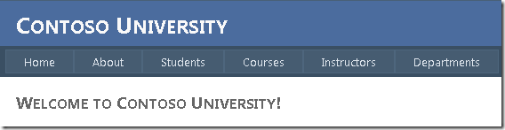](the-entity-framework-and-aspnet-getting-started-part-1/_static/image1.png)

Users can view and update student, course, and instructor information. A few of the screens you'll create are shown below.

[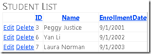](the-entity-framework-and-aspnet-getting-started-part-1/_static/image3.png)

[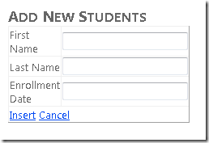](the-entity-framework-and-aspnet-getting-started-part-1/_static/image5.png)

[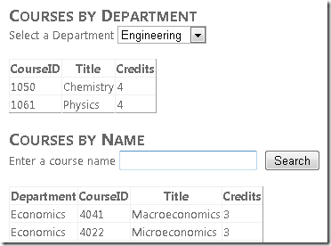](the-entity-framework-and-aspnet-getting-started-part-1/_static/image7.png)

[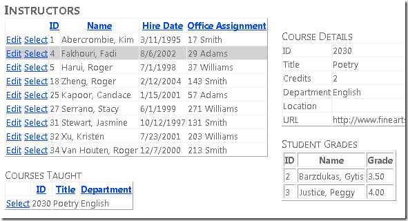](the-entity-framework-and-aspnet-getting-started-part-1/_static/image9.png)

## Creating the Web Application

To start the tutorial, open Visual Studio and then create a new ASP.NET Web Application Project using the **ASP.NET Web Application** template:

[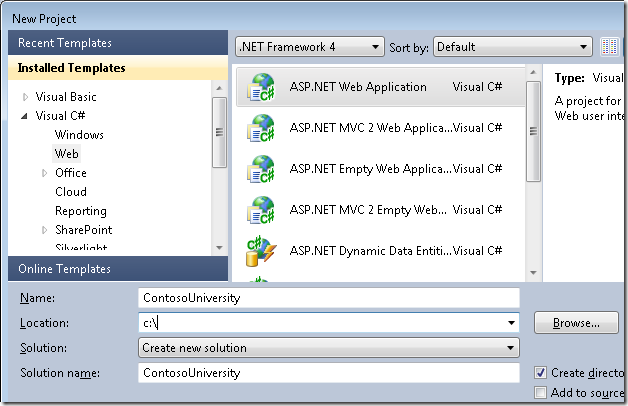](the-entity-framework-and-aspnet-getting-started-part-1/_static/image11.png)

This template creates a web application project that already includes a style sheet and master pages:

[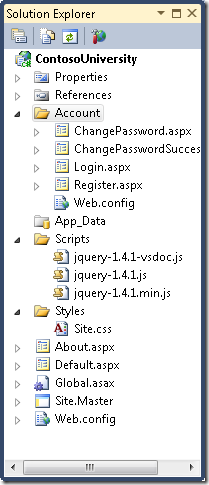](the-entity-framework-and-aspnet-getting-started-part-1/_static/image13.png)

Open the *Site.Master* file and change "My ASP.NET Application" to "Contoso University".

[!code-html[Main](the-entity-framework-and-aspnet-getting-started-part-1/samples/sample1.html)]

Find the *Menu* control named `NavigationMenu` and replace it with the following markup, which adds menu items for the pages you'll be creating.

[!code-aspx[Main](the-entity-framework-and-aspnet-getting-started-part-1/samples/sample2.aspx)]

Open the *Default.aspx* page and change the `Content` control named `BodyContent` to this:

[!code-aspx[Main](the-entity-framework-and-aspnet-getting-started-part-1/samples/sample3.aspx)]

You now have a simple home page with links to the various pages that you'll be creating:

## Creating the Database

For these tutorials, you'll use the Entity Framework data model designer to automatically create the data model based on an existing database (often called the *database-first* approach). An alternative that's not covered in this tutorial series is to create the data model manually and then have the designer generate scripts that create the database (the *model-first* approach).

For the database-first method used in this tutorial, the next step is to add a database to the site. The easiest way is to first download the project that goes with this tutorial. Then right-click the *App\_Data* folder, select **Add Existing Item**, and select the *School.mdf* database file from the downloaded project.

An alternative is to follow the instructions at [Creating the School Sample Database](https://msdn.microsoft.com/en-us/library/bb399731.aspx). Whether you download the database or create it, copy the *School.mdf* file from the following folder to your application's *App\_Data* folder:

`%PROGRAMFILES%\Microsoft SQL Server\MSSQL10.SQLEXPRESS\MSSQL\DATA`

(This location of the *.mdf* file assumes you're using SQL Server 2008 Express.)

If you create the database from a script, perform the following steps to create a database diagram:

1. In **Server Explorer**, expand **Data Connections**, expand *School.mdf*, right-click **Database Diagrams**, and select **Add New Diagram**.

    [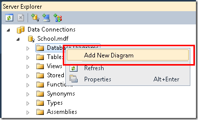](the-entity-framework-and-aspnet-getting-started-part-1/_static/image17.png)
2. Select all of the tables and then click **Add**.

    

    SQL Server creates a database diagram that shows tables, columns in the tables, and relationships between the tables. You can move the tables around to organize them however you like.
3. Save the diagram as "SchoolDiagram" and close it.

If you download the *School.mdf* file that goes with this tutorial, you can view the database diagram by double-clicking **SchoolDiagram** under **Database Diagrams** in **Server Explorer**.

[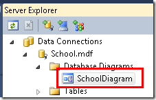](the-entity-framework-and-aspnet-getting-started-part-1/_static/image21.png)

The diagram looks something like this (the tables might be in different locations from what's shown here):

[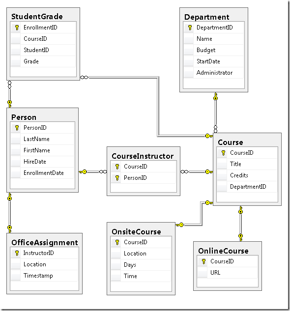](the-entity-framework-and-aspnet-getting-started-part-1/_static/image23.png)

## Creating the Entity Framework Data Model

Now you can create an Entity Framework data model from this database. You could create the data model in the root folder of the application, but for this tutorial you'll place it in a folder named *DAL* (for Data Access Layer).

In **Solution Explorer**, add a project folder named *DAL* (make sure it's under the project, not under the solution).

Right-click the *DAL* folder and then select **Add** and **New Item**. Under **Installed Templates**, select **Data**, select the **ADO.NET Entity Data Model** template, name it *SchoolModel.edmx*, and then click **Add**.

[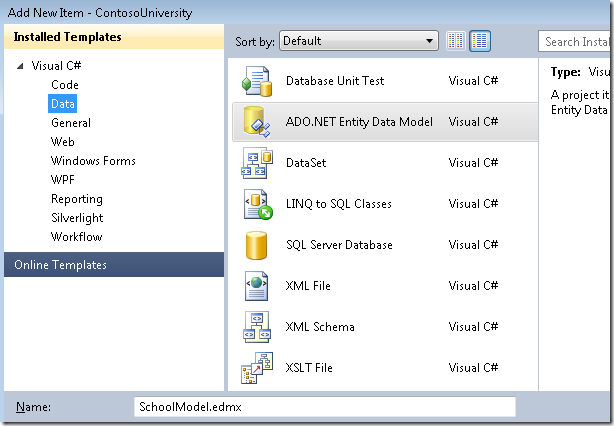](the-entity-framework-and-aspnet-getting-started-part-1/_static/image25.png)

This starts the Entity Data Model Wizard. In the first wizard step, the **Generate from database** option is selected by default. Click **Next**.

[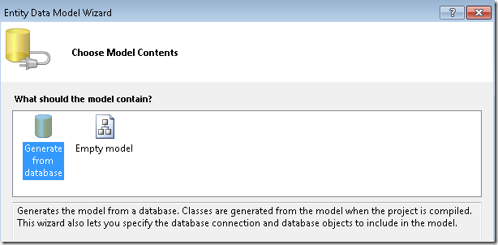](the-entity-framework-and-aspnet-getting-started-part-1/_static/image27.png)

In the **Choose Your Data Connection** step, leave the default values and click **Next**. The School database is selected by default and the connection setting is saved in the *Web.config* file as **SchoolEntities**.

[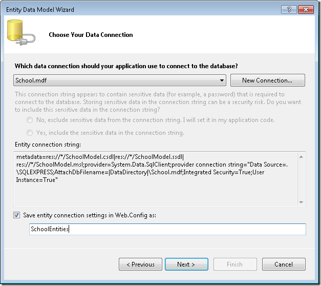](the-entity-framework-and-aspnet-getting-started-part-1/_static/image29.png)

In the **Choose Your Database Objects** wizard step, select all of the tables except `sysdiagrams` (which was created for the diagram you generated earlier) and then click **Finish**.

[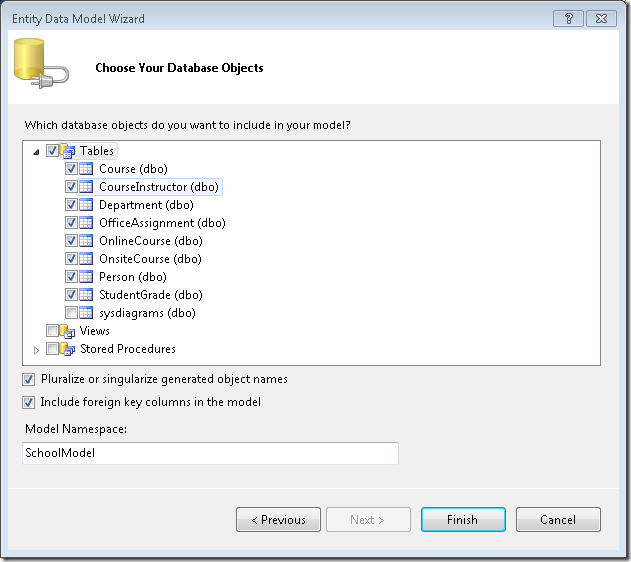](the-entity-framework-and-aspnet-getting-started-part-1/_static/image31.png)

After it's finished creating the model, Visual Studio shows you a graphical representation of the Entity Framework objects (entities) that correspond to your database tables. (As with the database diagram, the location of individual elements might be different from what you see in this illustration. You can drag the elements around to match the illustration if you want.)

[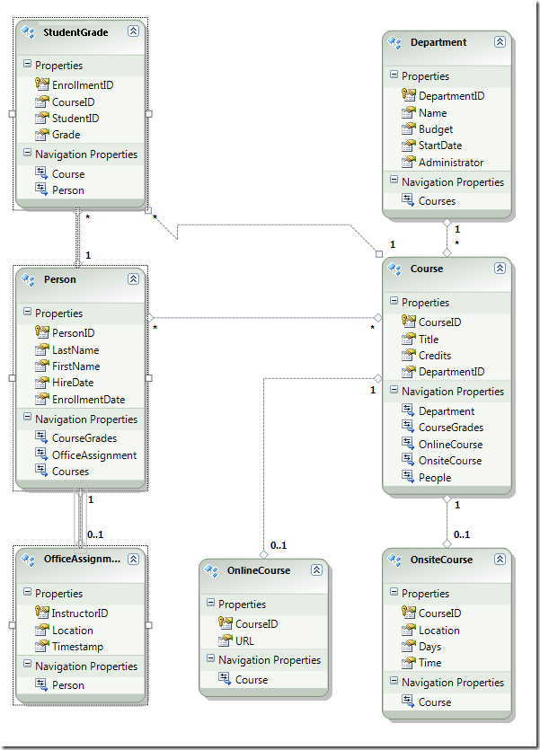](the-entity-framework-and-aspnet-getting-started-part-1/_static/image33.png)

## Exploring the Entity Framework Data Model

You can see that the entity diagram looks very similar to the database diagram, with a couple of differences. One difference is the addition of symbols at the end of each association that indicate the type of association (table relationships are called entity associations in the data model):

- A one-to-zero-or-one association is represented by "1" and "0..1".

    [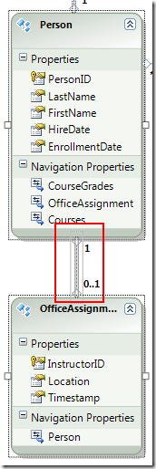](the-entity-framework-and-aspnet-getting-started-part-1/_static/image35.png)

    In this case, a `Person` entity may or may not be associated with an `OfficeAssignment` entity. An `OfficeAssignment` entity must be associated with a `Person` entity. In other words, an instructor may or may not be assigned to an office, and any office can be assigned to only one instructor.
- A one-to-many association is represented by "1" and "\*".

    [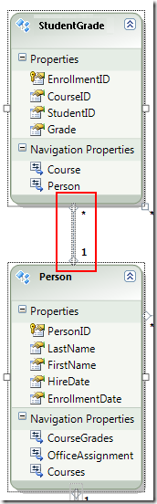](the-entity-framework-and-aspnet-getting-started-part-1/_static/image37.png)

    In this case, a `Person` entity may or may not have associated `StudentGrade` entities. A `StudentGrade` entity must be associated with one `Person` entity. `StudentGrade` entities actually represent enrolled courses in this database; if a student is enrolled in a course and there's no grade yet, the `Grade` property is null. In other words, a student may not be enrolled in any courses yet, may be enrolled in one course, or may be enrolled in multiple courses. Each grade in an enrolled course applies to only one student.
- A many-to-many association is represented by "\*" and "\*".

    [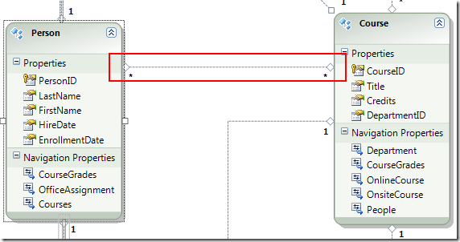](the-entity-framework-and-aspnet-getting-started-part-1/_static/image39.png)

    In this case, a `Person` entity may or may not have associated `Course` entities, and the reverse is also true: a `Course` entity may or may not have associated `Person` entities. In other words, an instructor may teach multiple courses, and a course may be taught by multiple instructors. (In this database, this relationship applies only to instructors; it does not link students to courses. Students are linked to courses by the StudentGrades table.)

Another difference between the database diagram and the data model is the additional **Navigation Properties** section for each entity. A navigation property of an entity references related entities. For example, the `Courses` property in a `Person` entity contains a collection of all the `Course` entities that are related to that `Person` entity.

[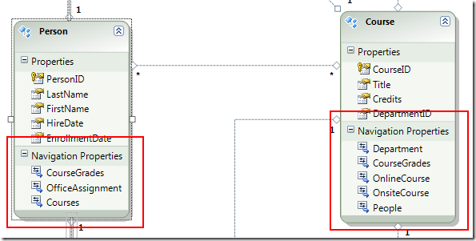](the-entity-framework-and-aspnet-getting-started-part-1/_static/image41.png)

Yet another difference between the database and data model is the absence of the `CourseInstructor` association table that's used in the database to link the `Person` and `Course` tables in a many-to-many relationship. The navigation properties enable you to get related `Course` entities from the `Person` entity and related `Person` entities from the `Course` entity, so there's no need to represent the association table in the data model.

[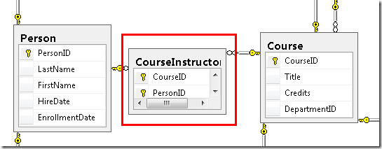](the-entity-framework-and-aspnet-getting-started-part-1/_static/image43.png)

For purposes of this tutorial, suppose the `FirstName` column of the `Person` table actually contains both a person's first name and middle name. You want to change the name of the field to reflect this, but the database administrator (DBA) might not want to change the database. You can change the name of the `FirstName` property in the data model, while leaving its database equivalent unchanged.

In the designer, right-click **FirstName** in the `Person` entity, and then select **Rename**.

[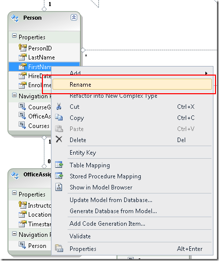](the-entity-framework-and-aspnet-getting-started-part-1/_static/image45.png)

Type in the new name "FirstMidName". This changes the way you refer to the column in code without changing the database.

[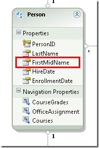](the-entity-framework-and-aspnet-getting-started-part-1/_static/image47.png)

The model browser provides another way to view the database structure, the data model structure, and the mapping between them. To see it, right-click a blank area in the entity designer and then click **Model Browser**.

[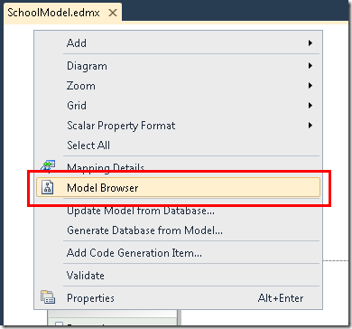](the-entity-framework-and-aspnet-getting-started-part-1/_static/image49.png)

The **Model Browser** pane displays a tree view. (The **Model Browser** pane might be docked with the **Solution Explorer** pane.) The **SchoolModel** node represents the data model structure, and the **SchoolModel.Store** node represents the database structure.

[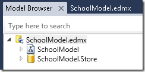](the-entity-framework-and-aspnet-getting-started-part-1/_static/image51.png)

Expand **SchoolModel.Store** to see the tables, expand **Tables / Views** to see tables, and then expand **Course** to see the columns within a table.

[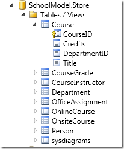](the-entity-framework-and-aspnet-getting-started-part-1/_static/image53.png)

Expand **SchoolModel**, expand **Entity Types**, and then expand the **Course** node to see the entities and the properties within the entities.

[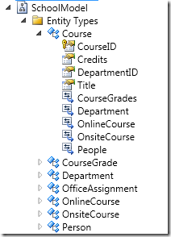](the-entity-framework-and-aspnet-getting-started-part-1/_static/image55.png)

In either the designer or the **Model Browser** pane you can see how the Entity Framework relates the objects of the two models. Right-click the `Person` entity and select **Table Mapping**.

This opens the **Mapping Details** window. Notice that this window lets you see that the database column `FirstName` is mapped to `FirstMidName`, which is what you renamed it to in the data model.

[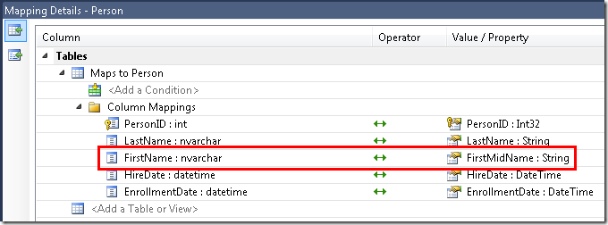](the-entity-framework-and-aspnet-getting-started-part-1/_static/image59.png)

The Entity Framework uses XML to store information about the database, the data model, and the mappings between them. The *SchoolModel.edmx* file is actually an XML file that contains this information. The designer renders the information in a graphical format, but you can also view the file as XML by right-clicking the *.edmx* file in **Solution Explorer**, clicking **Open With**, and selecting **XML (Text) Editor**. (The data model designer and an XML editor are just two different ways of opening and working with the same file, so you cannot have the designer open and open the file in an XML editor at the same time.)

You've now created a website, a database, and a data model. In the next walkthrough you'll begin working with data using the data model and the ASP.NET `EntityDataSource` control.

>[!div class="step-by-step"]
[Next](the-entity-framework-and-aspnet-getting-started-part-2.md)