Getting Started with Entity Framework 4.0 Database First and ASP.NET 4 Web Forms - Part 2
====================
by [Tom Dykstra](https://github.com/tdykstra)

> The Contoso University sample web application demonstrates how to create ASP.NET Web Forms applications using the Entity Framework 4.0 and Visual Studio 2010. For information about the tutorial series, see [the first tutorial in the series](the-entity-framework-and-aspnet-getting-started-part-1.md)

## The EntityDataSource Control

In the previous tutorial you created a web site, a database, and a data model. In this tutorial you work with the `EntityDataSource` control that ASP.NET provides in order to make it easy to work with an Entity Framework data model. You'll create a `GridView` control for displaying and editing student data, a `DetailsView` control for adding new students, and a `DropDownList` control for selecting a department (which you'll use later for displaying associated courses).

[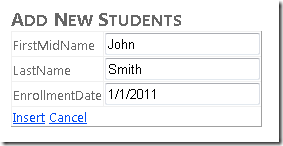](the-entity-framework-and-aspnet-getting-started-part-2/_static/image3.png)

[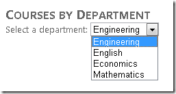](the-entity-framework-and-aspnet-getting-started-part-2/_static/image5.png)

Note that in this application you won't be adding input validation to pages that update the database, and some of the error handling will not be as robust as would be required in a production application. That keeps the tutorial focused on the Entity Framework and keeps it from getting too long. For details about how to add these features to your application, see [Validating User Input in ASP.NET Web Pages](https://msdn.microsoft.com/en-us/library/7kh55542.aspx) and [Error Handling in ASP.NET Pages and Applications](https://msdn.microsoft.com/en-us/library/w16865z6.aspx).

## Adding and Configuring the EntityDataSource Control

You'll begin by configuring an `EntityDataSource` control to read `Person` entities from the `People` entity set.

Make sure you have Visual Studio open and that you're working with the project you created in part 1. If you haven't built the project since you created the data model or since the last change you made to it, build the project now. Changes to the data model are not made available to the designer until the project is built.

Create a new web page using the **Web Form using Master Page** template, and name it *Students.aspx*.

[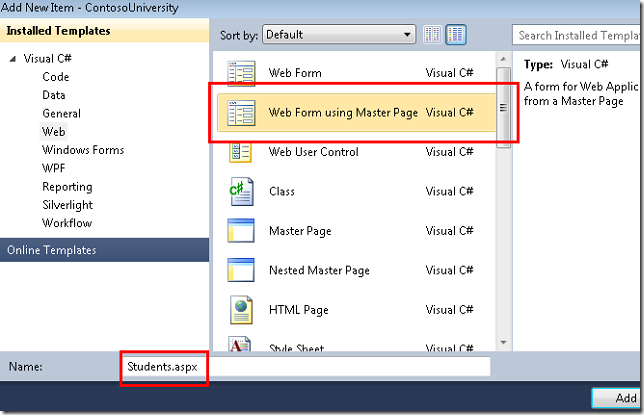](the-entity-framework-and-aspnet-getting-started-part-2/_static/image7.png)

Specify *Site.Master* as the master page. All of the pages you create for these tutorials will use this master page.

[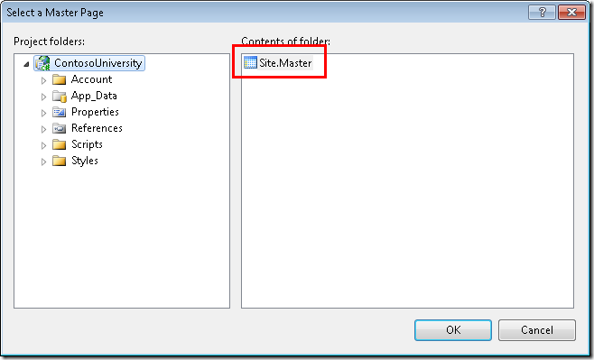](the-entity-framework-and-aspnet-getting-started-part-2/_static/image9.png)

In **Source** view, add an `h2` heading to the `Content` control named `Content2`, as shown in the following example:

[!code-aspx[Main](the-entity-framework-and-aspnet-getting-started-part-2/samples/sample1.aspx)]

From the **Data** tab of the **Toolbox**, drag an `EntityDataSource` control to the page, drop it below the heading, and change the ID to `StudentsEntityDataSource`:

[!code-aspx[Main](the-entity-framework-and-aspnet-getting-started-part-2/samples/sample2.aspx)]

Switch to **Design** view, click the data source control's smart tag, and then click **Configure Data Source** to launch the **Configure Data Source** wizard.

[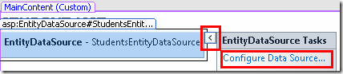](the-entity-framework-and-aspnet-getting-started-part-2/_static/image11.png)

In the **Configure ObjectContext** wizard step, select **SchoolEntities** as the value for **Named Connection**, and select **SchoolEntities** as the **DefaultContainerName** value. Then click **Next**.

[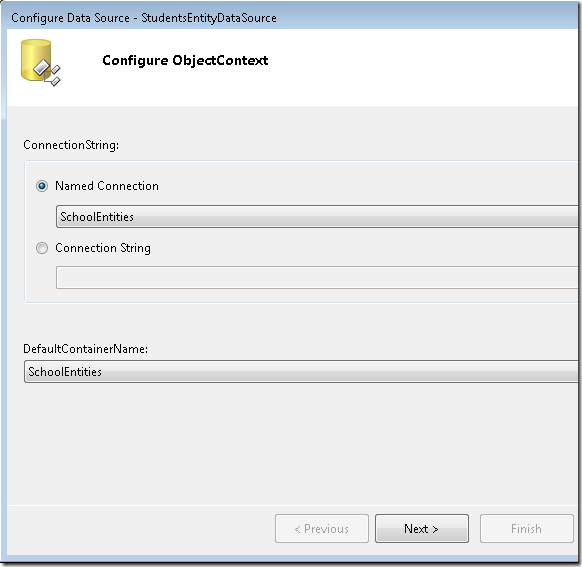](the-entity-framework-and-aspnet-getting-started-part-2/_static/image13.png)

Note: If you get the following dialog box at this point, you have to build the project before proceeding.

[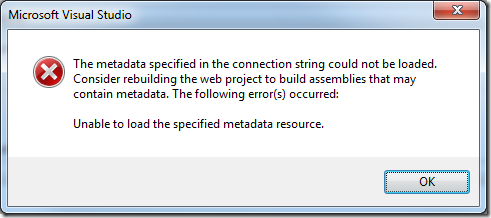](the-entity-framework-and-aspnet-getting-started-part-2/_static/image15.png)

In the **Configure Data Selection** step, select **People** as the value for **EntitySetName**. Under **Select**, make sure the **Select A** ll check box is selected. Then select the options to enable update and delete. When you're done, click **Finish**.

[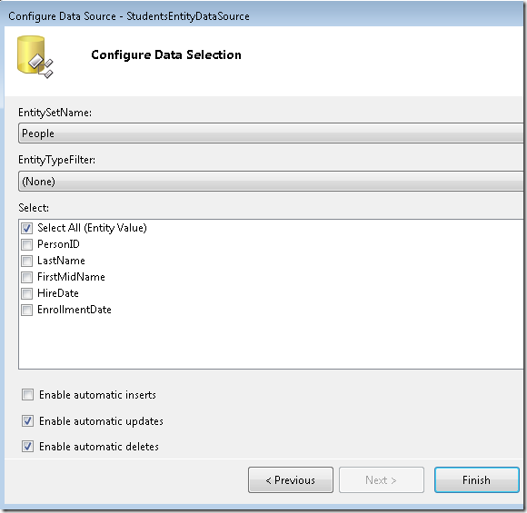](the-entity-framework-and-aspnet-getting-started-part-2/_static/image17.png)

## Configuring Database Rules to Allow Deletion

You'll be creating a page that lets users delete students from the `Person` table, which has three relationships with other tables (`Course`, `StudentGrade`, and `OfficeAssignment`). By default, the database will prevent you from deleting a row in `Person` if there are related rows in one of the other tables. You can manually delete the related rows first, or you can configure the database to delete them automatically when you delete a `Person` row. For student records in this tutorial, you'll configure the database to delete the related data automatically. Because students can have related rows only in the `StudentGrade` table, you need to configure only one of the three relationships.

If you're using the *School.mdf* file that you downloaded from the project that goes with this tutorial, you can skip this section because these configuration changes have already been done. If you created the database by running a script, configure the database by performing the following procedures.

In **Server Explorer**, open the database diagram that you created in part 1. Right-click the relationship between `Person` and `StudentGrade` (the line between tables), and then select **Properties**.

[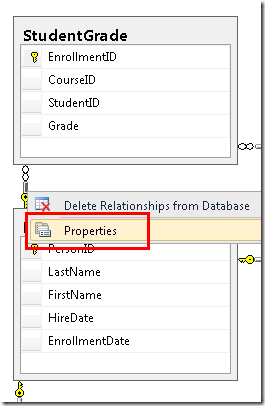](the-entity-framework-and-aspnet-getting-started-part-2/_static/image19.png)

In the **Properties** window, expand **INSERT and UPDATE Specification** and set the **DeleteRule** property to **Cascade**.

[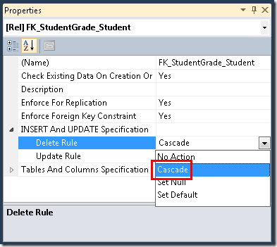](the-entity-framework-and-aspnet-getting-started-part-2/_static/image21.png)

Save and close the diagram. If you're asked whether you want to update the database, click **Yes**.

To make sure that the model keeps entities that are in memory in sync with what the database is doing, you must set corresponding rules in the data model. Open *SchoolModel.edmx*, right-click the association line between `Person` and `StudentGrade`, and then select **Properties**.

[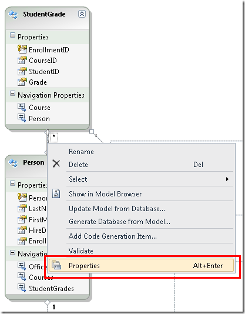](the-entity-framework-and-aspnet-getting-started-part-2/_static/image23.png)

In the **Properties** window, set **End1 OnDelete** to **Cascade**.

[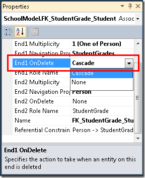](the-entity-framework-and-aspnet-getting-started-part-2/_static/image25.png)

Save and close the *SchoolModel.edmx* file, and then rebuild the project.

In general, when the database changes, you have several choices for how to sync up the model:

- For certain kinds of changes (such as adding or refreshing tables, views, or stored procedures), right-click in the designer and select **Update Model from Database** to have the designer make the changes automatically.
- Regenerate the data model.
- Make manual updates like this one.

In this case, you could have regenerated the model or refreshed the tables affected by the relationship change, but then you'd have to make the field-name change again (from `FirstName` to `FirstMidName`).

## Using a GridView Control to Read and Update Entities

In this section you'll use a `GridView` control to display, update, or delete students.

Open or switch to *Students.aspx* and switch to **Design** view. From the **Data** tab of the **Toolbox**, drag a `GridView` control to the right of the `EntityDataSource` control, name it `StudentsGridView`, click the smart tag, and then select **StudentsEntityDataSource** as the data source.

[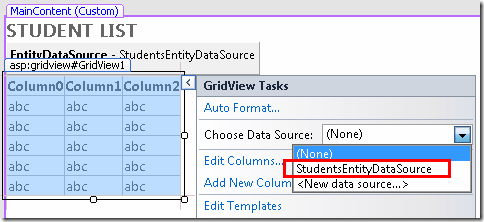](the-entity-framework-and-aspnet-getting-started-part-2/_static/image27.png)

Click **Refresh Schema** (click **Yes** if you're prompted to confirm), then click **Enable Paging**, **Enable Sorting**, **Enable Editing**, and **Enable Deleting**.

Click **Edit Columns**.

In the **Selected fields** box, delete **PersonID**, **LastName**, and **HireDate**. You typically don't display a record key to users, hire date is not relevant to students, and you'll put both parts of the name in one field, so you only need one of the name fields.)

[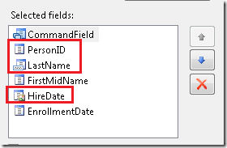](the-entity-framework-and-aspnet-getting-started-part-2/_static/image31.png)

Select the **FirstMidName** field and then click **Convert this field into a TemplateField**.

Do the same for **EnrollmentDate**.

[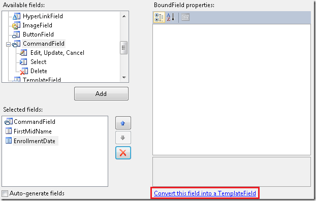](the-entity-framework-and-aspnet-getting-started-part-2/_static/image33.png)

Click **OK** and then switch to **Source** view. The remaining changes will be easier to do directly in markup. The `GridView` control markup now looks like the following example.

[!code-aspx[Main](the-entity-framework-and-aspnet-getting-started-part-2/samples/sample3.aspx)]

The first column after the command field is a template field that currently displays the first name. Change the markup for this template field to look like the following example:

[!code-aspx[Main](the-entity-framework-and-aspnet-getting-started-part-2/samples/sample4.aspx)]

In display mode, two `Label` controls display the first and last name. In edit mode, two text boxes are provided so you can change the first and last name. As with the `Label` controls in display mode, you use `Bind` and `Eval` expressions exactly as you would with ASP.NET data source controls that connect directly to databases. The only difference is that you're specifying entity properties instead of database columns.

The last column is a template field that displays the enrollment date. Change the markup for this field to look like the following example:

[!code-aspx[Main](the-entity-framework-and-aspnet-getting-started-part-2/samples/sample5.aspx)]

In both display and edit mode, the format string "{0,d}" causes the date to be displayed in the "short date" format. (Your computer might be configured to display this format differently from the screen images shown in this tutorial.)

Notice that in each of these template fields, the designer used a `Bind` expression by default, but you've changed that to an `Eval` expression in the `ItemTemplate` elements. The `Bind` expression makes the data available in `GridView` control properties in case you need to access the data in code. In this page you don't need to access this data in code, so you can use `Eval`, which is more efficient. For more information, see [Getting your data out of the data controls](https://weblogs.asp.net/davidfowler/archive/2008/12/12/getting-your-data-out-of-the-data-controls.aspx).

## Revising EntityDataSource Control Markup to Improve Performance

In the markup for the `EntityDataSource` control, remove the `ConnectionString` and `DefaultContainerName` attributes and replace them with a `ContextTypeName="ContosoUniversity.DAL.SchoolEntities"` attribute. This is a change you should make every time you create an `EntityDataSource` control, unless you need to use a connection that is different from the one that's hard-coded in the object context class. Using the `ContextTypeName` attribute provides the following benefits:

- Better performance. When the `EntityDataSource` control initializes the data model using the `ConnectionString` and `DefaultContainerName` attributes, it performs additional work to load metadata on every request. This isn't necessary if you specify the `ContextTypeName` attribute.
- Lazy loading is turned on by default in generated object context classes (such as `SchoolEntities` in this tutorial) in Entity Framework 4.0. This means that navigation properties are loaded with related data automatically right when you need it. Lazy loading is explained in more detail later in this tutorial.
- Any customizations that you've applied to the object context class (in this case, the `SchoolEntities` class) will be available to controls that use the `EntityDataSource` control. Customizing the object context class is an advanced topic that is not covered in this tutorial series. For more information, see [Extending Entity Framework Generated Types](https://msdn.microsoft.com/en-us/library/dd456844.aspx).

The markup will now resemble the following example (the order of the properties might be different):

[!code-aspx[Main](the-entity-framework-and-aspnet-getting-started-part-2/samples/sample6.aspx)]

The `EnableFlattening` attribute refers to a feature that was needed in earlier versions of the Entity Framework because foreign key columns were not exposed as entity properties. The current version makes it possible to use *foreign key associations*, which means foreign key properties are exposed for all but many-to-many associations. If your entities have foreign key properties and no [complex types](https://msdn.microsoft.com/en-us/library/bb738472.aspx), you can leave this attribute set to `False`. Don't remove the attribute from the markup, because the default value is `True`. For more information, see [Flattening Objects (EntityDataSource)](https://msdn.microsoft.com/en-us/library/ee404746.aspx).

Run the page and you see a list of students and employees (you'll filter for just students in the next tutorial). The first name and last name are displayed together.

To sort the display, click a column name.

Click **Edit** in any row. Text boxes are displayed where you can change the first and last name.

[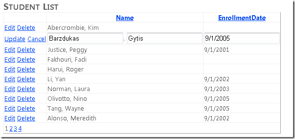](the-entity-framework-and-aspnet-getting-started-part-2/_static/image37.png)

The **Delete** button also works. Click delete for a row that has an enrollment date and the row disappears. (Rows without an enrollment date represent instructors and you may get a referential integrity error. In the next tutorial you'll filter this list to include just students.)

## Displaying Data from a Navigation Property

Now suppose you want to know how many courses each student is enrolled in. The Entity Framework provides that information in the `StudentGrades` navigation property of the `Person` entity. Because the database design does not allow a student to be enrolled in a course without having a grade assigned, for this tutorial you can assume that having a row in the `StudentGrade` table row that is associated with a course is the same as being enrolled in the course. (The `Courses` navigation property is only for instructors.)

When you use the `ContextTypeName` attribute of the `EntityDataSource` control, the Entity Framework automatically retrieves information for a navigation property when you access that property. This is called *lazy loading*. However, this can be inefficient, because it results in a separate call to the database each time additional information is needed. If you need data from the navigation property for every entity returned by the `EntityDataSource` control, it's more efficient to retrieve the related data along with the entity itself in a single call to the database. This is called *eager loading*, and you specify eager loading for a navigation property by setting the `Include` property of the `EntityDataSource` control.

In *Students.aspx*, you want to show the number of courses for every student, so eager loading is the best choice. If you were displaying all students but showing the number of courses only for a few of them (which would require writing some code in addition to the markup), lazy loading might be a better choice.

Open or switch to *Students.aspx*, switch to **Design** view, select `StudentsEntityDataSource`, and in the **Properties** window set the **Include** property to **StudentGrades**. (If you wanted to get multiple navigation properties, you could specify their names separated by commas — for example, **StudentGrades, Courses**.)

[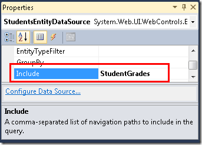](the-entity-framework-and-aspnet-getting-started-part-2/_static/image39.png)

Switch to **Source** view. In the `StudentsGridView` control, after the last `asp:TemplateField` element, add the following new template field:

[!code-aspx[Main](the-entity-framework-and-aspnet-getting-started-part-2/samples/sample7.aspx)]

In the `Eval` expression, you can reference the navigation property `StudentGrades`. Because this property contains a collection, it has a `Count` property that you can use to display the number of courses in which the student is enrolled. In a later tutorial you'll see how to display data from navigation properties that contain single entities instead of collections. (Note that you cannot use `BoundField` elements to display data from navigation properties.)

Run the page and you now see how many courses each student is enrolled in.

## Using a DetailsView Control to Insert Entities

The next step is to create a page that has a `DetailsView` control that will let you add new students. Close the browser and then create a new web page using the *Site.Master* master page. Name the page *StudentsAdd.aspx*, and then switch to **Source** view.

Add the following markup to replace the existing markup for the `Content` control named `Content2`:

[!code-aspx[Main](the-entity-framework-and-aspnet-getting-started-part-2/samples/sample8.aspx)]

This markup creates an `EntityDataSource` control that is similar to the one you created in *Students.aspx*, except it enables insertion. As with the `GridView` control, the bound fields of the `DetailsView` control are coded exactly as they would be for a data control that connects directly to a database, except that they reference entity properties. In this case, the `DetailsView` control is used only for inserting rows, so you have set the default mode to `Insert`.

Run the page and add a new student.

Nothing will happen after you insert a new student, but if you now run *Students.aspx*, you'll see the new student information.

## Displaying Data in a Drop-Down List

In the following steps you'll databind a `DropDownList` control to an entity set using an `EntityDataSource` control. In this part of the tutorial, you won't do much with this list. In subsequent parts, though, you'll use the list to let users select a department to display courses associated with the department.

Create a new web page named *Courses.aspx*. In **Source** view, add a heading to the `Content` control that's named `Content2`:

[!code-aspx[Main](the-entity-framework-and-aspnet-getting-started-part-2/samples/sample9.aspx)]

In **Design** view, add an `EntityDataSource` control to the page as you did before, except this time name it `DepartmentsEntityDataSource`. Select **Departments** as the **EntitySetName** value, and select only the **DepartmentID** and **Name** properties.

[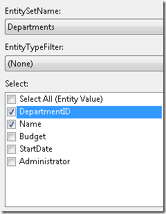](the-entity-framework-and-aspnet-getting-started-part-2/_static/image45.png)

From the **Standard** tab of the **Toolbox**, drag a `DropDownList` control to the page, name it `DepartmentsDropDownList`, click the smart tag, and select **Choose Data Source** to start the **DataSource Configuration Wizard**.

[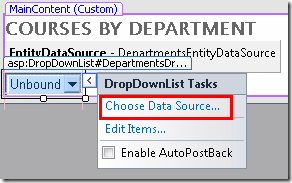](the-entity-framework-and-aspnet-getting-started-part-2/_static/image47.png)

In the **Choose a Data Source** step, select **DepartmentsEntityDataSource** as the data source, click **Refresh Schema**, and then select **Name** as the data field to display and **DepartmentID** as the value data field. Click **OK**.

[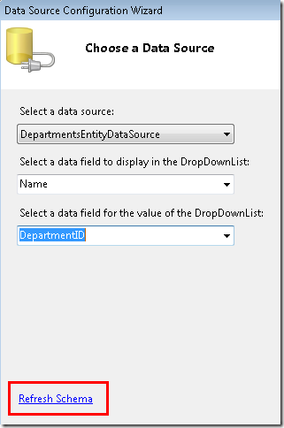](the-entity-framework-and-aspnet-getting-started-part-2/_static/image49.png)

The method you use to databind the control using the Entity Framework is the same as with other ASP.NET data source controls except you're specifying entities and entity properties.

Switch to **Source** view and add "Select a department:" immediately before the `DropDownList` control.

[!code-aspx[Main](the-entity-framework-and-aspnet-getting-started-part-2/samples/sample10.aspx)]

As a reminder, change the markup for the `EntityDataSource` control at this point by replacing the `ConnectionString` and `DefaultContainerName` attributes with a `ContextTypeName="ContosoUniversity.DAL.SchoolEntities"` attribute. It's often best to wait until after you've created the data-bound control that is linked to the data source control before you change the `EntityDataSource` control markup, because after you make the change, the designer will not provide you with a **Refresh Schema** option in the data-bound control.

Run the page and you can select a department from the drop-down list.

This completes the introduction to using the `EntityDataSource` control. Working with this control is generally no different from working with other ASP.NET data source controls, except that you reference entities and properties instead of tables and columns. The only exception is when you want to access navigation properties. In the next tutorial you'll see that the syntax you use with `EntityDataSource` control might also differ from other data source controls when you filter, group, and order data.

>[!div class="step-by-step"]
[Previous](the-entity-framework-and-aspnet-getting-started-part-1.md)
[Next](the-entity-framework-and-aspnet-getting-started-part-3.md)