Getting Started with Entity Framework 4.0 Database First and ASP.NET 4 Web Forms - Part 3
====================
by [Tom Dykstra](https://github.com/tdykstra)

> The Contoso University sample web application demonstrates how to create ASP.NET Web Forms applications using the Entity Framework 4.0 and Visual Studio 2010. For information about the tutorial series, see [the first tutorial in the series](the-entity-framework-and-aspnet-getting-started-part-1.md)

## Filtering, Ordering, and Grouping Data

In the previous tutorial you used the `EntityDataSource` control to display and edit data. In this tutorial you'll filter, order, and group data. When you do this by setting properties of the `EntityDataSource` control, the syntax is different from other data source controls. As you'll see, however, you can use the `QueryExtender` control to minimize these differences.

You'll change the *Students.aspx* page to filter for students, sort by name, and search on name. You'll also change the *Courses.aspx* page to display courses for the selected department and search for courses by name. Finally, you'll add student statistics to the *About.aspx* page.

[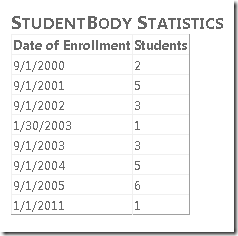](the-entity-framework-and-aspnet-getting-started-part-3/_static/image5.png)

## Using the EntityDataSource "Where" Property to Filter Data

Open the *Students.aspx* page that you created in the previous tutorial. As currently configured, the `GridView` control in the page displays all the names from the `People` entity set. However, you want to show only students, which you can find by selecting `Person` entities that have non-null enrollment dates.

Switch to **Design** view and select the `EntityDataSource` control. In the **Properties** window, set the `Where` property to `it.EnrollmentDate is not null`.

[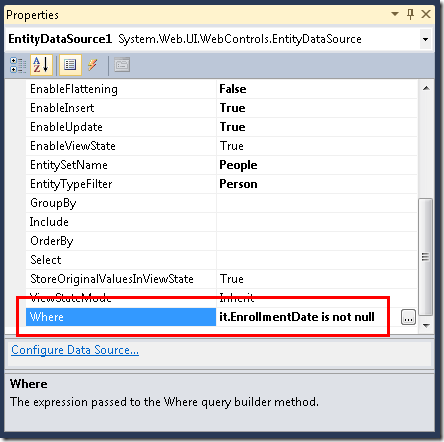](the-entity-framework-and-aspnet-getting-started-part-3/_static/image9.png)

The syntax you use in the `Where` property of the `EntityDataSource` control is Entity SQL. Entity SQL is similar to Transact-SQL, but it's customized for use with entities rather than database objects. In the expression `it.EnrollmentDate is not null`, the word `it` represents a reference to the entity returned by the query. Therefore, `it.EnrollmentDate` refers to the `EnrollmentDate` property of the `Person` entity that the `EntityDataSource` control returns.

Run the page. The students list now contains only students. (There are no rows displayed where there's no enrollment date.)

[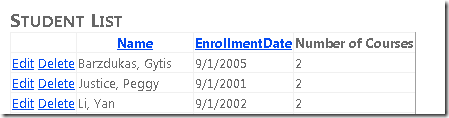](the-entity-framework-and-aspnet-getting-started-part-3/_static/image11.png)

## Using the EntityDataSource "OrderBy" Property to Order Data

You also want this list to be in name order when it's first displayed. With the *Students.aspx* page still open in **Design** view, and with the `EntityDataSource` control still selected, in the **Properties** window set the **OrderBy** property to `it.LastName`.

[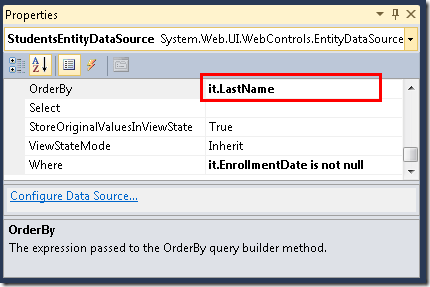](the-entity-framework-and-aspnet-getting-started-part-3/_static/image13.png)

Run the page. The students list is now in order by last name.

[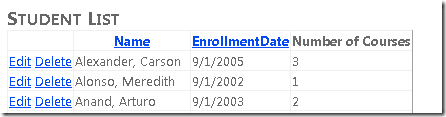](the-entity-framework-and-aspnet-getting-started-part-3/_static/image15.png)

## Using a Control Parameter to Set the "Where" Property

As with other data source controls, you can pass parameter values to the `Where` property. On the *Courses.aspx* page that you created in part 2 of the tutorial, you can use this method to display courses that are associated with the department that a user selects from the drop-down list.

Open *Courses.aspx* and switch to **Design** view. Add a second `EntityDataSource` control to the page, and name it `CoursesEntityDataSource`. Connect it to the `SchoolEntities` model, and select `Courses` as the **EntitySetName** value.

In the **Properties** window, click the ellipsis in the **Where** property box. (Make sure the `CoursesEntityDataSource` control is still selected before using the **Properties** window.)

[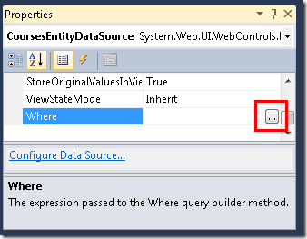](the-entity-framework-and-aspnet-getting-started-part-3/_static/image17.png)

The **Expression Editor** dialog box is displayed. In this dialog box, select **Automatically generate the Where expression based on the provided parameters**, and then click **Add Parameter**. Name the parameter `DepartmentID`, select **Control** as the **Parameter source** value, and select **DepartmentsDropDownList** as the **ControlID** value.

[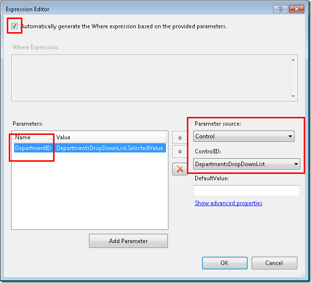](the-entity-framework-and-aspnet-getting-started-part-3/_static/image19.png)

Click **Show advanced properties**, and in the **Properties** window of the **Expression Editor** dialog box, change the `Type` property to `Int32`.

[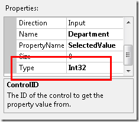](the-entity-framework-and-aspnet-getting-started-part-3/_static/image21.png)

When you're done, click **OK**.

Below the drop-down list, add a `GridView` control to the page and name it `CoursesGridView`. Connect it to the `CoursesEntityDataSource` data source control, click **Refresh Schema**, click **Edit Columns**, and remove the `DepartmentID` column. The `GridView` control markup resembles the following example.

[!code-aspx[Main](the-entity-framework-and-aspnet-getting-started-part-3/samples/sample1.aspx)]

When the user changes the selected department in the drop-down list, you want the list of associated courses to change automatically. To make this happen, select the drop-down list, and in the **Properties** window set the `AutoPostBack` property to `True`.

[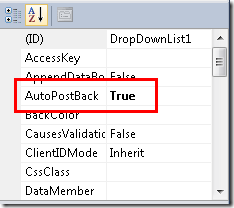](the-entity-framework-and-aspnet-getting-started-part-3/_static/image23.png)

Now that you're finished using the designer, switch to **Source** view and replace the `ConnectionString` and `DefaultContainer` name properties of the `CoursesEntityDataSource` control with the `ContextTypeName="ContosoUniversity.DAL.SchoolEntities"` attribute. When you're done, the markup for the control will look like the following example.

[!code-aspx[Main](the-entity-framework-and-aspnet-getting-started-part-3/samples/sample2.aspx)]

Run the page and use the drop-down list to select different departments. Only courses that are offered by the selected department are displayed in the `GridView` control.

[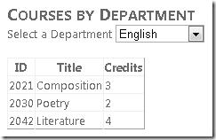](the-entity-framework-and-aspnet-getting-started-part-3/_static/image25.png)

## Using the EntityDataSource "GroupBy" Property to Group Data

Suppose Contoso University wants to put some student-body statistics on its About page. Specifically, it wants to show a breakdown of numbers of students by the date they enrolled.

Open *About.aspx*, and in **Source** view, replace the existing contents of the `BodyContent` control with "Student Body Statistics" between `h2` tags:

[!code-aspx[Main](the-entity-framework-and-aspnet-getting-started-part-3/samples/sample3.aspx)]

After the heading, add an `EntityDataSource` control and name it `StudentStatisticsEntityDataSource`. Connect it to `SchoolEntities`, select the `People` entity set, and leave the **Select** box in the wizard unchanged. Set the following properties in the **Properties** window:

- To filter for students only, set the `Where` property to `it.EnrollmentDate is not null`.
- To group the results by the enrollment date, set the `GroupBy` property to `it.EnrollmentDate`.
- To select the enrollment date and the number of students, set the `Select` property to `it.EnrollmentDate, Count(it.EnrollmentDate) AS NumberOfStudents`.
- To order the results by the enrollment date, set the `OrderBy` property to `it.EnrollmentDate`.

In **Source** view, replace the `ConnectionString` and `DefaultContainer` name properties with a `ContextTypeName` property. The `EntityDataSource` control markup now resembles the following example.

[!code-aspx[Main](the-entity-framework-and-aspnet-getting-started-part-3/samples/sample4.aspx)]

The syntax of the `Select`, `GroupBy`, and `Where` properties resembles Transact-SQL except for the `it` keyword that specifies the current entity.

Add the following markup to create a `GridView` control to display the data.

[!code-aspx[Main](the-entity-framework-and-aspnet-getting-started-part-3/samples/sample5.aspx)]

Run the page to see a list showing the number of students by enrollment date.

## Using the QueryExtender Control for Filtering and Ordering

The `QueryExtender` control provides a way to specify filtering and sorting in markup. The syntax is independent of the database management system (DBMS) you're using. It's also generally independent of the Entity Framework, with the exception that syntax you use for navigation properties is unique to the Entity Framework.

In this part of the tutorial you'll use a `QueryExtender` control to filter and order data, and one of the order-by fields will be a navigation property.

(If you prefer to use code instead of markup to extend the queries that are automatically generated by the `EntityDataSource` control, you can do that by handling the `QueryCreated` event. This is how the `QueryExtender` control extends `EntityDataSource` control queries also.)

Open the *Courses.aspx* page, and below the markup you added previously, insert the following markup to create a heading, a text box for entering search strings, a search button, and an `EntityDataSource` control that's bound to the `Courses` entity set.

[!code-aspx[Main](the-entity-framework-and-aspnet-getting-started-part-3/samples/sample6.aspx)]

Notice that the `EntityDataSource` control's `Include` property is set to `Department`. In the database, the `Course` table does not contain the department name; it contains a `DepartmentID` foreign key column. If you were querying the database directly, to get the department name along with course data, you would have to join the `Course` and `Department` tables. By setting the `Include` property to `Department`, you specify that the Entity Framework should do the work of getting the related `Department` entity when it gets a `Course` entity. The `Department` entity is then stored in the `Department` navigation property of the `Course` entity. (By default, the `SchoolEntities` class that was generated by the data model designer retrieves related data when it's needed, and you've bound the data source control to that class, so setting the `Include` property is not necessary. However, setting it improves performance of the page, because otherwise the Entity Framework would make separate calls to the database to retrieve data for the `Course` entities and for the related `Department` entities.)

After the `EntityDataSource` control you just created, insert the following markup to create a `QueryExtender` control that's bound to that `EntityDataSource` control.

[!code-aspx[Main](the-entity-framework-and-aspnet-getting-started-part-3/samples/sample7.aspx)]

The `SearchExpression` element specifies that you want to select courses whose titles match the value entered in the text box. Only as many characters as are entered in the text box will be compared, because the `SearchType` property specifies `StartsWith`.

The `OrderByExpression` element specifies that the result set will be ordered by course title within department name. Notice how department name is specified: `Department.Name`. Because the association between the `Course` entity and the `Department` entity is one-to-one, the `Department` navigation property contains a `Department` entity. (If this were a one-to-many relationship, the property would contain a collection.) To get the department name, you must specify the `Name` property of the `Department` entity.

Finally, add a `GridView` control to display the list of courses:

[!code-aspx[Main](the-entity-framework-and-aspnet-getting-started-part-3/samples/sample8.aspx)]

The first column is a template field that displays the department name. The databinding expression specifies `Department.Name`, just as you saw in the `QueryExtender` control.

Run the page. The initial display shows a list of all courses in order by department and then by course title.

[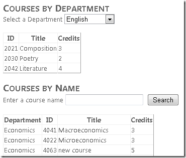](the-entity-framework-and-aspnet-getting-started-part-3/_static/image29.png)

Enter an "m" and click **Search** to see all courses whose titles begin with "m" (the search is not case sensitive).

[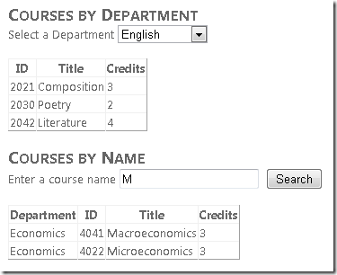](the-entity-framework-and-aspnet-getting-started-part-3/_static/image31.png)

## Using the "Like" Operator to Filter Data

You can achieve an effect similar to the `QueryExtender` control's `StartsWith`, `Contains`, and `EndsWith` search types by using a `Like` operator in the `EntityDataSource` control's `Where` property. In this part of the tutorial, you'll see how to use the `Like` operator to search for a student by name.

Open *Students.aspx* in **Source** view. After the `GridView` control, add the following markup:

[!code-aspx[Main](the-entity-framework-and-aspnet-getting-started-part-3/samples/sample9.aspx)]

This markup is similar to what you've seen earlier except for the `Where` property value. The second part of the `Where` expression defines a substring search (`LIKE %FirstMidName% or LIKE %LastName%`) that searches both the first and last names for whatever is entered in the text box.

Run the page. Initially you see all of the students because the default value for the `StudentName` parameter is "%".

[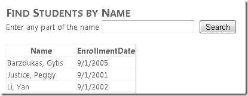](the-entity-framework-and-aspnet-getting-started-part-3/_static/image33.png)

Enter the letter "g" in the text box and click **Search**. You see a list of students that have a "g" in either the first or last name.

[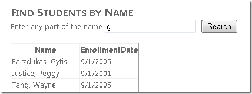](the-entity-framework-and-aspnet-getting-started-part-3/_static/image35.png)

You've now displayed, updated, filtered, ordered, and grouped data from individual tables. In the next tutorial you'll begin to work with related data (master-detail scenarios).

>[!div class="step-by-step"]
[Previous](the-entity-framework-and-aspnet-getting-started-part-2.md)
[Next](the-entity-framework-and-aspnet-getting-started-part-4.md)