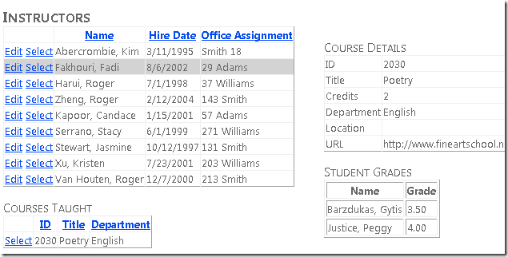
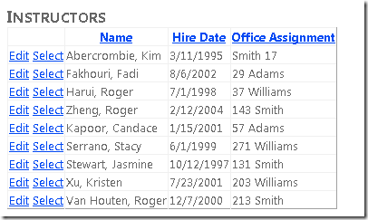
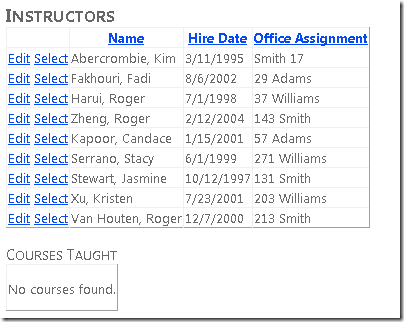
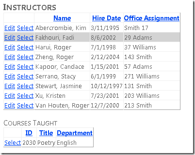
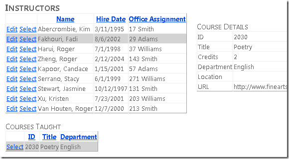
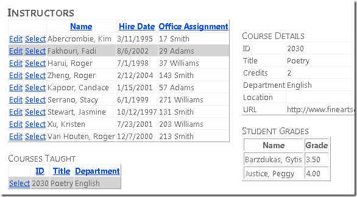

Getting Started with Entity Framework 4.0 Database First and ASP.NET 4 Web Forms - Part 4
====================
by [Tom Dykstra](https://github.com/tdykstra)

> The Contoso University sample web application demonstrates how to create ASP.NET Web Forms applications using the Entity Framework 4.0 and Visual Studio 2010. For information about the tutorial series, see [the first tutorial in the series](the-entity-framework-and-aspnet-getting-started-part-1.md)

## Working with Related Data

In the previous tutorial you used the `EntityDataSource` control to filter, sort, and group data. In this tutorial you'll display and update related data.

You'll create the Instructors page that shows a list of instructors. When you select an instructor, you see a list of courses taught by that instructor. When you select a course, you see details for the course and a list of students enrolled in the course. You can edit the instructor name, hire date, and office assignment. The office assignment is a separate entity set that you access through a navigation property.

You can link master data to detail data in markup or in code. In this part of the tutorial, you'll use both methods.

## Displaying and Updating Related Entities in a GridView Control

Create a new web page named *Instructors.aspx* that uses the *Site.Master* master page, and add the following markup to the `Content` control named `Content2`:

[!code-aspx[Main](the-entity-framework-and-aspnet-getting-started-part-4/samples/sample1.aspx)]

This markup creates an `EntityDataSource` control that selects instructors and enables updates. The `div` element configures markup to render on the left so that you can add a column on the right later.

Between the `EntityDataSource` markup and the closing `
` tag, add the following markup that creates a `GridView` control and a `Label` control that you'll use for error messages:

[!code-aspx[Main](the-entity-framework-and-aspnet-getting-started-part-4/samples/sample2.aspx)]

This `GridView` control enables row selection, highlights the selected row with a light gray background color, and specifies handlers (which you'll create later) for the `SelectedIndexChanged` and `Updating` events. It also specifies `PersonID` for the `DataKeyNames` property, so that the key value of the selected row can be passed to another control that you'll add later.

The last column contains the instructor's office assignment, which is stored in a navigation property of the `Person` entity because it comes from an associated entity. Notice that the `EditItemTemplate` element specifies `Eval` instead of `Bind`, because the `GridView` control cannot directly bind to navigation properties in order to update them. You'll update the office assignment in code. To do that, you'll need a reference to the `TextBox` control, and you'll get and save that in the `TextBox` control's `Init` event.

Following the `GridView` control is a `Label` control that's used for error messages. The control's `Visible` property is `false`, and view state is turned off, so that the label will appear only when code makes it visible in response to an error.

Open the *Instructors.aspx.cs* file and add the following `using` statement:

[!code-csharp[Main](the-entity-framework-and-aspnet-getting-started-part-4/samples/sample3.cs)]

Add a private class field immediately after the partial-class name declaration to hold a reference to the office assignment text box.

[!code-csharp[Main](the-entity-framework-and-aspnet-getting-started-part-4/samples/sample4.cs)]

Add a stub for the `SelectedIndexChanged` event handler that you'll add code for later. Also add a handler for the office assignment `TextBox` control's `Init` event so that you can store a reference to the `TextBox` control. You'll use this reference to get the value the user entered in order to update the entity associated with the navigation property.

[!code-csharp[Main](the-entity-framework-and-aspnet-getting-started-part-4/samples/sample5.cs)]

You'll use the `GridView` control's `Updating` event to update the `Location` property of the associated `OfficeAssignment` entity. Add the following handler for the `Updating` event:

[!code-csharp[Main](the-entity-framework-and-aspnet-getting-started-part-4/samples/sample6.cs)]

This code is run when the user clicks **Update** in a `GridView` row. The code uses LINQ to Entities to retrieve the `OfficeAssignment` entity that's associated with the current `Person` entity, using the `PersonID` of the selected row from the event argument.

The code then takes one of the following actions depending on the value in the `InstructorOfficeTextBox` control:

- If the text box has a value and there's no `OfficeAssignment` entity to update, it creates one.
- If the text box has a value and there's an `OfficeAssignment` entity, it updates the `Location` property value.
- If the text box is empty and an `OfficeAssignment` entity exists, it deletes the entity.

After this, it saves the changes to the database. If an exception occurs, it displays an error message.

Run the page.

Click **Edit** and all fields change to text boxes.

Change any of these values, including **Office Assignment**. Click **Update** and you'll see the changes reflected in the list.

## Displaying Related Entities in a Separate Control

Each instructor can teach one or more courses, so you'll add an `EntityDataSource` control and a `GridView` control to list the courses associated with whichever instructor is selected in the instructors `GridView` control. To create a heading and the `EntityDataSource` control for courses entities, add the following markup between the error message `Label` control and the closing `
` tag:

[!code-aspx[Main](the-entity-framework-and-aspnet-getting-started-part-4/samples/sample7.aspx)]

The `Where` parameter contains the value of the `PersonID` of the instructor whose row is selected in the `InstructorsGridView` control. The `Where` property contains a subselect command that gets all associated `Person` entities from a `Course` entity's `People` navigation property and selects the `Course` entity only if one of the associated `Person` entities contains the selected `PersonID` value.

To create the `GridView` control., add the following markup immediately following the `CoursesEntityDataSource` control (before the closing `
` tag):

[!code-aspx[Main](the-entity-framework-and-aspnet-getting-started-part-4/samples/sample8.aspx)]

Because no courses will be displayed if no instructor is selected, an `EmptyDataTemplate` element is included.

Run the page.

Select an instructor who has one or more courses assigned, and the course or courses appear in the list. (Note: although the database schema allows multiple courses, in the test data supplied with the database no instructor actually has more than one course. You can add courses to the database yourself using the **Server Explorer** window or the *CoursesAdd.aspx* page, which you'll add in a later tutorial.)

The `CoursesGridView` control shows only a few course fields. To display all the details for a course, you'll use a `DetailsView` control for the course that the user selects. In *Instructors.aspx*, add the following markup after the closing `
` tag (make sure you place this markup **after** the closing div tag, not before it):

[!code-aspx[Main](the-entity-framework-and-aspnet-getting-started-part-4/samples/sample9.aspx)]

This markup creates an `EntityDataSource` control that's bound to the `Courses` entity set. The `Where` property selects a course using the `CourseID` value of the selected row in the courses `GridView` control. The markup specifies a handler for the `Selected` event, which you'll use later for displaying student grades, which is another level lower in the hierarchy.

In *Instructors.aspx.cs*, create the following stub for the `CourseDetailsEntityDataSource_Selected` method. (You'll fill this stub out later in the tutorial; for now, you need it so that the page will compile and run.)

[!code-csharp[Main](the-entity-framework-and-aspnet-getting-started-part-4/samples/sample10.cs)]

Run the page.

Initially there are no course details because no course is selected. Select an instructor who has a course assigned, and then select a course to see the details.

## Using the EntityDataSource "Selected" Event to Display Related Data

Finally, you want to show all of the enrolled students and their grades for the selected course. To do this, you'll use the `Selected` event of the `EntityDataSource` control bound to the course `DetailsView`.

In *Instructors.aspx*, add the following markup after the `DetailsView` control:

[!code-aspx[Main](the-entity-framework-and-aspnet-getting-started-part-4/samples/sample11.aspx)]

This markup creates a `ListView` control that displays a list of students and their grades for the selected course. No data source is specified because you'll databind the control in code. The `EmptyDataTemplate` element provides a message to display when no course is selected—in that case, there are no students to display. The `LayoutTemplate` element creates an HTML table to display the list, and the `ItemTemplate` specifies the columns to display. The student ID and the student grade are from the `StudentGrade` entity, and the student name is from the `Person` entity that the Entity Framework makes available in the `Person` navigation property of the `StudentGrade` entity.

In *Instructors.aspx.cs*, replace the stubbed-out `CourseDetailsEntityDataSource_Selected` method with the following code:

[!code-csharp[Main](the-entity-framework-and-aspnet-getting-started-part-4/samples/sample12.cs)]

The event argument for this event provides the selected data in the form of a collection, which will have zero items if nothing is selected or one item if a `Course` entity is selected. If a `Course` entity is selected, the code uses the `First` method to convert the collection to a single object. It then gets `StudentGrade` entities from the navigation property, converts them to a collection, and binds the `GradesListView` control to the collection.

This is sufficient to display grades, but you want to make sure that the message in the empty data template is displayed the first time the page is displayed and whenever a course is not selected. To do that, create the following method, which you'll call from two places:

[!code-csharp[Main](the-entity-framework-and-aspnet-getting-started-part-4/samples/sample13.cs)]

Call this new method from the `Page_Load` method to display the empty data template the first time the page is displayed. And call it from the `InstructorsGridView_SelectedIndexChanged` method because that event is raised when an instructor is selected, which means new courses are loaded into the courses `GridView` control and none is selected yet. Here are the two calls:

[!code-csharp[Main](the-entity-framework-and-aspnet-getting-started-part-4/samples/sample14.cs)]

[!code-csharp[Main](the-entity-framework-and-aspnet-getting-started-part-4/samples/sample15.cs)]

Run the page.

Select an instructor that has a course assigned, and then select the course.

You have now seen a few ways to work with related data. In the following tutorial, you'll learn how to add relationships between existing entities, how to remove relationships, and how to add a new entity that has a relationship to an existing entity.

>[!div class="step-by-step"]
[Previous](the-entity-framework-and-aspnet-getting-started-part-3.md)
[Next](the-entity-framework-and-aspnet-getting-started-part-5.md)