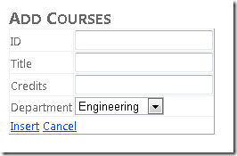
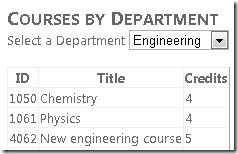
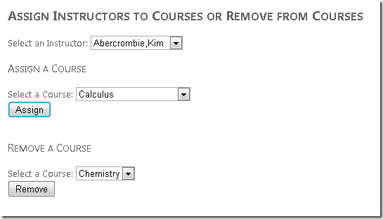

Getting Started with Entity Framework 4.0 Database First and ASP.NET 4 Web Forms - Part 5
====================
by [Tom Dykstra](https://github.com/tdykstra)

> The Contoso University sample web application demonstrates how to create ASP.NET Web Forms applications using the Entity Framework 4.0 and Visual Studio 2010. For information about the tutorial series, see [the first tutorial in the series](the-entity-framework-and-aspnet-getting-started-part-1.md)

## Working with Related Data, Continued

In the previous tutorial you began to use the `EntityDataSource` control to work with related data. You displayed multiple levels of hierarchy and edited data in navigation properties. In this tutorial you'll continue to work with related data by adding and deleting relationships and by adding a new entity that has a relationship to an existing entity.

You'll create a page that adds courses that are assigned to departments. The departments already exist, and when you create a new course, at the same time you'll establish a relationship between it and an existing department.

You'll also create a page that works with a many-to-many relationship by assigning an instructor to a course (adding a relationship between two entities that you select) or removing an instructor from a course (removing a relationship between two entities that you select). In the database, adding a relationship between an instructor and a course results in a new row being added to the `CourseInstructor` association table; removing a relationship involves deleting a row from the `CourseInstructor` association table. However, you do this in the Entity Framework by setting navigation properties, without referring to the `CourseInstructor` table explicitly.

## Adding an Entity with a Relationship to an Existing Entity

Create a new web page named *CoursesAdd.aspx* that uses the *Site.Master* master page, and add the following markup to the `Content` control named `Content2`:

[!code-aspx[Main](the-entity-framework-and-aspnet-getting-started-part-5/samples/sample1.aspx)]

This markup creates an `EntityDataSource` control that selects courses, that enables inserting, and that specifies a handler for the `Inserting` event. You'll use the handler to update the `Department` navigation property when a new `Course` entity is created.

The markup also creates a `DetailsView` control to use for adding new `Course` entities. The markup uses bound fields for `Course` entity properties. You have to enter the `CourseID` value because this is not a system-generated ID field. Instead, it's a course number that must be specified manually when the course is created.

You use a template field for the `Department` navigation property because navigation properties cannot be used with `BoundField` controls. The template field provides a drop-down list to select the department. The drop-down list is bound to the `Departments` entity set by using `Eval` rather than `Bind`, again because you cannot directly bind navigation properties in order to update them. You specify a handler for the `DropDownList` control's `Init` event so that you can store a reference to the control for use by the code that updates the `DepartmentID` foreign key.

In *CoursesAdd.aspx.cs* just after the partial-class declaration, add a class field to hold a reference to the `DepartmentsDropDownList` control:

[!code-csharp[Main](the-entity-framework-and-aspnet-getting-started-part-5/samples/sample2.cs)]

Add a handler for the `DepartmentsDropDownList` control's `Init` event so that you can store a reference to the control. This lets you get the value the user has entered and use it to update the `DepartmentID` value of the `Course` entity.

[!code-csharp[Main](the-entity-framework-and-aspnet-getting-started-part-5/samples/sample3.cs)]

Add a handler for the `DetailsView` control's `Inserting` event:

[!code-csharp[Main](the-entity-framework-and-aspnet-getting-started-part-5/samples/sample4.cs)]

When the user clicks `Insert`, the `Inserting` event is raised before the new record is inserted. The code in the handler gets the `DepartmentID` from the `DropDownList` control and uses it to set the value that will be used for the `DepartmentID` property of the `Course` entity.

The Entity Framework will take care of adding this course to the `Courses` navigation property of the associated `Department` entity. It also adds the department to the `Department` navigation property of the `Course` entity.

Run the page.

Enter an ID, a title, a number of credits, and select a department, then click **Insert**.

Run the *Courses.aspx* page, and select the same department to see the new course.

## Working with Many-to-Many Relationships

The relationship between the `Courses` entity set and the `People` entity set is a many-to-many relationship. A `Course` entity has a navigation property named `People` that can contain zero, one, or more related `Person` entities (representing instructors assigned to teach that course). And a `Person` entity has a navigation property named `Courses` that can contain zero, one, or more related `Course` entities (representing courses that that instructor is assigned to teach). One instructor might teach multiple courses, and one course might be taught by multiple instructors. In this section of the walkthrough, you'll add and remove relationships between `Person` and `Course` entities by updating the navigation properties of the related entities.

Create a new web page named *InstructorsCourses.aspx* that uses the *Site.Master* master page, and add the following markup to the `Content` control named `Content2`:

[!code-aspx[Main](the-entity-framework-and-aspnet-getting-started-part-5/samples/sample5.aspx)]

This markup creates an `EntityDataSource` control that retrieves the name and `PersonID` of `Person` entities for instructors. A `DropDrownList` control is bound to the `EntityDataSource` control. The `DropDownList` control specifies a handler for the `DataBound` event. You'll use this handler to databind the two drop-down lists that display courses.

The markup also creates the following group of controls to use for assigning a course to the selected instructor:

- A `DropDownList` control for selecting a course to assign. This control will be populated with courses that are currently not assigned to the selected instructor.
- A `Button` control to initiate the assignment.
- A `Label` control to display an error message if the assignment fails.

Finally, the markup also creates a group of controls to use for removing a course from the selected instructor.

In *InstructorsCourses.aspx.cs*, add a using statement:

[!code-csharp[Main](the-entity-framework-and-aspnet-getting-started-part-5/samples/sample6.cs)]

Add a method for populating the two drop-down lists that display courses:

[!code-csharp[Main](the-entity-framework-and-aspnet-getting-started-part-5/samples/sample7.cs)]

This code gets all courses from the `Courses` entity set and gets the courses from the `Courses` navigation property of the `Person` entity for the selected instructor. It then determines which courses are assigned to that instructor and populates the drop-down lists accordingly.

Add a handler for the `Assign` button's `Click` event:

[!code-csharp[Main](the-entity-framework-and-aspnet-getting-started-part-5/samples/sample8.cs)]

This code gets the `Person` entity for the selected instructor, gets the `Course` entity for the selected course, and adds the selected course to the `Courses` navigation property of the instructor's `Person` entity. It then saves the changes to the database and repopulates the drop-down lists so the results can be seen immediately.

Add a handler for the `Remove` button's `Click` event:

[!code-csharp[Main](the-entity-framework-and-aspnet-getting-started-part-5/samples/sample9.cs)]

This code gets the `Person` entity for the selected instructor, gets the `Course` entity for the selected course, and removes the selected course from the `Person` entity's `Courses` navigation property. It then saves the changes to the database and repopulates the drop-down lists so the results can be seen immediately.

Add code to the `Page_Load` method that makes sure the error messages are not visible when there's no error to report, and add handlers for the `DataBound` and `SelectedIndexChanged` events of the instructors drop-down list to populate the courses drop-down lists:

[!code-csharp[Main](the-entity-framework-and-aspnet-getting-started-part-5/samples/sample10.cs)]

Run the page.

Select an instructor. The **Assign a Course** drop-down list displays the courses that the instructor doesn't teach, and the **Remove a Course** drop-down list displays the courses that the instructor is already assigned to. In the **Assign a Course** section, select a course and then click **Assign**. The course moves to the **Remove a Course** drop-down list. Select a course in the **Remove a Course** section and click **Remove***.* The course moves to the **Assign a Course** drop-down list.

You have now seen some more ways to work with related data. In the following tutorial, you'll learn how to use inheritance in the data model to improve the maintainability of your application.

>[!div class="step-by-step"]
[Previous](the-entity-framework-and-aspnet-getting-started-part-4.md)
[Next](the-entity-framework-and-aspnet-getting-started-part-6.md)