Getting Started with Entity Framework 4.0 Database First and ASP.NET 4 Web Forms - Part 6
====================
by [Tom Dykstra](https://github.com/tdykstra)

> The Contoso University sample web application demonstrates how to create ASP.NET Web Forms applications using the Entity Framework 4.0 and Visual Studio 2010. For information about the tutorial series, see [the first tutorial in the series](the-entity-framework-and-aspnet-getting-started-part-1.md)

## Implementing Table-per-Hierarchy Inheritance

In the previous tutorial you worked with related data by adding and deleting relationships and by adding a new entity that had a relationship to an existing entity. This tutorial will show you how to implement inheritance in the data model.

In object-oriented programming, you can use inheritance to make it easier to work with related classes. For example, you could create `Instructor` and `Student` classes that derive from a `Person` base class. You can create the same kinds of inheritance structures among entities in the Entity Framework.

In this part of the tutorial, you won't create any new web pages. Instead, you'll add derived entities to the data model and modify existing pages to use the new entities.

## Table-per-Hierarchy versus Table-per-Type Inheritance

A database can store information about related objects in one table or in multiple tables. For example, in the `School` database, the `Person` table includes information about both students and instructors in a single table. Some of the columns apply only to instructors (`HireDate`), some only to students (`EnrollmentDate`), and some to both (`LastName`, `FirstName`).

[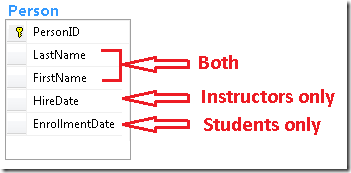](the-entity-framework-and-aspnet-getting-started-part-6/_static/image1.png)

You can configure the Entity Framework to create `Instructor` and `Student` entities that inherit from the `Person` entity. This pattern of generating an entity inheritance structure from a single database table is called *table-per-hierarchy* (TPH) inheritance.

For courses, the `School` database uses a different pattern. Online courses and onsite courses are stored in separate tables, each of which has a foreign key that points to the `Course` table. Information common to both course types is stored only in the `Course` table.

[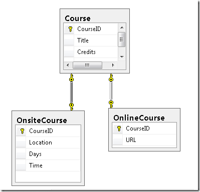](the-entity-framework-and-aspnet-getting-started-part-6/_static/image3.png)

You can configure the Entity Framework data model so that `OnlineCourse` and `OnsiteCourse` entities inherit from the `Course` entity. This pattern of generating an entity inheritance structure from separate tables for each type, with each separate table referring back to a table that stores data common to all types, is called *table per type* (TPT) inheritance.

TPH inheritance patterns generally deliver better performance in the Entity Framework than TPT inheritance patterns, because TPT patterns can result in complex join queries. This walkthrough demonstrates how to implement TPH inheritance. You'll do that by performing the following steps:

- Create `Instructor` and `Student` entity types that derive from `Person`.
- Move properties that pertain to the derived entities from the `Person` entity to the derived entities.
- Set constraints on properties in the derived types.
- Make the `Person` entity an abstract entity.
- Map each derived entity to the `Person` table with a condition that specifies how to determine whether a `Person` row represents that derived type.

## Adding Instructor and Student Entities

Open the *SchoolModel.edmx* file, right-click an unoccupied area in the designer, select **Add**, then select **Entity***.*

[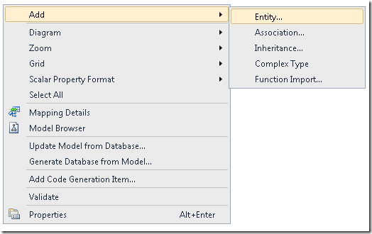](the-entity-framework-and-aspnet-getting-started-part-6/_static/image5.png)

In the **Add Entity** dialog box, name the entity `Instructor` and set its **Base type** option to `Person`.

[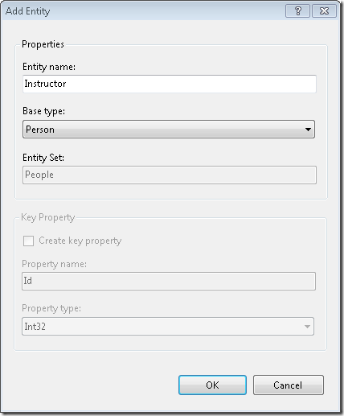](the-entity-framework-and-aspnet-getting-started-part-6/_static/image7.png)

Click **OK**. The designer creates an `Instructor` entity that derives from the `Person` entity. The new entity does not yet have any properties.

[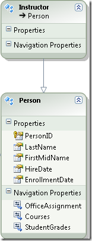](the-entity-framework-and-aspnet-getting-started-part-6/_static/image9.png)

Repeat the procedure to create a `Student` entity that also derives from `Person`.

Only instructors have hire dates, so you need to move that property from the `Person` entity to the `Instructor` entity. In the `Person` entity, right-click the `HireDate` property and click **Cut**. Then right-click **Properties** in the `Instructor` entity and click **Paste**.

[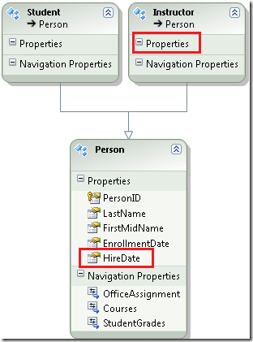](the-entity-framework-and-aspnet-getting-started-part-6/_static/image11.png)

The hire date of an `Instructor` entity cannot be null. Right-click the `HireDate` property, click **Properties**, and then in the **Properties** window change `Nullable` to `False`.

[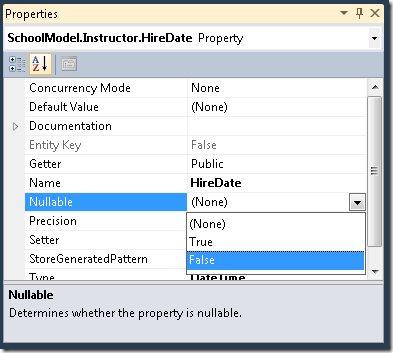](the-entity-framework-and-aspnet-getting-started-part-6/_static/image13.png)

Repeat the procedure to move the `EnrollmentDate` property from the `Person` entity to the `Student` entity. Make sure that you also set `Nullable` to `False` for the `EnrollmentDate` property.

Now that a `Person` entity has only the properties that are common to `Instructor` and `Student` entities (aside from navigation properties, which you're not moving), the entity can only be used as a base entity in the inheritance structure. Therefore, you need to ensure that it's never treated as an independent entity. Right-click the `Person` entity, select **Properties**, and then in the **Properties** window change the value of the **Abstract** property to **True**.

[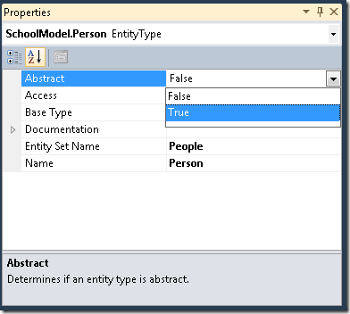](the-entity-framework-and-aspnet-getting-started-part-6/_static/image15.png)

## Mapping Instructor and Student Entities to the Person Table

Now you need to tell the Entity Framework how to differentiate between `Instructor` and `Student` entities in the database.

Right-click the `Instructor` entity and select **Table Mapping**. In the **Mapping Details** window, click **Add a Table or View** and select **Person**.

[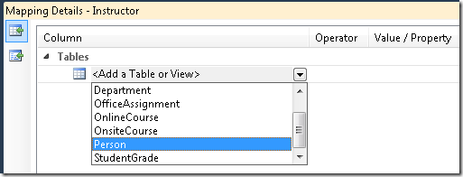](the-entity-framework-and-aspnet-getting-started-part-6/_static/image17.png)

Click **Add a Condition**, and then select **HireDate**.

[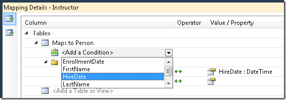](the-entity-framework-and-aspnet-getting-started-part-6/_static/image19.png)

Change **Operator** to **Is** and **Value / Property** to **Not Null**.

[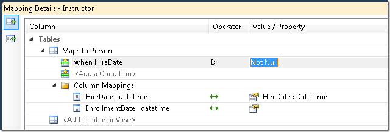](the-entity-framework-and-aspnet-getting-started-part-6/_static/image21.png)

Repeat the procedure for the `Students` entity, specifying that this entity maps to the `Person` table when the `EnrollmentDate` column is not null. Then save and close the data model.

Build the project in order to create the new entities as classes and make them available in the designer.

## Using the Instructor and Student Entities

When you created the web pages that work with student and instructor data, you databound them to the `Person` entity set, and you filtered on the `HireDate` or `EnrollmentDate` property to restrict the returned data to students or instructors. However, now when you bind each data source control to the `Person` entity set, you can specify that only `Student` or `Instructor` entity types should be selected. Because the Entity Framework knows how to differentiate students and instructors in the `Person` entity set, you can remove the `Where` property settings you entered manually to do that.

In the Visual Studio Designer, you can specify the entity type that an `EntityDataSource` control should select in the **EntityTypeFilter** drop-down box of the `Configure Data Source` wizard, as shown in the following example.

[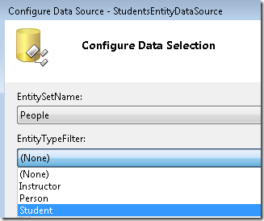](the-entity-framework-and-aspnet-getting-started-part-6/_static/image23.png)

And in the **Properties** window you can remove `Where` clause values that are no longer needed, as shown in the following example.

[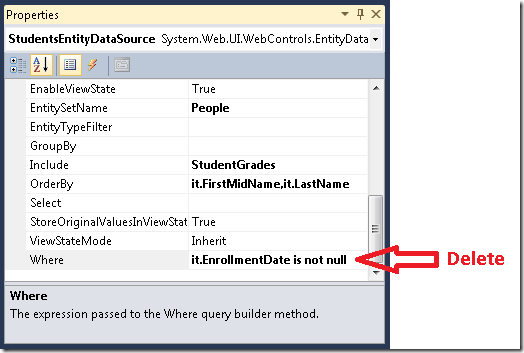](the-entity-framework-and-aspnet-getting-started-part-6/_static/image25.png)

However, because you've changed the markup for `EntityDataSource` controls to use the `ContextTypeName` attribute, you cannot run the **Configure Data Source** wizard on `EntityDataSource` controls that you've already created. Therefore, you'll make the required changes by changing markup instead.

Open the *Students.aspx* page. In the `StudentsEntityDataSource` control, remove the `Where` attribute and add an `EntityTypeFilter="Student"` attribute. The markup will now resemble the following example:

[!code-aspx[Main](the-entity-framework-and-aspnet-getting-started-part-6/samples/sample1.aspx)]

Setting the `EntityTypeFilter` attribute ensures that the `EntityDataSource` control will select only the specified entity type. If you wanted to retrieve both `Student` and `Instructor` entity types, you would not set this attribute. (You have the option of retrieving multiple entity types with one `EntityDataSource` control only if you're using the control for read-only data access. If you're using an `EntityDataSource` control to insert, update, or delete entities, and if the entity set it's bound to can contain multiple types, you can only work with one entity type, and you have to set this attribute.)

Repeat the procedure for the `SearchEntityDataSource` control, except remove only the part of the `Where` attribute that selects `Student` entities instead of removing the property altogether. The opening tag of the control will now resemble the following example:

[!code-aspx[Main](the-entity-framework-and-aspnet-getting-started-part-6/samples/sample2.aspx)]

Run the page to verify that it still works as it did before.

[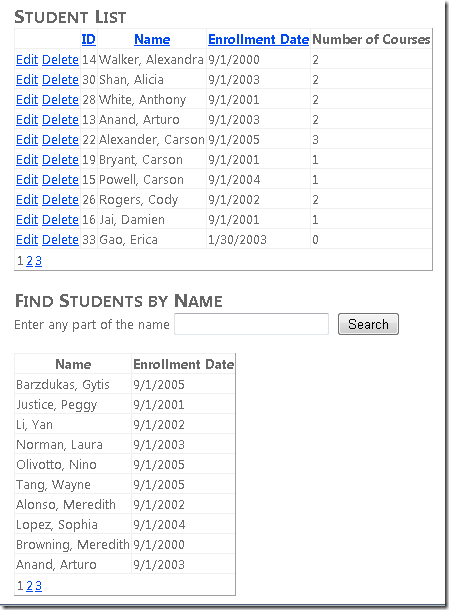](the-entity-framework-and-aspnet-getting-started-part-6/_static/image27.png)

Update the following pages that you created in earlier tutorials so that they use the new `Student` and `Instructor` entities instead of `Person` entities, then run them to verify that they work as they did before:

- In *StudentsAdd.aspx*, add `EntityTypeFilter="Student"` to the `StudentsEntityDataSource` control. The markup will now resemble the following example: 

    [!code-aspx[Main](the-entity-framework-and-aspnet-getting-started-part-6/samples/sample3.aspx)]

    [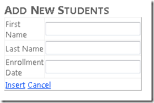](the-entity-framework-and-aspnet-getting-started-part-6/_static/image29.png)
- In *About.aspx*, add `EntityTypeFilter="Student"` to the `StudentStatisticsEntityDataSource` control and remove `Where="it.EnrollmentDate is not null"`. The markup will now resemble the following example: 

    [!code-aspx[Main](the-entity-framework-and-aspnet-getting-started-part-6/samples/sample4.aspx)]

    [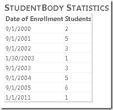](the-entity-framework-and-aspnet-getting-started-part-6/_static/image31.png)
- In *Instructors.aspx* and *InstructorsCourses.aspx*, add `EntityTypeFilter="Instructor"` to the `InstructorsEntityDataSource` control and remove `Where="it.HireDate is not null"`. The markup in *Instructors.aspx* now resembles the following example: 

    [!code-aspx[Main](the-entity-framework-and-aspnet-getting-started-part-6/samples/sample5.aspx)]

    

    The markup in *InstructorsCourses.aspx* will now resemble the following example:

    [!code-aspx[Main](the-entity-framework-and-aspnet-getting-started-part-6/samples/sample6.aspx)]

    [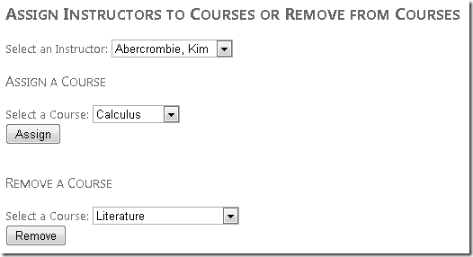](the-entity-framework-and-aspnet-getting-started-part-6/_static/image35.png)

As a result of these changes, you've improved the Contoso University application's maintainability in several ways. You've moved selection and validation logic out of the UI layer (*.aspx* markup) and made it an integral part of the data access layer. This helps to isolate your application code from changes that you might make in the future to the database schema or the data model. For example, you could decide that students might be hired as teachers' aids and therefore would get a hire date. You could then add a new property to differentiate students from instructors and update the data model. No code in the web application would need to change except where you wanted to show a hire date for students. Another benefit of adding `Instructor` and `Student` entities is that your code is more readily understandable than when it referred to `Person` objects that were actually students or instructors.

You've now seen one way to implement an inheritance pattern in the Entity Framework. In the following tutorial, you'll learn how to use stored procedures in order to have more control over how the Entity Framework accesses the database.

>[!div class="step-by-step"]
[Previous](the-entity-framework-and-aspnet-getting-started-part-5.md)
[Next](the-entity-framework-and-aspnet-getting-started-part-7.md)