Getting Started with Entity Framework 4.0 Database First and ASP.NET 4 Web Forms - Part 7
====================
by [Tom Dykstra](https://github.com/tdykstra)

> The Contoso University sample web application demonstrates how to create ASP.NET Web Forms applications using the Entity Framework 4.0 and Visual Studio 2010. For information about the tutorial series, see [the first tutorial in the series](the-entity-framework-and-aspnet-getting-started-part-1.md)

## Using Stored Procedures

In the previous tutorial you implemented a table-per-hierarchy inheritance pattern. This tutorial will show you how to use stored procedures to gain more control over database access.

The Entity Framework lets you specify that it should use stored procedures for database access. For any entity type, you can specify a stored procedure to use for creating, updating, or deleting entities of that type. Then in the data model you can add references to stored procedures that you can use to perform tasks such as retrieving sets of entities.

Using stored procedures is a common requirement for database access. In some cases a database administrator may require that all database access go through stored procedures for security reasons. In other cases you may want to build business logic into some of the processes that the Entity Framework uses when it updates the database. For example, whenever an entity is deleted you might want to copy it to an archive database. Or whenever a row is updated you might want to write a row to a logging table that records who made the change. You can perform these kinds of tasks in a stored procedure that's called whenever the Entity Framework deletes an entity or updates an entity.

As in the previous tutorial, you'll not create any new pages. Instead, you'll change the way the Entity Framework accesses the database for some of the pages you already created.

In this tutorial you'll create stored procedures in the database for inserting `Student` and `Instructor` entities. You'll add them to the data model, and you'll specify that the Entity Framework should use them for adding `Student` and `Instructor` entities to the database. You'll also create a stored procedure that you can use to retrieve `Course` entities.

## Creating Stored Procedures in the Database

(If you're using the *School.mdf* file from the project available for download with this tutorial, you can skip this section because the stored procedures already exist.)

In **Server Explorer**, expand *School.mdf*, right-click **Stored Procedures**, and select **Add New Stored Procedure**.

[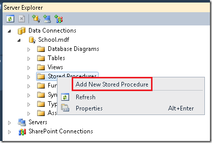](the-entity-framework-and-aspnet-getting-started-part-7/_static/image1.png)

Copy the following SQL statements and paste them into the stored procedure window, replacing the skeleton stored procedure.

[!code-sql[Main](the-entity-framework-and-aspnet-getting-started-part-7/samples/sample1.sql)]

[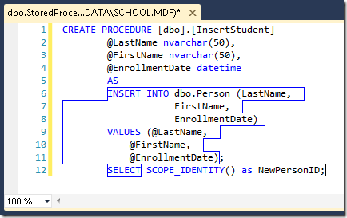](the-entity-framework-and-aspnet-getting-started-part-7/_static/image3.png)

`Student` entities have four properties: `PersonID`, `LastName`, `FirstName`, and `EnrollmentDate`. The database generates the ID value automatically, and the stored procedure accepts parameters for the other three. The stored procedure returns the value of the new row's record key so that the Entity Framework can keep track of that in the version of the entity it keeps in memory.

Save and close the stored procedure window.

Create an `InsertInstructor` stored procedure in the same manner, using the following SQL statements:

[!code-sql[Main](the-entity-framework-and-aspnet-getting-started-part-7/samples/sample2.sql)]

Create `Update` stored procedures for `Student` and `Instructor` entities also. (The database already has a `DeletePerson` stored procedure which will work for both `Instructor` and `Student` entities.)

[!code-sql[Main](the-entity-framework-and-aspnet-getting-started-part-7/samples/sample3.sql)]

[!code-sql[Main](the-entity-framework-and-aspnet-getting-started-part-7/samples/sample4.sql)]

In this tutorial you'll map all three functions -- insert, update, and delete -- for each entity type. The Entity Framework version 4 allows you to map just one or two of these functions to stored procedures without mapping the others, with one exception: if you map the update function but not the delete function, the Entity Framework will throw an exception when you attempt to delete an entity. In the Entity Framework version 3.5, you did not have this much flexibility in mapping stored procedures: if you mapped one function you were required to map all three.

To create a stored procedure that reads rather than updates data, create one that selects all `Course` entities, using the following SQL statements:

[!code-sql[Main](the-entity-framework-and-aspnet-getting-started-part-7/samples/sample5.sql)]

## Adding the Stored Procedures to the Data Model

The stored procedures are now defined in the database, but they must be added to the data model to make them available to the Entity Framework. Open *SchoolModel.edmx*, right-click the design surface, and select **Update Model from Database**. In the **Add** tab of the **Choose Your Database Objects** dialog box, expand **Stored Procedures**, select the newly created stored procedures and the `DeletePerson` stored procedure, and then click **Finish**.

[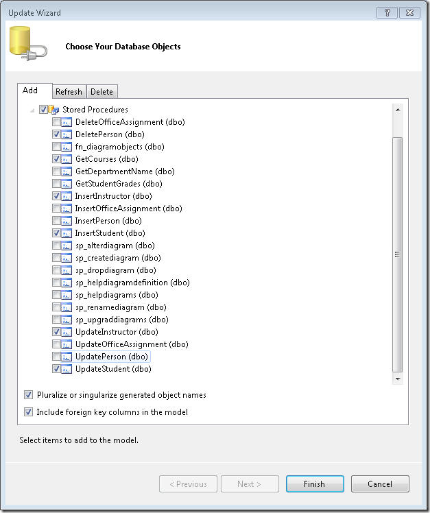](the-entity-framework-and-aspnet-getting-started-part-7/_static/image5.png)

## Mapping the Stored Procedures

In the data model designer, right-click the `Student` entity and select **Stored Procedure Mapping**.

[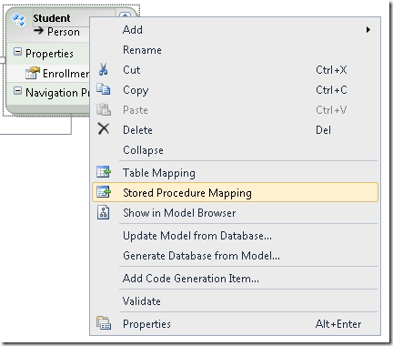](the-entity-framework-and-aspnet-getting-started-part-7/_static/image7.png)

The **Mapping Details** window appears, in which you can specify stored procedures that the Entity Framework should use for inserting, updating, and deleting entities of this type.

[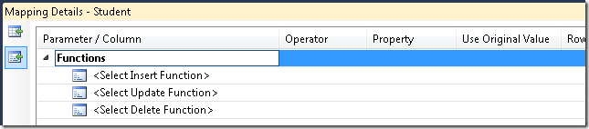](the-entity-framework-and-aspnet-getting-started-part-7/_static/image9.png)

Set the **Insert** function to **InsertStudent**. The window shows a list of stored procedure parameters, each of which must be mapped to an entity property. Two of these are mapped automatically because the names are the same. There's no entity property named `FirstName`, so you must manually select `FirstMidName` from a drop-down list that shows available entity properties. (This is because you changed the name of the `FirstName` property to `FirstMidName` in the first tutorial.)

[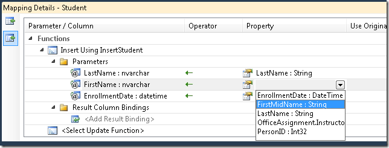](the-entity-framework-and-aspnet-getting-started-part-7/_static/image11.png)

In the same **Mapping Details** window, map the `Update` function to the `UpdateStudent` stored procedure (make sure you specify `FirstMidName` as the parameter value for `FirstName`, as you did for the `Insert` stored procedure) and the `Delete` function to the `DeletePerson` stored procedure.

[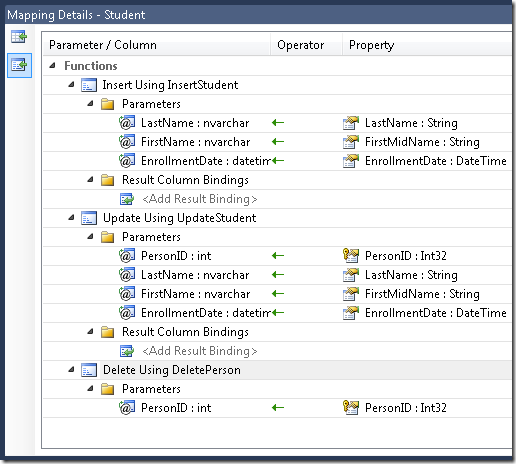](the-entity-framework-and-aspnet-getting-started-part-7/_static/image13.png)

Follow the same procedure to map the insert, update, and delete stored procedures for instructors to the `Instructor` entity.

For stored procedures that read rather than update data, you use the **Model Browser** window to map the stored procedure to the entity type it returns. In the data model designer, right-click the design surface and select **Model Browser**. Open the **SchoolModel.Store** node and then open the **Stored Procedures** node. Then right-click the `GetCourses` stored procedure and select **Add Function Import**.

[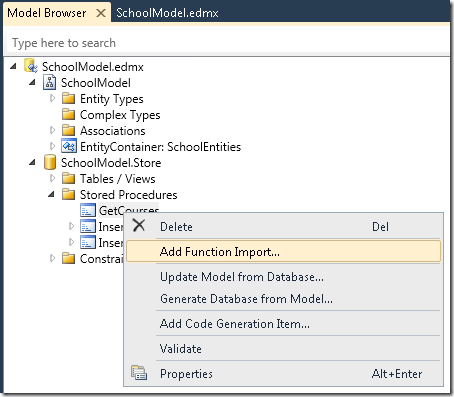](the-entity-framework-and-aspnet-getting-started-part-7/_static/image17.png)

In the **Add Function Import** dialog box, under **Returns a Collection Of** select **Entities**, and then select `Course` as the entity type returned. When you're done, click **OK**. Save and close the *.edmx* file.

[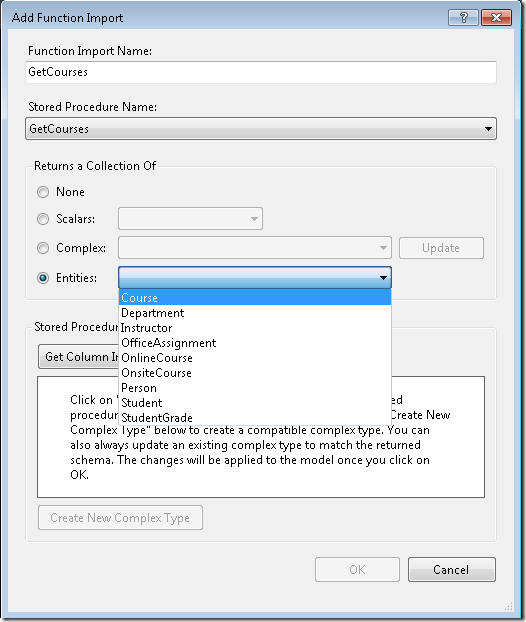](the-entity-framework-and-aspnet-getting-started-part-7/_static/image19.png)

## Using Insert, Update, and Delete Stored Procedures

Stored procedures to insert, update, and delete data are used by the Entity Framework automatically after you've added them to the data model and mapped them to the appropriate entities. You can now run the *StudentsAdd.aspx* page, and every time you create a new student, the Entity Framework will use the `InsertStudent` stored procedure to add the new row to the `Student` table.

[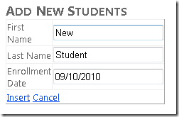](the-entity-framework-and-aspnet-getting-started-part-7/_static/image21.png)

Run the *Students.aspx* page and the new student appears in the list.

[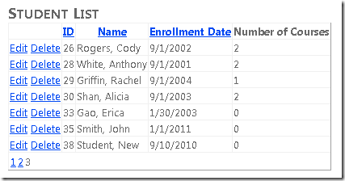](the-entity-framework-and-aspnet-getting-started-part-7/_static/image23.png)

Change the name to verify that the update function works, and then delete the student to verify that the delete function works.

## Using Select Stored Procedures

The Entity Framework does not automatically run stored procedures such as `GetCourses`, and you cannot use them with the `EntityDataSource` control. To use them, you call them from code.

Open the *InstructorsCourses.aspx.cs* file. The `PopulateDropDownLists` method uses a LINQ-to-Entities query to retrieve all course entities so that it can loop through the list and determine which ones an instructor is assigned to and which ones are unassigned:

[!code-csharp[Main](the-entity-framework-and-aspnet-getting-started-part-7/samples/sample6.cs)]

Replace this with the following code:

[!code-csharp[Main](the-entity-framework-and-aspnet-getting-started-part-7/samples/sample7.cs)]

The page now uses the `GetCourses` stored procedure to retrieve the list of all courses. Run the page to verify that it works as it did before.

(Navigation properties of entities retrieved by a stored procedure might not be automatically populated with the data related to those entities, depending on `ObjectContext` default settings. For more information, see [Loading Related Objects](https://msdn.microsoft.com/en-us/library/bb896272.aspx) in the MSDN Library.)

In the next tutorial, you'll learn how to use Dynamic Data functionality to make it easier to program and test data formatting and validation rules. Instead of specifying on each web page rules such as data format strings and whether or not a field is required, you can specify such rules in data model metadata and they're automatically applied on every page.

>[!div class="step-by-step"]
[Previous](the-entity-framework-and-aspnet-getting-started-part-6.md)
[Next](the-entity-framework-and-aspnet-getting-started-part-8.md)