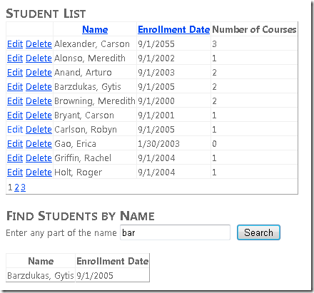
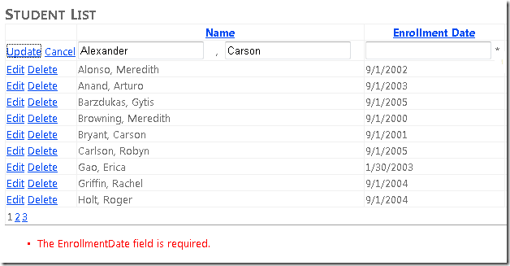
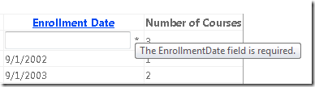
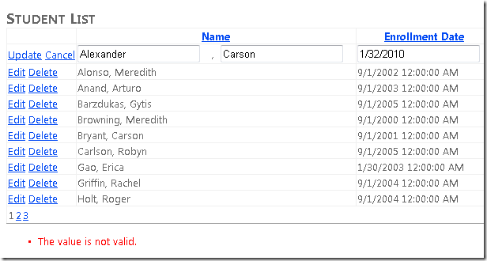
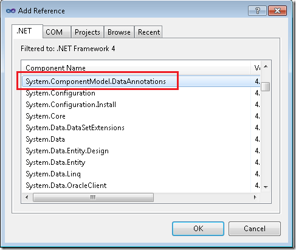
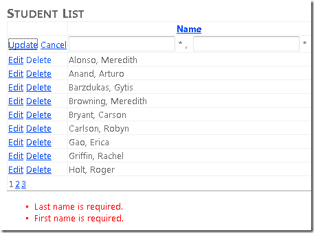
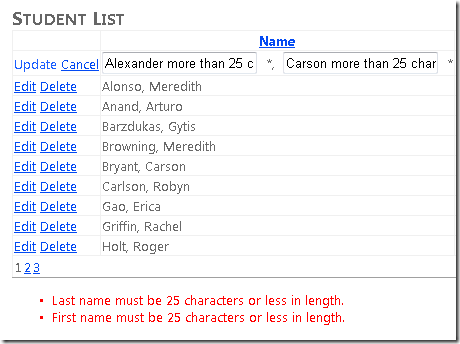

Getting Started with Entity Framework 4.0 Database First and ASP.NET 4 Web Forms - Part 8
====================
by [Tom Dykstra](https://github.com/tdykstra)

> The Contoso University sample web application demonstrates how to create ASP.NET Web Forms applications using the Entity Framework 4.0 and Visual Studio 2010. For information about the tutorial series, see [the first tutorial in the series](the-entity-framework-and-aspnet-getting-started-part-1.md)

## Using Dynamic Data Functionality to Format and Validate Data

In the previous tutorial you implemented stored procedures. This tutorial will show you how Dynamic Data functionality can provide the following benefits:

- Fields are automatically formatted for display based on their data type.
- Fields are automatically validated based on their data type.
- You can add metadata to the data model to customize formatting and validation behavior. When you do this, you can add the formatting and validation rules in just one place, and they're automatically applied everywhere you access the fields using Dynamic Data controls.

To see how this works, you'll change the controls you use to display and edit fields in the existing *Students.aspx* page, and you'll add formatting and validation metadata to the name and date fields of the `Student` entity type.

## Using DynamicField and DynamicControl Controls

Open the *Students.aspx* page and in the `StudentsGridView` control replace the **Name** and **Enrollment Date** `TemplateField` elements with the following markup:

[!code-aspx[Main](the-entity-framework-and-aspnet-getting-started-part-8/samples/sample1.aspx)]

This markup uses `DynamicControl` controls in place of `TextBox` and `Label` controls in the student name template field, and it uses a `DynamicField` control for the enrollment date. No format strings are specified.

Add a `ValidationSummary` control after the `StudentsGridView` control.

[!code-aspx[Main](the-entity-framework-and-aspnet-getting-started-part-8/samples/sample2.aspx)]

In the `SearchGridView` control replace the markup for the **Name** and **Enrollment Date** columns as you did in the `StudentsGridView` control, except omit the `EditItemTemplate` element. The `Columns` element of the `SearchGridView` control now contains the following markup:

[!code-aspx[Main](the-entity-framework-and-aspnet-getting-started-part-8/samples/sample3.aspx)]

Open *Students.aspx.cs* and add the following `using` statement:

[!code-csharp[Main](the-entity-framework-and-aspnet-getting-started-part-8/samples/sample4.cs)]

Add a handler for the page's `Init` event:

[!code-csharp[Main](the-entity-framework-and-aspnet-getting-started-part-8/samples/sample5.cs)]

This code specifies that Dynamic Data will provide formatting and validation in these data-bound controls for fields of the `Student` entity. If you get an error message like the following example when you run the page, it typically means you've forgotten to call the `EnableDynamicData` method in `Page_Init`:

`Could not determine a MetaTable. A MetaTable could not be determined for the data source 'StudentsEntityDataSource' and one could not be inferred from the request URL.`

Run the page.

In the **Enrollment Date** column, the time is displayed along with the date because the property type is `DateTime`. You'll fix that later.

For now, notice that Dynamic Data automatically provides basic data validation. For example, click **Edit**, clear the date field, click **Update**, and you see that Dynamic Data automatically makes this a required field because the value is not nullable in the data model. The page displays an asterisk after the field and an error message in the `ValidationSummary` control:

You could omit the `ValidationSummary` control, because you can also hold the mouse pointer over the asterisk to see the error message:

Dynamic Data will also validate that data entered in the **Enrollment Date** field is a valid date:

As you can see, this is a generic error message. In the next section you'll see how to customize messages as well as validation and formatting rules.

## Adding Metadata to the Data Model

Typically, you want to customize the functionality provided by Dynamic Data. For example, you might change how data is displayed and the content of error messages. You typically also customize data validation rules to provide more functionality than what Dynamic Data provides automatically based on data types. To do this, you create partial classes that correspond to entity types.

In **Solution Explorer**, right-click the **ContosoUniversity** project, select **Add Reference**, and add a reference to `System.ComponentModel.DataAnnotations`.

In the *DAL* folder, create a new class file, name it *Student.cs*, and replace the template code in it with the following code.

[!code-csharp[Main](the-entity-framework-and-aspnet-getting-started-part-8/samples/sample6.cs)]

This code creates a partial class for the `Student` entity. The `MetadataType` attribute applied to this partial class identifies the class that you're using to specify metadata. The metadata class can have any name, but using the entity name plus "Metadata" is a common practice.

The attributes applied to properties in the metadata class specify formatting, validation, rules, and error messages. The attributes shown here will have the following results:

- `EnrollmentDate` will display as a date (without a time).
- Both name fields must be 25 characters or less in length, and a custom error message is provided.
- Both name fields are required, and a custom error message is provided.

Run the *Students.aspx* page again, and you see that the dates are now displayed without times:

Edit a row and try to clear the values in the name fields. The asterisks indicating field errors appear as soon as you leave a field, before you click **Update**. When you click **Update**, the page displays the error message text you specified.

Try to enter names that are longer than 25 characters, click **Update**, and the page displays the error message text you specified.

Now that you've set up these formatting and validation rules in the data model metadata, the rules will automatically be applied on every page that displays or allows changes to these fields, so long as you use `DynamicControl` or `DynamicField` controls. This reduces the amount of redundant code you have to write, which makes programming and testing easier, and it ensures that data formatting and validation are consistent throughout an application.

## More Information

This concludes this series of tutorials on Getting Started with the Entity Framework. For more resources to help you learn how to use the Entity Framework, continue with [the first tutorial in the next Entity Framework tutorial series](../continuing-with-ef/using-the-entity-framework-and-the-objectdatasource-control-part-1-getting-started.md) or visit the following sites:

- [Entity Framework FAQ](http://www.ef-faq.org/introduction.html)
- [The Entity Framework Team Blog](https://blogs.msdn.com/b/adonet/)
- [Entity Framework in the MSDN Library](https://msdn.microsoft.com/en-us/library/bb399572.aspx)
- [Entity Framework in the MSDN Data Developer Center](https://msdn.microsoft.com/en-us/data/ef.aspx)
- [EntityDataSource Web Server Control Overview in the MSDN Library](https://msdn.microsoft.com/en-us/library/cc488502.aspx)
- [EntityDataSource control API reference in the MSDN Library](https://msdn.microsoft.com/en-us/library/system.web.ui.webcontrols.entitydatasource.aspx)
- [Entity Framework Forums on MSDN](https://social.msdn.microsoft.com/forums/en-US/adodotnetentityframework/)
- [Julie Lerman's blog](http://thedatafarm.com/blog/)

>[!div class="step-by-step"]
[Previous](the-entity-framework-and-aspnet-getting-started-part-7.md)