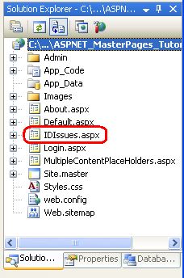
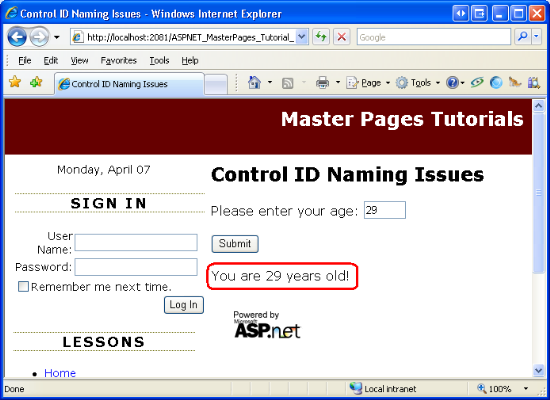
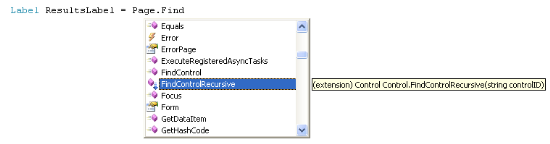

Control ID Naming in Content Pages (C#)
====================
by [Scott Mitchell](https://twitter.com/ScottOnWriting)

[Download Code](http://download.microsoft.com/download/e/e/f/eef369f5-743a-4a52-908f-b6532c4ce0a4/ASPNET_MasterPages_Tutorial_05_CS.zip) or [Download PDF](http://download.microsoft.com/download/8/f/6/8f6349e4-6554-405a-bcd7-9b094ba5089a/ASPNET_MasterPages_Tutorial_05_CS.pdf)

> Illustrates how ContentPlaceHolder controls serve as a naming container and therefore make programmatically working with a control difficult (via FindConrol). Looks at this issue and workarounds. Also discusses how to programmatically access the resulting ClientID value.

## Introduction

All ASP.NET server controls include an `ID` property that uniquely identifies the control and is the means by which the control is programmatically accessed in the code-behind class. Similarly, the elements in an HTML document may include an `id` attribute that uniquely identifies the element; these `id` values are often used in client-side script to programmatically reference a particular HTML element. Given this, you may assume that when an ASP.NET server control is rendered into HTML, its `ID` value is used as the `id` value of the rendered HTML element. This is not necessarily the case because in certain circumstances a single control with a single `ID` value may appear multiple times in the rendered markup. Consider a GridView control that includes a TemplateField with a Label Web control with an `ID` value of ProductName. When the GridView is bound to its data source at runtime, this Label is repeated once for every GridView row. Each rendered Label needs a unique `id` value.

To handle such scenarios, ASP.NET allows certain controls to be denoted as naming containers. A naming container serves as a new `ID` namespace. Any server controls that appear within the naming container have their rendered `id` value prefixed with the `ID` of the naming container control. For example, the `GridView` and `GridViewRow` classes are both naming containers. Consequently, a Label control defined in a GridView TemplateField with `ID` ProductName is given a rendered `id` value of `GridViewID_GridViewRowID_ProductName`. Because *GridViewRowID* is unique for each GridView row, the resulting `id` values are unique.

> [!NOTE]
> The [`INamingContainer` interface](https://msdn.microsoft.com/en-us/library/system.web.ui.inamingcontainer.aspx) is used to indicate that a particular ASP.NET server control should function as a naming container. The `INamingContainer` interface does not spell out any methods that the server control must implement; rather, it's used as a marker. In generating the rendered markup, if a control implements this interface then the ASP.NET engine automatically prefixes its `ID` value to its descendents' rendered `id` attribute values. This process is discussed in more detail in Step 2.

Naming containers not only change the rendered `id` attribute value, but also affect how the control may be programmatically referenced from the ASP.NET page's code-behind class. The `FindControl("controlID")` method is commonly used to programmatically reference a Web control. However, `FindControl` does not penetrate through naming containers. Consequently, you cannot directly use the `Page.FindControl` method to reference controls within a GridView or other naming container.

As you may have surmised, master pages and ContentPlaceHolders are both implemented as naming containers. In this tutorial we examine how master pages affect HTML element `id` values and ways to programmatically reference Web controls within a content page using `FindControl`.

## Step 1: Adding a New ASP.NET Page

To demonstrate the concepts discussed in this tutorial, let's add a new ASP.NET page to our website. Create a new content page named `IDIssues.aspx` in the root folder, binding it to the `Site.master` master page.

**Figure 01**: Add the Content Page `IDIssues.aspx` to the Root Folder

Visual Studio automatically creates a Content control for each of the master page's four ContentPlaceHolders. As noted in the [*Multiple ContentPlaceHolders and Default Content*](multiple-contentplaceholders-and-default-content-cs.md) tutorial, if a Content control is not present the master page's default ContentPlaceHolder content is emitted instead. Because the `QuickLoginUI` and `LeftColumnContent` ContentPlaceHolders contain suitable default markup for this page, go ahead and remove their corresponding Content controls from `IDIssues.aspx`. At this point, the content page's declarative markup should look like the following:

[!code-aspx[Main](control-id-naming-in-content-pages-cs/samples/sample1.aspx)]

In the [*Specifying the Title, Meta Tags, and Other HTML Headers in the Master Page*](specifying-the-title-meta-tags-and-other-html-headers-in-the-master-page-cs.md) tutorial we created a custom base page class (`BasePage`) that automatically configures the page's title if it is not explicitly set. For the `IDIssues.aspx` page to employ this functionality, the page's code-behind class must derive from the `BasePage` class (instead of `System.Web.UI.Page`). Modify the code-behind class's definition so that it looks like the following:

[!code-csharp[Main](control-id-naming-in-content-pages-cs/samples/sample2.cs)]

Finally, update the `Web.sitemap` file to include an entry for this new lesson. Add a `<siteMapNode>` element and set its `title` and `url` attributes to "Control ID Naming Issues" and `~/IDIssues.aspx`, respectively. After making this addition your `Web.sitemap` file's markup should look similar to the following:

[!code-xml[Main](control-id-naming-in-content-pages-cs/samples/sample3.xml)]

As Figure 2 illustrates, the new site map entry in `Web.sitemap` is immediately reflected in the Lessons section in the left column.

**Figure 02**: The Lessons Section Now Includes a Link to "Control ID Naming Issues"

## Step 2: Examining the Rendered`ID`Changes

To better understand the modifications the ASP.NET engine makes to the rendered `id` values of server controls, let's add a few Web controls to the `IDIssues.aspx` page and then view the rendered markup sent to the browser. Specifically, type in the text "Please enter your age:" followed by a TextBox Web control. Further down on the page add a Button Web control and a Label Web control. Set the TextBox's `ID` and `Columns` properties to `Age` and 3, respectively. Set the Button's `Text` and `ID` properties to "Submit" and `SubmitButton`. Clear out the Label's `Text` property and set its `ID` to `Results`.

At this point your Content control's declarative markup should look similar to the following:

[!code-aspx[Main](control-id-naming-in-content-pages-cs/samples/sample4.aspx)]

Figure 3 shows the page when viewed through Visual Studio's designer.

**Figure 03**: The Page Includes Three Web Controls: a TextBox, Button, and Label  ([Click to view full-size image](control-id-naming-in-content-pages-cs/_static/image5.png))

Visit the page through a browser and then view the HTML source. As the markup below shows, the `id` values of the HTML elements for the TextBox, Button, and Label Web controls are a combination of the `ID` values of the Web controls and the `ID` values of the naming containers in the page.

[!code-html[Main](control-id-naming-in-content-pages-cs/samples/sample5.html)]

As noted earlier in this tutorial, both the master page and its ContentPlaceHolders serve as naming containers. Consequently, both contribute the rendered `ID` values of their nested controls. Take the TextBox's `id` attribute, for instance: `ctl00_MainContent_Age`. Recall that the TextBox control's `ID` value was `Age`. This is prefixed with its ContentPlaceHolder control's `ID` value, `MainContent`. Furthermore, this value is prefixed with the master page's `ID` value, `ctl00`. The net effect is an `id` attribute value consisting of the `ID` values of the master page, the ContentPlaceHolder control, and the TextBox itself.

Figure 4 illustrates this behavior. To determine the rendered `id` of the `Age` TextBox, start with the `ID` value of the TextBox control, `Age`. Next, work your way up the control hierarchy. At each naming container (those nodes with a peach color), prefix the current rendered `id` with the naming container's `id`.

**Figure 04**: The Rendered `id` Attributes are Based On the `ID` Values of the Naming Containers

> [!NOTE]
> As we discussed, the `ctl00` portion of the rendered `id` attribute constitutes the `ID` value of the master page, but you may be wondering how this `ID` value came about. We did not specify it anywhere in our master or content page. Most server controls in an ASP.NET page are added explicitly through the page's declarative markup. The `MainContent` ContentPlaceHolder control was explicitly specified in the markup of `Site.master`; the `Age` TextBox was defined `IDIssues.aspx`'s markup. We can specify the `ID` values for these types of controls through the Properties window or from the declarative syntax. Other controls, like the master page itself, are not defined in the declarative markup. Consequently, their `ID` values must be automatically generated for us. The ASP.NET engine sets the `ID` values at runtime for those controls whose IDs have not been explicitly set. It uses the naming pattern `ctlXX`, where *XX* is a sequentially increasing integer value.

Because the master page itself serves as a naming container, the Web controls defined in the master page also have altered rendered `id` attribute values. For example, the `DisplayDate` Label we added to the master page in the [*Creating a Site-Wide Layout with Master Pages*](creating-a-site-wide-layout-using-master-pages-cs.md) tutorial has the following rendered markup:

[!code-html[Main](control-id-naming-in-content-pages-cs/samples/sample6.html)]

Note that the `id` attribute includes both the master page's `ID` value (`ctl00`) and the `ID` value of the Label Web control (`DateDisplay`).

## Step 3: Programmatically Referencing Web Controls via`FindControl`

Every ASP.NET server control includes a `FindControl("controlID")` method that searches the control's descendents for a control named *controlID*. If such a control is found, it is returned; if no matching control is found, `FindControl` returns `null`.

`FindControl` is useful in scenarios where you need to access a control but you don't have a direct reference to it. When working with data Web controls like the GridView, for example, the controls within the GridView's fields are defined once in the declarative syntax, but at runtime an instance of the control is created for each GridView row. Consequently, the controls generated at runtime exist, but we do not have a direct reference available from the code-behind class. As a result we need to use `FindControl` to programmatically work with a specific control within the GridView's fields. (For more information on using `FindControl` to access the controls within a data Web control's templates, see [Custom Formatting Based Upon Data](../../data-access/custom-formatting/custom-formatting-based-upon-data-cs.md).) This same scenario occurs when dynamically adding Web controls to a Web Form, a topic discussed in [Creating Dynamic Data Entry User Interfaces](https://msdn.microsoft.com/en-us/library/aa479330.aspx).

To illustrate using the `FindControl` method to search for controls within a content page, create an event handler for the `SubmitButton`'s `Click` event. In the event handler, add the following code, which programmatically references the `Age` TextBox and `Results` Label using the `FindControl` method and then displays a message in `Results` based on the user's input.

> [!NOTE]
> Of course, we don't need to use `FindControl` to reference the Label and TextBox controls for this example. We could reference them directly via their `ID` property values. I use `FindControl` here to illustrate what happens when using `FindControl` from a content page.

[!code-csharp[Main](control-id-naming-in-content-pages-cs/samples/sample7.cs)]

While the syntax used to call the `FindControl` method differs slightly in the first two lines of `SubmitButton_Click`, they are semantically equivalent. Recall that all ASP.NET server controls include a `FindControl` method. This includes the `Page` class, from which all ASP.NET code-behind classes must derive from. Therefore, calling `FindControl("controlID")` is equivalent to calling `Page.FindControl("controlID")`, assuming you haven't overridden the `FindControl` method in your code-behind class or in a custom base class.

After entering this code, visit the `IDIssues.aspx` page through a browser, enter your age, and click the "Submit" button. Upon clicking the "Submit" button a `NullReferenceException` is raised (see Figure 5).

**Figure 05**: A `NullReferenceException` is Raised  ([Click to view full-size image](control-id-naming-in-content-pages-cs/_static/image9.png))

If you set a breakpoint in the `SubmitButton_Click` event handler you will see that both calls to `FindControl` return a `null` value. The `NullReferenceException` is raised when we attempt to access the `Age` TextBox's `Text` property.

The problem is that `Control.FindControl` only searches *Control*'s descendents that are *in the same naming container*. Because the master page constitutes a new naming container, a call to `Page.FindControl("controlID")` never permeates the master page object `ctl00`. (Refer back to Figure 4 to view the control hierarchy, which shows the `Page` object as the parent of the master page object `ctl00`.) Therefore, the `Results` Label and `Age` TextBox are not found and `ResultsLabel` and `AgeTextBox` are assigned values of `null`.

There are two workarounds to this challenge: we can drill down, one naming container at a time, to the appropriate control; or we can create our own `FindControl` method that permeates naming containers. Let's examine each of these options.

### Drilling Into the Appropriate Naming Container

To use `FindControl` to reference the `Results` Label or `Age` TextBox, we need to call `FindControl` from an ancestor control in the same naming container. As Figure 4 showed, the `MainContent` ContentPlaceHolder control is the only ancestor of `Results` or `Age` that is within the same naming container. In other words, calling the `FindControl` method from the `MainContent` control, as shown in the code snippet below, correctly returns a reference to the `Results` or `Age` controls.

[!code-csharp[Main](control-id-naming-in-content-pages-cs/samples/sample8.cs)]

However, we cannot work with the `MainContent` ContentPlaceHolder from our content page's code-behind class using the above syntax because the ContentPlaceHolder is defined in the master page. Instead, we have to use `FindControl` to get a reference to `MainContent`. Replace the code in the `SubmitButton_Click` event handler with the following modifications:

[!code-csharp[Main](control-id-naming-in-content-pages-cs/samples/sample9.cs)]

If you visit the page through a browser, enter your age, and click the "Submit" button, a `NullReferenceException` is raised. If you set a breakpoint in the `SubmitButton_Click` event handler you will see that this exception occurs when attempting to call the `MainContent` object's `FindControl` method. The `MainContent` object is `null` because the `FindControl` method cannot locate an object named "MainContent". The underlying reason is the same as with the `Results` Label and `Age` TextBox controls: `FindControl` starts its search from the top of the control hierarchy and does not penetrate naming containers, but the `MainContent` ContentPlaceHolder is within the master page, which is a naming container.

Before we can use `FindControl` to get a reference to `MainContent`, we first need a reference to the master page control. Once we have a reference to the master page we can get a reference to the `MainContent` ContentPlaceHolder via `FindControl` and, from there, references to the `Results` Label and `Age` TextBox (again, through using `FindControl`). But how do we get a reference to the master page? By inspecting the `id` attributes in the rendered markup it's evident that the master page's `ID` value is `ctl00`. Therefore, we could use `Page.FindControl("ctl00")` to get a reference to the master page, then use that object to get a reference to `MainContent`, and so on. The following snippet illustrates this logic:

[!code-csharp[Main](control-id-naming-in-content-pages-cs/samples/sample10.cs)]

While this code will certainly work, it assumes that the master page's autogenerated `ID` will always be `ctl00`. It's never a good idea to make assumptions about autogenerated values.

Fortunately, a reference to the master page is accessible through the `Page` class's `Master` property. Therefore, instead of having to use `FindControl("ctl00")` to get a reference of the master page in order to access the `MainContent` ContentPlaceHolder, we can instead use `Page.Master.FindControl("MainContent")`. Update the `SubmitButton_Click` event handler with the following code:

[!code-csharp[Main](control-id-naming-in-content-pages-cs/samples/sample11.cs)]

This time, visiting the page through a browser, entering your age, and clicking the "Submit" button displays the message in the `Results` Label, as expected.

**Figure 06**: The User's Age is Displayed in the Label  ([Click to view full-size image](control-id-naming-in-content-pages-cs/_static/image12.png))

### Recursively Searching Through Naming Containers

The reason the previous code example referenced the `MainContent` ContentPlaceHolder control from the master page, and then the `Results` Label and `Age` TextBox controls from `MainContent`, is because the `Control.FindControl` method only searches within *Control*'s naming container. Having `FindControl` stay within the naming container makes sense in most scenarios because two controls in two different naming containers may have the same `ID` values. Consider the case of a GridView that defines a Label Web control named `ProductName` within one of its TemplateFields. When the data is bound to the GridView at runtime, a `ProductName` Label is created for each GridView row. If `FindControl` searched through all naming containers and we called `Page.FindControl("ProductName")`, what Label instance should the `FindControl` return? The `ProductName` Label in the first GridView row? The one in the last row?

So having `Control.FindControl` search just *Control*'s naming container makes sense in most cases. But there are other cases, such as the one facing us, where we have a unique `ID` across all naming containers and want to avoid having to meticulously reference each naming container in the control hierarchy to access a control. Having a `FindControl` variant that recursively searches all naming containers makes sense, too. Unfortunately, the .NET Framework does not include such a method.

The good news is that we can create our own `FindControl` method that recursively searches all naming containers. In fact, using *extension methods* we can tack on a `FindControlRecursive` method to the `Control` class to accompany its existing `FindControl` method.

> [!NOTE]
> Extension methods are a feature new to C# 3.0 and Visual Basic 9, which are the languages that ship with the .NET Framework version 3.5 and Visual Studio 2008. In short, extension methods allow for a developer to create a new method for an existing class type through a special syntax. For more information on this helpful feature, refer to my article, [Extending Base Type Functionality with Extension Methods](http://aspnet.4guysfromrolla.com/articles/120507-1.aspx).

To create the extension method, add a new file to the `App_Code` folder named `PageExtensionMethods.cs`. Add an extension method named `FindControlRecursive` that takes as an input a `string` parameter named `controlID`. For extension methods to work properly, it is vital that the class itself and its extension methods be marked `static`. Moreover, all extension methods must accept as their first parameter an object of the type to which the extension method applies, and this input parameter must be preceded with the keyword `this`.

Add the following code to the `PageExtensionMethods.cs` class file to define this class and the `FindControlRecursive` extension method:

[!code-csharp[Main](control-id-naming-in-content-pages-cs/samples/sample12.cs)]

With this code in place, return to the `IDIssues.aspx` page's code-behind class and comment out the current `FindControl` method calls. Replace them with calls to `Page.FindControlRecursive("controlID")`. What's neat about extension methods is that they appear directly within the IntelliSense drop-down lists. As Figure 7 shows, when you type Page and then hit period, the `FindControlRecursive` method is included in the IntelliSense drop-down along with the other `Control` class methods.

**Figure 07**: Extension Methods are Included in the IntelliSense Drop-Downs  ([Click to view full-size image](control-id-naming-in-content-pages-cs/_static/image15.png))

Enter the following code into the `SubmitButton_Click` event handler and then test it by visiting the page, entering your age, and clicking the "Submit" button. As shown back in Figure 6, the resulting output will be the message, "You are age years old!"

[!code-csharp[Main](control-id-naming-in-content-pages-cs/samples/sample13.cs)]

> [!NOTE]
> Because extension methods are new to C# 3.0 and Visual Basic 9, if you are using Visual Studio 2005 you cannot use extension methods. Instead, you'll need to implement the `FindControlRecursive` method in a helper class. [Rick Strahl](http://www.west-wind.com/WebLog/default.aspx) has such an example in his blog post, [ASP.NET Maser Pages and `FindControl`](http://www.west-wind.com/WebLog/posts/5127.aspx).

## Step 4: Using the Correct`id`Attribute Value in Client-Side Script

As noted in this tutorial's introduction, a Web control's rendered `id` attribute is oftentimes used in client-side script to programmatically reference a particular HTML element. For example, the following JavaScript references an HTML element by its `id` and then displays its value in a modal message box:

[!code-csharp[Main](control-id-naming-in-content-pages-cs/samples/sample14.cs)]

Recall that in ASP.NET pages that do not include a naming container, the rendered HTML element's `id` attribute is identical to the Web control's `ID` property value. Because of this, it is tempting to hard code in `id` attribute values into JavaScript code. That is, if you know you want to access the `Age` TextBox Web control through client-side script, do so via a call to `document.getElementById("Age")`.

The problem with this approach is that when using master pages (or other naming container controls), the rendered HTML `id` is not synonymous with the Web control's `ID` property. Your first inclination may be to visit the page through a browser and view the source to determine the actual `id` attribute. Once you know the rendered `id` value, you can paste it into the call to `getElementById` to access the HTML element you need to work with through client-side script. This approach is less than ideal because certain changes to the page's control hierarchy or changes to the `ID` properties of the naming controls will alter the resulting `id` attribute, thereby breaking your JavaScript code.

The good news is that the `id` attribute value that is rendered is accessible in server-side code through the Web control's [`ClientID` property](https://msdn.microsoft.com/en-us/library/system.web.ui.control.clientid.aspx). You should use this property to determine the `id` attribute value used in client-side script. For example, to add a JavaScript function to the page that, when called, displays the value of the `Age` TextBox in a modal message box, add the following code to the `Page_Load` event handler:

[!code-javascript[Main](control-id-naming-in-content-pages-cs/samples/sample15.js)]

The above code injects the value of the `Age` TextBox's ClientID property into the JavaScript call to `getElementById`. If you visit this page through a browser and view the HTML source, you'll find the following JavaScript code:

[!code-html[Main](control-id-naming-in-content-pages-cs/samples/sample16.html)]

Notice how the correct `id` attribute value, `ctl00_MainContent_Age`, appears within the call to `getElementById`. Because this value is calculated at runtime, it works regardless of later changes to the page control hierarchy.

> [!NOTE]
> This JavaScript example merely shows how to add a JavaScript function that correctly references the HTML element rendered by a server control. To use this function you would need to author additional JavaScript to call the function when the document loads or when some specific user action transpires. For more information on these and related topics, read [Working with Client-Side Script](https://msdn.microsoft.com/en-us/library/aa479302.aspx).

## Summary

Certain ASP.NET server controls act as naming containers, which affects the rendered `id` attribute values of their descendent controls as well as the scope of controls canvassed by the `FindControl` method. With regards to master pages, both the master page itself and its ContentPlaceHolder controls are naming containers. Consequently, we need to put forth a bit more work to programmatically reference controls within the content page using `FindControl`. In this tutorial we examined two techniques: drilling into the ContentPlaceHolder control and calling its `FindControl` method; and rolling our own `FindControl` implementation that recursively searches through all naming containers.

In addition to the server-side issues naming containers introduce with regards to referencing Web controls, there are also client-side issues. In the absence of naming containers, the Web control's `ID` property value and rendered `id` attribute value are one in the same. But with the addition of naming container, the rendered `id` attribute includes both the `ID` values of the Web control and the naming container(s) in its control hierarchy's ancestry. These naming concerns are a non-issue as long as you use the Web control's `ClientID` property to determine the rendered `id` attribute value in your client-side script.

Happy Programming!

### Further Reading

For more information on the topics discussed in this tutorial, refer to the following resources:

- [ASP.NET Master Pages and `FindControl`](http://www.west-wind.com/WebLog/posts/5127.aspx)
- [Creating Dynamic Data Entry User Interfaces](https://msdn.microsoft.com/en-us/library/aa479330.aspx)
- [Extending Base Type Functionality with Extension Methods](http://aspnet.4guysfromrolla.com/articles/120507-1.aspx)
- [How To: Reference ASP.NET Master Page Content](https://msdn.microsoft.com/en-us/library/xxwa0ff0.aspx)
- [Mater Pages: Tips, Tricks, and Traps](http://www.odetocode.com/articles/450.aspx)
- [Working with Client-Side Script](https://msdn.microsoft.com/en-us/library/aa479302.aspx)

### About the Author

[Scott Mitchell](http://www.4guysfromrolla.com/ScottMitchell.shtml), author of multiple ASP/ASP.NET books and founder of 4GuysFromRolla.com, has been working with Microsoft Web technologies since 1998. Scott works as an independent consultant, trainer, and writer. His latest book is [*Sams Teach Yourself ASP.NET 3.5 in 24 Hours*](https://www.amazon.com/exec/obidos/ASIN/0672327384/4guysfromrollaco). Scott can be reached at [mitchell@4GuysFromRolla.com](mailto:mitchell@4GuysFromRolla.com) or via his blog at [http://ScottOnWriting.NET](http://scottonwriting.net/).

### Special Thanks To

This tutorial series was reviewed by many helpful reviewers. Lead reviewers for this tutorial were Zack Jones and Suchi Barnerjee. Interested in reviewing my upcoming MSDN articles? If so, drop me a line at [mitchell@4GuysFromRolla.com](mailto:mitchell@4GuysFromRolla.com).

>[!div class="step-by-step"]
[Previous](urls-in-master-pages-cs.md)
[Next](interacting-with-the-master-page-from-the-content-page-cs.md)