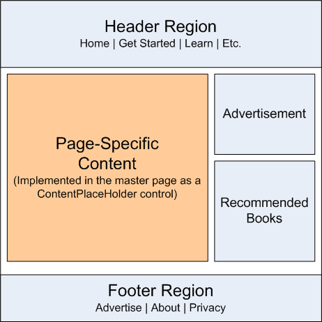
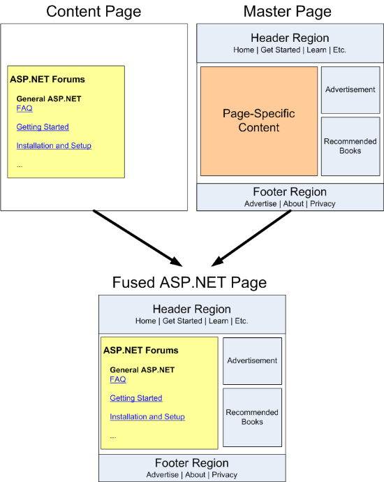
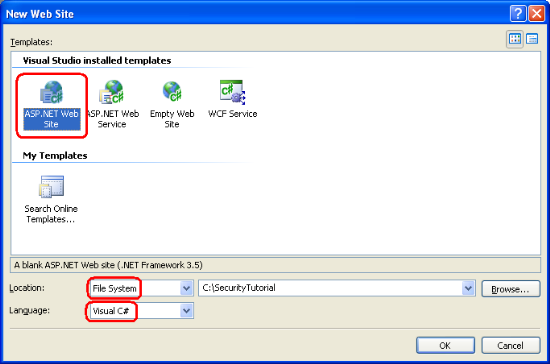
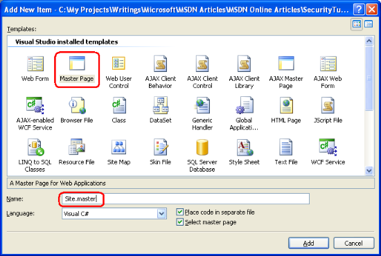
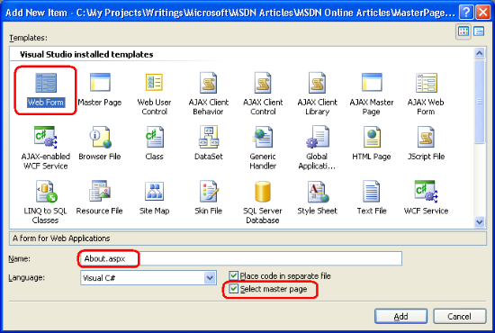
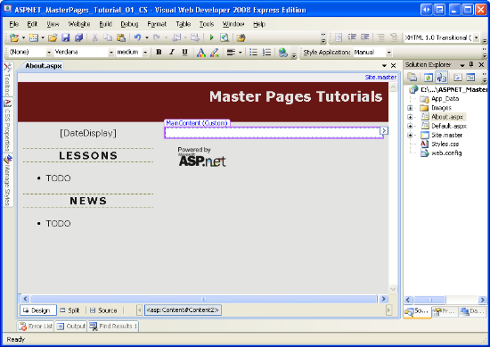
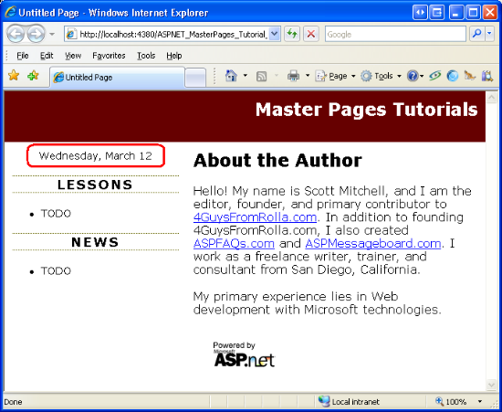

Creating a Site-Wide Layout Using Master Pages (C#)
====================
by [Scott Mitchell](https://twitter.com/ScottOnWriting)

[Download Code](http://download.microsoft.com/download/e/e/f/eef369f5-743a-4a52-908f-b6532c4ce0a4/ASPNET_MasterPages_Tutorial_01_CS.zip) or [Download PDF](http://download.microsoft.com/download/8/f/6/8f6349e4-6554-405a-bcd7-9b094ba5089a/ASPNET_MasterPages_Tutorial_01_CS.pdf)

> This tutorial will show master page basics. Namely, what are master pages, how does one create a master page, what are content place holders, how does one create an ASP.NET page that uses a master page, how modifying the master page is automatically reflected in its associated content pages, and so on.

## Introduction

One attribute of a well-designed website is a consistent site-wide page layout. Take the www.asp.net website, for example. At the time of this writing, every page has the same content at the top and bottom of the page. As Figure 1 shows, the very top of each page displays a gray bar with a list of Microsoft Communities. Beneath that is the site logo, the list of languages into which the site has been translated, and the core sections: Home, Get Started, Learn, Downloads, and so forth. Likewise, the bottom of the page includes information about advertising on www.asp.net, a copyright statement, and a link to the privacy statement.

**Figure 01**: The www.asp.net Website Employs a Consistent Look and Feel Across All Pages ([Click to view full-size image](creating-a-site-wide-layout-using-master-pages-cs/_static/image3.png))

Another attribute of a well-designed site is the ease with which the site's appearance can be changed. Figure 1 shows the www.asp.net homepage as of March 2008, but between now and this tutorial's publication, the look and feel may have changed. Perhaps the menu items along the top will expand to include a new section for the MVC framework. Or maybe a radically new design with different colors, fonts, and layout will be unveiled. Applying such changes to the entire site should be a fast and simple process that does not require modifying the thousands of web pages that make up the site.

Creating a site-wide page template in ASP.NET is possible through the use of *master pages*. In a nutshell, a master page is a special type of ASP.NET page that defines the markup that is common among all *content pages* as well as regions that are customizable on a content page-by-content page basis. (A content page is an ASP.NET page that is bound to the master page.) Whenever a master page's layout or formatting is changed, all of its content pages' output is likewise immediately updated, which makes applying site-wide appearance changes as easy as updating and deploying a single file (namely, the master page).

This is the first tutorial in a series of tutorials that explore using master pages. Over the course of this tutorial series we:

- Examine creating master pages and their associated content pages,
- Discuss a variety of tips, tricks, and traps,
- Identify common master page pitfalls and explore workarounds,
- See how to access the master page from a content page and vice-a-versa,
- Learn how to specify a content page's master page at runtime, and
- Other advanced master page topics.

These tutorials are geared to be concise and provide step-by-step instructions with plenty of screen shots to walk you through the process visually. Each tutorial is available in C# and Visual Basic versions and includes a download of the complete code used.

This inaugural tutorial starts with a look at master page basics. We discuss how master pages work, look at creating a master page and associated content pages using Visual Web Developer, and see how changes to a master page are immediately reflected in its content pages. Let's get started!

## Understanding How Master Pages Work

Building a website with a consistent site-wide page layout requires that each web page emit common formatting markup in addition to its custom content. For example, while each tutorial or forum post on www.asp.net have their own unique content, each of these pages also render a series of common `
` elements that display the top-level section links: Home, Get Started, Learn, and so on.

There are a variety of techniques for creating web pages with a consistent look and feel. A naive approach is to simply copy and paste the common layout markup into all web pages, but this approach has a number of downsides. For starters, every time a new page is created, you must remember to copy and paste the shared content into the page. Such copying and pasting operations are ripe for error as you may accidentally copy only a subset of the shared markup into a new page. And to top it off, this approach makes replacing the existing site-wide appearance with a new one a real pain because every single page in the site must be edited in order to use the new look and feel.

Prior to ASP.NET version 2.0, page developers often placed common markup in [User Controls](https://msdn.microsoft.com/en-us/library/y6wb1a0e.aspx) and then added these User Controls to each and every page. This approach required that the page developer remember to manually add the User Controls to every new page, but allowed for easier site-wide modifications because when updating the common markup only the User Controls needed to be modified. Unfortunately, Visual Studio .NET 2002 and 2003 - the versions of Visual Studio used to create ASP.NET 1.x applications - rendered User Controls in the Design view as gray boxes. Consequently, page developers using this approach did not enjoy a WYSIWYG design-time environment.

The shortcomings of using User Controls were addressed in ASP.NET version 2.0 and Visual Studio 2005 with the introduction of *master pages*. A master page is a special type of ASP.NET page that defines both the site-wide markup and the *regions* where associated *content pages* define their custom markup. As we will see in Step 1, these regions are defined by ContentPlaceHolder controls. The ContentPlaceHolder control simply denotes a position in the master page's control hierarchy where custom content can be injected by a content page.

> [!NOTE]
> The core concepts and functionality of master pages has not changed since ASP.NET version 2.0. However, Visual Studio 2008 offers design-time support for nested master pages, a feature that was lacking in Visual Studio 2005. We will look at using nested master pages in a future tutorial.

Figure 2 shows what the master page for www.asp.net might look like. Note that the master page defines the common site-wide layout - the markup at the top, bottom, and right of every page - as well as a ContentPlaceHolder in the middle-left, where the unique content for each individual web page is located.

**Figure 02**: A Master Page Defines the Site-Wide Layout and the Regions Editable on a Content Page-by-Content Page Basis

Once a master page has been defined it can be bound to new ASP.NET pages through the tick of a checkbox. These ASP.NET pages - called content pages - include a Content control for each of the master page's ContentPlaceHolder controls. When the content page is visited through a browser the ASP.NET engine creates the master page's control hierarchy and injects the content page's control hierarchy into the appropriate places. This combined control hierarchy is rendered and the resulting HTML is returned to the end user's browser. Consequently, the content page emits both the common markup defined in its master page outside of the ContentPlaceHolder controls and the page-specific markup defined within its own Content controls. Figure 3 illustrates this concept.

**Figure 03**: The Requested Page's Markup is Fused into the Master Page ([Click to view full-size image](creating-a-site-wide-layout-using-master-pages-cs/_static/image7.png))

Now that we have discussed how master pages work, let's take a look at creating a master page and associated content pages using Visual Web Developer.

> [!NOTE]
> In order to reach the widest possible audience, the ASP.NET website we build throughout this tutorial series will be created using ASP.NET 3.5 with Microsoft's free version of Visual Studio 2008, [Visual Web Developer 2008](https://www.microsoft.com/express/vwd/). If you have not yet upgraded to ASP.NET 3.5, don't worry - the concepts discussed in these tutorials work equally well with ASP.NET 2.0 and Visual Studio 2005. However, some demo applications may use features new to the .NET Framework version 3.5; when 3.5-specific features are used, I include a note that discusses how to implement similar functionality in version 2.0. Do keep in mind that the demo applications available for download from each tutorial target the .NET Framework version 3.5, which results in a `Web.config` file that includes 3.5-specific configuration elements and references to 3.5-specific namespaces in the `using` statements in ASP.NET pages' code-behind classes. Long story short, if you have yet to install .NET 3.5 on your computer then the downloadable web application will not work without first removing the 3.5-specific markup from `Web.config`. See [Dissecting ASP.NET Version 3.5's `Web.config` File](http://www.4guysfromrolla.com/articles/121207-1.aspx) for more information on this topic. You will also need to remove the `using` statements that reference 3.5-specific namespaces.

## Step 1: Creating a Master Page

Before we can explore creating and using master and content pages, we first need an ASP.NET website. Start by creating a new file system-based ASP.NET website. To accomplish this, launch Visual Web Developer and then go to the File menu and choose New Web Site, displaying the New Web Site dialog box (see Figure 4). Choose the ASP.NET Web Site template, set the Location drop-down list to File System, choose a folder to place the web site, and set the language to C#. This will create a new web site with a `Default.aspx` ASP.NET page, an `App_Data` folder, and a `Web.config` file.

> [!NOTE]
> Visual Studio supports two modes of project management: Web Site Projects and Web Application Projects. Web Site Projects lack a project file, whereas Web Application Projects mimic the project architecture in Visual Studio .NET 2002/2003 - they include a project file and compile the project's source code into a single assembly, which is placed in the `/bin` folder. Visual Studio 2005 initially only supported Web Site Projects, although the [Web Application Project model](https://msdn.microsoft.com/en-us/library/aa730880(vs.80).aspx) was reintroduced with Service Pack 1; Visual Studio 2008 offers both project models. The Visual Web Developer 2005 and 2008 editions, however, only support Web Site Projects. I use the Web Site Project model for my demos in this tutorial series. If you are using a non-Express edition and want to use the Web Application Project model instead, feel free to do so but be aware that there may be some discrepancies between what you see on your screen and the steps you must take versus the screen shots shown and instructions provided in these tutorials.

**Figure 04**: Create a New File System-Based Web Site  ([Click to view full-size image](creating-a-site-wide-layout-using-master-pages-cs/_static/image10.png))

Next, add a master page to the site in the root directory by right-clicking on the Project name, choosing Add New Item, and selecting the Master Page template. Note that master pages end with the extension `.master`. Name this new master page `Site.master` and click Add.

**Figure 05**: Add a Master Page Named `Site.master` to the Website ([Click to view full-size image](creating-a-site-wide-layout-using-master-pages-cs/_static/image13.png))

Adding a new master page file through Visual Web Developer creates a master page with the following declarative markup:

[!code-aspx[Main](creating-a-site-wide-layout-using-master-pages-cs/samples/sample1.aspx)]

The first line in the declarative markup is the [`@Master` directive](https://msdn.microsoft.com/en-us/library/ms228176.aspx). The `@Master` directive is similar to the [`@Page` directive](https://msdn.microsoft.com/en-us/library/ydy4x04a.aspx) that appears in ASP.NET pages. It defines the server-side language (C#) and information about the location and inheritance of the master page's code-behind class.

The `DOCTYPE` and the page's declarative markup appears beneath the `@Master` directive. The page includes static HTML along with four server-side controls:

- **A Web Form (the `<form runat="server">`)** - because all ASP.NET pages typically have a Web Form - and because the master page may include Web controls that must appear within a Web Form - be sure to add the Web Form to your master page (rather than adding a Web Form to each content page).
- **A ContentPlaceHolder control named `ContentPlaceHolder1`** - this ContentPlaceHolder control appears within the Web Form and serves as the region for the content page's user interface.
- **A server-side `<head>` element** - the `<head>` element has the `runat="server"` attribute, making it accessible through server-side code. The `<head>` element is implemented this way so that the page's title and other `<head>`-related markup may be added or adjusted programmatically. For example, setting an ASP.NET page's `Title` property changes the `<title>` element rendered by the `<head>` server control.
- **A ContentPlaceHolder control named `head`** - this ContentPlaceHolder control appears within the `<head>` server control and can be used to declaratively add content to the `<head>` element.

This default master page declarative markup serves as a starting point for designing your own master pages. Feel free to edit the HTML or to add additional Web controls or ContentPlaceHolders to the master page.

> [!NOTE]
> When designing a master page make sure that the master page contains a Web Form and that at least one ContentPlaceHolder control appears within this Web Form.

### Creating a Simple Site Layout

Let's expand `Site.master`'s default declarative markup to create a site layout where all pages share: a common header; a left column with navigation, news and other site-wide content; and a footer that displays the "Powered by Microsoft ASP.NET" icon. Figure 6 shows the end result of the master page when one of its content pages is viewed through a browser. The red circled region in Figure 6 is specific to the page being visited (`Default.aspx`); the other content is defined in the master page and therefore consistent across all content pages.

**Figure 06**: The Master Page Defines the Markup for the Top, Left, and Bottom Portions ([Click to view full-size image](creating-a-site-wide-layout-using-master-pages-cs/_static/image16.png))

To achieve the site layout shown in Figure 6, start by updating the `Site.master` master page so that it contains the following declarative markup:

[!code-aspx[Main](creating-a-site-wide-layout-using-master-pages-cs/samples/sample2.aspx)]

The master page's layout is defined using a series of `
` HTML elements. The `topContent` `
` contains the markup that appears at the top of each page, while the `mainContent`, `leftContent`, and `footerContent` `
` s are used to display the page's content, the left column, and the "Powered by Microsoft ASP.NET" icon, respectively. In addition to adding these `
` elements, I also renamed the `ID` property of the primary ContentPlaceHolder control from `ContentPlaceHolder1` to `MainContent`.

The formatting and layout rules for these assorted `
` elements is spelled out in the [Cascading Stylesheet (CSS)](http://en.wikipedia.org/wiki/Cascading_Style_Sheets) file `Styles.css`, which is specified via a &lt;link&gt; element in the master page's &lt;head&gt; element. These various rules define the look and feel of each `
` element noted above. For example, the `topContent` `
` element, which displays the "Master Pages Tutorials" text and link, has its formatting rules specified in `Styles.css` as follows:

[!code-css[Main](creating-a-site-wide-layout-using-master-pages-cs/samples/sample3.css)]

If you are following along at your computer, you will need to download this tutorial's accompanying code and add the `Styles.css` file to your project. Similarly, you will also need to create a folder named Images and copy the "Powered by Microsoft ASP.NET" icon from the downloaded demo website to your project.

> [!NOTE]
> A discussion of CSS and web page formatting is beyond the scope of this article. For more on CSS, check out the [CSS Tutorials](http://www.w3schools.com/css/default.asp) at [W3Schools.com](http://www.w3schools.com/). I also encourage you to download this tutorial's accompanying code and play with the CSS settings in `Styles.css` to see the effects of different formatting rules.

### Creating a Master Page Using an Existing Design Template

Over the years I've built a number of ASP.NET web applications for small- to medium-sized companies. Some of my clients had an existing site layout they wanted to use; others hired a competent graphics designer. A few entrusted me to design the website layout. As you can tell by Figure 6, tasking a programmer to design a website's layout is usually as wise as having your accountant perform open-heart surgery while your doctor does your taxes.

Fortunately, there are innumerous websites that offer free HTML design templates - Google returned more than six million results for the search term "free website templates." One of my favorite ones is [OpenDesigns.org](http://opendesigns.org/). Once you find a website template you like, add the CSS files and images to your website project and integrate the template's HTML into your master page.

> [!NOTE]
> Microsoft also offers a number of [free ASP.NET Design Start Kit Templates](https://msdn.microsoft.com/en-us/asp.net/aa336613.aspx) that integrate into the New Web Site dialog box in Visual Studio.

## Step 2: Creating Associated Content Pages

With the master page created, we are ready to start creating ASP.NET pages that are bound to the master page. Such pages are referred to as *content pages*.

Let's add a new ASP.NET page to the project and bind it to the `Site.master` master page. Right-click on the project name in Solution Explorer and choose the Add New Item option. Select the Web Form template, enter the name `About.aspx`, and then check the "Select master page" checkbox as shown in Figure 7. Doing so will display the Select a Master Page dialog box (see Figure 8) from where you can choose the master page to use.

> [!NOTE]
> If you created your ASP.NET website using the Web Application Project model instead of the Web Site Project model you will not see the "Select master page" checkbox in the Add New Item dialog box shown in Figure 7. To create a content page when using the Web Application Project model you must choose the Web Content Form template instead of the Web Form template. After selecting the Web Content Form template and clicking Add, the same Select a Master Page dialog box shown in Figure 8 will appear.

**Figure 07**: Add a New Content Page ([Click to view full-size image](creating-a-site-wide-layout-using-master-pages-cs/_static/image19.png))

**Figure 08**: Select the `Site.master` Master Page ([Click to view full-size image](creating-a-site-wide-layout-using-master-pages-cs/_static/image22.png))

As the following declarative markup shows, a new content page contains a `@Page` directive that points back to its master page and a Content control for each of the master page's ContentPlaceHolder controls.

[!code-aspx[Main](creating-a-site-wide-layout-using-master-pages-cs/samples/sample4.aspx)]

> [!NOTE]
> In the "Creating a Simple Site Layout" section in Step 1 I renamed `ContentPlaceHolder1` to `MainContent`. If you did not rename this ContentPlaceHolder control's `ID` in the same way, your content page's declarative markup will differ slightly from the markup shown above. Namely, the second Content control's `ContentPlaceHolderID` will reflect the `ID` of the corresponding ContentPlaceHolder control in your master page.

When rendering a content page, the ASP.NET engine must fuse the page's Content controls with its master page's ContentPlaceHolder controls. The ASP.NET engine determines the content page's master page from the `@Page` directive's `MasterPageFile` attribute. As the above markup shows, this content page is bound to `~/Site.master`.

Because the master page has two ContentPlaceHolder controls - `head` and `MainContent` - Visual Web Developer generated two Content controls. Each Content control references a particular ContentPlaceHolder via its `ContentPlaceHolderID` property.

Where master pages shine over previous site-wide template techniques is with their design-time support. Figure 9 shows the `About.aspx` content page when viewed through Visual Web Developer's Design view. Note that while the master page content is visible, it is grayed out and cannot be modified. The Content controls corresponding to the master page's ContentPlaceHolders are, however, editable. And just like with any other ASP.NET page, you can create the content page's interface by adding Web controls through the Source or Design views.

**Figure 09**: The Content Page's Design View Displays Both the Page-Specific and Master Page Contents ([Click to view full-size image](creating-a-site-wide-layout-using-master-pages-cs/_static/image25.png))

### Adding Markup and Web Controls to the Content Page

Take a moment to create some content for the `About.aspx` page. As you can see in Figure 10, I entered an "About the Author" heading and a couple of paragraphs of text, but feel free to add Web controls, too. After creating this interface, visit the `About.aspx` page through a browser.

**Figure 10**: Visit the `About.aspx` Page Through a Browser ([Click to view full-size image](creating-a-site-wide-layout-using-master-pages-cs/_static/image28.png))

It is important to understand that the requested content page and its associated master page are fused and rendered as a whole entirely on the web server. The end user's browser is then sent the resulting, fused HTML. To verify this, view the HTML received by the browser by going to the View menu and choosing Source. Note that there are no frames or any other specialized techniques for displaying two different web pages in a single window.

### Binding a Master Page to an Existing ASP.NET Page

As we saw in this step, adding a new content page to an ASP.NET web application is as easy as checking the "Select master page" checkbox and picking the master page. Unfortunately, converting an existing ASP.NET page to a master page is not as easy.

To bind a master page to an existing ASP.NET page you need to perform the following steps:

1. Add the `MasterPageFile` attribute to the ASP.NET page's `@Page` directive, pointing it to the appropriate master page.
2. Add Content controls for each of the ContentPlaceHolders in the master page.
3. Selectively cut and paste the ASP.NET page's existing content into the appropriate Content controls. I say "selectively" here because the ASP.NET page likely contains markup that's already expressed by the master page, such as the `DOCTYPE`, the `<html>` element, and the Web Form.

For step-by-step instructions on this process along with screen shots, check out [Scott Guthrie](https://weblogs.asp.net/scottgu/)'s [Using Master Pages and Site Navigation](http://webproject.scottgu.com/CSharp/MasterPages/MasterPages.aspx) tutorial. The "Update `Default.aspx` and `DataSample.aspx` to use the Master Page" section details these steps.

Because it is much easier to create new content pages than it is to convert existing ASP.NET pages into content pages, I recommend that whenever you create a new ASP.NET website add a master page to the site. Bind all new ASP.NET pages to this master page. Don't worry if the initial master page is very simple or plain; you can update the master page later.

> [!NOTE]
> When creating a new ASP.NET application, Visual Web Developer adds a `Default.aspx` page that isn't bound to a master page. If you want to practice converting an existing ASP.NET page into a content page, go ahead and do so with `Default.aspx`. Alternatively, you can delete `Default.aspx` and then re-add it, but this time checking the "Select master page" checkbox.

## Step 3: Updating the Master Page's Markup

One of the primary benefits of master pages is that a single master page may be used to define the overall layout for numerous pages on the site. Therefore, updating the site's look and feel requires updating a single file - the master page.

To illustrate this behavior, let's update our master page to include the current date in at the top of the left column. Add a Label named `DateDisplay` to the `leftContent` `
`.

[!code-aspx[Main](creating-a-site-wide-layout-using-master-pages-cs/samples/sample5.aspx)]

Next, create a `Page_Load` event handler for the master page and add the following code:

[!code-csharp[Main](creating-a-site-wide-layout-using-master-pages-cs/samples/sample6.cs)]

The above code sets the Label's `Text` property to the current date and time formatted as the day of the week, the name of the month, and the two-digit day (see Figure 11). With this change, revisit one of your content pages. As Figure 11 shows, the resulting markup is immediately updated to include the change to the master page.

**Figure 11**: The Changes to the Master Page are Reflected When Viewing the a Content Page ([Click to view full-size image](creating-a-site-wide-layout-using-master-pages-cs/_static/image31.png))

> [!NOTE]
> As this example illustrates, master pages may contain server-side Web controls, code, and event handlers.

## Summary

Master pages enable ASP.NET developers to design a consistent site-wide layout that is easily updateable. Creating master pages and their associated content pages is as simple as creating standard ASP.NET pages, as Visual Web Developer offers rich design-time support.

The master page example we created in this tutorial had two ContentPlaceHolder controls, `head` and `MainContent`. We only specified markup for the `MainContent` ContentPlaceHolder control in our content page, however. In the next tutorial we look at using multiple Content controls in the content page. We also see how to define default markup for Content controls within the master page, as well as how to toggle between using the default markup defined in the master page and providing custom markup from the content page.

Happy Programming!

### Further Reading

For more information on the topics discussed in this tutorial, refer to the following resources:

- [ASP.NET for Designers: Free Design Templates and Guidance on Building ASP.NET Websites Using Web Standards](https://msdn.microsoft.com/en-us/asp.net/aa336602.aspx)
- [ASP.NET Master Pages Overview](https://msdn.microsoft.com/en-us/library/wtxbf3hh.aspx)
- [Cascading Stylesheets (CSS) Tutorials](http://www.w3schools.com/css/default.asp)
- [Dynamically Setting the Page's Title](http://aspnet.4guysfromrolla.com/articles/051006-1.aspx)
- [Master Pages in ASP.NET](http://www.odetocode.com/articles/419.aspx)
- [Master Pages QuickStart Tutorials](https://quickstarts.asp.net/QuickStartv20/aspnet/doc/masterpages/default.aspx)

### About the Author

[Scott Mitchell](http://www.4guysfromrolla.com/ScottMitchell.shtml), author of multiple ASP/ASP.NET books and founder of 4GuysFromRolla.com, has been working with Microsoft Web technologies since 1998. Scott works as an independent consultant, trainer, and writer. His latest book is [*Sams Teach Yourself ASP.NET 3.5 in 24 Hours*](https://www.amazon.com/exec/obidos/ASIN/0672327384/4guysfromrollaco). Scott can be reached at [mitchell@4GuysFromRolla.com](mailto:mitchell@4GuysFromRolla.com) or via his blog at [http://ScottOnWriting.NET](http://scottonwriting.net/).

### Special Thanks To

Interested in reviewing my upcoming MSDN articles? If so, drop me a line at [mitchell@4GuysFromRolla.com](mailto:mitchell@4GuysFromRolla.com).

>[!div class="step-by-step"]
[Next](multiple-contentplaceholders-and-default-content-cs.md)