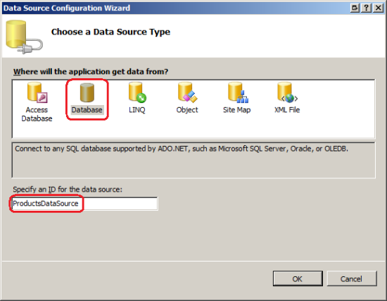
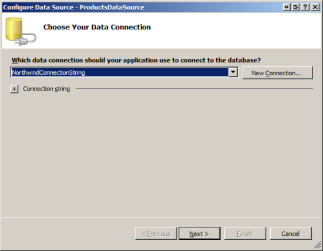
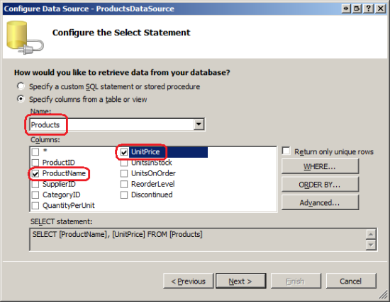
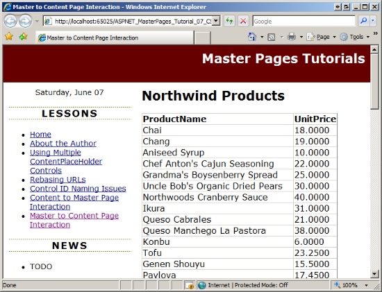
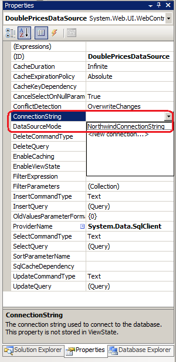
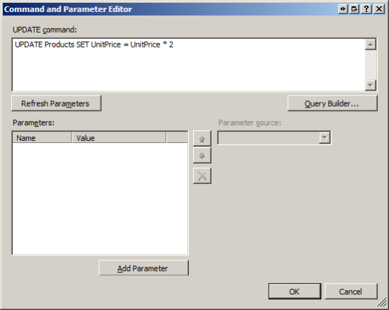
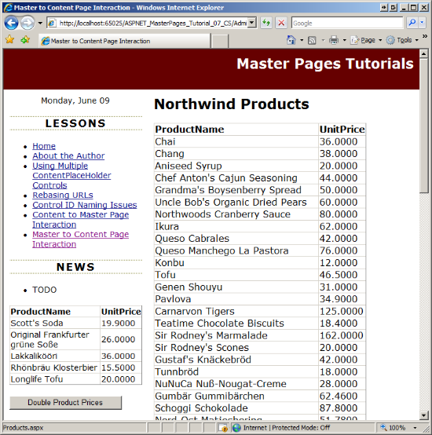

Interacting with the Content Page from the Master Page (VB)
====================
by [Scott Mitchell](https://twitter.com/ScottOnWriting)

[Download Code](http://download.microsoft.com/download/1/8/4/184e24fa-fcc8-47fa-ac99-4b6a52d41e97/ASPNET_MasterPages_Tutorial_07_VB.zip) or [Download PDF](http://download.microsoft.com/download/e/b/4/eb4abb10-c416-4ba4-9899-32577715b1bd/ASPNET_MasterPages_Tutorial_07_VB.pdf)

> Examines how to call methods, set properties, etc. of the Content Page from code in the Master Page.

## Introduction

The preceding tutorial examined how to have the content page programmatically interact with its master page. Recall that we updated the master page to include a GridView control that listed the five most recently added products. We then created a content page from which the user could add a new product. Upon adding a new product, the content page needed to instruct the master page to refresh its GridView so that it would include the just-added product. This functionality was accomplished by adding a public method to the master page that refreshed the data bound to the GridView, and then invoking that method from the content page.

The most common form of content and master page interaction originates from the content page. However, it is possible for the master page to rouse the current content page into action, and such functionality may be needed if the master page contains user interface elements that enable users to modify data that is also displayed on the content page. Consider a content page that displays the products information in a GridView control and a master page that includes a Button control that, when clicked, doubles the prices of all products. Much like the example in the preceding tutorial, the GridView needs to be refreshed after the double price Button is clicked so that it displays the new prices, but in this scenario it's the master page that needs to rouse the content page into action.

This tutorial explores how to have the master page invoke functionality defined in the content page.

### Instigating Programmatic Interaction via an Event and Event Handlers

Invoking content page functionality from a master page is more challenging than the other way around. Because a content page has a single master page, when instigating the programmatic interaction from the content page we know what public methods and properties are at our disposal. A master page, however, can have many different content pages, each with its own set of properties and methods. How, then, can we write code in the master page to perform some action in its content page when we don't know what content page will be invoked until runtime?

Consider an ASP.NET Web control, such as the Button control. A Button control can appear on any number of ASP.NET pages and needs a mechanism by which it can alert the page that it has been clicked. This is accomplished using *events*. In particular, the Button control raises its `Click` event when it is clicked; the ASP.NET page that contains the Button can optionally respond to that notification via an *event handler*.

This same pattern can be used to have a master page trigger functionality in its content pages:

1. Add an event to the master page.
2. Raise the event whenever the master page needs to communicate with its content page. For example, if the master page needs to alert its content page that the user has doubled the prices, its event would be raised immediately after the prices have been doubled.
3. Create an event handler in those content pages that need to take some action.

This remainder of this tutorial implements the example outlined in the Introduction; namely, a content page that lists the products in the database and a master page that includes a Button control to double the prices.

## Step 1: Displaying Products in a Content Page

Our first order of business is to create a content page that lists the products from the Northwind database. (We added the Northwind database to the project in the preceding tutorial, [*Interacting with the Master Page from the Content Page*](interacting-with-the-master-page-from-the-content-page-vb.md).) Start by adding a new ASP.NET page to the `~/Admin` folder named `Products.aspx`, making sure to bind it to the `Site.master` master page. Figure 1 shows the Solution Explorer after this page has been added to the website.

**Figure 01**: Add a New ASP.NET Page to the `Admin` Folder ([Click to view full-size image](interacting-with-the-content-page-from-the-master-page-vb/_static/image3.png))

Recall that in the [*Specifying the Title, Meta Tags, and Other HTML Headers in the Master Page*](specifying-the-title-meta-tags-and-other-html-headers-in-the-master-page-vb.md) tutorial we created a custom base page class named `BasePage` that generates the page's title if it is not explicitly set. Go to the `Products.aspx` page's code-behind class and have it derive from `BasePage` (instead of from `System.Web.UI.Page`).

Finally, update the `Web.sitemap` file to include an entry for this lesson. Add the following markup beneath the `<siteMapNode>` for the Content to Master Page Interaction lesson:

[!code-xml[Main](interacting-with-the-content-page-from-the-master-page-vb/samples/sample1.xml)]

The addition of this `<siteMapNode>` element is reflected in the Lessons list (see Figure 5).

Return to `Products.aspx`. In the Content control for `MainContent`, add a GridView control and name it `ProductsGrid`. Bind the GridView to a new SqlDataSource control named `ProductsDataSource`.

**Figure 02**: Bind the GridView to a New SqlDataSource Control  ([Click to view full-size image](interacting-with-the-content-page-from-the-master-page-vb/_static/image6.png))

Configure the wizard so that it uses the Northwind database. If you worked through the previous tutorial then you should already have a connection string named `NorthwindConnectionString` in `Web.config`. Choose this connection string from the drop-down list, as shown in Figure 3.

**Figure 03**: Configure the SqlDataSource to Use the Northwind Database  ([Click to view full-size image](interacting-with-the-content-page-from-the-master-page-vb/_static/image9.png))

Next, specify the data source control's `SELECT` statement by choosing the Products table from the drop-down list and returning the `ProductName` and `UnitPrice` columns (see Figure 4). Click Next and then Finish to complete the Configure Data Source wizard.

**Figure 04**: Return the `ProductName` and `UnitPrice` Fields from the `Products` Table  ([Click to view full-size image](interacting-with-the-content-page-from-the-master-page-vb/_static/image12.png))

That's all there is to it! After completing the wizard Visual Studio adds two BoundFields to the GridView to mirror the two fields returned by the SqlDataSource control. The GridView and SqlDataSource controls' markup follows. Figure 5 shows the results when viewed through a browser.

[!code-aspx[Main](interacting-with-the-content-page-from-the-master-page-vb/samples/sample2.aspx)]

**Figure 05**: Each Product and its Price is Listed in the GridView  ([Click to view full-size image](interacting-with-the-content-page-from-the-master-page-vb/_static/image15.png))

> [!NOTE]
> Feel free to clean up the appearance of the GridView. Some suggestions include formatting the displayed UnitPrice value as a currency and using background colors and fonts to improve the grid's appearance. For more information on displaying and formatting data in ASP.NET, refer to my [Working with Data tutorial series](../../data-access/index.md).

## Step 2: Adding a Double Prices Button to the Master Page

Our next task is to add a Button Web control to the master page that, when clicked, will double the price of all products in the database. Open the `Site.master` master page and drag a Button from the Toolbox onto the Designer, placing it beneath the `RecentProductsDataSource` SqlDataSource control we added in the previous tutorial. Set the Button's `ID` property to `DoublePrice` and its `Text` property to "Double Product Prices".

Next, add a SqlDataSource control to the master page, naming it `DoublePricesDataSource`. This SqlDataSource will be used to execute the `UPDATE` statement to double all prices. Specifically, we need to set its `ConnectionString` and `UpdateCommand` properties to the appropriate connection string and `UPDATE` statement. Then we need to call this SqlDataSource control's `Update` method when the `DoublePrice` Button is clicked. To set the `ConnectionString` and `UpdateCommand` properties, select the SqlDataSource control and then go to the Properties window. The `ConnectionString` property lists those connection strings already stored in `Web.config` in a drop-down list; choose the `NorthwindConnectionString` option as shown in Figure 6.

**Figure 06**: Configure the SqlDataSource to Use the `NorthwindConnectionString` ([Click to view full-size image](interacting-with-the-content-page-from-the-master-page-vb/_static/image18.png))

To set the `UpdateCommand` property, locate the UpdateQuery option in the Properties window. This property, when selected, displays a button with ellipses; click this button to display the Command and Parameter Editor dialog box shown in Figure 7. Type the following `UPDATE` statement into the dialog box's textbox:

[!code-sql[Main](interacting-with-the-content-page-from-the-master-page-vb/samples/sample3.sql)]

This statement, when executed, will double the `UnitPrice` value for each record in the `Products` table.

**Figure 07**: Set SqlDataSource's `UpdateCommand` Property  ([Click to view full-size image](interacting-with-the-content-page-from-the-master-page-vb/_static/image21.png))

After setting these properties, your Button and SqlDataSource controls' declarative markup should look similar to the following:

[!code-aspx[Main](interacting-with-the-content-page-from-the-master-page-vb/samples/sample4.aspx)]

All that remains is to call its `Update` method when the `DoublePrice` Button is clicked. Create a `Click` event handler for the `DoublePrice` Button and add the following code:

[!code-vb[Main](interacting-with-the-content-page-from-the-master-page-vb/samples/sample5.vb)]

To test this functionality, visit the `~/Admin/Products.aspx` page we created in Step 1 and click the "Double Product Prices" button. Clicking the button causes a postback and executes the `DoublePrice` Button's `Click` event handler, doubling the prices of all products. The page is then re-rendered and the markup is returned and re-displayed in the browser. The GridView in the content page, however, lists the same prices as before the "Double Product Prices" button was clicked. This is because the data initially loaded in the GridView had its state stored in view state, so it's not reloaded on postbacks unless instructed otherwise. If you visit a different page and then return to the `~/Admin/Products.aspx` page you'll see the updated prices.

## Step 3: Raising an Event When the Prices are Doubled

Because the GridView in the `~/Admin/Products.aspx` page does not immediately reflect the price doubling, a user may understandably think that they did not click the "Double Product Prices" button, or that it didn't work. They may try clicking the button a few more times, doubling the prices again and again. To fix this we need to have the grid in the content page display the new prices immediately after they are doubled.

As discussed earlier in this tutorial, we need to raise an event in the master page whenever the user clicks the `DoublePrice` Button. An event is a way for one class (an event publisher) to notify another a set of other classes (the event subscribers) that something interesting has occurred. In this example, the master page is the event publisher; those content pages that care about when the `DoublePrice` Button is clicked are the subscribers.

A class subscribes to an event by creating an *event handler*, which is a method that is executed in response to the event being raised. The publisher defines the events he raises by defining an *event delegate*. The event delegate specifies what input parameters the event handler must accept. In the .NET Framework, event delegates do not return any value and accept two input parameters:

- An `Object`, which identifies the event source, and
- A class derived from `System.EventArgs`

The second parameter passed to an event handler can include additional information about the event. While the base `EventArgs` class does not pass along any information, the .NET Framework includes a number of classes that extend `EventArgs` and encompass additional properties. For example, a `CommandEventArgs` instance is passed to event handlers that respond to the `Command` event, and includes two informational properties: `CommandArgument` and `CommandName`.

> [!NOTE]
> For more information on creating, raising, and handling events, see [Events and Delegates](https://msdn.microsoft.com/en-us/library/17sde2xt.aspx) and [Event Delegates in Simple English](http://www.codeproject.com/KB/cs/eventdelegates.aspx).

To define an event use the following syntax:

[!code-vb[Main](interacting-with-the-content-page-from-the-master-page-vb/samples/sample6.vb)]

Because we only need to alert the content page when the user has clicked the `DoublePrice` Button and do not need to pass along any other additional information, we can use the event delegate `EventHandler`, which defines an event handler that accepts as its second parameter an object of type `System.EventArgs`. To create the event in the master page, add the following line of code to the master page's code-behind class:

[!code-vb[Main](interacting-with-the-content-page-from-the-master-page-vb/samples/sample7.vb)]

The above code adds a public event to the master page named `PricesDoubled`. We now need to raise this event after the prices have been doubled. To raise an event use the following syntax:

[!code-vb[Main](interacting-with-the-content-page-from-the-master-page-vb/samples/sample8.vb)]

Where *sender* and *eventArgs* are the values you want to pass to the subscriber's event handler.

Update the `DoublePrice` `Click` event handler with the following code:

[!code-vb[Main](interacting-with-the-content-page-from-the-master-page-vb/samples/sample9.vb)]

As before, the `Click` event handler starts by calling the `DoublePricesDataSource` SqlDataSource control's `Update` method to double the prices of all products. Following that there are two additions to the event handler. First, the `RecentProducts` GridView's data is refreshed. This GridView was added to the master page in the preceding tutorial and displays the five most recently-added products. We need to refresh this grid so that it shows the just-doubled prices for these five products. Following that, the `PricesDoubled` event is raised. A reference to the master page itself (`Me`) is sent to the event handler as the event source and an empty `EventArgs` object is sent as the event arguments.

## Step 4: Handling the Event in the Content Page

At this point the master page raises its `PricesDoubled` event whenever the `DoublePrice` Button control is clicked. However, this is only half the battle - we still need to handle the event in the subscriber. This involves two steps: creating the event handler and adding event wiring code so that when the event is raised the event handler is executed.

Start by creating an event handler named `Master_PricesDoubled`. Because of how we defined the `PricesDoubled` event in the master page the event handler's two input parameters must be of types `Object` and `EventArgs`, respectively. In the event handler call the `ProductsGrid` GridView's `DataBind` method to rebind the data to the grid.

[!code-vb[Main](interacting-with-the-content-page-from-the-master-page-vb/samples/sample10.vb)]

The code for the event handler is complete but we've yet to wire the master page's `PricesDoubled` event to this event handler. The subscriber wires an event to an event handler via the following syntax:

[!code-vb[Main](interacting-with-the-content-page-from-the-master-page-vb/samples/sample11.vb)]

*publisher* is a reference to the object that offers the event *eventName*, and *methodName* is the name of the event handler defined in the subscriber.

This event wiring code must be executed on the first page visit and subsequent postbacks and should occur at a point in the page lifecycle that precedes when the event may be raised. A good time to add event wiring code is in the PreInit stage, which occurs very early in the page lifecycle.

Open `~/Admin/Products.aspx` and create a `Page_PreInit` event handler:

[!code-vb[Main](interacting-with-the-content-page-from-the-master-page-vb/samples/sample12.vb)]

In order to complete this wiring code we need a programmatic reference to the master page from the content page. As noted in the previous tutorial, there are two ways to do this:

- By casting the loosely-typed `Page.Master` property to the appropriate master page type, or
- By adding a `@MasterType` directive in the `.aspx` page and then using the strongly-typed `Master` property.

Let's use the latter approach. Add the following `@MasterType` directive to the top of the page's declarative markup:

[!code-aspx[Main](interacting-with-the-content-page-from-the-master-page-vb/samples/sample13.aspx)]

Then add the following event wiring code in the `Page_PreInit` event handler:

[!code-vb[Main](interacting-with-the-content-page-from-the-master-page-vb/samples/sample14.vb)]

With this code in place, the GridView in the content page is refreshed whenever the `DoublePrice` Button is clicked.

Figures 8 and 9 illustrate this behavior. Figure 8 shows the page when first visited. Note that price values in both the `RecentProducts` GridView (in the left column of the master page) and the `ProductsGrid` GridView (in the content page). Figure 9 shows the same screen immediately after the `DoublePrice` Button has been clicked. As you can see, the new prices are instantaneously reflected in both GridViews.

**Figure 08**: The Initial Price Values  ([Click to view full-size image](interacting-with-the-content-page-from-the-master-page-vb/_static/image24.png))

**Figure 09**: The Just-Doubled Prices are Displayed in the GridViews  ([Click to view full-size image](interacting-with-the-content-page-from-the-master-page-vb/_static/image27.png))

## Summary

Ideally, a master page and its content pages are completely separate from one another and require no level of interaction. However, if you have a master page or content page that displays data that can be modified from the master page or content page, then you may need to have the master page alert the content page (or vice-a-versa) when data is modified so that the display can be updated. In the preceding tutorial we saw how to have a content page programmatically interact with its master page; in this tutorial we looked at how to have a master page initiate the interaction.

While programmatic interaction between a content and master page can originate from either the content or master page, the interaction pattern used depends on the origination. The differences are due to the fact that a content page has a single master page, but a master page can have many different content pages. Rather than having a master page directly interact with a content page, a better approach is to have the master page raise an event to signal that some action has taken place. Those content pages that care about the action can create event handlers.

Happy Programming!

### Further Reading

For more information on the topics discussed in this tutorial, refer to the following resources:

- [Accessing and Updating Data in ASP.NET](http://aspnet.4guysfromrolla.com/articles/011106-1.aspx)
- [Events and Delegates](https://msdn.microsoft.com/en-us/library/17sde2xt.aspx)
- [Passing Information Between Content and Master Pages](http://aspnet.4guysfromrolla.com/articles/013107-1.aspx)
- [Working with Data in ASP.NET Tutorials](../../data-access/index.md)

### About the Author

[Scott Mitchell](http://www.4guysfromrolla.com/ScottMitchell.shtml), author of multiple ASP/ASP.NET books and founder of 4GuysFromRolla.com, has been working with Microsoft Web technologies since 1998. Scott works as an independent consultant, trainer, and writer. His latest book is [*Sams Teach Yourself ASP.NET 3.5 in 24 Hours*](https://www.amazon.com/exec/obidos/ASIN/0672329972/4guysfromrollaco). Scott can be reached at [mitchell@4GuysFromRolla.com](mailto:mitchell@4GuysFromRolla.com) or via his blog at [http://ScottOnWriting.NET](http://scottonwriting.net/).

### Special Thanks To

This tutorial series was reviewed by many helpful reviewers. Lead reviewer for this tutorial was Suchi Banerjee. Interested in reviewing my upcoming MSDN articles? If so, drop me a line at [mitchell@4GuysFromRolla.com](mailto:mitchell@4GuysFromRolla.com)

>[!div class="step-by-step"]
[Previous](interacting-with-the-master-page-from-the-content-page-vb.md)
[Next](master-pages-and-asp-net-ajax-vb.md)