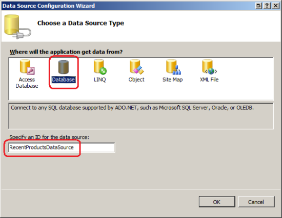
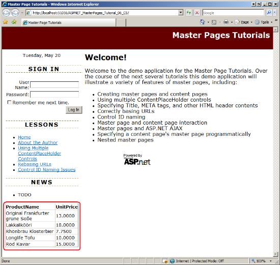
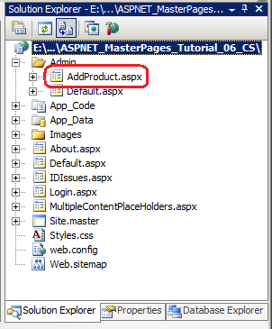
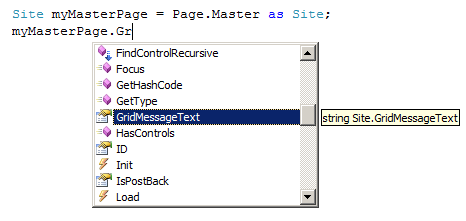

Interacting with the Master Page from the Content Page (VB)
====================
by [Scott Mitchell](https://twitter.com/ScottOnWriting)

[Download Code](http://download.microsoft.com/download/1/8/4/184e24fa-fcc8-47fa-ac99-4b6a52d41e97/ASPNET_MasterPages_Tutorial_06_VB.zip) or [Download PDF](http://download.microsoft.com/download/e/b/4/eb4abb10-c416-4ba4-9899-32577715b1bd/ASPNET_MasterPages_Tutorial_06_VB.pdf)

> Examines how to call methods, set properties, etc. of the Master Page from code in the Content Page.

## Introduction

Over the course of the past five tutorials we have looked at how to create a master page, define content regions, bind ASP.NET pages to a master page, and define page-specific content. When a visitor requests a particular content page, the content and master pages' markup are fused at runtime, resulting in the rendering of a unified control hierarchy. Therefore, we have already seen one way in which the master page and one of its content pages can interact: the content page spells out the markup to transfuse into the master page's ContentPlaceHolder controls.

What we have yet to examine is how the master page and content page can interact programmatically. In addition to defining the markup for the master page's ContentPlaceHolder controls, a content page can also assign values to its master page's public properties and invoke its public methods. Similarly, a master page may interact with its content pages. While programmatic interaction between a master and content page is less common than the interaction between their declarative markups, there are many scenarios where such programmatic interaction is needed.

In this tutorial we examine how a content page can programmatically interact with its master page; in the next tutorial we will look at how the master page can similarly interact with its content pages.

## Examples of Programmatic Interaction Between a Content Page and its Master Page

When a particular region of a page needs to be configured on a page-by-page basis, we use a ContentPlaceHolder control. But what about situations where the majority of pages need to emit a certain output, but a small number of pages need to customize it to show something else? One such example, which we examined in the [*Multiple ContentPlaceHolders and Default Content*](multiple-contentplaceholders-and-default-content-vb.md) tutorial, involves displaying a login interface on each page. While most pages should include a login interface, it should be suppressed for a handful of pages, such as: the main login page (`Login.aspx`); the Create Account page; and other pages that are only accessible to authenticated users. The [*Multiple ContentPlaceHolders and Default Content*](multiple-contentplaceholders-and-default-content-vb.md) tutorial showed how to define the default content for a ContentPlaceHolder in the master page and then how to override it in those pages where the default content was not wanted.

Another option is to create a public property or method within the master page that indicates whether to show or hide the login interface. For example, the master page might include a public property named `ShowLoginUI` whose value was used to set the `Visible` property of the Login control in the master page. Those content pages where the login user interface should be suppressed could then programmatically set the `ShowLoginUI` property to `False`.

Perhaps the most common example of content and master page interaction occurs when data displayed in the master page needs to be refreshed after some action has transpired in the content page. Consider a master page that includes a GridView that displays the five most recently added records from a particular database table, and that one of its content pages includes an interface for adding new records to that same table.

When a user visits the page to add a new record, she sees the five most recently added records displayed in the master page. After filling in the values for the new record's columns, she submits the form. Assuming that the GridView in the master page has its `EnableViewState` property set to True (the default), its content is reloaded from view state and, consequently, the five same records are displayed even though a newer record was just added to the database. This may confuse the user.

> [!NOTE]
> Even if you disable the GridView's view state so that it rebinds to its underlying data source on every postback, it still won't show the just-added record because the data is bound to the GridView earlier in the page lifecycle than when the new record is added to the database.

To remedy this so that the just-added record is displayed in the master page's GridView on postback we need to instruct the GridView to rebind to its data source *after* the new record has been added to the database. This requires interaction between the content and master pages because the interface for adding the new record (and its event handlers) are in the content page but the GridView that needs to be refreshed is in the master page.

Because refreshing the master page's display from an event handler in the content page is one of the most common needs for content and master page interaction, let's explore this topic in more detail. The download for this tutorial includes a Microsoft SQL Server 2005 Express Edition database named `NORTHWIND.MDF` in the website's `App_Data` folder. The Northwind database stores product, employee, and sales information for a fictitious company, Northwind Traders.

Step 1 walks through displaying the five most recently added products in a GridView in the master page. Step 2 creates a content page for adding new products. Step 3 looks at how to create public properties and methods in the master page, and Step 4 illustrates how to programmatically interface with these properties and methods from the content page.

> [!NOTE]
> This tutorial does not delve into the specifics of working with data in ASP.NET. The steps for setting up the master page to display data and the content page for inserting data are complete, yet breezy. For a more in-depth look at displaying and inserting data and using the SqlDataSource and GridView controls, consult the resources in the Further Readings section at the end of this tutorial.

## Step 1: Displaying the Five Most Recently Added Products in the Master Page

Open the Site.master master page and add a Label and a GridView control to the `leftContent` `
`. Clear out the Label's `Text` property, set its `EnableViewState` property to `False`, and its `ID` property to `GridMessage`; set the GridView's `ID` property to `RecentProducts`. Next, from the Designer, expand the GridView's smart tag and choose to bind it to a new data source. This launches the Data Source Configuration wizard. Because the Northwind database in the `App_Data` folder is a Microsoft SQL Server database, choose to create a SqlDataSource by selecting (see Figure 1); name the SqlDataSource `RecentProductsDataSource`.

**Figure 01**: Bind the GridView to a SqlDataSource Control Named `RecentProductsDataSource` ([Click to view full-size image](interacting-with-the-master-page-from-the-content-page-vb/_static/image3.png))

The next step asks us to specify what database to connect to. Choose the `NORTHWIND.MDF` database file from the drop-down list and click Next. Because this is the first time we've used this database, the wizard will offer to store the connection string in `Web.config`. Have it store the connection string using the name `NorthwindConnectionString`.

**Figure 02**: Connect to the Northwind Database  ([Click to view full-size image](interacting-with-the-master-page-from-the-content-page-vb/_static/image6.png))

The Configure Data Source wizard provides two means by which we can specify the query used to retrieve data:

- By specifying a custom SQL statement or stored procedure, or
- By picking a table or view and then specifying the columns to return

Because we want to return just the five most recently added products, we need to specify a custom SQL statement. Use the following `SELECT` query:

[!code-sql[Main](interacting-with-the-master-page-from-the-content-page-vb/samples/sample1.sql)]

The `TOP 5` keyword returns only the first five records from the query. The `Products` table's primary key, `ProductID`, is an `IDENTITY` column, which assures us that each new product added to the table will have a larger value than the previous entry. Therefore, sorting the results by `ProductID` in descending order returns the products starting with the most recently created ones.

**Figure 03**: Return the Five Most Recently Added Products  ([Click to view full-size image](interacting-with-the-master-page-from-the-content-page-vb/_static/image9.png))

After completing the wizard, Visual Studio generates two BoundFields for the GridView to display the `ProductName` and `UnitPrice` fields returned from the database. At this point your master page's declarative markup should include markup similar to the following:

[!code-aspx[Main](interacting-with-the-master-page-from-the-content-page-vb/samples/sample2.aspx)]

As you can see, the markup contains: the Label Web control (`GridMessage`); the GridView `RecentProducts`, with two BoundFields; and a SqlDataSource control that returns the five most recently added products.

With this GridView created and its SqlDataSource control configured, visit the website through a browser. As Figure 4 shows, you will see a grid in the lower left corner that lists the five most recently added products.

**Figure 04**: The GridView Displays the Five Most Recently Added Products ([Click to view full-size image](interacting-with-the-master-page-from-the-content-page-vb/_static/image12.png))

> [!NOTE]
> Feel free to clean up the appearance of the GridView. Some suggestions include formatting the displayed `UnitPrice` value as a currency and using background colors and fonts to improve the grid's appearance.

## Step 2: Creating a Content Page to Add New Products

Our next task is to create a content page from which a user can add a new product to the `Products` table. Add a new content page to the `Admin` folder named `AddProduct.aspx`, making sure to bind it to the `Site.master` master page. Figure 5 shows the Solution Explorer after this page has been added to the website.

**Figure 05**: Add a New ASP.NET Page to the `Admin` Folder ([Click to view full-size image](interacting-with-the-master-page-from-the-content-page-vb/_static/image15.png))

Recall that in the [*Specifying the Title, Meta Tags, and Other HTML Headers in the Master Page*](specifying-the-title-meta-tags-and-other-html-headers-in-the-master-page-vb.md) tutorial we created a custom base page class named `BasePage` that generated the page's title if it was not explicitly set. Go to the `AddProduct.aspx` page's code-behind class and have it derive from `BasePage` (instead of from `System.Web.UI.Page`).

Finally, update the `Web.sitemap` file to include an entry for this lesson. Add the following markup beneath the `<siteMapNode>` for the Control ID Naming Issues lesson:

[!code-xml[Main](interacting-with-the-master-page-from-the-content-page-vb/samples/sample3.xml)]

As shown in Figure 6, the addition of this `<siteMapNode>` element is reflected in the Lessons list.

Return to `AddProduct.aspx`. In the Content control for the `MainContent` ContentPlaceHolder, add a DetailsView control and name it `NewProduct`. Bind the DetailsView to a new SqlDataSource control named `NewProductDataSource`. Like with the SqlDataSource in Step 1, configure the wizard so that it uses the Northwind database and choose to specify a custom SQL statement. Because the DetailsView will be used to add items to the database, we need to specify both a `SELECT` statement and an `INSERT` statement. Use the following `SELECT` query:

[!code-sql[Main](interacting-with-the-master-page-from-the-content-page-vb/samples/sample4.sql)]

Then, from the INSERT tab, add the following `INSERT` statement:

[!code-sql[Main](interacting-with-the-master-page-from-the-content-page-vb/samples/sample5.sql)]

After completing the wizard go to the DetailsView's smart tag and check the "Enable Inserting" checkbox. This adds a CommandField to the DetailsView with its `ShowInsertButton` property set to True. Because this DetailsView will be used solely for inserting data, set the DetailsView's `DefaultMode` property to `Insert`.

That's all there is to it! Let's test this page. Visit `AddProduct.aspx` through a browser, enter a name and price (see Figure 6).

**Figure 06**: Add a New Product to the Database  ([Click to view full-size image](interacting-with-the-master-page-from-the-content-page-vb/_static/image18.png))

After typing in the name and price for your new product, click the Insert button. This causes the form to postback. On postback, the SqlDataSource control's `INSERT` statement is executed; its two parameters are populated with the user-entered values in the DetailsView's two TextBox controls. Unfortunately, there is no visual feedback that an insert has occurred. It would be nice to have a message displayed, confirming that a new record has been added. I leave this as an exercise for the reader. Also, after adding a new record from the DetailsView the GridView in the master page still shows the same five records as before; it does not include the just-added record. We'll examine how to remedy this in the upcoming steps.

> [!NOTE]
> In addition to adding some form of visual feedback that the insert has succeeded, I'd encourage you to also update the DetailsView's inserting interface to include validation. Currently, there is no validation. If a user enters an invalid value for the `UnitPrice` field, such as "Too expensive," an exception will be thrown on postback when the system attempts to convert that string into a decimal. For more information on customizing the inserting interface, refer to the [*Customizing the Data Modification Interface* tutorial](https://asp.net/learn/data-access/tutorial-20-vb.aspx) from my [Working with Data tutorial series](../../data-access/index.md).

## Step 3: Creating Public Properties and Methods in the Master Page

In Step 1 we added a Label Web control named `GridMessage` above the GridView in the master page. This Label is intended to optionally display a message. For example, after adding a new record to the `Products` table, we might want to show a message that reads: "*ProductName* has been added to the database." Rather than hard-code the text for this Label in the master page, we might want the message to be customizable by the content page.

Because the Label control is implemented as a protected member variable within the master page it cannot be accessed directly from content pages. In order to work with the Label within a master page from the content page (or, for that matter, any Web control in the master page) we need to create a public property in the master page that exposes the Web control or serves as a proxy by which one of its properties can be accessed. Add the following syntax to the master page's code-behind class to expose the Label's `Text` property:

[!code-vb[Main](interacting-with-the-master-page-from-the-content-page-vb/samples/sample6.vb)]

When a new record is added to the `Products` table from a content page the `RecentProducts` GridView in the master page needs to rebind to its underlying data source. To rebind the GridView call its `DataBind` method. Because the GridView in the master page is not programmatically accessible to the content pages, we need to create a public method in the master page that, when called, rebinds the data to the GridView. Add the following method to the master page's code-behind class:

[!code-vb[Main](interacting-with-the-master-page-from-the-content-page-vb/samples/sample7.vb)]

With the `GridMessageText` property and `RefreshRecentProductsGrid` method in place, any content page can programmatically set or read the value of the `GridMessage` Label's `Text` property or rebind the data to the `RecentProducts` GridView. Step 4 examines how to access the master page's public properties and methods from a content page.

> [!NOTE]
> Don't forget to mark the master page's properties and methods as `Public`. If you do not explicitly denote these properties and methods as `Public`, they will not be accessible from the content page.

## Step 4: Calling the Master Page's Public Members from a Content Page

Now that the master page has the necessary public properties and methods, we're ready to invoke these properties and methods from the `AddProduct.aspx` content page. Specifically, we need to set the master page's `GridMessageText` property and call its `RefreshRecentProductsGrid` method after the new product has been added to the database. All the ASP.NET data Web controls fire events immediately before and after completing various tasks, which make it easy for page developers to take some programmatic action either before or after the task. For example, when the end user clicks the DetailsView's Insert button, on postback the DetailsView raises its `ItemInserting` event before beginning the inserting workflow. It then inserts the record into the database. Following that, the DetailsView raises its `ItemInserted` event. Therefore, in order to work with the master page after the new product has been added, create an event handler for the DetailsView's `ItemInserted` event.

There are two ways that a content page can programmatically interface with its master page:

- Using the `Page.Master` property, which returns a loosely-typed reference to the master page, or
- Specify the page's master page type or file path via a `@MasterType` directive; this automatically adds a strongly-typed property to the page named `Master`.

Let's examine both approaches.

### Using the Loosely-Typed`Page.Master`Property

All ASP.NET web pages must derive from the `Page` class, which is located in the `System.Web.UI` namespace. The `Page` class includes a [`Master` property](https://msdn.microsoft.com/en-us/library/system.web.ui.page.master.aspx) that returns a reference to the page's master page. If the page does not have a master page `Master` returns `Nothing`.

The `Master` property returns an object of type [`MasterPage`](https://msdn.microsoft.com/en-us/library/system.web.ui.masterpage.aspx) (also located in the `System.Web.UI` namespace) which is the base type from which all master pages derive from. Therefore, to use public properties or methods defined in our website's master page we must cast the `MasterPage` object returned from the `Master` property to the appropriate type. Because we named our master page file `Site.master`, the code-behind class was named `Site`. Therefore, the following code casts the `Page.Master` property to an instance of the `Site` class.

[!code-vb[Main](interacting-with-the-master-page-from-the-content-page-vb/samples/sample8.vb)]

Now that we have casted the loosely-typed `Page.Master` property to the Site type we can reference the properties and methods specific to Site. As Figure 7 shows, the public property `GridMessageText` appears in the IntelliSense drop-down.

**Figure 07**: IntelliSense Shows our Master Page's Public Properties and Methods ([Click to view full-size image](interacting-with-the-master-page-from-the-content-page-vb/_static/image21.png))

> [!NOTE]
> If you named your master page file `MasterPage.master` then the master page's code-behind class name is `MasterPage`. This can lead to ambiguous code when casting from the type `System.Web.UI.MasterPage` to your `MasterPage` class. In short, you need to fully qualify the type you are casting to, which can be a little tricky when using the Web Site Project model. My suggestion would be to either make sure that when you create your master page you name it something other than `MasterPage.master` or, even better, create a strongly-typed reference to the master page.

### Creating a Strongly-Typed Reference with the`@MasterType`Directive

If you look closely you can see that an ASP.NET page's code-behind class is a partial class (note the `Partial` keyword in the class definition). Partial classes were introduced in C# and Visual Basic with.NET Framework 2.0 and, in a nutshell, allow for a class's members to be defined across multiple files. The code-behind class file - `AddProduct.aspx.vb`, for example - contains the code that we, the page developer, create. In addition to our code, the ASP.NET engine automatically creates a separate class file with properties and event handlers in that translate the declarative markup into the page's class hierarchy.

The automatic code generation that occurs whenever an ASP.NET page is visited paves the way for some rather interesting and useful possibilities. In the case of master pages, if we tell the ASP.NET engine what master page is being used by our content page it generates a strongly-typed `Master` property for us.

Use the [`@MasterType` directive](https://msdn.microsoft.com/en-us/library/ms228274.aspx) to inform the ASP.NET engine of the content page's master page type. The `@MasterType` directive can accept either the type name of the master page or its file path. To specify that the `AddProduct.aspx` page uses `Site.master` as its master page, add the following directive to the top of `AddProduct.aspx`:

[!code-aspx[Main](interacting-with-the-master-page-from-the-content-page-vb/samples/sample9.aspx)]

This directive instructs the ASP.NET engine to add a strongly-typed reference to the master page through a property named `Master`. With the `@MasterType` directive in place, we can call the `Site.master` master page's public properties and methods directly through the `Master` property without any casts.

> [!NOTE]
> If you omit the `@MasterType` directive, the syntax `Page.Master` and `Master` return the same thing: a loosely-typed object to the page's master page. If you include the `@MasterType` directive then `Master` returns a strongly-typed reference to the specified master page. `Page.Master`, however, still returns a loosely-typed reference. For a more thorough look at why this is the case and how the `Master` property is constructed when the `@MasterType` directive is included, see [K. Scott Allen](http://odetocode.com/blogs/scott/default.aspx)'s blog entry [`@MasterType` in ASP.NET 2.0](http://odetocode.com/Blogs/scott/archive/2005/07/16/1944.aspx).

### Updating the Master Page After Adding a New Product

Now that we know how to invoke a master page's public properties and methods from a content page, we're ready to update the `AddProduct.aspx` page so that the master page is refreshed after adding a new product. At the beginning of Step 4 we created an event handler for the DetailsView control's `ItemInserting` event, which executes immediately after the new product has been added to the database. Add the following code to that event handler:

[!code-vb[Main](interacting-with-the-master-page-from-the-content-page-vb/samples/sample10.vb)]

The above code uses both the loosely-typed `Page.Master` property and the strongly-typed `Master` property. Note that the `GridMessageText` property is set to "*ProductName* added to grid..." The just-added product's values are accessible through the `e.Values` collection; as you can see, the just-added `ProductName` value is accessed via `e.Values("ProductName")`.

Figure 8 shows the `AddProduct.aspx` page immediately after a new product - Scott's Soda - has been added to the database. Note that the just-added product name is noted in the master page's Label and that the GridView has been refreshed to include the product and its price.

**Figure 08**: The Master Page's Label and GridView Show the Just-Added Product ([Click to view full-size image](interacting-with-the-master-page-from-the-content-page-vb/_static/image24.png))

## Summary

Ideally, a master page and its content pages are completely separate from one another and require no level of interaction. While master pages and content pages should be designed with that goal in mind, there are a number of common scenarios in which a content page must interface with its master page. One of the most common reasons centers around updating a particular portion of the master page display based on some action that transpired in the content page.

The good news is that it's relatively straightforward to have a content page programmatically interact with its master page. Start by creating public properties or methods in the master page that encapsulate the functionality that needs to be invoked by a content page. Then, in the content page, access the master page's properties and methods through the loosely-typed `Page.Master` property or use the `@MasterType` directive to create a strongly-typed reference to the master page.

In the next tutorial we examine how to have the master page programmatically interact with one of its content pages.

Happy Programming!

### Further Reading

For more information on the topics discussed in this tutorial, refer to the following resources:

- [Accessing and Updating Data in ASP.NET](http://aspnet.4guysfromrolla.com/articles/011106-1.aspx)
- [ASP.NET Master Pages: Tips, Tricks, and Traps](http://www.odetocode.com/articles/450.aspx)
- [`@MasterType` in ASP.NET 2.0](http://odetocode.com/Blogs/scott/archive/2005/07/16/1944.aspx)
- [Passing Information Between Content and Master Pages](http://aspnet.4guysfromrolla.com/articles/013107-1.aspx)
- [Working with Data in ASP.NET Tutorials](../../data-access/index.md)

### About the Author

[Scott Mitchell](http://www.4guysfromrolla.com/ScottMitchell.shtml), author of multiple ASP/ASP.NET books and founder of 4GuysFromRolla.com, has been working with Microsoft Web technologies since 1998. Scott works as an independent consultant, trainer, and writer. His latest book is [*Sams Teach Yourself ASP.NET 3.5 in 24 Hours*](https://www.amazon.com/exec/obidos/ASIN/0672329972/4guysfromrollaco). Scott can be reached at [mitchell@4GuysFromRolla.com](mailto:mitchell@4GuysFromRolla.com) or via his blog at [http://ScottOnWriting.NET](http://scottonwriting.net/).

### Special Thanks To

This tutorial series was reviewed by many helpful reviewers. Lead reviewer for this tutorial was Zack Jones. Interested in reviewing my upcoming MSDN articles? If so, drop me a line at [mitchell@4GuysFromRolla.com](mailto:mitchell@4GuysFromRolla.com)

>[!div class="step-by-step"]
[Previous](control-id-naming-in-content-pages-vb.md)
[Next](interacting-with-the-content-page-from-the-master-page-vb.md)