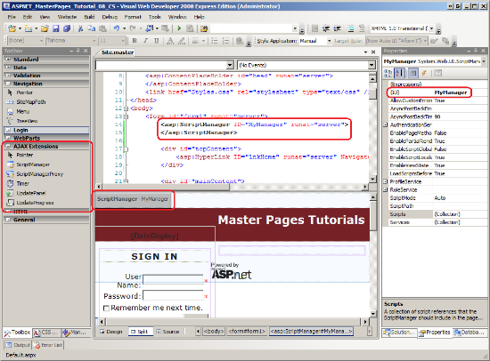
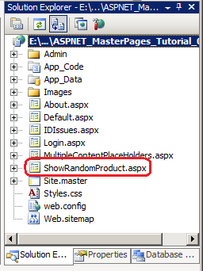
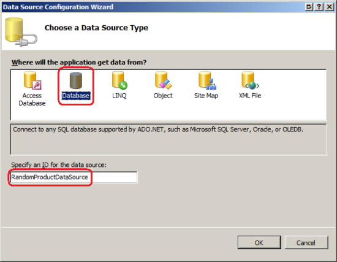
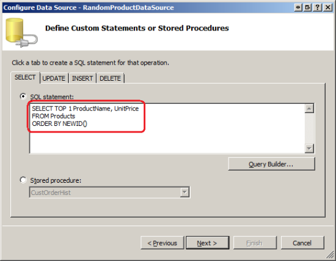
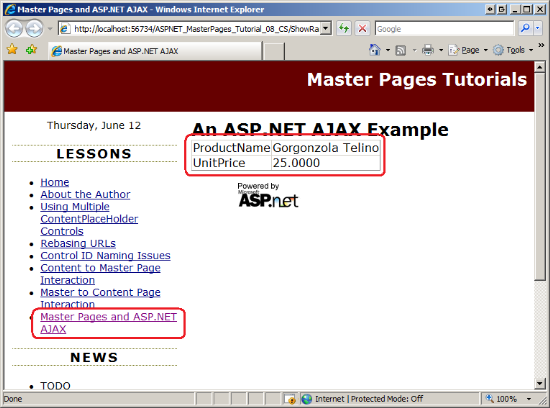
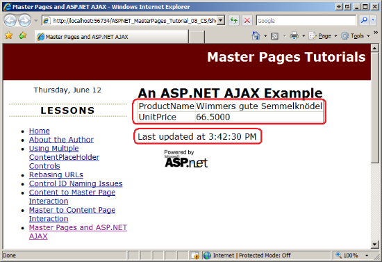
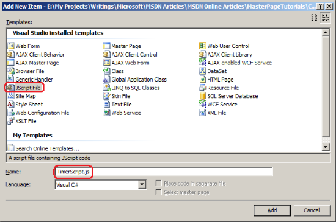
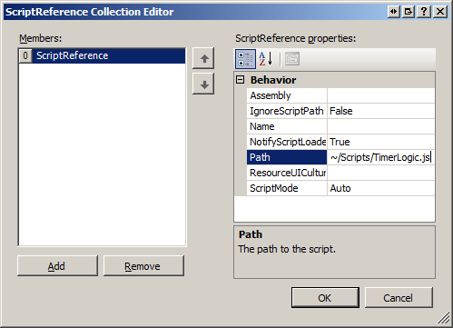
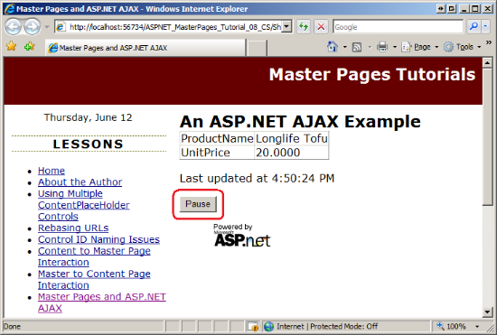

Master Pages and ASP.NET AJAX (VB)
====================
by [Scott Mitchell](https://twitter.com/ScottOnWriting)

[Download Code](http://download.microsoft.com/download/1/8/4/184e24fa-fcc8-47fa-ac99-4b6a52d41e97/ASPNET_MasterPages_Tutorial_08_VB.zip) or [Download PDF](http://download.microsoft.com/download/e/b/4/eb4abb10-c416-4ba4-9899-32577715b1bd/ASPNET_MasterPages_Tutorial_08_VB.pdf)

> Discusses options for using ASP.NET AJAX and master pages. Looks at using the ScriptManagerProxy class; discusses how the various JS files are loaded depending on whether the ScriptManager is used in the Master page or Content page.

## Introduction

Over the past several years, more and more developers have been building AJAX-enabled web applications. An AJAX-enabled website uses a number of related web technologies to offer a more responsive user experience. Creating AJAX-enabled ASP.NET applications is amazingly easy thanks to Microsoft's ASP.NET AJAX framework. ASP.NET AJAX is built into ASP.NET 3.5 and Visual Studio 2008; it is also available as a separate download for ASP.NET 2.0 applications.

When building AJAX-enabled web pages with the ASP.NET AJAX framework, you must add precisely one ScriptManager control to each and every page that uses the framework. As its name implies, the ScriptManager manages the client-side script used in AJAX-enabled web pages. At a minimum, the ScriptManager emits HTML that instructs the browser to download the JavaScript files that makeup the ASP.NET AJAX Client Library. It can also be used to register custom JavaScript files, script-enabled web services, and custom application service functionality.

If your site uses master pages (as it should), you do not necessarily need to add a ScriptManager control to every single content page; rather, you can add a ScriptManager control to the master page. This tutorial shows how to add the ScriptManager control to the master page. It also looks at how to use the ScriptManagerProxy control to register custom scripts and script services in a specific content page.

> [!NOTE]
> This tutorial does not explore designing or building AJAX-enabled web applications with the ASP.NET AJAX framework. For more information on using AJAX consult the ASP.NET AJAX videos and tutorials, as well as those resources listed in the Further Reading section at the end of this tutorial.

## Examining the Markup Emitted by the ScriptManager Control

The ScriptManager control emits markup that instructs the browser to download the JavaScript files that makeup the ASP.NET AJAX Client Library. It also adds a bit of inline JavaScript to the page that initializes this library. The following markup shows the content that is added to the rendered output of a page that includes a ScriptManager control:

[!code-html[Main](master-pages-and-asp-net-ajax-vb/samples/sample1.html)]

The `` tags instruct the browser to download and execute the JavaScript file at *url*. The ScriptManager emits three such tags; one references the file `WebResource.axd`, while the other two reference the file `ScriptResource.axd`. These files do not actually exist as files in your website. Instead, when a request for either one of these files arrives at the web server, the ASP.NET engine examines the querystring and returns the appropriate JavaScript content. The script provided by these three external JavaScript files constitute the ASP.NET AJAX framework's Client Library. The other `` tag: ``.

We can now call the `ToggleTimer` function defined in `TimerScript.js` from the client script in the `ShowRandomProduct.aspx` page. Add the following HTML within the UpdatePanel:

[!code-aspx[Main](master-pages-and-asp-net-ajax-vb/samples/sample10.aspx)]

This displays a button with the text "Pause". Whenever it is clicked, the JavaScript function `ToggleTimer` is called, passing in a reference to the button and the `id` value of the Timer control (`ProductTimer`). Note the syntax for obtaining the `id` value of the Timer control. `<%=ProductTimer.ClientID%>` emits the value of the `ProductTimer` Timer control's `ClientID` property. In the Control ID Naming in Content Pages[SKM3] tutorial we discussed the differences between the server-side `ID` value and the resulting client-side `id` value, and how `ClientID` returns the client-side `id`.

Figure 11 shows this page when first visited through a browser. The Timer is currently running and updates the displayed product information every 15 seconds. Figure 12 shows the screen after the Pause button has been clicked. Clicking the Pause button stops the Timer and updates the button's text to "Resume". The product information will refresh (and continue to refresh every 15 seconds) once the user clicks Resume.

**Figure 11**: Click the Pause Button to Stop the Timer Control  ([Click to view full-size image](master-pages-and-asp-net-ajax-vb/_static/image33.png))

**Figure 12**: Click the Resume Button to Restart the Timer  ([Click to view full-size image](master-pages-and-asp-net-ajax-vb/_static/image36.png))

## Summary

When building AJAX-enabled web applications using the ASP.NET AJAX framework it is imperative that every AJAX-enabled web page include a ScriptManager control. To facilitate this process, we can add a ScriptManager to the master page rather than having to remember to add a ScriptManager to each and every content page. Step 1 showed how to add the ScriptManager to the master page while Step 2 looked at implementing AJAX functionality in a content page.

If you need to add custom scripts, references to script-enabled Web Services, or customized authentication, authorization, or profile services to a particular content page, add a ScriptManagerProxy control to the content page and then configure the customizations there. Step 3 examined how to use the ScriptManagerProxy to register a custom JavaScript file in a specific content page.

Happy Programming!

### Further Reading

For more information on the topics discussed in this tutorial, refer to the following resources:

- [ASP.NET AJAX Framework](../../../../ajax/index.md)
- [ASP.NET AJAX Tutorials](../aspnet-ajax/understanding-partial-page-updates-with-asp-net-ajax.md)
- [ASP.NET AJAX Videos](../../../videos/aspnet-ajax/index.md)
- [Building Interactive User Interface with Microsoft ASP.NET AJAX](http://aspnet.4guysfromrolla.com/articles/101007-1.aspx)
- [Using NEWID to Randomly Sort Records](http://www.sqlteam.com/article/using-newid-to-randomly-sort-records)
- [Using the Timer Control](http://aspnet.4guysfromrolla.com/articles/061808-1.aspx)

### About the Author

[Scott Mitchell](http://www.4guysfromrolla.com/ScottMitchell.shtml), author of multiple ASP/ASP.NET books and founder of 4GuysFromRolla.com, has been working with Microsoft Web technologies since 1998. Scott works as an independent consultant, trainer, and writer. His latest book is [*Sams Teach Yourself ASP.NET 3.5 in 24 Hours*](https://www.amazon.com/exec/obidos/ASIN/0672329972/4guysfromrollaco). Scott can be reached at [mitchell@4GuysFromRolla.com](mailto:mitchell@4GuysFromRolla.com) or via his blog at [http://ScottOnWriting.NET](http://scottonwriting.net/).

### Special Thanks To

This tutorial series was reviewed by many helpful reviewers. Interested in reviewing my upcoming MSDN articles? If so, drop me a line at [mitchell@4GuysFromRolla.com](mailto:mitchell@4GuysFromRolla.com)

>[!div class="step-by-step"]
[Previous](interacting-with-the-content-page-from-the-master-page-vb.md)
[Next](specifying-the-master-page-programmatically-vb.md)