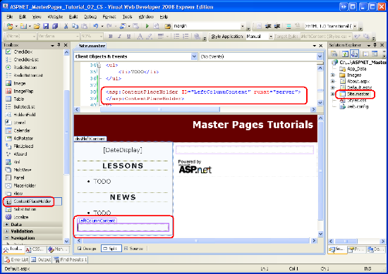
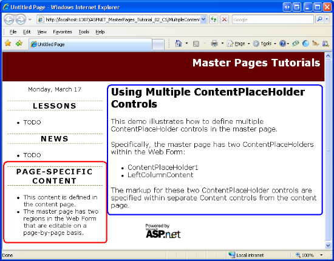
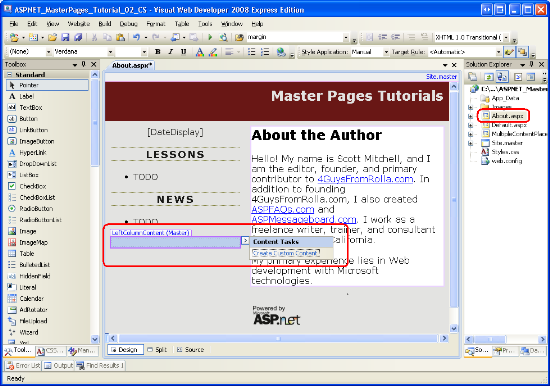
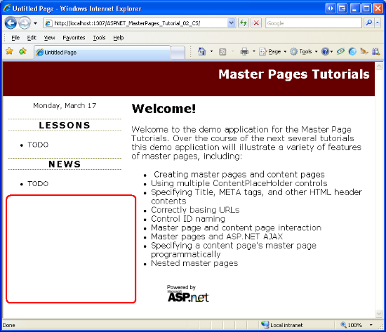
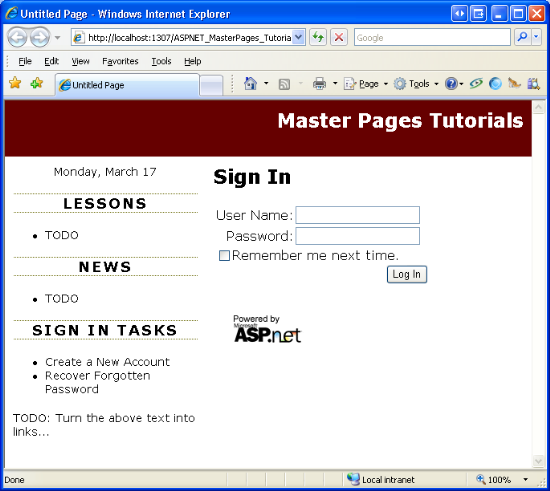

Multiple ContentPlaceHolders and Default Content (C#)
====================
by [Scott Mitchell](https://twitter.com/ScottOnWriting)

[Download Code](http://download.microsoft.com/download/e/e/f/eef369f5-743a-4a52-908f-b6532c4ce0a4/ASPNET_MasterPages_Tutorial_02_CS.zip) or [Download PDF](http://download.microsoft.com/download/8/f/6/8f6349e4-6554-405a-bcd7-9b094ba5089a/ASPNET_MasterPages_Tutorial_02_CS.pdf)

> Examines how to add multiple content place holders to a master page as well as how to specify default content in the content place holders.

## Introduction

In the preceding tutorial we examined how master pages enable ASP.NET developers to create a consistent site-wide layout. Master pages define both markup that is common to all of its content pages and regions that are customizable on a page-by-page basis. In the previous tutorial we created a simple master page (`Site.master`) and two content pages (`Default.aspx` and `About.aspx`). Our master page consisted of two ContentPlaceHolders named `head` and `MainContent`, which were located in the `<head>` element and Web Form, respectively. While the content pages each had two Content controls, we only specified markup for the one corresponding to `MainContent`.

As evidenced by the two ContentPlaceHolder controls in `Site.master`, a master page may contain multiple ContentPlaceHolders. What's more, the master page may specify default markup for the ContentPlaceHolder controls. A content page, then, can optionally specify its own markup or use the default markup. In this tutorial we look at using multiple content controls in the master page and see how to define default markup in the ContentPlaceHolder controls.

## Step 1: Adding Additional ContentPlaceHolder Controls to the Master Page

Many website designs contain several areas on the screen that are customized on a page-by-page basis. `Site.master`, the master page we created in the preceding tutorial, contains a single ContentPlaceHolder within the Web Form named `MainContent`. Specifically, this ContentPlaceHolder is located within the `mainContent` `
` element.

Figure 1 shows `Default.aspx` when viewed through a browser. The region circled in red is the page-specific markup corresponding to `MainContent`.

**Figure 01**: The Circled Region Shows the Area Currently Customizable on a Page-by-Page Basis  ([Click to view full-size image](multiple-contentplaceholders-and-default-content-cs/_static/image3.png))

Imagine that in addition to the region shown in Figure 1, we also need to add page-specific items to the left column beneath the Lessons and News sections. To accomplish this, we add another ContentPlaceHolder control to the master page. To follow along, open the `Site.master` master page in Visual Web Developer and then drag a ContentPlaceHolder control from the Toolbox onto the designer after the News section. Set the ContentPlaceHolder's `ID` to `LeftColumnContent`.

**Figure 02**: Add a ContentPlaceHolder Control to the Master Page's Left Column  ([Click to view full-size image](multiple-contentplaceholders-and-default-content-cs/_static/image6.png))

With the addition of the `LeftColumnContent` ContentPlaceHolder to the master page, we can define content for this region on a page-by-page basis by including a Content control in the page whose `ContentPlaceHolderID` is set to `LeftColumnContent`. We examine this process in Step 2.

## Step 2: Defining Content for the New ContentPlaceHolder in the Content Pages

When adding a new content page to the website, Visual Web Developer automatically creates a Content control in the page for each ContentPlaceHolder in the selected master page. Having added a the `LeftColumnContent` ContentPlaceHolder to our master page in Step 1, new ASP.NET pages will now have three Content controls.

To illustrate this, add a new content page to the root directory named `MultipleContentPlaceHolders.aspx` that is bound to the `Site.master` master page. Visual Web Developer creates this page with the following declarative markup:

[!code-aspx[Main](multiple-contentplaceholders-and-default-content-cs/samples/sample1.aspx)]

Enter some content into the Content control referencing the `MainContent` ContentPlaceHolders (`Content2`). Next, add the following markup to the `Content3` Content control (which references the `LeftColumnContent` ContentPlaceHolder):

[!code-html[Main](multiple-contentplaceholders-and-default-content-cs/samples/sample2.html)]

After adding this markup, visit the page through a browser. As Figure 3 shows, the markup placed in the `Content3` Content control is displayed in the left column beneath the News section (circled in red). The markup placed in `Content2` is displayed in the right portion of the page (circled in blue).

**Figure 03**: The Left Column Now Includes Page-Specific Content Beneath the News Section  ([Click to view full-size image](multiple-contentplaceholders-and-default-content-cs/_static/image9.png))

### Defining Content in Existing Content Pages

Creating a new content page automatically incorporates the ContentPlaceHolder control we added in Step 1. But our two existing content pages - `About.aspx` and `Default.aspx` - don't have a Content control for the `LeftColumnContent` ContentPlaceHolder. To specify content for this ContentPlaceHolder in these two existing pages, we need to add a Content control ourselves.

Unlike most ASP.NET Web controls, the Visual Web Developer Toolbox does not include a Content control item. We can manually type in the Content control's declarative markup into the Source view, but an easier and quicker approach is to use the Design view. Open the `About.aspx` page and switch to the Design view. As Figure 4 illustrates, the `LeftColumnContent` ContentPlaceHolder appears in the Design view; if you mouse over it, the title displayed reads: "LeftColumnContent (Master)." The inclusion of "Master" in the title indicates that there is no Content control defined in the page for this ContentPlaceHolder. If there exists a Content control for the ContentPlaceHolder, as in the case for `MainContent`, the title will read: "*ContentPlaceHolderID* (Custom)."

To add a Content control for the `LeftColumnContent` ContentPlaceHolder to `About.aspx`, expand the ContentPlaceHolder's smart tag and click the Create Custom Content link.

**Figure 04**: The Design View for `About.aspx` Shows the `LeftColumnContent` ContentPlaceHolder  ([Click to view full-size image](multiple-contentplaceholders-and-default-content-cs/_static/image12.png))

Clicking the Create Custom Content link generates the necessary Content control in the page and sets its `ContentPlaceHolderID` property to the ContentPlaceHolder's `ID`. For example, clicking the Create Custom Content link for `LeftColumnContent` region in `About.aspx` adds the following declarative markup to the page:

[!code-aspx[Main](multiple-contentplaceholders-and-default-content-cs/samples/sample3.aspx)]

### Omitting Content Controls

ASP.NET does not require that all content pages include Content controls for each and every ContentPlaceHolder defined in the master page. If a Content control is omitted, the ASP.NET engine uses the markup defined within the ContentPlaceHolder in the master page. This markup is referred to as the ContentPlaceHolder's *default content* and is useful in scenarios where the content for some region is common among the majority of pages, but needs to be customized for a small number of pages. Step 3 explores specifying default content in the master page.

Currently, `Default.aspx` contains two Content controls for the `head` and `MainContent` ContentPlaceHolders; it does not have a Content control for `LeftColumnContent`. Consequently, when `Default.aspx` is rendered the `LeftColumnContent` ContentPlaceHolder's default content is used. Because we have yet to define any default content for this ContentPlaceHolder, the net effect is that no markup is emitted for this region. To verify this behavior, visit `Default.aspx` through a browser. As Figure 5 shows, no markup is emitted in the left column beneath the News section.

**Figure 05**: No Content is Rendered for the `LeftColumnContent` ContentPlaceHolder  ([Click to view full-size image](multiple-contentplaceholders-and-default-content-cs/_static/image15.png))

## Step 3: Specifying Default Content in the Master Page

Some website designs include a region whose content is the same for all pages in the site except for one or two exceptions. Consider a website that supports user accounts. Such a site requires a login page where visitors can enter their credentials to sign into the site. To expedite the sign in process, the website designers might include username and password textboxes in the upper left corner of every page to allow users to sign in without having to explicitly visit the login page. While these username and password textboxes are helpful in most pages, they are redundant in the login page, which already contains textboxes for the user's credentials.

To implement this design, you could create a ContentPlaceHolder control in the upper left corner of the master page. Each page that needed to display the username and password textboxes in their upper left corner would create a Content control for this ContentPlaceHolder and add the necessary interface. The login page, on the other hand, would either omit adding a Content control for this ContentPlaceHolder or would create a Content control with no markup defined. The downside of this approach is that we have to remember to add the username and password textboxes to every page we add to the site (except for the login page). This is asking for trouble. We're likely to forget to add these textboxes to a page or two or, worse, we might not implement the interface correctly (perhaps adding just one textbox instead of two).

A better solution is to define the username and password textboxes as the ContentPlaceHolder's default content. By doing so, we only need to override this default content in those few pages that do not display the username and password textboxes (the login page, for instance). To illustrate specifying default content for a ContentPlaceHolder control, let's implement the scenario just discussed.

> [!NOTE]
> The remainder of this tutorial updates our website to include a login interface in the left column for all pages but the login page. However, this tutorial does not examine how to configure the website to support user accounts. For more information on this topic, refer to my [Forms Authentication, Authorization, User Accounts and Roles](../../older-versions-security/introduction/security-basics-and-asp-net-support-cs.md) tutorials.

### Adding a ContentPlaceHolder and Specifying Its Default Content

Open the `Site.master` master page and add the following markup to the left column between the `DateDisplay` Label and Lessons section:

[!code-aspx[Main](multiple-contentplaceholders-and-default-content-cs/samples/sample4.aspx)]

After adding this markup your master page's Design view should look similar to Figure 6.

**Figure 06**: The Master Page Includes a Login Control  ([Click to view full-size image](multiple-contentplaceholders-and-default-content-cs/_static/image18.png))

This ContentPlaceHolder, `QuickLoginUI`, has a Login Web control as its default content. The Login control displays a user interface that prompts the user for their username and password along with a Log In button. Upon clicking the Log In button, the Login control internally validates the user's credentials against the Membership API. To use this Login control in practice, then, you need to configure your site to use Membership. This topic is beyond the scope of this tutorial; refer to my [Forms Authentication, Authorization, User Accounts and Roles](../../older-versions-security/introduction/security-basics-and-asp-net-support-cs.md) tutorials for more information on building a web application that supports user accounts.

Feel free to customize the Login control's behavior or appearance. I have set two of its properties: `TitleText` and `FailureAction`. The `TitleText` property value, which defaults to "Log In", is displayed at the top of the control's user interface. I have set this property so that it displays the text "Sign In" as an `<h3>` element. The `FailureAction` property indicates what to do if the user's credentials are invalid. It defaults to a value of `Refresh`, which leaves the user on the same page and displays a failure message within the Login control. I've changed it to `RedirectToLoginPage`, which sends the user to the login page in the event of invalid credentials. I prefer to send the user to the login page when a user attempts to login from some other page, but fails, because the login page can contain additional instructions and options that would not easily fit into the left column. For example, the login page might include options to retrieve a forgotten password or to create a new account.

### Creating the Login Page and Overriding the Default Content

With the master page complete, our next step is to create the login page. Add an ASP.NET page to your site's root directory named `Login.aspx`, binding it to the `Site.master` master page. Doing so will create a page with four Content controls, one for each of the ContentPlaceHolders defined in `Site.master`.

Add a Login control to the `MainContent` Content control. Likewise, feel free to add any content to the `LeftColumnContent` region. However, make sure to leave the Content control for the `QuickLoginUI` ContentPlaceHolder empty. This will ensure that the Login control does not appear in the left column of the login page.

After defining the content for the `MainContent` and `LeftColumnContent` regions, your login page's declarative markup should look similar to the following:

[!code-aspx[Main](multiple-contentplaceholders-and-default-content-cs/samples/sample5.aspx)]

Figure 7 shows this page when viewed through a browser. Because this page specifies a Content control for the `QuickLoginUI` ContentPlaceHolder, it overrides the default content specified in the master page. The net effect is that the Login control displayed in the master page's Design view (see Figure 6) is not rendered in this page.

**Figure 07**: The Login Page Represses the `QuickLoginUI` ContentPlaceHolder's Default Content  ([Click to view full-size image](multiple-contentplaceholders-and-default-content-cs/_static/image21.png))

### Using the Default Content in New Pages

We want to show the Login control in the left column for all pages except the Login page. To achieve this, all the content pages except for the login page should omit a Content control for the `QuickLoginUI` ContentPlaceHolder. By omitting a Content control, the ContentPlaceHolder's default content will be used instead.

Our existing content pages - `Default.aspx`, `About.aspx`, and `MultipleContentPlaceHolders.aspx` - do not include a Content control for `QuickLoginUI` because they were created before we added that ContentPlaceHolder control to the master page. Therefore, these existing pages do not need to be updated. However, new pages added to the website include a Content control for the `QuickLoginUI` ContentPlaceHolder, by default. Therefore, we have to remember to remove these Content controls each time we add a new content page (unless we want to override the ContentPlaceHolder's default content, as in the case of the login page).

To remove the Content control, you can either manually delete its declarative markup from the Source view or, from the Design view, choose the Default to Master's Content link from its smart tag. Either approach removes the Content control from the page and produces the same net effect.

Figure 8 shows `Default.aspx` when viewed through a browser. Recall that `Default.aspx` only has two Content controls specified in its declarative markup - one for `head` and one for `MainContent`. As a result, the default content for the `LeftColumnContent` and `QuickLoginUI` ContentPlaceHolders are displayed.

**Figure 08**: The Default Content for the `LeftColumnContent` and `QuickLoginUI` ContentPlaceHolders are Displayed  ([Click to view full-size image](multiple-contentplaceholders-and-default-content-cs/_static/image24.png))

## Summary

The ASP.NET master page model allows for an arbitrary number of ContentPlaceHolders in the master page. What's more, ContentPlaceHolders include default content, which is emitted in the case that there is no corresponding Content control in the content page. In this tutorial we saw how to include additional ContentPlaceHolder controls in the master page and how to define Content controls for these new ContentPlaceHolders in both new and existing ASP.NET pages. We also looked at specifying default content in a ContentPlaceHolder, which is useful in scenarios where only a minority of pages needs to customize the otherwise standardized content within a certain region.

In the next tutorial we'll examine the `head` ContentPlaceHolder in more detail, seeing how to declaratively and programmatically define the title, meta tags, and other HTML headers on a page-by-page basis.

Happy Programming!

### About the Author

[Scott Mitchell](http://www.4guysfromrolla.com/ScottMitchell.shtml), author of multiple ASP/ASP.NET books and founder of 4GuysFromRolla.com, has been working with Microsoft Web technologies since 1998. Scott works as an independent consultant, trainer, and writer. His latest book is [*Sams Teach Yourself ASP.NET 3.5 in 24 Hours*](https://www.amazon.com/exec/obidos/ASIN/0672327384/4guysfromrollaco). Scott can be reached at [mitchell@4GuysFromRolla.com](mailto:mitchell@4GuysFromRolla.com) or via his blog at [http://ScottOnWriting.NET](http://scottonwriting.net/).

### Special Thanks To

This tutorial series was reviewed by many helpful reviewers. Lead reviewer for this tutorial was Suchi Banerjee. Interested in reviewing my upcoming MSDN articles? If so, drop me a line at [mitchell@4GuysFromRolla.com](mailto:mitchell@4GuysFromRolla.com).

>[!div class="step-by-step"]
[Previous](creating-a-site-wide-layout-using-master-pages-cs.md)
[Next](specifying-the-title-meta-tags-and-other-html-headers-in-the-master-page-cs.md)