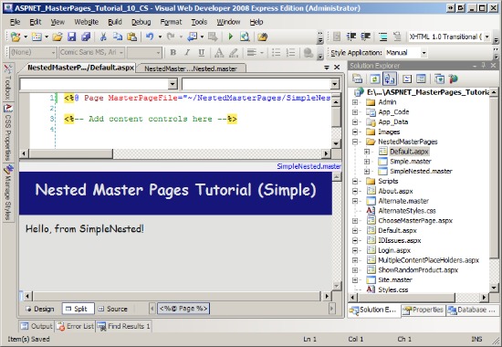
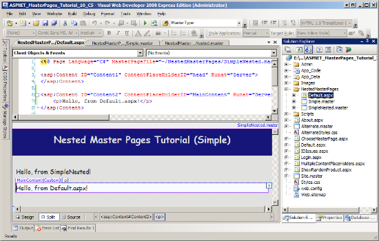
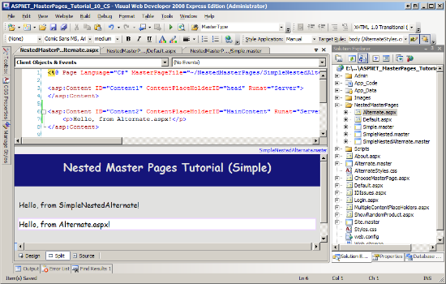
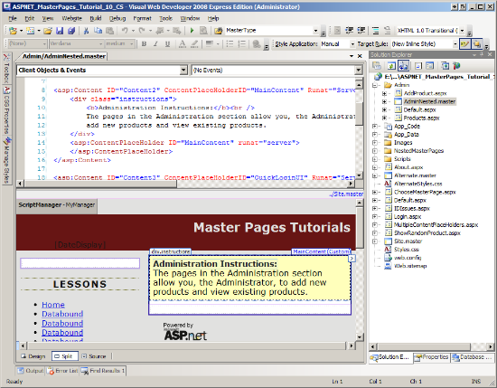

Nested Master Pages (VB)
====================
by [Scott Mitchell](https://twitter.com/ScottOnWriting)

[Download Code](http://download.microsoft.com/download/d/6/6/d66ad554-afdd-409e-a5c3-201b774fbb31/ASPNET_MasterPages_Tutorial_10_VB.zip) or [Download PDF](http://download.microsoft.com/download/d/6/6/d66ad554-afdd-409e-a5c3-201b774fbb31/ASPNET_MasterPages_Tutorial_10_VB.pdf)

> Shows how to nest one master page within another.

## Introduction

Over the course of the past nine tutorials we have seen how to implement a site-wide layout with master pages. In a nutshell, master pages allow us, the page developer, to define common markup in the master page along with specific regions that can be customized on a content page-by-content page basis. The ContentPlaceHolder controls in a master page indicate the customizable regions; the customized markup for the ContentPlaceHolder controls are defined in the content page via Content controls.

The master page techniques we've explored thus far are great if you have a single layout used across the entire site. However, many large websites have a site layout that is customized across various sections. For example, consider a health care application used by hospital staff to manage patient information, activities, and billing. There may be three types of web pages in this application:

- Staff member-specific pages where staff members can update availability, view schedules, or request vacation time.
- Patient-specific pages where staff members view or edit information for a specific patient.
- Billing-specific pages where accountants review current claim statuses and financial reports.

Every page might share a common layout, such as a menu across the top and a series of frequently used links along the bottom. But the staff-, patient-, and billing-specific pages may need to customize this generic layout. For example, perhaps all staff-specific pages should include a calendar and task list showing the currently logged on user's availability and daily schedule. Perhaps all patient-specific pages need to show the name, address, and insurance information for the patient whose information is being edited.

It's possible to create such customized layouts by using *nested master pages*. To implement the above scenario, we would start by creating a master page that defined the site-wide layout, the menu and footer content, with ContentPlaceHolders defining the customizable regions. We would then create three nested master pages, one for each type of web page. Each nested master page would define the content among the type of content pages that use the master page. In other words, the nested master page for patient-specific content pages would include markup and programmatic logic for displaying information about the patient being edited. When creating a new patient-specific page we would bind it to this nested master page.

This tutorial starts by highlighting the benefits of nested master pages. It then shows how to create and use nested master pages.

> [!NOTE]
> Nested master pages have been possible since version 2.0 of the .NET Framework. However, Visual Studio 2005 did not include design-time support for nested master pages. The good news is that Visual Studio 2008 offers a rich design-time experience for nested master pages. If you are interested in using nested master pages but are still using Visual Studio 2005, check out [Scott Guthrie](https://weblogs.asp.net/scottgu/)'s blog entry, [Tips for Nested Master Pages in VS 2005 Design-Time](https://weblogs.asp.net/scottgu/archive/2005/11/11/430382.aspx).

## The Benefits of Nested Master Pages

Many websites have an overarching site design as well as more customized designs specific to certain types of pages. For instance, in our demo web application we have created a rudimentary Administration section (the pages in the `~/Admin` folder). Currently the web pages in the `~/Admin` folder use the same master page as those pages not in the administration section (namely, `Site.master` or `Alternate.master`, depending on the user's selection).

> [!NOTE]
> For now, pretend that our site has just one master page, `Site.master`. We'll address using nested master pages with two (or more) master pages starting with "Using a Nested Master Page for the Administration Section" later in this tutorial.

Imagine that we were asked to customize the layout of the Administration pages to include additional information or links that would not otherwise be present in other pages in the site. There are four techniques to implement this requirement:

1. Manually add the Administration-specific information and links to every content page in the `~/Admin` folder.
2. Update the `Site.master` master page to include the Administration section-specific information and links, and then add code to the master page to show or hide these sections based on whether one of the Administration pages is being visited.
3. Create a new master page specifically for the Administration section, copy over the markup from `Site.master`, add the Administration section-specific information and links, and then update the content pages in the `~/Admin` folder to use this new master page.
4. Create a nested master page that binds to `Site.master` and have the content pages in the `~/Admin` folder use this new nested master page. This nested master page would include just the additional information and links specific to the Administration pages and would not need to repeat the markup already defined in `Site.master`.

The first option is the least palatable. The whole point of using master pages is to move away from having to manually copy and paste common markup to new ASP.NET pages. The second option is acceptable, but makes the application less maintainable as it bulks up the master pages with markup that is only occasionally displayed and requires developers editing the master page to work around this markup and to have to remember when, exactly, certain markup is displayed versus when it is hidden. This approach would be less tenable as customizations from more and more types of web pages needed to be accommodated by this single master page.

The third option removes the clutter and complexity issues the surfaced with the second option. However, option three's main drawback is that it requires us to copy and paste the common layout from `Site.master` to the new Administration section-specific master page. If we later decide to change the site-wide layout we have to remember to change it in two places.

The fourth option, nested master pages, give us the best of the second and third options. The site-wide layout information is maintained in one file - the top-level master page - while the content specific to particular regions is separated out into different files.

This tutorial starts with a look at creating and using a simple nested master page. We create a brand new top-level master page, two nested master pages, and two content pages. Starting with "Using a Nested Master Page for the Administration Section," we look at updating our existing master page architecture to include the use of nested master pages. Specifically, we create a nested master page and use it to include additional custom content for the content pages in the `~/Admin` folder.

## Step 1: Creating a Simple Top-Level Master Page

Creating a nested master based on one of the existing master pages and then updating an existing content page to use this new nested master page instead of the top-level master page entails some complexity because the existing content pages already expect certain ContentPlaceHolder controls defined in the top-level master page. Therefore, the nested master page must also include the same ContentPlaceHolder controls with the same names. Furthermore, our particular demo application has two master pages (`Site.master` and `Alternate.master`) that are dynamically assigned to a content page based on a user's preferences, which further adds to this complexity. We will look at updating the existing application to use nested master pages later in this tutorial, but let's first focus on a simple nested master pages example.

Create a new folder named `NestedMasterPages` and then add a new master page file to that folder named `Simple.master`. (See Figure 1 for a screen shot of the Solution Explorer after this folder and file have been added.) Drag the `AlternateStyles.css` style sheet file from the Solution Explorer onto the Designer. This adds a `<link>` element to the style sheet file in the `<head>` element, after which the master page's `<head>` element's markup should look like:

[!code-aspx[Main](nested-master-pages-vb/samples/sample1.aspx)]

Next, add the following markup within the Web Form of `Simple.master`:

[!code-aspx[Main](nested-master-pages-vb/samples/sample2.aspx)]

This markup displays a link titled "Nested Master Pages (Simple)" at the top of the page in a large white font on a navy background. Beneath that is the `MainContent` ContentPlaceHolder. Figure 1 shows the `Simple.master` master page when loaded in the Visual Studio Designer.

**Figure 01**: The Nested Master Page Defines Content Specific to the Pages in the Administration Section ([Click to view full-size image](nested-master-pages-vb/_static/image3.png))

## Step 2: Creating a Simple Nested Master Page

`Simple.master` contains two ContentPlaceHolder controls: the `MainContent` ContentPlaceHolder we added within the Web Form along with the `head` ContentPlaceHolder in the `<head>` element. If we were to create a content page and bind it to `Simple.master` the content page would have two Content controls referencing the two ContentPlaceHolders. Similarly, if we create a nested master page and bind it to `Simple.master` then the nested master page will have two Content controls.

Let's add a new nested master page to the `NestedMasterPages` folder named `SimpleNested.master`. Right-click on the `NestedMasterPages` folder and choose Add New Item. This brings up the Add New Item dialog box shown in Figure 2. Select the Master Page template type and type in the name of the new master page. To indicate that the new master page should be a nested master page, check the "Select master page" checkbox.

Next, click the Add button. This will display the same Select a Master Page dialog box you see when binding a content page to a master page (see Figure 3). Choose the `Simple.master` master page in the `NestedMasterPages` folder and click OK.

> [!NOTE]
> If you created your ASP.NET website using the Web Application Project model instead of the Web Site Project model you will not see the "Select master page" checkbox in the Add New Item dialog box shown in Figure 2. To create a nested master page when using the Web Application Project model you must choose the Nested Master Page template (instead of the Master Page template). After selecting the Nested Master Page template and clicking Add, the same Select a Master Page dialog box shown in Figure 3 will appear.

**Figure 02**: Check the "Select master page" Checkbox to Add a Nested Master Page ([Click to view full-size image](nested-master-pages-vb/_static/image6.png))

**Figure 03**: Bind the Nested Master Page to the `Simple.master` Master Page ([Click to view full-size image](nested-master-pages-vb/_static/image9.png))

The nested master page's declarative markup, shown below, contains two Content controls referencing the top-level master page's two ContentPlaceHolder controls.

[!code-aspx[Main](nested-master-pages-vb/samples/sample3.aspx)]

Except for the `<%@ Master %>` directive, the nested master page's initial declarative markup is identical to the markup that is initially generated when binding a content page to the same top-level master page. Like a content page's `<%@ Page %>` directive, the `<%@ Master %>` directive here includes a `MasterPageFile` attribute that specifies the nested master page's parent master page. The main difference between the nested master page and a content page bound to the same top-level master page is that the nested master page can include ContentPlaceHolder controls. The nested master page's ContentPlaceHolder controls define the regions where the content pages can customize the markup.

Update this nested master page so that it displays the text "Hello, from SimpleNested!" in the Content control that corresponds to the `MainContent` ContentPlaceHolder control.

[!code-aspx[Main](nested-master-pages-vb/samples/sample4.aspx)]

After making this addition, save the nested master page and then add a new content page to the `NestedMasterPages` folder named `Default.aspx`, and bind it to the `SimpleNested.master` master page. Upon adding this page you may be surprised to see that it contains no Content controls (see Figure 4)! A content page can only access its *parent* master page's ContentPlaceHolders. `SimpleNested.master` does not contain any ContentPlaceHolder controls; therefore, any content page bound to this master page cannot contain any Content controls.

**Figure 04**: The New Content Page Contains No Content Controls ([Click to view full-size image](nested-master-pages-vb/_static/image12.png))

What we need to do is update the nested master page (`SimpleNested.master`) to include ContentPlaceHolder controls. Typically you'll want your nested master pages to include a ContentPlaceHolder for each ContentPlaceHolder defined by its parent master page, thereby allowing its child master page or content page to work with any of the top-level master page's ContentPlaceHolder controls.

Update the `SimpleNested.master` master page to include a ContentPlaceHolder in its two Content controls. Give the ContentPlaceHolder controls the same name as the ContentPlaceHolder control their Content control refers to. That is, add a ContentPlaceHolder control named `MainContent` to the Content control in `SimpleNested.master` that references the `MainContent` ContentPlaceHolder in `Simple.master`. Do the same thing in the Content control that references the `head` ContentPlaceHolder.

> [!NOTE]
> While I recommend naming the ContentPlaceHolder controls in the nested master page the same as the ContentPlaceHolders in the top-level master page, this naming symmetry is not required. You can give the ContentPlaceHolder controls in your nested master page any name you like. However, I find it easier to remember what ContentPlaceHolders correspond with what regions of the page if my top-level master page and nested master pages use the same names.

After making these additions your `SimpleNested.master` master page's declarative markup should look similar to the following:

[!code-aspx[Main](nested-master-pages-vb/samples/sample5.aspx)]

Delete the `Default.aspx` content page we just created and then re-add it, binding it to the `SimpleNested.master` master page. This time Visual Studio adds two Content controls to the `Default.aspx`, referencing the ContentPlaceHolders now defined in `SimpleNested.master` (see Figure 6). Add the text, "Hello, from Default.aspx!" in the Content control that referenced `MainContent`.

Figure 5 shows the three entities involved here - `Simple.master`, `SimpleNested.master`, and `Default.aspx` - and how they relate to one another. As the diagram shows, the nested master page implements Content controls for its parent's ContentPlaceHolder. If these regions need to be accessible to the content page, the nested master page must add its own ContentPlaceHolders to the Content controls.

**Figure 05**: The Top-Level and Nested Master Pages Dictate the Content Page's Layout ([Click to view full-size image](nested-master-pages-vb/_static/image15.png))

This behavior illustrates how a content page or master page is only cognizant of its parent master page. This behavior is also indicated by the Visual Studio Designer. Figure 6 shows the Designer for `Default.aspx`. While the Designer clearly shows what regions are editable from the content page and what portions aren't, it doesn't disambiguate what non-editable regions are from the nested master page and what regions are from the top-level master page.

**Figure 06**: The Content Page Now Includes Content Controls for the Nested Master Page's ContentPlaceHolders ([Click to view full-size image](nested-master-pages-vb/_static/image18.png))

## Step 3: Adding a Second Simple Nested Master Page

The benefit of nested master pages is more evident when there are multiple nested master pages. To illustrate this benefit, create another nested master page in the `NestedMasterPages` folder; name this new nested master page `SimpleNestedAlternate.master` and bind it to the `Simple.master` master page. Add ContentPlaceHolder controls in the nested master page's two Content controls like we did in Step 2. Also add the text, "Hello, from SimpleNestedAlternate!" in the Content control that corresponds to the top-level master page's `MainContent` ContentPlaceHolder. After making these changes your new nested master page's declarative markup should look similar to the following:

[!code-aspx[Main](nested-master-pages-vb/samples/sample6.aspx)]

Create a content page named `Alternate.aspx` in the `NestedMasterPages` folder and bind it to the `SimpleNestedAlternate.master` nested master page. Add the text, "Hello, from Alternate!" in the Content control that corresponds to `MainContent`. Figure 7 shows `Alternate.aspx` when viewed through the Visual Studio Designer.

**Figure 07**: `Alternate.aspx` is Bound to the `SimpleNestedAlternate.master` Master Page ([Click to view full-size image](nested-master-pages-vb/_static/image21.png))

Compare the Designer in Figure 7 to the Designer in Figure 6. Both content pages share the same layout defined in the top-level master page (`Simple.master`), namely the "Nested Master Pages Tutorial (Simple)" title. Yet both have distinct content defined in their parent master pages - the text "Hello, from SimpleNested!" in Figure 6 and "Hello, from SimpleNestedAlternate!" in Figure 7. Granted, these differences here are trivial, but you could extend this example to include more meaningful differences. For instance, the `SimpleNested.master` page might include a menu with options specific to its content pages, whereas `SimpleNestedAlternate.master` might have information pertinent to the content pages that bind to it.

Now, imagine that we needed to make a change to the overarching site layout. For example, imagine that we wanted to add a list of common links to all content pages. To accomplish this we update the top-level master page, `Simple.master`. Any changes there are immediately reflected in its nested master pages and, by extension, their content pages.

To demonstrate the ease with which we can change the overarching site layout, open the `Simple.master` master page and add the following markup between the `topContent` and `mainContent` `
` elements:

[!code-aspx[Main](nested-master-pages-vb/samples/sample7.aspx)]

This adds two links to the top of every page that binds to `Simple.master`, `SimpleNested.master`, or `SimpleNestedAlternate.master`; these changes apply to all nested master pages and their content pages immediately. Figure 8 shows `Alternate.aspx` when viewed through a browser. Note the addition of the links at the top of the page (compared to Figure 7).

**Figure 08**: Changed to the Top-Level Master Page are Immediately Reflected in its Nested Master Pages and Their Content Pages ([Click to view full-size image](nested-master-pages-vb/_static/image24.png))

## Using a Nested Master Page for the Administration Section

At this point we have looked at the advantages of nested master pages and have seen how to create and use them in an ASP.NET application. The examples in Steps 1, 2, and 3, however, involved creating a new top-level master page, new nested master pages, and new content pages. What about adding a new nested master page to a website with an existing top-level master page and content pages?

Integrating a nested master page into an existing website and associating it with existing content pages requires a bit more effort than starting from scratch. Steps 4, 5, 6, and 7 explore these challenges as we augment our demo application to include a new nested master page named `AdminNested.master` that contains instructions for the administrator and is used by the ASP.NET pages in the `~/Admin` folder.

Integrating a nested master page into our demo application introduces the following hurdles:

- The existing content pages in the `~/Admin` folder have certain expectations from their master page. For starters, they expect certain ContentPlaceHolder controls to be present. Furthermore, the `~/Admin/AddProduct.aspx` and `~/Admin/Products.aspx` pages call the master page's public `RefreshRecentProductsGrid` method, set its `GridMessageText` property, or have an event handler for its `PricesDoubled` event. Consequently, our nested master page must provide the same ContentPlaceHolders and public members.
- In the preceding tutorial we enhanced the `BasePage` class to dynamically set the `Page` object's `MasterPageFile` property based on a Session variable. How to we support dynamic master pages when using nested master pages?

These two challenges will surface as we build the nested master page and use it from our existing content pages. We'll investigate and surmount these issues as they arise.

## Step 4: Creating the Nested Master Page

Our first task is to create the nested master page to be used by the pages in the Administration section. As we saw in Step 2, when adding a new nested master page we need to specify the nested master page's parent master page. But we have two top-level master pages: `Site.master` and `Alternate.master`. Recall that we created `Alternate.master` in the preceding tutorial and wrote code in the `BasePage` class that set the `Page` object's `MasterPageFile` property at runtime to either `Site.master` or `Alternate.master` depending on the value of the `MyMasterPage` Session variable.

How do we configure our nested master page so that it uses the appropriate top-level master page? We have two options:

- Create two nested master pages, `AdminNestedSite.master` and `AdminNestedAlternate.master`, and bind them to the top-level master pages `Site.master` and `Alternate.master`, respectively. In `BasePage`, then, we'd set the `Page` object's `MasterPageFile` to the appropriate nested master page.
- Create a single nested master page and have the content pages use this particular master page. Then, at runtime, we'd need to set the nested master page's `MasterPageFile` property to the appropriate top-level master page at runtime. (As you might have figured out by now, master pages also have a `MasterPageFile` property.)

Let's use the second option. Create a single nested master page file in the `~/Admin` folder named `AdminNested.master`. Because both `Site.master` and `Alternate.master` have the same set of ContentPlaceHolder controls, it doesn't matter what master page you bind it to, although I encourage you to bind it to `Site.master` for consistency's sake.

**Figure 09**: Add a Nested Master Page to the `~/Admin` Folder. ([Click to view full-size image](nested-master-pages-vb/_static/image27.png))

Because the nested master page is bound to a master page with four ContentPlaceHolder controls, Visual Studio adds four Content controls to the new nested master page file's initial markup. Like we did in Steps 2 and 3, add a ContentPlaceHolder control in each Content control, giving it the same name as the top-level master page's ContentPlaceHolder control. Also add the following markup to the Content control that corresponds to the `MainContent` ContentPlaceHolder:

[!code-html[Main](nested-master-pages-vb/samples/sample8.html)]

Next, define the `instructions` CSS class in the `Styles.css` and `AlternateStyles.css` CSS files. The following CSS rules cause HTML elements styled with the `instructions` class to be displayed with a light yellow background color and a black, solid border:

[!code-css[Main](nested-master-pages-vb/samples/sample9.css)]

Because this markup has been added to the nested master page, it will only appear in those pages that use this nested master page (namely, the pages in the Administration section).

After making these additions to your nested master page, its declarative markup should look similar to the following:

[!code-aspx[Main](nested-master-pages-vb/samples/sample10.aspx)]

Note that each Content control has a ContentPlaceHolder control and that the ContentPlaceHolder controls' `ID` properties are assigned the same values as the corresponding ContentPlaceHolder controls in the top-level master page. Moreover, the Administration section-specific markup appears in the `MainContent` ContentPlaceHolder.

Figure 10 shows the `AdminNested.master` nested master page when viewed through Visual Studio's Designer. You can see the instructions in the yellow box at the top of the `MainContent` Content control.

**Figure 10**: The Nested Master Page Extends the Top-Level Master Page to Include Instructions for the Administrator. ([Click to view full-size image](nested-master-pages-vb/_static/image30.png))

## Step 5: Updating the Existing Content Pages to Use the New Nested Master Page

Anytime we add a new content page to the Administration section we need to bind it to the `AdminNested.master` master page we just created. But what about the existing content pages? Currently, all content pages in the site derive from the `BasePage` class, which programmatically sets the content page's master page at runtime. This is not the behavior we want for the content pages in the Administration section. Instead, we want these content pages to always use the `AdminNested.master` page. It will be the responsibility of the nested master page to choose the right top-level content page at runtime.

To best way to achieve this desired behavior is to create a new custom base page class named `AdminBasePage` that extends the `BasePage` class. `AdminBasePage` can then override the `SetMasterPageFile` and set the `Page` object's `MasterPageFile` to the hard-coded value "~/Admin/AdminNested.master". In this way, any page that derives from `AdminBasePage` will use `AdminNested.master`, whereas any page that derives from `BasePage` will have its `MasterPageFile` property set dynamically to either "~/Site.master" or "~/Alternate.master" based on the value of the `MyMasterPage` Session variable.

Start by adding a new class file to the `App_Code` folder named `AdminBasePage.vb`. Have `AdminBasePage` extend `BasePage` and then override the `SetMasterPageFile` method. In that method assign the `MasterPageFile` the value "~/Admin/AdminNested.master". After making these changes your class file should look similar to the following:

[!code-vb[Main](nested-master-pages-vb/samples/sample11.vb)]

We now need to have the existing content pages in the Administration section derive from `AdminBasePage` instead of `BasePage`. Go to the code-behind class file for each content page in the `~/Admin` folder and make this change. For example, in `~/Admin/Default.aspx` you'd change the code-behind class declaration from:

[!code-vb[Main](nested-master-pages-vb/samples/sample12.vb)]

To:

[!code-vb[Main](nested-master-pages-vb/samples/sample13.vb)]

Figure 11 depicts how the top-level master page (`Site.master` or `Alternate.master`), the nested master page (`AdminNested.master`), and the Administration section content pages relate to one another.

**Figure 11**: The Nested Master Page Defines Content Specific to the Pages in the Administration Section ([Click to view full-size image](nested-master-pages-vb/_static/image33.png))

## Step 6: Mirroring the Master Page's Public Methods and Properties

Recall that the `~/Admin/AddProduct.aspx` and `~/Admin/Products.aspx` pages interact programmatically with the master page: `~/Admin/AddProduct.aspx` calls the master page's public `RefreshRecentProductsGrid` method and sets its `GridMessageText` property; `~/Admin/Products.aspx` has an event handler for the `PricesDoubled` event. In the preceding tutorial we created a `MustInherit` `BaseMasterPage` class that defined these public members.

The `~/Admin/AddProduct.aspx` and `~/Admin/Products.aspx` pages assume that their master page derives from the `BaseMasterPage` class. The `AdminNested.master` page, however, currently extends the `System.Web.UI.MasterPage` class. As a result, when visiting `~/Admin/Products.aspx` an `InvalidCastException` is thrown with the message: "Unable to cast object of type 'ASP.admin\_adminnested\_master' to type 'BaseMasterPage'."

To fix this we need to have the `AdminNested.master` code-behind class extend `BaseMasterPage`. Update the nested master page's code-behind class declaration from:

[!code-vb[Main](nested-master-pages-vb/samples/sample14.vb)]

To:

[!code-vb[Main](nested-master-pages-vb/samples/sample15.vb)]

We're not done yet. We need to override the members marked as `MustOverride`, namely `RefreshRecentProductsGrid` and `GridMessageText`. These members are used by the top-level master pages to update their user interfaces. (Actually, only the `Site.master` master page uses these methods, although both top-level master pages implement these methods, since both extend `BaseMasterPage`.)

While we need to implement these members in `AdminNested.master`, all these implementations need to do is simply call the same member in the top-level master page used by the nested master page. For instance, when a content page in the Administration section calls the nested master page's `RefreshRecentProductsGrid` method, all the nested master page needs to do is, in turn, call `Site.master` or `Alternate.master`'s `RefreshRecentProductsGrid` method.

To achieve this, start by adding the following `@MasterType` directive to the top of `AdminNested.master`:

[!code-aspx[Main](nested-master-pages-vb/samples/sample16.aspx)]

Recall that the `@MasterType` directive adds a strongly-typed property to the code-behind class named `Master`. Then override the `RefreshRecentProductsGrid` and `GridMessageText` members and simply delegate the call to the `Master`'s corresponding method:

[!code-vb[Main](nested-master-pages-vb/samples/sample17.vb)]

With this code in place, you should be able to visit and use the content pages in the Administration section. Figure 12 shows the `~/Admin/Products.aspx` page when viewed through a browser. As you can see, the page includes the Administration Instructions box, which is defined in the nested master page.

**Figure 12**: The Content Pages in the Administration Section Include Instructions at the Top of Each Page ([Click to view full-size image](nested-master-pages-vb/_static/image36.png))

## Step 7: Using the Appropriate Top-Level Master Page at Runtime

While all the content pages in the Administration section are fully functional, they all use the same top-level master page and ignore the master page selected by the user at `ChooseMasterPage.aspx`. This behavior is due to the fact that the nested master page has its `MasterPageFile` property statically set to `Site.master` in its `<%@ Master %>` directive.

To use the top-level master page selected by the end user we need to set the `AdminNested.master`'s `MasterPageFile` property to the value in the `MyMasterPage` Session variable. Because we set the content pages' `MasterPageFile` properties in `BasePage`, you may think that we would set the nested master page's `MasterPageFile` property in `BaseMasterPage` or in the `AdminNested.master`'s code-behind class. This won't work, however, because we need to have set the `MasterPageFile` property by the end of the PreInit stage. The earliest time that we can programmatically tap into the page lifecycle from a master page is the Init stage (which occurs after the PreInit stage).

Therefore, we need to set the nested master page's `MasterPageFile` property from the content pages. The only content pages that use the `AdminNested.master` master page derive from `AdminBasePage`. Therefore, we can put this logic there. In Step 5 we overrode the `SetMasterPageFile` method, setting the Page object's `MasterPageFile` property to "~/Admin/AdminNested.master". Update `SetMasterPageFile` to also set the master page's `MasterPageFile` property to the result stored in Session:

[!code-vb[Main](nested-master-pages-vb/samples/sample18.vb)]

The `GetMasterPageFileFromSession` method, which we added to the `BasePage` class in the preceding tutorial, returns the appropriate master page file path based on the Session variable value.

With this change in place, the user's master page selection carries over to the Administration section. Figure 13 shows the same page as Figure 12, but after the user has changed their master page selection to `Alternate.master`.

**Figure 13**: The Nested Administration Page Uses the Top-Level Master Page Selected by the User ([Click to view full-size image](nested-master-pages-vb/_static/image39.png))

## Summary

Much like how content pages can bind to a master page, it is possible to create nested master pages by having a child master page bind to a parent master page. The child master page may define Content controls for each of its parent's ContentPlaceHolders; it can then add its own ContentPlaceHolder controls (as well as other markup) to these Content controls. Nested master pages are quite useful in large web applications where all pages share an overarching look and feel, yet certain sections of the site require unique customizations.

Happy Programming!

### Further Reading

For more information on the topics discussed in this tutorial, refer to the following resources:

- [Nested ASP.NET Master Pages](https://msdn.microsoft.com/en-us/library/x2b3ktt7.aspx)
- [Tips for Nested Master Pages and VS 2005 Design-Time](https://weblogs.asp.net/scottgu/archive/2005/11/11/430382.aspx)
- [VS 2008 Nested Master Page Support](https://weblogs.asp.net/scottgu/archive/2007/07/09/vs-2008-nested-master-page-support.aspx)

### About the Author

[Scott Mitchell](http://www.4guysfromrolla.com/ScottMitchell.shtml), author of multiple ASP/ASP.NET books and founder of 4GuysFromRolla.com, has been working with Microsoft Web technologies since 1998. Scott works as an independent consultant, trainer, and writer. His latest book is [*Sams Teach Yourself ASP.NET 3.5 in 24 Hours*](https://www.amazon.com/exec/obidos/ASIN/0672329972/4guysfromrollaco). Scott can be reached at [mitchell@4GuysFromRolla.com](mailto:mitchell@4GuysFromRolla.com) or via his blog at [http://ScottOnWriting.NET](http://scottonwriting.net/).

### Special Thanks To

This tutorial series was reviewed by many helpful reviewers. Interested in reviewing my upcoming MSDN articles? If so, drop me a line at [mitchell@4GuysFromRolla.com](mailto:mitchell@4GuysFromRolla.com)

>[!div class="step-by-step"]
[Previous](specifying-the-master-page-programmatically-vb.md)