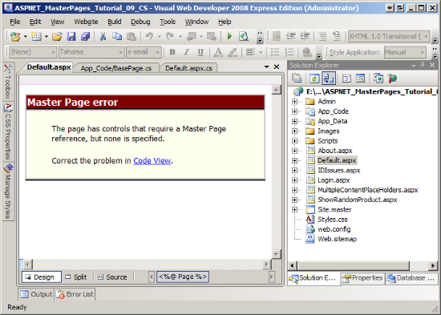
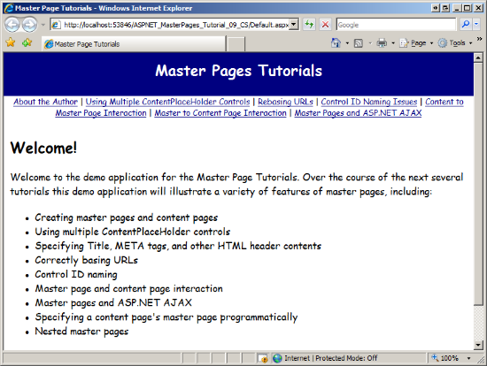
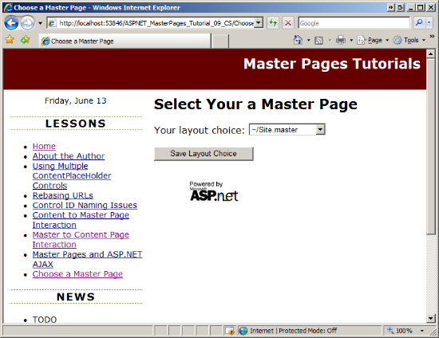

[Edit .md file](C:\Projects\msc\dev\Msc.Www\Web.ASP\App_Data\github\web-forms\overview\older-versions-getting-started\master-pages\specifying-the-master-page-programmatically-cs.md) | [Edit dev content](http://www.aspdev.net/umbraco#/content/content/edit/24768) | [View dev content](http://docs.aspdev.net/tutorials/web-forms/overview/older-versions-getting-started/master-pages/specifying-the-master-page-programmatically-cs.html) | [View prod content](http://www.asp.net/web-forms/overview/older-versions-getting-started/master-pages/specifying-the-master-page-programmatically-cs) | Picker: 33068

Specifying the Master Page Programmatically (C#)
====================
by [Scott Mitchell](https://twitter.com/ScottOnWriting)

[Download Code](http://download.microsoft.com/download/d/6/6/d66ad554-afdd-409e-a5c3-201b774fbb31/ASPNET_MasterPages_Tutorial_09_CS.zip) or [Download PDF](http://download.microsoft.com/download/d/6/6/d66ad554-afdd-409e-a5c3-201b774fbb31/ASPNET_MasterPages_Tutorial_09_CS.pdf)

> Looks at setting the content page's master page programmatically via the PreInit event handler.

## Introduction

Since the inaugural example in [*Creating a Site-Wide Layout Using Master Pages*](creating-a-site-wide-layout-using-master-pages-cs.md), all content pages have referenced their master page declaratively via the `MasterPageFile` attribute in the `@Page` directive. For example, the following `@Page` directive links the content page to the master page `Site.master`:

    <%@ Page Language="C#" MasterPageFile="~/Site.master" ... %>

The [`Page` class](https://msdn.microsoft.com/en-us/library/system.web.ui.page.aspx) in the `System.Web.UI` namespace includes a [`MasterPageFile` property](https://msdn.microsoft.com/en-us/library/system.web.ui.page.masterpagefile.aspx) that returns the path to the content page's master page; it is this property that is set by the `@Page` directive. This property can also be used to programmatically specify the content page's master page. This approach is useful if you want to dynamically assign the master page based on external factors, such as the user visiting the page.

In this tutorial we add a second master page to our website and dynamically decide which master page to use at runtime.

## Step 1: A Look at the Page Lifecycle

Whenever a request arrives at the web server for an ASP.NET page that is a content page, the ASP.NET engine must fuse the page's Content controls into the master page's corresponding ContentPlaceHolder controls. This fusion creates a single control hierarchy that can then proceed through the typical page lifecycle.

Figure 1 illustrates this fusion. Step 1 in Figure 1 shows the initial content and master page control hierarchies. At the tail end of the PreInit stage the Content controls in the page are added to the corresponding ContentPlaceHolders in the master page (Step 2). After this fusion, the master page serves as the root of the fused control hierarchy. This fused control hierarchy is then added to the page to produce the finalized control hierarchy (Step 3). The net result is that the page's control hierarchy includes the fused control hierarchy.

**Figure 01**: The Master Page and Content Page's Control Hierarchies are Fused Together during the PreInit Stage ([Click to view full-size image](specifying-the-master-page-programmatically-cs/_static/image3.png))

## Step 2: Setting the`MasterPageFile`Property from Code

What master page partakes in this fusion depends on the value of the `Page` object's `MasterPageFile` property. Setting the `MasterPageFile` attribute in the `@Page` directive has the net effect of assigning the `Page`'s `MasterPageFile` property during the Initialization stage, which is the very first stage of the page's lifecycle. We can alternatively set this property programmatically. However, it is imperative that this property be set before the fusion in Figure 1 takes place.

At the start of the PreInit stage the `Page` object raises its [`PreInit` event](https://msdn.microsoft.com/en-us/library/system.web.ui.page.preinit.aspx) and calls its [`OnPreInit` method](https://msdn.microsoft.com/en-us/library/system.web.ui.page.onpreinit.aspx). To set the master page programmatically, then, we can either create an event handler for the `PreInit` event or override the `OnPreInit` method. Let's look at both approaches.

Start by opening `Default.aspx.cs`, the code-behind class file for our site's homepage. Add an event handler for the page's `PreInit` event by typing in the following code:

    protected void Page_PreInit(object sender, EventArgs e) 
    { 
    }

From here we can set the `MasterPageFile` property. Update the code so that it assigns the value "~/Site.master" to the `MasterPageFile` property.

    protected void Page_PreInit(object sender, EventArgs e) 
    {
     this.MasterPageFile = "~/Site.master"; 
    }

If you set a breakpoint and start with debugging you'll see that whenever the `Default.aspx` page is visited or whenever there's a postback to this page, the `Page_PreInit` event handler executes and the `MasterPageFile` property is assigned to "~/Site.master".

Alternatively, you can override the `Page` class's `OnPreInit` method and set the `MasterPageFile` property there. For this example, let's not set the master page in a particular page, but rather from `BasePage`. Recall that we created a custom base page class (`BasePage`) back in the [*Specifying the Title, Meta Tags, and Other HTML Headers in the Master Page*](specifying-the-title-meta-tags-and-other-html-headers-in-the-master-page-cs.md) tutorial. Currently `BasePage` overrides the `Page` class's `OnLoadComplete` method, where it sets the page's `Title` property based on the site map data. Let's update `BasePage` to also override the `OnPreInit` method to programmatically specify the master page.

    protected override void OnPreInit(EventArgs e) 
    { 
     this.MasterPageFile = "~/Site.master"; 
     base.OnPreInit(e); 
    }

Because all our content pages derive from `BasePage`, all of them now have their master page programmatically assigned. At this point the `PreInit` event handler in `Default.aspx.cs` is superfluous; feel free to remove it.

### What About the`@Page`Directive?

What may be a little confusing is that the content pages' `MasterPageFile` properties are now being specified in two places: programmatically in the `BasePage` class's `OnPreInit` method as well as through the `MasterPageFile` attribute in each content page's `@Page` directive.

The first stage in the page lifecycle is the Initialization stage. During this stage the `Page` object's `MasterPageFile` property is assigned the value of the `MasterPageFile` attribute in the `@Page` directive (if it is provided). The PreInit stage follows the Initialization stage, and it is here where we programmatically set the `Page` object's `MasterPageFile` property, thereby overwriting the value assigned from the `@Page` directive. Because we are setting the `Page` object's `MasterPageFile` property programmatically, we could remove the `MasterPageFile` attribute from the `@Page` directive without affecting the end user's experience. To convince yourself of this, go ahead and remove the `MasterPageFile` attribute from the `@Page` directive in `Default.aspx` and then visit the page through a browser. As you would expect, the output is the same as before the attribute was removed.

Whether the `MasterPageFile` property is set via the `@Page` directive or programmatically is inconsequential to the end user's experience. However, the `MasterPageFile` attribute in the `@Page` directive is used by Visual Studio during design-time to produce the WYSIWYG view in the Designer. If you return to `Default.aspx` in Visual Studio and navigate to the Designer you'll see the message, "Master Page error: The page has controls that require a Master Page reference, but none is specified" (see Figure 2).

In short, you need to leave the `MasterPageFile` attribute in the `@Page` directive to enjoy a rich design-time experience in Visual Studio.

**Figure 02**: Visual Studio Uses the `@Page` Directive's `MasterPageFile` Attribute to Render the Design View  ([Click to view full-size image](specifying-the-master-page-programmatically-cs/_static/image6.png))

## Step 3: Creating an Alternative Master Page

Because a content page's master page can be set programmatically at runtime it's possible to dynamically load a particular master page based on some external criteria. This functionality can be useful in situations where the site's layout needs to vary based on the user. For instance, a blog engine web application may allow its users to choose a layout for their blog, where each layout is associated with a different master page. At runtime, when a visitor is viewing a user's blog, the web application would need to determine the blog's layout and dynamically associate the corresponding master page with the content page.

Let's examine how to dynamically load a master page at runtime based on some external criteria. Our website currently contains just one master page (`Site.master`). We need another master page to illustrate choosing a master page at runtime. This step focuses on creating and configuring the new master page. Step 4 looks at determining what master page to use at runtime.

Create a new master page in the root folder named `Alternate.master`. Also add a new style sheet to the website named `AlternateStyles.css`.

**Figure 03**: Add Another Master Page and CSS File to the Website ([Click to view full-size image](specifying-the-master-page-programmatically-cs/_static/image9.png))

I've designed the `Alternate.master` master page to have the title displayed at the top of the page, centered and on a navy background. I've dispensed of the left column and moved that content beneath the `MainContent` ContentPlaceHolder control, which now spans the entire width of the page. Furthermore, I nixed the unordered Lessons list and replaced it with a horizontal list above `MainContent`. I also updated the fonts and colors used by the master page (and, by extension, its content pages). Figure 4 shows `Default.aspx` when using the `Alternate.master` master page.

> [!NOTE] ASP.NET includes the ability to define *Themes*. A Theme is a collection of images, CSS files, and style-related Web control property settings that can be applied to a page at runtime. Themes are the way to go if your site's layouts differ only in the images displayed and by their CSS rules. If the layouts differ more substantially, such as using different Web controls or having a radically different layout, then you will need to use separate master pages. Consult the Further Reading section at the end of this tutorial for more information on Themes.

**Figure 04**: Our Content Pages Can Now Use a New Look and Feel ([Click to view full-size image](specifying-the-master-page-programmatically-cs/_static/image12.png))

When the master and content pages' markup are fused, the `MasterPage` class checks to ensure that every Content control in the content page references a ContentPlaceHolder in the master page. An exception is thrown if a Content control that references a non-existent ContentPlaceHolder is found. In other words, it is imperative that the master page being assigned to the content page have a ContentPlaceHolder for each Content control in the content page.

The `Site.master` master page includes four ContentPlaceHolder controls:

- `head`
- `MainContent`
- `QuickLoginUI`
- `LeftColumnContent`

Some of the content pages in our website include just one or two Content controls; others include a Content control for each of the available ContentPlaceHolders. If our new master page (`Alternate.master`) may ever be assigned to those content pages that have Content controls for all of the ContentPlaceHolders in `Site.master` then it is essential that `Alternate.master` also include the same ContentPlaceHolder controls as `Site.master`.

To get your `Alternate.master` master page to look similar to mine (see Figure 4), start by defining the master page's styles in the `AlternateStyles.css` style sheet. Add the following rules into `AlternateStyles.css`:

    body 
    { 
     font-family: Comic Sans MS, Arial; 
     font-size: medium; 
     margin: 0px; 
    } 
    #topContent 
    { 
     text-align: center; 
     background-color: Navy; 
     color: White; 
     font-size: x-large;
     text-decoration: none; 
     font-weight: bold; 
     padding: 10px; 
     height: 50px;
    } 
    #topContent a 
    { 
     text-decoration: none; 
     color: White; 
    } 
    #navContent 
    { 
     font-size: small; 
     text-align: center; 
    } 
    #footerContent 
    { 
     padding: 10px; 
     font-size: 90%; 
     text-align: center; 
     border-top: solid 1px black; 
    } 
    #mainContent 
    { 
     text-align: left; 
     padding: 10px; 
    }

Next, add the following declarative markup to `Alternate.master`. As you can see, `Alternate.master` contains four ContentPlaceHolder controls with the same `ID` values as the ContentPlaceHolder controls in `Site.master`. Moreover, it includes a ScriptManager control, which is necessary for those pages in our website that use the ASP.NET AJAX framework.

    <!DOCTYPE html PUBLIC "-//W3C//DTD XHTML 1.0 Transitional//EN" "http://www.w3.org/TR/xhtml1/DTD/xhtml1-transitional.dtd"> 
    <html xmlns="http://www.w3.org/1999/xhtml"> 
    <head id="Head1" runat="server"> 
     <title>Untitled Page</title>
     <asp:ContentPlaceHolder id="head" runat="server">
     </asp:ContentPlaceHolder> 
     <link href="AlternateStyles.css" rel="stylesheet" type="text/css" /> 
    </head> 
    <body> 
     <form id="form1" runat="server"> 
     <asp:ScriptManager ID="MyManager" runat="server"> 
     </asp:ScriptManager>
     

     <asp:HyperLink ID="lnkHome" runat="server" NavigateUrl="~/Default.aspx" 
     Text="Master Pages Tutorials" /> 
     

     

     <asp:ListView ID="LessonsList" runat="server" 
     DataSourceID="LessonsDataSource">
     <LayoutTemplate>
     <asp:PlaceHolder runat="server" ID="itemPlaceholder" /> 
     </LayoutTemplate>
     <ItemTemplate>
     <asp:HyperLink runat="server" ID="lnkLesson" 
     NavigateUrl='<%# Eval("Url") %>' 
     Text='<%# Eval("Title") %>' /> 
     </ItemTemplate>
     <ItemSeparatorTemplate> | </ItemSeparatorTemplate> 
     </asp:ListView>
     <asp:SiteMapDataSource ID="LessonsDataSource" runat="server" 
     ShowStartingNode="false" /> 
     

     

     <asp:ContentPlaceHolder id="MainContent" runat="server"> 
     </asp:ContentPlaceHolder>
     
 
     

     
 
     <asp:Label ID="DateDisplay" runat="server"></asp:Label> 
     

     <asp:ContentPlaceHolder ID="QuickLoginUI" runat="server"> 
     </asp:ContentPlaceHolder>
     <asp:ContentPlaceHolder ID="LeftColumnContent" runat="server"> 
     </asp:ContentPlaceHolder>
     
 
     </form>
    </body> 
    </html>

### Testing the New Master Page

To test this new master page update the `BasePage` class's `OnPreInit` method so that the `MasterPageFile` property is assigned the value "~/Alternate.maser" and then visit the website. Every page should function without error except for two: `~/Admin/AddProduct.aspx` and `~/Admin/Products.aspx`. Adding a product to the DetailsView in `~/Admin/AddProduct.aspx` results in a `NullReferenceException` from the line of code that attempts to set the master page's `GridMessageText` property. When visiting `~/Admin/Products.aspx` an `InvalidCastException` is thrown on page load with the message: "Unable to cast object of type 'ASP.alternate\_master' to type 'ASP.site\_master'."

These errors occur because the `Site.master` code-behind class includes public events, properties, and methods that are not defined in `Alternate.master`. The markup portion of these two pages have a `@MasterType` directive that references the `Site.master` master page.

    <%@ MasterType VirtualPath="~/Site.master" %>

Also, the DetailsView's `ItemInserted` event handler in `~/Admin/AddProduct.aspx` includes code that casts the loosely-typed `Page.Master` property to an object of type `Site`. The `@MasterType` directive (used this way) and the cast in the `ItemInserted` event handler tightly couples the `~/Admin/AddProduct.aspx` and `~/Admin/Products.aspx` pages to the `Site.master` master page.

To break this tight coupling we can have `Site.master` and `Alternate.master` derive from a common base class that contains definitions for the public members. Following that, we can update the `@MasterType` directive to reference this common base type.

### Creating a Custom Base Master Page Class

Add a new class file to the `App_Code` folder named `BaseMasterPage.cs` and have it derive from `System.Web.UI.MasterPage`. We need to define the `RefreshRecentProductsGrid` method and the `GridMessageText` property in `BaseMasterPage`, but we can't simply move them there from `Site.master` because these members work with Web controls that are specific to the `Site.master` master page (the `RecentProducts` GridView and `GridMessage` Label).

What we need to do is configure `BaseMasterPage` in such a way that these members are defined there, but are actually implemented by `BaseMasterPage`'s derived classes (`Site.master` and `Alternate.master`). This type of inheritance is possible by marking the class and its members as `abstract`. In short, adding the `abstract` keyword to these two members announces that `BaseMasterPage` hasn't implemented `RefreshRecentProductsGrid` and `GridMessageText`, but that its derived classes will.

We also need to define the `PricesDoubled` event in `BaseMasterPage` and provide a means by the derived classes to raise the event. The pattern used in the .NET Framework to facilitate this behavior is to create a public event in the base class and add a protected, `virtual` method named `OnEventName`. Derived classes can then call this method to raise the event or can override it to execute code immediately before or after the event is raised.

Update your `BaseMasterPage` class so that it contains the following code:

    using System; public abstract class BaseMasterPage : System.Web.UI.MasterPage
    { 
     public event EventHandler PricesDoubled; 
     protected virtual void OnPricesDoubled(EventArgs e) 
     { 
     if (PricesDoubled != null) 
     PricesDoubled(this, e); 
     } 
     public abstract void RefreshRecentProductsGrid();
     public abstract string GridMessageText 
     { 
     get; 
     set; 
     } 
    }

Next, go to the `Site.master` code-behind class and have it derive from `BaseMasterPage`. Because `BaseMasterPage` is `abstract` we need to override those `abstract` members here in `Site.master`. Add the `override` keyword to the method and property definitions. Also update the code that raises the `PricesDoubled` event in the `DoublePrice` Button's `Click` event handler with a call to the base class's `OnPricesDoubled` method.

After these modifications the `Site.master` code-behind class should contain the following code:

    public partial class Site : BaseMasterPage { 
     protected void Page_Load(object sender, EventArgs e) 
     { 
     DateDisplay.Text = DateTime.Now.ToString("dddd, MMMM dd"); 
     } 
     public override void RefreshRecentProductsGrid()
     { 
     RecentProducts.DataBind();
     } 
     public override string GridMessageText
     { 
     get 
     {
     return GridMessage.Text;
     } 
     set
     {
     GridMessage.Text = value; 
     } 
     }
     protected void DoublePrice_Click(object sender, EventArgs e) 
     { 
     // Double the prices 
     DoublePricesDataSource.Update();
     // Refresh RecentProducts 
     RecentProducts.DataBind();
     // Raise the PricesDoubled event
     base.OnPricesDoubled(EventArgs.Empty);
     } 
    }

We also need to update `Alternate.master`'s code-behind class to derive from `BaseMasterPage` and override the two `abstract` members. But because `Alternate.master` does not contain a GridView that lists the most recent products nor a Label that displays a message after a new product is added to the database, these methods do not need to do anything.

    public partial class Alternate : BaseMasterPage 
    { 
     public override void RefreshRecentProductsGrid() 
     { 
     // Do nothing 
     } 
     public override string GridMessageText 
     { 
     get
     { 
     return string.Empty;
     } 
     set
     {
     // Do nothing 
     } 
     }
    }

### Referencing the Base Master Page Class

Now that we have completed the `BaseMasterPage` class and have our two master pages extending it, our final step is to update the `~/Admin/AddProduct.aspx` and `~/Admin/Products.aspx` pages to refer to this common type. Start by changing the `@MasterType` directive in both pages from:

    <%@ MasterType VirtualPath="~/Site.master" %>

To:

    <%@ MasterType TypeName="BaseMasterPage" %>

Rather than referencing a file path, the `@MasterType` property now references the base type (`BaseMasterPage`). Consequently, the strongly-typed `Master` property used in both pages' code-behind classes is now of type `BaseMasterPage` (instead of type `Site`). With this change in place revisit `~/Admin/Products.aspx`. Previously, this resulted in a casting error because the page is configured to use the `Alternate.master` master page, but the `@MasterType` directive referenced the `Site.master` file. But now the page renders without error. This is because the `Alternate.master` master page can be cast to an object of type `BaseMasterPage` (since it extends it).

There's one small change that needs to be made in `~/Admin/AddProduct.aspx`. The DetailsView control's `ItemInserted` event handler uses both the strongly-typed `Master` property and the loosely-typed `Page.Master` property. We fixed the strongly-typed reference when we updated the `@MasterType` directive, but we still need to update the loosely-typed reference. Replace the following line of code:

    Site myMasterPage = Page.Master as Site;

With the following, which casts `Page.Master` to the base type:

    BaseMasterPage myMasterPage = Page.Master as BaseMasterPage;

## Step 4: Determining What Master Page to Bind to the Content Pages

Our `BasePage` class currently sets all content pages' `MasterPageFile` properties to a hard-coded value in the PreInit stage of the page lifecycle. We can update this code to base the master page on some external factor. Perhaps the master page to load depends on the preferences of the currently logged on user. In that case, we'd need to write code in the `OnPreInit` method in `BasePage` that looks up the currently visiting user's master page preferences.

Let's create a web page that allows the user to choose which master page to use - `Site.master` or `Alternate.master` - and save this choice in a Session variable. Start by creating a new web page in the root directory named `ChooseMasterPage.aspx`. When creating this page (or any other content pages henceforth) you don't need to bind it to a master page because the master page is set programmatically in `BasePage`. However, if you do not bind the new page to a master page then the new page's default declarative markup contains a Web Form and other content supplied by the master page. You'll need to manually replace this markup with the appropriate Content controls. For that reason, I find it easier to bind the new ASP.NET page to a master page.

> [!NOTE] Because `Site.master` and `Alternate.master` have the same set of ContentPlaceHolder controls it doesn't matter what master page you choose when creating the new content page. For consistency, I'd suggest using `Site.master`.

**Figure 05**: Add a New Content Page to the Website ([Click to view full-size image](specifying-the-master-page-programmatically-cs/_static/image15.png))

Update the `Web.sitemap` file to include an entry for this lesson. Add the following markup beneath the `<siteMapNode>` for the Master Pages and ASP.NET AJAX lesson:

    <siteMapNode url="~/ChooseMasterPage.aspx" title="Choose a Master Page" />

Before adding any content to the `ChooseMasterPage.aspx` page take a moment to update the page's code-behind class so that it derives from `BasePage` (rather than `System.Web.UI.Page`). Next, add a DropDownList control to the page, set its `ID` property to `MasterPageChoice`, and add two ListItems with the `Text` values of "~/Site.master" and "~/Alternate.master".

Add a Button Web control to the page and set its `ID` and `Text` properties to `SaveLayout` and "Save Layout Choice", respectively. At this point your page's declarative markup should look similar to the following:

    
 
     Your layout choice: 
     <asp:DropDownList ID="MasterPageChoice" runat="server"> 
     <asp:ListItem>~/Site.master</asp:ListItem>
     <asp:ListItem>~/Alternate.master</asp:ListItem>
     </asp:DropDownList> 
    
 
    
 
     <asp:Button ID="SaveLayout" runat="server" Text="Save Layout Choice" /> 
    

When the page is first visited we need to display the user's currently selected master page choice. Create a `Page_Load` event handler and add the following code:

    protected void Page_Load(object sender, EventArgs e) 
    { 
     if (!Page.IsPostBack) 
     { 
     if (Session["MyMasterPage"] != null)
     {
     ListItem li = MasterPageChoice.Items.FindByText(Session["MyMasterPage"].ToString());
     if (li != null) 
     li.Selected = true; 
     } 
     }
    }

The above code executes only on the first page visit (and not on subsequent postbacks). It first checks to see if the Session variable `MyMasterPage` exists. If it does, it attempts to find the matching ListItem in the `MasterPageChoice` DropDownList. If a matching ListItem is found, its `Selected` property is set to `true`.

We also need code that saves the user's choice into the `MyMasterPage` Session variable. Create an event handler for the `SaveLayout` Button's `Click` event and add the following code:

    protected void SaveLayout_Click(object sender, EventArgs e)
    {
     Session["MyMasterPage"] = MasterPageChoice.SelectedValue;
     Response.Redirect("ChooseMasterPage.aspx"); 
    }

> [!NOTE] By the time the `Click` event handler executes on postback, the master page has already been selected. Therefore, the user's drop-down list selection won't be in effect until the next page visit. The `Response.Redirect` forces the browser to re-request `ChooseMasterPage.aspx`.

With the `ChooseMasterPage.aspx` page complete, our final task is to have `BasePage` assign the `MasterPageFile` property based on the value of the `MyMasterPage` Session variable. If the Session variable is not set have `BasePage` default to `Site.master`.

    protected override void OnPreInit(EventArgs e) 
    { 
     SetMasterPageFile();
     base.OnPreInit(e); 
    } 
    protected virtual void SetMasterPageFile()
    { 
     this.MasterPageFile = GetMasterPageFileFromSession();
    } 
    protected string GetMasterPageFileFromSession() 
    { 
     if (Session["MyMasterPage"] == null) 
     return "~/Site.master";
     else
     return
     Session["MyMasterPage"].ToString(); 
    }

> [!NOTE] I moved the code that assigns the `Page` object's `MasterPageFile` property out of the `OnPreInit` event handler and into two separate methods. This first method, `SetMasterPageFile`, assigns the `MasterPageFile` property to the value returned by the second method, `GetMasterPageFileFromSession`. I made the `SetMasterPageFile` method `virtual` so that future classes that extend `BasePage` can optionally override it to implement custom logic, if needed. We'll see an example of overriding `BasePage`'s `SetMasterPageFile` property in the next tutorial.

With this code in place, visit the `ChooseMasterPage.aspx` page. Initially, the `Site.master` master page is selected (see Figure 6), but the user can pick a different master page from the drop-down list.

**Figure 06**: Content Pages are Displayed Using the `Site.master` Master Page ([Click to view full-size image](specifying-the-master-page-programmatically-cs/_static/image18.png))

**Figure 07**: Content Pages are Now Displayed Using the `Alternate.master` Master Page ([Click to view full-size image](specifying-the-master-page-programmatically-cs/_static/image21.png))

## Summary

When a content page is visited, its Content controls are fused with its master page's ContentPlaceHolder controls. The content page's master page is denoted by the `Page` class's `MasterPageFile` property, which is assigned to the `@Page` directive's `MasterPageFile` attribute during the Initialization stage. As this tutorial showed, we can assign a value to the `MasterPageFile` property as long as we do so before the end of the PreInit stage. Being able to programmatically specify the master page opens the door for more advanced scenarios, such as dynamically binding a content page to a master page based on external factors.

Happy Programming!

### Further Reading

For more information on the topics discussed in this tutorial, refer to the following resources:

- [ASP.NET Page Lifecycle Diagram](http://emanish.googlepages.com/Asp.Net2.0Lifecycle.PNG)
- [ASP.NET Page Lifecycle Overview](https://msdn.microsoft.com/en-us/library/ms178472.aspx)
- [ASP.NET Themes and Skins Overview](https://msdn.microsoft.com/en-us/library/ykzx33wh.aspx)
- [Master Pages: Tips, Tricks, and Traps](http://www.odetocode.com/articles/450.aspx)
- [Themes in ASP.NET](http://www.odetocode.com/articles/423.aspx)

### About the Author

[Scott Mitchell](http://www.4guysfromrolla.com/ScottMitchell.shtml), author of multiple ASP/ASP.NET books and founder of 4GuysFromRolla.com, has been working with Microsoft Web technologies since 1998. Scott works as an independent consultant, trainer, and writer. His latest book is [*Sams Teach Yourself ASP.NET 3.5 in 24 Hours*](https://www.amazon.com/exec/obidos/ASIN/0672329972/4guysfromrollaco). Scott can be reached at [mitchell@4GuysFromRolla.com](mailto:mitchell@4GuysFromRolla.com) or via his blog at [http://ScottOnWriting.NET](http://scottonwriting.net/).

### Special Thanks To

This tutorial series was reviewed by many helpful reviewers. Lead reviewer for this tutorial was Suchi Banerjee. Interested in reviewing my upcoming MSDN articles? If so, drop me a line at [mitchell@4GuysFromRolla.com](mailto:mitchell@4GuysFromRolla.com)

>[!div class="step-by-step"] [Previous](master-pages-and-asp-net-ajax-cs.md) [Next](nested-master-pages-cs.md)