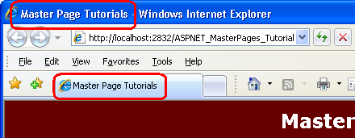
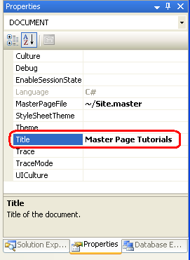
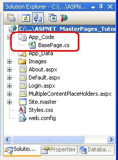
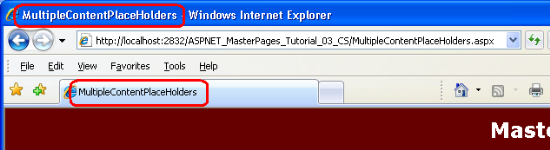
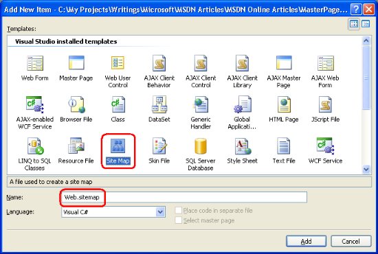
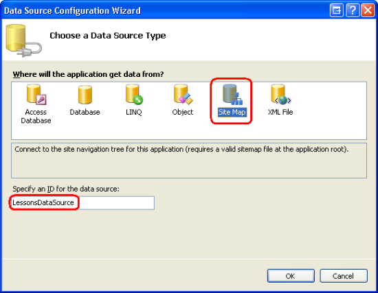
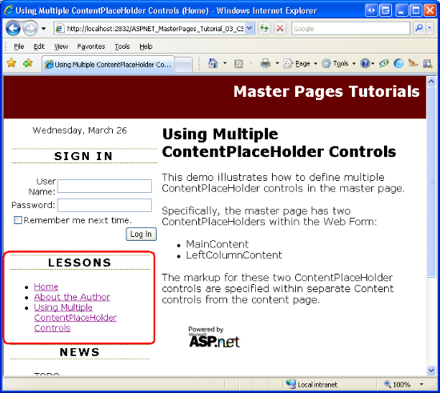
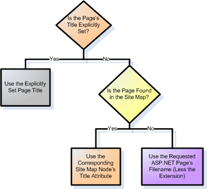

Specifying the Title, Meta Tags, and Other HTML Headers in the Master Page (C#)
====================
by [Scott Mitchell](https://twitter.com/ScottOnWriting)

[Download Code](http://download.microsoft.com/download/e/e/f/eef369f5-743a-4a52-908f-b6532c4ce0a4/ASPNET_MasterPages_Tutorial_03_CS.zip) or [Download PDF](http://download.microsoft.com/download/8/f/6/8f6349e4-6554-405a-bcd7-9b094ba5089a/ASPNET_MasterPages_Tutorial_03_CS.pdf)

> Looks at different techniques for defining assorted &lt;head&gt; elements in the Master Page from the content page.

## Introduction

New master pages created in Visual Studio 2008 have, by default, two ContentPlaceHolder controls: one named head, and located in the `<head>` element; and one named `ContentPlaceHolder1`, placed within the Web Form. The purpose of `ContentPlaceHolder1` is to define a region in the Web Form that can be customized on a page-by-page basis. The `head` ContentPlaceHolder enables pages to add custom content to the `<head>` section. (Of course, these two ContentPlaceHolders can be modified or removed, and additional ContentPlaceHolder may be added to the master page. Our master page, `Site.master`, currently has four ContentPlaceHolder controls.)

The HTML `<head>` element serves as a repository for information about the web page document that is not part of the document itself. This includes information such as the web page's title, meta-information used by search engines or internal crawlers, and links to external resources, such as RSS feeds, JavaScript, and CSS files. Some of this information may be pertinent to all pages in the website. For example, you might want to globally import the same CSS rules and JavaScript files for every ASP.NET page. However, there are portions of the `<head>` element that are page-specific. The page title is a prime example.

In this tutorial we examine how to define global and page-specific `<head>` section markup in the master page and in its content pages.

## Examining the Master Page's`<head>`Section

The default master page file created by Visual Studio 2008 contains the following markup in its `<head>` section:

[!code-aspx[Main](specifying-the-title-meta-tags-and-other-html-headers-in-the-master-page-cs/samples/sample1.aspx)]

Notice that the `<head>` element contains a `runat="server"` attribute, which indicates that it is a server control (rather than static HTML). All ASP.NET pages derive from the [`Page` class](https://msdn.microsoft.com/en-us/library/system.web.ui.page.aspx), which is located in the `System.Web.UI` namespace. This class contains a `Header` property that provides access to the page's `<head>` region. Using the [`Header` property](https://msdn.microsoft.com/en-us/library/system.web.ui.page.header.aspx) we can set an ASP.NET page's title or add additional markup to the rendered `<head>` section. It is possible, then, to customize a content page's `<head>` element by writing a bit of code in the page's `Page_Load` event handler. We examine how to programmatically set the page's title in Step 1.

The markup shown in the `<head>` element above also includes a ContentPlaceHolder control named head. This ContentPlaceHolder control is not necessary, as content pages can add custom content to the `<head>` element programmatically. It's useful, however, in situations where a content page needs to add static markup to the `<head>` element as the static markup can be added declaratively to the corresponding Content control rather than programmatically.

In addition to the `<title>` element and head ContentPlaceHolder, the master page's `<head>` element should contain any `<head>`-level markup that's common to all pages. In our website, all pages use the CSS rules defined in the `Styles.css` file. Consequently, we updated the `<head>` element in the [*Creating a Site-Wide Layout with Master Pages*](creating-a-site-wide-layout-using-master-pages-cs.md) tutorial to include a corresponding `<link>` element. Our `Site.master` master page's current `<head>` markup is shown below.

[!code-aspx[Main](specifying-the-title-meta-tags-and-other-html-headers-in-the-master-page-cs/samples/sample2.aspx)]

## Step 1: Setting a Content Page's Title

The web page's title is specified via the `<title>` element. It is important to set each page's title to an appropriate value. When visiting a page, its title is displayed in the browser's Title bar. Additionally, when bookmarking a page, browsers use the page's title as the suggested name for the bookmark. Also, many search engines show the page's title when displaying search results.

> [!NOTE]
> By default, Visual Studio sets the `<title>` element in the master page to "Untitled Page". Similarly, new ASP.NET pages have their `<title>` set to "Untitled Page", too. Because it can be easy to forget to set the page's title to an appropriate value, there are many pages on the Internet with the title "Untitled Page". Searching Google for web pages with this title returns roughly 2,460,000 results. Even Microsoft is susceptible to publishing web pages with the title "Untitled Page". At the time of this writing, a Google search reported 236 such web pages in the Microsoft.com domain.

An ASP.NET page can specify its title in one of the following ways:

- By placing the value directly within the `<title>` element
- Using the `Title` attribute in the `<%@ Page %>` directive
- Programmatically setting the page's `Title` property using code like `Page.Title="title"` or `Page.Header.Title="title"`.

Content pages don't have a `<title>` element, as it's defined in the master page. Therefore, to set a content page's title you can either use the `<%@ Page %>` directive's `Title` attribute or set it programmatically.

### Setting the Page's Title Declaratively

A content page's title can be set declaratively through the `Title` attribute of the [`<%@ Page %>` directive](https://msdn.microsoft.com/en-us/library/ydy4x04a.aspx). This property can be set by directly modifying the `<%@ Page %>` directive or through the Properties window. Let's look at both approaches.

From the Source view, locate the `<%@ Page %>` directive, which is at the top of the page's declarative markup. The `<%@ Page %>` directive for `Default.aspx` follows:

[!code-aspx[Main](specifying-the-title-meta-tags-and-other-html-headers-in-the-master-page-cs/samples/sample3.aspx)]

The `<%@ Page %>` directive specifies page-specific attributes used by the ASP.NET engine when parsing and compiling the page. This includes its master page file, the location of its code file, and its title, among other information.

By default, when creating a new content page Visual Studio sets the `Title` attribute to Untitled Page. Change `Default.aspx`'s `Title` attribute from "Untitled Page" to "Master Page Tutorials" and then view the page through a browser. Figure 1 shows the browser's Title bar, which reflects the new page title.

**Figure 01**: The Browser's Title Bar Now Shows "Master Page Tutorials" Instead of "Untitled Page"

The page's title may also be set from the Properties window. From the Properties window, select DOCUMENT from the drop-down list to load the page-level properties, which includes the `Title` property. Figure 2 shows the Properties window after `Title` has been set to "Master Page Tutorials".

**Figure 02**: You May Configure the Title from the Properties Window, Too

### Setting the Page's Title Programmatically

The master page's `<head runat="server">` markup is translated into an [`HtmlHead` class](https://msdn.microsoft.com/en-us/library/system.web.ui.htmlcontrols.htmlhead.aspx) instance when the page is rendered by the ASP.NET engine. The `HtmlHead` class has a [`Title` property](https://msdn.microsoft.com/en-us/library/system.web.ui.htmlcontrols.htmlhead.title.aspx) whose value is reflected in the rendered `<title>` element. This property is accessible from an ASP.NET page's code-behind class via `Page.Header.Title`; this same property can also be accessed via `Page.Title`.

To practice setting the page's title programmatically, navigate to the `About.aspx` page's code-behind class and create an event handler for the page's `Load` event. Next, set the page's title to "Master Page Tutorials :: About :: *date*", where *date* is the current date. After adding this code your `Page_Load` event handler should look similar to the following:

[!code-csharp[Main](specifying-the-title-meta-tags-and-other-html-headers-in-the-master-page-cs/samples/sample4.cs)]

Figure 3 shows the browser's title bar when visiting the `About.aspx` page.

**Figure 03**: The Page's Title is Programmatically Set and Includes the Current Date

## Step 2: Automatically Assigning a Page Title

As we saw in Step 1, a page's title can be set declaratively or programmatically. If you forget to explicitly change the title to something more descriptive, however, your page will have the default title, "Untitled Page". Ideally, the page's title would be set automatically for us in the event that we don't explicitly specify its value. For example, if at runtime the page's title is "Untitled Page", we might want to have the title automatically updated to be the same as the ASP.NET page's filename. The good news is that with a little bit of upfront work it is possible to have the title automatically assigned.

All ASP.NET web pages derive from the `Page` class in the `System.Web.UI` namespace. The `Page` class defines the minimal functionality needed by an ASP.NET page and exposes essential properties like `IsPostBack`, `IsValid`, `Request`, and `Response`, among many others. Oftentimes, every page in a web application requires additional features or functionality. A common way of providing this is to create a custom base page class. A custom base page class is a class you create that derives from the `Page` class and includes additional functionality. Once this base class has been created, you can have your ASP.NET pages derive from it (rather than the `Page` class), thereby offering the extended functionality to your ASP.NET pages.

In this step we create a base page that automatically sets the page's title to the ASP.NET page's filename if the title has not otherwise been explicitly set. Step 3 looks at setting the page's title based on the site map.

> [!NOTE]
> A thorough examination of creating and using custom base page classes is beyond the scope of this tutorial series. For more information, read [Using a Custom Base Class for Your ASP.NET Pages' Code-Behind Classes](http://aspnet.4guysfromrolla.com/articles/041305-1.aspx).

### Creating the Base Page Class

Our first task is to create a base page class, which is a class that extends the `Page` class. Start by adding an `App_Code` folder to your project by right-clicking on the project name in the Solution Explorer, choosing Add ASP.NET Folder, and then selecting `App_Code`. Next, right-click on the `App_Code` folder and add a new class named `BasePage.cs`. Figure 4 shows the Solution Explorer after the `App_Code` folder and `BasePage.cs` class have been added.

**Figure 04**: Add an `App_Code` Folder and a Class Named `BasePage`

> [!NOTE]
> Visual Studio supports two modes of project management: Web Site Projects and Web Application Projects. The `App_Code` folder is designed to be used with the Web Site Project model. If you are using the Web Application Project model, place the `BasePage.cs` class in a folder named something other than `App_Code`, such as `Classes`. For more information on this topic, refer to [Migrating a Web Site Project to a Web Application Project](http://webproject.scottgu.com/CSharp/Migration2/Migration2.aspx).

Because the custom base page serves as the base class for ASP.NET pages' code-behind classes, it needs to extend the `Page` class.

[!code-csharp[Main](specifying-the-title-meta-tags-and-other-html-headers-in-the-master-page-cs/samples/sample5.cs)]

Whenever an ASP.NET page is requested it proceeds through a series of stages, culminating in the requested page being rendered into HTML. We can tap into a stage by overriding the `Page` class's `OnEvent` method. For our base page let's automatically set the title if it has not been explicitly specified by the `LoadComplete` stage (which, as you might have guessed, occurs after the `Load` stage).

To accomplish this, override the `OnLoadComplete` method and enter the following code:

[!code-csharp[Main](specifying-the-title-meta-tags-and-other-html-headers-in-the-master-page-cs/samples/sample6.cs)]

The `OnLoadComplete` method starts by determining if the `Title` property has not yet been explicitly set. If the `Title` property is `null`, an empty string, or has the value "Untitled Page", it is assigned to the filename of the requested ASP.NET page. The physical path to the requested ASP.NET page - `C:\MySites\Tutorial03\Login.aspx`, for example - is accessible via the `Request.PhysicalPath` property. The `Path.GetFileNameWithoutExtension` method is used to pull out just the filename portion, and this filename is then assigned to the `Page.Title` property.

> [!NOTE]
> I invite you to enhance this logic to improve the format of the title. For example, if the page's filename is `Company-Products.aspx`, the above code will produce the title "Company-Products", but ideally the dash would be replaced with a space, as in "Company Products". Also, consider adding a space whenever there's a case change. That is, consider adding code that transforms the filename `OurBusinessHours.aspx` to a title of "Our Business Hours".

### Having the Content Pages Inherit the Base Page Class

We now need to update the ASP.NET pages in our site to derive from the custom base page (`BasePage`) instead of the `Page` class. To accomplish this go to each code-behind class and change the class declaration from:

[!code-csharp[Main](specifying-the-title-meta-tags-and-other-html-headers-in-the-master-page-cs/samples/sample7.cs)]

To:

[!code-csharp[Main](specifying-the-title-meta-tags-and-other-html-headers-in-the-master-page-cs/samples/sample8.cs)]

After doing so, visit the site through a browser. If you visit a page whose title is explicitly set, such as `Default.aspx` or `About.aspx`, the explicitly specified title is used. If, however, you visit a page whose title has not been changed from the default ("Untitled Page"), the base page class sets the title to the page's filename.

Figure 5 shows the `MultipleContentPlaceHolders.aspx` page when viewed through a browser. Note that the title is precisely the page's filename (less the extension), "MultipleContentPlaceHolders".

**Figure 05**: If a Title is Not Explicitly Specified, the Page's Filename is Automatically Used  ([Click to view full-size image](specifying-the-title-meta-tags-and-other-html-headers-in-the-master-page-cs/_static/image7.png))

## Step 3: Basing the Page Title on the Site Map

ASP.NET offers a robust site map framework that enables page developers to define a hierarchical site map in an external resource (such as an XML file or database table) along with Web controls for displaying information about the site map (such as the SiteMapPath, Menu, and TreeView controls).

The site map structure can also be accessed programmatically from an ASP.NET page's code-behind class. In this manner we can automatically set a page's title to the title of its corresponding node in the site map. Let's enhance the `BasePage` class created in Step 2 so that it offers this functionality. But first we need to create a site map for our site.

> [!NOTE]
> This tutorial assumes the reader already is familiar with ASP.NET's site map features. For more information on using the site map, consult my multi-part article series, [Examining ASP.NET's Site Navigation](http://aspnet.4guysfromrolla.com/articles/111605-1.aspx).

### Creating the Site Map

The site map system is built atop the [provider model](http://aspnet.4guysfromrolla.com/articles/101905-1.aspx), which decouples the site map API from the logic that serializes site map information between memory and a persistent store. The .NET Framework ships with the [`XmlSiteMapProvider` class](https://msdn.microsoft.com/en-us/library/system.web.xmlsitemapprovider.aspx), which is the default site map provider. As its name implies, `XmlSiteMapProvider` uses an XML file as its site map store. Let's use this provider for defining our site map.

Start by creating a site map file in the website's root folder named `Web.sitemap`. To accomplish this, right-click on the website name in Solution Explorer, choose Add New Item, and select the Site Map template. Ensure that the file is named `Web.sitemap` and click Add.

**Figure 06**: Add a File Named `Web.sitemap` to the Website's Root Folder  ([Click to view full-size image](specifying-the-title-meta-tags-and-other-html-headers-in-the-master-page-cs/_static/image10.png))

Add the following XML to the `Web.sitemap` file:

[!code-xml[Main](specifying-the-title-meta-tags-and-other-html-headers-in-the-master-page-cs/samples/sample9.xml)]

This XML defines the hierarchical site map structure shown in Figure 7.

**Figure 07**: The Site Map is Currently Composed of Three Site Map Nodes

We will update the site map structure in future tutorials as we add new examples.

### Updating the Master Page to Include Navigation Web Controls

Now that we have a site map defined, let's update the master page to include navigation Web controls. Specifically, let's add a ListView control to the left column in the Lessons section that renders an unordered list with a list item for each node defined in the site map.

> [!NOTE]
> The ListView control is new to ASP.NET version 3.5. If you are using a prior version of ASP.NET, use the Repeater control instead. For more information on the ListView control, see [Using ASP.NET 3.5's ListView and DataPager Controls](http://aspnet.4guysfromrolla.com/articles/122607-1.aspx).

Start by removing the existing unordered list markup from the Lessons section. Next, drag a ListView control from the Toolbox and drop it beneath the Lessons heading. The ListView is located in the Data section of the Toolbox, alongside the other view controls: the GridView, DetailsView, and FormView. Set the ListView's ID property to `LessonsList`.

From the Data Source Configuration Wizard choose to bind the ListView to a new SiteMapDataSource control named `LessonsDataSource`. The SiteMapDataSource control returns the hierarchical structure from the site map system.

**Figure 08**: Bind a SiteMapDataSource Control to the `LessonsList` ListView Control  ([Click to view full-size image](specifying-the-title-meta-tags-and-other-html-headers-in-the-master-page-cs/_static/image14.png))

After creating the SiteMapDataSource control, we need to define the ListView's templates so that it renders an unordered list with a list item for each node returned by the SiteMapDataSource control. This can be accomplished using the following template markup:

[!code-aspx[Main](specifying-the-title-meta-tags-and-other-html-headers-in-the-master-page-cs/samples/sample10.aspx)]

The `LayoutTemplate` generates the markup for an unordered list (`<ul>...</ul>`) while the `ItemTemplate` renders each item returned by the SiteMapDataSource as a list item (`<li>`) that contains a link to the particular lesson.

After configuring the ListView's templates, visit the website. As Figure 9 shows, the Lessons section contains a single bulleted item, Home. Where are the About and Using Multiple ContentPlaceHolder Controls lessons? The SiteMapDataSource is designed to return a hierarchical set of data, but the ListView control can only display a single level of the hierarchy. Consequently, only the first level of site map nodes returned by the SiteMapDataSource is displayed.

**Figure 09**: The Lessons Section Contains a Single List Item  ([Click to view full-size image](specifying-the-title-meta-tags-and-other-html-headers-in-the-master-page-cs/_static/image17.png))

To display multiple levels we could nest multiple ListViews within the `ItemTemplate`. This technique was examined in the [*Master Pages and Site Navigation* tutorial](../../data-access/introduction/master-pages-and-site-navigation-cs.md) of my [Working with Data tutorial series](../../data-access/index.md). However, for this tutorial series our site map will contain just a two levels: Home (the top level); and each lesson as a child of Home. Rather than crafting a nested ListView, we can instead instruct the SiteMapDataSource to not return the starting node by setting its [`ShowStartingNode` property](https://msdn.microsoft.com/en-us/library/system.web.ui.webcontrols.sitemapdatasource.showstartingnode.aspx) to `false`. The net effect is that the SiteMapDataSource starts by returning the second tier of site map nodes.

With this change, the ListView displays bullet items for the About and Using Multiple ContentPlaceHolder Controls lessons, but omits a bullet item for Home. To remedy this, we can explicitly add a bullet item for Home in the `LayoutTemplate`:

[!code-aspx[Main](specifying-the-title-meta-tags-and-other-html-headers-in-the-master-page-cs/samples/sample11.aspx)]

By configuring the SiteMapDataSource to omit the starting node and explicitly adding a Home bullet item, the Lessons section now displays the intended output.

**Figure 10**: The Lessons Section Contains a Bullet Item for Home and Each Child Node  ([Click to view full-size image](specifying-the-title-meta-tags-and-other-html-headers-in-the-master-page-cs/_static/image20.png))

### Setting the Title Based on the Site Map

With the site map in place, we can update our `BasePage` class to use the title specified in the site map. As we did in Step 2, we only want to use the site map node's title if the page's title has not been explicitly set by the page developer. If the page being requested does not have an explicitly set page title and is not found in the site map, then we'll fall back to using the requested page's filename (less the extension), as we did in Step 2. Figure 11 illustrates this decision process.

**Figure 11**: In the Absence of an Explicitly Set Page Title, the Corresponding Site Map Node's Title is Used

Update the `BasePage` class's `OnLoadComplete` method to include the following code:

[!code-csharp[Main](specifying-the-title-meta-tags-and-other-html-headers-in-the-master-page-cs/samples/sample12.cs)]

As before, the `OnLoadComplete` method starts by determining whether the page's title has been explicitly set. If `Page.Title` is `null`, an empty string, or is assigned the value "Untitled Page" then the code automatically assigns a value to `Page.Title`.

To determine the title to use, the code starts by referencing the [`SiteMap` class](https://msdn.microsoft.com/en-us/library/system.web.sitemap.aspx)'s [`CurrentNode` property](https://msdn.microsoft.com/en-us/library/system.web.sitemap.currentnode.aspx). `CurrentNode` returns the [`SiteMapNode`](https://msdn.microsoft.com/en-us/library/system.web.sitemapnode.aspx) instance in the site map that corresponds to the currently requested page. Assuming the currently requested page is found within the site map, the `SiteMapNode`'s `Title` property is assigned to the page's title. If the currently requested page is not in the site map, `CurrentNode` returns `null` and the requested page's filename is used as the title (as was done in Step 2).

Figure 12 shows the `MultipleContentPlaceHolders.aspx` page when viewed through a browser. Because this page's title is not explicitly set, its corresponding site map node's title is used instead.

**Figure 12**: The `MultipleContentPlaceHolders.aspx` Page's Title is Pulled from the Site Map

## Step 4: Adding Other Page-Specific Markup to the`<head>`Section

Steps 1, 2, and 3 looked at customizing the `<title>` element on a page-by-page basis. In addition to `<title>`, the `<head>` section may contain `<meta>` elements and `<link>` elements. As noted earlier in this tutorial, `Site.master`'s `<head>` section includes a `<link>` element to `Styles.css`. Because this `<link>` element is defined within the master page, it is included in the `<head>` section for all content pages. But how do we go about adding `<meta>` and `<link>` elements on a page-by-page basis?

The easiest way to add page-specific content to the `<head>` section is by creating a ContentPlaceHolder control in the master page. We already have such a ContentPlaceHolder (named `head`). Therefore, to add custom `<head>` markup, create a corresponding Content control in the page and place the markup there.

To illustrate adding custom `<head>` markup to a page, let's include a `<meta>` description element to our current set of content pages. The `<meta>` description element provides a brief description about the web page; most search engines incorporate this information in some form when displaying search results.

A `<meta>` description element has the following form:

[!code-html[Main](specifying-the-title-meta-tags-and-other-html-headers-in-the-master-page-cs/samples/sample13.html)]

To add this markup to a content page, add the above text to the Content control that maps to the master page's head ContentPlaceHolder. For example, to define a `<meta>` description element for `Default.aspx`, add the following markup:

[!code-aspx[Main](specifying-the-title-meta-tags-and-other-html-headers-in-the-master-page-cs/samples/sample14.aspx)]

Because the head ContentPlaceHolder is not within the HTML page's body, the markup added to the Content control is not displayed in the Design view. To see the `<meta>` description element visit `Default.aspx` through a browser. After the page has been loaded, view the source and note that the `<head>` section includes the markup specified in the Content control.

Take a moment to add `<meta>` description elements to `About.aspx`, `MultipleContentPlaceHolders.aspx`, and `Login.aspx`.

### Programmatically Adding Markup to the`<head>`Region

The head ContentPlaceHolder allows us to declaratively add custom markup to the master page's `<head>` region. Custom markup may also be added programmatically. Recall that the `Page` class's `Header` property returns the `HtmlHead` instance defined in the master page (the `<head runat="server">`).

Being able to programmatically add content to the `<head>` region is useful when the content to add is dynamic. Perhaps it's based on the user visiting the page; maybe it's being pulled from a database. Regardless of the reason, you can add content to the `HtmlHead` by adding controls to its Controls collection like so:

[!code-csharp[Main](specifying-the-title-meta-tags-and-other-html-headers-in-the-master-page-cs/samples/sample15.cs)]

The above code adds the `<meta>` keywords element to the `<head>` region, which provides a comma-delimited list of keywords that describe the page. Note that to add a `<meta>` tag you create an [`HtmlMeta`](https://msdn.microsoft.com/en-us/library/system.web.ui.htmlcontrols.htmlmeta.aspx) instance, set its `Name` and `Content` properties, and then add it to the `Header`'s `Controls` collection. Similarly, to programmatically add a `<link>` element, create an [`HtmlLink`](https://msdn.microsoft.com/en-us/library/system.web.ui.htmlcontrols.htmllink.aspx) object, set its properties, and then add it to the `Header`'s `Controls` collection.

> [!NOTE]
> To add arbitrary markup, create a [`LiteralControl`](https://msdn.microsoft.com/en-us/library/system.web.ui.literalcontrol.aspx) instance, set its `Text` property, and then add it to the `Header`'s `Controls` collection.

## Summary

In this tutorial we looked at a variety of ways to add `<head>` region markup on a page-by-page basis. A master page should include an `HtmlHead` instance (`<head runat="server">`) with a ContentPlaceHolder. The `HtmlHead` instance allows content pages to programmatically access the `<head>` region and to declaratively and programmatically set the page's title; the ContentPlaceHolder control enables custom markup to be added to the `<head>` section declaratively through a Content control.

Happy Programming!

### Further Reading

For more information on the topics discussed in this tutorial, refer to the following resources:

- [Dynamically Setting the Page's Title in ASP.NET](http://aspnet.4guysfromrolla.com/articles/051006-1.aspx)
- [Examining ASP.NET's Site Navigation](http://aspnet.4guysfromrolla.com/articles/111605-1.aspx)
- [How To Use HTML Meta Tags](http://searchenginewatch.com/showPage.html?page=2167931)
- [Master Pages in ASP.NET](http://www.odetocode.com/articles/419.aspx)
- [Using ASP.NET 3.5's ListView and DataPager Controls](http://aspnet.4guysfromrolla.com/articles/122607-1.aspx)
- [Using a Custom Base Class for Your ASP.NET Pages' Code-Behind Classes](http://aspnet.4guysfromrolla.com/articles/041305-1.aspx)

### About the Author

[Scott Mitchell](http://www.4guysfromrolla.com/ScottMitchell.shtml), author of multiple ASP/ASP.NET books and founder of 4GuysFromRolla.com, has been working with Microsoft Web technologies since 1998. Scott works as an independent consultant, trainer, and writer. His latest book is [*Sams Teach Yourself ASP.NET 3.5 in 24 Hours*](https://www.amazon.com/exec/obidos/ASIN/0672327384/4guysfromrollaco). Scott can be reached at [mitchell@4GuysFromRolla.com](mailto:mitchell@4GuysFromRolla.com) or via his blog at [http://ScottOnWriting.NET](http://scottonwriting.net/).

### Special Thanks To

This tutorial series was reviewed by many helpful reviewers. Lead reviewers for this tutorial were Zack Jones and Suchi Banerjee. Interested in reviewing my upcoming MSDN articles? If so, drop me a line at [mitchell@4GuysFromRolla.com](mailto:mitchell@4GuysFromRolla.com).

>[!div class="step-by-step"]
[Previous](multiple-contentplaceholders-and-default-content-cs.md)
[Next](urls-in-master-pages-cs.md)