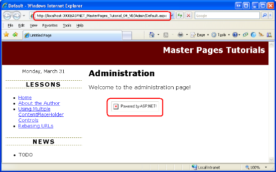
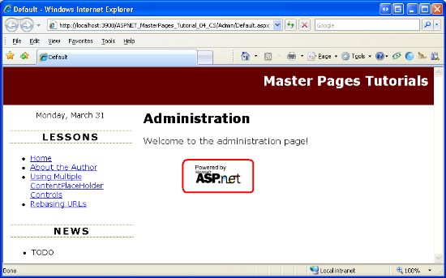

URLs in Master Pages (VB)
====================
by [Scott Mitchell](https://twitter.com/ScottOnWriting)

[Download Code](http://download.microsoft.com/download/e/e/f/eef369f5-743a-4a52-908f-b6532c4ce0a4/ASPNET_MasterPages_Tutorial_04_VB.zip) or [Download PDF](http://download.microsoft.com/download/8/f/6/8f6349e4-6554-405a-bcd7-9b094ba5089a/ASPNET_MasterPages_Tutorial_04_VB.pdf)

> Addresses how URLs in the master page can break due to the master page file being in a different relative directory than the content page. Looks at rebasing URLs via ~ in the declarative syntax and using ResolveUrl and ResolveClientUrl programmatically. (Also look at

## Introduction

In all the examples we've seen thus far, the master and content pages have been located in the same folder (the website's root folder). But there's no reason why the master and content pages must be in the same folder. You can certainly create content pages in subfolders. Similarly, you might create a `~/MasterPages/` folder where you place your site's master pages.

One potential issue with placing master and content pages in different folders involves broken URLs. If the master page contains relative URLs in hyperlinks, images, or other elements, the link will be invalid for content pages that reside in a different folder. In this tutorial we examine the source of this problem as well as workarounds.

## The Problem with Relative URLs

A URL on a web page is said to be a *relative URL* if the location of the resource it points to is relative to the web page's location in the website's folder structure. Any URL that does not start with a leading forward slash (`/`) or a protocol (such as `http://`) is relative because it is resolved by the browser based on the location of the web page that contains the URL.

For example, our website has an `~/Images/` folder with a single image file, `PoweredByASPNET.gif`. The master page file `Site.master` has an `` element in the `footerContent` region with the following markup:

[!code-html[Main](urls-in-master-pages-vb/samples/sample1.html)]

The `src` attribute value in the `` element is a relative URL because it does not start with `/` or `http://`. In short, the `src` attribute value tells the browser to look in the `Images` subfolder for a file named `PoweredByASPNET.gif`.

When visiting a content page, the above markup is sent directly to the browser. Take a moment to visit `About.aspx` and view the HTML source sent to the browser. You will find that the exact same markup in the master page was sent to the browser.

[!code-html[Main](urls-in-master-pages-vb/samples/sample2.html)]

If the content page is in the root folder (as is `About.aspx`) everything works as expected because there is an `Images` subfolder relative to the root folder. However, things break down if the content page is in a different folder than the master page. To illustrate this, create a subfolder named `Admin`. Next, add a content page named `Default.aspx` to the `Admin` folder, making sure to bind the new page to the `Site.master` master page.

> [!NOTE]
> In the [*Specifying the Title, Meta Tags, and Other HTML Headers in the Master Page*](specifying-the-title-meta-tags-and-other-html-headers-in-the-master-page-vb.md) tutorial we created a custom base page class named `BasePage` that automatically set the content page's title (if it was not explicitly assigned). Don't forget to have the newly created page's code-behind class derive from `BasePage` so that it can utilize this functionality.

After you have created this content page, your Solution Explorer should look similar to Figure 1.

**Figure 01**: A New Folder and ASP.NET Page Have Been Added to the Project

Next, update the `Web.sitemap` file to include a new `<siteMapNode>` entry for this lesson. The following XML shows the complete `Web.sitemap` markup, which now includes the addition of a third `<siteMapNode>` element.

[!code-xml[Main](urls-in-master-pages-vb/samples/sample3.xml)]

The newly created `Default.aspx` page should have four Content controls corresponding to the four ContentPlaceHolders in `Site.master`. Add some text to the Content control referencing the `MainContent` ContentPlaceHolder and then visit the page through a browser. As Figure 2 shows, the browser cannot find the `PoweredByASPNET.gif` image file. What's going on here?

The `~/Admin/Default.aspx` content page is sent the same HTML for the `footerContent` region as was the `About.aspx` page:

[!code-html[Main](urls-in-master-pages-vb/samples/sample4.html)]

Because the `` element's `src` attribute is a relative URL, the browser attempts to look for an `Images` folder relative to the web page's folder location. In other words, the browser is looking for the image file `Admin/Images/PoweredByASPNET.gif`.

**Figure 02**: The `PoweredByASPNET.gif` Image File Cannot Be Found  ([Click to view full-size image](urls-in-master-pages-vb/_static/image4.png))

### Replacing Relative URLs with Absolute URLs

The opposite of a relative URL is an *absolute URL*, which is one that starts with a forward slash (`/`) or a protocol such as `http://`. Because an absolute URL specifies the location of a resource from a known fixed point, the same absolute URL is valid in any web page, regardless of the web page's location in the website's folder structure.

To remedy the broken image shown in Figure 2, we need to update the `` element's `src` attribute so that it uses an absolute URL instead of a relative one. To determine the correct absolute URL, visit one of the web pages in your website and examine the Address bar. As the Address bar in Figure 2 shows, the fully qualified path to the web application is `http://localhost:3908/ASPNET_MasterPages_Tutorial_04_VB/`. Therefore, we could update the `` element's `src` attribute to either of the following two absolute URLs:

- `/ASPNET_MasterPages_Tutorial_04_VB/Images/PoweredByASPNET.gif`
- `http://localhost:3908/ASPNET_MasterPages_Tutorial_04_VB/Images/PoweredByASPNET.gif`

Take a moment to update the `` element's `src` attribute to an absolute URL using one of the forms shown above and then visit the `~/Admin/Default.aspx` page through a browser. This time the browser will correctly find and display the `PoweredByASPNET.gif` image file (see Figure 3).

**Figure 03**: The `PoweredByASPNET.gif` Image is Now Displayed  ([Click to view full-size image](urls-in-master-pages-vb/_static/image7.png))

While hard coding in the absolute URL works, it tightly couples your HTML to the website's server and folder location, which may change. Using an absolute URL of the form `http://localhost:3908/...` is brittle because the port number preceding localhost is selected automatically each time Visual Studio's built-in ASP.NET Development Web Server is started. Similarly, the `http://localhost` part is only valid when testing locally. Once the code is deployed to a production server, the URL base will change to something else, like `http://www.yourserver.com`. The absolute URL in the form `/ASPNET_MasterPages_Tutorial_04_VB/...` also suffers from the same brittleness because oftentimes this application path differs between development and production servers.

The good news is that ASP.NET offers a method for generating a valid relative URL at runtime.

## Using`~`and`ResolveClientUrl`

Rather than hard code an absolute URL, ASP.NET allows page developers to use the tilde (`~`) to indicate the root of the web application. For example, earlier in this tutorial I used the notation `~/Admin/Default.aspx` in the text to refer to the `Default.aspx` page in the `Admin` folder. The `~` indicates that the `Admin` folder is a subfolder of the web application's root.

The `Control` class's [`ResolveClientUrl` method](https://msdn.microsoft.com/en-us/library/system.web.ui.control.resolveclienturl.aspx) takes a URL and modifies it to a relative URL appropriate for the web page on which the control resides. For example, calling `ResolveClientUrl("~/Images/PoweredByASPNET.gif")` from `About.aspx` returns `Images/PoweredByASPNET.gif`. Calling it from `~/Admin/Default.aspx`, however, returns `../Images/PoweredByASPNET.gif`.

> [!NOTE]
> Because all ASP.NET server controls derive from the `Control` class, all server controls have access to the `ResolveClientUrl` method. Even the `Page` class derives from the `Control` class, meaning that you can use this method directly from your ASP.NET pages' code-behind classes.

### Using`~`in the Declarative Markup

Several ASP.NET Web controls include URL-related properties: the HyperLink control has a `NavigateUrl` property; the Image control has an `ImageUrl` property; and so on. When rendered, these controls pass their URL-related property values to `ResolveClientUrl`. Consequently, if these properties contain a `~` to indicate the root of the web application, the URL will be modified to a valid relative URL.

Keep in mind that only ASP.NET server controls transform the `~` in their URL-related properties. If a `~` appears in static HTML markup, such as ``, the ASP.NET engine sends the `~` to the browser along with the rest of the HTML content. The browser assumes that the `~` is part of the URL. For example, if the browser receives the markup `` it assumes there is a subfolder named `~` with a subfolder `Images` that contains the image file `PoweredByASPNET.gif`.

To fix the image markup in `Site.master`, replace the existing `` element with an ASP.NET Image Web control. Set the Image Web control's `ID` to `PoweredByImage`, its `ImageUrl` property to `~/Images/PoweredByASPNET.gif`, and its `AlternateText` property to "Powered by ASP.NET!"

[!code-aspx[Main](urls-in-master-pages-vb/samples/sample5.aspx)]

After making this change to the master page, revisit the `~/Admin/Default.aspx` page again. This time the `PoweredByASPNET.gif` image file appears in the page (see Figure 3). When the Image Web control is rendered it uses the `ResolveClientUrl` method to resolve its `ImageUrl` property value. In `~/Admin/Default.aspx` the `ImageUrl` is converted into an appropriate relative URL, as the following snippet of HTML source shows:

[!code-html[Main](urls-in-master-pages-vb/samples/sample6.html)]

> [!NOTE]
> In addition to being used in URL-based Web control properties, the `~` can also be used when calling the `Response.Redirect` and `Server.MapPath` methods, among others. Also, the `ResolveClientUrl` method may be invoked directly from an ASP.NET or master page's declarative markup, if needed; see [Fritz Onion](https://www.pluralsight.com/blogs/fritz/)'s blog entry [Using `ResolveClientUrl` in Markup](https://www.pluralsight.com/blogs/fritz/archive/2006/02/06/18596.aspx).

## Fixing the Master Page's Remaining Relative URLs

In addition to the `` element in the `footerContent` that we just fixed, the master page contains one more relative URL that requires our attention. The `topContent` region includes the link "Master Pages Tutorials," which points to `Default.aspx`.

[!code-html[Main](urls-in-master-pages-vb/samples/sample7.html)]

Because this URL is relative, it will send the user to the `Default.aspx` page in the folder of the content page they are visiting. To have this link always point to `Default.aspx` in the root folder we need to replace the `<a>` element with a HyperLink Web control so that we can use the `~` notation.

Remove the `<a>` element markup and add a HyperLink control in its place. Set the HyperLink's `ID` to `lnkHome`, its `NavigateUrl` property to `~/Default.aspx`, and its `Text` property to "Master Pages Tutorials."

[!code-aspx[Main](urls-in-master-pages-vb/samples/sample8.aspx)]

That's it! At this point all the URLs in our master page are properly based when rendered by a content page regardless of what folders the master page and content page are located in.

### Automatic URL Resolution in the`<head>`Section

In the [*Creating a Site-Wide Layout Using Master Pages*](creating-a-site-wide-layout-using-master-pages-vb.md) tutorial we added a `<link>` to the `Styles.css` file in the `<head>` region:

[!code-aspx[Main](urls-in-master-pages-vb/samples/sample9.aspx)]

While the `<link>` element's `href` attribute is relative, it's automatically converted to an appropriate path at runtime. As we discussed in the [*Specifying the Title, Meta Tags, and Other HTML Headers in the Master Page*](specifying-the-title-meta-tags-and-other-html-headers-in-the-master-page-vb.md) tutorial, the `<head>` region is actually a server-side control, which enables it to modify the contents of its inner controls when it is rendered.

To verify this, revisit the `~/Admin/Default.aspx` page and view the HTML source sent to the browser. As the snippet below illustrates, the `<link>` element's `href` attribute has been automatically modified to an appropriate relative URL, `../Styles.css`.

[!code-html[Main](urls-in-master-pages-vb/samples/sample10.html)]

## Summary

Master pages very often include links, images, and other external resources that must be specified via a URL. Because the master page and content pages might not exist in the same folder, it is important to abstain from using relative URLs. While it is possible to use hard coded absolute URLs, doing so tightly couples the absolute URL to the web application. If the absolute URL changes - as it often does when moving or deploying a web application - you'll have to remember to go back and update the absolute URLs.

The ideal approach is to use the tilde (`~`) to indicate the application root. ASP.NET Web controls that contain URL-related properties map the `~` to the application root at runtime. Internally, the Web controls use the `Control` class's `ResolveClientUrl` method to generate a valid relative URL. This method is public and available from every server control (including the `Page` class), so you can use it programmatically from your code-behind classes, if needed.

Happy Programming!

### Further Reading

For more information on the topics discussed in this tutorial, refer to the following resources:

- [Master Pages in ASP.NET](http://www.odetocode.com/Articles/419.aspx)
- [URL Rebasing in a Master Page](https://quickstarts.asp.net/QuickStartv20/aspnet/doc/masterpages/default.aspx#urls)
- [Using `ResolveClientUrl` in Markup](https://www.pluralsight.com/blogs/fritz/archive/2006/02/06/18596.aspx)

### About the Author

[Scott Mitchell](http://www.4guysfromrolla.com/ScottMitchell.shtml), author of multiple ASP/ASP.NET books and founder of 4GuysFromRolla.com, has been working with Microsoft Web technologies since 1998. Scott works as an independent consultant, trainer, and writer. His latest book is [*Sams Teach Yourself ASP.NET 3.5 in 24 Hours*](https://www.amazon.com/exec/obidos/ASIN/0672327384/4guysfromrollaco). Scott can be reached at [mitchell@4GuysFromRolla.com](mailto:mitchell@4GuysFromRolla.com) or via his blog at [http://ScottOnWriting.NET](http://scottonwriting.net/).

### Special Thanks To

Interested in reviewing my upcoming MSDN articles? If so, drop me a line at [mitchell@4GuysFromRolla.com](mailto:mitchell@4GuysFromRolla.com).

>[!div class="step-by-step"]
[Previous](specifying-the-title-meta-tags-and-other-html-headers-in-the-master-page-vb.md)
[Next](control-id-naming-in-content-pages-vb.md)