Part 1: File-> New Project
====================
by [Joe Stagner](https://github.com/JoeStagner)

> Tailspin Spyworks demonstrates how extraordinarily simple it is to create powerful, scalable applications for the .NET platform. It shows off how to use the great new features in ASP.NET 4 to build an online store, including shopping, checkout, and administration.
> 
> This tutorial series details all of the steps taken to build the Tailspin Spyworks sample application. Part 1 covers Overview and File/New Project.

##   Overview

This tutorial is an introduction to ASP.NET WebForms. We'll be starting slowly, so beginner level web development experience is okay.

The application we'll be building is a simple on-line store.

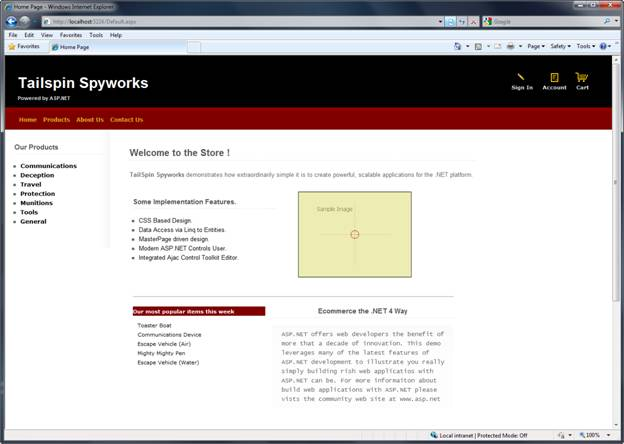

Visitors can browse Products by Category:

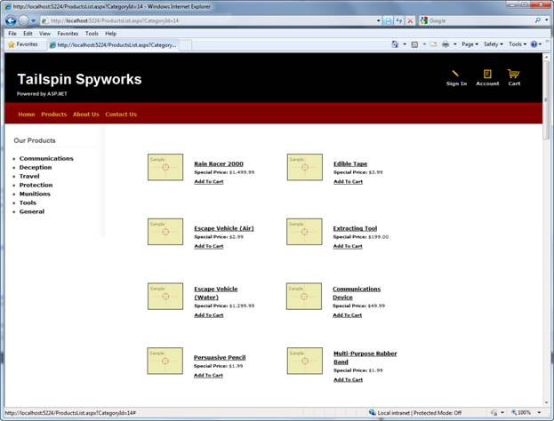

They can view a single product and add it to their cart:

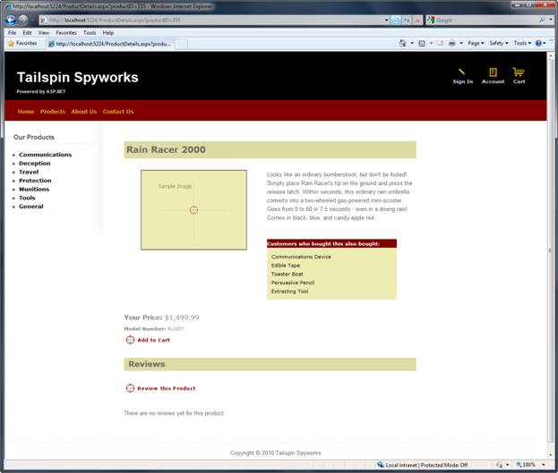

They can review their cart, removing any items they no longer want:

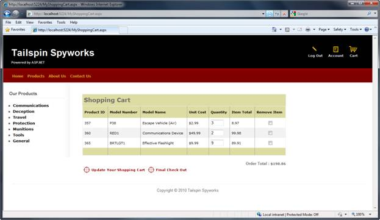

Proceeding to Checkout will prompt them to

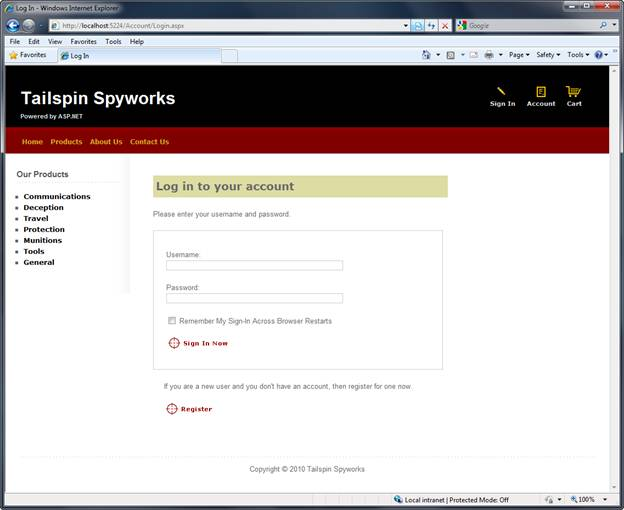

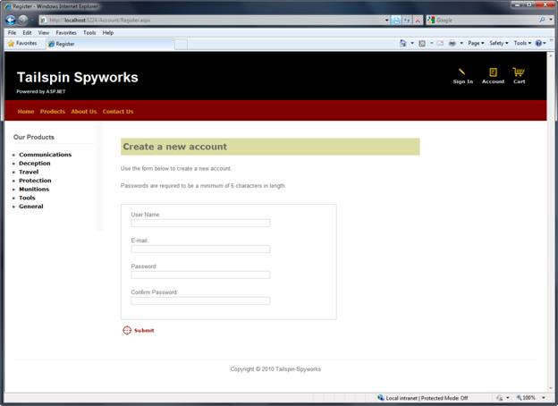

After ordering, they see a simple confirmation screen:

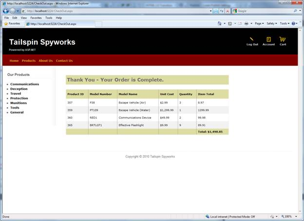

We'll begin by creating a new ASP.NET WebForms project in Visual Studio 2010, and we'll incrementally add features to create a complete functioning application. Along the way, we'll cover database access, list and grid views, data update pages, data validation, using master pages for consistent page layout, AJAX, validation, user membership, and more.

You can follow along step by step, or you can download the completed application from [http://tailspinspyworks.codeplex.com/](http://tailspinspyworks.codeplex.com/)

You can use either Visual Studio 2010 or the free Visual Web Developer 2010 from [https://www.microsoft.com/express/Web/](https://www.microsoft.com/express/Web/). To build the application, you can use either SQL Server or the free SQL Server Express to host the database.

##   File / New Project

We'll start by selecting the New Project from the File menu in Visual Studio. This brings up the New Project dialog.

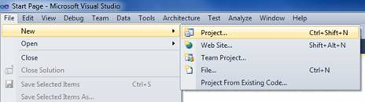

We'll select the Visual C# / Web Templates group on the left, and then choose the "ASP.NET Web Application" template in the center column. Name your project TailspinSpyworks and press the OK button.

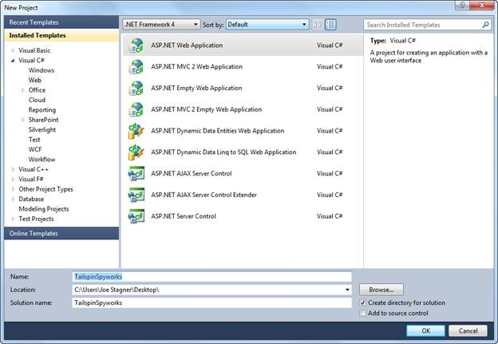

This will create our project. Let's take a look at the folders that are included in our application in the Solution Explorer on the right side.

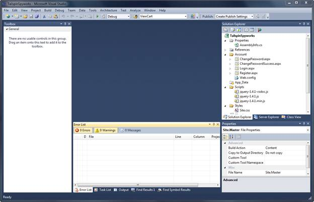

The Empty Solution isn't completely empty – it adds a basic folder structure:

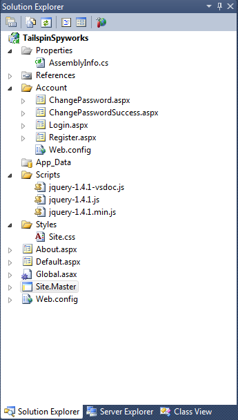

Note the conventions implemented by the ASP.NET 4 default project template.

- The "Account" folder implements a basic user interface for ASP.NET's membership subsystem.
- The "Scripts" folder serves as the repository for client side JavaScript files and the core jQuery .js files are made available by default.
- The "Styles" folder is used to organize our web site visuals (CSS Style Sheets)

When we press F5 to run our application and render the default.aspx page we see the following.

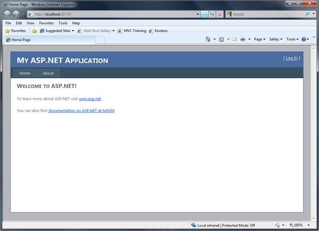

Our first application enhancement will be to replace the Style.css file from the default WebForms template with the CSS classes and associated image files that will render the visual asthetics that we want for our Tailspin Spyworks application.

After doing so our default.aspx page renders like this.

Notice the image links at the top right of the page and the menu items that have been added to the master page. Only the "Sign In" and "Account" links point to pages that exist (generated by the default template) and the rest of the pages we will implement as we build our application.

We're also going to relocate the Master Page to the Styles directory. Though this is only a preference it may make things a little easier if we decide to make our application "skinable" in the future.

After doing this we'll need to change the master page references in all the .aspx files generated by the default ASP.NET WebForms pages.

>[!div class="step-by-step"]
[Next](tailspin-spyworks-part-2.md)