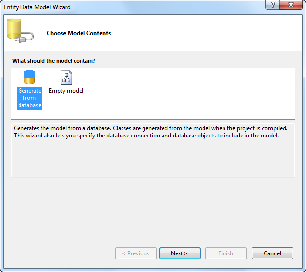
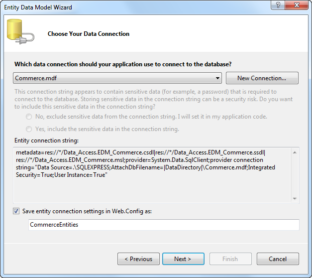
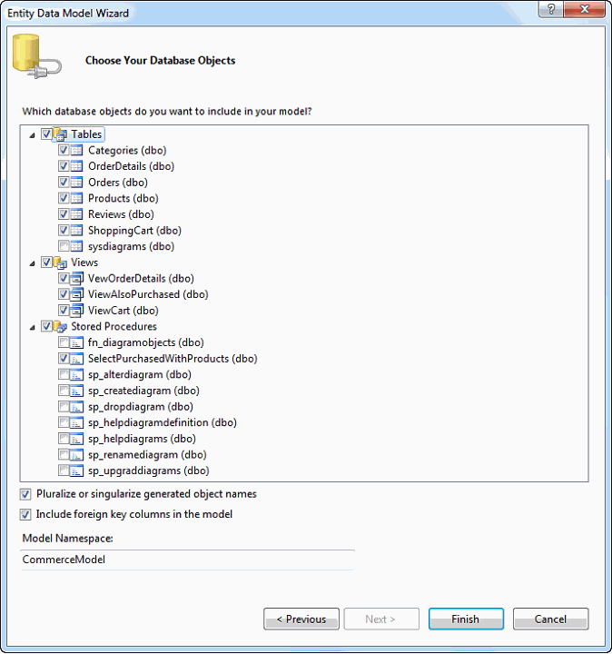
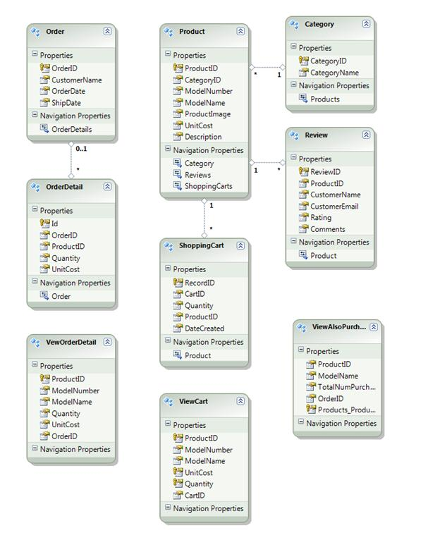

Part 2: Data Access Layer
====================
by [Joe Stagner](https://github.com/JoeStagner)

> Tailspin Spyworks demonstrates how extraordinarily simple it is to create powerful, scalable applications for the .NET platform. It shows off how to use the great new features in ASP.NET 4 to build an online store, including shopping, checkout, and administration.
> 
> This tutorial series details all of the steps taken to build the Tailspin Spyworks sample application. Part 2 covers adding the data access layer.

##   Adding the Data Access Layer

Our ecommerce application will depend on two databases.

For customer information we'll use the standard ASP.NET Membership database. For our shopping cart and product catalog we'll implement a SQL Express database as follows.

Having created the database (Commerce.mdf) in the application's App\_Data folder we can proceed to create our Data Access Layer using the .NET Entity Framework.

We'll create a folder named "Data\_Access" and them right click on that folder and select "Add New Item".

In the "Installed Templates" item and then select "ADO.NET Entity Data Model" enter EDM\_Commerce.edmx as the name and click the "Add" button.

Choose "Generate from Database".

Save and build.

Now we are ready to add our first feature – a product category menu.

>[!div class="step-by-step"]
[Previous](tailspin-spyworks-part-1.md)
[Next](tailspin-spyworks-part-3.md)