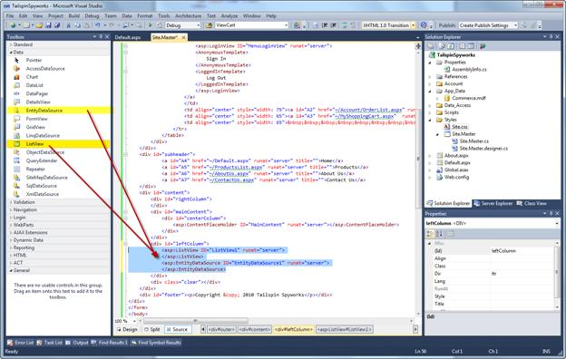
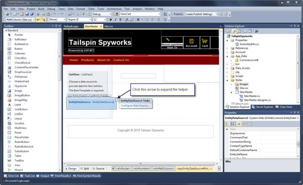
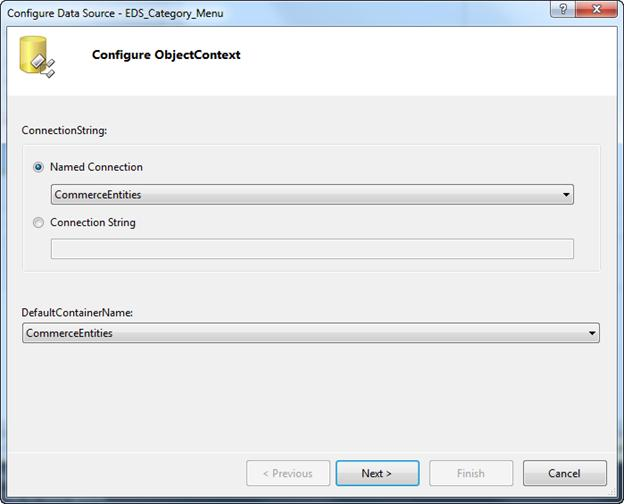
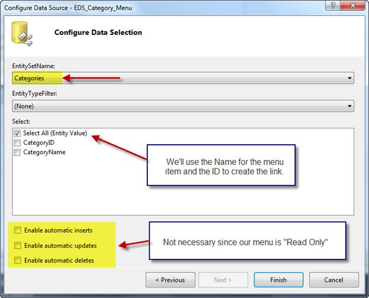
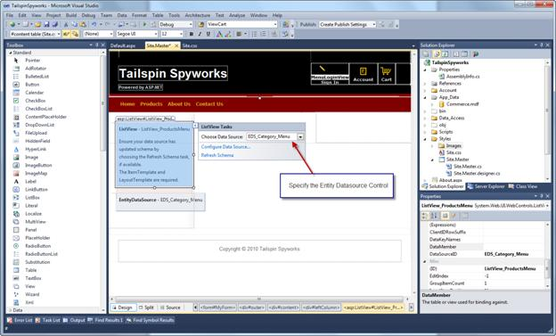
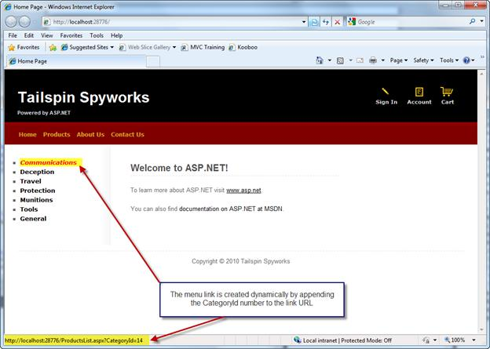

Part 3: Layout and Category Menu
====================
by [Joe Stagner](https://github.com/JoeStagner)

> Tailspin Spyworks demonstrates how extraordinarily simple it is to create powerful, scalable applications for the .NET platform. It shows off how to use the great new features in ASP.NET 4 to build an online store, including shopping, checkout, and administration.
> 
> This tutorial series details all of the steps taken to build the Tailspin Spyworks sample application. Part 3 covers adding layout and a category menu.

##   Adding Some Layout and a Category Menu

In our site master page we'll add a div for the left side column that will contain our product category menu.

[!code-aspx[Main](tailspin-spyworks-part-3/samples/sample1.aspx)]

Note that the desired aligning and other formatting will be provided by the CSS class that we added to our Style.css file.

[!code-css[Main](tailspin-spyworks-part-3/samples/sample2.css)]

The product category menu will be dynamically created at runtime by querying the Commerce database for existing product categories and creating the menu items and corresponding links.

To accomplish this we will use two of ASP.NET's powerful data controls. The "Entity Data Source" control and the "ListView" control.

Let's switch to "Design View" and use the helpers to configure our controls.

Let's set the EntityDataSource ID property to EDS\_Category\_Menu and click on "Configure Data Source".

Select the CommerceEntities Connection that was created for us when we created the Entity Data Source Model for our Commerce Database and click "Next".

Select the "Categories" Entity set name and leave the rest of the options as default. Click "Finish".

Now let's set the ID property of the ListView control instance that we placed on our page to ListView\_ProductsMenu and activate its helper.

Though we could use control options to format the data item display and formatting, our menu creation will only require simple markup so we will enter the code in the source view.

[!code-aspx[Main](tailspin-spyworks-part-3/samples/sample3.aspx)]

Please note the "Eval" statement : &lt;%# Eval("CategoryName") %&gt;

The ASP.NET syntax &lt;%# %&gt; is a shorthand convention that instructs the runtime to execute whatever is contained within and output the results "in Line".

The statement Eval("CategoryName") instructs that, for the current entry in the bound collection of data items, fetch the value of the Entity Model item names "CatagoryName". This is concise syntax for a very powerful feature.

Lets run the application now.

Note that our product category menu is now displayed and when we hover over one of the category menu items we can see the menu item link points to a page we have yet to implement named ProductsList.aspx and that we have built a dynamic query string argument that contains the category id.

>[!div class="step-by-step"]
[Previous](tailspin-spyworks-part-2.md)
[Next](tailspin-spyworks-part-4.md)