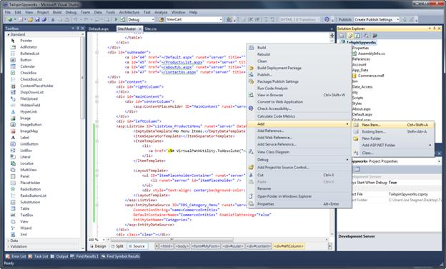
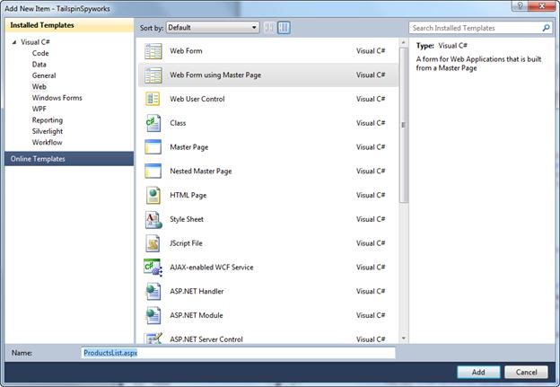
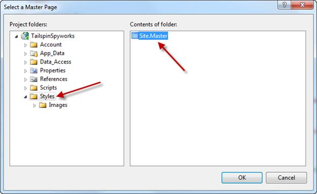
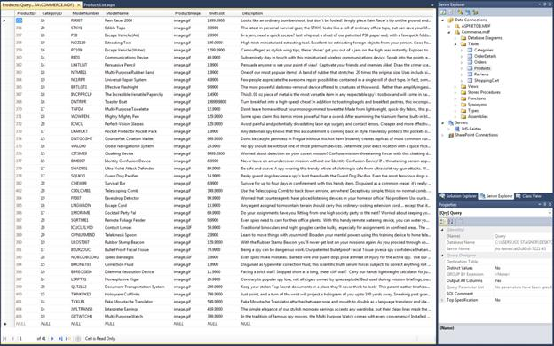
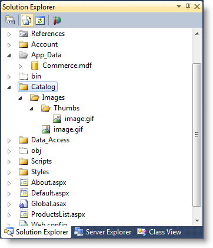
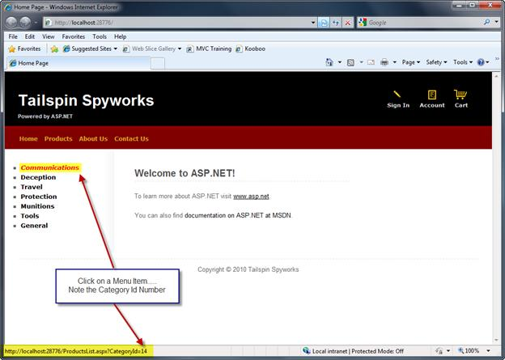
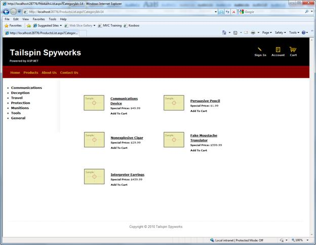

[Edit .md file](C:\Projects\msc\dev\Msc.Www\Web.ASP\App_Data\github\web-forms\overview\older-versions-getting-started\tailspin-spyworks\tailspin-spyworks-part-4.md) | [Edit dev content](http://www.aspdev.net/umbraco#/content/content/edit/25227) | [View dev content](http://docs.aspdev.net/tutorials/web-forms/overview/older-versions-getting-started/tailspin-spyworks/tailspin-spyworks-part-4.html) | [View prod content](http://www.asp.net/web-forms/overview/older-versions-getting-started/tailspin-spyworks/tailspin-spyworks-part-4) | Picker: 27469

Part 4: Listing Products
====================
by [Joe Stagner](https://github.com/JoeStagner)

> Tailspin Spyworks demonstrates how extraordinarily simple it is to create powerful, scalable applications for the .NET platform. It shows off how to use the great new features in ASP.NET 4 to build an online store, including shopping, checkout, and administration.
> 
> This tutorial series details all of the steps taken to build the Tailspin Spyworks sample application. Part 4 covers listing products with the GridView control.

##   Listing Products with the GridView Control

Let's begin implementing our ProductsList.aspx page by "Right Clicking" on our solution and selecting "Add" and "New Item".

Choose "Web Form Using Master Page" and enter a page name of ProductsList.aspx".

Click "Add".

Next choose the "Styles" folder where we placed the Site.Master page and select it from the "Contents of folder" window.

Click "Ok" to create the page.

Our database is populated with product data as seen below.

After our page is created we'll again use an Entity Data Source to access that product data, but in this instance we need to select the Product Entities and we need to restrict the items that are returned to only those for the selected Category.

To accomplish this we'll tell the EntityDataSource to Auto Generate the WHERE clause and we'll specify the WhereParameter.

You'll recall that when we created the Menu Items in our "Product Category Menu" we dynamically built the link by adding the CatagoryID to the QueryString for each link. We will tell the Entity Data Source to derive the WHERE parameter from that QueryString parameter.

    <asp:EntityDataSource ID="EDS_ProductsByCategory" runat="server"  
                          EnableFlattening="False" AutoGenerateWhereClause="True"
                          ConnectionString="name=CommerceEntities"  
                          DefaultContainerName="CommerceEntities" 
                          EntitySetName="Products">
    <WhereParameters>
            <asp:QueryStringParameter Name="CategoryID" 
                                            QueryStringField="Category Id" 
                                            Type="Int32" />
           </WhereParameters>
    </asp:EntityDataSource>

Next, we'll configure the ListView control to display a list of products. To create an optimal shopping experience we'll compact several concise features into each individual product displayed in our ListVew.

- The product name will be a link to the product's detail view.
- The product's price will be displayed.
- An image of the product will be displayed and we'll dynamically select the image from a catalog images directory in our application.
- We will include a link to immediately add the specific product to the shopping cart.

Here is the markup for our ListView control instance.

    <asp:ListView ID="ListView_Products" runat="server" 
                  DataKeyNames="ProductID"  
                  DataSourceID="EDS_ProductsByCategory" 
                  GroupItemCount="2">
       <EmptyDataTemplate>
          <table runat="server">
            <tr>
              <td>No data was returned.</td>
            </tr>
         </table>
      </EmptyDataTemplate>
      <EmptyItemTemplate>
         <td runat="server" />
      </EmptyItemTemplate>
      <GroupTemplate>
        <tr ID="itemPlaceholderContainer" runat="server">
          <td ID="itemPlaceholder" runat="server"></td>
        </tr>
      </GroupTemplate>
      <ItemTemplate>
        <td runat="server">
          <table border="0" width="300">
            <tr>
              <td>&nbsp</td>
              <td>
                <a href='ProductDetails.aspx?productID=<%# Eval("ProductID") %>'>
                   <image src='Catalog/Images/Thumbs/<%# Eval("ProductImage") %>' 
                          width="100" height="75" border="0">
                </a> &nbsp
              </td>
              <td>
                <a href='ProductDetails.aspx?productID=<%# Eval("ProductID") %>'><%# Eval("ModelName") %> 
                </a>
                
                  <b>Special Price: </b><%# Eval("UnitCost", "{0:c}")%>
                 
                <a href='AddToCart.aspx?productID=<%# Eval("ProductID") %>'>
                   <b>Add To Cart<b>
                </a>
              </td>
            </tr>
          </table>
        </td>
      </ItemTemplate>
      <LayoutTemplate>
        <table runat="server">
          <tr runat="server">
            <td runat="server">
              <table ID="groupPlaceholderContainer" runat="server">
                <tr ID="groupPlaceholder" runat="server"></tr>
              </table>
            </td>
          </tr>
          <tr runat="server"><td runat="server"></td></tr>
        </table>
      </LayoutTemplate>
    </asp:ListView>

We are dynamically building several links for each displayed product.

Also, before we test own new page we need to create the directory structure for the product catalog images as follows.

Once our product images are accessible we can test our product list page.

From the site's home page, click on one of the Category List Links.

Now we need to implement the ProductDetials.apsx page and the AddToCart functionality.

Use File-&gt;New to create a page name ProductDetails.aspx using the site Master Page as we did previously.

We will again use an EntityDataSource control to access the specific product record in the database and we will use an ASP.NET FormView control to display the product data as follows.

    <asp:FormView ID="FormView_Product" runat="server" DataKeyNames="ProductID" 
                                                               DataSourceID="EDS_Product">
      <ItemTemplate>
        
<%# Eval("ModelName") %>
 
          <table  border="0">
            <tr>
              <td>
                '  border="0" 
                                                           alt='<%# Eval("ModelName") %>' />
              </td>
              <td><%# Eval("Description") %>
                                     
              </td>
            </tr>
          </table>
          <b>Your Price:</b> <%# Eval("UnitCost", "{0:c}")%> 
            
          
            <b>Model Number:</b> <%# Eval("ModelNumber") %>
           
          <a href='AddToCart.aspx?ProductID=
            <%# Eval("ProductID") %>'> 
            
          </a>
                  
        </ItemTemplate>
      </asp:FormView>
      <asp:EntityDataSource ID="EDS_Product" runat="server" AutoGenerateWhereClause="True"  
                            EnableFlattening="False" 
                            ConnectionString="name=CommerceEntities" 
                            DefaultContainerName="CommerceEntities" 
                            EntitySetName="Products" 
                            EntityTypeFilter="" 
                            Select="" Where="">
        <WhereParameters>
          <asp:QueryStringParameter Name="ProductID" 
                                    QueryStringField="productID"  Type="Int32" />
        </WhereParameters>
      </asp:EntityDataSource>

Don't worry if the formatting looks a bit funny to you. The markup above leaves room in the display layout for a couple of features we'll implement later on.

The Shopping Cart will represent the more complex logic in our application. To get started, use File-&gt;New to create a page called MyShoppingCart.aspx.

Note that we are not choosing the name ShoppingCart.aspx.

Our database contains a table named "ShoppingCart". When we generated an Entity Data Model a class was created for each table in the database. Therefore, the Entity Data Model generated an Entity Class named "ShoppingCart". We could edit the model so that we could use that name for our shopping cart implementation or extend it for our needs, but we will opt instead to simply slect a name that will avoid the conflict.

It's also worth noting that we will be creating a simple shopping cart and embedding the shopping cart logic with the shopping cart display. We might also choose to implement our shopping cart in a completely separate Business Layer.

>[!div class="step-by-step"] [Previous](tailspin-spyworks-part-3.md) [Next](tailspin-spyworks-part-5.md)